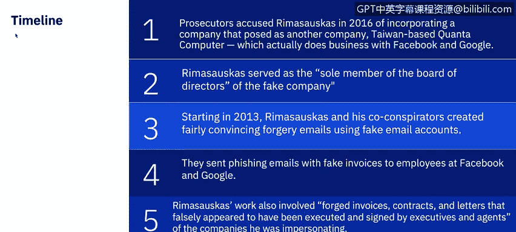
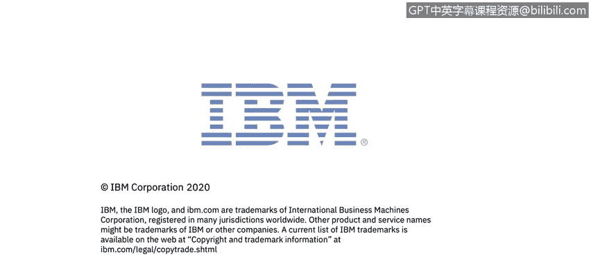

# 课程7：《网络安全顶级项目：入侵响应案例研究》：32：钓鱼攻击案例研究：谷歌与Facebook

## 📖 概述

在本节课中，我们将深入剖析一起针对谷歌和Facebook的钓鱼攻击案例。我们将了解攻击事件的时间线、威胁行为者与公司采取的行动，以及攻击造成的具体影响。

---

## 🕰️ 攻击事件时间线

上一节我们概述了钓鱼攻击的潜在危害，本节中我们来看看这起具体攻击是如何一步步实施的。

根据美国纽约南区检察官办公室的信息，诈骗者在2013年至2015年间，通过一种极具创意的方式从Facebook和谷歌窃取了超过1亿美元。他们设立了一家假冒公司，并向这两家科技巨头的员工发送钓鱼邮件，最终成功骗取了巨额资金。

以下是攻击事件的详细时间线：

*   **2013年**：Rimasauskas（攻击者）注册了一家假冒公司，伪装成与Facebook和谷歌有业务往来的台湾广达电脑公司。他作为这家假公司的唯一董事会成员，以其名义在多家银行开设并控制了账户。
*   **2013-2015年**：Rimasauskas及其同谋者创建了极具说服力的伪造邮件。他们使用看似由真实广达公司员工发送的虚假邮箱地址，向负责与广达进行数百万美元交易的Facebook和谷歌员工发送带有虚假发票的钓鱼邮件。
*   **收到邮件后**：相关员工未加详查，便向假冒公司的银行账户支付了总计超过1亿美元的资金。
*   **伪造文件**：为增强可信度，攻击者还伪造了发票、合同和信件，使其看起来像是被冒充公司的执行官或代理人签署和执行。
*   **规避银行审查**：该骗局甚至通过制作带有假冒公司印章的虚假交易支持文件，来试图避免银行的怀疑。

---

## 🎯 攻击的脆弱点分析

即使像谷歌和Facebook这样的科技巨头，也容易成为针对性钓鱼攻击的目标。让我们快速分析一下他们最脆弱的环节在哪里。

需要明确的是，一些关于此案的夸张报道（称攻击者只是“开口要钱”）低估了其诈骗手段的复杂性。实施此类攻击需要精心的伪造和对目标公司内部财务运作的深入了解。FBI警告称，攻击者通常会提前使用恶意软件或入侵账户来渗透目标网络，并潜伏数周，观察计费系统和内部通信，然后才采取行动。

对于谷歌和Facebook，主要的脆弱点在于：

*   **鱼叉式钓鱼**：攻击专门针对拥有支付发票权限的财务团队。
*   **系统**：由于这是“常规业务”，任何威胁检测系统都被绕过了。
*   **人员**：与广达的业务往来是财务团队的日常工作一部分，因此无人怀疑威胁，导致了延迟响应。

正是由于缺乏有效的检测，Facebook和谷歌支付了总计1亿美元。

---

## 💰 攻击造成的损失

那么，这次入侵的成本是多少？

以下是本次攻击造成的主要损失：

*   **直接经济损失**：2015年，Facebook被骗取9800万美元；谷歌被骗取超过2300万美元。幸运的是，在骗局被发现且Rimasauskas被捕后，两家公司追回了大部分资金。
*   **法律后果**：Rimasauskas最终在2019年7月被判入狱30年。
*   **声誉损失**：此外，还需考虑负面宣传带来的成本。每当有关于数据泄露的媒体报道时，公司的脆弱性就会被公之于众。

---

## 🛡️ 钓鱼攻击的防范措施

了解了攻击的代价后，我们来看看如何防止此类或其他钓鱼攻击。

以下是几种关键的防范措施：

*   **公司注册监管**：利用相对宽松的注册规则是本案的关键。对来自已知诈骗高发地区的商业通信保持警惕。
*   **早期检测**：如果诈骗者策划了此类骗局，早期检测至关重要。定期审查发票和付款相关通信的准确性，检查联系信息是否长期一致，可以提供重要的早期预警。
*   **流程加固**：可以调整付款流程，将针对商务邮件诈骗的防护措施融入常规程序。例如，实施双因素认证（**2FA**），要求进行电话验证。

---

## 🔧 其他钓鱼攻击预防技术

除了上述措施，我们还可以讨论一些其他的预防技术。

以下是一些有效的技术和管理手段：

*   **邮件系统配置**：调整电子邮件系统，例如自动标记“发件人”与“回复”地址不匹配的邮件，或为内部邮件设置特定颜色显示。
*   **员工培训**：通过模拟钓鱼场景对员工进行教育和培训。
*   **部署垃圾邮件过滤器**：部署能检测病毒、空发件人等非标准邮件行为的垃圾邮件过滤器。
*   **系统与软件更新**：保持所有系统安装最新的安全补丁和更新。安装防病毒软件，并定期更新病毒库、监控所有设备的状态。
*   **制定安全策略**：制定包含密码过期和复杂性要求等内容的安全策略。
*   **部署网络过滤器**：部署网络过滤器以阻止恶意网站。
*   **数据加密**：对所有敏感的公司信息进行加密。
*   **邮件格式限制**：将HTML邮件转换为纯文本格式，或直接禁用HTML邮件。

---

## 📚 总结

本节课中，我们一起学习了针对谷歌和Facebook的钓鱼攻击案例。我们回顾了攻击的时间线，分析了其利用的脆弱点（鱼叉式钓鱼、绕过常规系统、人员疏忽），并总结了攻击造成的直接经济损失、法律后果及声誉损害。最后，我们探讨了从公司注册监管、早期检测、流程加固到技术配置和员工培训等多层面的防范措施。通过这个案例，我们可以看到，即使是最成熟的公司也需要保持警惕，并采取多层次的安全策略来应对日益复杂的网络威胁。

（注：请查阅附加资源，获取详细描述此次钓鱼骗局的两篇完整文章，以及一篇关于立陶宛的相关文章。）

接下来，Adam将讨论销售点攻击的概述。我将在本课程稍后部分回来讨论另一个案例研究。谢谢。