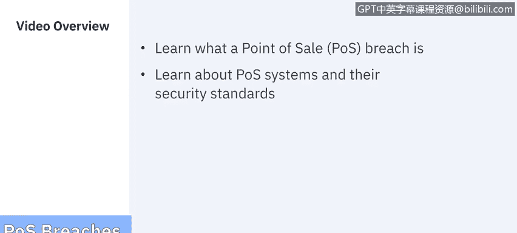
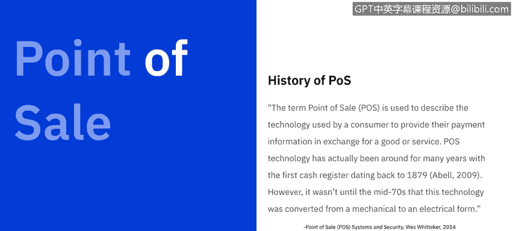
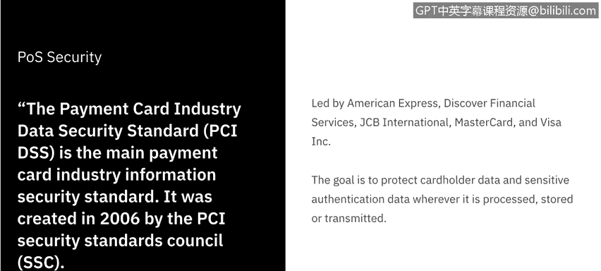
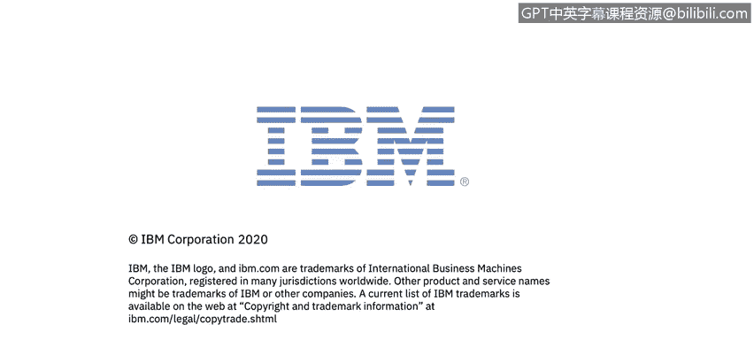

# 课程7：《网络安全顶级项目：入侵响应案例研究》：33：11_01：销售点入侵概述

## 🎯 概述

在本节课程中，我们将学习什么是销售点入侵，并了解销售点系统及其安全标准。

## 💳 什么是销售点入侵？

销售点入侵的主要目标是窃取您的16位信用卡号。60%的销售点交易是通过信用卡进行的，这对网络犯罪分子来说意味着巨大的利益。

受销售点数据泄露影响最大的行业通常是餐厅、零售店、杂货店和酒店。但数据泄露实际上更频繁地发生在中小型企业身上，因为与大型零售商的计算机网络相比，它们更容易被攻破。

## 📜 销售点技术简介

在SANS研究所的白皮书中，West Whittaker写道，“销售点”一词用于描述消费者为换取商品或服务而提供其支付信息所使用的技术。

销售点技术实际上已经存在多年，第一台收银机可以追溯到1879年。然而，直到70年代中期，这项技术才从机械形式转变为电子形式。在接下来的几年里，增加了对条形码扫描和支付卡读取的支持。

## 🛡️ 现代销售点安全标准

现代销售点系统都遵循同一安全标准。支付卡行业数据安全标准是主要的卡行业信息安全标准，它由PCI安全标准委员会于2006年创建。

PCI安全标准委员会由美国运通、发现金融服务、JCB国际、万事达和维萨公司领导。其目标是保护持卡人数据和敏感的身份验证数据，无论这些数据是在处理、存储还是传输过程中。

为了创建新标准，PCI DSS制定了一系列供行业采用的控制措施和流程。

## 📋 PCI DSS 安全控制与流程

以下是主要的安全控制和流程类别：

1.  建立和维护安全的网络和系统。
2.  保护持卡人数据。
3.  维护漏洞管理计划。
4.  实施强访问控制措施。
5.  定期监控和测试网络。
6.  维护信息安全政策。

为了使这些安全控制和流程得到满足，PCI DSS提出了12项不同的要求。

以下是这些要求：

*   安装并维护防火墙配置以保护持卡人数据。
*   不要使用供应商默认的系统密码和其他安全参数。
*   保护存储的持卡人数据。
*   在开放的公共网络上传输持卡人数据时进行加密。
*   使用并定期更新防病毒软件。
*   开发和维护安全的系统和应用程序。
*   根据业务需要限制对持卡人数据的访问。
*   为每个有计算机访问权限的人员分配唯一的ID。
*   限制对持卡人数据的物理访问。
*   跟踪和监控对所有网络资源和持卡人数据的访问。
*   定期测试安全系统和流程。
*   最后，维护一项涉及信息安全的政策。

## ❓ PCI DSS 足够吗？

即使有这12项不同的要求，网络安全威胁格局的不断变化让我们不禁要问：CI DSS足够吗？

根据一些行业专业人士的说法，答案是否定的。

Aneneo集团的一篇博客文章指出，2018年，与2017年同期相比，网络攻击在前几个月增加了32%。犯罪分子的威胁在不断演变并变得更加复杂。

仅仅符合PCI标准是不够的，企业需要采取额外的安全措施来保护敏感的持卡人数据及其支付技术投资。

## 🔒 企业如何保护支付基础设施？

以下是企业可以保护其支付基础设施的几种方法。

**第一种方式是半集成支付方法。** 通过这种方式，敏感的卡数据被隔离、加密，并直接从终端发送到预期的处理主机或网关。这样，支付或卡数据永远不会触及销售点系统，使其免受任何漏洞的影响。

**第二种可能性是集成点对点加密。** 点对点解决方案有助于在支付过程中保护传输中的卡数据。这是一种经过行业验证的解决方案，有助于保护敏感的卡数据免受网络犯罪分子的侵害。

**另一种方法是令牌化，它与点对点加密相辅相成。** 它用安全的加密令牌替换敏感信息，在数据静态存储时保护其免受网络犯罪侵害。经过多年的多次数据泄露，当前的PCI标准不允许企业保存和存储信用卡详细信息，除非在交易后将其令牌化在其销售点系统或数据库中。

当数据被令牌化后，它对任何网络犯罪分子来说都变得无用，因为它只能由支付处理器解码。

**另一个选择是MDM管理或移动设备管理。** 在许多情况下，许多企业可能使用消费级移动设备与其销售点系统配合工作。这就是MDM可以派上用场的地方。MDM是一种安全软件，允许企业远程部署并安全管理其移动销售点解决方案。该软件解决方案还有助于企业保护其移动销售点解决方案免受安全威胁。

**最后，也许是任何企业都不应缺少的一点，是进一步的员工教育。** 对员工进行有关基本安全协议的有效培训，有助于减少错误并更好地保护您的业务。

## 🔍 下一步：销售点恶意软件

上一节我们介绍了销售点入侵的基本概念和防护措施，下一节中，我们将深入探讨这些销售点入侵是如何通过销售点恶意软件发生的。

我们将在下一个视频中看到。

## 📝 总结

在本节课中，我们一起学习了销售点入侵的定义、其影响行业、相关的PCI DSS安全标准及其12项核心要求。我们还探讨了仅靠合规性不足以应对不断演变的威胁，并介绍了企业可以采取的额外保护措施，如半集成支付、点对点加密、令牌化、移动设备管理和员工教育。