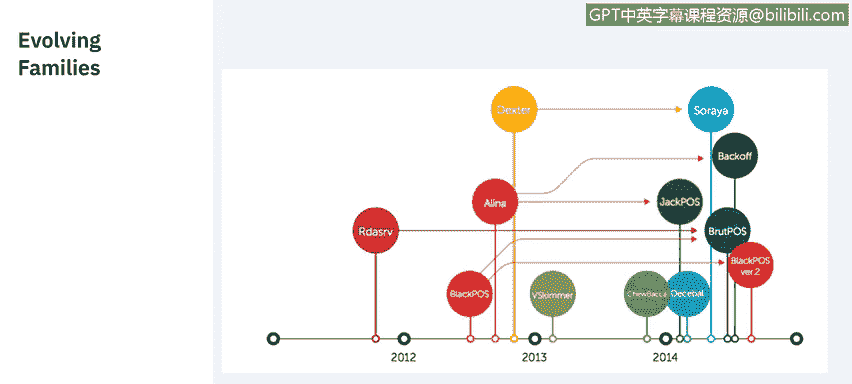

# 课程7：《网络安全顶级项目：入侵响应案例研究》：34：12_02_pos-malware.en_subtitled

## 概述

在本节课程中，我们将学习恶意软件如何入侵销售终端设备。我们将了解不同类型的销售终端恶意软件家族，并探讨信息被窃取后的流向。

## 销售终端恶意软件简介

欢迎来到由IBM带来的销售终端恶意软件课程。

销售终端系统需要某种网络连接，以便联系外部信用卡处理器。这对于验证信用卡交易是必要的。

技术足够熟练的攻击者可以大规模地针对企业的销售终端，一次性危害成千上万用户的信用卡。同样的网络连接也可被利用来帮助外泄任何被窃取的信息。

## 恶意软件的入侵与运作机制

上一节我们介绍了销售终端系统的基本概念，本节中我们来看看恶意软件如何利用这些系统。

大多数销售终端系统运行在Windows或Linux上，本质上它们就是小型计算机。网络犯罪分子通常通过公司的网络获得访问权限。一旦进入内部，销售终端恶意软件就可以选择要窃取哪些数据并上传到远程服务器。

大多数销售终端恶意软件都配备有后门以及命令与控制功能。

目前，行业对来自卡片磁条或芯片的敏感支付数据采用端到端加密，无论是在传输、接收还是存储时。解密只发生在销售终端设备的随机存取存储器中，数据在那里被处理。

销售终端恶意软件专门针对RAM，以窃取未加密的信息，这个过程被称为**内存抓取**。

## 常见的销售终端恶意软件家族

以下是当前最常见且易于获取的销售终端恶意软件家族列表：

*   **Alena家族**：该恶意软件扫描系统内存，检查内容是否匹配正则表达式，这些表达式指示了可被窃取的卡片信息的存在。
*   **V skimmer**：如果它找不到其服务器，它会检查是否存在带有特定标签的可移动驱动器。如果找到该驱动器，它会将包含任何被盗信息的文件放入其中，从而实现离线数据外泄。
*   **Dexter家族**：其信息窃取活动不仅限于窃取卡片信息，还会窃取各种系统信息，并在受影响的系统上安装键盘记录器。
*   **FYSNA恶意软件**：使用Tor网络与其命令与控制服务器通信，这使得恶意软件产生的所有网络流量极难分析，从而增加了检测和调查的难度。
*   **Deimbel恶意软件**：在运行前会检查机器上是否存在沙箱或分析工具，这使得检测和分析变得更加困难。
*   **最流行的BlackPOS**：使用文件传输协议将信息上传到攻击者选择的服务器，这允许攻击者将来自多个销售终端的数据整合到单个服务器上。

有两点需要注意：第一，销售终端恶意软件很少在没有其他恶意软件辅助的情况下单独使用。第二，我们称这些为恶意软件家族，因为它们会随着时间的推移而被改编和更新。

## 恶意软件的演变

让我们继续看看其中一些更新。

正如你所见，我们讨论过的大多数恶意软件或其别名，都已经被改编、更新或改变成新的改进版本，这些版本要么提供新功能，要么更难以检测。

不过，它们都有一个共同点：都是为了窃取金融数据。

## 数据失窃后的流向

现在你可能会问，如果我的数据通过销售终端漏洞被窃取，会发生什么？

让我们现在来探讨这个问题。

一旦你的数据被窃取，犯罪分子会将信息卖给中间商，这些中间商批量购买支付卡信息，然后将信息卖给“套现者”。

套现者是那些使用套现网站（例如左边这个）来获取支付信息的人，他们会用这些信息购买预付信用卡。

这些信用卡将被用来购买礼品卡。然后礼品卡被用来购买商品以转售获利。

为了增加追踪难度，商品不会直接运送给最终用户。它们被运送给一个转运商，然后由转运商运送给最终用户，这使得交易从头到尾都很难追踪。

## 如何防范销售终端漏洞

那么，我们如何防止销售终端漏洞呢？事实证明，最好的进攻就是良好的防御。

通常，黑客通过钓鱼攻击、销售终端软件中未修补的漏洞或类似的风险进入你的网络。

最明智的预防方法是利用工具进行实时检测和PCI合规性监控。

以下是一系列最佳实践列表：

*   **主动监控**：主动监控你的销售终端网络是否有变化。
*   **使用合规加密**：围绕持卡人数据使用合规、一流且端到端的加密。
*   **限制主机通信**：限制可与你的销售终端系统通信的主机。
*   **采用芯片卡终端**：采用支持芯片卡的销售终端。
*   **员工筛查与培训**：利用员工筛查和培训，以最小化内部威胁。
*   **培训员工识别异常**：培训员工立即检测并报告可能的篡改迹象。

## 总结

本节课中，我们一起学习了销售终端恶意软件的入侵方式、主要家族及其运作特点，了解了失窃数据的后续流向，并掌握了防范此类漏洞的关键最佳实践。理解这些知识对于识别和防御针对支付系统的网络威胁至关重要。