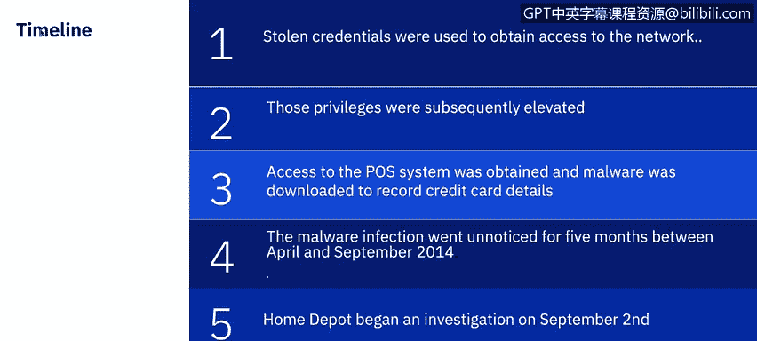
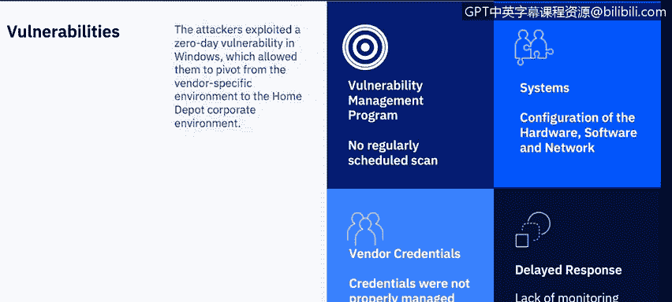
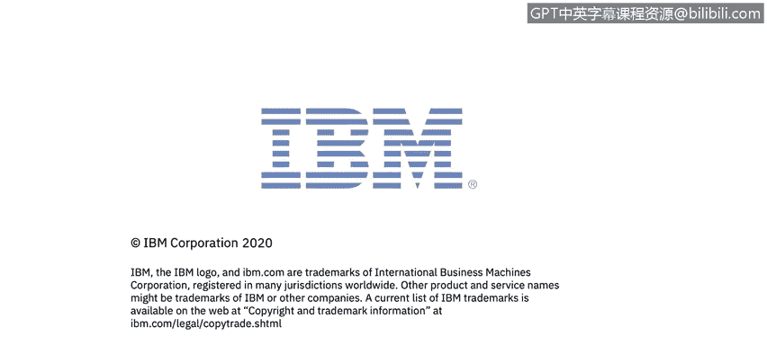

# 课程7：《网络安全顶级项目：入侵响应案例研究》：35：13_01_pos-case-study-home-depot｜ 🏠

## 概述
在本节课程中，我们将通过一个具体的案例研究，深入了解零售业中常见的销售终端攻击。我们将以家得宝公司2014年遭遇的数据泄露事件为例，分析攻击的时间线、攻击者采取的行动、事件造成的影响以及可以从中吸取的安全教训。

---

## 攻击摘要 🔍
上一节我们介绍了零售业数据泄露的背景，本节中我们来看看家得宝公司的具体案例。家得宝是2014年众多零售数据泄露事件的受害者之一。不幸的是，攻击者渗透其销售终端网络并窃取支付卡数据的方式，与2013年发生的塔吉特公司数据泄露事件所使用的方法有诸多相似之处。

攻击者利用一家第三方供应商的登录凭证，成功进入了家得宝公司的供应商环境。一旦进入家得宝网络，他们便在超过7500台自助结账销售终端上安装了内存抓取恶意软件。该恶意软件窃取了5600万张信用卡和借记卡的数据。此外，它还窃取了5300万个电子邮件地址。

被盗的支付卡被挂售，并由“卡贩”购买。卡贩是活跃在被称为“卡料论坛”网站上的参与者。大多数卡料论坛都从事被盗身份信息、被盗信用卡号和虚假登录凭证的买卖。被盗的电子邮件地址则被用于发起大规模的网络钓鱼活动。

---

## 攻击时间线 ⏳
接下来，我们详细梳理一下攻击发生的时间线。

攻击者首先利用了从一家零售商供应商处窃取的凭证来获取网络访问权限。随后，他们提升了权限，并借此访问了销售终端系统，下载了用于记录信用卡详细信息的恶意软件。

这次恶意软件感染在2014年4月至9月期间持续了五个月未被发现。家得宝公司解释说，调查始于9月2日，当时他们仍在努力查明泄露的实际范围和影响。2014年9月8日，家得宝发布声明，确认其支付卡系统遭到入侵。家得宝表示，将为自2014年4月起使用其支付卡并受影响的客户提供免费的信用监控服务，并就数据泄露事件致歉。

---

## 攻击者利用的漏洞与安全措施缺失 🛡️
在了解了攻击过程后，我们来看看攻击者具体利用了哪些漏洞，以及家得宝在安全措施上存在哪些缺失。

攻击者进入家得宝网络后，利用了一个Windows系统中的零日漏洞。这使他们能够从供应商特定环境横向移动到家得宝的企业环境。**零日漏洞**是指计算机软件中存在的、软件供应商或其他相关方尚不知晓或未修补的漏洞。在漏洞被修复之前，黑客可以利用它来对计算机程序、数据、其他计算机或网络造成不利影响。这个先前未知的Windows系统弱点使攻击者能够提升权限，在网络中横向移动，并识别出7500条自助结账通道。

家得宝本可以采取多项应对措施来防止此次泄露发生，或更早地检测到泄露，从而将影响降至最低。以下是几个关键的安全缺失领域：

**漏洞管理**
家得宝没有证据表明其对销售终端环境进行定期漏洞扫描。此外，研究表明家得宝当时没有实施漏洞管理计划，未对销售终端环境进行月度漏洞扫描。他们本可以利用扫描结果向管理层展示该环境中安全漏洞的严重性，并可能在泄露发生前就开始降低该环境的风险。

**系统配置**
家得宝的销售终端在软件或硬件配置上不够安全。他们没有在家得宝企业网络和销售终端网络之间进行适当的网络隔离。缺乏网络隔离是此次泄露的另一个重大漏洞。家得宝本应将销售终端环境置于其自身限制性的虚拟局域网中。

家得宝确实在其环境中安装了赛门铁克的端点保护产品。但问题是，他们没有启用该产品中一个名为“网络威胁防护”的重要功能。另一个缺失的安全配置是未使用点对点加密技术。

当时，销售终端设备运行的操作系统是Windows XP。在当时，Windows XP机器极易受到攻击。因此，家得宝的销售终端收银机仍运行此操作系统，进一步增加了其遭受攻击的脆弱性。

**凭证管理**
家得宝未能妥善管理第三方供应商的凭证，本应只允许该供应商账户拥有最低限度的访问权限。我们在之前的课程中讨论过**最小权限原则**，这是计算机安全中的一个重要概念，指的是将用户的访问权限限制在执行其工作所需的最低限度。

即使家得宝无法完全阻止攻击，他们也应该具备监控能力，这样就不需要五个月才发现入侵。如果能够将销售终端环境中的任何网络或主机活动转发到安全信息和事件管理系统中，对家得宝将非常有益，并可能使他们更早地发现泄露，从而将影响降至最低。

---

## 泄露事件的成本估算 💰
那么，家得宝数据泄露事件的预估成本是多少呢？家得宝的数据泄露规模巨大，是迄今为止涉及销售终端系统的最大零售数据泄露事件。网络犯罪分子通过下载的恶意软件从家得宝客户那里获取了超过5000万个信用卡号和大约5300万个电子邮件地址。

家得宝同意向受泄露影响的客户支付1950万美元。这笔支出包括了向受影响者提供信用监控服务的费用。家得宝还向信用卡公司和银行支付了至少1.345亿美元。和解协议允许银行和信用卡公司就每张被盗用的信用卡索赔2美元，而无需出示损失证明。如果银行能够证明损失，他们将获得高达60%的损失补偿。

此次零售数据泄露的总成本约为1.79亿美元，尽管这个数字并未包含家得宝必须支付的所有法律费用，也未包括未公开的和解金额。此次零售数据泄露的最终成本要高得多，很可能接近2亿美元。更难以确定的是声誉损害。

任何数据泄露事件后，客户通常会转向其他公司。许多受此次泄露影响的消费者选择去别处购物。一些在数据泄露后续进行的研究表明，一项高可信度研究指出，在敏感数据泄露后，公司可能会失去51%的客户。

---

## 后续改进与替代方案 🔄
除了前面提到的建立漏洞管理计划和为每个人确定访问系统所需的最小权限等改进措施外，在塔吉特和家得宝泄露事件之后，一种新型信用卡开始取代美国常见的传统磁条卡，即芯片密码卡。这种卡除了传统的磁条外，还包含一个嵌入式安全芯片。该嵌入式安全芯片确保卡片无法被复制，因为它为每笔交易独特地屏蔽了支付数据。

除了芯片卡，供应商开始推广支付卡的替代方法，即使用如Apple Pay和Google Wallet等移动支付方式。这种智能设备可以是手机、平板电脑甚至手表。这两种移动支付系统都不会将你的信用卡号传递给商家。

点对点加密技术也提供了额外的安全性。P2P加密在刷卡点就对卡片数据进行加密，并一直加密传输到银行以批准或拒绝交易。通过P2P加密，支付卡数据在到达内存之前就已加密，永远不会暴露。P2P加密唯一仍然存在的风险是，如果有人在实际的密码键盘上安装信用卡侧录器，这种情况在2020年仍有发生，主要发生在加油站和没有现场服务人员的密码键盘处。这些替代方法是应对大规模零售泄露中最常用方法的结果。

---

## 总结
本节课中，我们一起深入研究了家得宝销售终端数据泄露案例。我们回顾了攻击的时间线，分析了攻击者如何利用第三方凭证和零日漏洞实施入侵，并窃取了大量支付卡和电子邮件数据。我们探讨了家得宝在漏洞管理、系统配置、凭证管理和安全监控等方面存在的缺失，这些缺失共同导致了泄露的发生和长时间的未被发现。最后，我们评估了此次泄露带来的巨额财务成本与声誉损害，并了解了事件后行业在支付安全方面推出的改进措施，如芯片密码卡、移动支付和点对点加密技术。这个案例清晰地展示了，即使是大公司，在网络安全链条上的任何薄弱环节都可能被攻击者利用，造成严重后果。