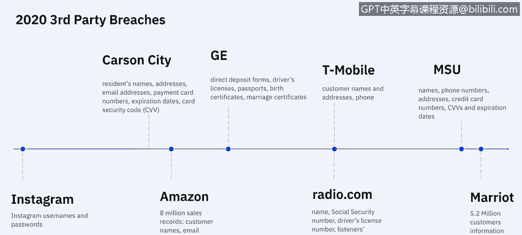

# 课程7：《网络安全顶级项目：入侵响应案例研究》：36：14_01_3rd-party-breach-overview.en_subtitled

## 📚 课程概述

在本节课中，我们将学习什么是第三方数据泄露，回顾相关的响应方法，并了解第三方供应商最常见的数据泄露类型。

---

## 🔗 什么是第三方数据泄露？

第三方数据泄露，也称为供应链攻击或价值链攻击，是指源自您系统内某个第三方（该方拥有您系统的访问权限）的攻击。这包括数据管理公司、律师事务所、电子邮件提供商、网络托管公司、子公司、供应商、分包商，以及您系统中使用的任何外部软件或硬件，甚至包括为收集分析数据而添加到您网站上的JavaScript脚本等。

---

## 📊 第三方数据泄露的现状与影响

为了更清晰地了解第三方数据泄露的现状，我们可以参考一些统计数据。根据2018年波耐蒙研究所的一项研究，64%的企业表示他们最担心的是第三方滥用或与其他第三方共享机密信息。而在接受调查的企业中，41%实际上遇到过这个问题。

以下是关于第三方风险评估的一些关键数据：
*   **2100万美元**是公司用于审查第三方的平均年度支出，但**64%** 的公司表示所使用的流程效果一般或完全无效。
*   **40%** 的组织使用电子表格等手动程序，**51%** 使用风险扫描工具来审查其第三方。然而，**34%** 的人表示这些工具的结果价值一般，**20%** 的人则表示结果没有提供任何见解。
*   第三方每年平均花费**15000小时**完成评估，年均成本为**190万美元**。但**55%** 的评估结果只是部分或完全不能准确反映其安全状况。
*   只有**8%** 的评估导致了实际行动，例如取消供应商资格或要求其弥补安全漏洞。即使评估发现了漏洞，也只有**26%** 的受访者表示其组织会终止合作关系。

---

## 🎯 最常见的第三方风险来源

根据一份Norm Shield的研究，最常见的第三方风险来源主要有以下三类：
1.  **基于云的存储、服务或托管提供商**。
2.  **在线支付、信用卡处理或销售点系统**。
3.  **用于网站分析、访客跟踪等的网站JavaScript**。

---

## 📈 近年来的重大第三方泄露事件

2018年和2019年发生了创纪录的第三方数据泄露事件，而2020年伊始情况就已令人担忧。下图并非今年迄今为止所有第三方泄露事件的完整列表，但它很好地展示了已经发生的一些重大事件，从1月份的Instagram事件开始，到2020年4月最新的万豪国际事件达到顶峰。

个人信息和财务信息似乎是每次泄露事件中泄露的主要数据类型。有些事件甚至更为严重，涉及社会安全号码和驾驶执照号码的暴露，这大大增加了身份盗用的风险。

---

## 🤔 第三方泄露为何成为严重问题？

在了解了现状后，我们不禁要问：第三方泄露是如何演变成如此严重的问题的？这需要追溯到其历史背景。

当企业在80年代和90年代开始广泛外包和全球化其供应链时，他们并未充分理解供应商所带来的风险。供应商站点缺乏物理或网络安全可能导致企业数据系统被入侵或产品在初始阶段就被破坏。当时，企业只询问最基本的问题，例如：
*   供应商对其自身人员（尤其是那些能访问客户数据系统或设施的人员）的审查有多严格？
*   供应商对其服务提供商（从清洁服务到系统维护，任何能接触公司信息的提供商都可能构成网络风险）的审查有多严格？
*   供应商对其产品和软件的审查有多严格？特别是那些将嵌入到客户系统中的、带有嵌入式IT的产品。

---

## 🛡️ 从提问到建立框架：供应链风险管理

随着担忧的加剧，业界从单纯提问转向构建框架和最佳实践。美国国家标准与技术研究院制定了一份供应链风险管理指南。

该指南指出，网络供应链风险管理的一个主要目标是：**识别、评估和缓解那些可能包含恶意功能、或是由于供应链内不良制造和开发实践而导致假冒或易受攻击的产品和服务**。

网络供应链风险管理活动可能包括：
*   **确定对供应商的网络安全要求**。
*   **通过合同等正式协议来制定网络安全要求**。
*   **与供应商沟通将如何验证这些网络安全要求**（例如通过审计）。
*   **通过多种评估方法验证是否满足网络安全要求**。

*   **治理和管理上述所有活动**。

---

## 💡 如何防范第三方数据泄露：最佳实践

第三方生态系统是网络犯罪分子试图渗透组织的理想环境，并且随着这些网络变得更大、更复杂，风险只会增加。为了领先于风险，公司和高管需要围绕支持自动化技术和强有力治理实践的第三方检测与缓解计划进行协作。

2018年，公司和高管们协作制定了一份关于如何完全避免第三方数据泄露的最佳实践清单：
1.  **评估所有第三方的安全和隐私实践**：需要定期进行审计和评估，以审查第三方的安全和隐私实践。
2.  **清点所有共享信息的第三方**：需要跟踪所有有权访问敏感数据的第三方，以及这些第三方中有多少在与其他人共享该数据。
3.  **频繁审查第三方管理政策和程序**：实施正式流程，定期评估第三方及第N方的安全和隐私实践，特别是要应对物联网设备等新技术和创新。
4.  **当数据与第N方共享时，要求第三方通知**：需要强制要求第三方在共享敏感数据之前，提供其与第N方关系的信息并保持透明度。
5.  **董事会监督**：让高级领导层和董事会参与第三方风险管理计划。高层对第三方风险的关注可能会增加应对这些威胁的预算。

---

## 📝 课程总结

本节课中，我们一起学习了第三方数据泄露的定义、现状、常见来源以及历史上的重大事件。我们探讨了第三方风险为何成为严重问题，并介绍了从简单提问到建立系统化风险管理框架的演变过程。最后，我们重点学习了由业界协作制定的五项关键最佳实践，以帮助组织有效防范第三方数据泄露。理解并实施这些措施对于构建有弹性的网络安全防线至关重要。