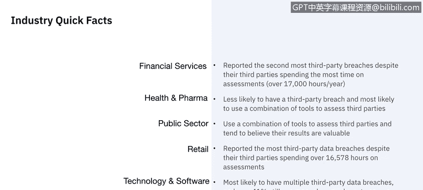
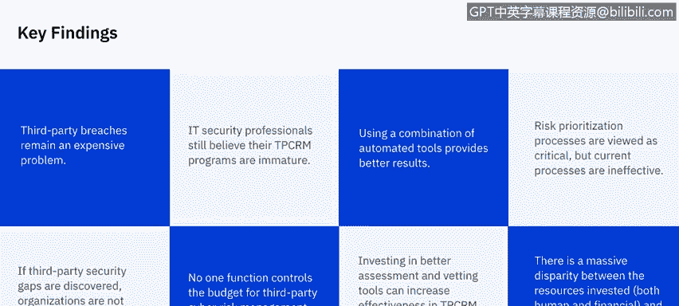
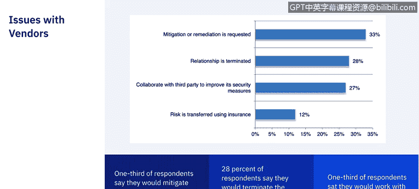
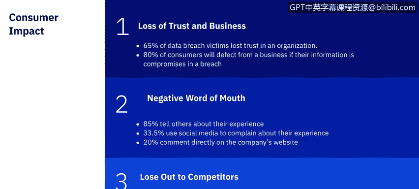
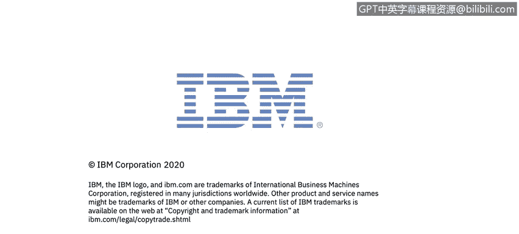

# 课程7：《网络安全顶级项目：入侵响应案例研究》：37：15_02_第三方数据泄露的影响

## 概述

在本节课程中，我们将学习第三方数据泄露对个人和企业可能产生的影响。我们将探讨不同行业的现状、相关统计数据，并了解消费者对数据泄露的反应。

## 第三方数据泄露的行业现状

第三方数据泄露仍然是组织面临的主要安全挑战，超过63%的数据泄露与第三方有关。

为了预防或减轻第三方数据泄露或网络攻击的严重性，组织可以实施多种网络安全风险管理控制措施，例如评估法规遵从性、审查第三方安全实践，以及建立数据泄露和网络攻击事件响应程序。

以下是关于不同行业现状的一些关键事实：

*   **金融服务**：尽管其第三方每年在评估上花费超过17,000小时，但该行业报告的第三方数据泄露数量位居第二。
*   **医疗与制药**：该行业发生第三方数据泄露的可能性较低，并且最有可能使用多种工具组合来评估第三方。
*   **公共部门**：该行业使用多种工具组合来评估第三方，并且倾向于相信评估结果。
*   **零售业**：该行业报告的第三方数据泄露数量最多，尽管其第三方在评估上花费了超过16,578小时。
*   **科技与软件**：该行业最有可能发生多次第三方数据泄露，并且超过41%的企业仍在使用手动流程来评估第三方。

## 第三方数据泄露的成本与挑战

上一节我们了解了各行业的现状，本节中我们来看看第三方数据泄露带来的成本与挑战。

同一项研究还确定了以下关键发现：

*   第三方数据泄露仍然是一个代价高昂的问题。
*   IT安全专业人员仍然认为他们的第三方网络风险管理（TPCRM）项目不成熟。
*   使用自动化工具组合能提供更好的结果。
*   风险优先级排序流程被视为关键，但当前的流程效果不佳。
*   如果发现第三方存在安全漏洞，组织通常不会主动采取措施来降低这些风险。
*   没有一个职能部门能完全控制第三方网络风险管理项目的预算。
*   投资于更好的评估和审查工具可以提高第三方网络风险管理的有效性，同时降低维护这些项目的成本。
*   在投入的资源（包括人力和财力）方面存在巨大差异。

## 组织对第三方安全漏洞的应对

了解了普遍的成本与挑战后，我们来看看组织在发现第三方安全漏洞时的具体反应。

在一项2019年关于医疗保健领域第三方数据泄露的Ponemon Institute研究中，受访者表示：

*   约三分之一会主动介入，亲自采取措施来缓解或调解安全漏洞。
*   约三分之一表示他们会直接终止与供应商的合作关系。
*   另外约三分之一表示他们会与第三方合作解决存在的问题。

你可能会认为直接终止供应商合作关系的公司比例会更高，但这实际上与消费者对第三方数据泄露的反应也高度相关。

## 数据泄露对消费者信任的影响

既然我们看到了组织的反应，那么数据泄露对消费者信任的具体影响是什么呢？

在一项2016年《安全杂志》关于网络安全漏洞如何影响消费者信任的调查中，结果分为三个类别：对企业的信任丧失、负面口碑以及输给竞争对手。😔

以下是调查的关键发现：

*   **信任丧失**：65%的数据泄露受害者表示对相关组织失去了信任。
*   **客户流失**：如果客户的信息在泄露中受损，80%的客户会离开该企业。
*   **负面口碑**：85%的受害者会向他人讲述自己的经历，其中33.5%的人会使用社交媒体投诉，20%的人会直接在公司的网站上留言。
*   **安全成为选择因素**：52%的客户会考虑从安全性更好的提供商那里购买相同的产品或服务。同样，52%的客户表示安全性是购买产品或服务时的一个重要或主要考虑因素。

此外，调查结果还强调了数据泄露对主要品牌的潜在长期财务影响：

*   59%的消费者警告说，如果数据泄露导致他们的个人数据被用于犯罪目的，他们将对该公司采取法律行动。
*   72%的消费者表示，他们现在会减少与公司分享个人详细信息，这可能会影响那些依赖收集详细消费者数据用于广告的社交媒体平台和搜索引擎的收入。
*   在Target数据泄露事件（我们时代最大、最重大的泄露事件之一）中，尽管有65%的数据泄露受害者表示对组织失去了信任，但仍有40%的Target客户表示这对他们来说无关紧要。

## 总结

本节课中，我们一起学习了第三方数据泄露的影响。我们探讨了不同行业的现状、数据泄露带来的高昂成本和挑战、组织对安全漏洞的应对方式，以及数据泄露如何严重损害消费者信任并带来长期财务风险。现在我们已经了解了第三方数据泄露及其影响，让我们在下一个视频中看一个真实案例。