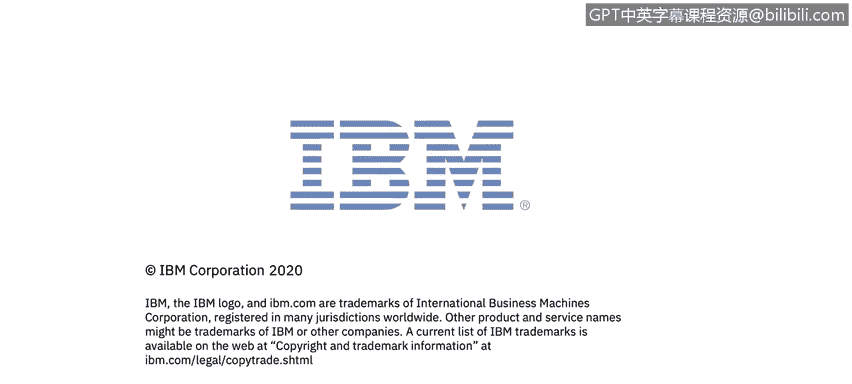

# 课程7：《网络安全顶级项目：入侵响应案例研究》：38：16_01_3rd-party-breach-quest-diagnostics.en_subtitled

## 🏥 第三方数据泄露案例研究：Quest Diagnostics

在本节课程中，我们将学习一个由IBM提供的第三方数据泄露案例研究。我们将了解Quest Diagnostics数据泄露事件的时间线、威胁行为者采取的行动，以及第三方攻击带来的影响。

### 攻击概述

首先，让我们探讨本次攻击的概要。Quest Diagnostics是美国最大的临床实验室检测服务提供商之一。此次事件中，约1190万患者的敏感数据被访问，范围涵盖信用卡号、银行账户信息，甚至社会安全号码。

以下是本次泄露事件的时间线：

*   **2018年8月至2019年3月**：攻击者访问了Quest Diagnostics的敏感数据，持续时间约七个月。
*   **2019年5月14日**：第三方收款机构美国医疗收款机构发现了此次泄露，并向Quest报告。
*   **2019年6月初**：Quest在向美国证券交易委员会提交的文件中披露了此次泄露，公众首次得知此事。

与许多事件不同，Quest对第三方数据库问题的发现似乎是内部进行的。一名未经授权的用户通过一家名为美国医疗收款机构的计费收款供应商，访问了Quest Diagnostics的敏感数据。

### 🔍 主要漏洞与影响

上一节我们介绍了攻击的时间线，本节中我们来看看导致此次泄露的主要漏洞及其后果。

主要漏洞围绕着Quest Diagnostics及其第三方能够访问的数据类型。

*   **个人身份信息**：这是任何可用于识别特定个人的数据。社会安全号码、邮寄或电子邮件地址以及电话号码通常被视为PII，而技术的发展扩大了其范围。
*   **医疗数据**：包括患者的健康信息。
*   **财务数据**：包括信用卡数据。

如果我们审视第三方供应商的一些具体漏洞，以下是关键发现：

1.  **缺乏对第三方的审计**：一个未知方非法访问了AMCA网站，并执行了针对支付页面的中间人攻击。攻击者记录了访问者输入的支付和个人信息。
2.  **数据访问范围**：Quest声明其内部医疗记录（如实验室检测结果）在第三方数据泄露期间未被访问，但攻击者可以访问任何可能在AMCA网站上输入的医疗信息。

事件发生后，Quest已停止向AMCA发送收款请求，AMCA也移除了其网络支付页面，并聘请了外部安全公司进行审计。AMCA表示，他们尚不清楚未经授权的用户是如何获得访问权限的。

此外，Quest有责任报告涉及医疗数据的泄露。根据美国卫生与公众服务部的规定，对于未受保护的健康信息泄露，相关实体必须向受影响的个人、部长以及在某些情况下向媒体提供通知。同时，如果泄露发生在业务伙伴处或由其造成，业务伙伴必须通知相关实体。

### 💰 泄露的成本与后果

了解了漏洞后，我们来看看这次泄露造成的成本与后果。这似乎是一批非常庞大的数据，因为它触及了客户数据的三个关键组成部分：个人身份信息、信用卡数据和健康信息。

存在明显的身份盗窃和账户接管风险，但此次第三方数据泄露所暴露的信息组合可能导致一些特别令人担忧的网络钓鱼攻击。医疗数据与此次泄露提供的财务和个人信息相结合，是钓鱼者的强大工具。诈骗者可以轻易冒充目标的医生或保险公司，引用私人医疗细节以获取信任。如果受害者中有公众人物，敲诈勒索也是一种可能。

Quest的财务成本尚不清楚。2019年6月12日，佛罗里达州律师事务所Morgan and Morgan在新泽西州对Quest Diagnostics提起了集体诉讼。康涅狄格州和伊利诺伊州的检察长也已对此安全事件展开调查。在长达36页的诉讼中，Quest Diagnostics被指控未能妥善通知患者有关泄露的情况。诉讼指出，数据泄露是被告未能实施充分合理的网络安全程序和协议以保护患者个人身份信息的直接结果。

对于第三方提供商AMCA而言，情况也很严峻。据报道，在长达八个月的系统黑客攻击泄露了多达2000万Quest Diagnostics、LabCorp和BioReference患者的个人财务和健康数据后，美国医疗收款机构申请了第11章破产保护。破产申请文件解释称，由于一连串事件，AMCA正在寻求清算价值高达1000万美元的资产和负债。泄露事件发生后，该公司已花费380万美元向超过700万名受害者邮寄了个人通知。破产申请还透露，LabCorp、Quest及其另外两个最大客户因泄露事件已停止与AMCA的业务往来，这加速了破产申请。

### 🛡️ 预防建议

在分析了这起严重的泄露事件后，我们来看看如何预防此类事件。以下建议基于对那些在过去12个月或历史上能够避免第三方数据泄露的组织的特别分析。这些高绩效组织实施了治理和IT安全最佳实践，这些实践与减少第三方数据泄露事件的发生密切相关。

以下是其中一些关键实践：

*   **评估所有第三方的安全和隐私实践**：必须对第三方进行定期审计和评估，以评估其安全和隐私实践。
*   **建立共享信息的第三方清单**：必须跟踪所有有权访问敏感数据的第三方，以及这些第三方中有多少正在与其他人共享这些数据。
*   **频繁审查第三方管理政策和程序**：必须实施正式流程，定期评估第三方及第N方（即第三方的第三方）的安全和隐私实践，特别是要应对物联网设备等新技术和创新。
*   **要求第三方在数据共享时提供通知**：必须强制要求第三方在共享敏感数据之前，提供其与第N方关系的信息和透明度。
*   **董事会和高级领导层的监督**：让高级领导层和董事会参与第三方风险管理计划。高层对第三方风险的关注可能会增加用于应对这些威胁的预算。

### 总结

本节课中，我们一起学习了Quest Diagnostics第三方数据泄露的案例。我们回顾了攻击的时间线与概况，分析了涉及个人身份信息、医疗和财务数据的主要漏洞，探讨了泄露带来的身份盗窃、网络钓鱼风险以及法律与财务后果，最后总结了基于高绩效组织实践的预防建议，包括评估第三方、建立清单、定期审查和加强高层监督。

接下来，我们将提供一个关于勒索软件的概述视频。稍后我将回来，为大家带来一个关于亚特兰大市的勒索软件案例研究。

感谢观看本视频。