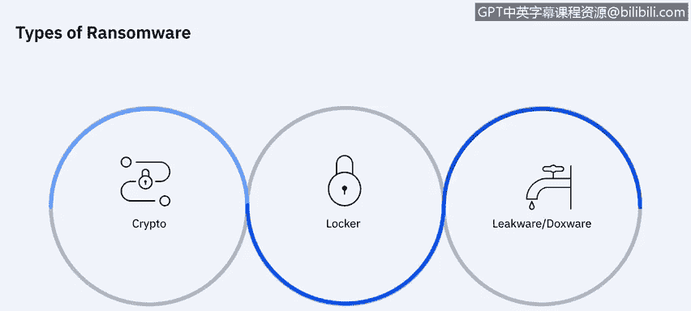
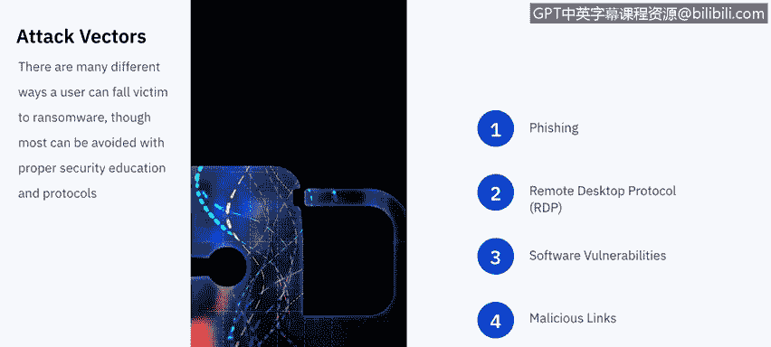
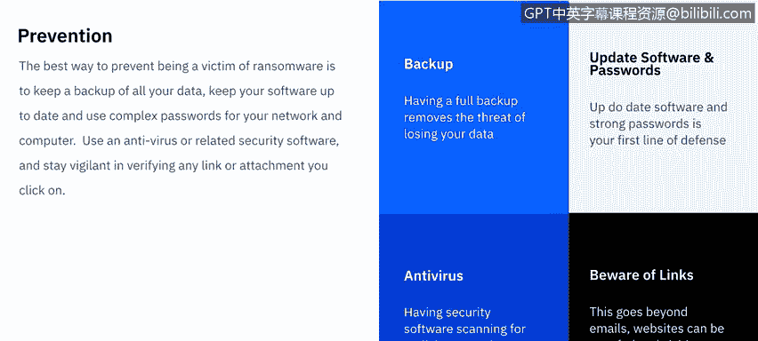
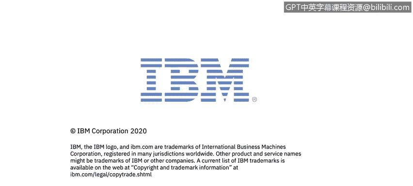

# 课程7：《网络安全顶级项目：入侵响应案例研究》：39：17_01_勒索软件概述

## 概述

在本节课程中，我们将学习什么是勒索软件。我们将了解勒索软件劫持用户数据的各种方法，并探讨用户如何成为勒索软件的攻击目标。

## 什么是勒索软件？🔒

美国国土安全部将勒索软件定义为一种感染计算机系统、限制用户访问受感染系统的恶意软件。通常，这些警告会声明用户的系统已被锁定，或者用户的文件已被加密。用户被告知，除非支付赎金，否则访问权限将不会被恢复。

向个人索要的赎金金额差异很大，但通常在200至400美元之间，并且必须使用比特币等虚拟货币支付。

## 勒索软件的类型

勒索软件通常分为以下三种主要类型：

*   **加密型勒索软件**：这种勒索软件会加密您计算机上的特定文件或文件组，并在您支付赎金前拒绝您访问这些文件。
*   **锁定型勒索软件**：这种勒索软件会将您完全锁在设备之外，除非支付赎金，否则您将无法进入您的计算机。
*   **泄露型勒索软件**：这种勒索软件会威胁要公开您网络摄像头拍摄的画面或您计算机上可能存在的任何犯罪文件，除非支付赎金，否则它们可能会将这些内容泄露给公众或特定人群。

## 勒索软件的传播途径

用户成为勒索软件受害者的方式多种多样，但大多数都可以通过适当的安全教育和协议来避免。以下是用户通常受害的几大类途径：

上一节我们介绍了勒索软件的定义和类型，本节中我们来看看勒索软件是如何传播并感染用户的。

以下是勒索软件常见的传播方式：

1.  **网络钓鱼攻击**：网络犯罪分子会发送电子邮件，试图诱使最终用户泄露个人信息或采取某种行动。在这种情况下，行动就是点击附件或链接，将用户引导至一个被篡改的网站，从而安装勒索软件。
2.  **远程桌面协议攻击**：网络犯罪分子能够通过网络访问您的设备，这通常是由于您的设备或网络密码策略薄弱。一旦他们访问了您的计算机，就可以自行安装勒索软件。
3.  **软件漏洞**：这包括保持您的原生操作系统及时更新以修补已知漏洞，以及保持您的第三方软件（如Adobe Flash Player）为最新版本。大型欺骗活动常常针对此类软件，如果您启用了自动更新或已手动更新，就不会被诱骗点击欺骗性链接或下载勒索软件的电子邮件。
4.  **恶意链接**：这些超链接几乎无处不在。它们可能出现在试图窃取您信息的欺诈电子邮件中，可能出现在试图诱使您点击以下载勒索软件的欺骗网站上，也可能出现在社交媒体、即时通讯消息中，甚至可能通过短信发送给您。因此，您点击可能下载勒索软件的内容的机会是无穷无尽的。

## 如何防御勒索软件？🛡️

如果不幸遭遇勒索软件，您能做的补救措施不多。但正如俗话所说，最好的进攻就是良好的防守。

以下是防御勒索软件的最佳实践：

1.  **备份数据**：对抗任何勒索软件的首要防御措施是拥有完整的系统备份。这能让任何试图以您已有的数据副本为要挟进行勒索的人无计可施。在这种情况下，您不会丢失任何数据，只会损失一些时间和精力。
2.  **更新软件并使用强密码**：及时更新所有软件，并为您的计算机、应用程序和网络使用强密码，这是网络安全的基础。这基本上能确保您不会成为容易被攻击的目标，攻击者可能需要针对您进行鱼叉式网络钓鱼，而不是因为您防护薄弱而轻易得手。
3.  **使用防病毒软件**：市场上有许多安全软件选项。使用安全软件扫描恶意附件或计算机的异常更改，能有效对抗网络钓鱼攻击。
4.  **警惕超链接**：这一点再怎么强调也不为过。有时甚至不需要下载操作，仅仅是访问一个欺骗性网站就可能开始下载勒索软件。因此，如果您收到来自可疑来源的电子邮件，或者邮件看起来真实但您不确定为何会收到，请直接打开浏览器访问官方网站，而不是使用邮件中提供的链接。

## 总结

本节课中，我们一起学习了勒索软件的基本概念、主要类型、常见的传播途径以及关键的防御策略。我们已经对勒索软件有了一个全面的概述，在接下来的视频中，我们将深入分析几种最常见勒索软件的具体案例。