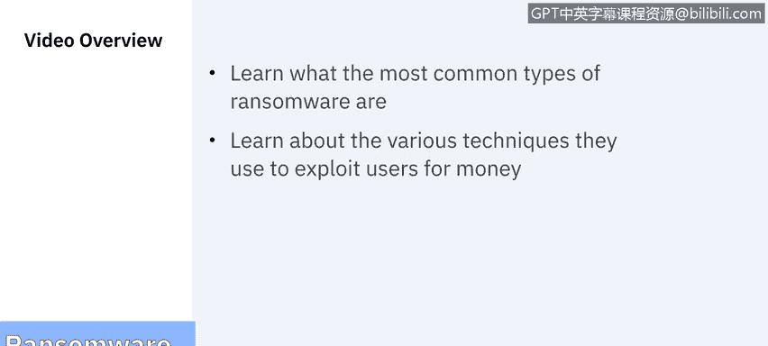

# 课程7：《网络安全顶级项目：入侵响应案例研究》：40：18_03_examples-of-ransomware.en_subtitled - GPT中英字幕课程资源 - BV1MN41167mY

## 勒索软件示例 🦠

在本节课中，我们将学习最常见的勒索软件类型，以及它们利用用户牟利的各种技术手段。

勒索软件对个人或组织可能造成毁灭性打击。任何在电脑或网络上存储重要数据的人都面临风险，包括政府、执法机构、医疗系统或其他关键基础设施实体。恢复过程可能非常困难，可能需要信誉良好的数据恢复专家协助，部分受害者会支付赎金。然而，支付赎金并不能保证个人一定能恢复文件。

勒索软件之所以如此有效，是因为其作者在受害者心中灌输恐惧和恐慌，诱使他们点击链接或支付赎金。用户系统可能因此感染额外的恶意软件。受害者通常会看到类似以下的信息：“你的电脑已感染病毒，点击此处解决问题。”、“你的电脑曾访问非法内容网站，要解锁电脑，必须支付100美元罚款。”或“你电脑上的所有文件已被加密，必须在72小时内支付赎金以重新获取数据访问权限。”勒索软件作者会将受害者逼入绝境，并利用恐惧策略试图勒索赎金。

上一节我们讨论了不同类型的勒索软件，如加密勒索软件、锁屏勒索软件和泄露型勒索软件。本节中，我们来看看具体的勒索软件示例。

以下是几种著名的勒索软件及其特点：

*   **Locky**：这种勒索软件能够加密超过160种不同的文件类型。它通过网络钓鱼手段，针对拥有设计、工程或开发类文件的用户。
*   **WannaCry**：可以说是最臭名昭著的勒索软件。它在2017年席卷了150个国家。它利用了医疗保健行业的过时软件，在全球造成了40亿美元的损失。
*   **Bad Rabbit**：这种勒索软件利用伪造的Adobe Flash更新网站来安装勒索软件，诱骗用户以为需要完成更新。当用户点击安装按钮时，实际安装的是勒索软件。
*   **Ryuk**：这种勒索软件于2018年传播，专门针对Windows系统。它会禁用系统还原功能，因此当用户发现自己成为勒索软件的受害者时，无法在当前操作系统中完成备份。其特别恶意之处在于，它还会加密网络驱动器。
*   **Trojldesh**：这种勒索软件在2015年流行，追求数量而非质量。它通过垃圾邮件、电子邮件链接和附件来捕获受害者。
*   **Jigsaw**：这种勒索软件以《电锯惊魂》恐怖电影命名。它通过每小时逐步删除越来越多的文件来折磨受害者，除非支付赎金。
*   **CryptoLocker**：这种勒索软件通过电子邮件附件传播，影响了超过50万台电脑。但执法部门成功反击，他们能够看到所有帮助传播该勒索软件的CryptoLocker电脑网络，并在网络犯罪分子不知情的情况下向受害者分发了密钥。
*   **Petya**：这是GoldenEye的前身，它会直接加密整个硬盘驱动器。
*   **GoldenEye**：当它再次出现时，正值WannaCry流行之际。它针对知名度较高的用户，并完全将他们锁定在系统之外。
*   **Gancrab**：这种勒索软件声称使用了用户的网络摄像头记录个人和私人时刻，并威胁除非支付赎金，否则将发布这些录像。

尽管勒索软件的现状令人担忧，但未来前景也并不乐观。随着组织越来越依赖技术解决方案，勒索软件的适用范围只会增加。因此，物联网设备成为“勒索软件攻击目标”只是时间问题，因为越来越多地使用互联网连接的工业控制系统、智能建筑和车辆（包括自动驾驶汽车）正在创造新的潜在攻击领域。例如，远程锁定车辆、住宅和建筑可能被滥用于勒索。操纵楼宇自动化系统（如控制暖通空调的系统）可能成为新勒索计划的基础。

在2018年题为《企业视角下的勒索软件》的白皮书中，Stephen Copp讨论了对这种勒索软件演变的一些建议应对措施。首先，开始在风险管理和战略规划中应对潜在威胁。其次，了解当前易受勒索的资产，如物联网设备、小型或家庭办公室路由器、任何机器人控制系统或自主系统，跟踪与这些设备相关的漏洞报告，并及时进行补丁和固件更新。最后，将物联网设备和其他新技术与生产网络隔离，这样即使一个网络被攻破，另一个网络仍有保护机会。

接下来，我们将通过一个真实世界的案例，看看针对亚特兰大市的大规模勒索软件攻击。我们将在下一个视频中详细了解。

本节课中，我们一起学习了多种具体的勒索软件示例及其攻击手法，了解了勒索软件对个人和组织的严重威胁，并探讨了未来可能出现的勒索软件攻击新领域和基本的防御策略。理解这些具体案例有助于我们更好地识别和防范此类威胁。