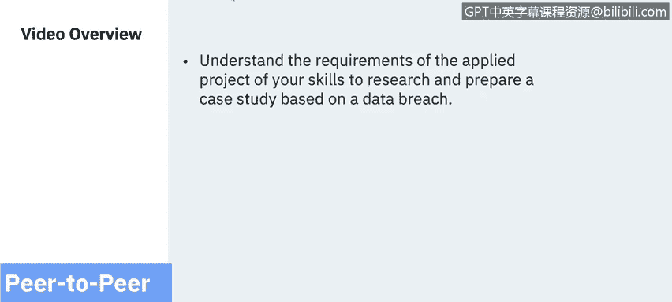
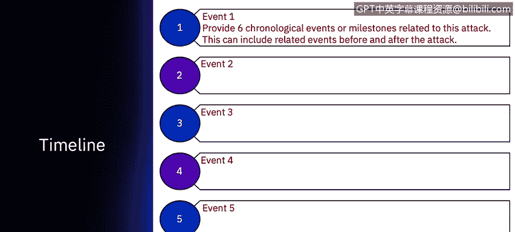
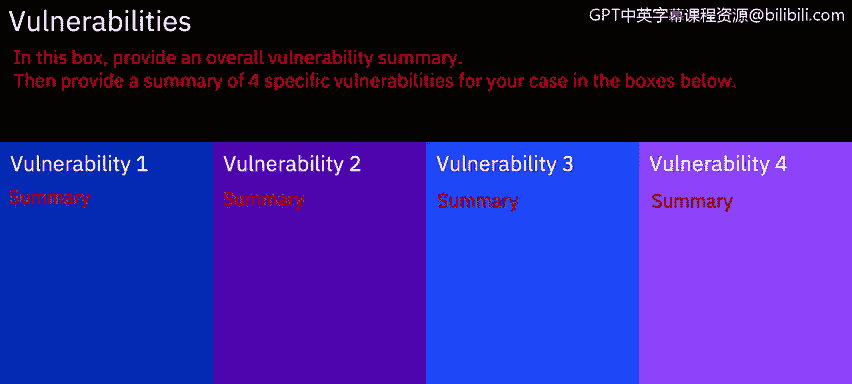
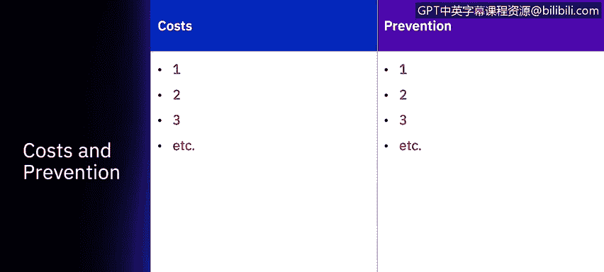
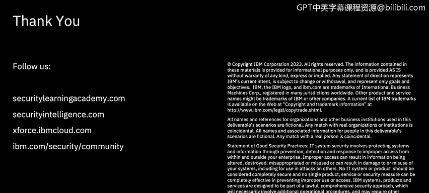

# 课程7：《网络安全顶级项目：入侵响应案例研究》：42：点对点应用项目介绍

## 概述

在本节课中，我们将学习如何完成点对点应用项目。你将了解项目要求，并学习如何运用所学技能，基于一个真实的数据泄露事件来研究和准备一份案例分析报告。

## 项目模板介绍

上一节我们概述了项目目标，本节中我们来看看完成项目所需的具体模板。

你将使用一个模板来整合案例分析。该模板基于你在本课程以及之前其他网络安全课程中接收到的所有材料进行研究。

该演示文稿模板提供多种格式：owerPoint、Keynote。如果你没有这些软件，也可以使用开源的Google Slides。

## 项目核心步骤

以下是完成应用项目需要遵循的几个核心步骤。

1.  **选择案例**：首先，确定一家在过去七年内遭受过数据泄露的公司或受影响方。
2.  **描述攻击类型**：然后，描述导致数据泄露的攻击类别，并提供该攻击类别的具体信息。这包括该攻击类别的漏洞、其他示例，以及行业统计数据。大部分信息可在本课程指定的X-Force威胁情报报告中找到。
3.  **公司及事件摘要**：添加公司描述、事件和数据泄露的摘要。请确保使用本课程中提供的案例研究作为填写此信息的范例，这些内容将由你的同伴进行评审。
4.  **描述时间线**：接下来，描述时间线。即导致数据泄露的一系列事件，以及在发现泄露日期之后发生的事件。例如，数据泄露是由公司内部发现的，还是由外部发现的。包括关于数据泄露发生时间、攻击发生时间的信息，以及围绕数据泄露的相关信息摘要。

5.  **分析漏洞**：接着，讨论漏洞。公司或组织的整体漏洞是什么？可能是他们的系统未进行安全加固，也可能是他们缺乏安全软件，或者是花费了数月才识别出泄露。你可以看到这个摘要可能有多种选项。然后，挑选出四个具体的漏洞，范围可以从人员未接受教育，到被攻击的服务器上未安装防病毒补丁。因此，每个特定的数据泄露案例都是独特的，你需要指出其具体的漏洞。

6.  **评估成本**：讨论成本。同样，这取决于数据泄露发生的时间。如果是近期发生的数据泄露，关于该公司或组织成本的信息可能有限。然而，如果数据泄露发生在过去，你应该能够看到多年来产生的一系列不同成本，包括诉讼成本、为攻击者获取的信用卡信息支付的潜在成本，以及公司可能因业务损失而产生的不同成本。
7.  **提出预防策略**：最后，你需要讨论预防策略。在这个类别中，可能包括公司需要制定事件响应计划，也可能是分析师错过了来自同一IP地址的多个事件。同样，这是一个独特的情况，根据你选择的攻击类型以及在新闻中找到的公司数据泄露事件，可能有数百种不同的预防技术。

## 提交与评审

完成模板填写后，将演示文稿保存或导出为PDF文件，并提交回你的课程中。

接下来，将有两名同伴评审员查看你的课程作业，并根据你提供的信息量以及基于他们知识判断的信息准确性为你评分。

每张幻灯片都有部分分数，你需要平均获得80%的分数才能通过本课程。

现在，开始研究和填写你的应用项目吧。

## 总结

本节课中，我们一起学习了如何完成点对点应用项目。我们详细介绍了项目模板的各个部分，包括如何选择案例、分析攻击与漏洞、评估成本以及提出预防策略。最后，我们了解了项目的提交与同伴评审流程。现在，你可以开始着手研究并完成你的数据泄露案例分析报告了。