# i春秋学院 进阶篇 PHP代码审计 - P14：课程：文件包含漏洞的审计 - 老网恋教父了 - BV1D7411S7vf

。大家好，我是viic。啊，这节课给大家带来的是文件包含漏洞的审计。那么本节课只有一个内容，是文件包含漏洞的审计。我们先来看看文件包含漏洞的问题啊，前面有一节课啊讲危险函数的时候。

我们就讲过include require等相关函数。好，文件包含漏洞所在的啊问题所在就是这几个函数的参数可控。那我们来分析一下啊这个函数的参数。我把这个。😊，啊，参数分为三段啊。

分别是路径、文件名以后缀。嗯。好，我们啊包含问题。啊，包含的时候一般会有限制。啊，如果没有限制的话，就包含任意文件了啊，基本上很容易就能够达到我们的目的。但是基本上是有限制的话。

我们就来分析一下它的限制。啊，如果他限制了后缀。系咪 k。考虑啊用截断的方法啊去截断他的后缀。啊，或者是考虑用伪协议的方法去绕过他的后缀。啊，如果是打开了啊远程远程文件包含的话。呃。

那么我们也可以直接去包含远程文件。它限制什么样的后缀，我们就包含什么样后缀的远程文件。当然这一般是默认是关闭的。嗯，所以说。而且呃另外是截断的话呢，因为。啊，P去的版本更新问更新之后。

他是把截段这个漏洞把它修复了啊，基本上截段也是没有用处。可说一般考虑还是尾胁于。啊，VC其实也有一个很重要的。啊，限制。就是路径限制。也有很多程序是限制了路径。嗯，限制了路径的话，我们基本上是。啊。

不能用伪信以及远程文件包含了。然后如果他只限制路径，而不限制后缀的话，你就可以考虑是。包含我们上传的文件。啊，包含。啊，日志文件、环境变量或者三文件以及临时文件。好，如果他把路径和后缀都限制了的话。啊。

我个人是找不到有什么可以继续利用的地方了。所以说嗯理论就讲到这里，我们还是看代码。

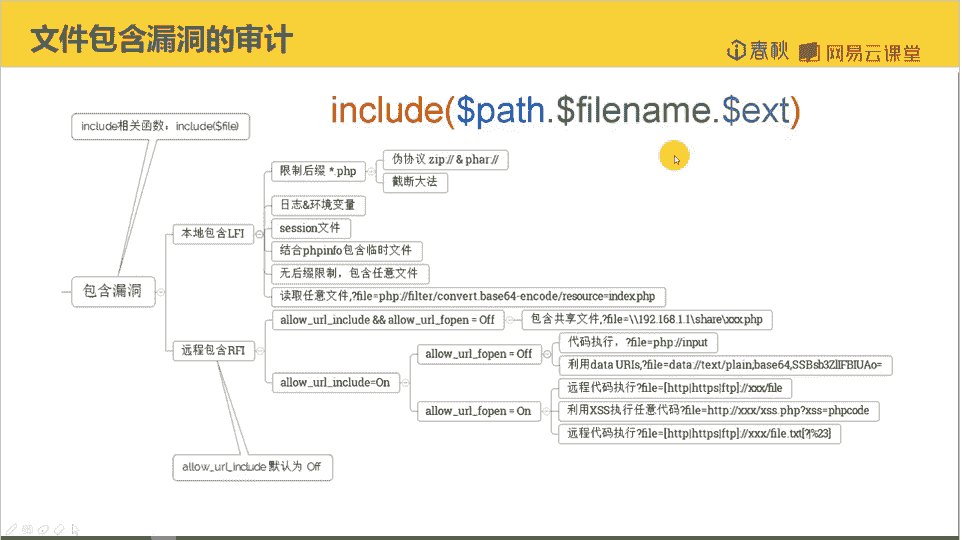

然后上节课我们讲到getIP我们。继续往后面。啊，仔细看看哎，基本上也是没有什么。可零的地方了。好，我们再往后啊回到inex。啊，继续看。inex里面是有个inlude。

我们找到我们现在来分析incode，我们是否能够利用起来。我们看这个函数，它的参数。啊。get一个呃参数，然后是。和INC这个后缀去结合。那么我们这里就考虑到啊。绕过或啊用截段或者是尾C。

取绕过我们这里用尾斜疑PHAR。马烦下。然后就用用这个协议去绕过它。去进来去包含一个脚本。那么我们要。嗯，我来再说一点，就是协关于协议问题，为什么可以用伪协议去啊包含一个特殊的文件呢？啊维 c。

这是一个压缩包有关的协议。嗯，他可以啊打开一个压缩包，并且打开其中一个文件啊，读取压缩包里面某个文件的内容。啊，关于这个协鱼更多的呃介绍，就请大家去官网看。你这里就。啊，构造一个。压缩包。嗯。

他的用法是这样的。好，叉叉。啊，前面的就是路径。啊，路径啊，加上。文件名。然后在后面这一部分呢，就是它里面所包含的所压缩的那个文件。好，这样我们就去构造一个特殊的文件。

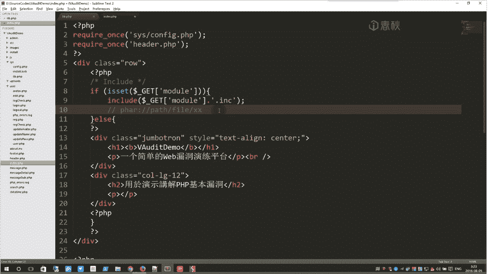

好，这里我们是准备好了一个。

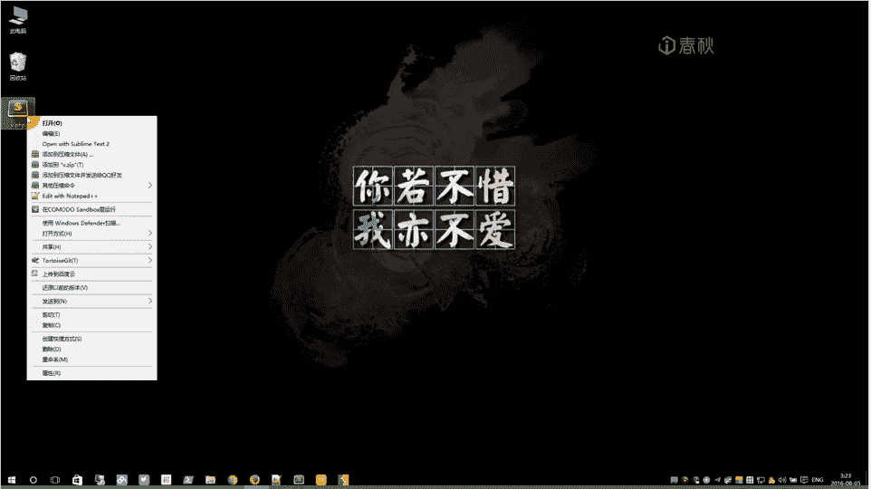

句话脚本。

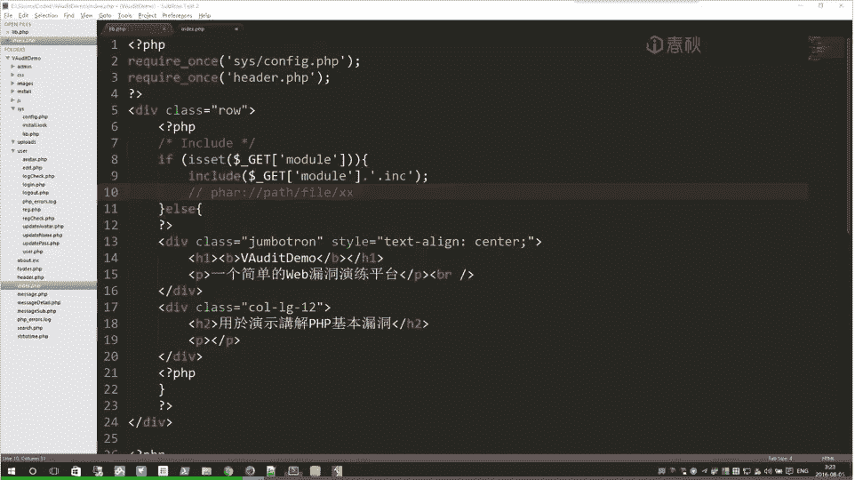

我们首先是要把它改成INC。

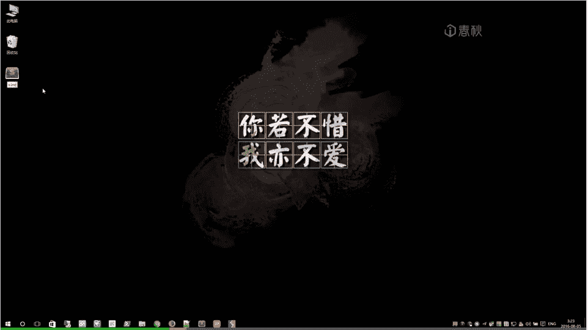

也就。我们这里特定的INC。

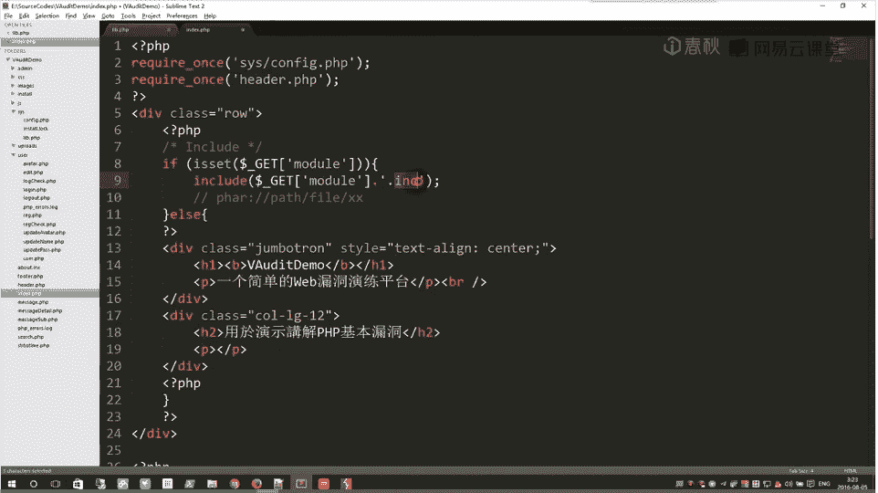

Yeah。好，把它打包。

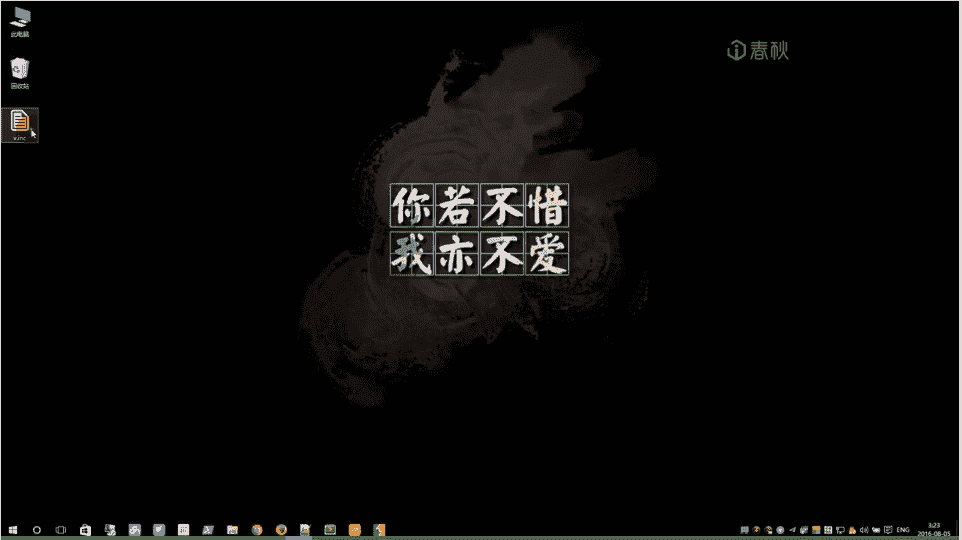

嗯。

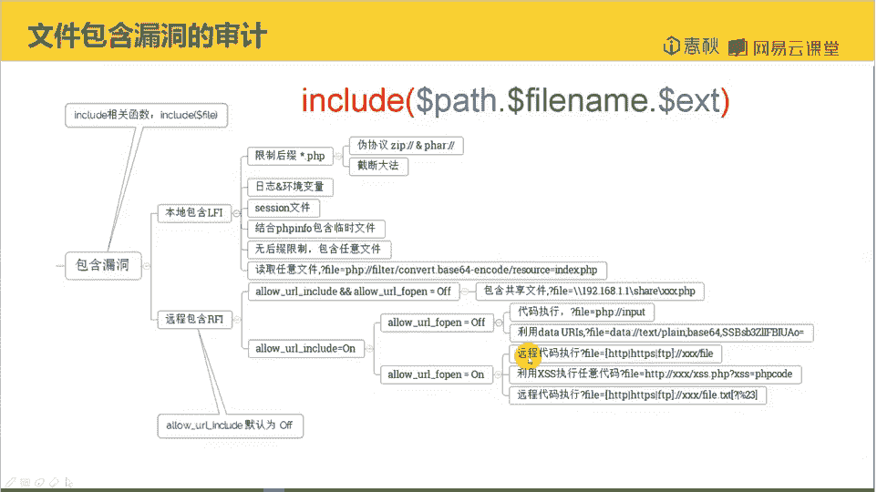

打包之后。我们要上传的只能上传图片，比如改成PNG。

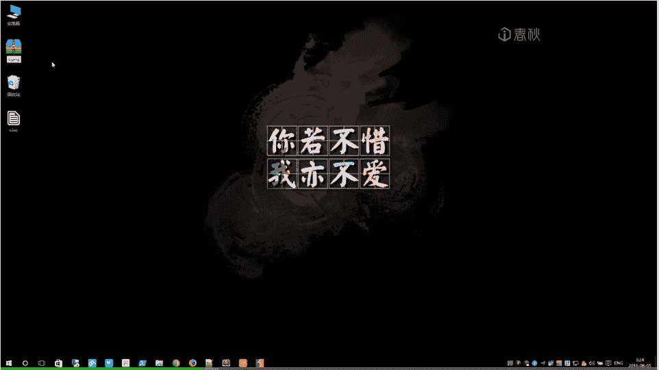

我为什么要是这样呢？我们再看到lab里面，它判断图片啊基本上是。只看后缀，而不看内容。然后这里我们还需要找到它文件处理的地方啊，再看看它到底是怎么样处理文件的。我们要找一个关键字，就是。到了下划线by。

啊，PHP处理上传文件基本上是跟这个变量有关。我们前去搜索。好，找到他在user目录。好是。update啊更新这个头像问题。我们就上传图片，更新头像。我们来仔细分析这个脚本。

果然就只是用ext去判断了一下它的后缀。啊，判断成功，他就是上传。我们再里看他怎么上传，moreve upload。啊，这是将临时文件。啊，移到这样的一个路径，我们再分析他这个路径。啊。

先看upDIR啊就定定义了一个上传目录。然后在这个目录下面，它是定义了这样的一个文件名。好，这个文件名是U下划线，加上时间戳啊，再下划线，再加上它原来的文件名。啊，主要是用了一个。啊，时间戳去扰乱。啊。

不让我们知道这个文件名到底是怎么样子的。那么这里基本上他是不会再把这个文件名啊铭文输出的。好，他成功上传之后，他就。啊，将这个路径啊更新到数据库。然后把这个路径啊转存储到session里面。

然后这里基本上猜测它是读取文件，都是靠这个session。并不会把这个路径直接输出来，让我们知道。我们来验证一下，看看。是否真的是这样，或者是在某些文件嗯，在某些地方。还会输出出来，我们还是前去搜索。

找一下这个变量。啊，首先在。啊，这个文件里面它是。存在这样一个变量，但是它也没有输出来。但是我们可以发现它有一个fin get content。啊，他读取了这个文件的内容。嘿，正常来说。

他也就是读取了这个头像的内容并输出。那么这里就可能存在一个漏洞。啊。그。啊，本地本店读取。本地文件读取。啊，或者是。嗯。SSIF。啊，可能存在这样的一个漏洞。我们这里先不看它，我们继续看啊。

哪里是否还有输出这个头像路径的。啊，它转移到这个变量。啊，同样他文件里面并没有这个变量的信息，没有输出。那我们继续往下看。好，登录的时候啊，他是直接是把数据库的信息。啊。

取出来直接就保存到了session里面。啊，也没有看到他输出。啊，注册这个就不用看。好是尚。啊，再看user这个页面也是把它啊取出来。同样好像也没有看到他输出。没有没有输出。

那么这里我们就只能考虑啊去破解这个时间戳。要。一般来说大家都会啊去爆破这个时间戳。啊，大概在。上传文件的时候啊，记录一下当前时间，然后再去爆破时间戳。但是这里我告诉大家有一个黑科技。啊。

就是这个我们上传啊访问这个文件。好察服务器。啊，执行这一句话的时候就取了一个时间戳。然后他在这个脚本执行完毕之后。他会给我们客户端返回一个时间信息。啊，虽然不一定是时间错，但是也相差不了几秒。

但是他那个啊随间信息是以字符串格式的。我们需要把它转为时间戳啊，在前后猜测一两次，基本上就能够找到他的时间戳了，也就找到了它的路径。那么我们这里。啊，PP里面有一个函数，是可以是把时间戳啊。

时间信息直接转化为时间戳的。我们这里也是。列出来了，把这个黑科技告诉给大家。

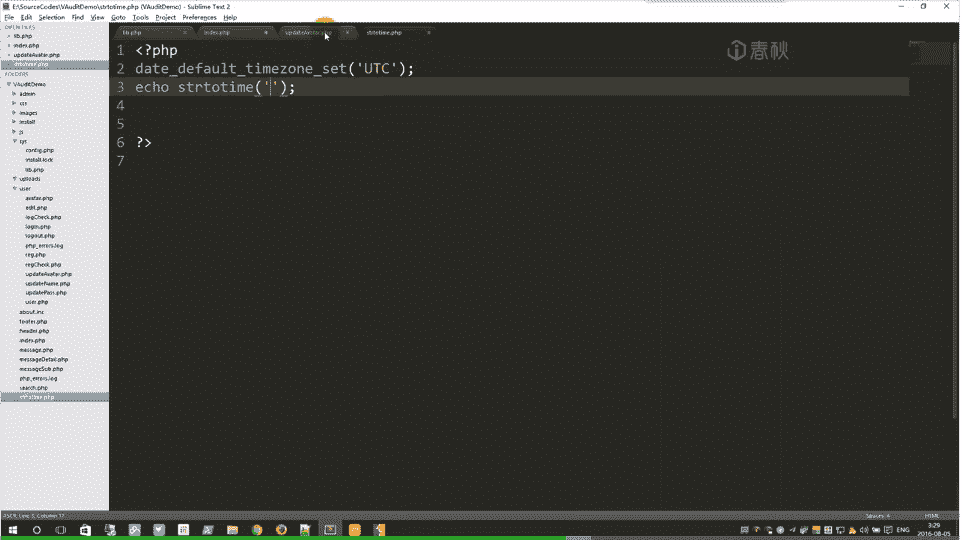

然后我们现在去上传。将我们的特殊文件去上传。嗯。嗯。编辑。点击找到他的头像上传的地方。我们来开启。开启by bugg。啊，去抓一下他的信息。好，这里我们。选择我们构造好的文件。好，上传。好，我们看到。

白bug他捉到他的投信息响应投。他里面有一句。啊，就是data。

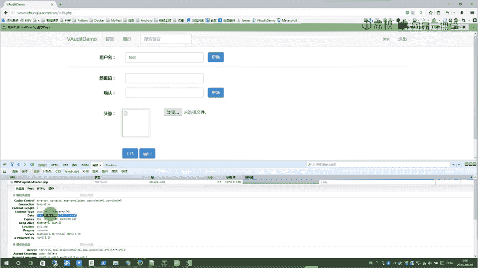

啊，data后面是时间。这不串，我们把它复制过来。放在这里。然后我们执行这个脚本，就把这一句啊随便戳，把它输出出来了。

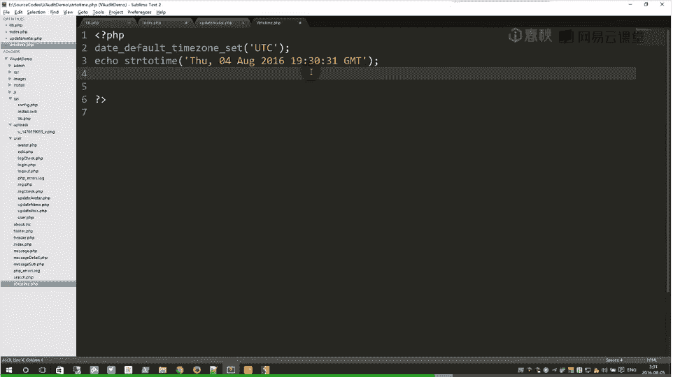

啊，时间错。基本上就是服务器啊执行脚本的时间拖。

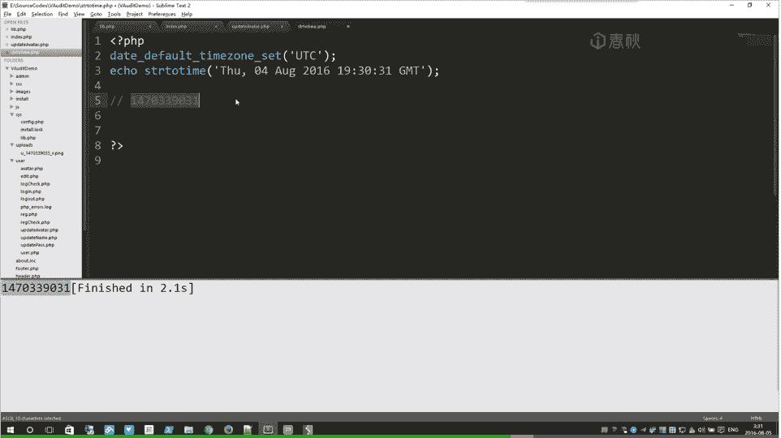

是。好，这里是上传成功了。因为我们上传的毕竟不是图片，它就输出一个错格式的东西。好，我们来看到文件upload。你看他的文件名。What来。

看他的时间拖信息。啊，这里是31，这里是33，差了2秒。那么如果我们不知道它的文件名的时候，我们可以猜测。啊，从2930313233这样拆它。猜测。啊，你就基本上可以知道啊，猜测成功最多也就五六次。

也可以确定他的。啊，录定了。那我们这里就把它直接拿过来用吧。Yeah。好的，这里。我们的录定。在这里。好，因为它前面还有个是up load的这个文件啊，这个目录。没把它放到这里。

这样我们就用这个伪协议去打开这个。啊，伪图片的压缩包。好后去读取它内部的。啊，INC文件啊包含它，因为它这里已经有了点INC，我们就截取这一部分。啊，这一部分就是。陪老的。然我去帽子。

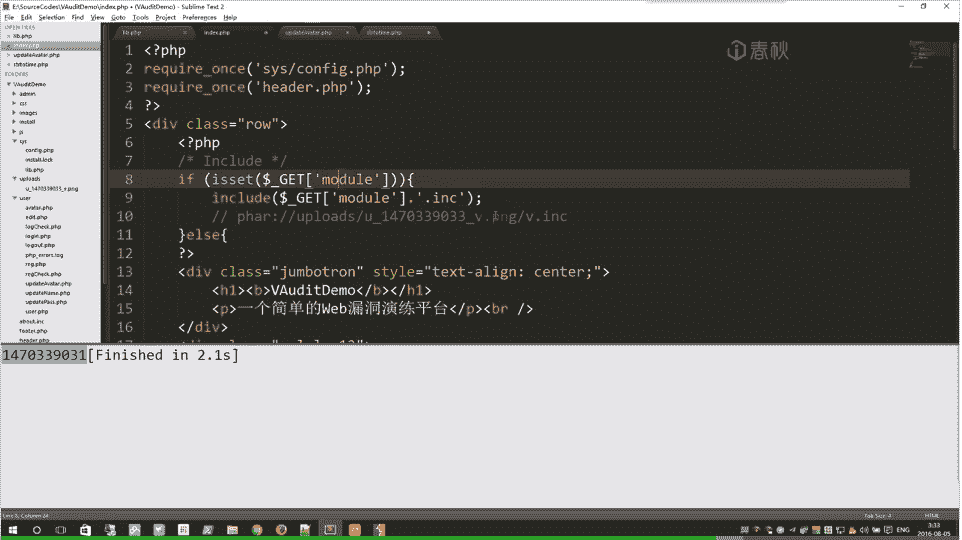

然后我们再回到网页去访问它。

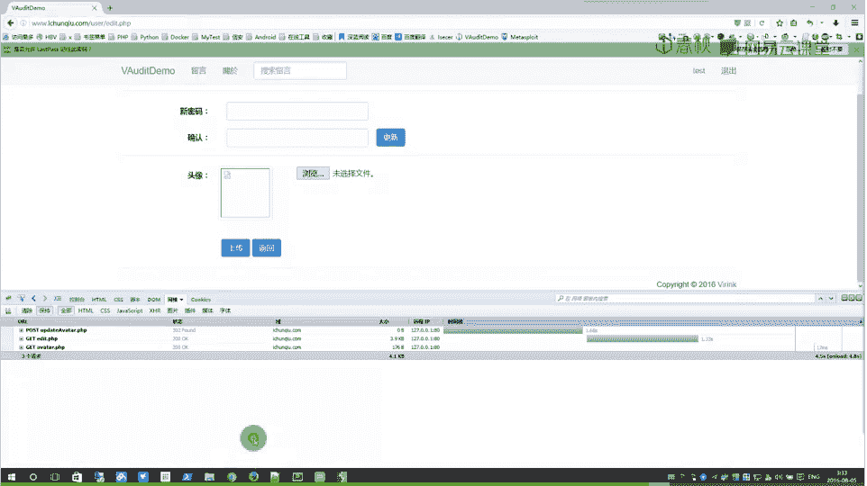

啊，基本上是。直接复制过来就是这样的一句。啊，访问。

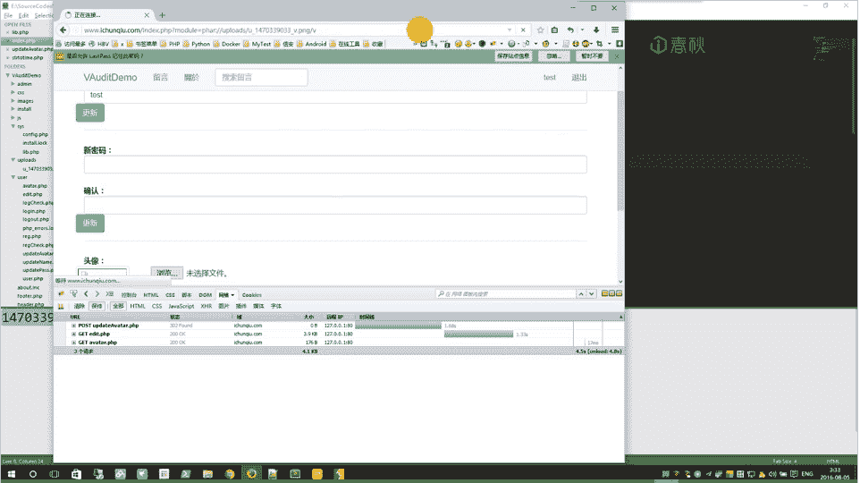

Yeah。一片空白。哎，没有报错什么的。我们来测试一下。我们是否成功包含我们的一句话脚本，密码一等于PP按FO符。好，这样执行。Yeah。成功输出了这个KTP的信息。也就是说我们的一句话啊成功的包含了。

然我们就成功的利用了这样的一个漏洞。

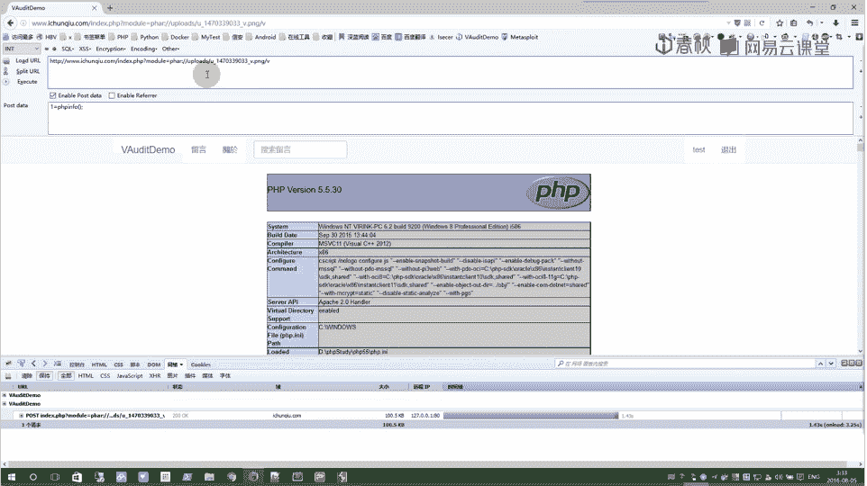

。好，现在我们来考虑一下啊如何去修复。啊，毕竟我们这里只是一个测试性的代码啊，包含about。啊如果真的是以模块方式的话。啊，有这么一个方法，就是定义一个。啊，模模块的。啊，数度。这样第一个数度里面是。

啊。About。没样。嗯，或者其他的叉叉叉。怎样。我们在啊获取这个。课的时候，我们把它。点啊。大概是把它复制过来。然后再用in every啊那个函数去判断。好，我们判断我们要包含的这个信息。好。

是否在这样的一个数组里面。啊，是的话就包含，不是的话就出现错误。Yeah。Yeah。我们来测试一下啊，同时也可以在他的。啊，路径前面加上一个路径。我们这个包含是在嗯根目录的话，可以是根目录或者是点。

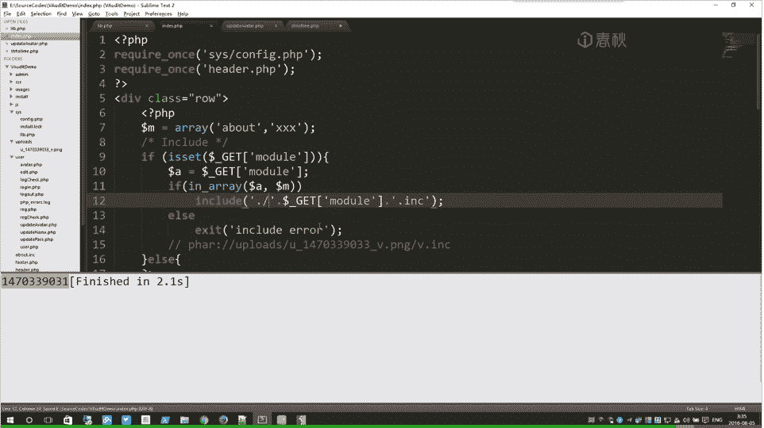

然后我们来测试一下。Yeah。

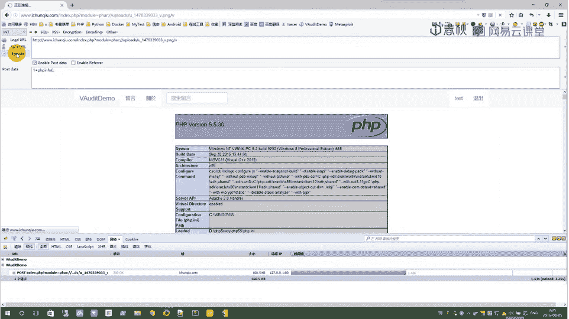

好，include error它并不不存在这里。这样他就能够防止一些啊非法利用。啊，如果是。改成PHP的话。前面说他是有一个啊用协议任意读取文件，我们加了一个路径上去，它就不能够用。

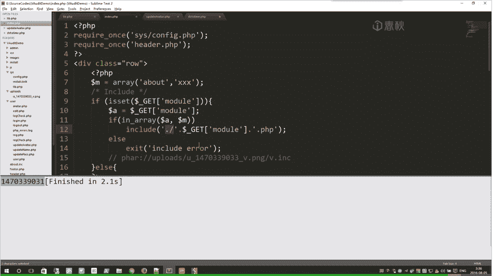

协议去啊读取任一文件了。Okay。Yeah。啊，这样。因为前面有路径，他基本上就是不能够这样，他就会把这一。

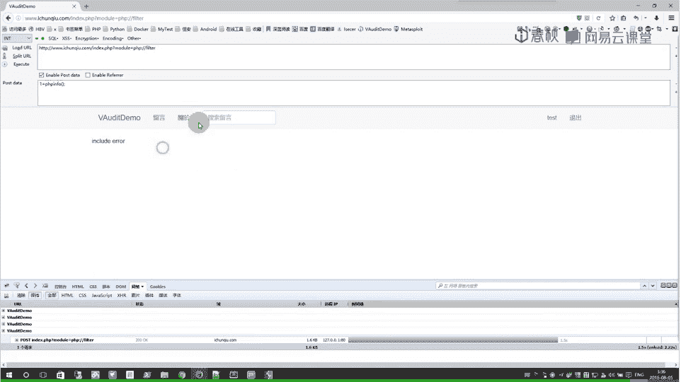

啊，KT分号那一部分啊，把它当成一个目录。啊，进而去包含目录下面的东西肯定是不存在的，也就是。啊，这个一一种修复的方案。哦。嗯，最好的还是。不要让。这种啊用户输入的变量进入到啊包含这里。

可能还有什么其他的方法去包含。

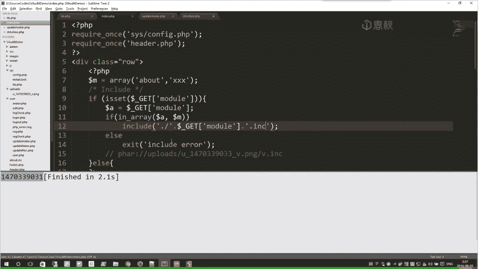

然后我们是就到这里，我们来总结一下。我们的思路是啊在index里面找到了into的这个函数，并且我们发现它的啊变量是可控的，半可控它有一个限制。这样我们就考虑到用伪协议去包含。

我们包含的话就找一个找到上传。好，结果发现是有头像上传的地方。这样就成功上传一个构造好的文件，去用VCE包含。那么这节课就讲到这里哈，谢谢大家的观看。

