# i春秋学院 进阶篇 PHP代码审计 - P15：课程：越权操作 - 老网恋教父了 - BV1D7411S7vf

大家好，我是。这节课给大家带来的是月权操作。那么本节课的内容有两，一争议文件读取的修复。2、阅权问题。那么在上一节课当中啊，我只是演示了争议文件读取的漏洞啊，并没有去修复它。

那么你们自己有没有考虑过如何去修复这样的一个漏洞？那么这节课之前我就给大家讲一下如何去修复。

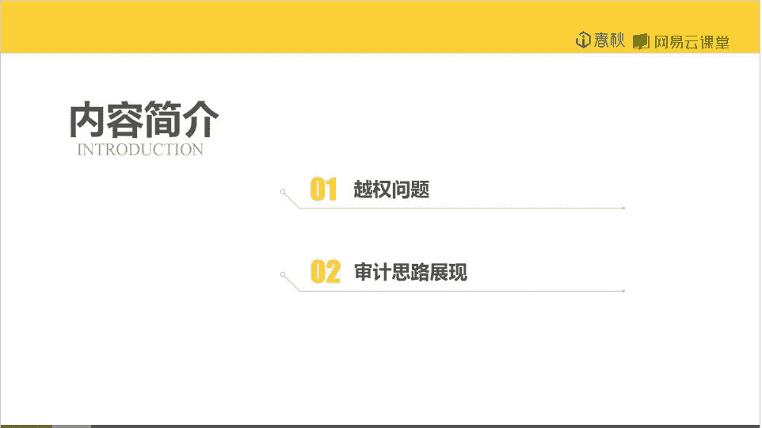

那么我们看代码。啊，这个漏洞出现的问题啊，是因为这个fin这个函啊，这个变量没有经过过滤。啊，它直接拼接之后就代入到了se语句。那么漏洞出现的原因我们已经知道了，那么就针对这个原因进行修复。第啊。啊。

有有些人啊可能会想到啊直接去过滤这样的一个语句。直接去过滤这样的个函数。但是这样是不行的。啊，这样会导致出现一些错误。嗯，为什么这么说呢？来给他的大家演示一下过滤前后的变化。啊，都是过滤之前。

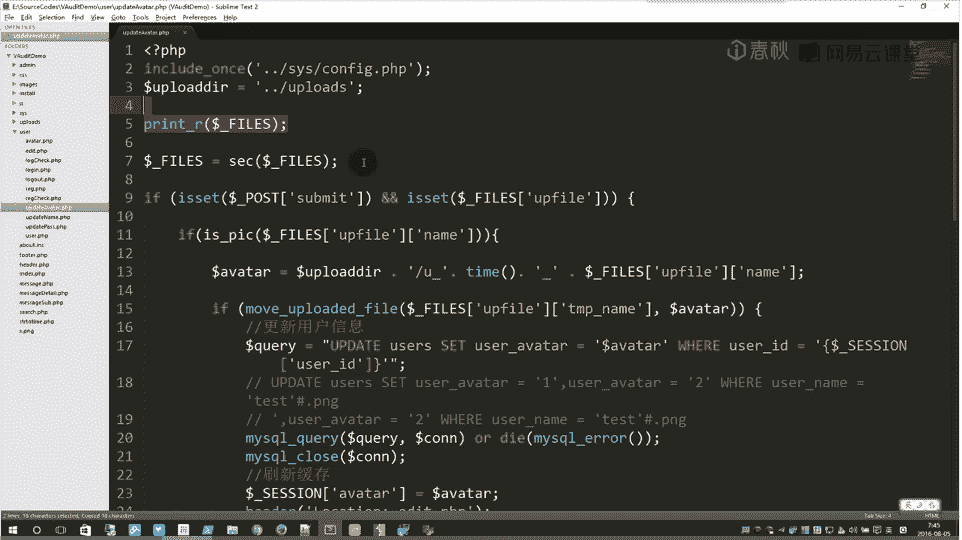

啊，这是过滤之后。我，们来啊测试一下。啊，这是一个。政策啊输入的语句，我们去执行它。然后他是错误的。Yeah。系。它的变化啊不只是name的问题。而且还包括的是t name。

所以说它才是upload error。啊，他的time name出现了问题，啊，没办法移动这个文件。啊，那我们来试一下正常的文件名，它是不是也一样？嗯。一样，你不管它文件名是什么，它的t name。啊。

不同了，所以说导致了一些错误。

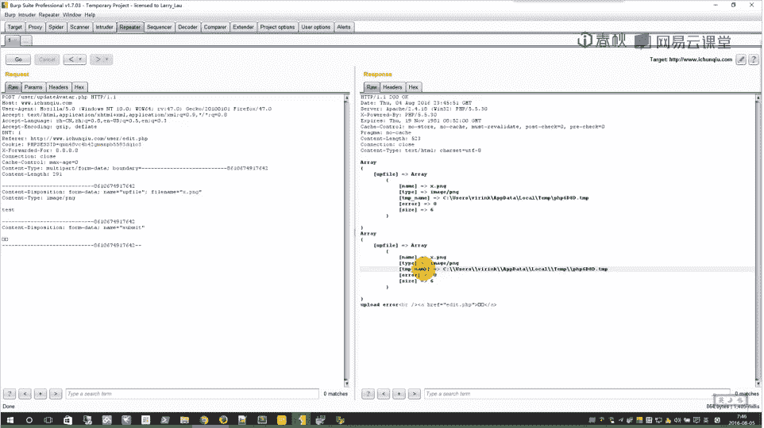

那么我们就不能用这样的方式啊去。啊，过滤。我们需要针对性哪个地方出了问题。我们就要去过滤哪一个地哪个变量。这样。我们这句要带入这q语句的呃电量。嗯，需要把它过滤一下。

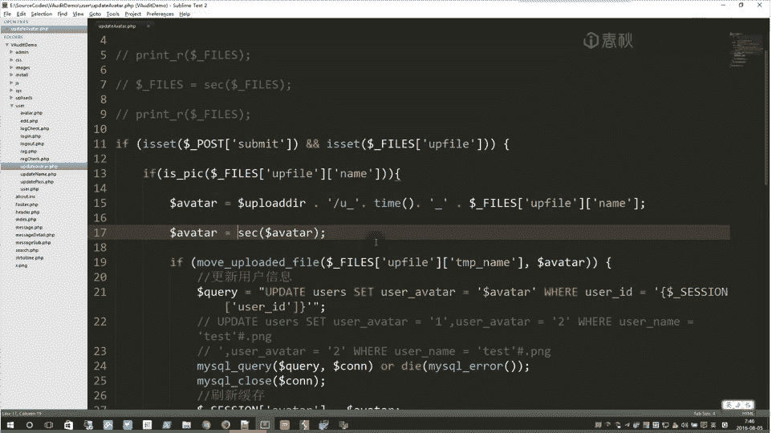

这样我觉得就应该没问题了。那我们来测试一下。啊，首先是正常的文件。上传它啊没有显示错误。啱么。然后现在我们来测试。一些注入的有单引号的。那么这样现在就会出现了错误。也是。就单然后。啊，被转译了。

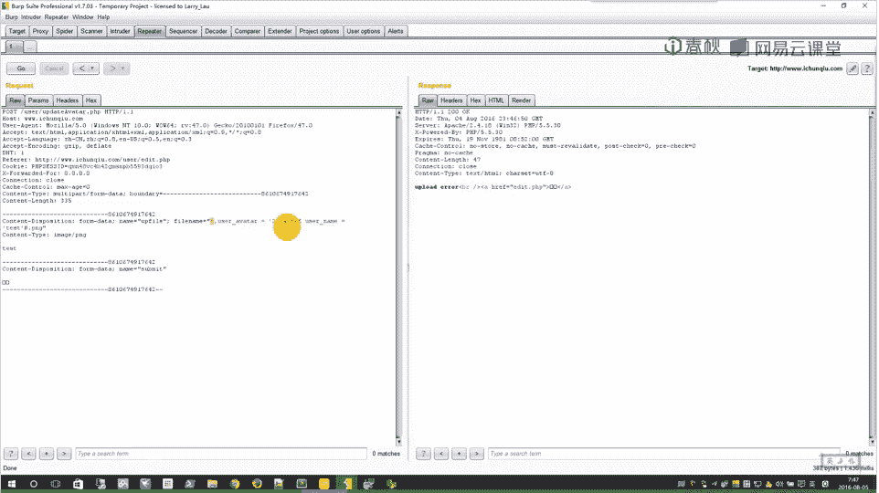

啊，多了个斜杠。啊。文件名啊是不能够有一些特殊字符的啊，如果出现特殊字符。大了。移动不成功，所以说也就会出现er。那样正常文件就可以上传，所以说这样的logo就是样修复的。

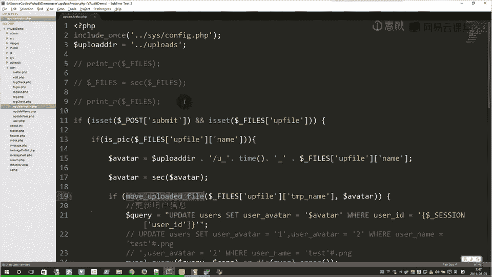

继续月权问题。啊，其实月权问题并不复杂啊，仅仅只是开发者的粗心大意啊，当然有些比。啊，也可能是比较严重。啊，比如什么其他的诱发的变量覆盖啊什么的啊，改变了一些变量。啊，还有一些就是一种比较简单的。那么。

这样的问题导致呃用户可以任意修改其他用户的信息。这样会啊产生一些严重的问题。

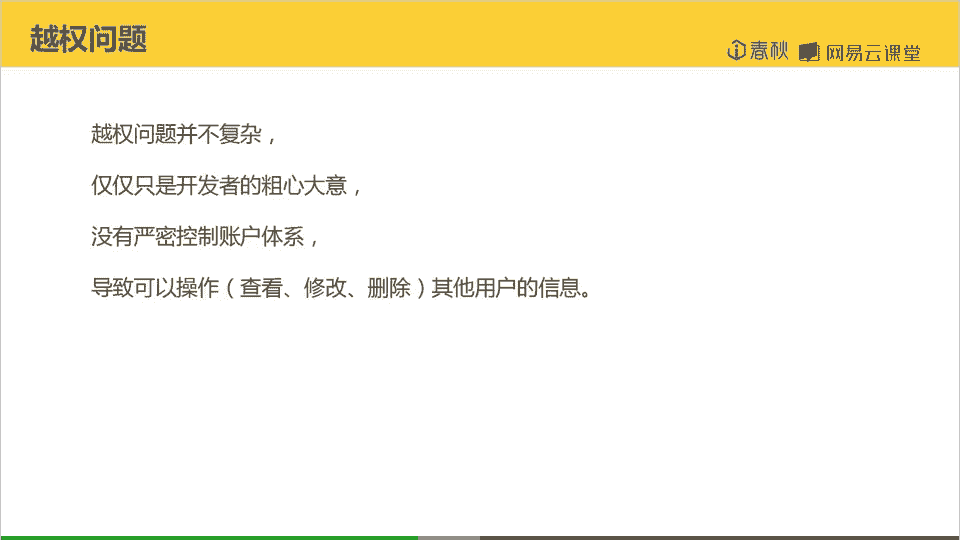

那么现在我们来看代码，我们去找一找有没有这样的地方。啊，这个上传头像的地方，这个文件我们已经看过挺多遍了啊，基本上好像是没有什么漏洞存在了。我们换一个文件看看。哦，更新名字。用户名更新的地方。

不见了一个小小的疏忽。这里居然用的是pos IDD。啊，这个ID居然是啊我们用户可控的。但是我们pos过来的。那这就意味着我们可以啊po任意的ID。进而导致任意用户啊的用户名被修改。

那我们来看一下是否是这样。啊，首先他获取到这个pos IDD的值啊，经过过滤。然后复制到clean user ID这里。然后他就直接把这个 IDD带入到了这个语句里面。啊，去执行啊。

并没有去判断这个ID是当前用户的还是其他用户的。据说这里就产生了一个月晨的问题。那么我们来测试一下。

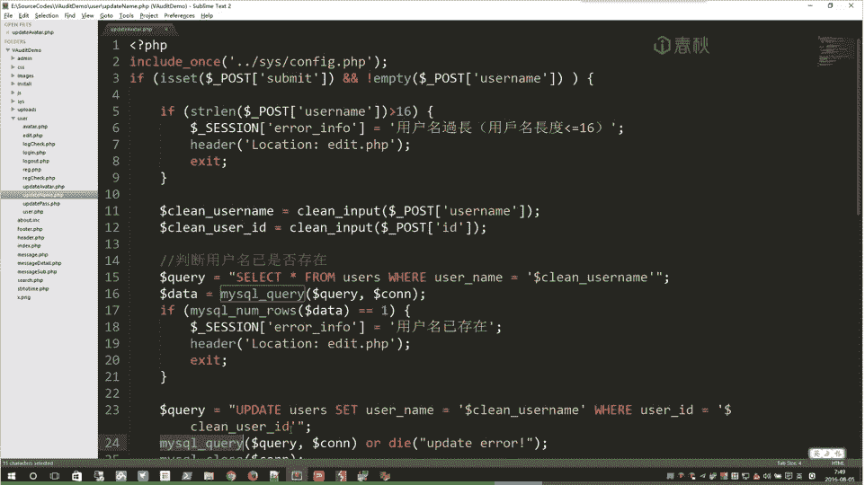

这里我们就直接是。在这里测试。啊，等次就在这里吧。

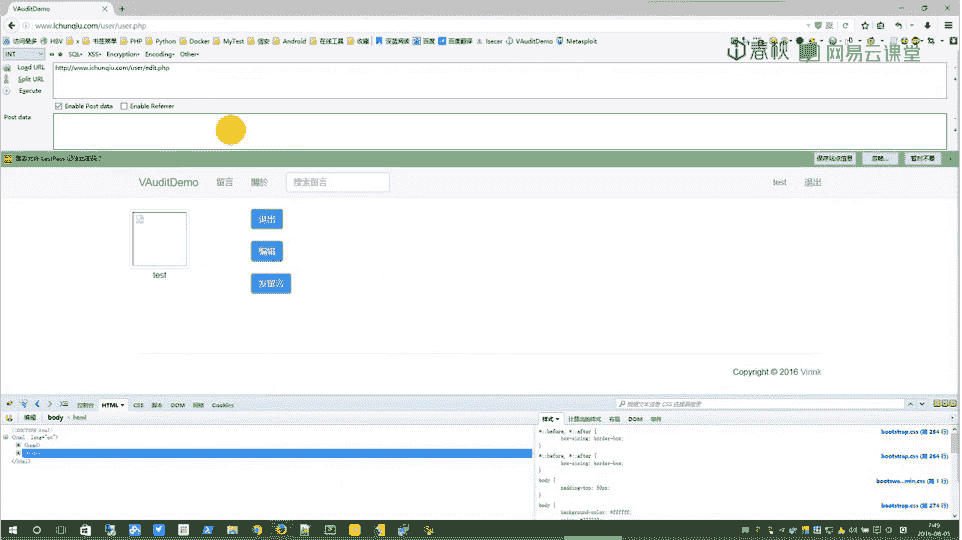

首先他要获取user name和dm及ID这3个po值。

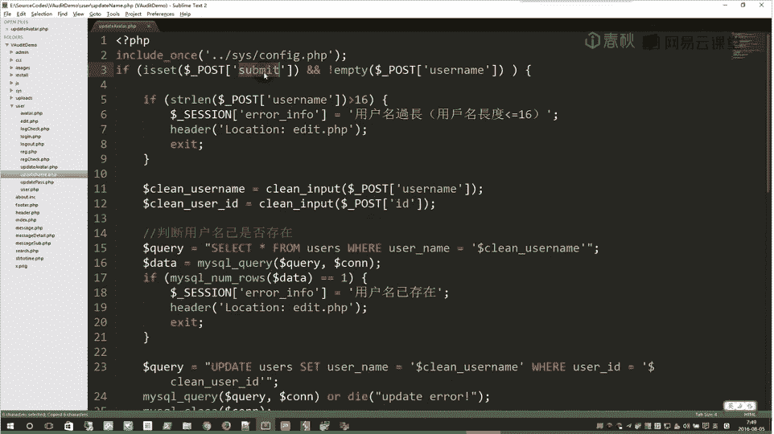

但是。一。这个随任意义只要存在就好。然后是有在呢。啊，我们可以让他等于任意。诶。欠解。然后是ID。呃，ID等于多少呢？来看一下数据库，我们要啊十3，我们以13为示范。要改13的用户名。他现在是叉叉叉。

好，现在我们要把它pos到。

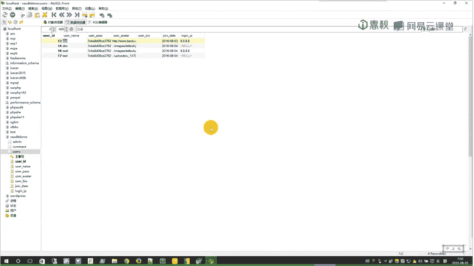

啊，这个update name这个文件。

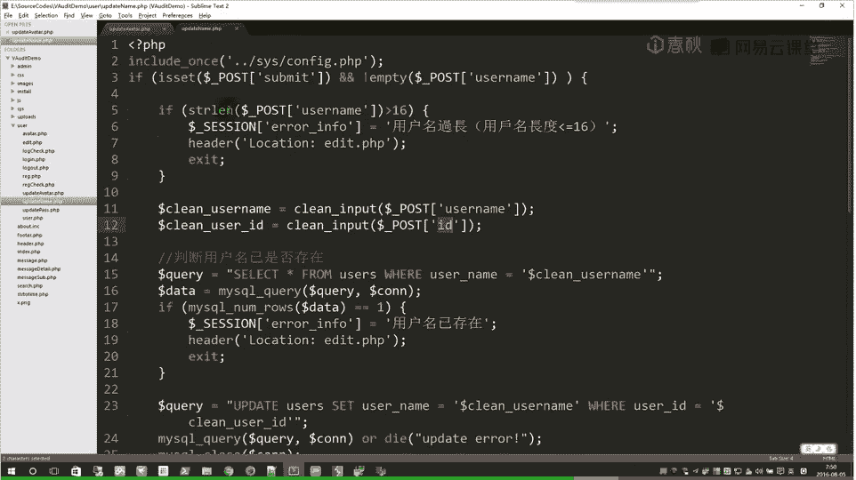

然后就改一下这里。让我们把这个内容pos到这个页面。然后成功修改了。结果你突然发现你自己的用户名。怎么变了？我明明修改的是13啊。我们来看一下数据库。发先。有三遍了，但是日期就是我们自己还是test。

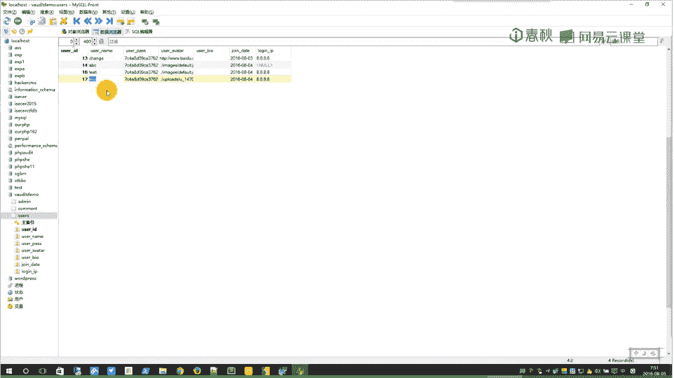

A没有变，这是什么情况呢？我们再回到代码。啊，们跟踪一下这个。点亮。😊，啊，其实也就是。啊， thank you for that。我们输入的用户名can use a name啊。

判断没有最后就呃进入的sQ语句。然后它最后刷新缓存的时候，也就是复制到sionus name的时候，将还是这个clean user name。也就是说我们当前修改的时候啊。

他把我们修改的用户名啊复制到session里面去了。啊，实际上数据库里面的内容并没有修改。所以说我们只需要重新登录一下，就能够重新得到了我们正确的user name。

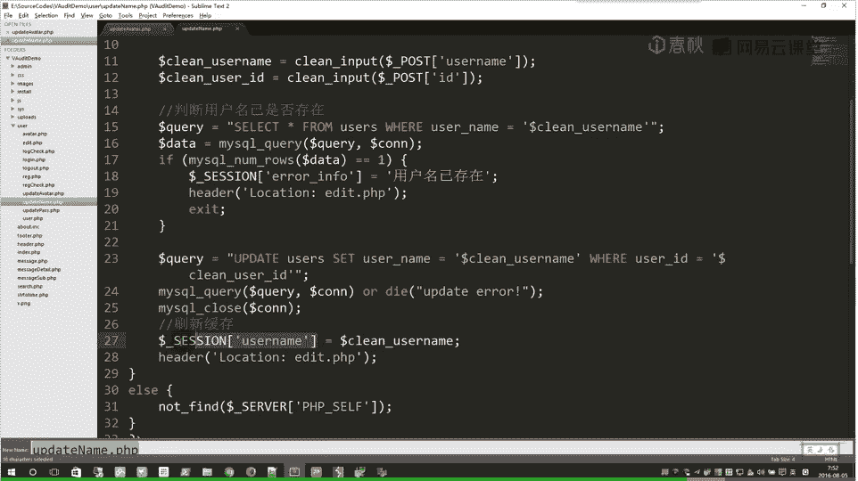

好，那么。就回到PPT总结一下这个漏洞。漏洞其实就是啊它出现了。他在修改信息的时候，用了poOS IDD啊，pos IDD我们可控，这样就导致了我们可以呃控制别人的ID，也就修改了别人的用户名。

好，那我们如何去修复呢？啊，这样也其实也很简单。嗯，不用po就行了。那我们这个ID我们从session直接带过来。直接用筛选ID。你看这个图片的信息。你看。他修改图片信呃路径的时候。

他用的是呃筛选的userID。你说。这里算是一个疏忽。就说我们只要把这里的cle user IDD啊改成我们的ctionus IDD就OK了。

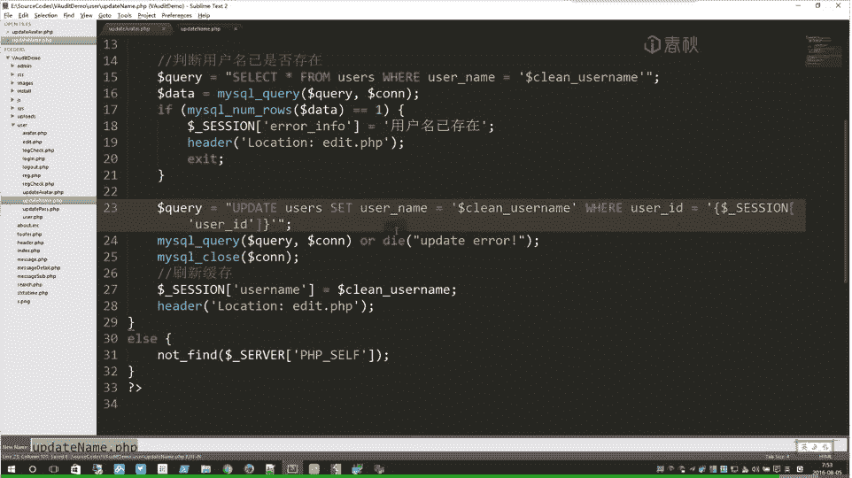

这样我们再来测试一下。嗯，我们趁几之后，我们改回叉叉叉。如果这里变成了叉叉叉，我们再看数据库。啊，结果他自己的变成了叉叉叉。地。这样就严密的控制，不管你改谁的ID。阿里可能只是一个。啊，诱惑你的地方。

其实你只能改自己的ID啊，只能改自己的用户名。好，那么这节课。

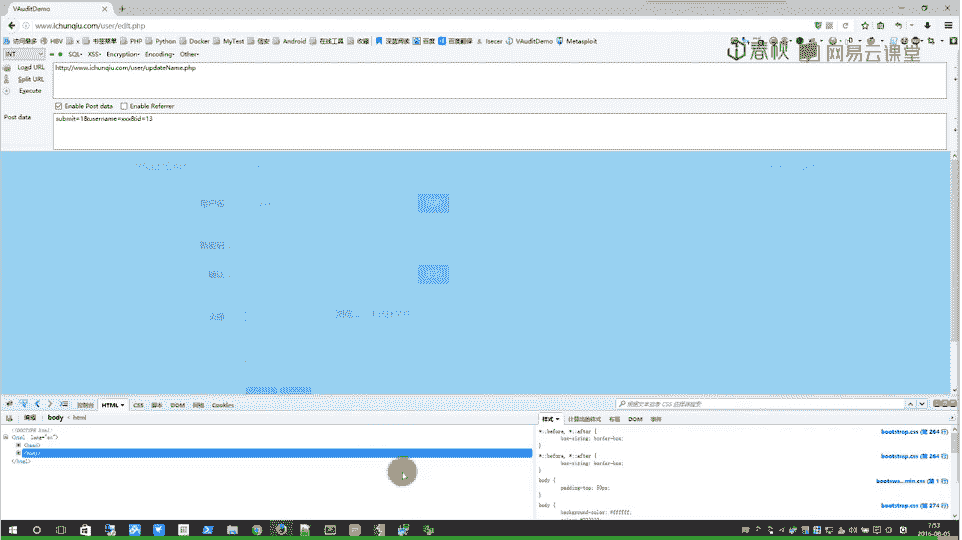

啊，基本上就到这里了啊，感谢大家的观看。😊。

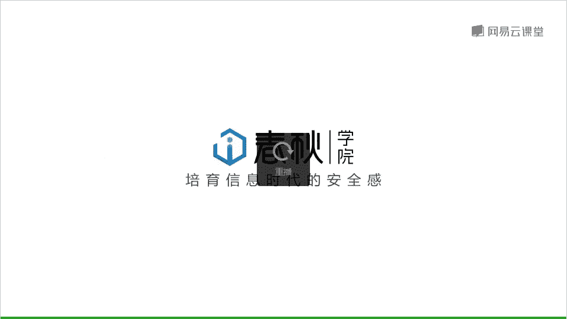