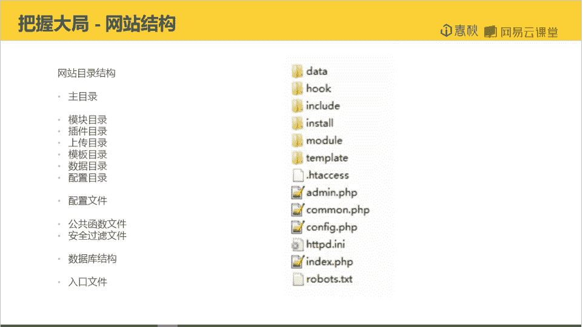
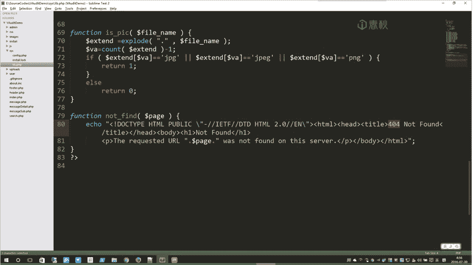

# i春秋学院 进阶篇 PHP代码审计 - P2：第一节 审计方法与步骤 - 老网恋教父了 - BV1D7411S7vf

。大家好，我是万。这节课给大家带来的是审计方法与步骤。代码审计也是有套路的。好的套路可以让你事半功倍。本节课。就主要有两个内容。一。审计前的准备。2。审计方法，也就是审计套路。首先我们来看审计前的准备。

首先我们就需要获得源码，没有源码，我们就无法开始开展我们的审计。然后我们需要在本地搭建。然后搭建了之后，我们才能一边审计一边去调试。如果不进行调试。很难去真正的去找到利用。漏洞的地方。

然后我们需要把握大局。何谓把握大局？审计代码不是拿到源码就去看的。我们需要对网站有一个整体的了解。去了解这个网站的结构。那么怎么样去了解呢？我们就需要去看源码的文件夹。去了解这个程序的大致目录。

目录包含了哪些文件。分析一下它大概是包含哪些功能。然后是找到入口文件，一般这个文件就是ind文件。好，通过去阅读入口文件去了解这个程序的架构进行流程。以包含的配置。好，接下来就是去看它的配置文件。

一般配置文件都是compage。然后我们可以通过阅读compage文件去获得它的数据库相关信息。随后就是要去阅读公共函数文件。重点是看它的过滤功能。当然其他的功能也是需要看的。我们来看一个例子。

网站的结构。中间这一部分是网站。的源码的根目录。我们可以大概看到它有addmininst。faceuser的4个重要的文件夹。好，他的命就是后台后台的管理目录，主要是管理员的一些功能。啊是英。

这主要是网站的安装功能。然inins点cicle。这个文件一般都是数据库的结构信息。好，看s。这个文件里这个文件夹里面是compage和lab，分别就是配置信息以及公共函数库。嗯。

就需要阅读这个两个文件。然后user。用户的一些操作。然后接下来就是in depth。网站的入口。我们就需要去阅读in depth点PH和compagelibb这几个文件。

首先我们来看一袋。Yeah。他一开始就包含了两个文件。一个配置文件。还有一个head文件。包含这两个文件之后，就开始分。整体的逻辑。首先是判断是否存在墨。存在的话，他就包含起。不存在的话。

它就显示一些基本的信息。这个就是。入口文件。好，我们去看一下它的confi文件。第三行他就是。关闭错误报告。有在网站浏览的时候，它不显示错误信息。好，第二部分。判断是否存在lockck文件。如果不存在。

它就跳转到安装文件。需要去初始化安装。好，接下来就是包含lab文件。也就是包含我们的公共函数。在接下来。就是数据库的信息。连接数据库。测初始设置字符集。好，选择数据库。这就是数据库的一些配置。好。

最后还是开启session。我们登录什么的，都需要是session。接下来我们看lab文件。首先就是。设定时区。然后是。判断是否开启GTC。如果不开启。他就要。自己实现GPC的功能，也就是自动转移。

通过调用s函数去添添加转译。好。因为这个flower这一部分它是。不属于GPC。他所以说不管开没开GPC他都要去转译。这就是一个基础的过滤功能。好，我们看到sQ这个函数。这个函数。

的作用就是过滤QQ语句中的一些。敏感的字符串。房止注入。好，是getIP。顾名思义就是获取客户端的IP。Clean input。这也是一个过滤的函数。净化输入。好所 it peak。判断图片。啊。

通过判断后缀。去判断是否是文那个图片文件。有这样的函数，那么这个源码必定有上传图片的功能。很有可能就是呃上传头像之类的。只是not fine。就输简单的输出一些404信息。一个网站。

这三个关键文件都看过了。然后就是去根据逻辑。真正的去审计代码。

把握大局是一个必要的步骤。也是一个审计的前提。有把握了大局，才能更好的去审计。接下来就是审计的方法。或者说是审计的套路。他分别有通读全文法、敏感函数、参数回溯法。定向功能分析法这三类。

首先我们来看通通读全文法。通读全文法这种。特别麻烦，但是又是最全面的审计方法。这样的方法。针对大型程序来说。那，成千上万行的源码。很很难把它读完。读的也比较凌乱。但是这种方法又非常的有用。

通过了解整个应用的业务逻辑，才能挖掘到更多更有价值的漏洞。通读全文法可以从细节全面去了解这套源码。而这种方法呢一般是企业对自身产品的审计。当然，对于小型的应用来说，我们也可以把它读一遍。小型的应用。

毕竟源码比较少。还我们前面所说的把握大局。其实也是。通读全文法里面的。接下来是敏感函数参数回溯法。这个方法就是。根据敏感的函数，去立向最踪它的参数传递的过程。的一种审计的方法。这种方法。很高效。

也很常用。因为大多数的漏洞的产生，都是因为函数的使用不当所导致的。还函数的使用不当。啊，我们需要去找到这样的一些漏有漏洞的函数，也不是说漏洞吧。是函数的特性。我们需要去了解这些函数。

我们可以去阅读官方文档，去了解这些函数的用法，以及可能会导致哪些错误的用法，会导致哪些漏洞。在这方面。啊，师大大有一个。神神器也是原原代码审计系统。他主要是利用正则去匹配一些高危函数。匹配一些关键字。

这种方法是属于静态源码审计的方法。然后这种方法的误报率比较高，我个人呢不推荐使用这种方法。啊嗯。相应的这这样的一些审计的工具，网上也有比较多。这种方法。嗯，反正必要的就是要去了解这些函数。

只有了解这些函数，才能利用这样的方法去。成绩。接下来是比较重要的定向功能分析法。我觉得许多大牛其实都是用这样的方法的。这个方法就是根据程序的业务逻辑，业务功能来审计。一套源码。他啊一个网站的程序。

他必一定有相应的业务逻辑。就比如。文件管理。或者一些其他的功能。出新安装啊。登录认证权限管理呀，数据库备份恢复之类的。我们要找到相关的功能。然后根据这些功能推测它可能存在哪些漏洞。

这些功能性漏洞都是总结出来的。相关功能里面。然后在使用这些功能的时候，那些代码。啊，可能会出现某些漏洞。啊，某些疏忽开发人员的疏忽会导致大概会产生哪些漏洞。嗯，就是去分析代码，去判断这些漏洞是否存在。

审计的方法最主要其实就是这样的定向功能分析法。然后最后是我个人总结出来吧。总结出来代码审计的套路。首先就是要把握大局，不管什么样的网站程序。我们都要把握大局。了解这个网站的整体结构。整体的信息。

然后去根据这样的信息去选择你所使用的方法。如果是大型的程序。就一般就不选择通读圈文法。小型程序看代码量。少的话我们就可以通全文通读一遍。好，就是去分析它的功能，看它有哪些功能。嗯。

再去阅读相关功能的实现代码。去审计。最终。我们还是要去到敏感函数参数回溯这一步。呃，功能里面我们去找他的一些相关的函数，去看这些函数是否用对。所以说。审计的套路就是把握大局。功能定向。敏感函数参数回溯。

本节课到此就结束了。谢谢大家的观看。😊。

