# i春秋学院 进阶篇 PHP代码审计 - P10：课程：登录密码爆破 🔓

在本节课中，我们将要学习登录密码爆破的原理与实践。登录密码爆破属于撞库攻击的一种，通过使用弱口令字典进行暴力破解，尝试登录以达到获取用户密码的目的。

## 概述

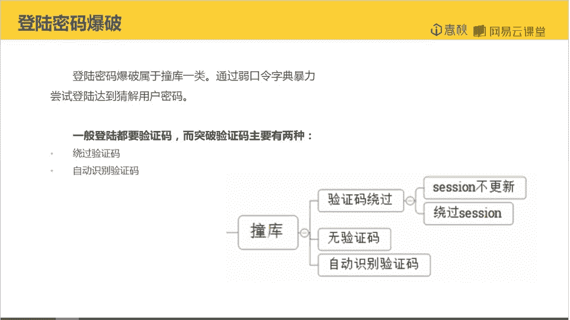

通常，管理员登录页面会设置验证码来防止此类攻击。突破验证码的主要方式有两种：一种是绕过验证码的校验逻辑，另一种是自动识别或人工打码。本节课我们将重点讲解如何通过逻辑缺陷来绕过验证码。

## 验证码绕过原理分析

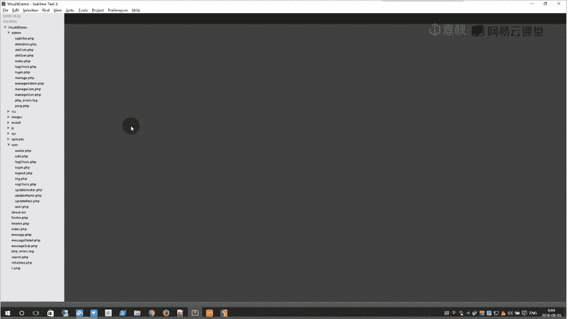

上一节我们介绍了密码爆破的基本概念，本节中我们来看看如何绕过验证码这一防护机制。绕过验证码通常是因为其Session管理存在缺陷，或者验证逻辑本身有问题，使得攻击者可以跳过验证步骤。

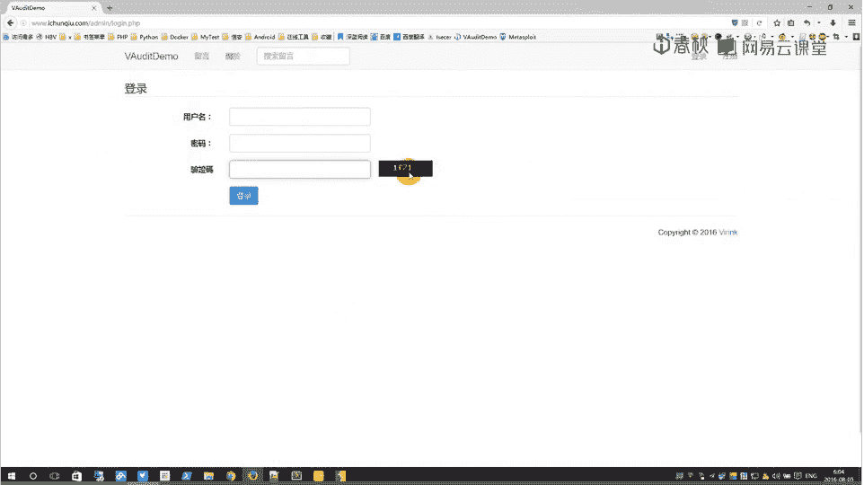

我们首先来看目标网站的登录页面，它要求输入用户名、密码和验证码。

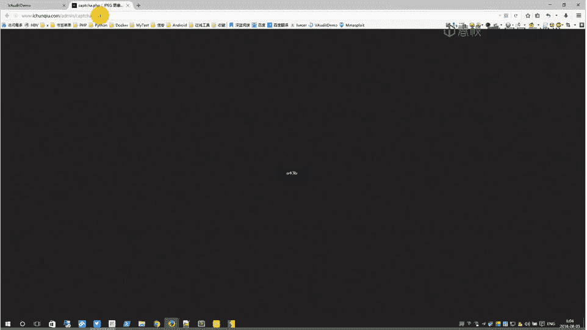

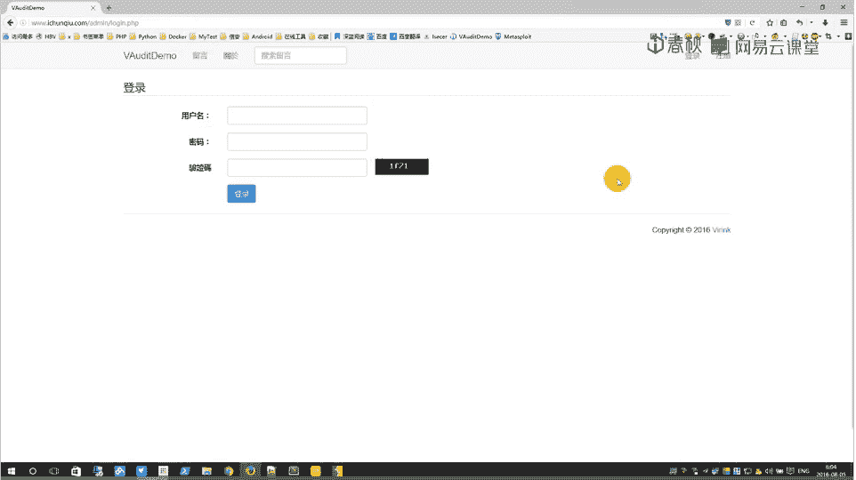


验证码由一个名为 `captcha.php` 的脚本生成。


## 代码审计：验证码生成与校验

让我们回到代码，找到验证码相关的部分。以下是验证码生成文件 `captcha.php` 的核心逻辑：

```php
// 开启Session
session_start();
// 随机生成4位字符串作为验证码
$code = rand(1000, 9999);
// 将验证码存入Session
$_SESSION[‘captcha‘] = $code;
// ... 后续是生成图片干扰线和输出验证码图片的代码
```

接下来，我们查看登录验证文件 `check.php` 中是如何校验验证码的：

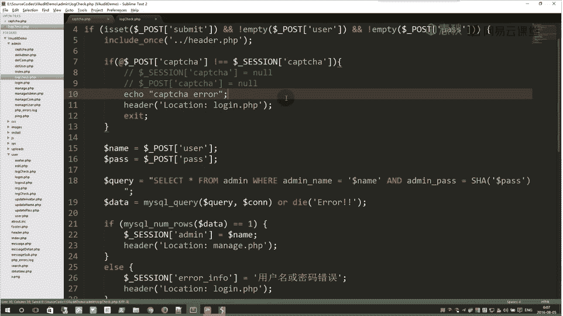

```php
// 判断是否提交了必要的POST参数
if(isset($_POST[‘user‘]) && isset($_POST[‘pass‘]) && isset($_POST[‘captcha‘])){
    // 校验验证码
    if($_POST[‘captcha‘] != $_SESSION[‘captcha‘]){
        // 验证码错误，跳回登录页
        header(‘Location: login.php‘);
        exit;
    }
    // 验证码正确，继续执行登录逻辑...
    // 登录成功跳转到 manage.php，失败则跳回 login.php
}
```

## 发现逻辑缺陷

从代码中我们可以发现一个关键问题：验证码的校验依赖于 `$_SESSION[‘captcha‘]` 这个变量。如果我们在发起登录请求前，**不访问** `captcha.php` 页面，那么 `$_SESSION[‘captcha‘]` 就永远不会被设置，其值将为空。

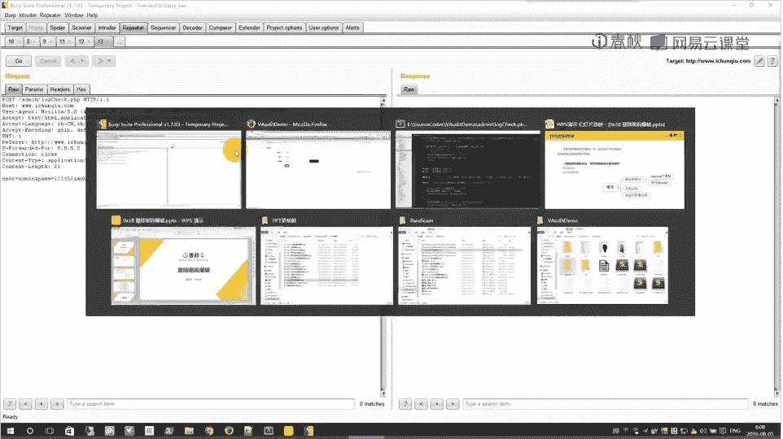

此时，如果我们提交登录请求时，也将 `$_POST[‘captcha‘]` 参数置为空或直接不提交该参数，那么校验逻辑就会变成：
`空值 == 空值`
这个条件是成立的，从而绕过了验证码检查。

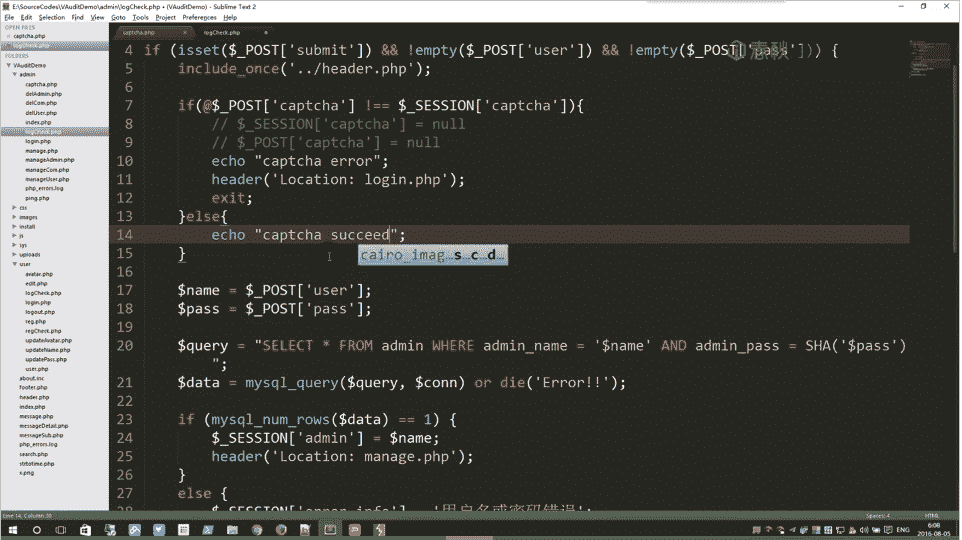

## 实践绕过验证码

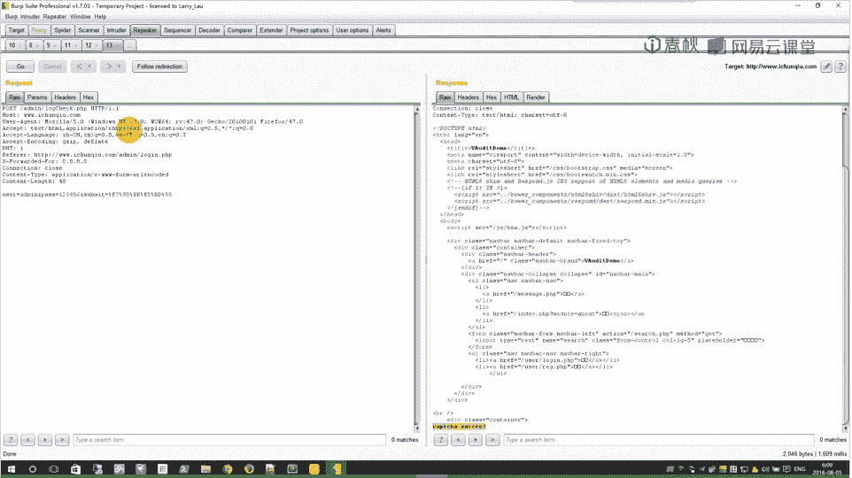

以下是验证该漏洞的步骤：

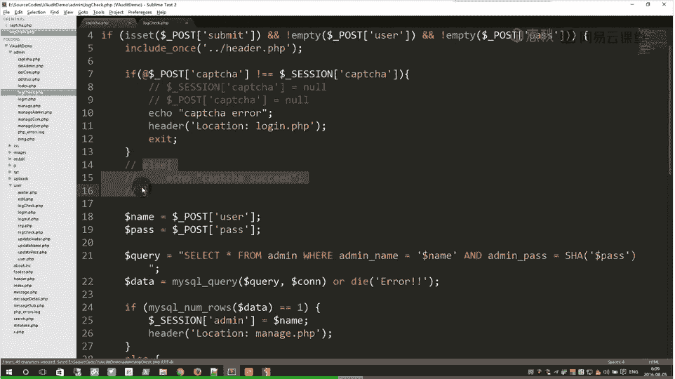

1.  使用代理工具（如Burp Suite）拦截登录请求。
2.  在请求中，**删除** `Cookie` 头中的 `PHPSESSID` 等相关Session信息，确保服务器端生成一个新的、空的Session。
3.  在POST数据中，**删除** `captcha` 参数。
4.  重放请求。


修改请求后发送，观察返回结果。如果返回页面提示登录成功或跳转到了后台管理页面，则说明验证码绕过成功。


## 进行密码爆破

成功绕过验证码后，我们就可以对登录接口进行密码爆破了。以下是使用Burp Suite Intruder模块进行爆破的基本流程：

1.  将拦截到的登录请求发送到Intruder模块。
2.  在 `Positions` 标签页，将密码字段（如 `pass=xxx` 中的 `xxx`）设置为攻击载荷的位置。
3.  在 `Payloads` 标签页，加载一个弱口令字典文件。
4.  在 `Options` 标签页，可以设置线程数（例如100线程）以加快爆破速度。
5.  开始攻击。


攻击完成后，通过对比不同响应包的长度或内容，可以找出成功的密码。通常，登录成功和失败的响应会有细微差别（例如跳转地址不同）。

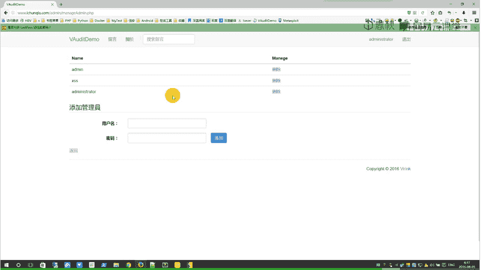


## 漏洞修复方案

作为开发者，如何修复这个漏洞呢？关键在于加强验证码的校验逻辑。以下是修复建议：

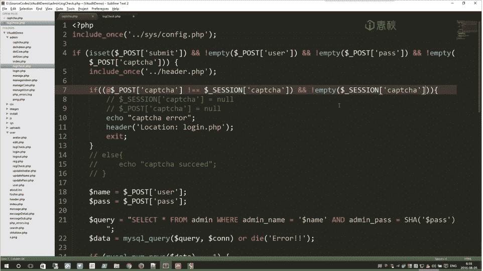

1.  **在生成验证码时，确保Session被正确初始化。** 即使不访问生成页面，也应有一个默认的错误值。
2.  **在校验代码中增加多重判断。** 修改 `check.php` 中的验证逻辑：

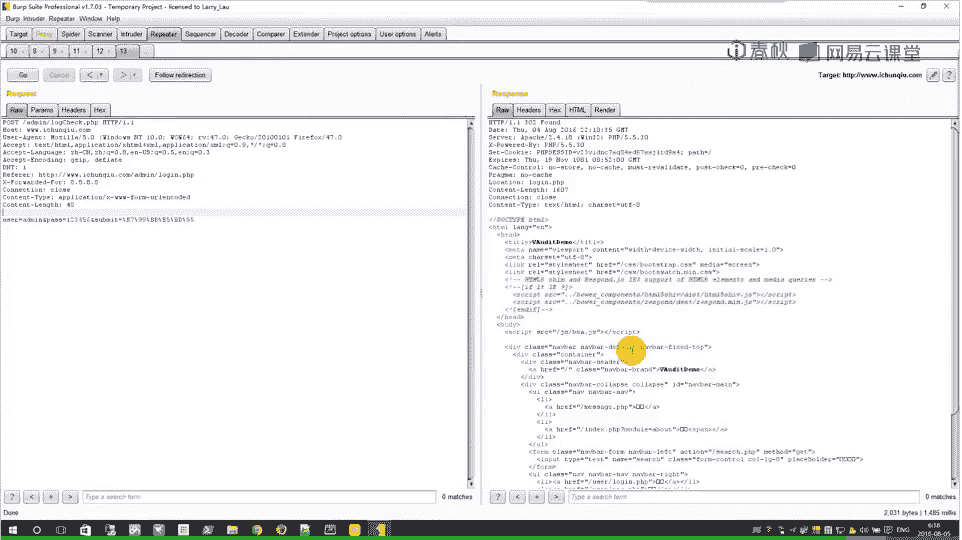

```php
// 修复后的校验逻辑
if(!isset($_POST[‘captcha‘]) || !isset($_SESSION[‘captcha‘])){
    // 如果提交的验证码或Session中的验证码不存在，直接判定失败
    die(‘验证码错误‘);
}
if($_POST[‘captcha‘] != $_SESSION[‘captcha‘]){
    die(‘验证码错误‘);
}
// 验证成功后，立即销毁Session中的验证码，防止重复使用
unset($_SESSION[‘captcha‘]);
```

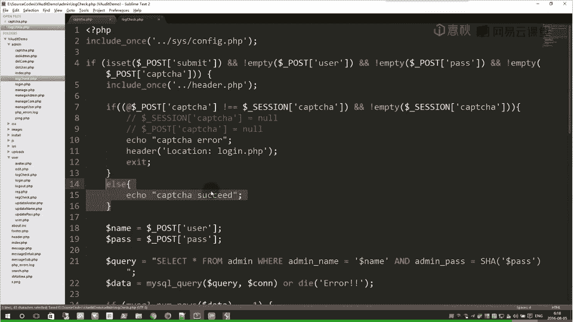

增加这些判断后，攻击者就无法利用空的Session和空的POST参数来绕过验证了。

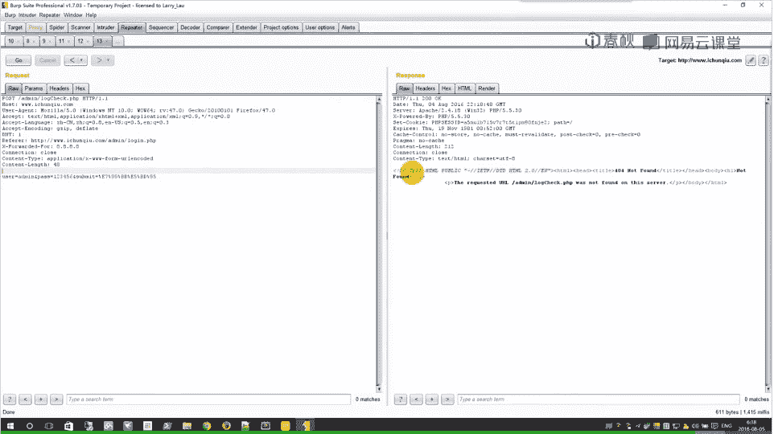

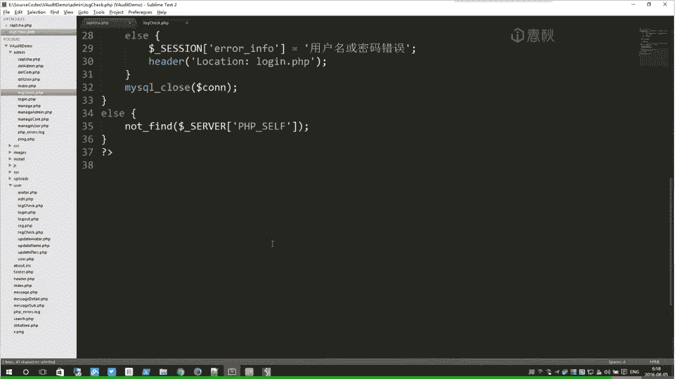


## 总结

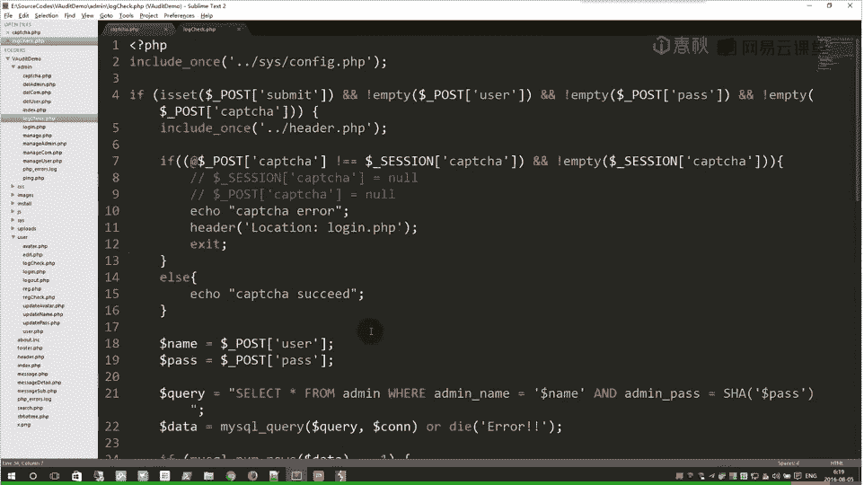

本节课中我们一起学习了登录密码爆破的攻击流程，并重点剖析了一种因Session管理不当导致的验证码绕过漏洞。

我们来回顾一下核心流程：
*   **正常流程**：用户访问登录页 -> 系统生成验证码并存入Session -> 用户提交登录信息（含验证码）-> 服务器比对Session中的验证码 -> 决定是否通过。
*   **攻击流程**：攻击者不触发验证码生成 -> 服务器端Session中验证码为空 -> 攻击者提交空的验证码参数 -> 服务器比对 `空 == 空` 通过 -> 绕过验证码，进而对密码进行爆破。

这个案例告诉我们，在代码审计和开发中，对于验证码、Token等安全凭证的生成、存储、校验和销毁的每一个环节都必须严谨，任何一环的缺失都可能导致整个防护机制失效。同时，管理员设置高强度的密码也是防御爆破攻击的最后一道有效防线。


