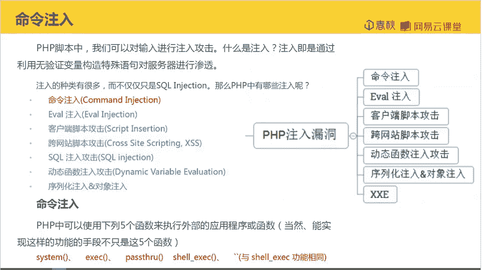
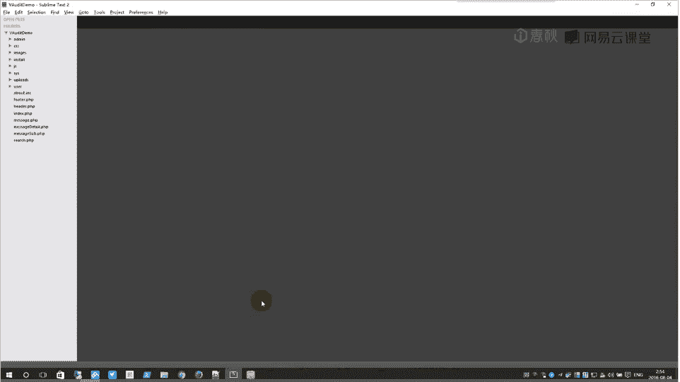
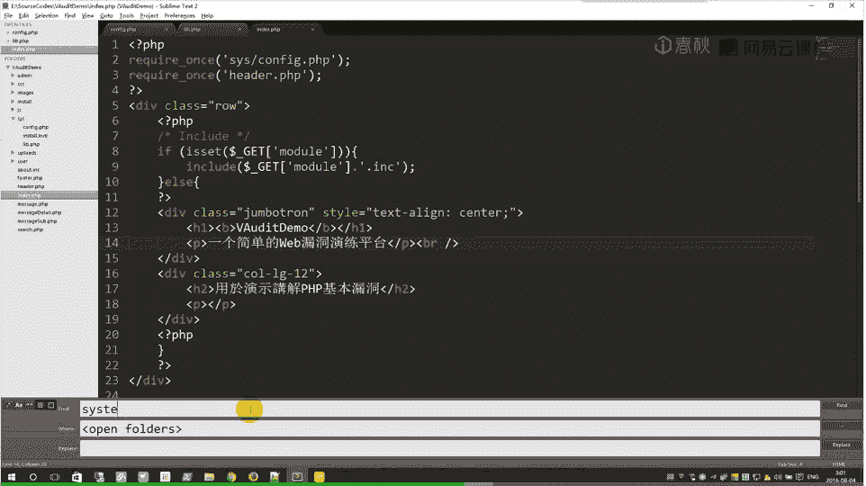
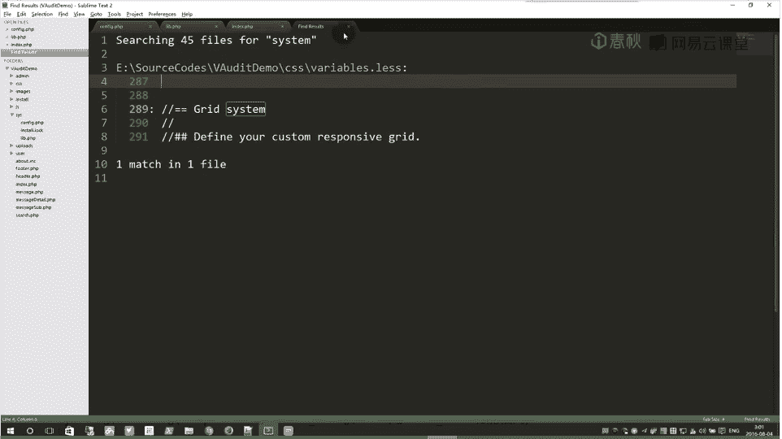
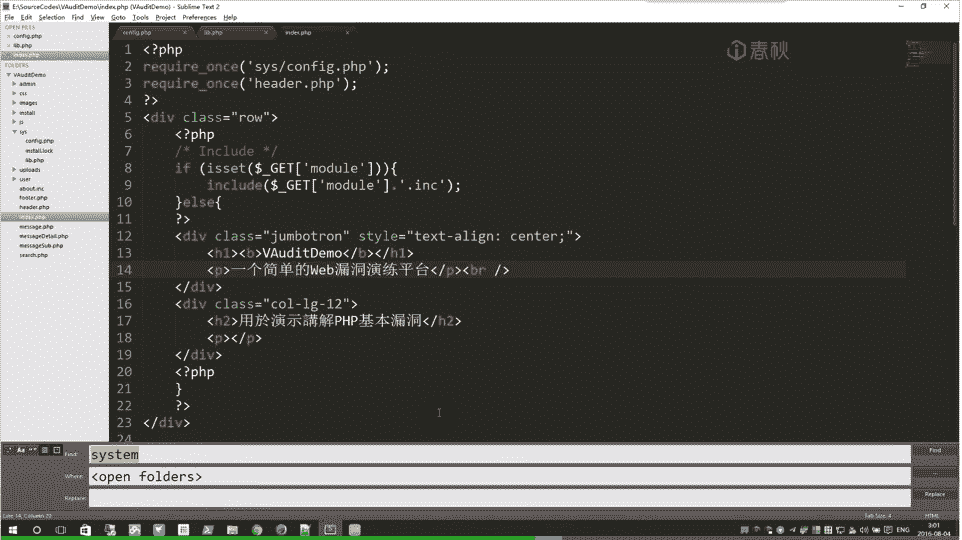
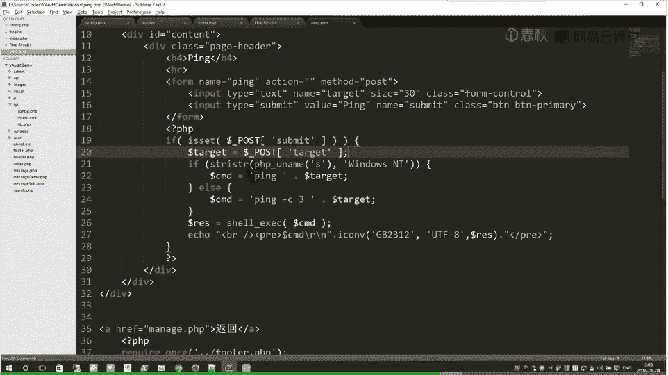
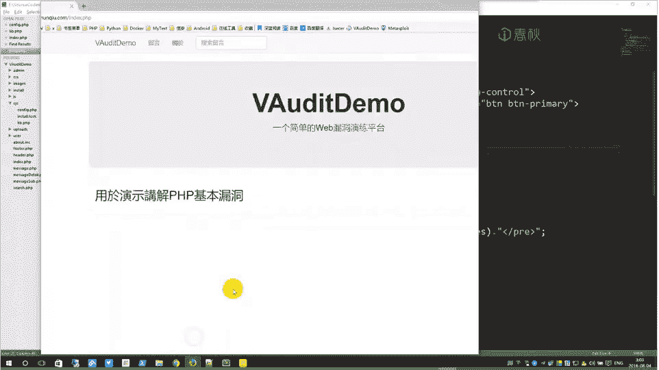
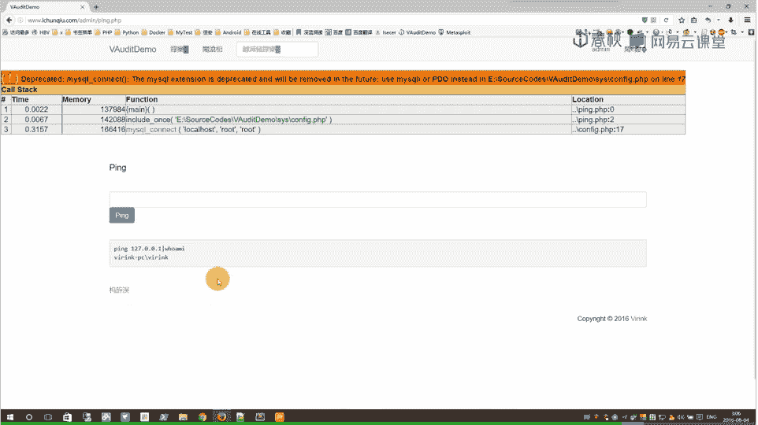
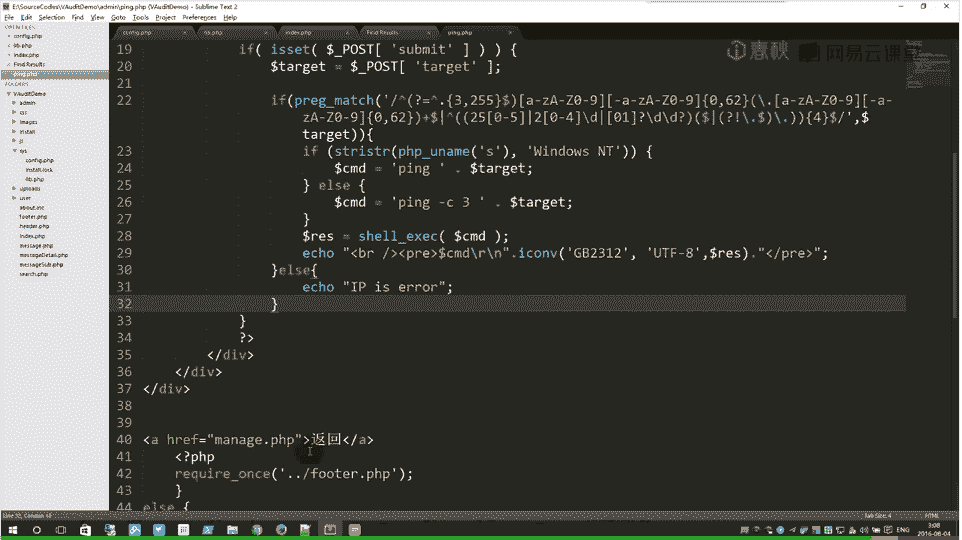

# i春秋学院 进阶篇 PHP代码审计 - P12：课程：命令注入 🎯

在本节课中，我们将学习PHP代码审计中的命令注入漏洞。我们将通过一个实战案例，演示如何使用敏感函数回溯法来发现并修复此类漏洞。

## 概述



命令注入是一种常见的安全漏洞，攻击者通过构造特殊输入，使应用程序执行非预期的系统命令。本节课将带领大家从实战角度，学习如何审计并发现PHP代码中的命令注入点。



## 把握网站大局

在开始具体审计之前，我们需要先了解网站的整体目录结构，这有助于我们快速定位关键文件。


以下是网站的主要目录结构：

*   **admin**：后台管理员操作相关的文件。
*   **install**：网站安装和初始化的文件。
*   **inc**：存放配置信息等包含文件。
*   **user**：前台用户操作相关的文件。
*   **index.php**：网站的入口文件。

## 分析入口与配置文件

入口文件通常是审计的起点，它包含了网站的初始化配置和核心逻辑。

我们首先查看 `index.php` 文件。入口文件通常会包含配置信息，因此我们顺藤摸瓜找到 `inc/config.php` 配置文件。

在配置文件中，我们首先关注错误报告设置。为了方便审计，我们需要将其修改为显示所有错误信息：
```php
error_reporting(E_ALL);
```
接下来，网站会检查是否存在 `install.lock` 文件来决定是否需要初始化安装。然后，它包含了公共函数库 `inc/lib.php`。

## 审查公共函数库

公共函数库 `inc/lib.php` 中定义了网站通用的过滤和安全函数，这是我们审计的重点。

首先，函数库定义了时区，并判断是否开启了 `magic_quotes_gpc`。如果未开启，则调用 `addslashes_deep` 函数对输入进行转义。

我们来分析 `addslashes_deep` 函数：
```php
function addslashes_deep($value) {
    if (is_array($value)) {
        return array_map(‘addslashes_deep‘, $value);
    } elseif (is_string($value)) {
        return addslashes($value);
    } elseif (is_numeric($value)) {
        return intval($value);
    } else {
        return $value;
    }
}
```
该函数递归地对数组、字符串和数字进行处理。对于SQL语句过滤函数 `clean_input`，我们标记此处可能存在绕过（Maybe Bypass），稍后细究。

接着，我们看到了 `getIP` 函数，用于获取客户端IP。这里需要思考IP是否可以被伪造，以及伪造后是否可能导致注入，我们也将其标记（Maybe Inject）。


`clean_input` 函数使用 `mysql_real_escape_string` 对输入进行进一步转义。`is_pic` 函数通过文件后缀判断是否为图片，这里提示我们可能存在文件上传漏洞，可以通过伪造图片文件名上传任意文件。



## 回溯敏感函数





在把握大局后，我们开始使用敏感函数回溯法进行深入审计。核心思路是全局搜索可能执行系统命令的危险函数。

我们首先在项目目录中搜索 `system` 关键字，但结果只出现在CSS文件中，无关紧要。

接着搜索 `exec` 关键字，发现了两个相关文件。其中一个文件（位于 `admin` 目录下）的代码引起了我们的注意：
```php
$cmd = shell_exec($cmd);
```
代码分析显示，变量 `$cmd` 由 `ping` 命令拼接用户输入的 `$_POST[‘target‘]` 而来，并且没有经过任何过滤就直接传入了 `shell_exec` 函数。这意味着如果我们可以控制 `$_POST[‘target‘]` 参数，就能注入任意系统命令。

由于该文件位于 `admin` 目录下，我们需要管理员权限才能访问。本节课我们假设已获得权限，专注于测试命令注入本身。

## 漏洞验证与修复





我们访问后台管理页面，在ping功能处进行测试。

首先测试正常输入 `127.0.0.1`，功能正常执行（返回乱码可能是字符集问题，不影响漏洞判断）。

接着测试注入，输入 `127.0.0.1 | whoami`。命令成功执行并返回了当前系统用户名，这证实了命令注入漏洞的存在。

发现漏洞后，我们还需要知道如何修复。修复的核心是对输入进行严格的过滤。



由于ping的目标通常是IP或域名，我们可以使用正则表达式进行校验。以下是一个简单的修复示例：
```php
$target = $_POST[‘target‘];
// 使用正则表达式验证是否为合法IP或域名
if (preg_match(‘/^[a-zA-Z0-9\.\-]+$/‘, $target)) {
    // 拼接并执行命令
    if (stristr(php_uname(‘s‘), ‘Windows‘)) {
        $cmd = ‘ping -n 3 ‘ . $target;
    } else {
        $cmd = ‘ping -c 3 ‘ . $target;
    }
    $result = shell_exec($cmd);
    echo $result;
} else {
    echo ‘IP/域名格式错误！‘;
}
```
添加过滤后，再次尝试注入，页面返回“IP/域名格式错误！”，而正常的ping请求仍可执行，说明漏洞已被成功修复。

## 总结

本节课我们一起学习了PHP代码审计中的命令注入漏洞。



我们首先了解了命令注入的基本概念，即通过未经验证的变量构造特殊语句，利用执行外部命令的函数（如 `shell_exec`）进行攻击。

接着，我们通过实战演练，完整地展示了审计流程：
1.  **把握大局**：分析网站目录结构。
2.  **入口分析**：查看入口文件和配置文件。
3.  **函数审查**：分析公共函数库中的安全过滤逻辑。
4.  **回溯敏感函数**：全局搜索 `exec`、`system` 等危险函数，并回溯其参数来源。
5.  **漏洞验证**：在找到的注入点构造Payload进行测试。
6.  **漏洞修复**：通过正则表达式对输入进行严格过滤，从根本上杜绝漏洞。


本节课的核心审计方法是**敏感函数参数回溯法**，即通过搜索危险函数，逆向追踪其参数的传递路径，最终找到可控的输入点。希望初学者通过本课能对命令注入的审计有一个清晰的认识。