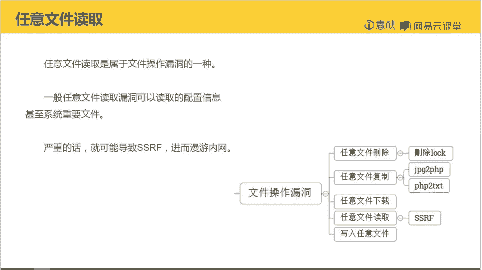
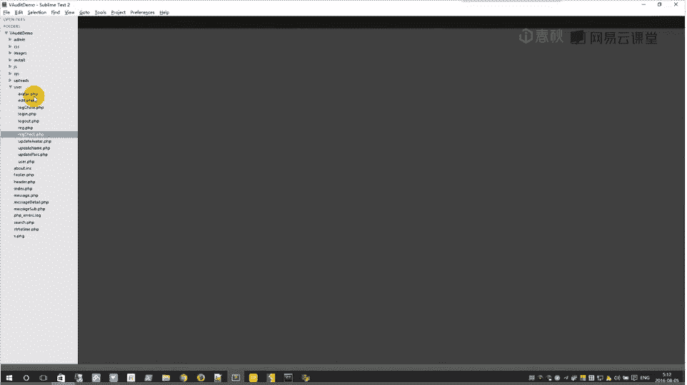
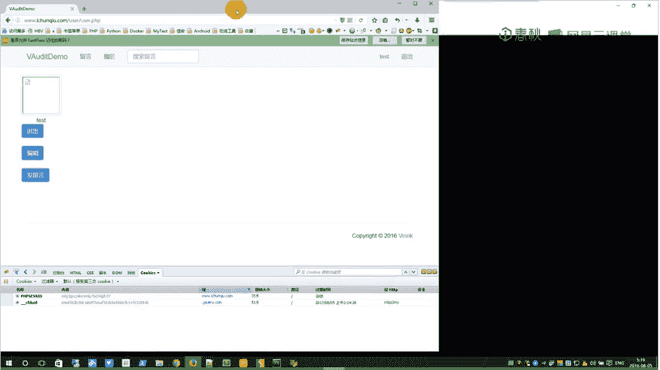
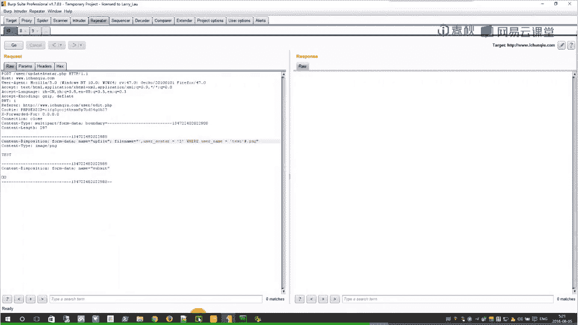
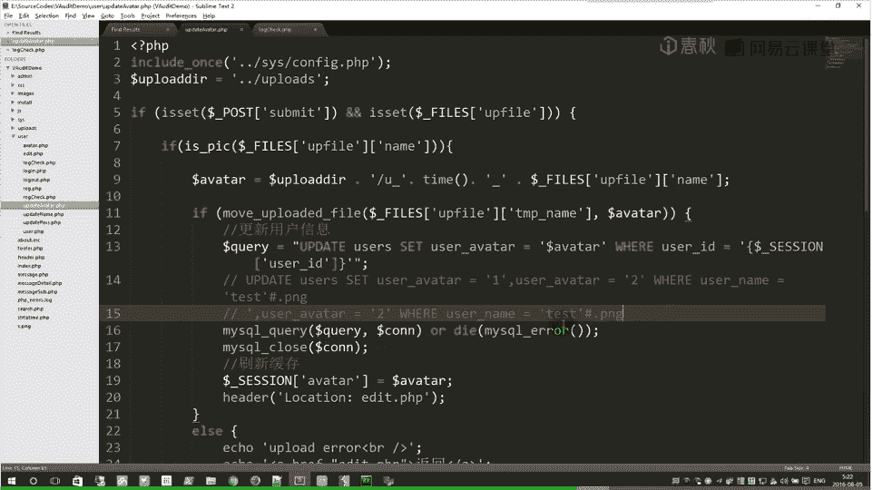
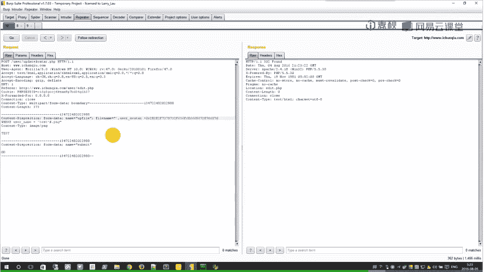
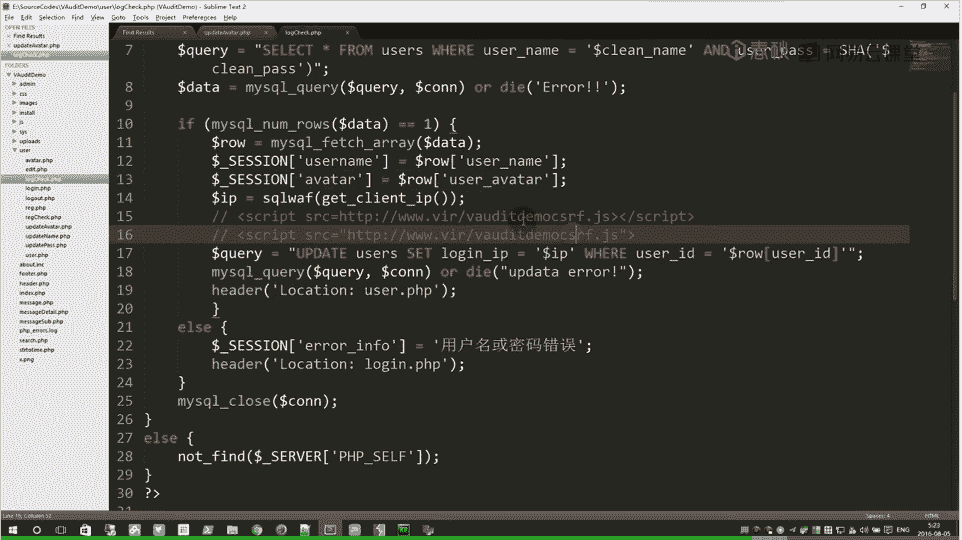

# i春秋学院 进阶篇 PHP代码审计 - P13：课程：任意文件读取 - 老网恋教父了 - BV1D7411S7vf

。大家好，我是viic。啊，这节课给大家带来的是任意文件读取。啊，本节课的内容也就是任意文件读取的漏洞审计。那我们来先看一下任意文件读取漏洞是什么啊，任意文件读取啊是属于文件操作漏洞的一种。啊。

也就是可以读取任意文件。那么一般任意文件读取漏洞啊，可以读取配置信息啊，甚至系统重要文件。那很严重的话呢啊就可能导致SSIF啊漫游内网。啊，这样就是一个啊人益文件读取漏洞。啊。

主要就是能够啊读取文件的一些函数。

那我们来看代码。啊，在上一节课的时候，我们发现它的头像显示啊是用fin get content这个函数。

啊，去读取。那么我们来看一下。啊，他到底是可不可以利用它呢？然，他读取的内容是啊从这个头像的。session。里面获取的啊这个值是从哪里来的？我们还是全局搜索。嗯，首先。因为前面我们找过一次了。啊。

我们这里大概可以看到它的来源一啊，登录的时候啊，从数据库拿来。然后。注册的时候他是默认的啊，不可以修改，无视它。好，在下啊，我们上传的时候。嗯。更新更新它的路径。到这里，我们似乎似啊似乎可以发现。啊。

这里可能是存在有一个漏洞。因为毕竟他的信息。啊，他上传的时候要。更新进入数据库。然后他是啊从变量里复制过来的，这个变量我们不能修改。然后这里的话。好，我们文件名啊是必须是图片后缀。啊。

如果我们直接是修改任意文件名。这样也只能在upload目录下面去读取任意图片。那么可以回顾一下整个思路。啊，似乎。啊。这个读取的内容是session。那么session可以。啊请。

upload不去登录的地方啊，获取到数据库的信息。朋友们。上传的地方可以更改数据库的信息，将是一条。啊，审计的思路。那么我们要怎么样去修改这个信息，而变成我们想要的路径啊，去读取任意文件呢？即你唔叫。

啊。可以考虑注入。啊，也就是。通过注入啊去把它的路径改为我们想要的路径。啊，再仔细一看。啊，他是用啊把fi的变量。嗯，拼接后就直接带入。啊，带入这个do语句。啊，没有经过什么QQ注入啊，那个过滤。啊。

而且这个fins的变量也没有转移。那我们是不是可以白pass掉这个。啊，单引号。好，掰 pass之后。然后他还是通过这样的一个拼接。那我们这里是怎么去修改呢？啊，这里就给大家说一个黑科技。

upupate这个语句。upate语句啊，它的set的字段啊可以是双重的，多重的。这样子的。前面是一，后面是2。好，这样的一句语句它执行后。啊，他的。呃，这个user。al字段啊，它的值啊就会是2。

不要问我为什么，我也不知道。😡，反正他就是这样一个特性。还可以多重设置，但是他取最后一个值为正确的值。然后。嗯，那我们就可以不管这个一它到底是什么样的内容，我们用单引号去闭合它。那我们就。

再次设置一下他二的内容就是我们想要的路径。这样似乎可行。哦，但是我们又要考虑到另外一点。啊，他会判断一下我们的文件名。他是不是啊图片型的后缀？那我们这里还得继续考虑。我们要怎么去截断它？啊。

构造一个语句。哦，并且他是以图片结尾的。以图片结尾的，我们必须是。啊，点偏G。然后前面我们是可以继续截断。好，但是我们不知道我们当前用户的ID是多少。哦，这里的话我们就可以考虑。啊，用。嗯，有份。

用我们的名名字us a name。然后是。TEST怎样？我们似乎似乎就可以考虑啊以这样的方式去弄。好，我们来测试一下。好。我们基本上赔料的。啊，是这样一句的。我们先看看能不能啊把这个user。就是。

everva改成2。啊，现在。

好，我们来退出。刷包登录。系。34遍。然后我们去上传。想上传任意一个图片文件。有。Okay。然后。我们去看我们的历史。好，我们是找HP脚本。我们找到登录的。好，把它啊。用按 controll。

ctl加R把它发送到呃重放攻击的地方。好，我们在。啊，这是登录的，我们再找到一个是。获取图片信息的。放到同样把它放到重放。好，我们再继续找到update上传的也是放存放去。两三个。那就基本上找到了。啊。

首先。我需要。这个。上传包。好，上传上传。长谈悲剧。把它放到文件名这里。嗯。

同时我们这里是可以把这里。啊，改成my circlecle错误信息输出的地方。这样。如果啊执行失败的话，他就可以报出我们错误信息。

执行。啊，似乎没有失败。我们来看一下数据库的内容。刷新变成了2，说明我们的方法可行。那我们把二变成。我们想要读的文件。fi come住。点PHP我们再来。也没有错。你再看数据库清晰。咦。😊。

这就出了问题了啊，并不是我们预期的问题。好，我们再看到底是什么地方出错。哦，原来是斜杠的问题啊，在文件文件名的地方啊是不能够有路径存在的。它可能是一个单纯的文件名。不能有斜杠。看完。

这样的话我们就把它转化为十六进制。这样子1六进制。转化为十六进制。啊，以1六进制的啊格式把它。啊，设置它。零七。你给我来。啊，执行。那我们再看数据库。成功变成我们预定的值。嗯。

compageage的内容。Okay。然后。

澳门。啊，在看代码。因为他前面我们说过，他是。啊，直接把这个变量复制到session里面。我们需要啊重新登录啊，重新从数据库去获取这个路径信息。

所以说我们这里是抓了一个登录包。我们要把这个。Secondd。coy的ID改一下，随便改一个A。好，把我们这边获取头像信息也是改成A。这样我们重新获取一个登录。然后再去获取头像。这样我们就看到了一个。

代码。就是。啊，coy啊这个compage的代码。这就是任意读取文件。我们再来测试一下是否能够推取其他文件，我们改成lab。啊，继续上传一个lab的信息。上传成功提取获取信息。啊，登录再获取。果然变了。

啊，就是我们的lab的内容。那么我们已经成功的读取了任意文件。但是现在我们要测试。呃，是否存在SSRF？嗯，是否能够访问网页，你这里没有内网环境，我就访问百度。转为是六进制。成功设置再登录。好。

获取图片。咩啊。成功的访问到了百度。啊，这样就是表示存在1个SSIF漏洞啊，如果是。啊，网络环境的话，那么如果它存在内网，这样就可以利用这个漏洞区啊。渗透它的内网。那么现在。来总结回顾一下。

我们是发现了一个fin get sentence啊，这个函数。啊，他的参数。啊，来源于嗯session。那这个信息从哪里来？啊，他从数据库来的。那数据库的内容是从哪里来呢？我们上传的时候进行个注入。嗯。

最终的来源就是我们的上传文件的名字。这样的一种呃溯源。啊，就是变量溯源的方法。溯源的方法。那么这节课我们就讲到这里啊，感谢大家的观看。

