# i春秋学院 进阶篇 PHP代码审计 - P3：第二节 常见的INI配置 - 老网恋教父了 - BV1D7411S7vf

大家好，我是wite。这节课给大家带来的是常见的INI配置，也就是配器的配置。本节课主要有7个内容，一、配置文件。2、配置文件的语法。3、电量相关的配置。4、安全模式的配置。

5、上传文件及目录权限的配置。6、错误信息的配置。7、魔术引号及远程文件的配置。首先我们来看一下配置文件。一般PP的配置文件是指PHP点INI。也可以是KT版本号点INI。然后这是一个全局的配置文件。

它里面都是默认的配置信息。好，另外还有一个点user点INI文件。啊，这是一个用户级别的配置文件。它和阿帕奇的点HTF呃是一样的，呃，都可以在呃网站的。在目录和子目录里面使用。然。

另外还可以是在HTTPD点comage中覆盖PPNI的值。呃，都有需要用相关的语法。呃，另外P区的配置它有不同的配置权限。嗯。不同的权限嗯。不在不同的配置文件是不一样的。啊，具体的配置权限。啊。

我们可以去去官方文档查看。接下来是语法。呃，PT配置文件的语法呃和一般的II配置是差不多的。呃，这里主要是变量名等呃指令名等于值，指令名是大小写敏感的。

它的值可以是字符串数字、PP常量、INI常量或者表达式。啊，现在我们就开始讲解常见的重要的配置。一个变量相关的配置。嗯，全局变量。嗯，这是一个将tot getco等键值直接注册为。电量的配置。好。

这个配置在新的版本已经移除了。因为他他有很严重的安全问题。首先我们不知道这个变变量是从哪里来的。他可以是port，也可以是get。还可以是sd的。它来源不明确嗯，我们阅读代码不方便，也不便于维护。

它还有可能造成变量之间的相互覆盖，引起麻烦。因为安全问题，所以说就取消掉了。呃，同时这个配置也是默认是关闭的。嗯，现在我们来看一下。我们通过KK study的控制面板。去直接打开它的配置文件。

这样就是一个配置文件，各种配置信息。然后我们需要找到。嗯，全局变量。就是在这里。默认是关闭的，我们设置为。打开。啊，我们需要重启。接下来我们。来测试一下。呃，为两句这三句代码嗯获取get。呃，获许破。

然后输出tt这个变量。

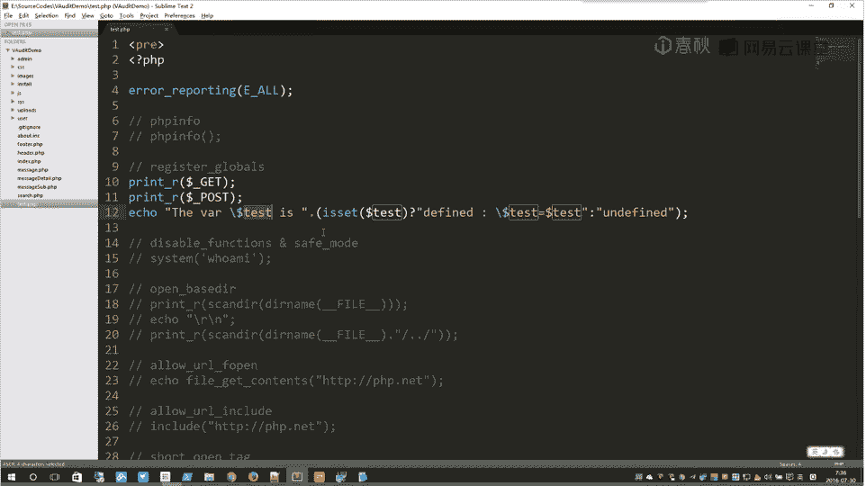

首先我们刷新一下，就是它post get都没有，然后他就是t是没有定义的。首先我们来pos一个t变量。传输一个呃get1个PHP。我们get到了1个P器电量。然后同时他也把它注册成test变量。啊。

现在我们再加一个po。呃Get posted。同一个变量名啊，它的值不同。那么他最后它的text变量。啊，是po的值。这样就是覆盖的问题。可实。就把它移除掉了。然后接下来是短标签。好。

这个这个配置是允许P区代码用缩写的形式。嗯，来具看具体代码。

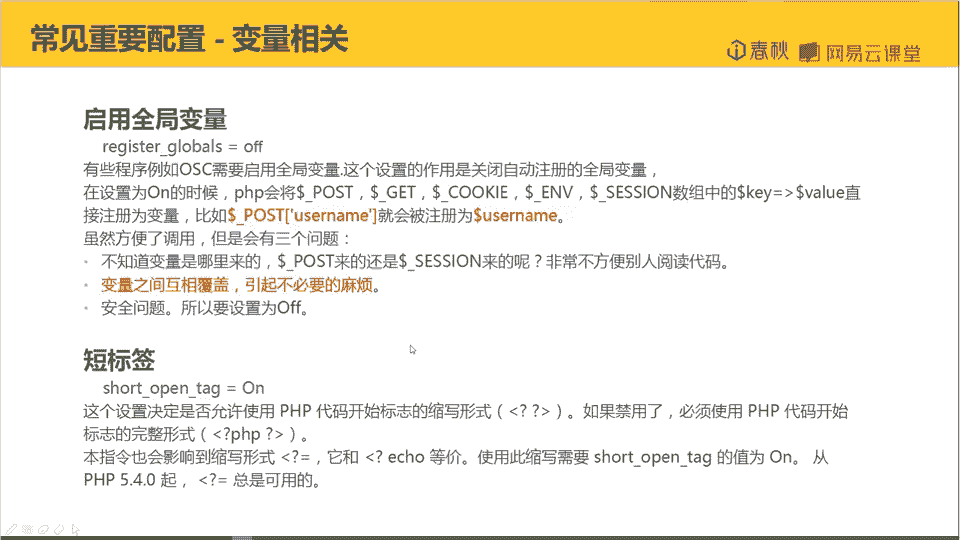

啊，我们先。这啊设置test的值为PAH，然后同时用短标签输出它的值。

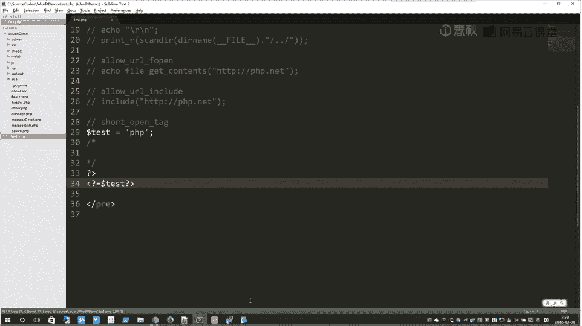

嗯，还需要修改配置，先恢复。然后再找到。太。在这里把标签配置，我们把它啊，现在是打开的。

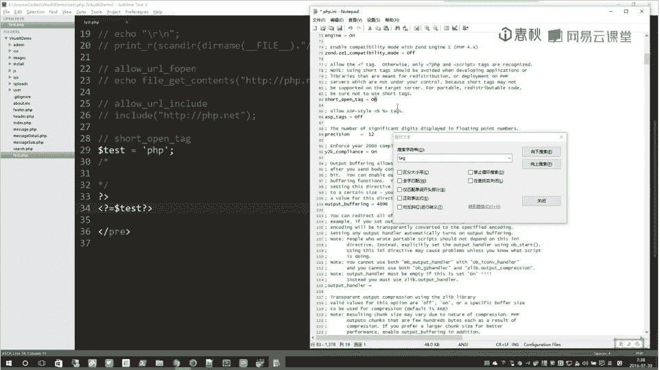

那我们就先看看。啊，他成功输出PT。就是短标签输出的内容。好，现在我们关闭它。保存。好。重启的。呃，现在我们来再刷新。海人不输出了，没有了。我们来看一下源源码。他就直接是字助串形式就把它输出来了。

不解析。看到么？这就是短标签的作用啊，我们为什么要讲解这个配置呢？调试。我们上传的时候可能会上传一些执行执行代码，上传一句话exel。然后有些时候程序会判断它的内容，它就直接判断标签。

存在呃间括号冒号外问号PHP啊，它找到这个字符串，它就不允许上传。如果开启了短标签，我们就可以用短标签啊变形这个一句话了。好，接下来我们讲安全模式。同样这个安全模式啊也是在新的版本移除了。

我们这里就简单讲解一下。这个模式呃是不允许一些呃危险的函数。他就直接禁禁用了一样。但是默认的配置是不打开的。好，我们来看看打开的会是怎么样子的。

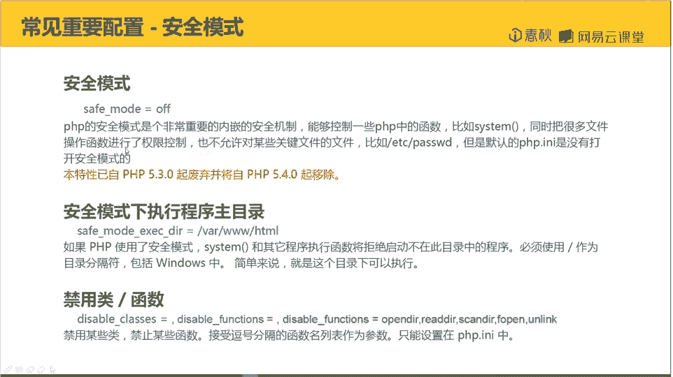

还是先恢复。好，现在我们来找一下。Safe。冇。嗯打开下。ok。还是重启。然后。可以看一下。然后我们看一下安全模式的代码嗯。几见。如果他打开了是无法执行的。

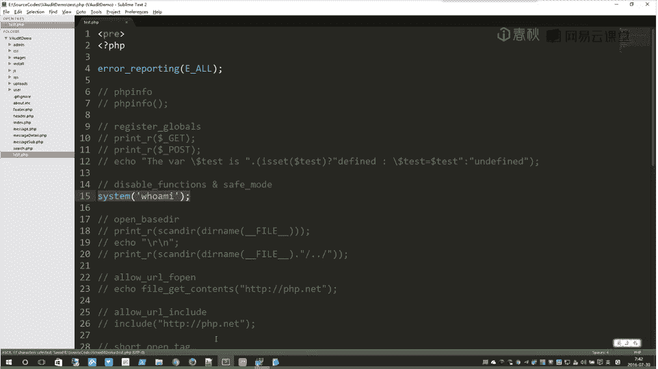

嗯，我们就来看看。还行。他什么内容都不输出，也就是呃这个函数不执行。嗯们把它恢复关闭。嗯。嗯，再来看看。输出了也就是。执行了。sstem函数。啊，输出了我们的OMI信息。系没。安全模式下执行。

这个我就不详细说了，毕竟已经废弃了。好，我们再来看一个比较重要的应用类或者禁用函数。这是一个非常呃常见啊，用处非常大的一个功能。呃，很多的配置都会进用一系列安全安全函数。我们还是。看具体的操配置。

也找到。我们这里。因为我们前面没有禁用st，它可以执行。你现在禁用一下。保存。重启。那，现在我们来再来看看。啊。但是。刷新。他出现提示信息警告。这他们这个函数已经被禁用了。

也就是diable function这个配置。呃，禁用函数。嗯，这样我们就可以把一系列的危险的函数把它禁用起来。那么接下来我们再看。上传文件及目录权限。呃，一般默认的情况，上传配置是打开的。

就fi upload是on。好，下面这个hel特man。fiside这是。上传文件的大小。然后你现在配置了呃是8M的话，然你上传的文件只要大于8M。他就不会上传成功。然后是。上传临时上传文件的临时目录。

如果你不设置它为空的话，它就采用系统的临时目录。啊，如果是linux就是杠TMP这个目录，然后windows就是在windows的t下面。啊，用户访问目录限制，这也是一个比较常用的配置。呃，就是限制啊。

你。所能所能够访问的目录一般是限制在网站的根目录。你就用点来代替。好，同时呃临时目录也是允许。毕竟还要上传一些文件。这样，然后00时。呃，采用。冒号来分分割。作为呃不同目录的分割符号。好。

如果是windows，他就用分号。好，我们来看看这个配置。

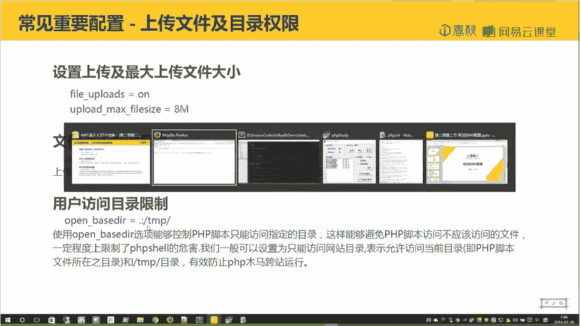

也就是这里他现在是默认是不配置它，也就是空的。我们来配置一下。然后点。很号。然后我们的。嗯，临时目录。那就是这样。嗯，我们再来重启。嗯，在配置具体代码。啊，是对。嗯，这里是。跟目录呃。

查询跟目录下面的目录信信息。然后这是根目录的上一层目录。那么如果是配置了。我想俾佢。这个配置的话。他第二个。

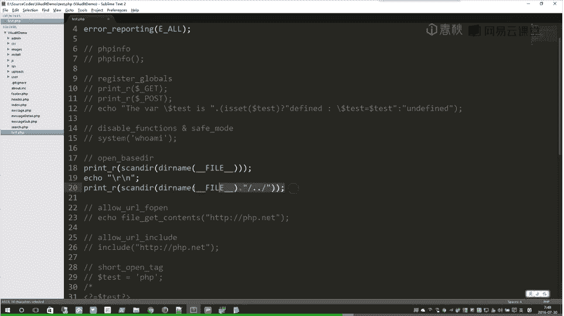

就不会执行成功。我们来看一下。刷行。嗯，上面是成功的查询了目录。然后后面是。因为有这个限制。还不允许查看上级目录。

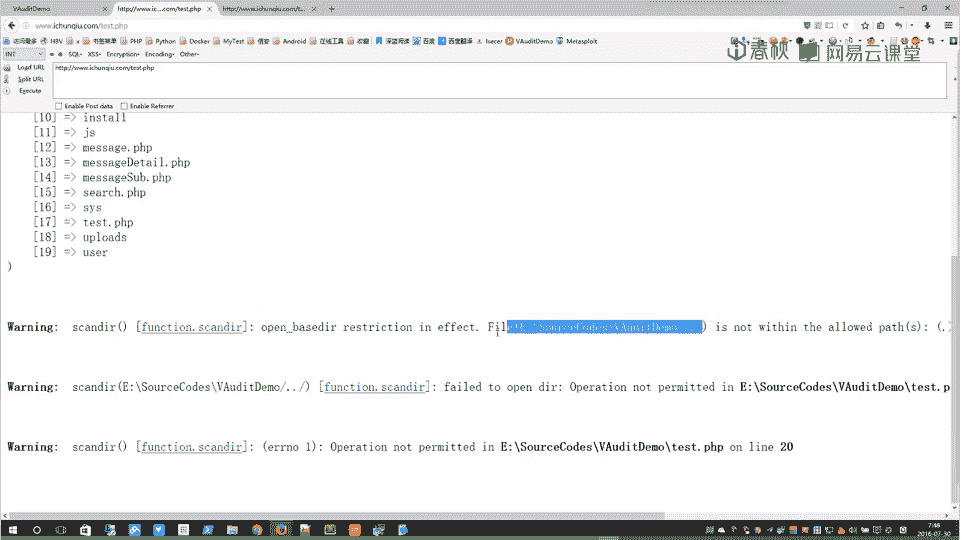

也就不成功。这就是。我俾须。DIR的配置。

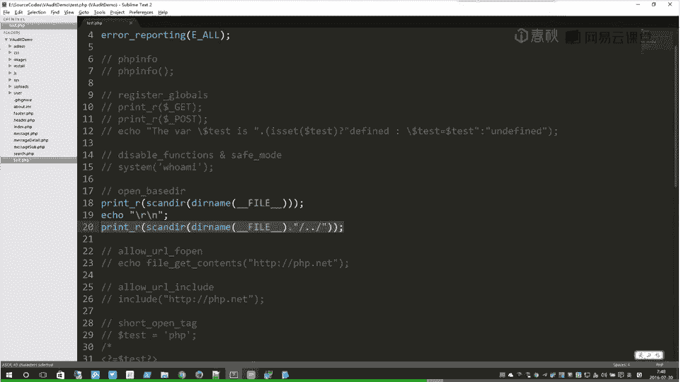

好，我们再来看。错误信息。呃，这个特位信息如果是生产模式，它一般都是off。不输出信息。好，同时报告的级别也是0。就是。什么都没有。然后对于我们审计人员来说，可能一般。要打开这个错误控制。啊。

信息控制啊，我们需要阅读那些错误代码，错误信息描示的时候。我看出后信息是很难调下去的。然后。报告也是要开到最高级的就全部。

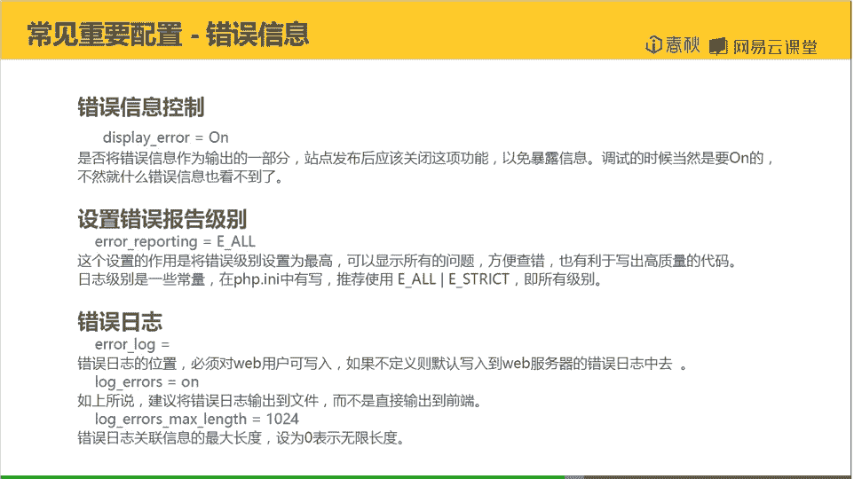

啊唔怕。他这里是默认是打开的。但是。好，我们再看看他的级别。啊，这里有他这样的表达式，其实我也不清楚那是什么样的一个级别。就是这里。显示所有的错误。嗯，除了noty。然后我们再看我们的。在吗？我这里就。

为了方便调试，就把。打开了，所以说我们以后审计的时候，最好是在入口文件。把抽信息的这个控制把它打开，并调到最高级别。嗯有助于我们审计。

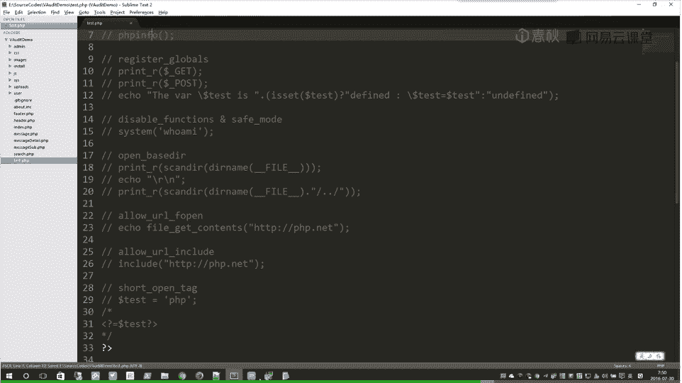

好，我们继续。啊，错误就是这。这个其实可有可无啊，生产环境一般都有错误日志。不过那是阿帕奇或者NBAINX，它已经有了相应的信息。啊唔至是。呃，最后一个是魔术引号及远程文件。

魔术引号这个特性也是被废弃了，新版本都移除掉。嗯，他主要是打开它就有一个比较严重的效率问题。因为我们所有的。变量传递的数据，它都通过这个GPC那转移的话就很耗时。嗯，所以说就把它移除掉了。

但是很多的程序都会自定义一个。啊，转移功能有些呢是针对性的。那样也比较好，毕竟也是一个。安全。防止注入。

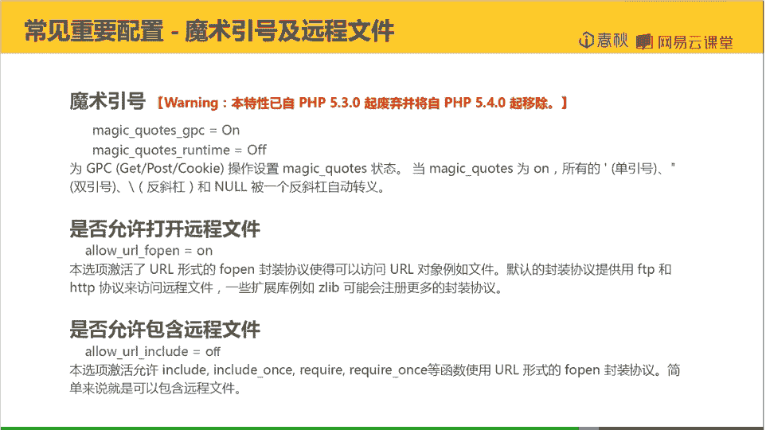

那么我们再去看配置。MHIC。他默认是打开的。啊，也就自动转移。好我们再看代码。嗯，嗯代码是直接输出一个。这是一个get信息。

嗯们来看代码。嗯，我们输出TST嗯，它转移般是转移的特定字符，比如零，就是空字符，00%。他就转移加了一个斜杠，好，我们再来试一下点。啊，撇号单引号，它也是转移。好，这是双引号。哦。

正常的字符他就不会转移。然后。系啊。他就会转移。这就是转A的功能。呃，关掉了就不会转移了，我们这里也来试试关掉的。应，该是重启。我们再来看看。啊，这里关掉了就不转移了。然后你可以试试其他的支付。T。

然后百分之空制符。空制符截断。没知道。反正就。关闭了，他就不转移了，很多程序呢都会。自定义转移，也就是前面我们也试过的配置文件里面有一个转移。

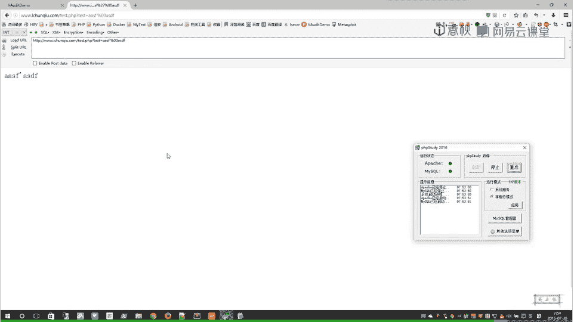

求地。Yeah。对呃，就是利用这样一个函数进行转译。我们复制过来用一下。

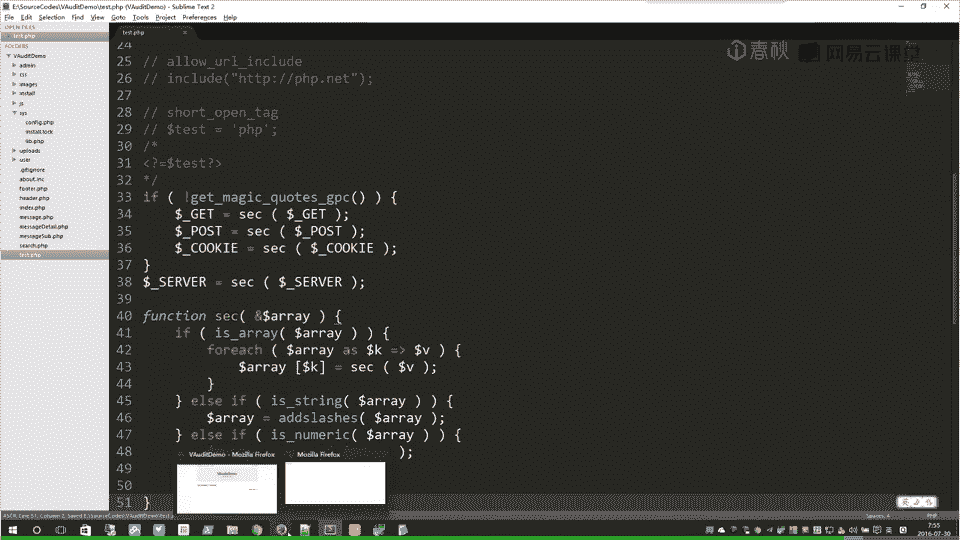

还行。他就自己自定义的软意了。好，最后是说远程文件。呃，这个文件一般是和包含漏洞有关。默认的时候是允许打开远程文件，但不允许包含远程文件。那么好我们来看看是怎么样打开远程文件。

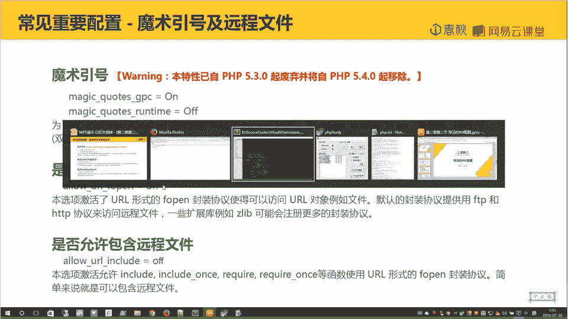

我们通过发别 content。嗯，去打开这个页面。那也就是打开远程文件，并给它输出出来。

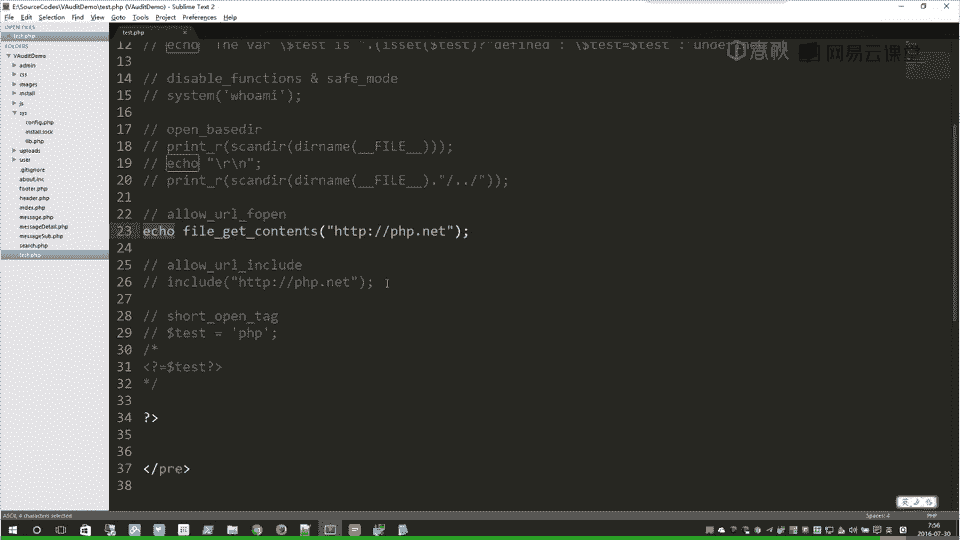

哎，刷心。

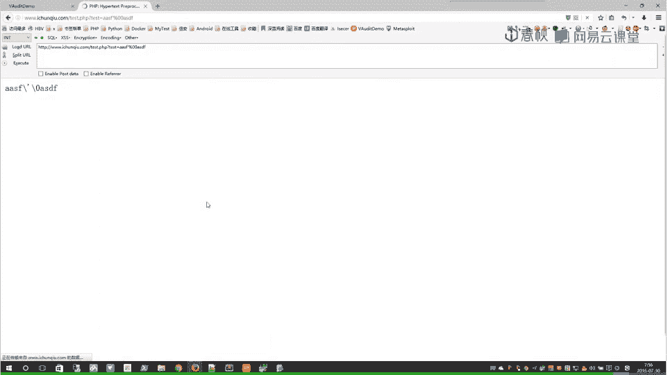

这样他就获取到了。那个远程远程页面的信息。

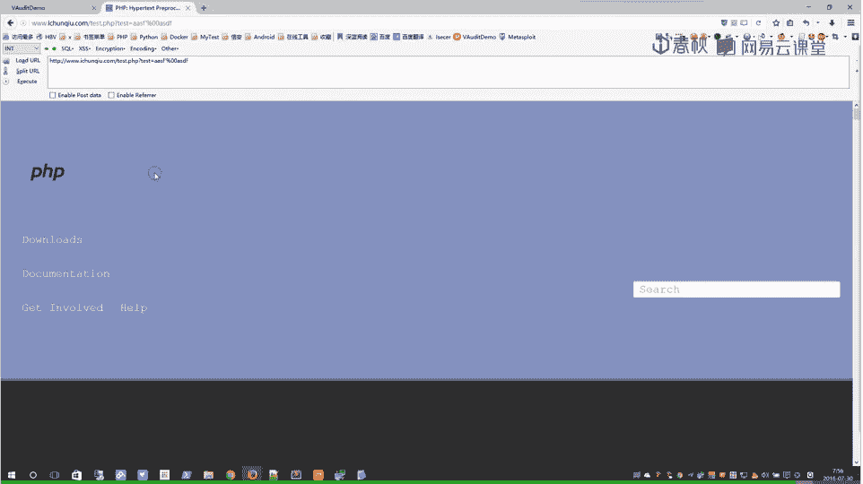

还也就是直接获取到的信息。

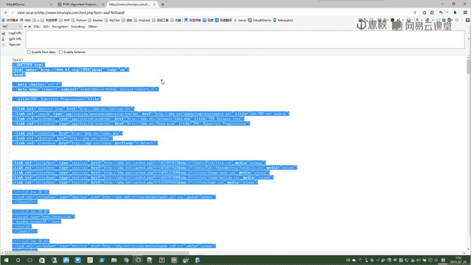

那么我们。再来试试这个远程包含。

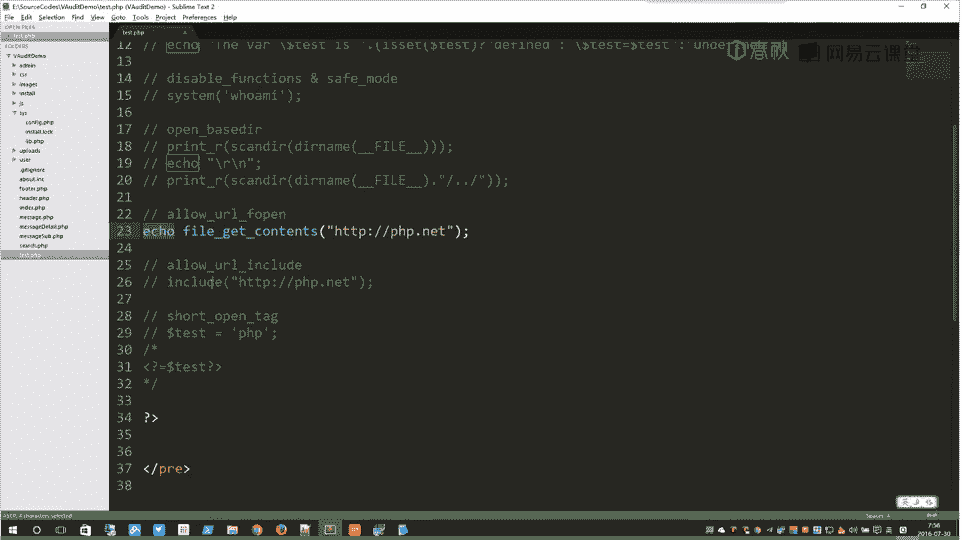

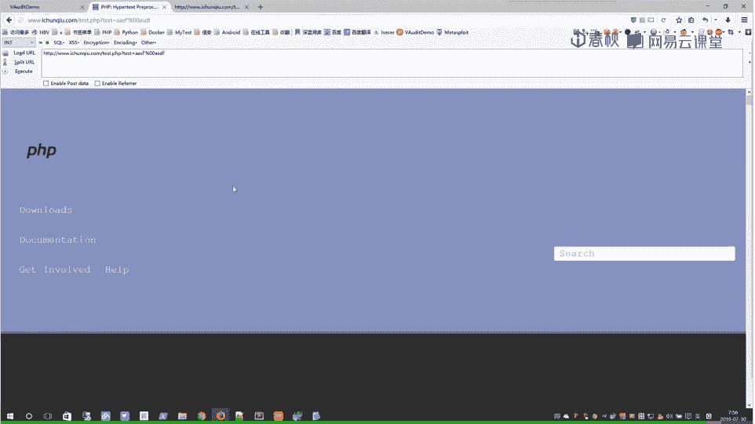

再次刷新。看他就报错了。因为是不允许。远程包含的。嗯，现在我们来打开远程包含。系。漂。嗯。嗯。好，在这里它默认关闭，我们打开它。样是重启。好，我们再来刷新。

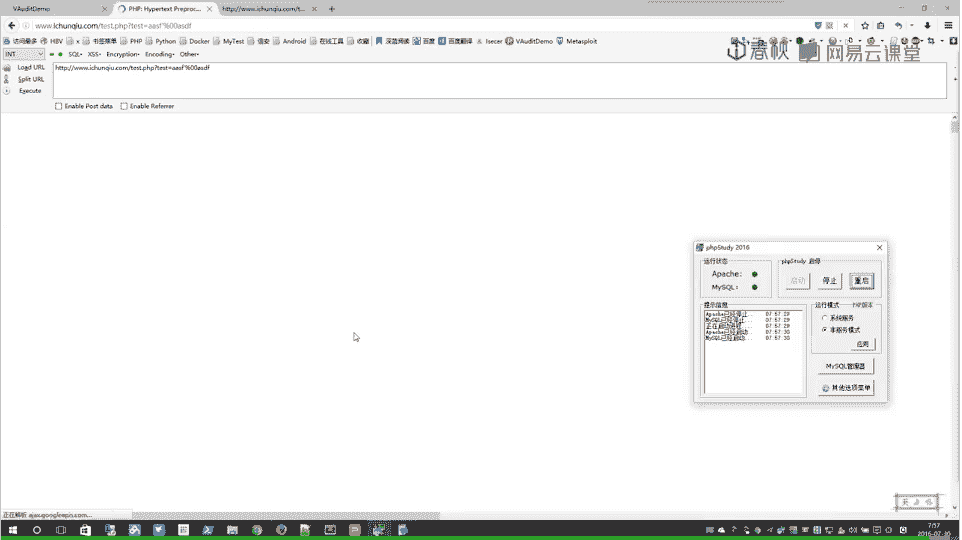

他现在是成功包含了远程的文件。呃，因为这个远程文件是没有。嗯，因为这个远程文件没有那个。标签也没有执行代码，他就直接输出了。

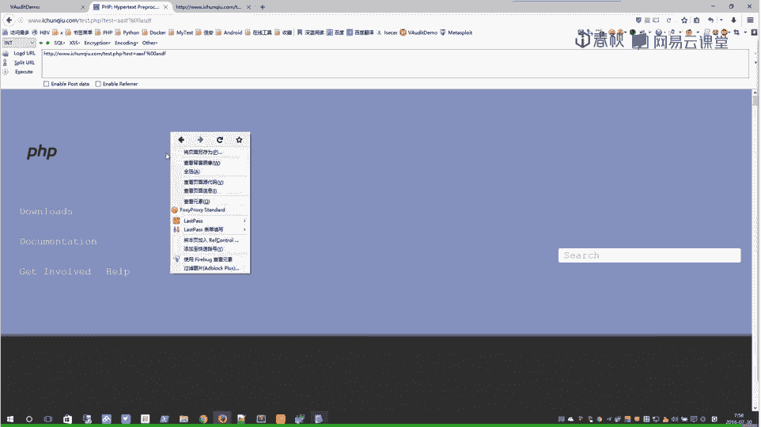

呃，他获取到的内容。

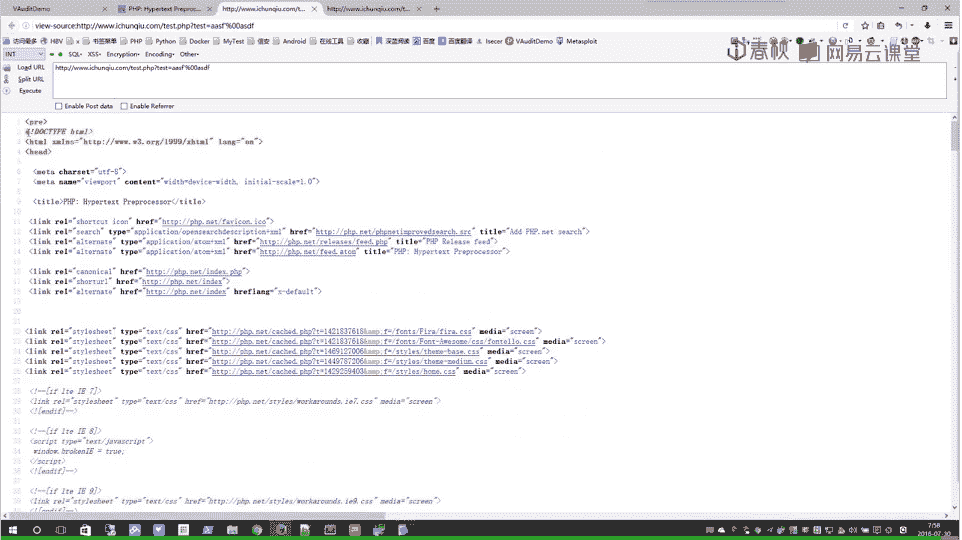

好，我们开可以来。看一看。嗯。嗯，哦，对。

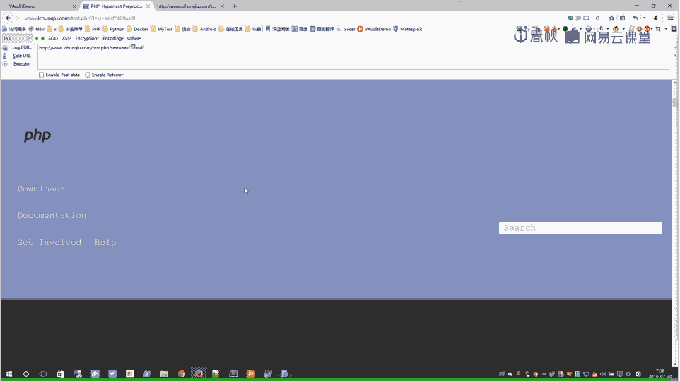

那么这节课就讲到这里，谢谢大家观看。

