# i春秋学院 进阶篇 PHP代码审计 - P4：第三节 常见危险函数及特殊函数（一） 🔍

在本节课中，我们将要学习PHP代码审计中一系列常见且危险的函数。理解这些函数的作用和潜在风险，是发现和利用安全漏洞的基础。我们将依次介绍代码执行函数、包含函数、命令执行函数、文件操作函数以及一些特殊函数，并通过代码示例来加深理解。

## 一、代码执行函数 💻

上一节我们介绍了代码审计的基本概念，本节中我们来看看第一类危险函数：代码执行函数。这类函数能够将字符串作为PHP代码来执行，如果参数可控，将导致严重的安全问题。

以下是几个常见的代码执行函数：

*   **`eval()`**：此函数将字符串作为PHP代码执行。许多WebShell都利用此函数执行操作。其基本形式为：`eval('echo "test";');`
*   **`assert()`**：这是一个调试函数，同样具有将字符串作为PHP代码执行的功能。在`eval()`被列入黑名单后，常被用作替代。其基本形式为：`assert('phpinfo()');`
*   **`preg_replace()`**：此函数执行正则表达式搜索和替换。当使用`/e`修正符时，会将`replacement`参数当作PHP代码执行。例如：`preg_replace("/test/e", 'phpinfo()', 'test');`
*   **`create_function()`**：此函数用于创建一个匿名函数。我们可以将字符串内容作为函数体来执行。例如：`$func = create_function('$v', 'return system($v);');`
*   **回调函数**：`call_user_func()`和`call_user_func_array()`。这两个函数用于回调其他函数，主要区别在于传递参数的方式不同（单个参数 vs 数组）。例如：`call_user_func('system', 'whoami');`

接下来，我们通过具体代码来观察这些函数的执行效果。

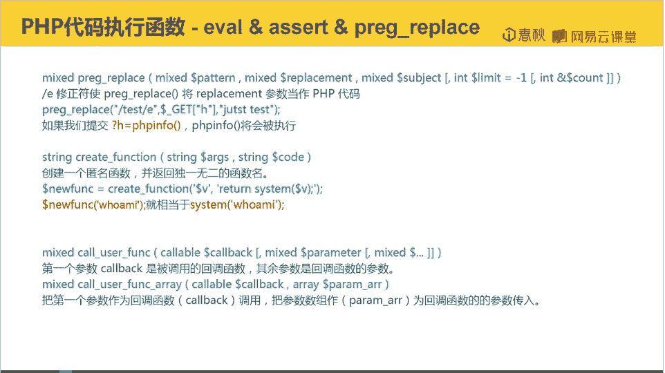

首先是`eval`函数。代码中有两句输出，一句是`$i`变量里的字符串“test”，另一句是直接输出。我们使用`eval`执行`$test2`变量中的脚本功能。

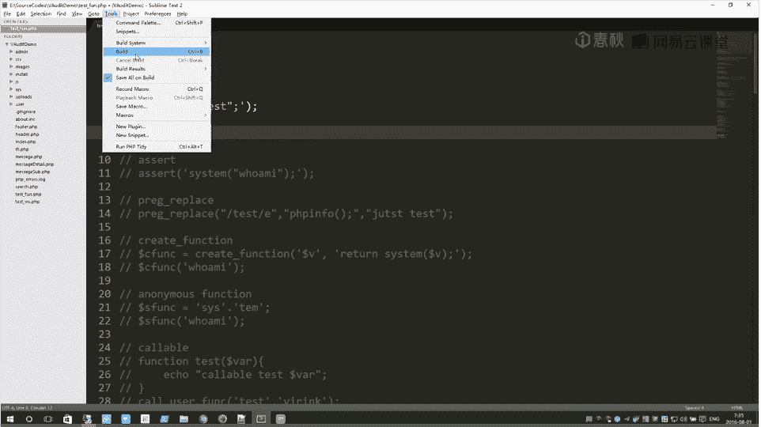


执行成功，输出了两句话。这表明`eval`函数和普通执行代码的效果是一样的。

接着是`assert`函数。中间的代码是执行`phpinfo()`函数和`whoami`命令。


执行成功，正常输出。

然后是`preg_replace`函数。它在搜索“tt”并替换时，使用了`/e`修正符，这将会执行替换字符串中的`phpinfo()`函数。

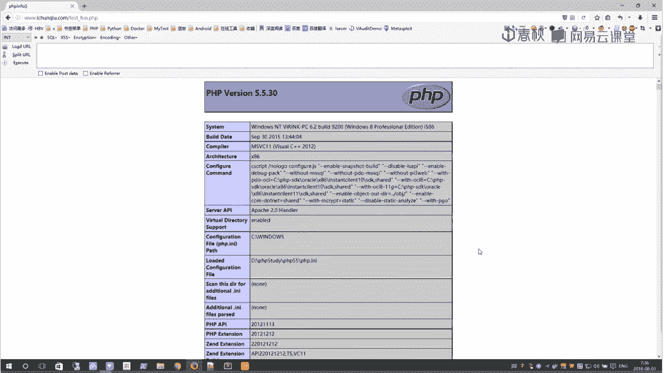


我们在浏览器中查看，确实输出了`phpinfo()`的内容。


我们再来看匿名函数。这里使用`create_function`创建一个函数，其功能是返回`system($v)`的执行结果，其中`$v`是参数。

```php
$func = create_function('$v', 'return system($v);');
$func('whoami');
```
执行后可以正常调用系统命令。

另一种形式的匿名函数是直接将字符串拼接并赋值给变量，然后以变量形式调用。

```php
$f = 'sys'.'tem';
$f('whoami');
```
执行后也能正常输出。

最后是回调函数。这里自定义了一个`tt`函数用于输出，然后通过`call_user_func`调用它。

```php
function tt($v) { echo $v; }
call_user_func('tt', 'raw');
```
执行后正常输出。如果我们将函数名改为`system`，参数改为`whoami`：

```php
call_user_func('system', 'whoami');
```
执行后也能够成功执行系统命令。

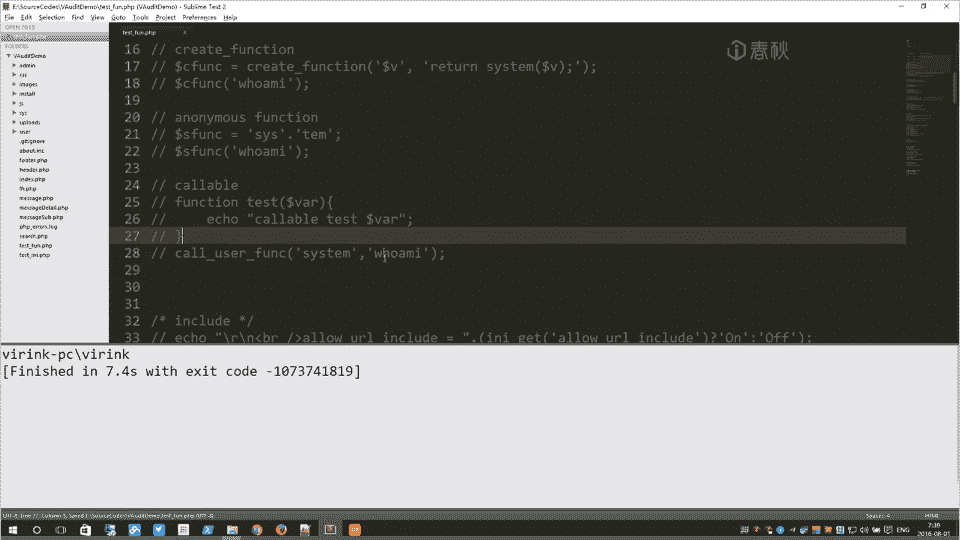


## 二、包含函数 📂

了解了代码执行函数后，我们来看第二类：包含函数。这类函数的主要作用是包含并运行指定文件中的PHP代码。

包含函数主要有以下四个：
*   `require`
*   `include`
*   `require_once`
*   `include_once`

它们的核心作用都是包含并运行指定文件（特指运行文件内被`<?php ?>`标签包裹的PHP代码）。四者之间的区别（如错误处理、重复包含等）可在PHP官网查阅。

包含函数的一般形式是`include $filename;`，其中`$filename`是文件路径。在`$filename`参数可控且未经过滤的情况下，就可能实现“任意文件包含”，从而达到执行恶意代码（WebShell）的目的。

这里的“任意文件”指的是文件名任意，可以是图片、文档或压缩文件等。只要该文件的明文内容中包含被PHP标签包裹的代码，服务器就会执行它。

在不同的服务器配置下，包含分为两种形式：
1.  **包含远程文件**：如果服务器配置允许（`allow_url_include`为On），可以包含互联网上的任意文件。攻击者可以在自己的服务器上放置WebShell，让目标网站包含，从而实现远程攻击。
2.  **包含本地文件**：大多数服务器默认关闭远程包含，因此更常见的是包含本地文件。这通常需要攻击者先通过其他方式（如文件上传漏洞）将一个包含WebShell代码的文件上传到服务器上。

包含函数的另一个重要特性是能够用于**读取任意文件**。这主要利用了PHP的封装协议和过滤器。例如，使用`php://filter`读取器，结合`base64`编码过滤器，可以将文件内容编码后再包含进来。由于编码后的内容没有PHP标签，不会被当作代码执行，而是作为普通文本输出，从而实现了文件内容读取。

接下来，我们通过代码来演示包含函数的功能。

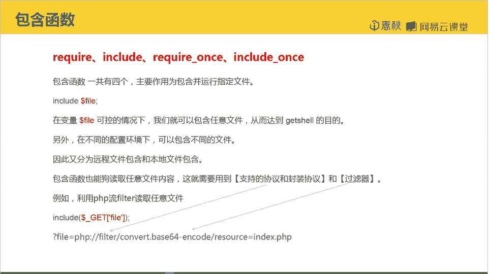

首先，代码输出服务器的配置信息，然后包含通过参数`$_GET[‘v’]`传递过来的文件。

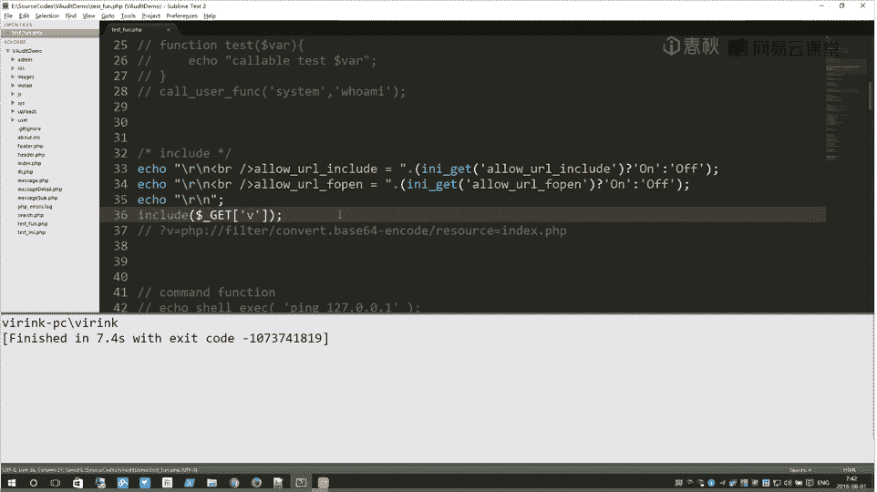


我们在网页中执行，传递`v=lfi.php`来包含一个本地文件。

首先输出配置信息，显示远程文件包含是关闭的。然后成功包含了`lfi.php`文件。


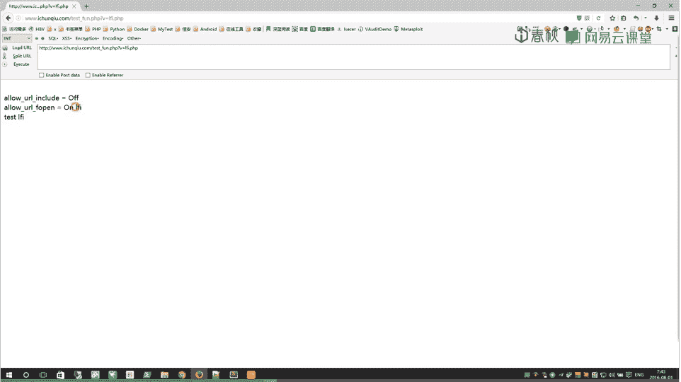

`lfi.php`文件的内容包含普通文本和PHP代码。没有标签的文本被直接输出，有标签的PHP代码（`echo “test lfi”;`）则被执行后输出。

这展示了包含函数执行代码的特性。接下来，我们演示其读取文件的特性。

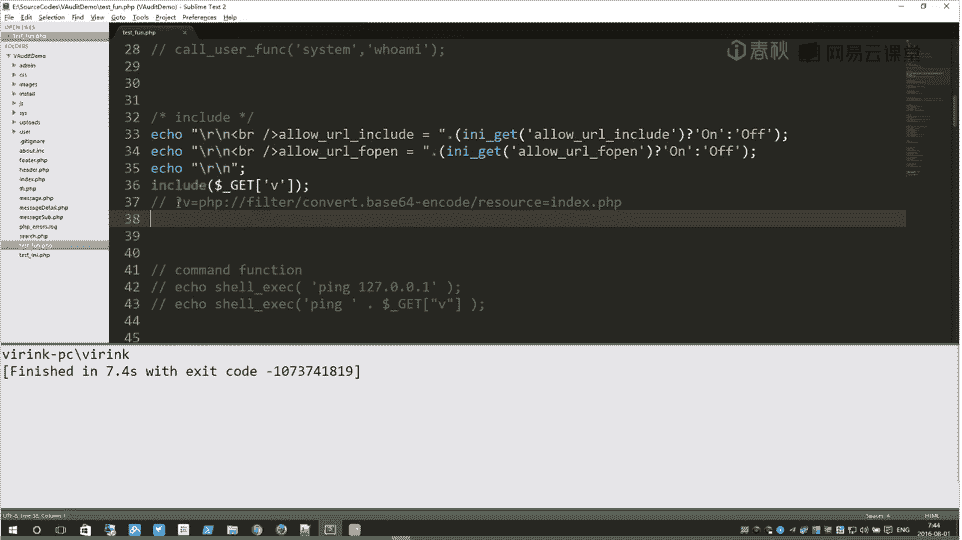


我们使用`php://filter`来读取`index.php`的源码，并经过`base64`编码。

```php
include(‘php://filter/read=convert.base64-encode/resource=index.php’);
```
执行后，得到一串`base64`编码的字符串。

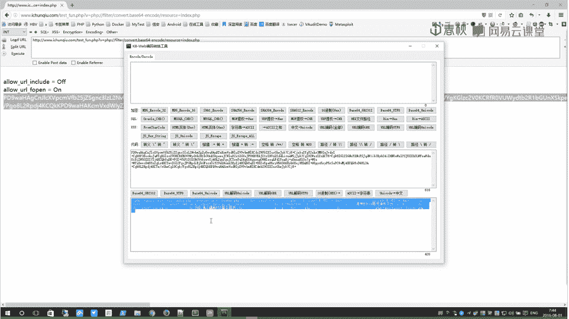


将其解码后，即可得到`index.php`文件的源代码内容。这就是利用包含函数进行任意文件读取的原理。


## 三、命令执行函数 ⚙️


看过了包含函数，我们进入第三部分：命令执行函数。这类函数可以调用外部系统命令或程序，如果其参数可控，将导致命令注入漏洞。

PHP的命令执行函数有很多，例如：
*   `system()`
*   `exec()`
*   `shell_exec()`
*   `passthru()`
*   `popen()`
*   `proc_open()`
*   `` `（反引号）``


这些函数通过Shell环境执行命令。当这些函数的参数（通常是命令字符串）可控且未经过滤时，攻击者就可以执行任意系统命令。

例如，一个原本用于执行`ping`命令的代码：
```php
system(“ping ” . $_GET[‘ip’]);
```
如果`$_GET[‘ip’]`参数可控，攻击者就可以利用管道符`|`、分号`;`、反引号`` ` ``等特殊字符进行截断，从而注入并执行其他命令，如`whoami`、`cat /etc/passwd`等。

下面我们通过代码来演示命令执行与注入。

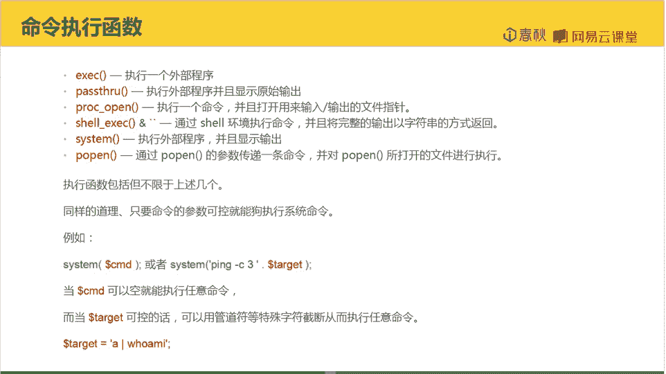

这里使用`shell_exec`函数。首先，我们执行`ping 127.0.0.1`命令。


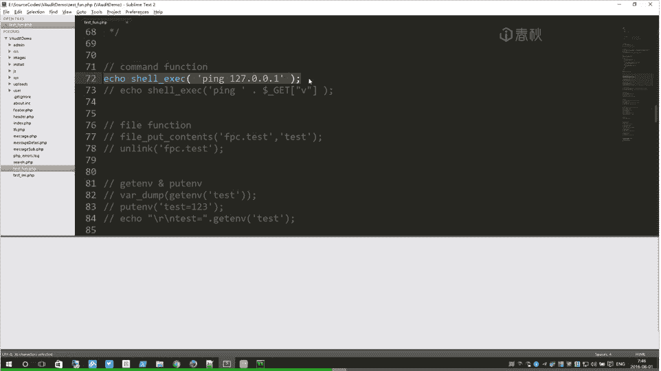


由于编码问题，我们在网页端查看。刷新后，成功显示了`ping`命令的执行结果。

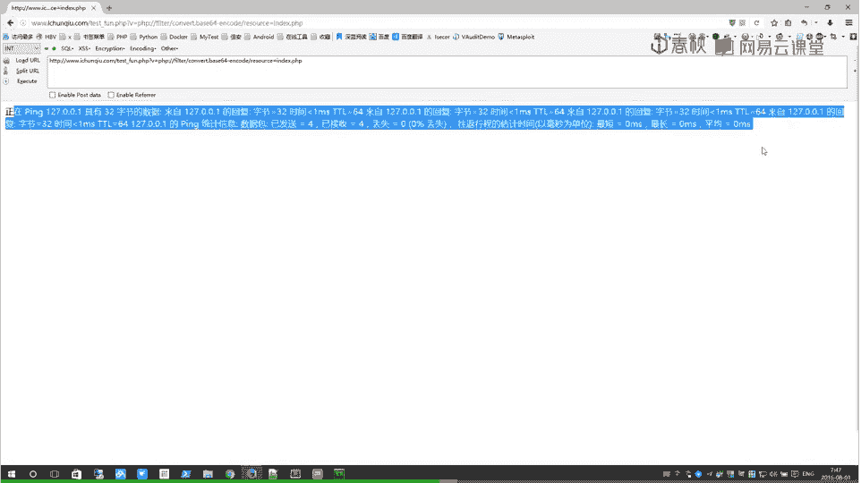


接下来看存在风险的代码。`ping`命令后的IP地址来自用户输入的`$_GET[‘v’]`变量。

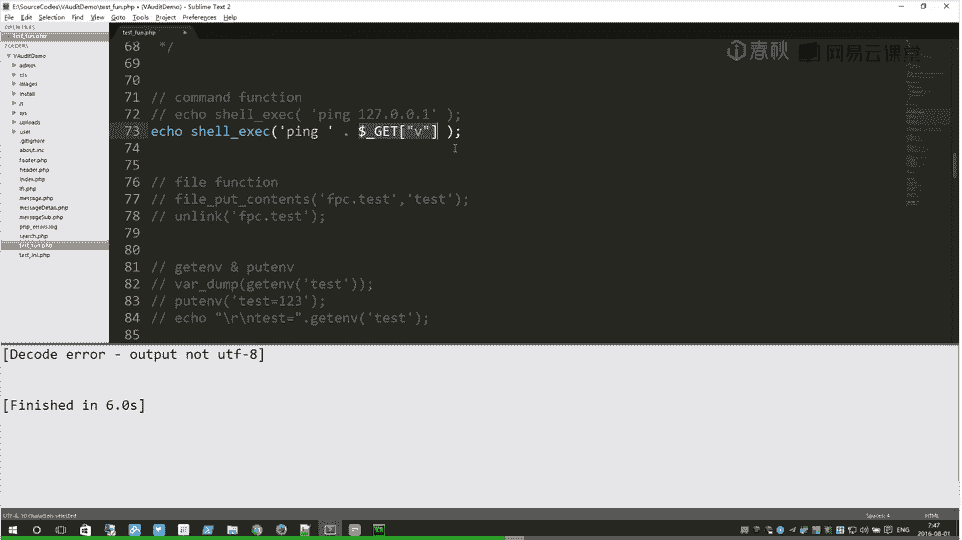


如果这个输入没有经过严格检查，攻击者可以注入命令。例如，输入`127.0.0.1 | whoami`。

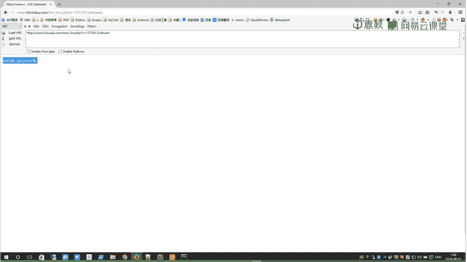


执行后，系统会先执行`ping 127.0.0.1`，然后通过管道符`|`执行`whoami`命令，最终输出的是`whoami`命令的结果。

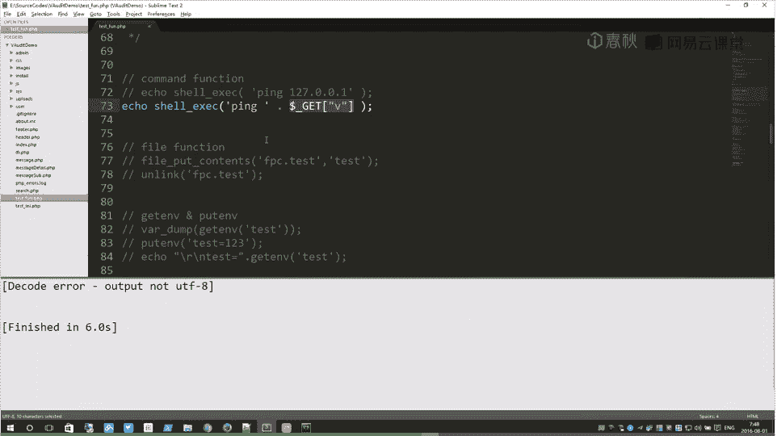


## 四、文件操作函数 📁

接下来，我们学习第四类函数：文件操作函数。这类函数数量众多，用于对服务器文件进行读、写、删、改等操作。

文件操作函数举例：
*   `file_get_contents()` – 读取文件内容
*   `file_put_contents()` – 写入数据到文件
*   `fopen()` / `fwrite()` / `fclose()` – 打开、写入、关闭文件流
*   `unlink()` – 删除文件
*   `rename()` – 重命名文件
*   `copy()` – 复制文件

当这些函数的参数（通常是文件路径）可控时，就可能导致任意文件读取、写入或删除等安全问题。


*   **任意文件读取**：可以读取服务器配置文件、数据库连接文件、网站源码等敏感信息。
*   **任意文件写入**：可以写入WebShell后门代码，从而控制服务器。
*   **任意文件删除**：可以删除重要的文件，例如安装锁文件（`.lock`），可能导致程序被重新安装覆盖。

不同的函数和不同的应用场景，会产生多种多样的利用方式。下面我们简单演示其中几个函数。

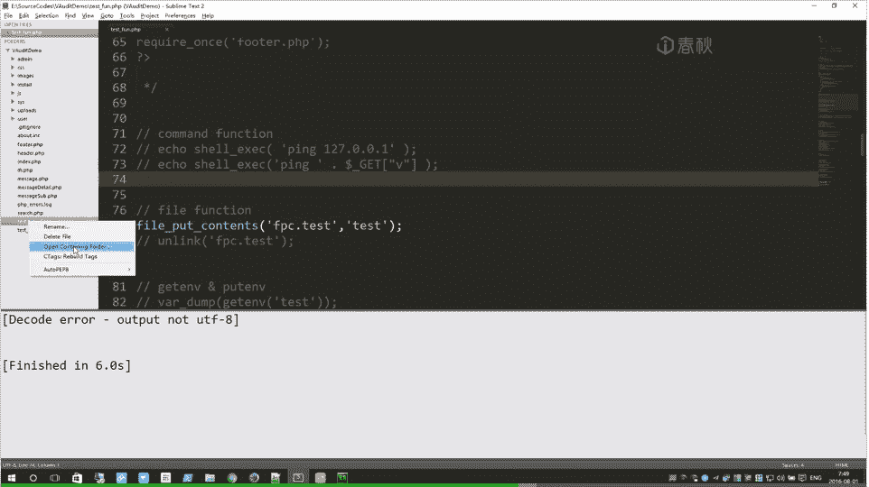


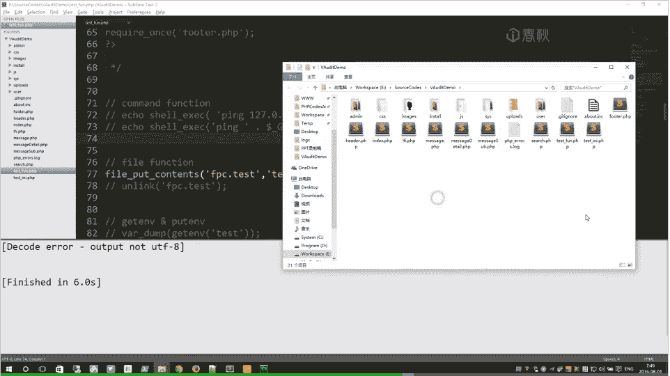

首先，使用`file_put_contents`函数将字符串“test”写入到`fpcc.txt`文件中。

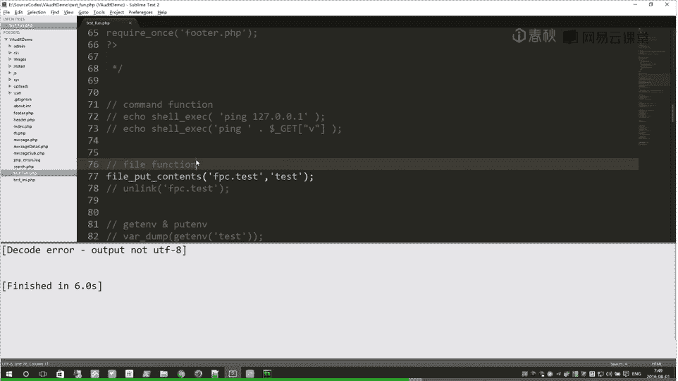


执行前，当前目录下没有`fpcc.txt`文件。

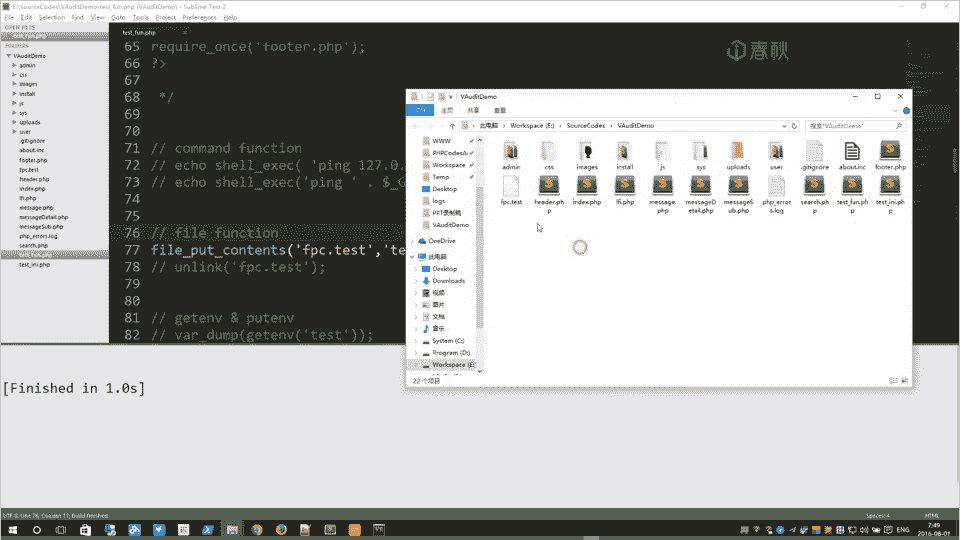


执行代码。


执行后，目录下生成了`fpcc.txt`文件，其内容正是“test”。

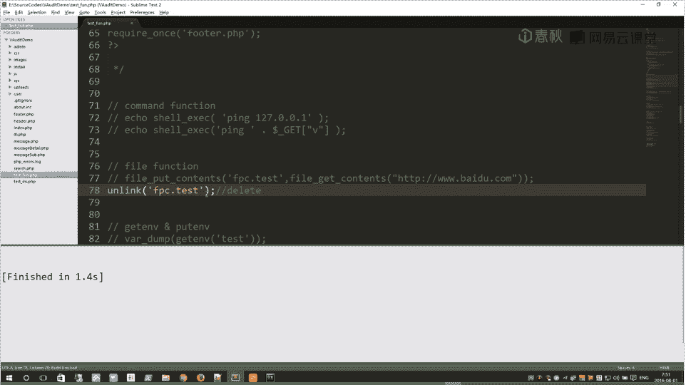


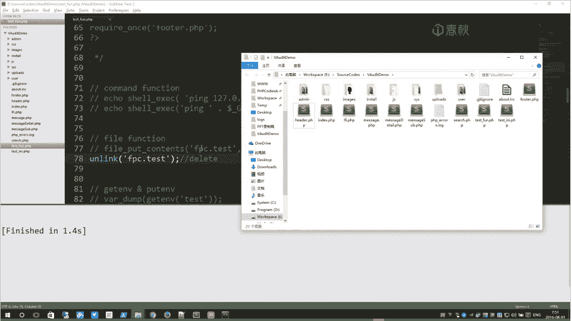

接着，演示读取远程文件。使用`file_get_contents`函数读取百度首页的内容，并输出到文件中。

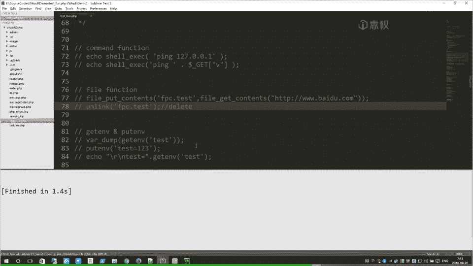

```php
file_put_contents(‘fpcc.txt’, file_get_contents(‘http://www.baidu.com’));
```
执行成功后，查看`fpcc.txt`文件，里面已经是百度的HTML代码了。这展示了文件操作函数打开远程文件的功能。

最后，使用`unlink()`函数（相当于`delete`）删除刚才创建的`fpcc.txt`文件。

```php
unlink(‘fpcc.txt’);
```


执行后，之前生成的文件已被删除。


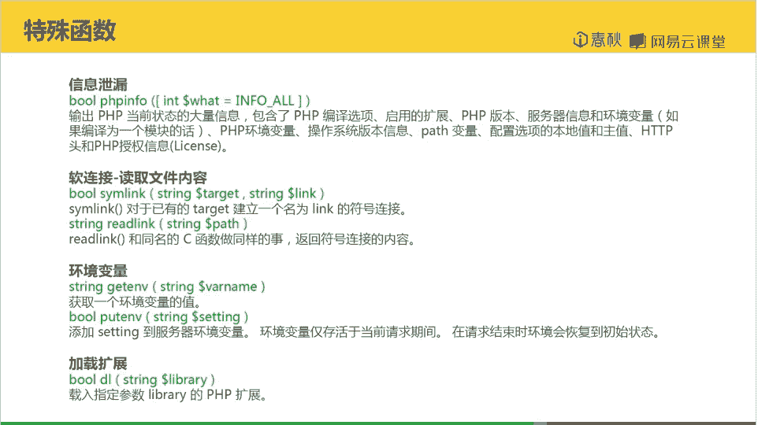

如果文件路径参数可控，我们就可以对服务器上的任意文件进行这些操作。其他如重命名等功能，原理类似。


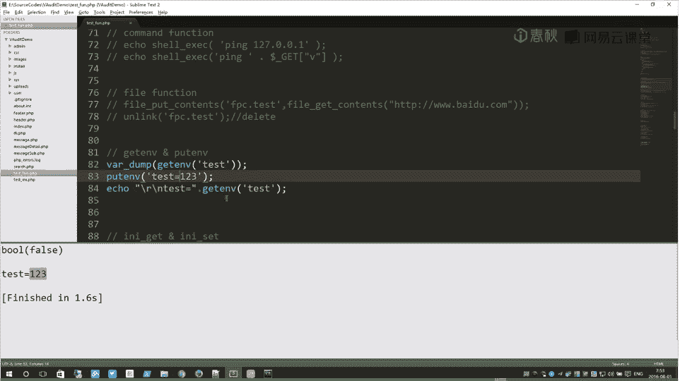

## 五、特殊函数 🎯

最后，我们来看一些具有特殊功能或容易引发安全问题的函数。这类函数比较多，需要在实际审计中慢慢积累。

以下是几个例子：

*   **`phpinfo()`**：此函数输出PHP当前的大量配置信息，属于敏感信息泄露，通常不应在生产环境中使用。
*   **`symlink()`**：创建符号链接（软链接）。在Linux服务器上，可以利用它为某个目标文件建立链接，然后通过读取这个链接来间接读取目标文件的内容。
*   **`getenv()` / `putenv()`**：获取或设置环境变量。`getenv()`可以获取系统或自定义的环境变量；`putenv()`可以在当前请求期间临时设置环境变量。


我们通过代码来理解环境变量函数。


代码首先尝试获取名为“test”的环境变量，如果有则返回`true`，否则返回`false`。然后临时设置`test=123`，再次获取并输出。

执行代码。首先，因为没有“test”变量，所以返回`false`。设置后，再次输出就变成了“123”。

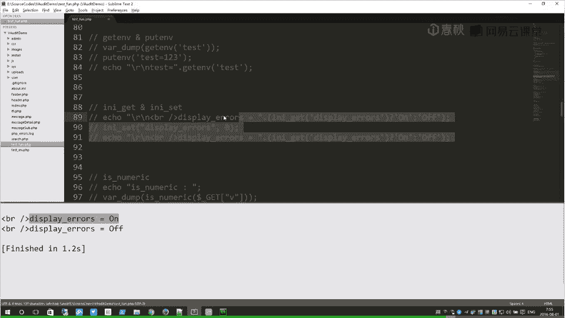


*   **`dl()`**：在运行时加载PHP扩展。可用于加载特定的PHP扩展模块，具体利用需结合实际情况。
*   **`ini_get()` / `ini_set()`**：获取或设置PHP配置选项。`ini_set()`可以在当前请求期间临时修改配置。

来看配置相关函数的代码。

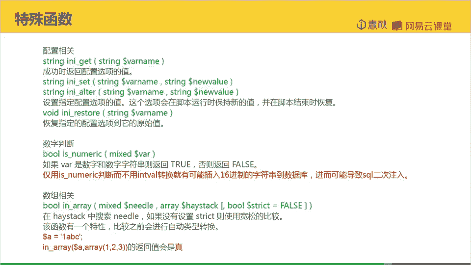


代码首先输出`display_errors`配置的当前值，然后临时将其设置为`Off`（即`false`），再次输出。

执行代码。一开始`display_errors`默认是`On`（代码审计时常需要打开此选项以查看错误信息）。临时关闭后，再次输出时显示为`Off`。

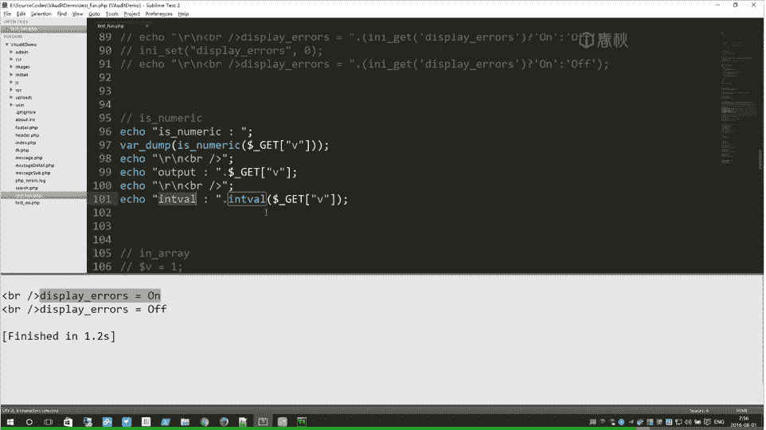


重新请求一次页面，配置又恢复为默认的`On`。这说明`ini_set()`的设置仅对当前请求生效。

*   **`is_numeric()`**：判断变量是否为数字或数字字符串。此函数存在一个问题：它可能将包含十六进制（如`0x123`）或科学计数法（如`1e11`）的字符串也判断为数字。如果仅用此函数做验证，而不用`intval()`等函数进行强制转换，可能导致非预期的数据（如十六进制形式的SQL注入语句）进入数据库，进而可能引发二次注入等漏洞。

我们通过代码观察其行为。


代码判断输入的内容是否为数字，并用`intval()`转换后输出结果。


在网页中测试。输入“123”，`is_numeric()`返回`true`，`intval()`转换后为123。
输入单引号“’”，`is_numeric()`返回`false`。
输入十六进制“0x123”，`is_numeric()`返回`true`，但`intval()`转换后为0。
输入科学计数法“1e11”，`is_numeric()`返回`true`，`intval()`转换后为1。
这表明`is_numeric()`的判断并不完全可靠，在安全校验时应结合`intval()`等函数进行严格处理。


*   **`in_array()`**：检查某个值是否存在于数组中。此函数在比较前默认会进行“松散比较”（自动类型转换）。例如，字符串`”1″`和数字`1`会被判断为相等。如果未设置第三个参数`$strict`为`true`（强制严格比较），可能导致绕过检查。

来看代码演示。


首先将变量`$v`赋值为字符串`”1″`，然后判断它是否在数组`array(1, 2, 3)`中。由于自动类型转换，字符串`”1″`会被转为数字`1`，从而判断为存在。
再将`$v`赋值为`”1abc”`，判断它是否在数组`array(1, 2, 3)`中。`”1abc”`在转换时也会变成数字`1`，因此同样判断为存在。
最后判断`$v`是否在数组`array(‘1’, ‘2’, ‘3’)`中，由于数组内是字符串，而`$v`的值`”1abc”`与之不完全相等，所以判断为不存在。

执行代码，结果符合预期：前两个判断为`true`，第三个为`false`。

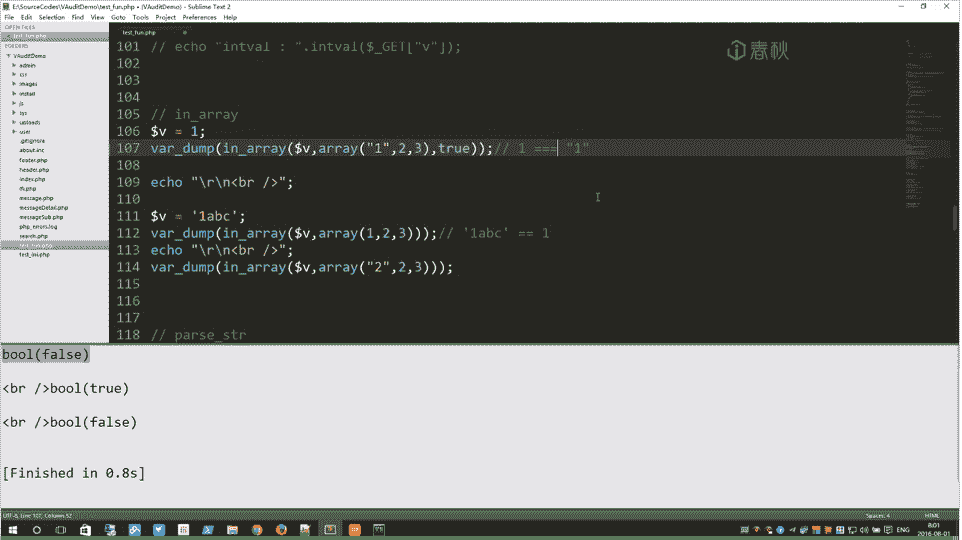

如果将`in_array()`的第三个参数设置为`true`，进行严格比较：

```php
in_array($v, array(1,2,3), true)
```
那么`”1″`和`”1abc”`都不会被判断为存在于数字数组`array(1,2,3)`中，因为类型不同。


## 总结 📝


本节课中我们一起学习了PHP代码审计中五类重要的危险函数及特殊函数：
1.  **代码执行函数**（如`eval`, `assert`）：能够直接执行字符串形式的PHP代码，是WebShell的常用手段。