# i春秋学院 进阶篇 PHP代码审计 - P5：第四节 常见危险函数及特殊函数（二） 🔍

在本节课中，我们将继续学习PHP代码审计中常见的危险函数与特殊函数。我们将重点探讨变量覆盖函数、目录遍历函数以及无参数信息获取函数，理解它们的工作原理和潜在的安全风险。

---

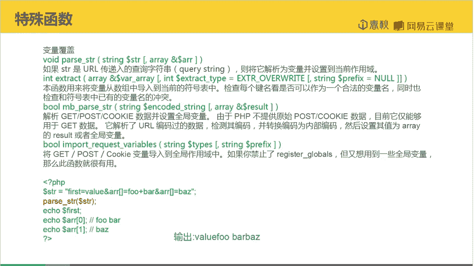

## 变量覆盖函数 🔄

上一节我们介绍了一些危险函数，本节中我们来看看变量覆盖相关的函数。这些函数的核心作用是将字符串解析为变量，并设置到当前作用域中。

`parse_str` 函数是典型的例子。它接收一个字符串，并将其解析为变量。如果传递了第二个参数（一个数组），解析出的变量将被设置到该数组中；否则，变量将被设置到当前作用域。

以下是 `parse_str` 函数的基本用法：

```php
parse_str($string, $array);
```

我们来看一段示例代码，以理解其行为：

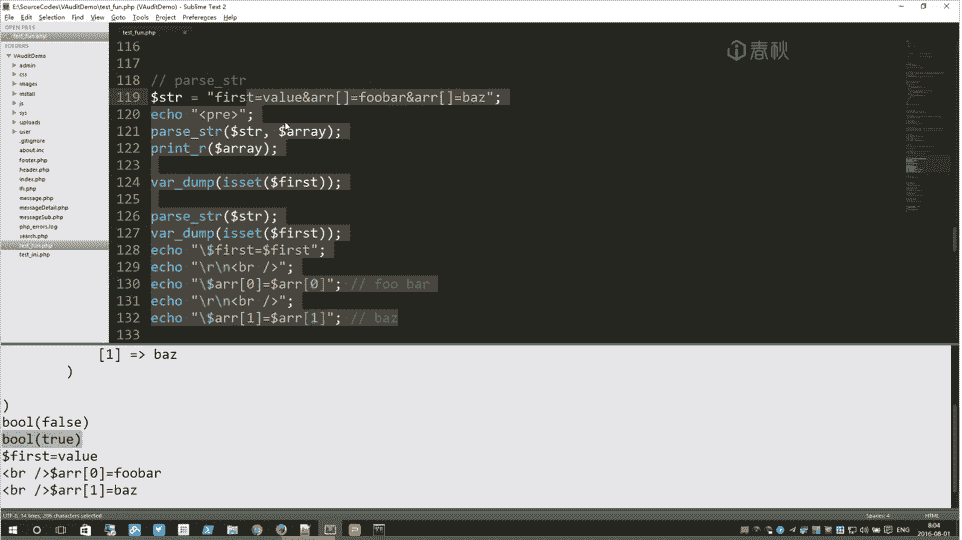

```php
$str = "first=value&arr[]=foo+bar&arr[]=baz";
parse_str($str, $output);
print_r($output);
echo isset($first) ? '存在' : '不存在';

parse_str($str);
echo isset($first) ? '存在' : '不存在';
echo $first;
```


代码执行流程如下：
1.  第一次使用 `parse_str` 并传入 `$output` 数组，解析出的变量 `first` 和 `arr` 被存入 `$output` 数组，而非当前作用域。因此，检查 `$first` 变量是否存在会返回“不存在”。
2.  第二次使用 `parse_str` 时不传入数组参数，解析出的变量 `first` 被直接设置到当前作用域。此时检查 `$first` 变量会返回“存在”，并能成功输出其值。

如果开发者不当使用此类函数，攻击者可能通过控制输入字符串来覆盖程序中的关键变量（如身份验证标志），从而引发安全问题，例如越权访问。

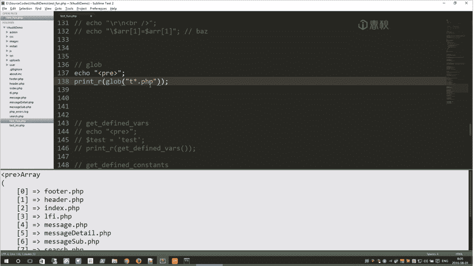

---

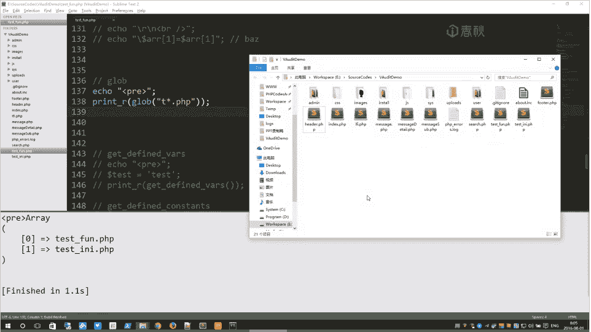

## 目录遍历函数 📁

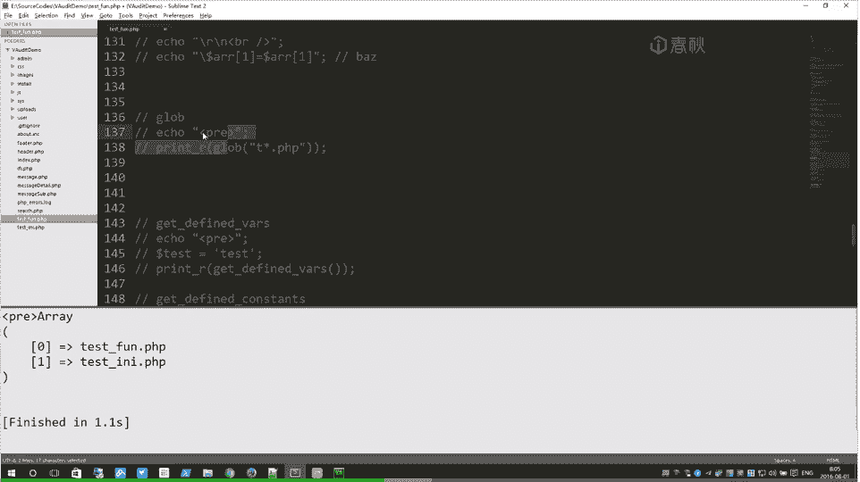

接下来，我们了解用于目录遍历的函数。这类函数可以根据指定模式搜索匹配的文件或目录路径。

`glob` 函数是其中之一，它使用类似 shell 的通配符规则来查找匹配的文件路径。

以下是 `glob` 函数的基本用法：

```php
glob($pattern, $flags);
```

以下是使用 `glob` 函数查找文件的示例：

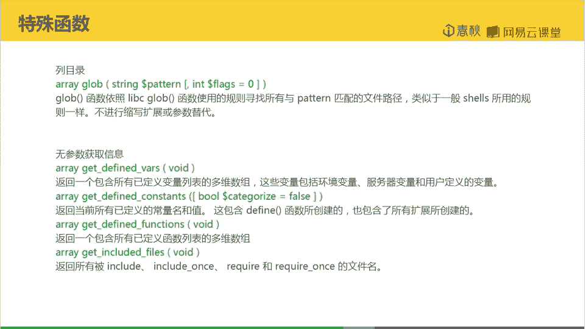

```php
// 查找当前目录下所有以 .php 结尾的文件
$files = glob("*.php");
print_r($files);

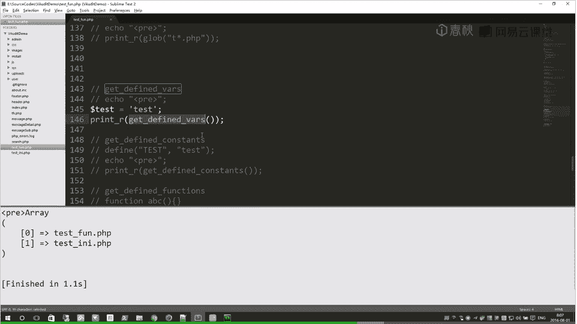

// 查找当前目录下以 T 开头并以 .php 结尾的文件
$filesT = glob("T*.php");
print_r($filesT);
```

代码执行结果：
*   第一个 `glob("*.php")` 会返回当前目录下所有 `.php` 文件。
*   第二个 `glob("T*.php")` 会返回当前目录下所有以 `T` 开头并以 `.php` 结尾的文件。

在某些渗透测试场景中，当常见的文件读取函数（如 `file_get_contents`）被禁用时，`glob` 这类函数可以作为一种替代手段来探测服务器上的文件目录结构。

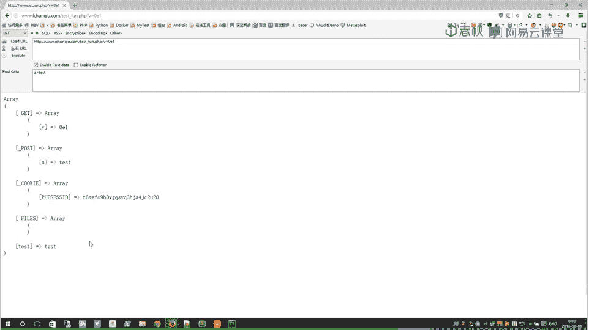

---

## 无参数信息获取函数 ℹ️

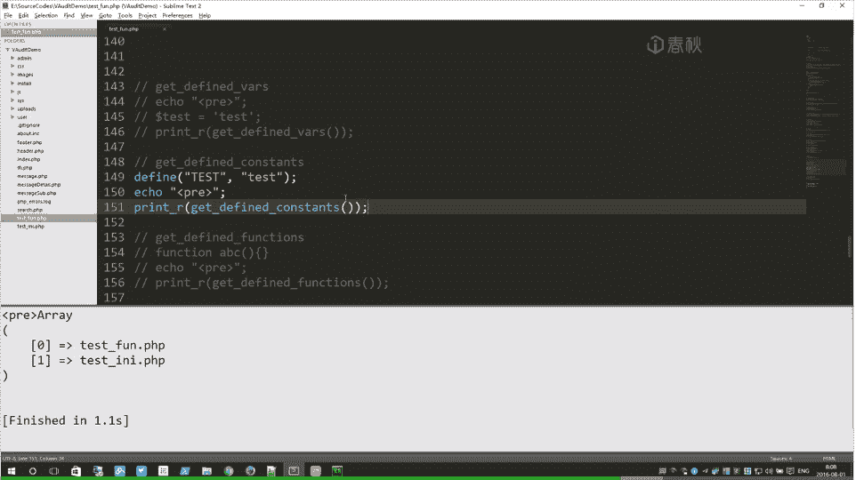

最后，我们学习一组无需参数即可获取大量环境信息的函数。这些函数在代码审计和黑盒测试中非常有用，可以帮助我们快速了解应用状态。

以下是几个关键的函数列表：

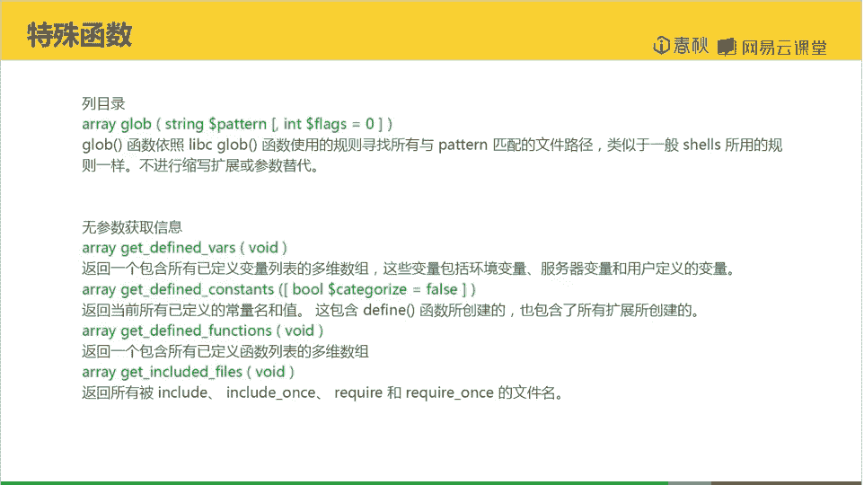

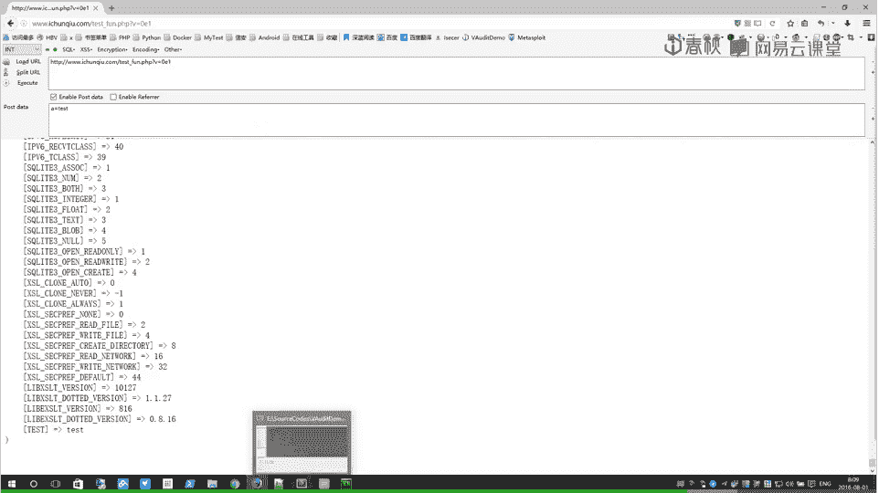

*   **`get_defined_vars`**：返回一个包含所有已定义变量的多维数组。这包括用户通过 `$_GET`、`$_POST`、`$_COOKIE` 传入的变量，以及脚本自身定义的变量。
*   **`get_defined_constants`**：返回所有已定义常量的关联数组，包括PHP内置常量和用户自定义常量。
*   **`get_defined_functions`**：返回一个包含所有已定义函数（包括内置函数和用户自定义函数）的数组。
*   **`get_included_files`**：返回一个数组，包含本脚本通过 `include`、`require` 等语句引入的所有文件的文件名，脚本自身也会被包含在内。

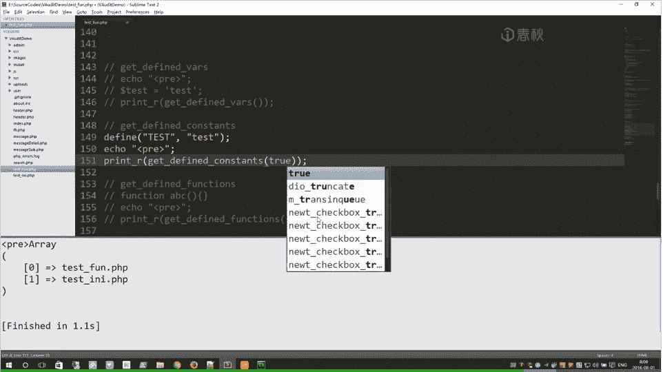

我们通过代码示例来观察它们的效果：

**1. 获取所有已定义变量**

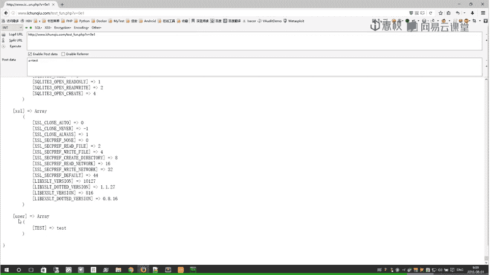

```php
$tt = "test";
print_r(get_defined_vars());
```
执行后，输出会包含 `$_GET['v']`、`$_POST['a']`、`$_COOKIE` 以及自定义变量 `$tt` 等信息。

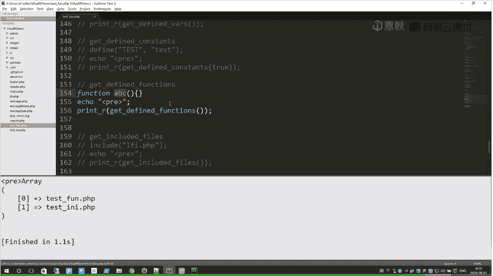

**2. 获取所有已定义常量**

```php
define("MY_CONST", "Hello");
print_r(get_defined_constants(true)); // 传入 true 可按扩展分组
```
输出会首先列出大量PHP内置常量，最后可以看到用户自定义的常量 `MY_CONST`。通过将返回值存入数组并访问 `['user']` 键，可以专门查看用户定义的常量。

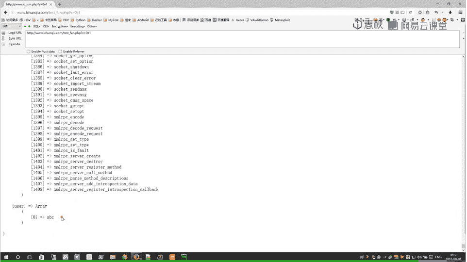

**3. 获取所有已定义函数**

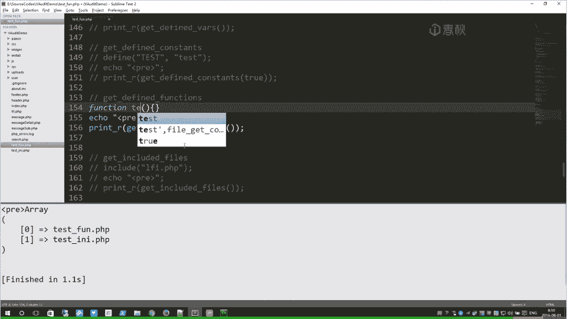

```php
function myFunc(){}
$all_funcs = get_defined_functions();
print_r($all_funcs['user']); // 仅输出用户自定义函数
```
输出会列出所有函数。通过访问返回数组的 `['user']` 部分，可以专门查看用户自定义的函数（如 `myFunc`）。

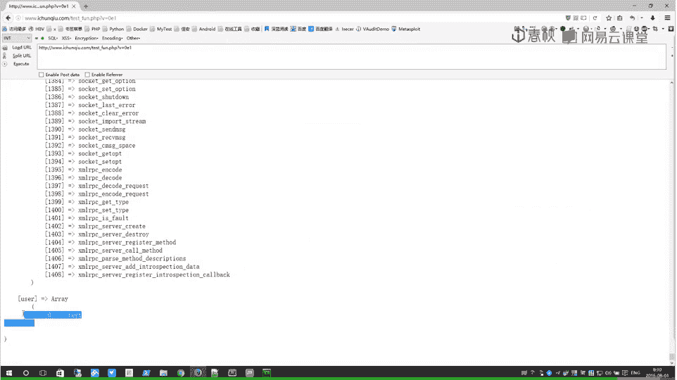

**4. 获取所有已包含文件**

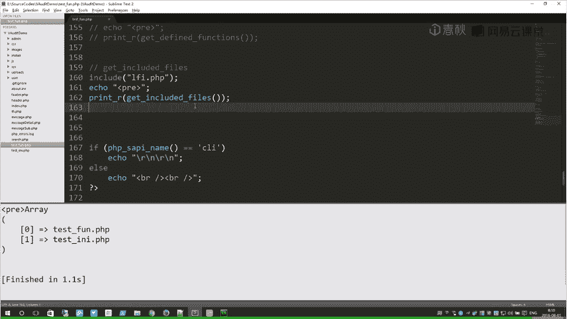

```php
include('somefile.php');
print_r(get_included_files());
```
输出会是一个数组，第一个元素通常是当前脚本自身的路径，后续元素是通过 `include` 或 `require` 引入的文件路径（如 `somefile.php`）。

---


本节课中我们一起学习了三类PHP特殊函数：可能导致变量覆盖的 `parse_str` 函数、用于目录遍历的 `glob` 函数，以及一系列无参数即可获取环境信息的函数（`get_defined_vars`、`get_defined_constants`、`get_defined_functions`、`get_included_files`）。理解这些函数的行为对于发现代码中的安全漏洞至关重要。PHP中还有更多函数等待探索，掌握它们是成为熟练代码审计人员的基础。本节课到此结束。