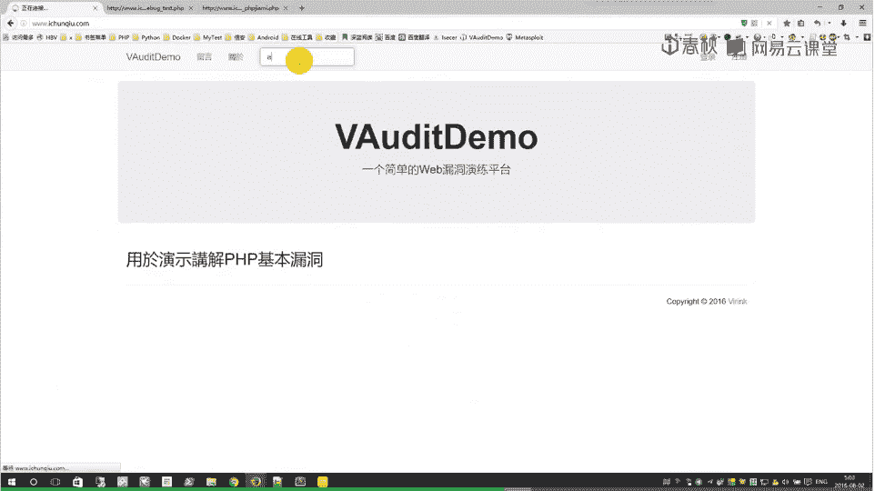
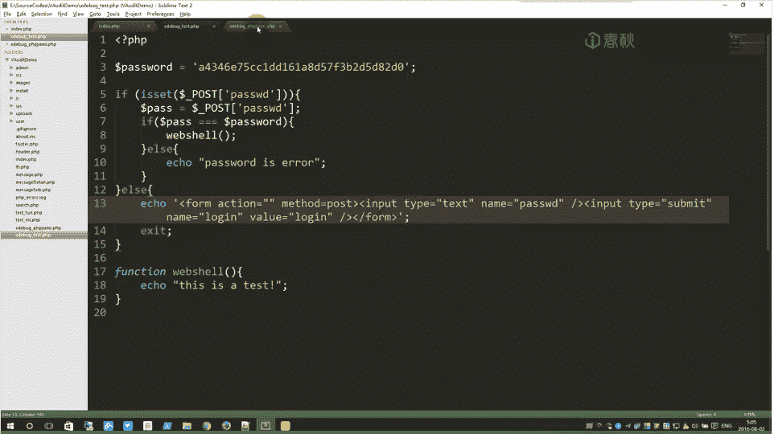
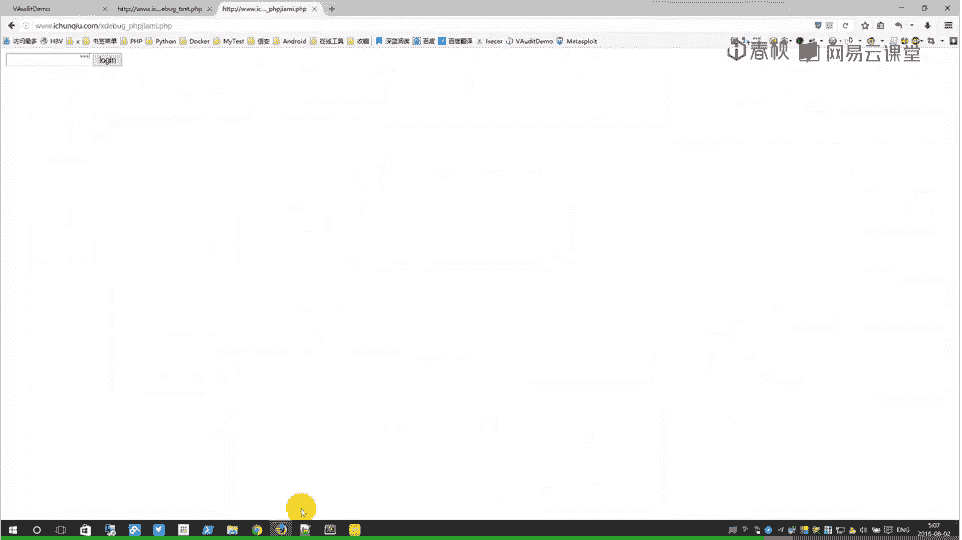
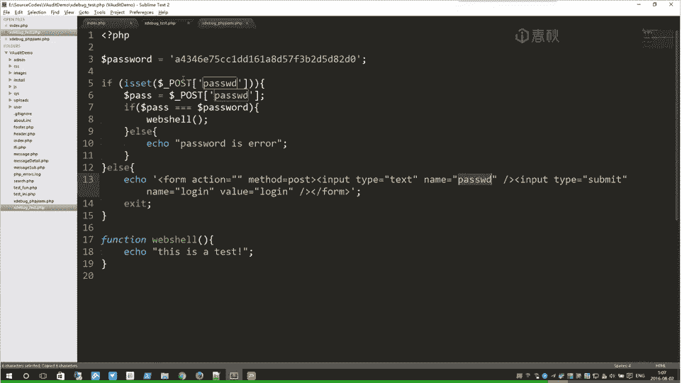
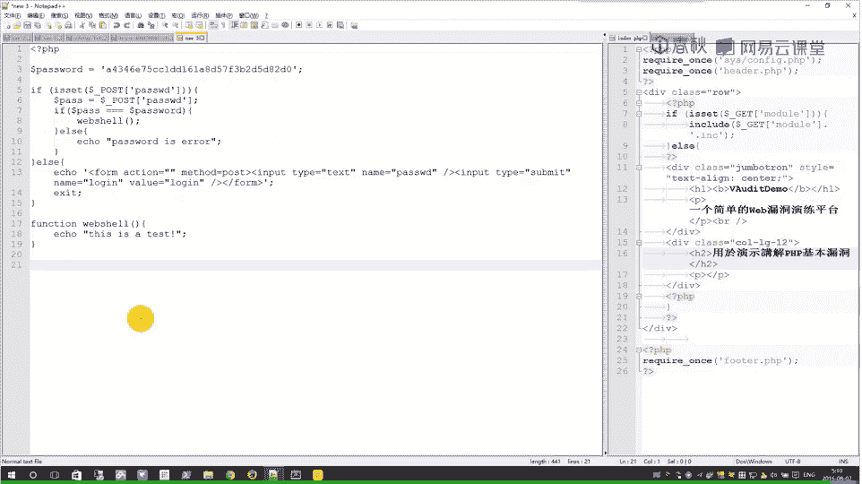
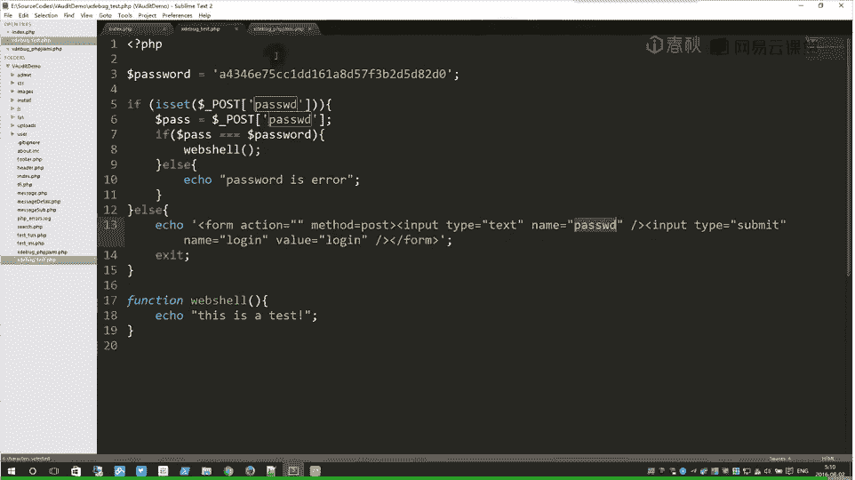

# i春秋学院 进阶篇 PHP代码审计 - P6：第五节 XDebug的配置和使用 - 老网恋教父了 - BV1D7411S7vf

。大家好，我是。嗯，这节课给大家带来的是叉dy bug的配置和使用。本节课主要有三个内容，一查dy bug介绍。2查dy bug配置。3dy bug使用。首先我们来看一下介绍。他的 bug。

是一个开放源代码的KT程序调试器。有一个第八个工具。好，同时他也是一个啊PHP的扩展。查件。呃，X bug可以用来跟踪调试分析PH程序的运行状况。如此强大的神器啊，对我们省审计有非常大的帮助。好后。

来介绍一下他的主要配置。第一个日志配置。然后他首先啊有两个小配置。啊，第一个是他输出文件的目录。我们最终的文件信息啊就都输出在这里设置的目录下。然后第二个是嗯。添加到文件的方式，也就是。

保存记录的方式嗯，就是有追加和覆盖两种，它默认是覆盖啊，同时我也推荐使用使用覆盖模式。嗯，如果是追加的话，会挺麻烦的。哎，如果你啊用的越多啊，记录的信息越多，它追加在一起，结果最后那个文件特别的大。啊。

不方便我们去阅读。好，接下来是显示数据的配置。啊，因为差点bug呃，追踪方式基本上是呃以函数为主线，就追踪呃每一个函数的执行成状况。好，这里也就显示的数据也就是和函数有关。啊，第一个就是函数的参数啊。

是否去显示参数信息。好，第二个是函数的返回值。第三个啊显示啊当前作用率的变量。也就是。它的局部函呃局部变量，函数内部的变量。好，第四个啊就是显示啊函那个变量的负值状情况。好，接下来是格式。啊。

他dy bug最终的日志保存的格式，它主要有三种，一是人可读，二是机器可读。三是嗯就是那个HTML网页模式的。哦，这里是推荐人可图，这样他显示的信息也比较详细。机器可读基本上是给工具去阅读的。

可以自定义其他的一些操作，但没有呃人可读的方便以及详细。至少人可读里面还有就是呃变量名参数名。然后接下来是行为。啊，配置他的追踪行为有两种，一种是自动追踪。一种是触发式追踪。我个人推荐使用自动追踪。

其实也是因为我比较懒，懒得每次去触发它。我们审计就让他自动追踪。每次都重新加载那个文件，你就能看到最新的最终信息。然后我所要讲的这些配置就这么多。他其实还有更多的配置啊，需要了解的话，就请自行去研究。

然后，我们所掌握的这几个配置，就足够对我们审计。有用了。好，这就是我的一些配置信息。嗯，主要是。呃，最后一个呃加载扩展。我们使用这个叉bu，我们就需要加载这个扩展的文件。好。

这个扩展它啊与P7的版本比较大的关系。每一个版本它有不同版本的叉bu，这个必须要注意。啊，我们当前使用的是5。5版本，所以说也就是路径设在5。5版本内。啊，最后是我们要讲一下它的使用方法，就审计方法。

啊，假如啊假设我这里有一个文件。呃T。然后我们里面的执行的就是复值，把hello word复制到STR，再把STR复制到V。好，最后输出V。我们访问这个脚本。访问这个页面，它就会产生对应的追踪文件。

而其中的最终信息就是这样子的，我们这样子看着也比较不方便。呃，这里我们就用了notote pad加加。然后这个工具我们显示呃高量显示PP代码。呃，加上标签就能很清楚的看到每个函数的执行状况以及变量。啊。

的负责状况。How我们。再去看一下啊，演示一下。首先给大家看一下我的配置。打开配置。Yeah。嗯。这就是我个人的配置KP study嗯，它一般安装的时候就有默认的配置，但是是不打开的。

然后我们不需要呃原来的配置，我们把它删掉，就覆盖我们这一层配置。好。配置好的话，我们就。嗯，没有配置的话，就把它修改再重启。我这里就已经配置好了。好，我们去访问。哦，我们他输出的日志在这里，现在是空的。

我们来刷新访问一下。然后他产生了一个追踪文件。嗯，打开。好，我们首先就设置一下它的高亮显示。这样我们看着也不是很方便，就加标签，让它高亮其中的代码。好，首先是加载这个文件开始预备执行。好。

第一步他就是啊包含文件。我们这里也是包含了一个conage。包含了之后呢，我们看到它箭头它有缩定不同，它就是执行这个包含所包含的文件里面的信息。这里面的脚本。啊，我们再看到comy。一据就是报告信息。

好，第二个是判断文件是否存在。好，返返回一个呃函数执行后的返回值。然后同时它这里是还有文件路径以及行号。第五行。然后接下来他就是。因为他这个存在了，他就跳过了这一步。然后这这里是包含下一个文件。

它这里不追踪，可能是他只追踪一层，而第二层包含它就不不追踪，不显示了。好，接下来就是负值。这几个复值情况。啊，就是数据库的连接状况。连接后的返回的资源再复制给CONN。然后去执行。好，执行到最后s选。

star最后就这个文件包含文件全部执行完毕，他最后是返回了一个一，正确执行。那就会回到我们这边啊，继续下一句。有包含一个head文件，我们这文件里面并没有呃要执行的代码，它有继续执行。

就返回一之后继续执行下一个。我们这些判断这些语句，它其实也不执行。嗯，他就基本上是追踪函数的。嗯，们这样就能够大概明白了他的一些过程。我们再来试一下。啊，我们搜索。诶。

我们再看它的执行文件。重新加载。重新加上标签。前面的基本上都不变。之后。😊，他就是复责那一句。我们要搜索的。嗯，在配句搜索A。好，睇哋。执行。好，执行返回的结果。资源6号资源返回到data。

然后是处理资源。然后在后面是就输出。啊，这里是因为他。我们没有没有留言信息，他就。空的返回错误。啊，返回错误后面就不执行了。我就跳过继续执行最后的包含，然后再最后返回一。行成功。

这样就是一个基本的追终流程。嗯。我框架文。键我们不知道他在哪里，我们就只要搜索一些关键的信息，关键字，直接找到它在哪里。比如我们搜索啊就查询。啊，查询留言的话，我们要找到这一句具体语句。

你就是搜索comment啊，关键字，直接去找到它。我们这个文件是比较小，也没有什么大框架去加载更多的内容。复杂的框架它就会加载很多很多东西。你直接看也不是很方便，就去搜索。

好后现在我们来再说另外一个叉dy bug的黑科技黑科技。你看代码。系。呃，char bug test这个文件我随手写的一个测试文件。也就一个虚拟的大码，它定义了一个密码，然后我们要输出密码正确。

它就会执行websel。如果密码错就数字错误。哦，不输不输啊不输入啊，不登录，它就显示一个。表单。但是我们。

加密之后，他就是啊这里是用的PHP加密。好它就是这样的一种。我们根。本去无法去审计，我们知道他代码是什么。然后我们用叉Dbu可以轻松的找出它的源码。这个文件我们去执行。啊。

因为它加密之后生成特别多乱的代码，它会呃运行的很慢，加载的很慢。那些输出的日志信息也一直在加载。对。为他比较复杂。现在是执行完毕，好的加载完毕。还有这种加密方式啊特别特别复杂。Okay。解密也很复杂。

但是我们不需要考虑它。阿 Mary。系。我们如果是单纯的想知道他的密码，我们就可以直接去搜索。哦，我们不知道源码的情况下。

他毕竟还有一个表单，我们输入的是paword，我们去搜索。

嗯，先加上标签。Yeah。可搜索password。啊，因为这个记录的那些执行信息比较多，就有点慢。所以说前面我也不推荐追加，追加就之后就特别特别慢。好，我们就可以直接去找到了他这接。嗯。

这个密码就可以被我们直接找到了。我们只要去解密，就能知道他的密码信息。同样我们也很清楚看到。他这里就是其实就是源代码了。啊，这种加密一般最后都会执行一个evervo函数。去运行我们的代码。

我们来搜索一下evervo。好，我们只要搜索了这一个Lvo，它就是执行这里面的信息。好，我们。这里面的。内容就是我们的代码。El。哦，这一部分。到这里基本上就是我们的代码了。啊，为什么他没有结束标签呢？

他弄到这里去了。好，我们来复制下来。啊，因为他直接执行的话，它里面还有一些特殊的。制服换行服啊什么的，你想需要处理。哦。然后我们直接搜索换行幅去处理一下。然后。Yeah。还转化为真正的汉行服。

但系可手工。他的一些特殊字符都会转译了。好你就需要。嗯，修改一下。你直接用替换。啊，基本上就是这样子。他的代码基本上被还原出来了。

这也就是Xdybug的一个黑科技。啊，能直接去。

破解大多数加密，就是我们找到它的ever。他所要执行的代码。好。基本上就是这些了，我们这节课就到此结束。啊，最后感谢大家的观看。😊。

