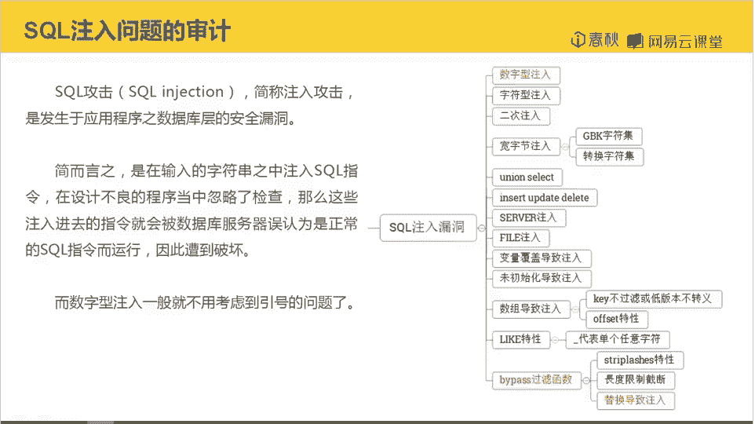
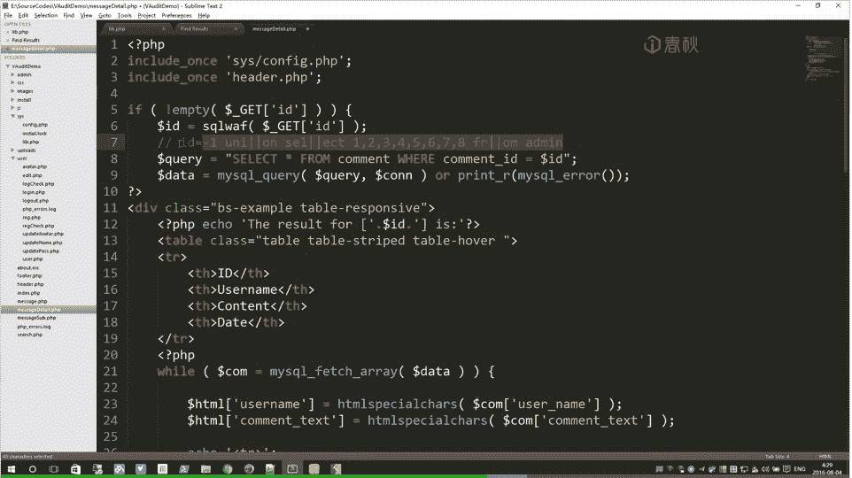
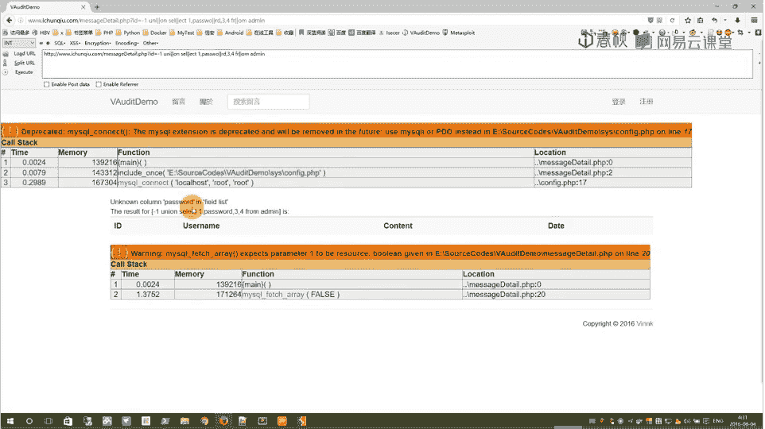
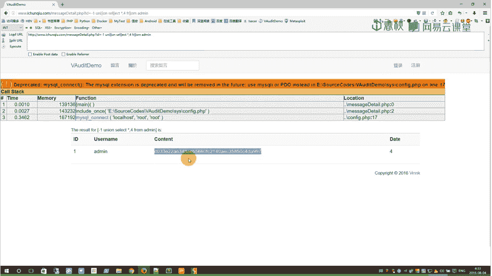
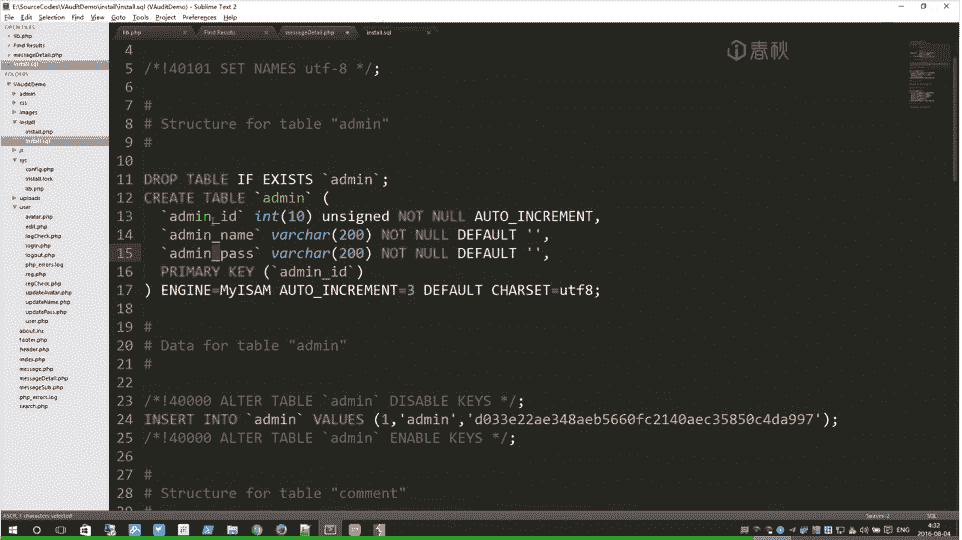
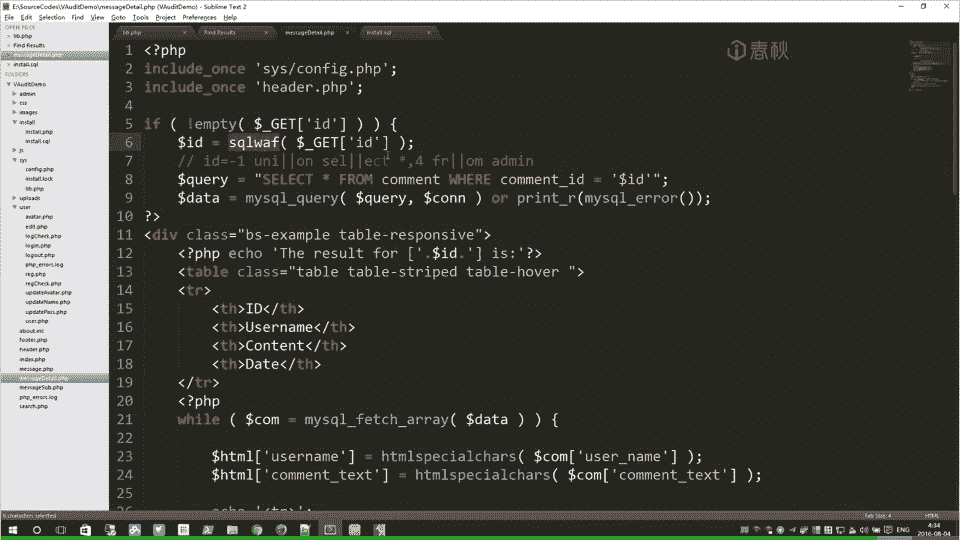

# i春秋学院 进阶篇 PHP代码审计 - P7：SQL数字型注入 🔍

在本节课中，我们将学习如何审计PHP代码中的SQL数字型注入漏洞。我们将分析一个具体的代码案例，识别注入点，并学习如何构造Payload进行利用，最后探讨修复方法。

## 概述

SQL注入是一种允许攻击者查询数据库信息的漏洞。通过注入，攻击者可以获取未授权的数据，例如管理员信息，甚至可能获取数据库权限，从而进一步渗透网站。注入类型多样，包括数字型、字符型、二次注入等。本节课我们将聚焦于数字型注入的审计与利用。



## SQL注入问题的审计

上一节我们介绍了SQL注入的基本概念，本节中我们来看看如何在实际代码中审计这类问题。

注入问题的审计通常从识别可能存在漏洞的SQL查询函数开始。在把握代码整体结构时，我们注意到一个名为 `sQ` 的自定义过滤函数。


该函数的功能是对输入字符串进行查找和替换，旨在过滤SQL关键字和特殊字符，以防止注入。

以下是该函数的主要过滤逻辑：
*   将字符串 `‘select’` 替换为 `‘sQ up’`。
*   将反斜杠 `\` 转换为双反斜杠 `\\`。
*   将 `&` 和 `|` 符号替换为空。
*   将单引号 `‘` 替换为空。
*   在分号 `;` 和下划线 `_` 前添加反斜杠进行转义。

## 分析过滤函数的绕过方法

既然我们找到了核心的过滤函数，接下来就需要分析其逻辑，寻找可能的绕过（Bypass）方法。

仔细分析后，可以发现两处潜在的绕过点：

1.  **对关键字`select`的绕过**：函数将 `‘select’` 替换为 `‘sQ up’`。如果我们输入 `‘sel|ect’`，在过滤时，由于中间的 `|` 符号，程序无法匹配到完整的 `‘select’` 字符串，因此不会触发替换。随后，函数会将 `|` 符号替换为空，字符串最终恢复为 `‘select’`，从而绕过了过滤。
    *   **绕过过程**：`sel|ect` -> (过滤`|`) -> `select`

2.  **对单引号的绕过**：代码通常使用 `addslashes` 或 `mysql_real_escape_string` 等函数对单引号进行转义，输入 `‘` 会变成 `\‘`。经过`sQ`函数过滤时，单引号被替换为空，结果留下了转义斜杠 `\`。在某些上下文或组合其他字符时，这可能造成解析问题，形成另一个绕过点。
    *   **潜在过程**：`‘` -> (addslashes转义) -> `\‘` -> (sQ过滤单引号) -> `\`

## 寻找并确认注入点

在分析了过滤逻辑后，我们需要在代码中寻找将用户输入直接拼接到SQL语句中的地方，即注入点。

我们可以通过全局搜索SQL查询语句来寻找。例如，使用正则表达式搜索模式 `“select.*from.*where.*=\$”`，可以找到类似 `“select * from table where id=$id”` 的语句。

通过搜索，我们在 `message_details` 页面找到一处：
```php
$sql = “select * from message where id=$id”;
```
变量 `$id` 直接拼接进SQL语句，且没有被单引号包裹，这符合**数字型注入**的特征。向上追溯，`$id` 来自 `$_GET[‘id’]` 并经过了 `sQ` 函数的过滤。

由于这里是数字型注入，我们无需绕过单引号限制，可以直接开始构造注入Payload。

## 构造与执行SQL注入

确认注入点后，本节我们将学习如何构造联合查询（Union）Payload来获取数据。



我们计划使用 `union select` 语句。首先需要确定当前查询的字段数量，以便让 `union` 前后的字段数匹配。测试字段数主要有两种方法：
*   使用 `order by n` 递增 `n` 直到报错。
*   使用 `union select 1,2,3…` 并逐渐增加或减少字段数量进行测试。

这里我们采用第二种方法，从8个字段开始尝试：
```
id=1 union select 1,2,3,4,5,6,7,8
```
通过不断减少字段数测试，最终确定原查询有 **4** 个字段。因此，我们的Payload需要包含4个字段。

接下来，我们需要在 `union select` 的字段位置替换为我们想查询的信息，例如管理员的用户名和密码。假设我们想查询 `admin` 表的 `password` 字段。但注意到表名 `admin` 包含下划线 `_`，而过滤函数会对下划线进行转义（`_` -> `\_`），导致直接查询表名失败。




我们查看代码安装结构，发现管理员表名可能是 `admin_pass`。由于字段转义问题，我们不能直接查询特定字段。一个巧合的解决方法是，如果 `admin` 表恰好有3个字段，我们可以使用 `select * from admin` 来获取所有字段，再外加一个数字凑齐4个字段。
```
id=1 union select 1, * from admin, 4
```
执行上述Payload后，成功在页面中显示了管理员用户名和密码的哈希值。



获取到密码哈希后，可以尝试进行破解，从而登录网站后台。



## 漏洞修复方案

在成功利用漏洞后，我们必须考虑如何修复它，以防止被攻击。修复需要从两方面入手：

1.  **修复SQL查询语句**：在注入点，为数字型变量 `$id` 添加单引号包裹，并将其强制转换为整数类型，确保输入不会被解释为SQL代码。
    ```php
    // 修复前
    $sql = “select * from message where id=$id”;
    // 修复后
    $id = intval($_GET[‘id’]); // 强制转换为整数
    $sql = “select * from message where id=‘“ . $id . “‘“; // 使用参数化查询更好
    ```

2.  **修复过滤函数**：修改 `sQ` 函数，避免将单引号等字符替换为空，而是应该进行正确的转义或拒绝。更好的做法是使用预处理语句（Prepared Statements）来从根本上防止SQL注入。
    ```php
    // 不安全的替换
    $str = str_replace(“‘“, ““, $str);
    // 应改为使用预处理，例如PDO：
    // $stmt = $pdo->prepare(“SELECT * FROM message WHERE id = :id”);
    // $stmt->execute([‘id’ => $id]);
    ```




## 总结


本节课我们一起学习了SQL数字型注入的完整审计流程。

我们首先回顾了在把握代码大局时发现的 `sQ` 过滤函数。随后，我们深入分析了该函数的逻辑，并找到了两种可能的绕过方法。接着，通过全局搜索SQL语句，我们在 `message_details.php` 中定位到一个未使用单引号包裹的数字型变量 `$id`，确认其为注入点。然后，我们逐步构造了联合查询Payload，通过测试字段数、绕过表名过滤，最终成功获取了管理员账户的密码哈希。最后，我们讨论了修复此类漏洞的关键措施：一是对输入进行正确的类型转换和过滤，二是优先采用参数化查询等安全编码实践。

通过本课的学习，你应该能够理解数字型SQL注入的原理、审计方法、利用技巧以及最重要的修复方案。


