# i春秋学院 进阶篇 PHP代码审计 - P9：安装问题的审计 🔧

在本节课中，我们将学习如何审计PHP程序中的安装功能。安装功能是许多程序初始化的关键步骤，但若存在缺陷，可能导致严重的安全漏洞。我们将通过一个具体的代码审计案例，学习“特定功能定向法”的应用，并理解安装问题中常见的漏洞类型。

## 概述 📋

安装功能通常负责初始化数据库和写入配置文件。如果审计不当，这些功能可能成为攻击者入侵系统的入口。本节课程将深入分析安装流程中可能存在的安全问题。

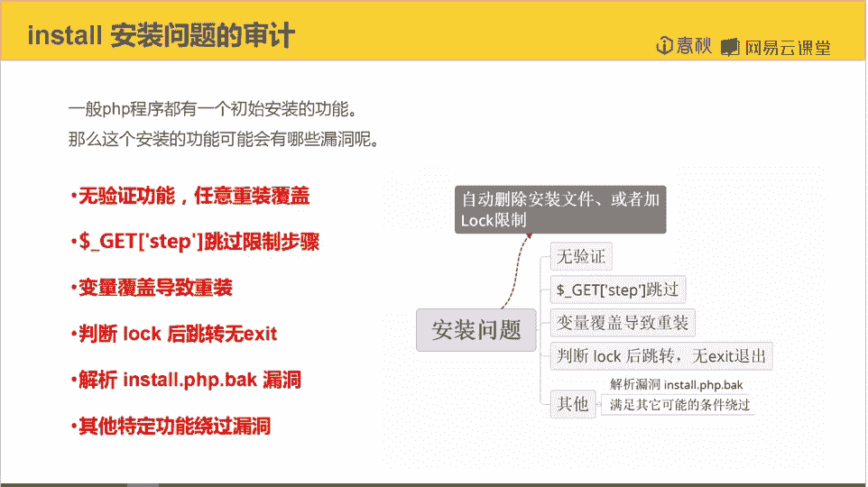

## 安装功能简介

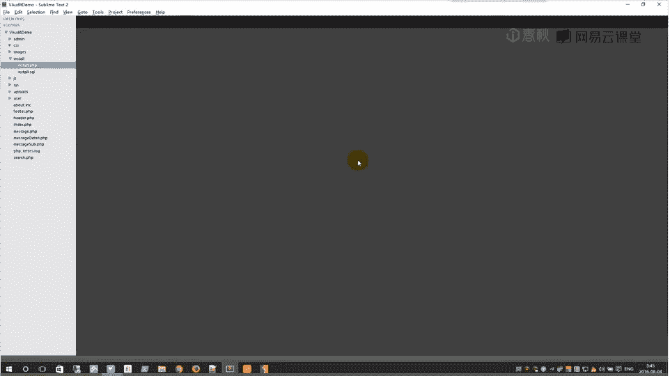

一般PHP程序都有一个初始的安装功能。这个功能主要执行两项任务：
1.  数据库的初始化，包括写入数据库结构和初始信息。
2.  写入配置文件，例如填写数据库的连接信息。

## 安装问题中的常见漏洞

以下是安装功能中可能存在的几种漏洞类型：

1.  **无验证功能**：没有验证机制可能导致程序被任意重装覆盖。
2.  **Step跳过限制**：某些CMS将安装过程分为多个步骤，如果限制不严，攻击者可能直接跳过某些关键步骤。
3.  **变量覆盖导致重装**：通过覆盖某些关键变量，可以诱使程序执行重装流程。
4.  **判断Lock文件后跳转未结束进程**：程序检查到已安装的Lock文件后进行了跳转，但没有使用 `exit` 或 `die` 终止脚本执行，导致后续安装代码依然可能被执行。
5.  **解析漏洞及其他特定功能绕过**：不同程序的安装功能有各自的验证逻辑，可能存在独特的绕过方式。

上一节我们介绍了安装功能的常见漏洞类型，本节中我们来看看一个具体的代码审计案例。

## 代码审计实战

现在，我们开始分析一段存在漏洞的安装代码。

### 第一步：定位安装文件

首先，我们需要找到并打开程序的安装文件，通常命名为 `install.php` 或 `setup.php`。

### 第二步：分析安装逻辑

我们从代码开头开始分析。

```php
if (file_exists(‘lock’)) {
    header(“Location: index.php”);
}
```

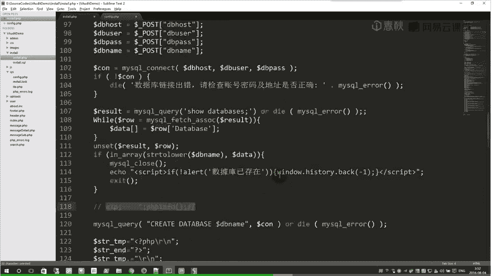

这段代码检查是否存在 `lock` 文件。如果存在，则跳转到首页。这里我们发现了第一个漏洞：**判断Lock文件后跳转未结束进程**。代码使用了 `header` 进行跳转，但没有调用 `exit` 或 `die`，这意味着跳转指令发出后，后面的PHP代码依然会继续执行。

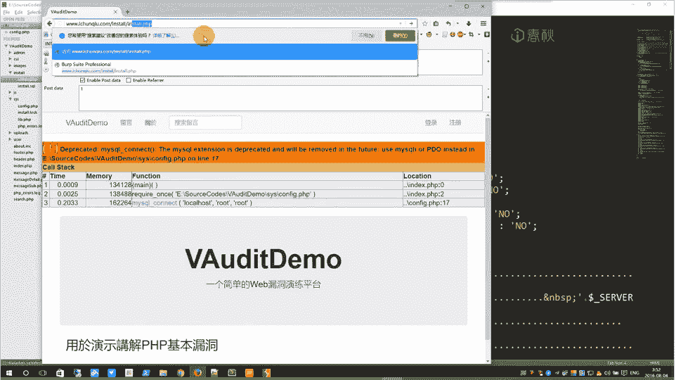

### 第三步：跟踪重装流程

既然跳转后代码仍会执行，我们继续往下看，分析重装过程可能导致的其他漏洞。

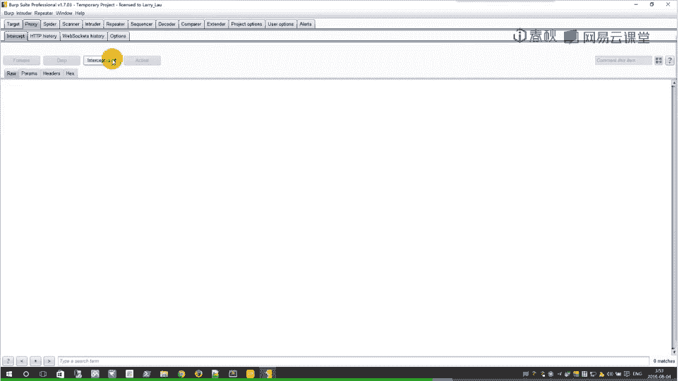

1.  **定义检查函数**：代码首先定义了一个检查文件是否可写的函数。
2.  **显示系统信息**：随后显示服务器环境信息。
3.  **检查目录权限**：检查必要的目录是否可写。
4.  **接收用户输入**：通过 `$_POST` 接收用户提交的安装信息，主要是四个数据库相关参数：
    *   `db_host` (数据库地址)
    *   `db_user` (数据库用户名)
    *   `db_pass` (数据库密码)
    *   `db_name` (数据库名)
5.  **连接与操作数据库**：代码尝试连接数据库，并检查用户提交的 `db_name` 是否存在。如果不存在，则创建该数据库。
    ```php
    $sql = “CREATE DATABASE `{$db_name}`”;
    ```
6.  **写入配置文件**：数据库创建成功后，代码准备将配置信息写入一个PHP文件（例如 `config.php`）。
    ```php
    $str = “<?php\n\$db_name=’{$db_name}’;\n?>”;
    file_put_contents(‘config.php’, $str);
    ```

这里我们发现了第二个关键点：`$db_name` 变量被直接拼接进SQL语句和配置文件内容中，**没有进行任何过滤**。配置文件是 `.php` 文件，意味着写入的内容会被服务器解析执行。

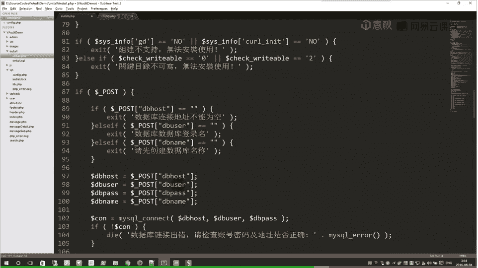

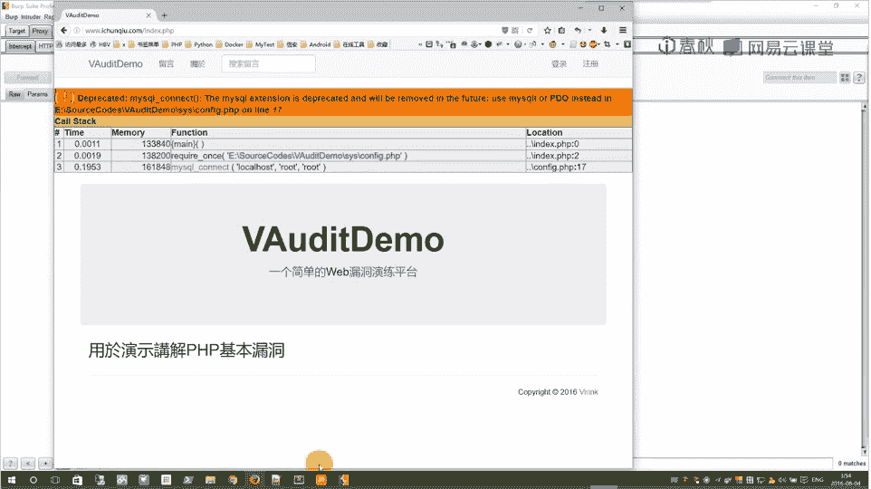

### 第四步：构造利用Payload (EXP)

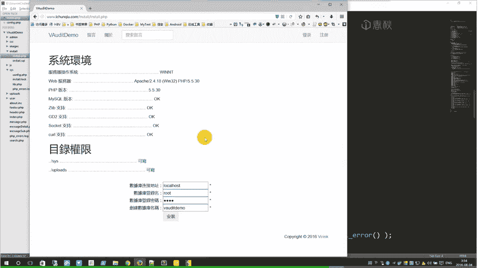

我们的目标是：通过控制 `db_name` 参数，在 `config.php` 文件中写入恶意PHP代码。

思路如下：
1.  确保SQL语句能成功执行，这样代码才会走到写入配置文件的步骤。
2.  在 `db_name` 中注入SQL注释符 `--`，注释掉原SQL语句的后续部分。
3.  在注释后，我们实际上可以开始构造我们想要写入配置文件的内容。我们需要闭合原配置文件中 `$db_name` 的赋值语句，然后插入我们的代码。

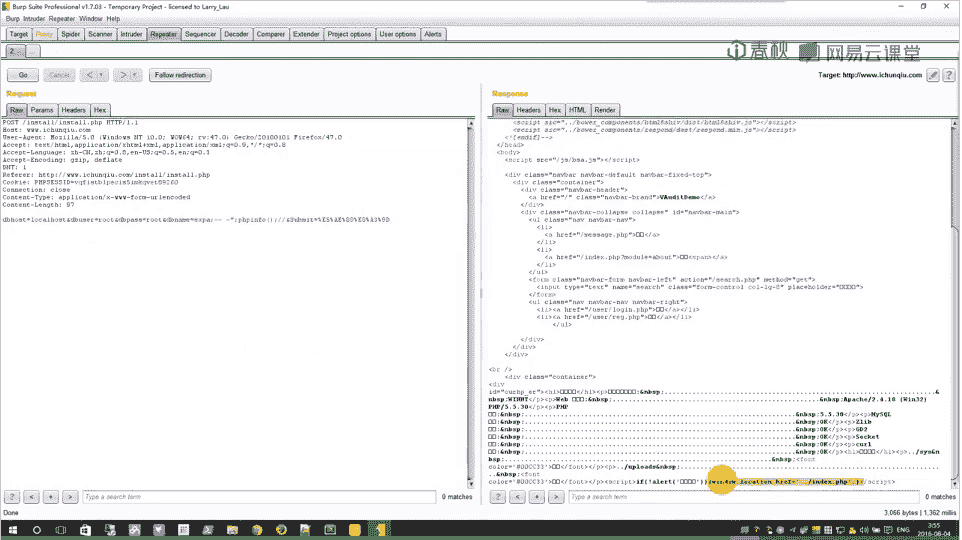

原配置文件写入的代码期望是：
```php
<?php
$db_name=‘我们输入的db_name’;
?>
```

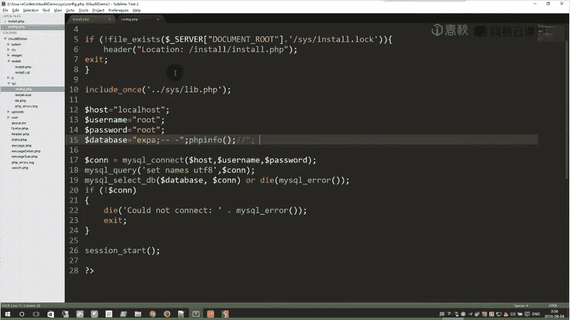

为了写入一句话木马，我们可以构造这样的 `db_name` 值：
```
‘;@eval($_POST[‘cmd’]);//
```

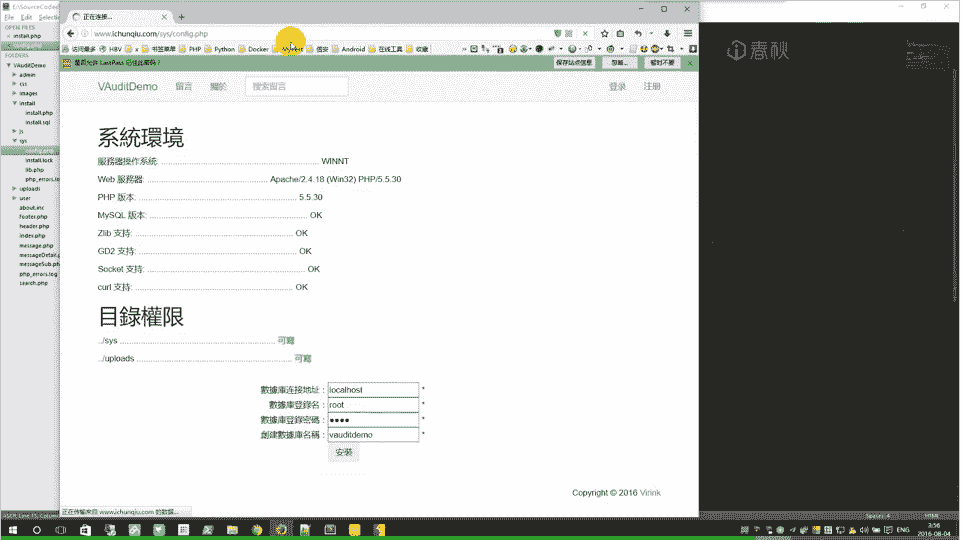

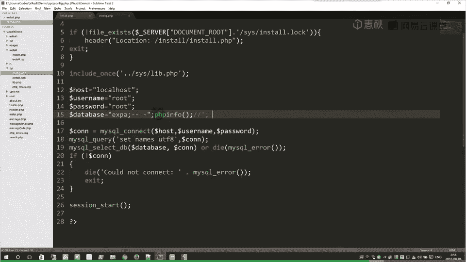

分解解释：
*   `‘`：闭合原代码中的第一个单引号。
*   `;`：结束当前的PHP语句。
*   `@eval($_POST[‘cmd’]);`：我们插入的恶意代码，执行POST参数 `cmd` 传来的命令。
*   `//`：注释掉原代码行末尾的 `’;`，防止语法错误。

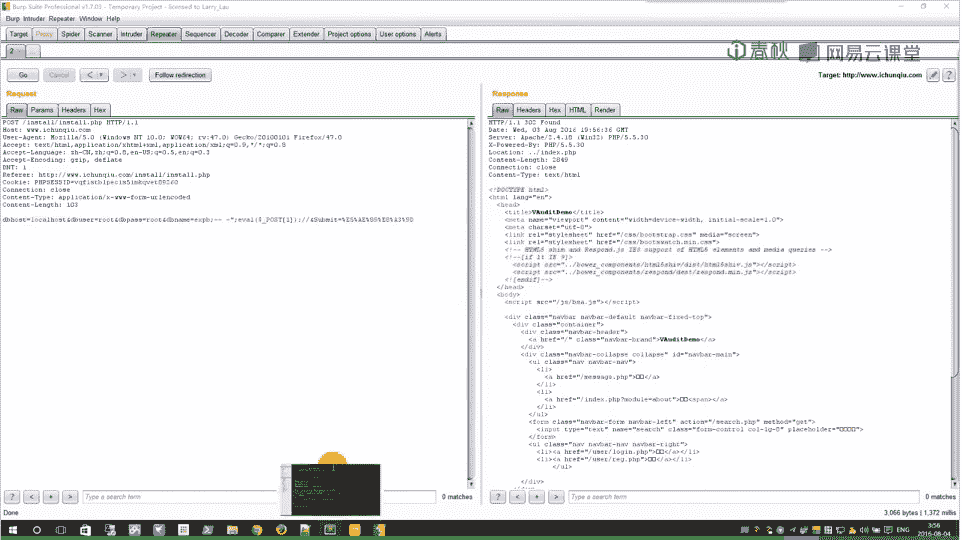

因此，最终写入 `config.php` 的内容将是：
```php
<?php
$db_name=‘’;@eval($_POST[‘cmd’]);//’;
?>
```
这样，我们就成功注入了一句话木马。

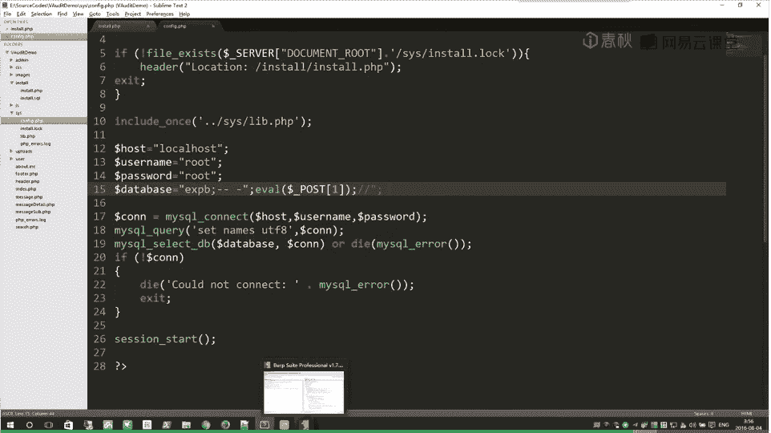

### 第五步：漏洞验证与利用

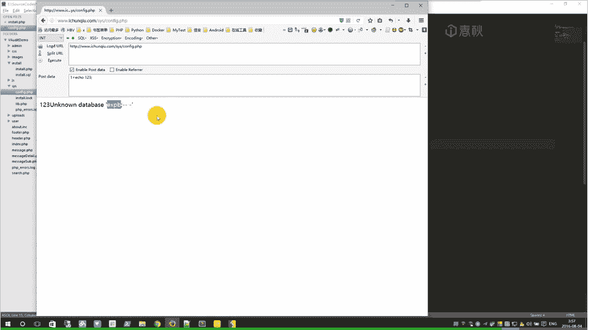

1.  **拦截请求**：使用Burp Suite等工具拦截安装过程中提交表单的POST请求。
2.  **修改参数**：将 `db_name` 参数的值替换为我们构造的Payload。
3.  **重放请求**：发送修改后的请求。由于存在“跳转未结束”的漏洞，安装逻辑会继续执行，使用我们恶意的 `db_name` 创建数据库并写入配置文件。
4.  **访问木马**：安装完成后，访问 `config.php` 文件，并使用工具连接一句话木马，即可执行任意系统命令。

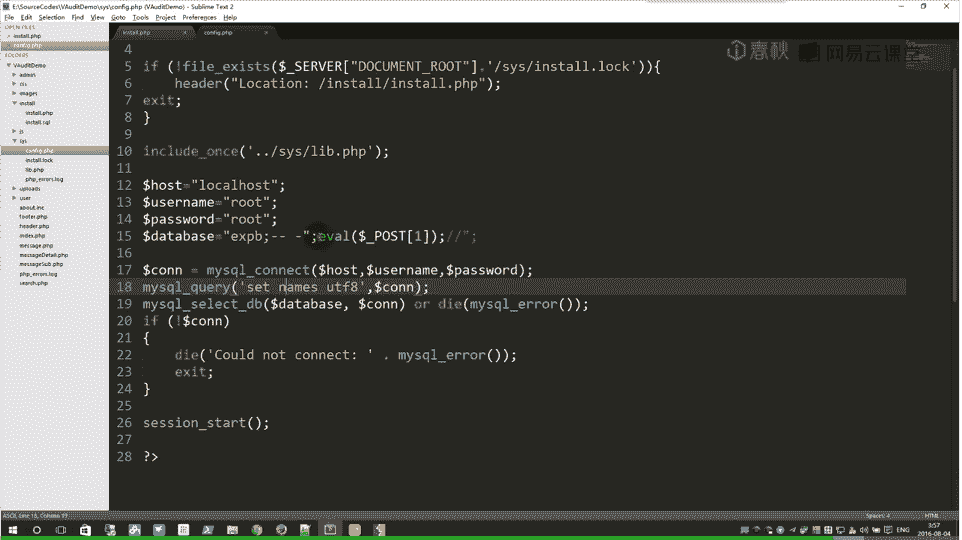

### 第六步：漏洞修复

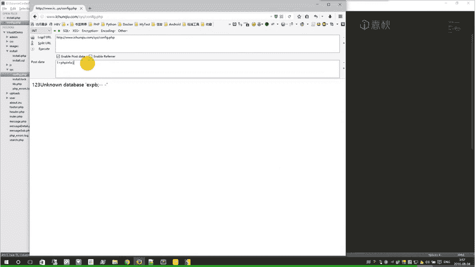

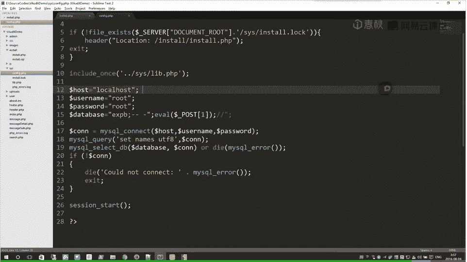

修复此漏洞的核心在于两点：
1.  **在跳转后终止脚本**：在检查到Lock文件并跳转时，必须使用 `exit` 或 `die`。
    ```php
    if (file_exists(‘lock’)) {
        header(“Location: index.php”);
        exit(); // 关键修复
    }
    ```
2.  **对用户输入进行过滤**：对写入配置文件的变量（如 `$db_name`）进行严格的过滤和转义，防止代码注入。至少应使用 `addslashes` 或数据库扩展的特定转义函数，并考虑是否允许其中包含特殊字符。

## 审计思路总结 🎯

本节课我们一起学习了针对“安装问题”的审计方法，即“特定功能定向法”。

1.  **定向寻找**：直接定位到程序的安装功能文件。
2.  **流程分析**：仔细阅读安装逻辑，重点关注：
    *   是否存在安装状态判断（如Lock文件）？
    *   判断后的流程控制是否严谨（有无 `exit`）？
    *   用户输入是否影响关键操作（如SQL执行、文件写入）？
    *   输入数据是否经过过滤？
3.  **漏洞串联**：在本案例中，我们发现了两个漏洞的串联利用：
    *   初级漏洞：跳转未结束进程，允许重装。
    *   深度漏洞：未过滤的 `db_name` 参数直接拼接入配置文件中，导致代码注入。
4.  **修复方案**：修复思路总是围绕“严格验证”和“彻底过滤”展开，同时确保逻辑分支的严密性。


通过这个案例，我们可以看到，即使是一个简单的安装功能，也可能因为多个细微的逻辑疏忽叠加，导致严重的远程代码执行漏洞。在代码审计时，保持耐心和细致至关重要。