# i春秋零基础入门Android逆向 - P28：课时3 elf结构详解：加载so文件的流程 - 老网恋教父了 - BV1sg4y1B7zB

🎼。

啊，好的，呃，大家好，这里是0日安全论坛的安卓零基础逆向入门培训教程。我是小学艾8。那么今天的话来讲1个ELF结构。第二课，上一节课的话已经详细的讲到过了ELF文件，它在一个存储中的一种格式。

而且已经明确说明到哎它是有两种视图，第一种就是一个链接视图。那么第二种的话就是一个执行视图。但是的话我们还是没有讲到整一个安卓系统到底是怎么样把1个ELF文件，从一个存储中来加载到内存中去的。

那么这节课的话，我们将从源码中哎去分析整个安卓系统，它是怎么样进行一个链接进行一个加载的。那么首先我们来看一下它用来加载的一个程序。

那么安卓的话它是通过一个叫做link的一个程序来把到加载ELF文件的一个操作的。哎，那么这里哎，那么这个link的话，它位于安卓源码这个位置，一个风里的一个link文件夹下。

那么这里面就是一个link的一个源代码，有兴趣的话可以自行去查看。那么这里的话我就可可对它进进行一个简单的一个介绍。那我们就来打开我们的一个呃看代码的一个工具，就是那个呃。就这个这这段软件。

那么前面已经介绍过了，那么这里我们就把link代码给导入进去，然后进行一个重新的一个加载。我们可以看一下整一个项目代码话比较爽的，就就只有这十十来个文件可以看到他他的一个呃。

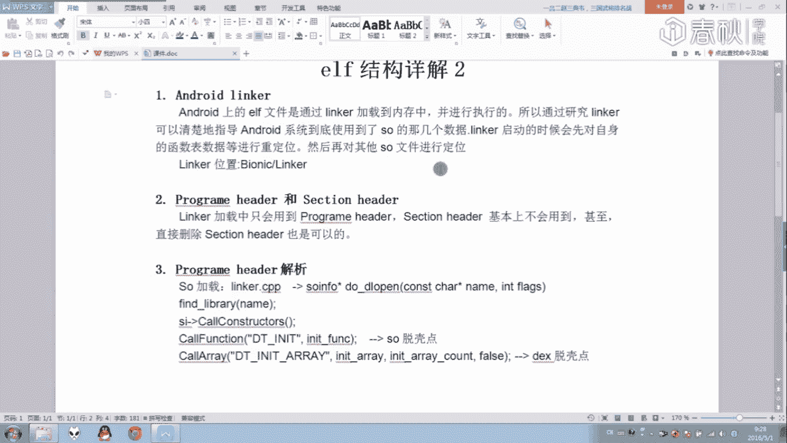

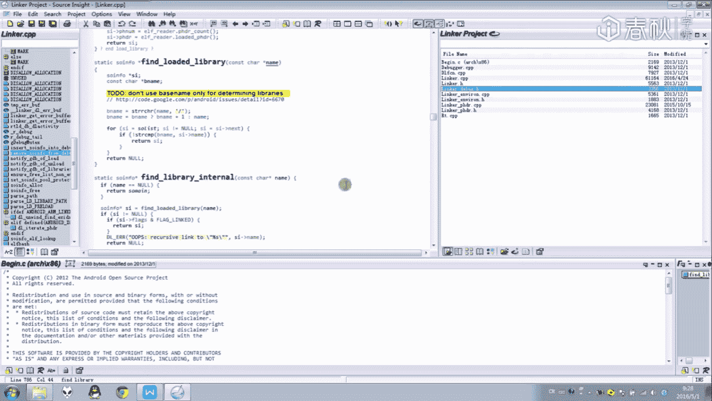

整一个项目的话也是比较简单的，我们就来大致的讲解一下吧。那么每一个link的话都它都是都是从一个汇编语言来进行一个来做一个入口点的那这里我就讲一个叉86的一个版本啊，我们还可以看一下每它入口点。

它入口点的话是一个大函数。

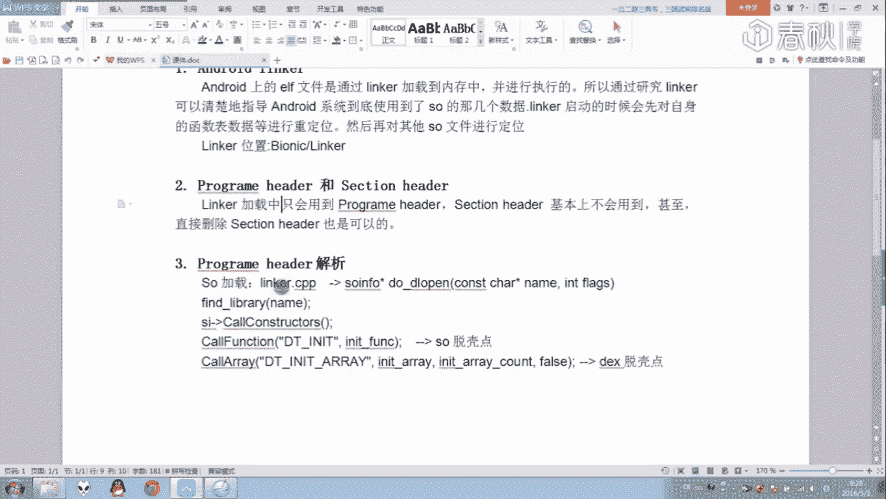

然后里面的话它会调用一系列的一个函数。首先它会调用一个呃linkIIT的一个操作。这个这个函数的话，它是做什么呢？那么呃所有link它刚开始加载的时候，它都会引引用到一些函数。

比如说其他SO库中库中的一些函数，是甚至它自己本身有一些地方来需要进行一个重定位。那么首先link它加载的时候，就会对本身的一些数据，一些函数啊一些地址啊，进行优先进行一个重定位。

然后把这一些操作都完成以后，才可以通知系统，它可以加载其他SO文件了。那么这一个函数的话，它就是完成对自身的一个从定位的一个操作。那么这里就是一个link初始化的时候的一个函数。那当然这个函数的话。

我们基本上是怎么不怎么关心的，因为不怎么可以遇到。我们一般来说我们关心的是一个link，它是如何的去加载一个SO文件的。好，我们就来看一下它加载的一个函数啊。那么我们编程的时候呢已经知道了。

我们在写代码的时候，要要如何加载一个SO函数呢，就是调用这样一个一个DLop。然后然后在里面传递一些参数，就能够从一个存储的结构中呢加载我们的1个SO文件了。

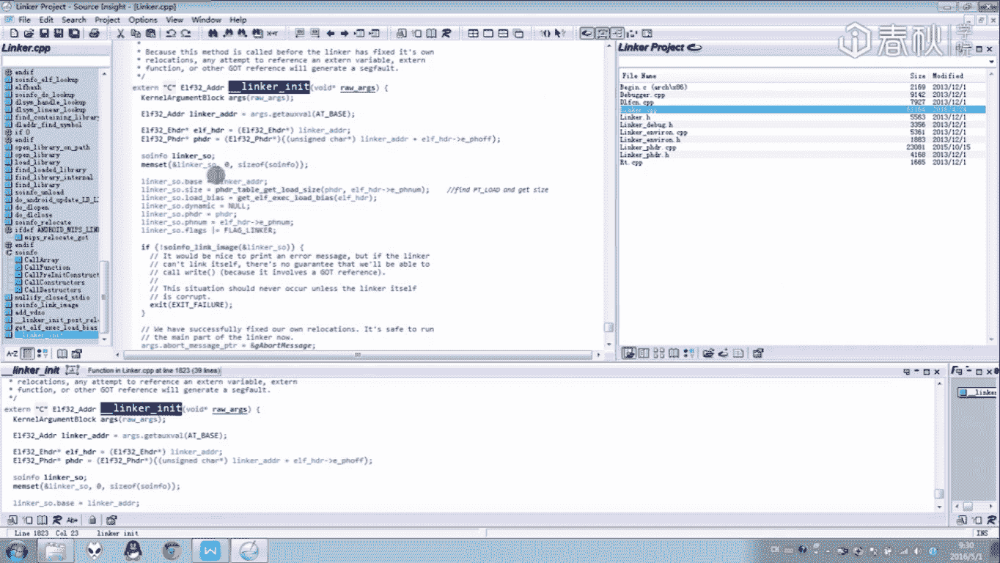

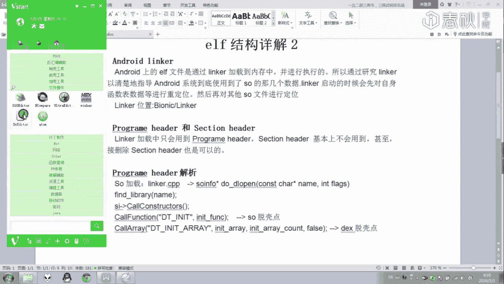

那么那么在也是一样的那link里面的快有这样一个函数do deal open。那么通过这个函数的话，就能够达到一个加载的一个效果了。那么我们就从这个函数来开始来看起。

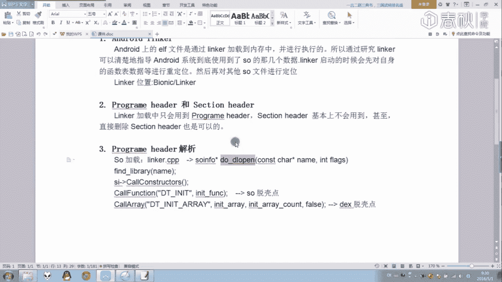

那，我们先来找到这个函数。

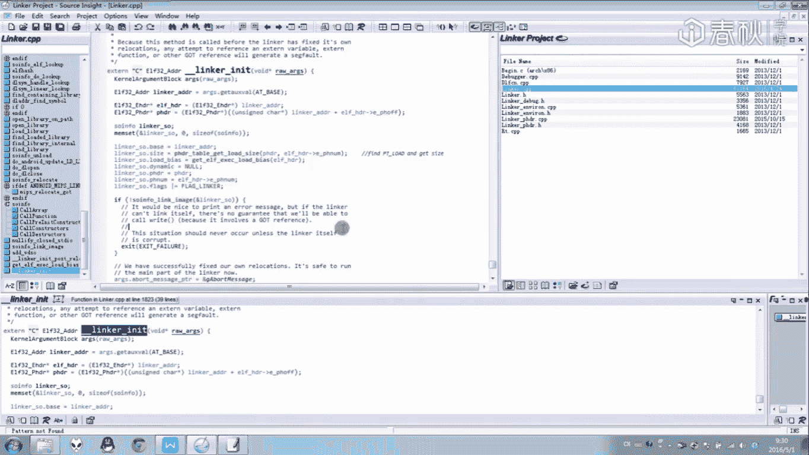

う。你好这样。

好，那么这里就是一个呃open的一个函数。这一个的话就是一个打开SO文件的函数了。第一个参数的话是SO文件在内存中买在存储设备中的一个路径。那么第二个参数的话是它打开的一个标志位。

那么这里第一步它会首先对我们传递进去的一个标志位进行一个判断，来看它是不是这4个中的其中之一，如果是的话就进行下一步的一个open的操作。

我们一般来说都会传递一个参数来作为传递这样一个参数来作为f标志位的。那么这个参数就表明是立即加载并完成从定位的一个操作的一个意思啊，那么它判断完这一个f标志位以后呢。

就开始这几行就开始进行一个SO文件的一个加载。首先它它里面的话会有一个叫SO的一个数据。那么这里的话就是一个数据词里面的话存放在内存中时已经加载过的一个SO的一个信息了。由于我们在。加载的时候。

有可能会像这个数据词里面给添加一些信息，或者说是一个删除一些信息写位信息等等等等。那么由由于这涉及到一个数据数据操作，那么它就会先对这样一个词的一个访问属性，设置为一个可读可写。

然后在里面再进行一个加载，下载完以后再设置为一个只读的一个标志位。那么跟过去看一下的话，哎，这里面就已经看到了会从一个一个全局的一个SO词里面给取出一个IO的信息了的，然后修改它的一个访问属性的。

那么这里就是一个呃就是一个程粹操作的一个一个东西，就是这是一个数词的一个属性。好，那么这两个可以不管。那么我们来看一下它比较关键的两个函数。那么第一个第一个是一个finn的一个函数了。

然后第二个就是一个construct函数。从名字中候已经知道了。第一个的话首就是一个加载SO文件的函数了。那么第二个的话则是将SO函数里面的一个初始构造函数的一些操作了。我们一个一个看下来这两个函数。

我们慢慢看下去吧。首先是一个finn的函数，我们过去看一下，传递过去的参数跨为我们我们的一个名字。好，那么里面可以这到一个fin numberin的一个操作。

然后下面假如我们已经找到相应的一个SO信息的话，就可对它的一个引引用技术来进行一个加一。那么这个引引引用技术的话，是判断有没有其他一个S文件，引用到我们的当前的SO文件的一个重要依据的。好。

那么这是一个引用技术，我们来跟跟过去看一下这样一个啊fin的一个函数吧。好，那么这里的话就比较简单了。假如我们的名称是空的话，就会访馈一个全局的1个SOV一个信息，就是最当前的man的SO的信息。

假如哎假如找假如是黑空的话，就可以调用下一个，那么就会调用到这个函数。这个函数的话就是寻找当前的内存中已经加载过的一个SO信息，看我们这个SO文件是不是已经加载了。假如已经被加载到了，就直接给返回。

如果没有加载的话，就就再一次读取文件呢进行一个加载。然后走过去看一下的话，可以发现它先可以把我们的SO的一个名字给取出来，对吧从右边开始取出一个杠，然后呃，然后把它的真实名称给取出来。

然后从一个SO list也就是一个存储SO的一个列表中给一个一个取出当前的SO信息，然后就行一个便利，你一下它的名字，假如已经存在了以后就直接返回。

那么这次寻找当前是不是已经加载过了这样1个SOCC息的一个函数。好，那么这里也可以直接略过了。假如哎当前没有被加载，那么它就要从内存中给加载过来，对吧？然后一步步一步找走下来的话，哎，就可以到这个函数。

那么这个函数的话，则是真正的从内存中进行一个加载的一个函数了。我们跟过去看一下load library。然后一个一个参数是一个le馈参数是一个SOE的一个SOCC的一个结构题。好。

那么首先他会用一个open library来获得一个文文件可读的一个fag标志一个。一个文文件符，然后先打开一个文呃软件符，取择1个FD。然后里面这里都是一个打开的一个操作。好。

那么取到FD以后呢哈的话就会调用到这样1个ERFwin的一个结构。那这个这个话哎这个class的话就是专门来用来呃这个ca是不是专门来用来。读取EF文件的信息的一个类容。当然这个可以直接使用的。好。

那么它就可以对S文件的名称，还有它的一个读可读的一个范盒啊读取出来，然后进行一个漏操作。这个路里面就是一个真正的读取的一个操作。我们看一下。那么这里它读的话也是比较简单了。首先读1个EF的头。

然后就对它的一个头来进行一个验证，看一下是不是合法的。接着如果是合法的话，就可以读取一个program head，就是呃前面所说的一个head的一个数据了。如果这个for head里面的数据是真实的。

那么就可以对一个空间进行一个调整，初始化些数据之类的。接着就根据一个program head数据中哎开始进行一个加载，那最后哎就会。获取到一些。嗯。

就就可以获取到它的内存中的一个pro head一个数据。那么这几个函数的话还都是比较简单的。跟过去看一下的话，以及大概一一目了然的一个样子。你比如说这个BEI head的话。

就是单纯的来获取整一个head的一个数据。如果中呃用上一节课说法来说的话，大概就是整一个EF文件图的一个大小而已啊，我们来来来找一个找一个这个来看一下。

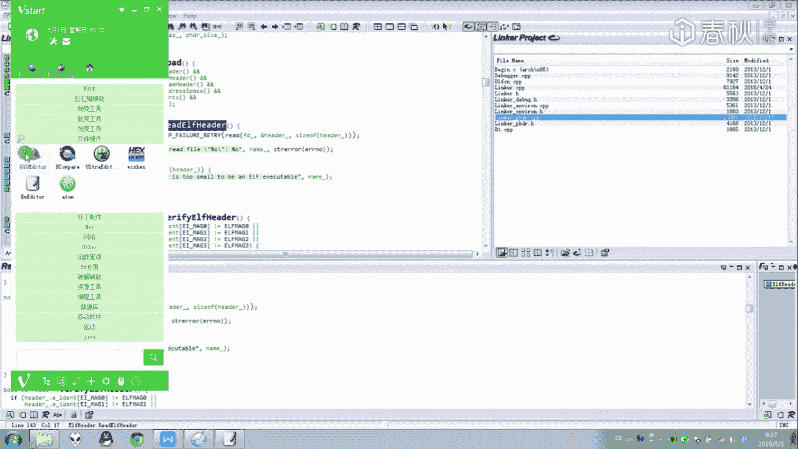

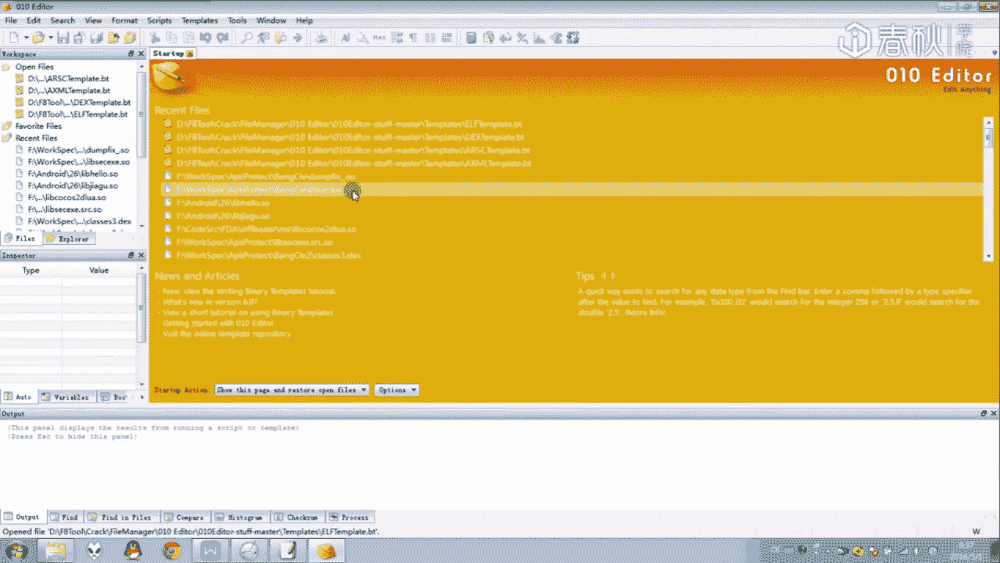

比如说这个VDA1ipad的话，它实际上就是把整把这一段的一个数据，大概这么长的一的数据呢读取到内存中去了，然后做1个EF信息的判断来进行一个获取。

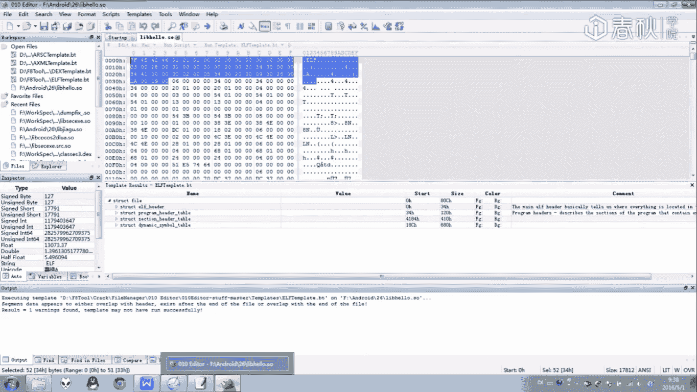

那么这里就是一个readEF head的一个z。那么我兴趣要话给大家看一下，获取一个s head，然后读读取到这个结构里面去。好，那么下一步，假如在读取成功的话，就会进入到一个验证的一个阶段。啊。

那么这也就是一个验证head的一个送了。那么它主要就是判断里面的一个id是不是呃等于他以前您声明过的一个标志。

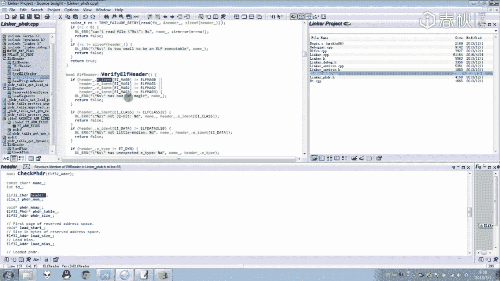

开展的话就是就是这个结构体了。那么这里个结构体的话存放了它的一些魔术。比如说第一个就是规定的一个是减EF的一个结构。然后第二个的话，对于3设备系统肯定是1个EF class32。

然后它是一个little bias的一个什么东西，那么它就会对这些魔术和一个magage number。这一前面就伦本来进行一个判断，来进讲来校验它是否是不是一个合法的1个EF文件。

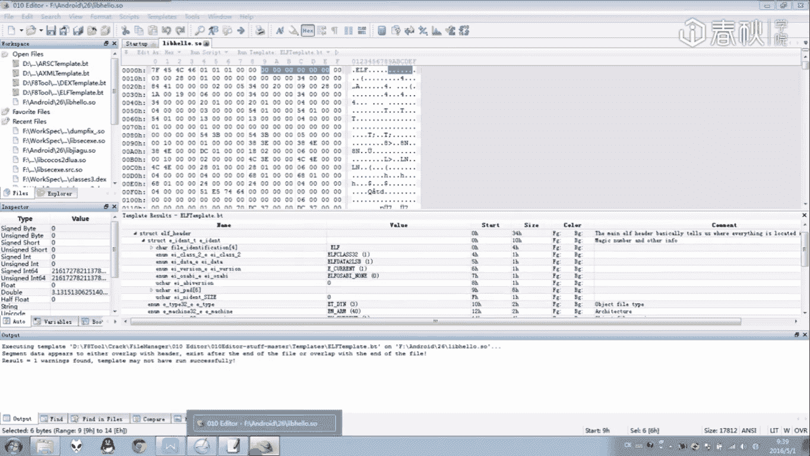

那么对进行一步一步判断以后，哎，假如是正确的话，就会哎这个把为处的一个。属性可以看一下，那么这里就是就是进行一个plus的一个判断。然后它是不是低端自行需要和高端自行需的一个判断。

啊这把这些判断都做完以后，就把一个正确的一个结果哎返 two。那是对一个EIipad一个id呢进行验证的。假如上面两个哎已经通过话就可以开始进行一个pro head的一个读取了。

那么program head的话也比较简单，先从我们的ER head中取出我们的一个program head的一个偏移地址，还有它的一个大小是对吧？

使用它的一个呃number来乘以它的每一个结构大小来获取到它的一个。呃，program head一个结束地址，然后两个相减来获取到我们program head的一个size。

然后把这些数据都获取到以后呢，然后调用一个M memory map的一个函数来把这一段文件中的数据直能m到列群中去。那么这里就是我们的program head的一个数据地址了。

那么它就利用到这个哎来获取到一个program的一个map属性。好，那么这里的话可以看到看到一个强制强制储出强制的一个底值时间转换。好。那么这里就是一个读取一个head的一个属性了。

那么下一步的话就是对一个地址，对吧？对一些地址啊什么进行某一些转换来调整一下的一个地方。好，这个不重要。我们来看一下下一步的话就是开始进行一个加载了。那么这个函数的话。

就是从一个文件中把我们需要加载段全部给加载到我们的一个内存中去。我们来看一下这里首先它会便利我们我们的一个program head。就是。这几个头的一个属性。那么。这里有这么多pohead。

它会一个一个进行一个便例，对吧？这么多一个这有比如说这里总共有9个，那么它就会一个一个进行一个便例。编义这几个head以后，从里面找到它一个访问属性为1个PT load的一个段。

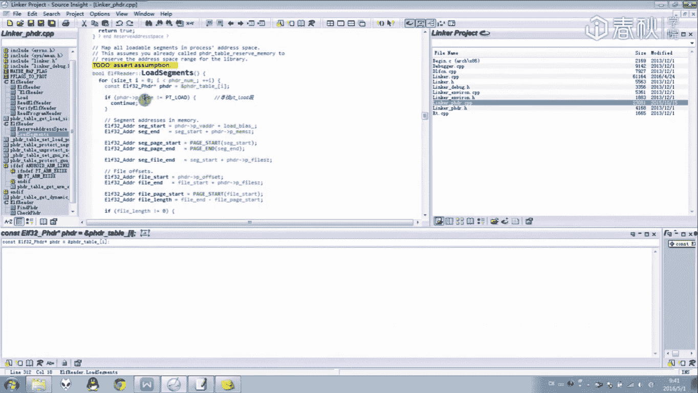

呃，访位属性的话就是这里了，对吧？PTL的话就是哎就是特指的两个段，其他段的话都是不会被引用到其他段都是会直接跳过。那么它就会从这么多的一个head中寻找。

哎它的这个属性为一个low的一个就一个段的啊哦我们打开打开打开下一节课看到的一个东西来指认一下。と三。

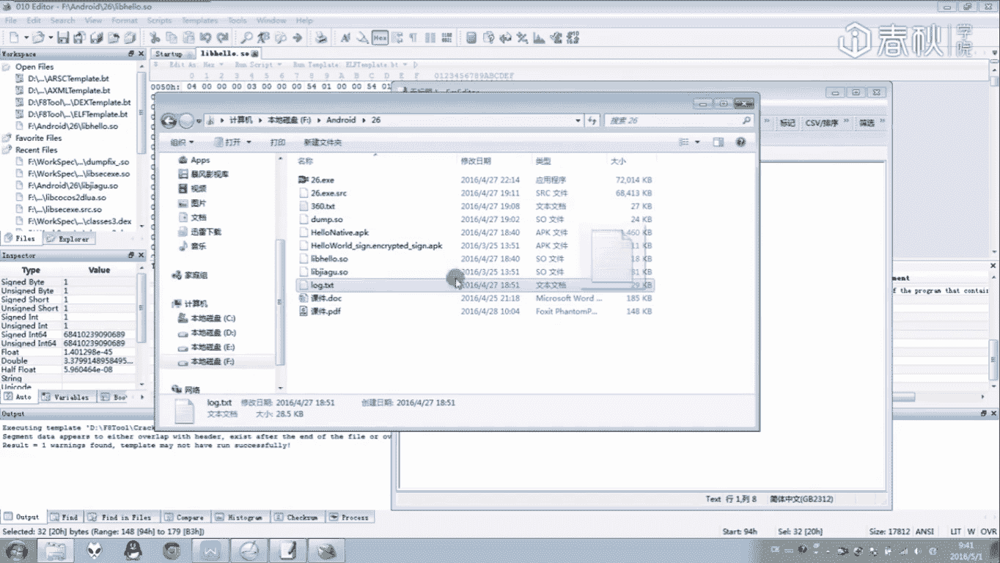

好。比如说这里，比如说这里的话，我们找到后的话。就可以就是找到那两个段，BT load的属属性的两个段。那么它呢还有一些其他属性的一些load段，比如说EXIRTX啊。

这些这些的话是不会被用到加载上面去的。那么它只会单纯寻找属性为是因为这样的两个段来进行一个加载。可以看一下它会根历它的访问态索性的PDO落段呢。哎找到以后就可以开始计算它的一个呃。

star地址这样一个下载版的star地址和有它一个结束地址。找到以后哎，就找到找找到他内内存中的地址以后，是找他在文件中的一个拼音地址。然后从文件中点map到一个内存中去。好。

这里也是一样调用一个调用一个memory map的一个属性来进行一个加载。啊，那加载完以后就开始下一个循环。那么这里就是把所有logo的个段给加载进去了。哎，那么为这这里可能有人会问啊。

为什么这里只是单纯的加载一个lo段，那么其他段信息是不是就不加载呢？唉，不是的，那么这里如果是呃进如果是呃有看过这两个lo段的信息的话就可以发现呢。这两个段其实是包含其他段的一个细节。比如说这个lo段。

它其实其实D地址是一个零，然后它大小是一个3B54，可以看一下其实大小这零的话，这已经包含了这样一个HDR，包含了这一个东西了。对吧这个段话其实是其实就是包含上几个段的一个地方的。

我么这下一个段的话也是一样，这个3138开始的话也是包含下面几个区段的一个属性的。所以这两个路段的话是比较比较特殊的。因为它实际上就把包含了整个可以加载的一个S文件的一个信息的一个地方了。

那么从下面的块也可以看到，这些加载以后的话，唉筛选的一个。下选的时候段数据都是主要主要是集中在这两个区段之间的。它也主要是主要集中在两个渠这两个渠道之间的。好，这是它比较特殊的一个地方。

你这也是这个段比较重要的一个地方吧。好，那么这里当它完成了一个mag的m的一个操作。然后加载完以后的话，最后还可以进行一个填名，就是把一些空的数据来进行一个填名啊。好。然后加载完以后的话。

还就可从历程中把我们的1个PHDR中给PDPDR数据给扫出，然后复制上去。还有就还可能会有一个校验之类的。那么这已经不重要了。那么这一步的话，这个load函数就已经完成了整1个EF文件的一个文件校验。

还有它的一个加载。还但我们也可可以可以看一下这整一个加载的过程中的话，实际上就只用到了这样一个数据的一个数据。然后它的一个筛选的一个数据是完全没有被用到的？

这也是我上一节课为什么会说到了这个筛选在一个加载的时候是完全没有要力作用的。那么一些软件话一些加密加固软件话，很喜欢把这一个段给进行一个一定的一个处理，来导致我们的一个。

不导导致我们的分析软件管正它的识别。好，那那我们加载完以后。就是这也只是单纯的完成了一个加载操作。这个时候另外的一些其他操作还没有完成。比如说它依赖的SO文件呢没有没有被打开。

然后它里面的某某些重定位也没有被完成，对吧？那么这些都需要他在下面的要下面调用小函数来完成重定位，还有说一些依赖库导导入的一些操作的。我们来看一下，然后下面的话就是获取它它的一些基本的一个属性了。对。

比如说这里是就是一个problem一个number，它有它的一个偏移地址之类的。好，那么从这样一个low level尾装走出来。那么可以看到它下面就会调调到另外一个函数啊。

就是这样一个SO for link image。那么这个框函数也是比较重要的一个函数。它就是完成我们刚才说的几个操作，对吧？呃，进行一个重定位，还有说来把其他引引引用到的SO函数也同时进行一个加载。

我们来看一下，首先它会获得到它的一个加减上的一个GD机子，然后后取到一个pro header，然后从里面从我们的pro中来便利来寻找。

来并且寻找我们当前的一个访问属性为K为一个动态的为这样一个属性的一个program head。这是对我们的1个PPDR进行了定立的。然后寻找当前属性，访问标志的这一个的一个表一个head。

那往这里映射过来，就是这一个表，一个动态这个。哎，也就对应着这样一个sigma。那么这个表为什么他要特意去找出来呢？因为这个投入信息的话里面存放的非常多的一个数据。

包括我们的一个字符串筛选的一个P音地址啊，还有它一些函数下选的一个P移地址，都会在这样一个头文件中给一个图中给指出来。

所以所以那么这里这个link话就可以优先编历到这样一个呃这样一个属性的一个program head。然后从里面再进行一些操作。假如它成功的获取到它的一个动态集的框。

然么他就会对样对这样一个动态节来进行一个。处理呢。好，那么这里就是对它动态节来进行处理的一个地方。它可以从这里一步一步取取出它当中的一个数据。好，那么在这里就是对应着这样一个呃这样一个东西啊。

动态session，然后在P什么什么地方。那么这里就是取出我们的一个动态节数据来进行一个获取。那我看一下，那么这里取出来的数据的跨度是以这样一个结构来存在的，就是一个EINF上DIN的一个结构。

这个结构比较简单，就一个tag，还有它的一个valueue只有两个。嗯，那后这个结构里面就只有两个属性了，可以看得到。好，那么这里的t的话，相当于上面的pro的一个属性，有这么多，有个hush。

还有一个str tableS table的还有这么一些属性。这些属性的话就表明了当前动态级的一个呃。一个类型是什么样子的？然后它下面下面的话就是一个它的值，或者说它指的一个偏移地址。

把这些取出的的话可以确定一下整个是我建的一个自动上筛选的一个地址地址，它有它函出筛选的这些地址，以及它重新被筛选的一些具体地址。那么正这里是就是正在这里的话可以看到它的一个初始化函数的一个地址，对吧？

这也就是给他初始化函数给复制了。然后这里这里是它的虚构函数的地址，这里是IIKR的一个地址，然后是一个FII的一个地址。在这里也可以看到它解析以后的一个数据啊，这里是go表的一个值，然后是它的一个大小。

只是6字节，然后上是loc对吧？然后这里是一个simbol table偏地址为18C的，然后是一个str table偏地址为80C。好，那么下面就是它依赖依赖到的一些函数。

比如说另没一个link熟悉的课，它还会依赖依赖到这样一些SO的一个函数。然后这里是它本身的SO名字，叫做1个LBhello。我后是一个A8IriL sizeize然后初始化阿里Lsize下面。

是DAEA等等，可以看到啊这个节节中，这个动态节中啊，就包含了这么多这么多重要的一个属性。在一个link加载中也就会用到这些属性的。

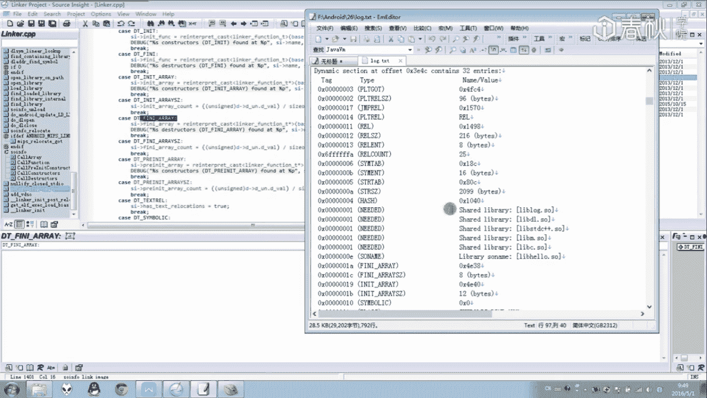

哎，那么这可能这里大家就有很会问了，假如哎假如说在这样一个节中有多个同样属平怎么办？这这比如说。

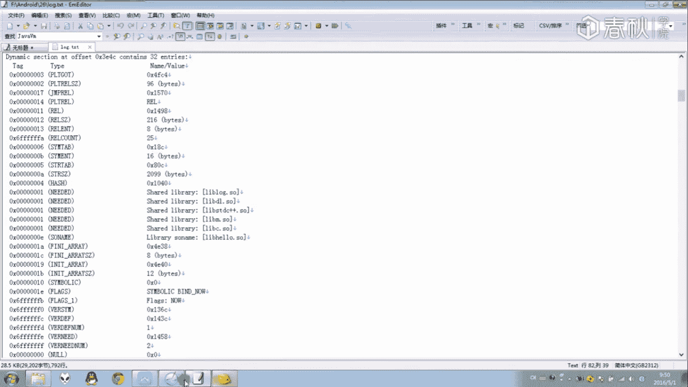

嗯，比如说啊这样1个DTIIT的1个tag标志，假如它里面有多个啊这样一个标志怎么办呢？这块多那么这里的话就会多次对这样一个初始化函数这行一个复值。那么这个时候有效只是最后一个初始化的一个函数的。

我在以前的1个SON以前某些SO加密的话，喜欢把这些tag来进行一个混淆了。那么这里呃无一例外都都是取最后的一个tag访问属性为有效的一个属性。511啊都是取最后一个了。啊。那么这里就是一个动态集了。

怎么link可的话就会根据这样一个动态集的一个属性呢，给它的1个SOE或信息的这一些东西给进行一个普值进行一个初始化。好，我们咱们慢看下去的话，那么这里就可以看到其他版本其他类型的一个截截取属性了。

加油，哎，这些都找到以后的话。然后他然后查看就会开始进行一些判断了。首先是它的标志位，它是不是可执行的一个文件，如果一会设卡，就可以对它的一些用到的用到的一些ley来进行一个加载一些定位之类的。

那么这里就是对它的一个呃依赖到的一个SO文件来进行一个fin进行一个加载了，对吧？来找到Dnet的一个数据。

就是对应着这几个一依赖的SO库来进行来调用这样一个fin的一个函数来进行一个对依赖文件的一个加载。好，那么这里加载完以后，那么它就会处理一些重定位的一个操作。那么假如套重定位的框。

就会可就会对从定位来进行一个呃操作了。那么下面这里这里都是对一些重定位数据进行一个修改的一些东西的。我么这里的话呃其实上就是把它一些指向它重新的改变一下也而以了。啊，把这些重电都改完以后，哎。

这就是重定位重定位了。然后下面就可以调用一个loadGDB flow的一个函数。那么这也就是通知GTB哎，我们的一个SO文件已经加载完成了，它就准备执行了，哎，它就可以调用到这样一个调试的一个函数了。

假如我们已经调试开始的话看。那么这里就是这样1个SO inform for里面取的一个操作了，它里面的话实际上就是完成了1个SO文件的一个呃依赖库的一个加载。还有它本身的从地面的一个改写。啊。

这些都搞定以后，那么这个SO文件就真正的的加载到内存中去了。但这里只是关光，只是刚加载完以后而已。但它实际上还没完成。呃，这里我们前面已经说过了SO文件里面话有一些初始化函数。

就像这几个比如说这一个IIE还有一个IIT的函数，这都是一些初始化构造函数的。他们会在加载的时候时后同时完成一个调来完成某一些函数的初始化。这至是某一些加SO文件的话，是需要调用到这个函数。

这些函数的话来完成一个解壳的，完们来看一下这样一个cocon函数。那么这个函数里面的话，就是完成对一个SO文件的一个重定位的一个啊构造函数的一个调码。我们去看一下。

假如哎假如它已经调用过故障函数以后的话就直接返黑。如果没有的话，就进行一步一步的的一个调。首先是对他依赖过的1个SO文件，对吧？对他判断了一个tag。假如它存在一个依赖的SO文件。

对应一个这些对就分别调用到他人自身的一个构造函数。好，把一些现文文件的构造函数调度调完以后，那么它就会调用自己的一个构造函数。看我的脸就开始掉了。首先它会调用到1个DJINIT的一个函数。

接着它就会调用到DTINITR里的一系列函数，就有这里的一系列函数了。啊，把这些都晾完以后，它就会直接的进行一个白了。那么这就这里就是1个SO文件的一个调了。把这几个函数都调用完以后。

那么这个文件就是一个呃从内存中加载过加载武汉的1个SO文件呢。那么这里它就可以从一个第度掉op中退出。那么在这里退出完以后的话，整一个S文件就已先从一个内存中给加载到每从一个文件中加加载到内存中去了。

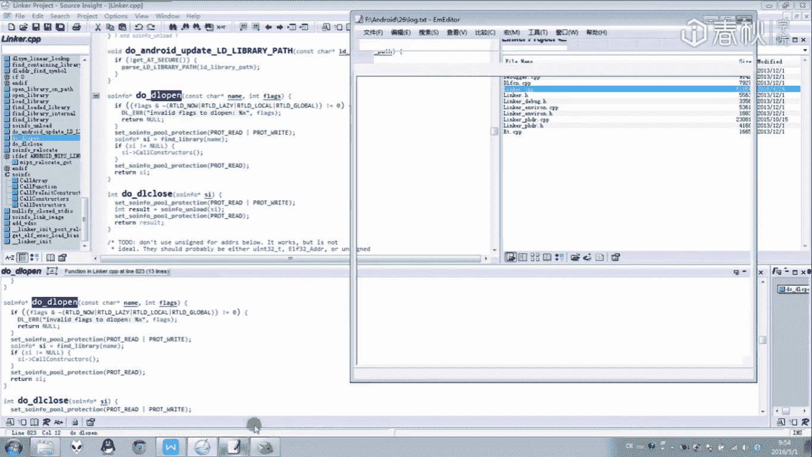

好，那么整一个文件加载的话，哎，说起来就是这么简单的几个操作，先调用一个finer来进行一个加载，然后再collcon来获取到它，来把它的一个呃初始化函数给调用回来。那么这里就是1个EF文件的一个。

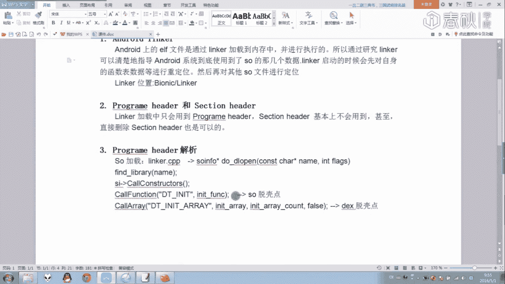

呃，操作了有兴趣的话，可以自己在下面去看一下它的一个代码。那么这里的话主要只是说几点了，它这里只是用到一个form head，然后对pro head里面的一某一些节区进行一个变译。

然后来获取到它的一些属性来完完成对整个SO信息的一个读取，然后对一些函数进行重定类的。那么里面的话是没有用到一个选 head的。是没有没有没有用到这样一个headle的。

所以这个head的话对SO加载没有完没有任何作用，可以直接算上去也没有关系的。好。🎼那么这一节课话说就大概说这么多吧啊，谢谢大家。

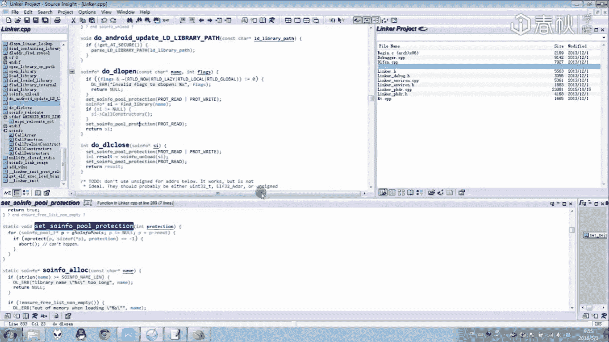

