# i春秋零基础入门Android逆向 - P36：课时11  Dalvik dex处理分析 - 老网恋教父了 - BV1sg4y1B7zB

悟空。🎼。

嗯，好的，呃大家好，我是蒋苏帮。那么今天的话我们来讲一个d，它是如何从一个内存中来加载我们的一个ds文件的。前几节课中呢已经有讲到过了一些可是可从在运行过程中来把它的一个d数据加载到它的内存中。

并以完成一个解码释放的。但是那么下面的话我们我们并没有讲到整一个系统它到底是如何去加载这个ds数据的。它当中跑哪些函数就会把内存中的d文件进行怎么样的一个转换。那么这些都还没有讲过。

那么所以在今天的话哎我们就从源码上就去对它进行一个分析。那我们来看一下整个安卓系统，它到底是怎么样去加载一个d数据的。那么从中又有哪一哪些函数比较关键，是可以作为我们的一个脱点。

或者说给我们进行一个脱的一个思路的。那么在这里我们就来打开我们的工具来导入这样一个d的一个代码。那么今天的话我们将从这样一个函数来用。

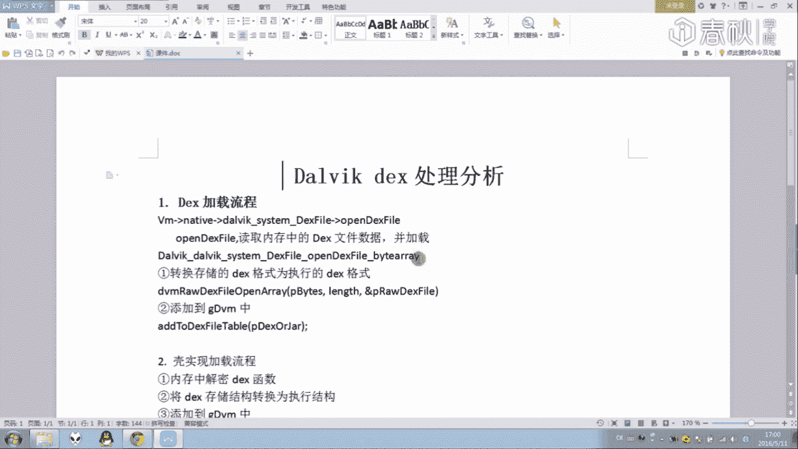

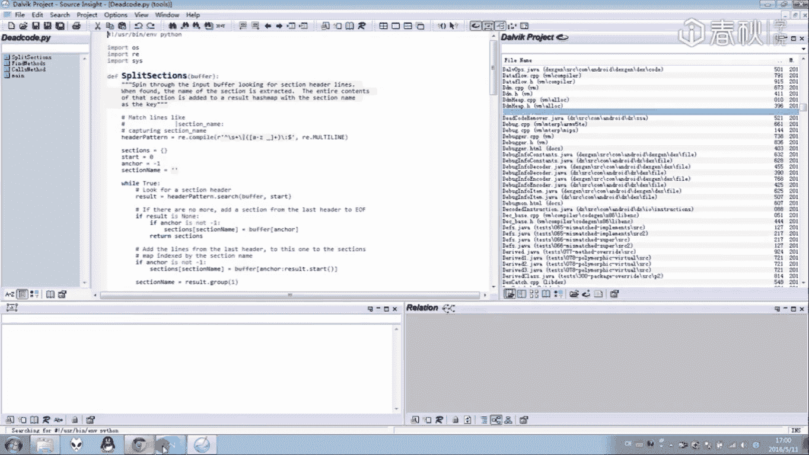

好，这是一个V we来 move一下一个let move录然后里面的一个direct system x file里面里面的一个open desk file一个函数。好，那我们就来开始分析这个函数。

来看一下它到底是如何的进行一个程序加载的。那，我们来搜索。

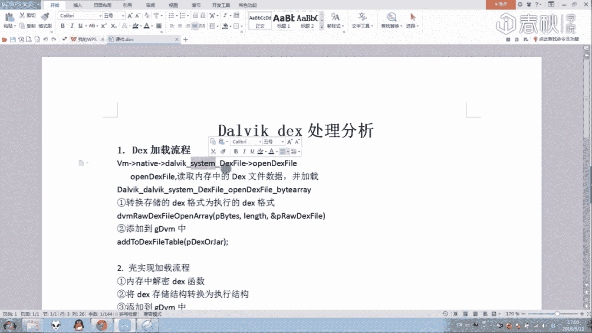

这里的话，我已经把整一个dary的一个目录给导到这样一个程序中去了。朋那么在这里已经找到了，看一下这里它这样1个DVM它好在DNXY中导出了这这么几个函数，对吧？一个open desk。

一个close desk，然后就是defin class letter。还有一些其他一个函数，那么在这里我们就找到这个函数啊，然后它描述flow芦话是一个by类型，把黑字把黑一个in的字形。好。

那么就这个函数，我们找它跳过去。好，那看一下它前面的一个呃注释。那么这个注释的话，通常就说明这个函数它是怎么用的。啊。

那么这个函数它作用的话就是从一个内存中的一个b字节中来到这样一个b字节里面的话是存储着我们当前的一个DX文件的一个数据，就是内存中的des文件数据了。

那么它将会从这样一个一组b数数据中来打开在一个DX文件，然后呢对它进行某种转换。哎，把它的结果用用的指针来转回。啊，因并且哎在这一块还可能会进行某一些额外的一个操作。比如说进行优化之类的啊。

这都是有可能的。哎，那么这里的参数它它反黑词哎都是以这样一种形式给给名了。那么下面我们就来看一下它这里这个函数是怎么样进行的。嗯，首先我们要知道它这有一个参数。

那么这个参数的话就是以一个bu形式存储的我们的一个des file的文件数据。那么这都在一个类型中去。啊，那么第一步它首先会把我们的一个参数给取出来。就放到这个地方之后，然后它的长度和它的败数据的话。

哎，都会分别的进行一个记录。那么首先哎如果判断我们传递进去的参数是不是一个有效的。如果是一个空的话，哎，就抛去一个空异层，并且把它有一个word一个值。如果不是，就从里面取出我们的一个长度，哎。

把它的长度进行一个拷贝以后呢，哎创建完拷贝以后去进行一个复制。你看就是这里的一个一个指针的一个数据的话，他们的一个指针的内容来进行一个拷贝。把所有的数据都放到这样一个批办中去。

那么这个批bu的话就是相当于被他拷贝了一次的一个单索文件数据了。那么它拷贝完要干什么了？那么拷贝完以后啊，就放到下面去来对这个里面的一个de数据来就斜着打开了，里面就调动调到这个函数。这个s open。

然后里面传递的参数的话就是一个它和它长度返回值的话通过哎返回这样一个结构体 xY结构体来进行一个返回。我们来看一下这个结构体，这个的结构体里面的话它就比较简单。这个结构体里面只有两两个呃参数。

没就两个数据。嗯，第一个就是它内存中的一个dentify的一个名称。由于这是从一个内存中加载的话，那么这一次的话肯定是一个memory的名称的出现。

那么它第二个参数的话就是我们以前已经介绍过1个DVNDX数据。那么这个数据的话它比较重要，它重要就测试在于它里面保存了原始S文件数据，还有经过解析解码后的一个呃class类型数据。

还有个me object的一个数据，都都会从这里能够找到。所以说经过这个函数跑完以后，就已经把里面所有半数据，哎这么多数据的话。

全都转成呃全都已经转成安卓中可以进行一个加载的一个dess文件的一个数据了。那么它通过这个函数获取到这么一个rodes by数据以后的话。那么接下来哎假如是没有错的话，如果有如果有错的话。

就抛制一个运行时错误，没有办法从这个内存中读取DEX文件。假如这里运行成功的话，就会继续跟跟在下面。那么在下一头下面的话，它就会创建1个DXDX这样的一个结构体。然后在这个结构体之中呢。

保存我们刚才创建出来个workDX的一个数据。哎。然后在里面。保存完以后话，就可以把我们创建出来的1个DXO状数据给添加到DXY table中去。好，那么这里这一步添加完以后的话。

那么整个程序就能够户从GDAGDN中识别出来我们的1个DEX文件数据了。那我是可以从这里面哎给添加完以后，可以从这里面给获取到我们的文件数据的。可以说哎这里最重要其持就是两个函数。

第一个的话就是从这里从文件中从一个内存中来读取d文件数据的。还有另外一个就是从把我们的1个PDX和这样一个指针的一个指向的一个DX数据的话，加载到一个全局全局的DXY table中。通过这两步骤加载。

就完成整一个文件的一个操作。啊，我们在这里我们来一步步一步看，我们来先来看一下呃上面的这个加载，就是内存中打开的这个文件，它里面到底用哪些函数，我们先过去看一下。嗯，里面也是挺简单的。

首先啊它就调用这这样一个函函数，就是DIprere desk in memory，就是从内存中来查看我们的一个ds文件数据。好，然后里面就直接把从这这个来这样一个函数的话。

就能够把这样1个DVMDN数据的话给。结构可以给初始化，就是把一个内存中的这样一个bu数据给读到这个数据里面了。如果读完并且成功以后的话，哎，就把这个值给赋译给我们的个worddes five。好。

我们跟到这个函数看一下他看这什么东西。好，那么可以看一下这个函数也也是属于比较短的一个类型。在一个安卓系统中的话，呃，特别长的函数是基本上没有的。那么它是比要就行进行一个规范。

就是一个函数都普遍都是比较短，然后比较精简，很容易点容易看的啊，我们知道这个函数的话就是prere the marry就是从一个类存中des文件去读取数据到DNDX中che。那么在里面它充量这些东西。

就像那个class up，然后里面就开始进行一个第 very，并且。通过这样一个数据哎，给初始化这两个结构体，然后再把咖说化给返回。我们再看一下这样一个比YID XY它里面还做了些什么东西。走过去。

这慢慢走过去，那么这一步的话，这个函数就比较关键了。好，里面首先是一个s and make，这里面的话就是。就是对我们一个从这个地址开始，还有说这个地址为长度的一个文件中一个内存中的文件进行一个校验。

比及说校验一下它的一个呃字检码是不是对的。他说它一个呃这样的一个什么SHAE啊，那些校验码是不是正确的。如果是正确的话，才会进行下一步。那么这个函数的话就是对它的一个特征值进行某种校验。

判断文内存中ds文件是不是正确的啊。哎，接着下面假如上面这里教验通过以后，那么接着就会以调用到这样1个DVM testify openpart函数，来把整个d数据文件给加载到DVM中去了。

那么这个函数的话在前面已经有说过，那么。某一些可以前也会用到这个函数来直接来完成内存中的整个dess文件加载了。哎，我们来看到在安卓是系统当中，它本身也调用到这个函数。

所以我们就不难不难理解为什么有一些可哎会喜欢找到这样一个函数来进行一个内存解码，也可以知道为什么我们可以从这里下一个断点，就能够把它原始的d数据给断出来，对吧？就是因为他解一个内存文件的时候。

肯定哎会用到这个函数的。当然现在的话这一这些数据的话偶尔也是能够支持营修进行一种实现的。나 제가 지금 재。好，那么从调到这个函数，把类型中的数据给全部转转换成一个DVM数据。好。

那么下面就把我们转出来的一个DVN数据呢从中来创建一个class table了。那么创建好这样一个table的话，这个是干什么？就是为了把我们的个DX文件来转成个ODEX文件来加快它的一个寻找一个速度。

那么从这里创建出来数据的话，会在我们的一个des文件末尾给添加，然后可以转成一个ODX那么下面就是完成从1个ODX文件到1个X文这样一个转换的。

首先是创建一个的个table那么在下面可以看一下它的一个实现。基本上就是根据它的一个大小来创建一个结构。然后不断的对当中个des来进行一个便。进行个便利，然后就获取当中的个数据。获取完以后。

就把要看多到的值给复制上去。那么下面的话哎这里的话就是一些不怎么重要的一个操作了。然后哎就会到这样一个函数，是不是DX方案中所有文件都已经尝试进行了加载了。

然后下面的话就可以对我们的加载以后的一个d词文件进行一种优化。还有说校验。优化含这样的话以后再说。那么这个函数经过以后的话，就可以把当中DAX文件中的某一些数据，某一些呃函数的一个内容的进行某某种改变。

哎，改完以后的话，就能够达到一个更更加快的一个效果。来注意一下这个函数跑过以后是可以改变我们原始DADX文件的一个数据了。啊，那么经过优化经过优化，还有教练以后的话，假如是成功的话。

就返回为就可以进行一个返回了。哎，对把下面的话就是进行一些其他的一个处理。嗯好，我这里就是一个整一套大致的一个ds文件加载的一个流程。嗯，大众的话还有一些细小的一个函数的话，我们再进去慢慢再看。

首先是我刚才说过这样一个对ds文件头进行一个校验，还有说一个特征化判断的一个函数，我们登过去看一下。他使用到内存的地址在这，然后长度在这。那么在这里它会首先判断我们的一个des头是不是正确的好。

那么就开始。进行判断啊。首先呃检验我们的一个设S文件的起始的48个字节是不是合法的一个数字？这是一个我们前面只看到1个S01那个一种数据格式。好我们再找一个例子。

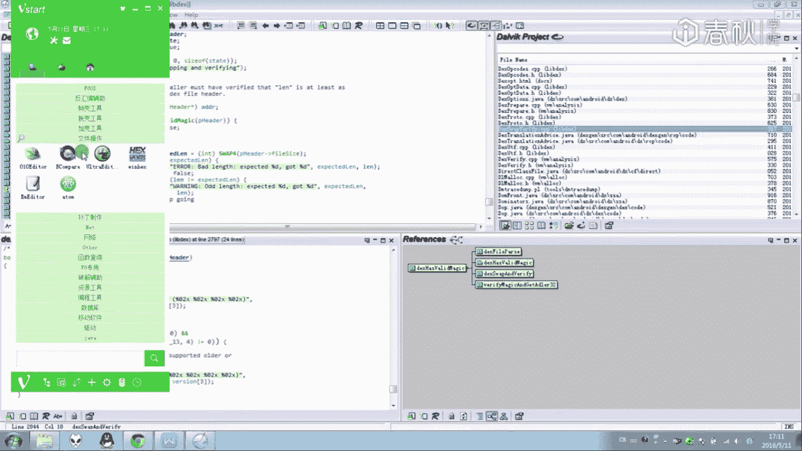

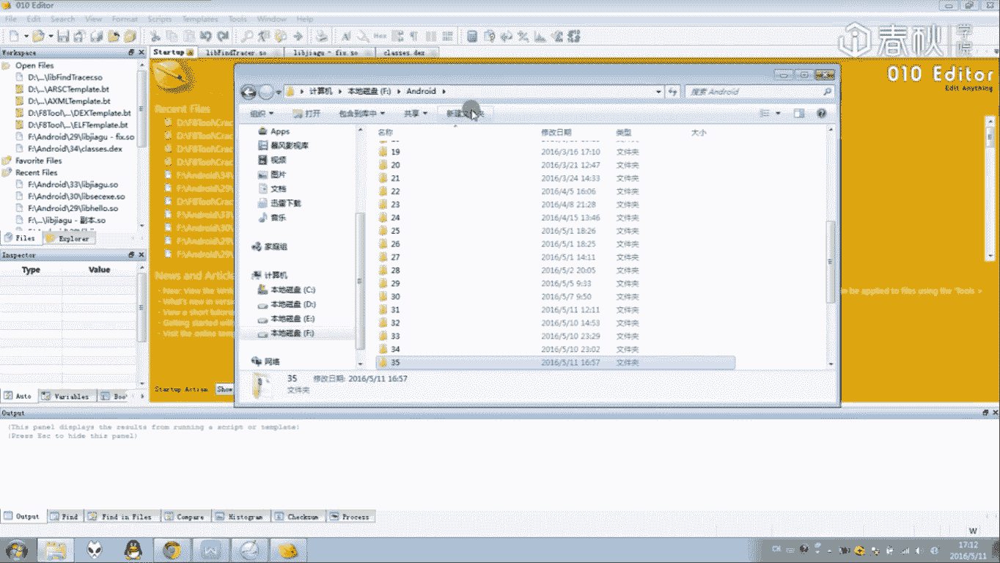

好，那么在这里它就是判断前面这几个数据是不是固定的这几个第字节DX0035这几个字节。假如是的话哎，他就说。

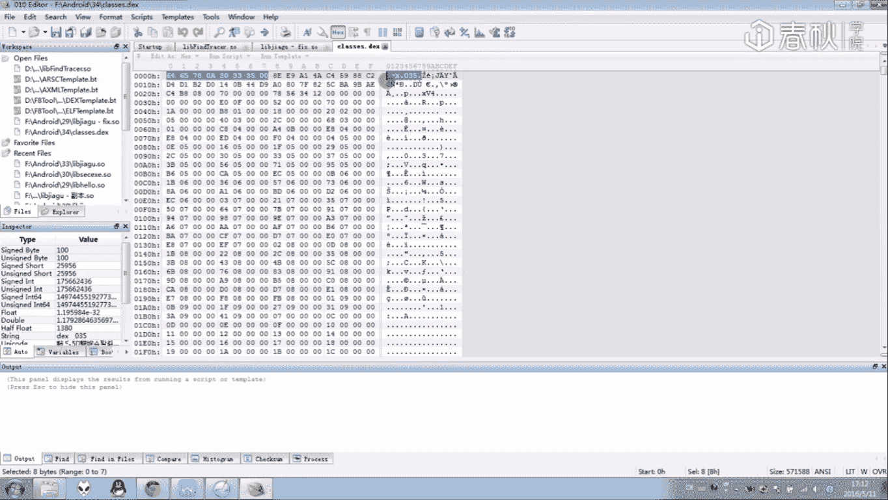

它就能够进行继续的正常下一步的一个检查。假如它前面的一个meagage number是对的话，哎，那么下面它就开始去对我们的一个呃ja码来进行一个判断。

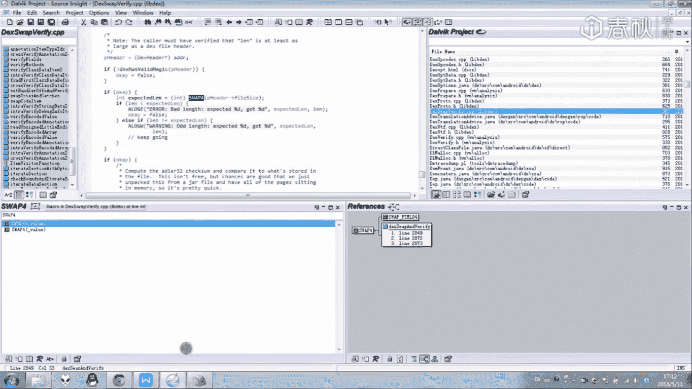

那么在前面在学一个d数据的S结构的时候，已经看过了。前面的第一层的话，它里面还会有一些trans的。它有说1个SHAE的。那么这两个的话都是对于我们整整体的一个dess文件的一个专验核。

那么下面的话它就会考尝试对我们我们的一些专验核来进行一个判断了。

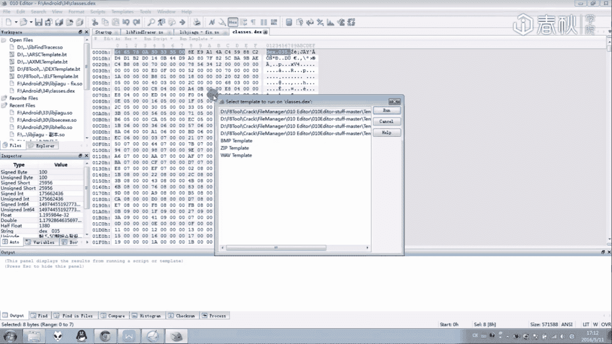

好，我在这里在这里他就会开始进行一个判断。首先是1个LD23知道的一个。呃一个交点就是这个ch送的一个number，它会以计算出来，然后进行一个判断这个ch送是不是正确的，是不是正确的。哎，然如是的话。

它就会继续下一步。那么下一步的话就是对我们那个SHAE对整个文件取1个SHAE的一个数值，然后来把它的一个数值来进行一个判断。假如说OK的话，那么它就会不断的来进行它下一步的一个操作。

还那么在这里在这里有兴趣的话，可以在这里再看一下里面在里面的一个数据也可以深入的去看一下。那么下面的一个数据的话都是一些这样的相关的一些内容。好，那么做到这里，现在通过以后的话。

就会调用到这样一个DXY openpart一个函数。这个函数的话，我们以前也曾经用来做过做一个拖合点。那后后面的话，如果要写到可的话，也很有可能会用到这个函数来进行一个内存加载的一个操作的。

我们跑到这个函数中去看一下它。

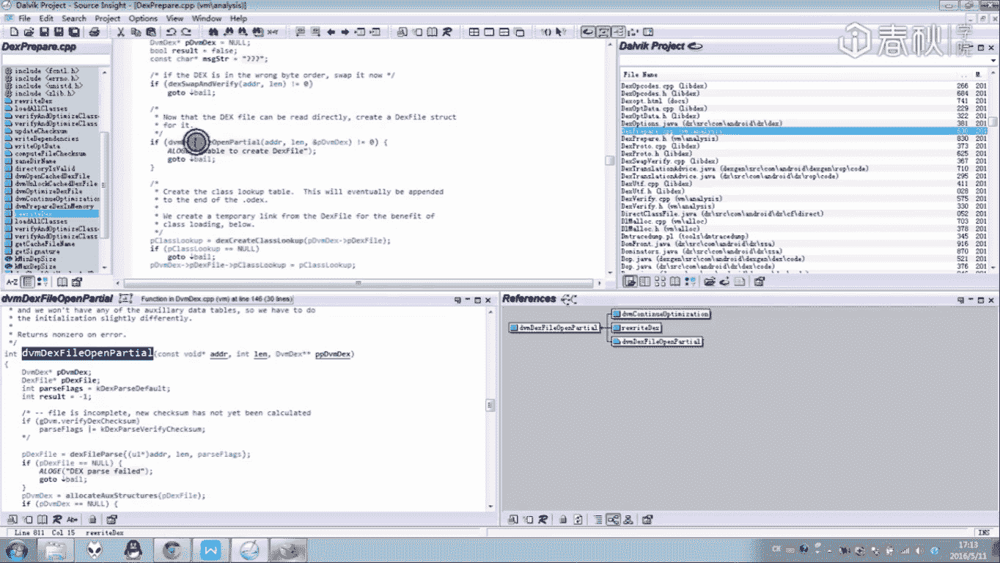

好，那么这个函数的话，它是这么一回事的，可以看到它是从一个壁纸和有它的长度全都可以转转到这样1个DVMDX的数据中去。那么首先它就会配出1个DEXY的一个结构体。

然后再把这样一个结构体给给添加到这样1个DVMDX中去了。好，我们回头来看一下它是怎么样来创建这个DXY结构体的啊，DBDX的话就这样一形是这样一种样子。里面的话只是哎经过这个函数过了以后，话。

里面再次初始化第一项的。那么下面其他几项还没有进行一个。然后就是这几个哎现在几项那在下来这里哎这里。好。然后这里好我们来看一下DEXY，就把我们的数据给读取成1个DXY的这样一个多地方。继续看一下。

它里面的话又是再一次对我们的一个头来进行一个校验。还有说它的一个量何还缺送之类的。那么这些都录取一下。读完以后的话。对，对吧对读文件头。

还有说我们根据传递过去的参数来判断是不是要算出它的1个SHAE的值进行一个校验。好，我是CSY的一个校验。那么校验完，假如这样通过的话，就直接把整一个地址给强行转换成一个geY的一个数据。

那么转成以后的话，就在这个函数里面，把desify数据转成DVNDX里面的话就进行某种程度上的解析。比如说是对我们desify数据的一个细均大小，到时pl大小，然后它的一个相应的一个偏移。

都赋予到DVNDXex中去。那么在这里跟这个函数就能看到它到底是怎么去把它的各各的结构给进行一个初始初始化了。把这些初始化搞完。对，这些初始化搞完，就能够把我我们的1个DVNDS给创建回来。好。

那么在这里就是这个函数，它怎么样去创建这样1个DVIBX的。创建以后的话，最后还可以转成1个ODX就是这样一个class多的一个table了。这样一个class cable的话。

最主要就是对我们的一个呃class数据，还有他说里面的一些函数来进行一个便利。然后根据它的哈蓄值来进行更加优化一个存放，来达到快速的便利的一个效果。那么这里的花路是图就是把它的一个哈蓄值啊，把它算出来。

以后添接到一个table中去的。就是这样一个通过这样一个table就能够达到一个快速行驶的一个地方。那么后面如果他想调换到哪个类类的话。

就直接从这样一个table中就能快速的找到我们这样一个类的一个偏移地址啊。然后deeffin的一个偏移，就能够直接去找到我们的这样一个类了。我看啦啦这样一个table的话，哎，我玩有兴趣的话。

也可以去自己尝试去用一下。う飯。那么在这里就是在一个desify的一个创建。我下面的话就是其他的一个校验。我这些都过了以后，哎，就算把整一个ds文件从内存中给加载到它的1个呃DNTX中。加到个中。

但这里的话还并没有加载到个VM上。如果还没有加载到以后的话，我们的java层还是不能够使用的。那么这个时候的话就需要在我们一个全局变量行注。

那么下面就到了这个函数那么在这里会把我们数据那么这个数据到底么样，我们来看一下一个是一个量一结构就是加文件数据那么第个说它是不是一个文件。假假如那么这这一个参数这个结构是效的。假不的。

那么就换下一个结构是效这个结构个同都可指向我当前文不的话就是是文件中直接加载那么是从个。JR的文件来进行一个加载，或者说是从1个ABK文件中进行一个加载。那么这个时候它就会用到这两个结构。

那么最后的这样一个结构话P memory，这也是非常重要的一个结构。因为有一些某一些函数，它会把原始的des文件数据，就是内存中解析以前的des文件数据。

它都会保存到这样一个meory memoryory的结构中去的。有时候用画前的一个内存结构哎都可能在这个地方。那么有一些可它在这个加载完以后就忘记了把这个段给给删掉的话，哎。

那么我们就可以直接从这个结构中来获取到原始的一个des文件数据，就是解面以后的des文件数据，这都是有可能了。所以最后的这样一个结构的话，哎，我们多点啊取出来这些个判断也是挺不错的一个做法。好。

那么这里这样的一个desPDX重要的一个结构，它就可以通过这样一个进行一个创建，然后给添加到我们的一个fi table中去。那另外注意一下的话，这1个DDX这要的话，我们跟过去看一下。那么这一个的话。

就是我们常说的的一个cookie了，就是COKRE那个临时文件。

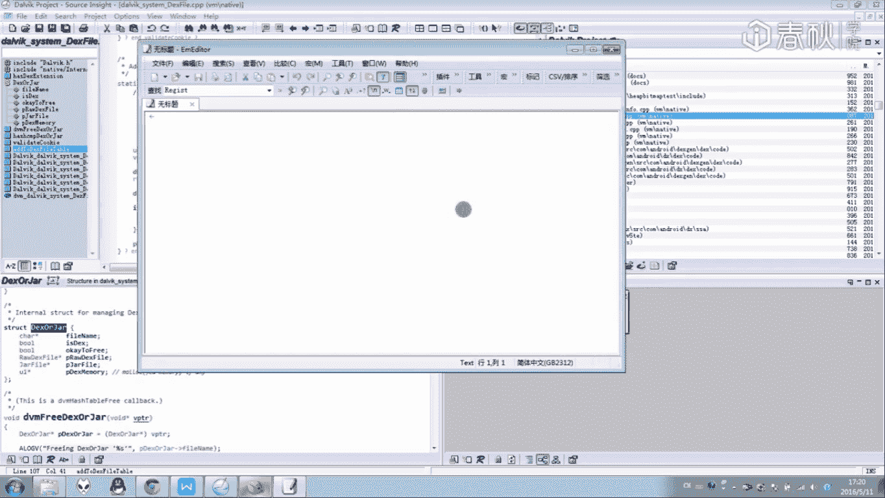

哎，那么这个cookie的话，可能大家在后面的一些to的，从网上的一些toer文件或者说to文章中经常看到这样一个数数据，但是又不了解它意思。那么跟大家说明，那么他网上的一些cook的话。

基本上都是在指这样一个结构。那么它就会以把这样一个结构给获取下来，然后给添加到一个GDVM的一个hush table中去了。那么下面他就可以对我们的这样一个table文件来进行一个添加。

首先就是进行一个由于是由于是对一个全局的一个DVM。因为一个哈水器来进行一个操作。那么在这里它首首先会进行一个加锁，然后加完以后再进行一个解锁。那么他还看到它中间的数据的框哎，就是从中给添加了。

我们跟过去看一下。呃，注意一下它的参数，它参数话是这几个。

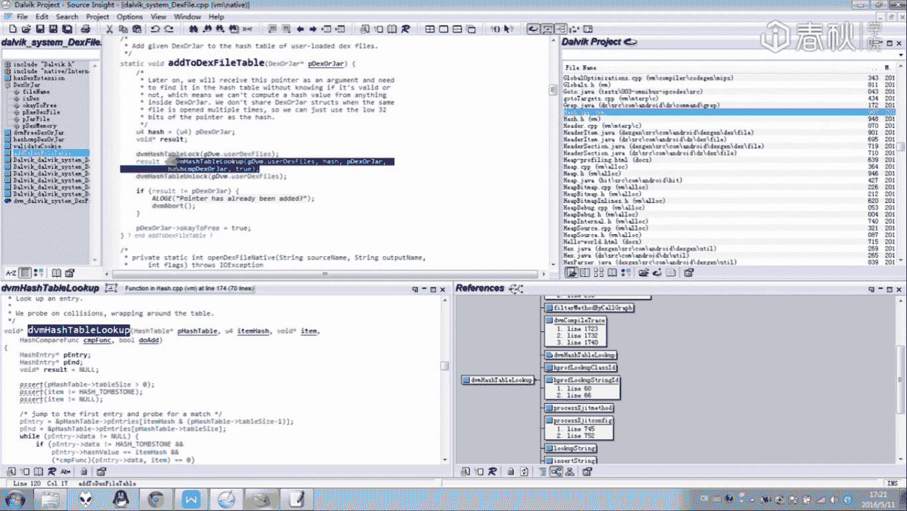

他他说的话是这几个好呃，第一个是1个GDVM的1个userDXY数据。那么呃GDVM的话就是一个全局的1个DVM变量，这是我用来存放当前程序的一个呃DVM数据的一个总体的一个提方。好。

那么在us色DXY的结构体块里面的话，去存储了哎目前为止所有经过加载的一个cookie的一个数据。也就是说我们这里目前所有加载以后的1个DXOJI的数据呢。

都可以在这样一个userDXY中给进行某种程度上的一个保存。另外一个，那么它第二个参数的话就是一个哈ush的一个参数。呃，这个hush的话就是看一下辅助的话，就是我们DXO加的一个内存中的偏移数据了。

它直接把这一个偏移数据做数据做一个哈ush时来进行一个快试行驶。然后第三个数据的话就是我们那个des插数据了。

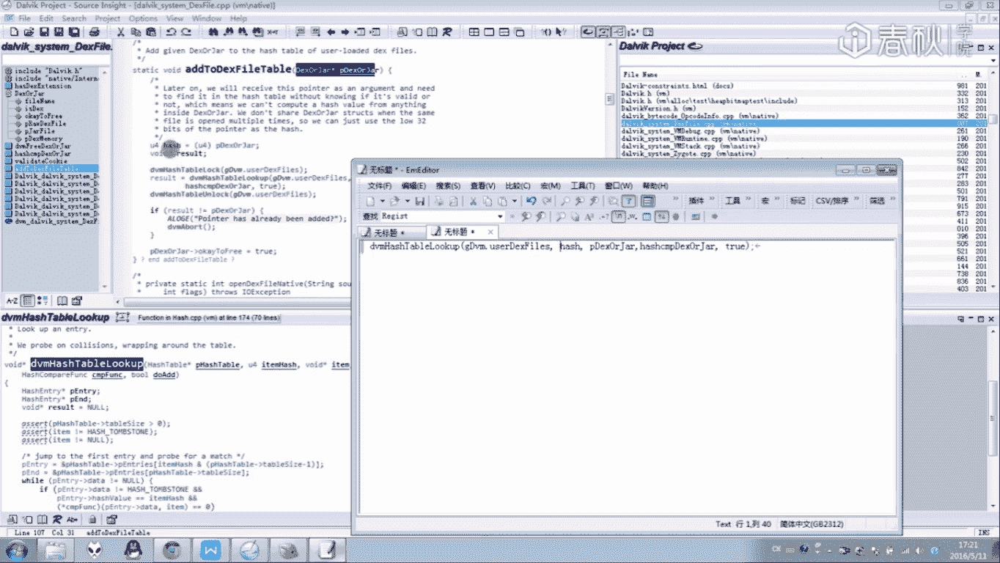

好，那么这里的话就不就是我们那个回回回调函数。嗯，那么下面我们来进入到看看一下它是怎么操作的。首先首先他会找到我们的一个哈水值，还有来尝试从我们的一个哈水 table中，也就是一个全局的一个table。

也就是这样一个GDN的一个usCDC块中呢去尝试去找到一个空位，或者说根据我们我们的一个哈水值来找到对应的一个空位来看一下能不能够找到哎相应地方，让我们去进行一个插入。

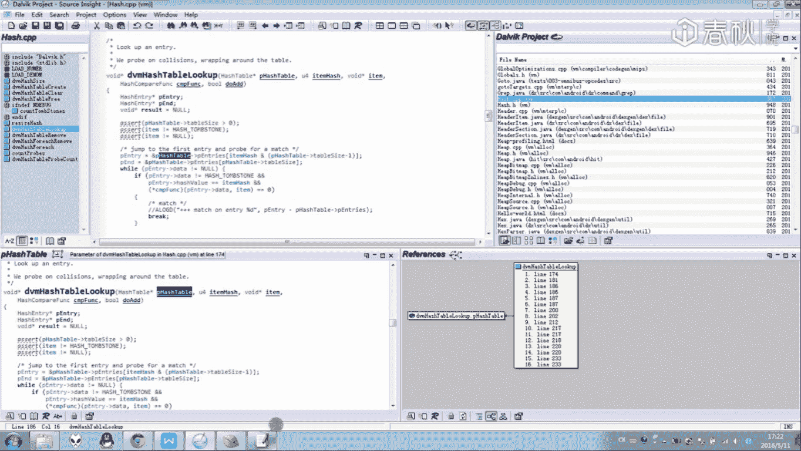

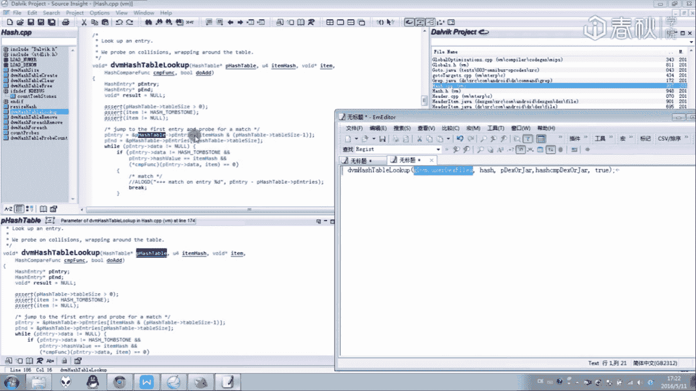

假如哎假如说他找到这样一个地方的话，那么下面的话就开始说进行一个呃地址的判断，他尝试去进行一个插入，进行一个寻找。假如找到的话呢，应该假如找到的话。上面就是把一些空的地方给掠过。然后假如他找到的话。

就开始去进行一个插入了。那么上面是寻找。那么下面假如他找到以后的话，哎就可以尝试进行一个插入。那么在这里哎它已经找到一个空的一个地方，一个hush表中一个空的地方。

可以直接来插入我们的一个desal加的一个库数据啊。哎，那么在这里就可以进行一个插入。就并且啊它面它里面已经保存了一个number，就是当前所已经保存了一个hush值呢进行一个累加。哎。

从它优会保存出一个hush数据。那么这样一个。插用完以后，哎，里面就是一些其他的一个操作了。那么这里就是一个整一个deavid中的一个DV的一个加载上的一个模式。

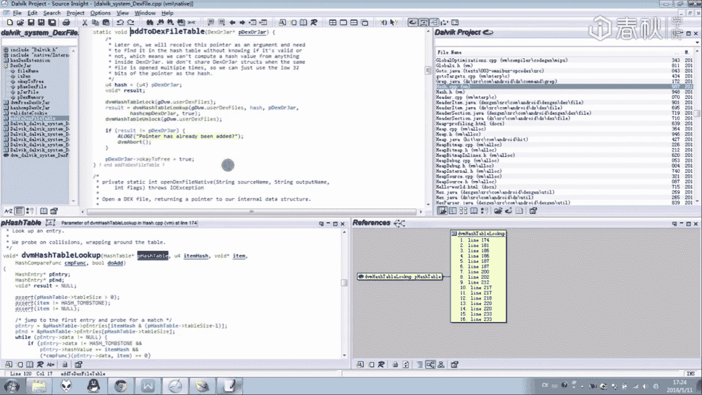

然后回头过来，我们再来看一下我们的一个可它是怎么去加载一个ds数据的。首先就是实现一个内存中对一个ds文件来进行一个解密。解密完以后，哎就像我们刚才那样。

就是刚刚刚才介绍到这样一个函数那样被从内存中呢把我们的dess文件的一个存储结构，给转换成一个解密，执行了一个结构，就是1个DVMBS中的1个DASO加数据，就像这个数据给转换成这样一个数据以后。

哎这样把这样一个c数据给添加到1个GDN中。

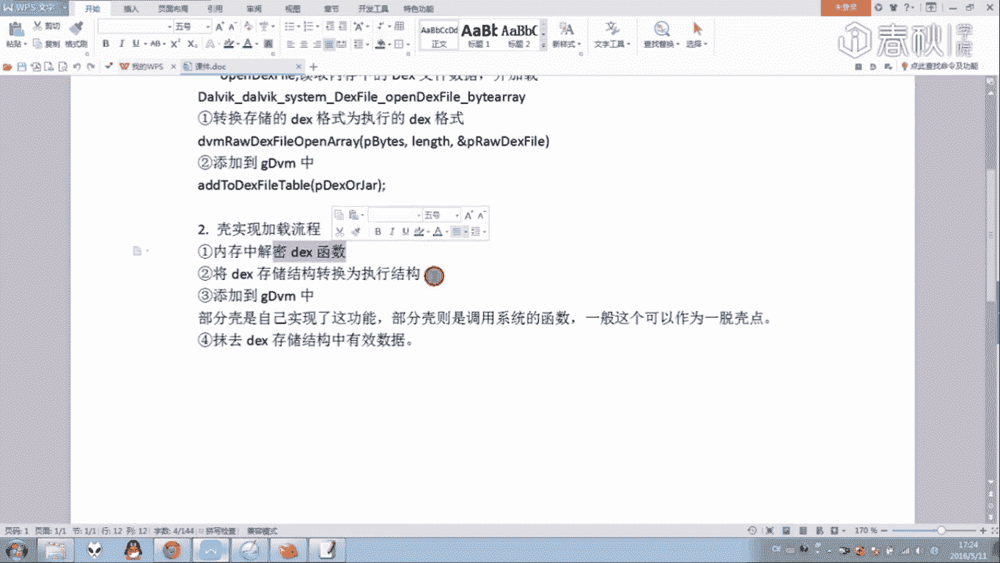

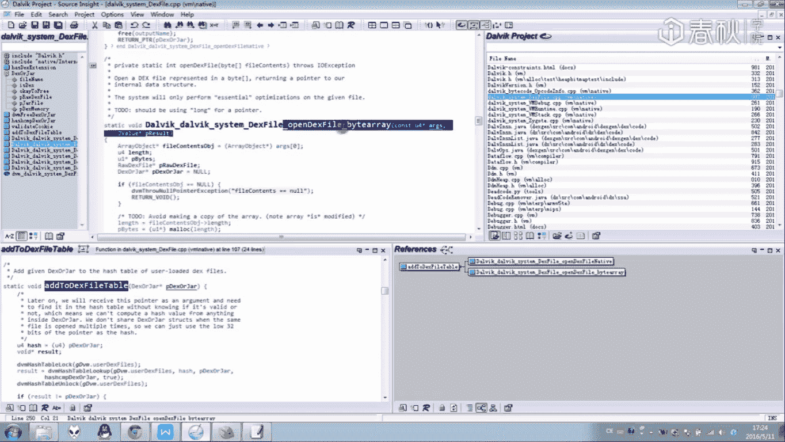

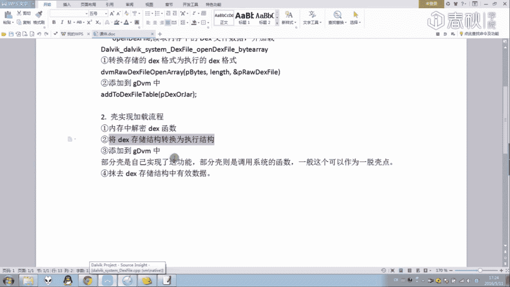

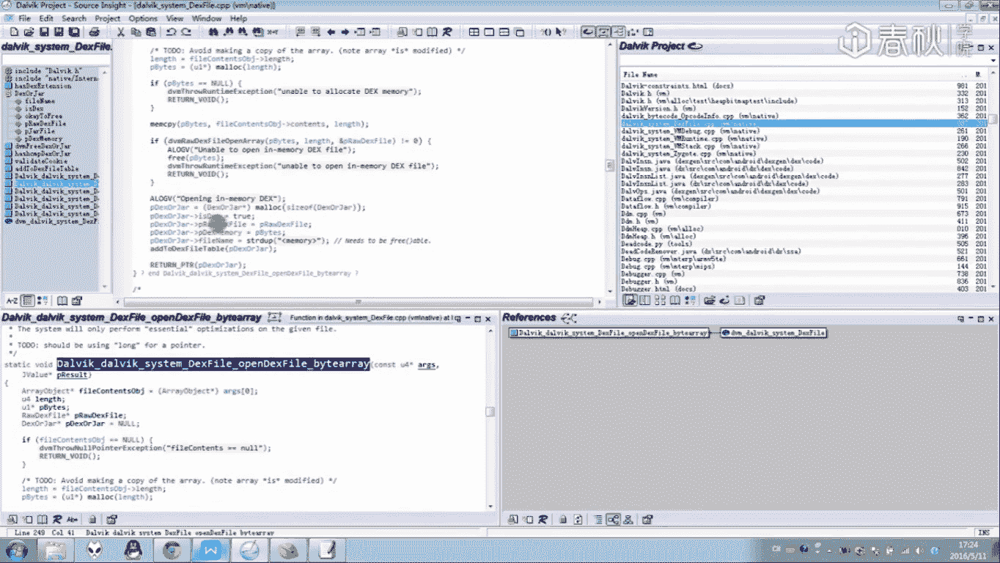

那么有一些壳的话，哎可自己去进行一个这样的一个。添加还有另外一些口的话，就可以调用到系统的函数。如果当它调用到系统的函数的时候，就可以用相应的一个函数来做一个突合点了。那么还有另外一些口的话。

比如说像其他3360之类的，它就可以把一个对于正常加载完以后的带数据，它就可以把一个存储中的一个带数据给抹去，当中的有效数据来防止我们一个内存档的一个效果。好，那么这里就是一个可的一个加养流程。

那么我们看完哎我们来看完这样一个呃des文件加载的分析以后的话，不知道大家有没有想到什么好的一个突破方法啊。那么这里我就来介绍一个啊，在这里我们已经获取到这样一个结构了。

就是我们都知道它运行的时候都需要把我们加载以后数据给添加到呃这样一个哈表中，就是一个GDI中的userBXY中，它多配添加到这样一个哈表中去了。

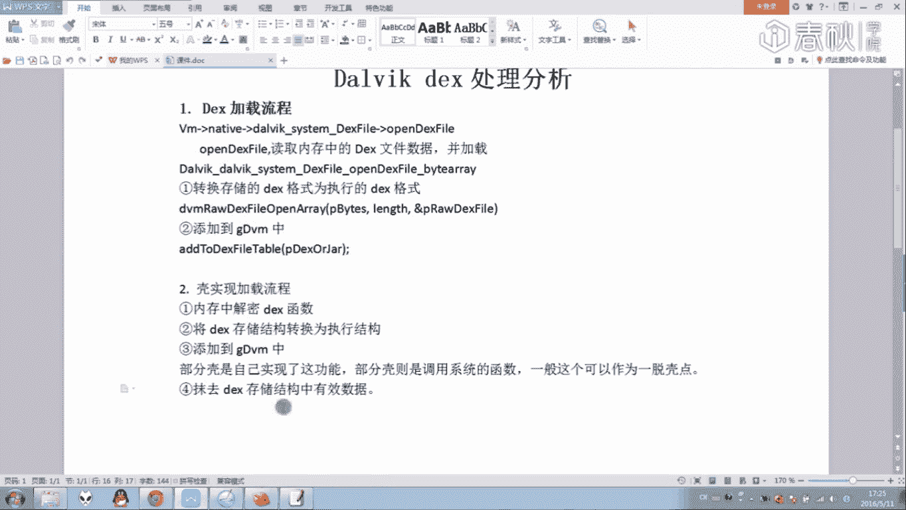

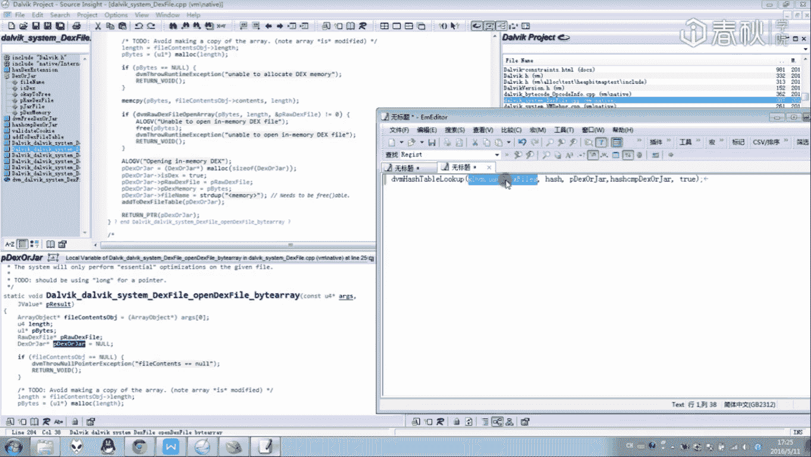

我们找到下一个哈序表。好，那么这是呃这是一个s of this flash loaded by custom class loader。

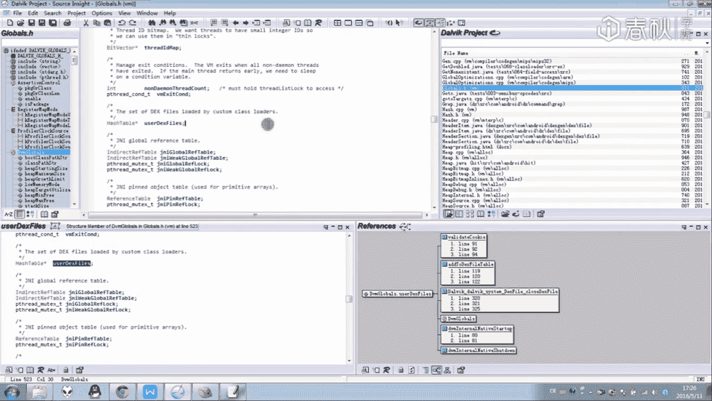

好，他都添加这样一个表中去。那么自然我们就能够通过变定这样一个表来获取到当前所有已经加载过的一个ds文件。哎，那么既然获取到以后，是不是就能够作为一个通用的一个do德？哎。

那么这就是某种脱壳机的一个思路了，这是脱口机的中的一个思路之一，那么我们。具体的一个拓耳机编辑的话呢，就可以放到下一节课来讲。那么这里的话就只是来提一下。那么大家大家有兴趣的话。

可以自行去找到这样一个结构来去尝试一下调试，能看能不能够给找到哎当中有用的一个代码。好，那么这节课的话就到此为止，谢谢大家。

🎼。🎼嗯。

🎼。

