# i春秋零基础入门Android逆向 - P43：课时4  Android 加壳保护工具编写3 - 老网恋教父了 - BV1sg4y1B7zB

🎼。

嗯，好的呃，大家好，这里是0日安全论坛的安卓零基础向文培训教程。我是讲8。那么今天的话就是这一套教程的一个最后一课。那么这最后一节课的话，我就不打算来讲什么具体的内容。

只是来把对我们这一套课程的来完成一个总结。那么首先的话就是对一个加可的一个总结了。那么我们加密工具，呃，现在补充一下我们加密工具，就是写下一个可。

那么这一个可的话前面两节课中已经呃分别给出了一个java层上一个加可，还有一个JI上一个。那么在java层上啊是没有什么地方啊，没有什么方法，可以完成一个加密的。

实际上可以让我们来完成真正的保护自己函数的话，只能在JI层上进行要跑。那么在JI上去做一个手脚来保护我们的一个程序。

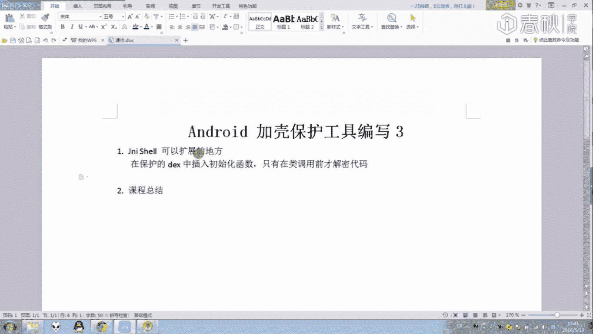

哦，那么在这里其实我这个口的话呃给出来这一个简单的一个价格示例，它也是啊能够进行一个加密保加密的一个扩展的。呃，这里的话就来说一下一个扩展的一个思路。首先就是在一个classbook替换以后替换以后。

其实我们是在可以在这里完成进一步的一个d文件的一个操作了。就像一个阿里的那一个壳一样。阿里阿里的那一个，它实际上就是把一个原始文件，它说它的一个class data这个数据的话，其实是分离起来的。

那么在这里也可以像它一样啊在界面的时候把这两个数据给分离起来。然后在这里替换完以后，在这原始的。针这原始的一个文件来进行一个操作，来把它一个class的数据给还原培训啊。

这是一个class的一个部分一个函数的一个抽取。现在非常多的一个可话也是喜欢像这样搞搞起来的。还有另外一种的话就是像百度那种就是对于一个DC文件，它只在函数调用的时候才解密代码。

然后函数调用完以后在进行一个加密培训。那么具体呃具体要怎么样完成一个保护的话，可能还是需要大家自己去进行一个编写。因为在像这种东西还像在家自己写，然后把自己的一个一些想法给录进去比较好。

那么对于这个呃可来说啊，它本身也没有反调式的一个东西，那么大家也可以自己把一个反调式代码给插进去来增加一个立项的一个难度。当这个代码的话，实际上是没有经过一个机型的一个适配的。

所以可能在某一些版本的或者说某一些手机上是不不怎么。

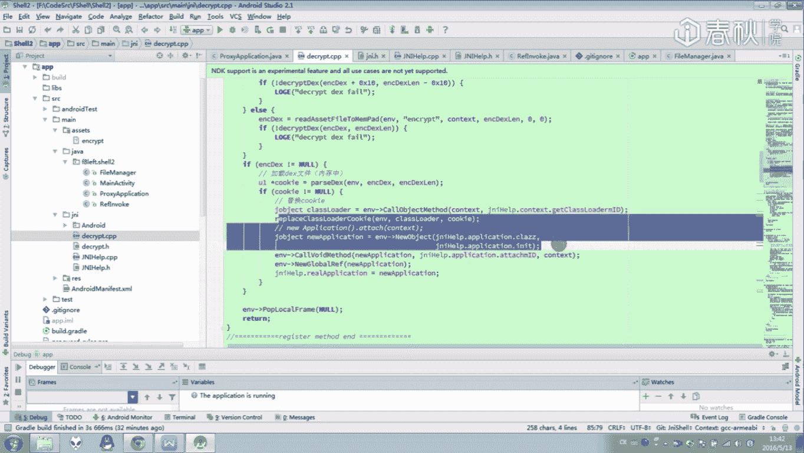

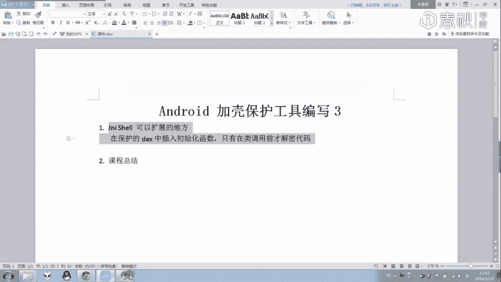

稳定啊，这都是非常有可能的。

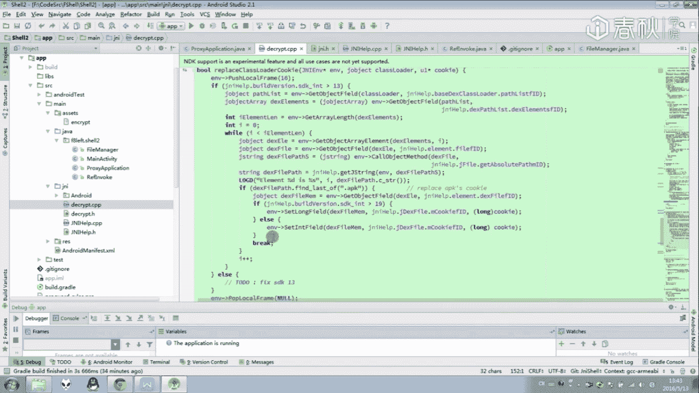

所以啊其实上这是一个还没有完成的一个半成品，只能说是一个半成品啊，只能够让大家去进行某一些参考。可以看一下它的整个思路是可以这么一个实现的对吧？内存价TX框，然后然后把它转成一个第一手机结构。

然后最后把它替换成一个咖收的一个啊，那么上面就是我对前面ja格保护的一个补充。那么下面的话呃就来对我们的这套课程来进行一个总结吧。那么其实的话这套课程总共有这么多呃。

总共这么多数据里面的话都是有另一个目录来跟大家来慢慢的一个讲的。呃，首先的话第一个阶段的话就是一个java层上的一个讲解。

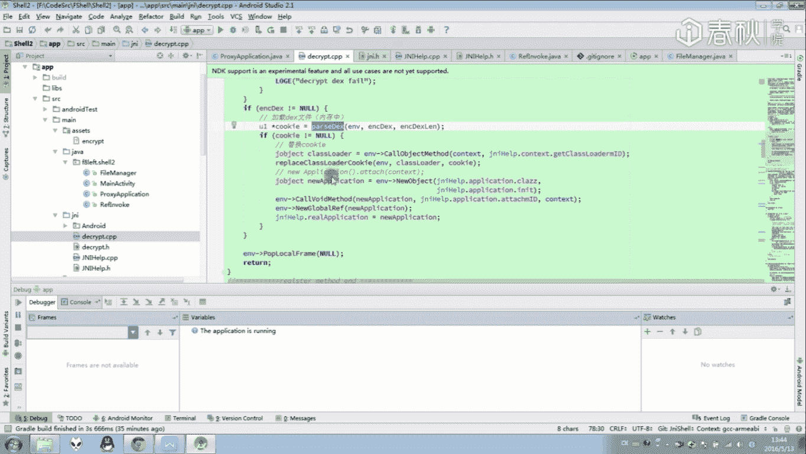

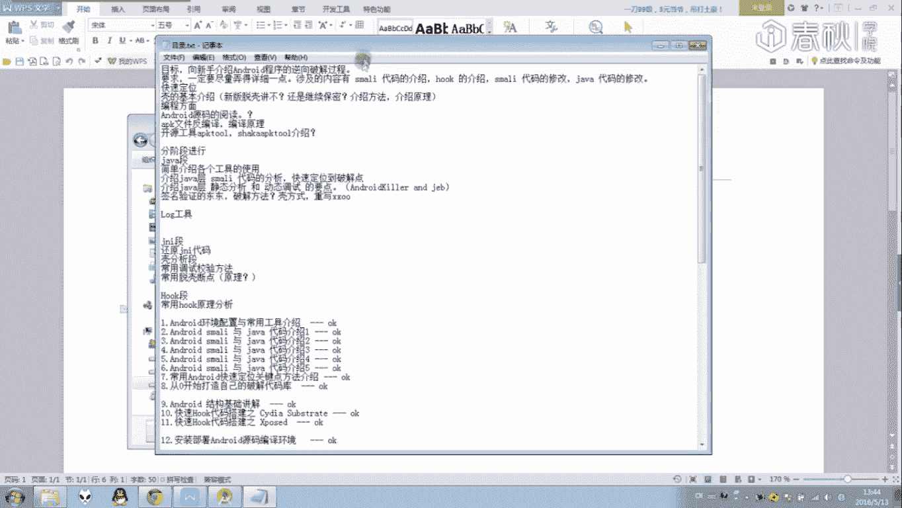

那么ja乘上里面会讲介绍到一个什蚂蚁代码，还有ja乘上的一个代码，它是怎么样去进行一个分析。然后我们又可以怎么样去进行一个调试，或者说什么样的一个工具，可以让我们快速的去定位一个代码了。

那么这里面会又涉及到不少的一个小技巧啊，然后另外一个就是一个ho的代码。那ho的话就是一个类似一个函数钩子。那么可以利用一些函数钩子来辅助我们去快速的完成一个分析。那么在这里的话最主要是介绍两个版本。

一个是Spo，还有一个是CYDIA注意一下这两个版本的话，它们都是稳定于1个4。04。0到5。0之间。所以比较高版本的系统的话，哎，可能这样1个CYDIA就不能运行了。然后Xpo的刷起来哎。

目前也能支持5。0以上。那么在一个expo刷起来的话是变得非常麻烦。所以所以我建议还是使用1个4。几的一个系统比较好。呃，并且1个DVAM上的一个ho的话是比较成熟的。

所以建议大家还是用这样一个系统来进行安跑。那么这是一个呃CRDIAho的一个方一个方法。还是说一个还是钩子代码。但这些ho的话，我是建议仅仅是作为自己的一个呃分析，或者说辅助或者是所用到的一个工具而已。

如果是要发布出去的话，其实你们要注意到一个手机版本的一个适配其实是非常麻烦的一件事情。好，那么这是呃这是java层上的一个内容。那么下面的话从1到第十5课的话，就是和安卓的源码相关的一个地方了。

那这里面的话将会介绍到我们应该如何去编辑一个源码，或者说是怎么样去阅读一个代码，里面的话还是涉及到一个GNI的一个编程地方。我们来看一下在这节课程的话也介绍过我们应该如何去编写一个GI程序。哎。

我们编写这个程序的话，就知道我们的一个GNI层，就是一个从java方法，到一个let层的一个方法中，哎，他们两个之间是有一个具有关系的。第一课就是一个静态注册。我们可以通过一个静态注册关系。

哎来直接来快速的完成一个java层到ja层在GNI层代码的一个打通。这一个静态注册的话，就是前面加一个类名，然后后面一个函数名来做一个结束的。还有另外一个就是一个动态注册。

动态注册的话就是这样一个rejust的函数，把一个类名，还有说函数名以及函数描述符全都写上去来完成这样一个动态注册动态注册好处就是它的一个隐蔽性比较高。那么现在的一些注意比较进行一个加密的一个加布的话。

这些DII的数据都是通过这样一个rejust来进行一个动态注册的，那么我通过这一课的一个GI编程的话啊就已经知道了啊。那么这样一个O文件，它是存在一个静态注册还有动态注册之分的。

然后我们分析的时候也可以留意一下为什么有时候一些let的函数我们不能够直接收到函数名。那是因为它完成了进行了一个动态注册。那么经过这样一个动态注册的话，就能够把它原始的一个函数名给掉。哎。

这一些都是可以通过这样一个编写，通过编写这样一个区约代码给知道的那前面的一个安卓代码的一个编译。然后呃刷机的话这个。这个从网上都能够找到相关教程。

所以在这里的话其实只是一个简单的简简单单的一个介绍来跟大家来说一下，我们应该怎么样去完成一个缩机。那，至于这其实这几个这三节课代码是比较重要的。有时候我们想要定性定制于一个属于自己的一个安卓系统的时候。

那么这个时候就需要啊去改一个安卓源码。那么再一个安卓源码，我们应该怎么改，用什么工具去改一呀，去比较快，然后去怎么去看怎么去阅读啊，比较快，这都可以从这个工具中来找到哎相应的一个方法。

当中的话还涉及到一个内核的一个修改哎的一个编译的。嗯，好，那么这里就是这三节课。那么下面从第16到第二十课的话，经初步的去讲解了1个AIM的一个汇编代码。那么这样一个汇编代码。

它唉从我们怎么样从ID去载入去分析。然后里面的1个AIM的一个学习的方法的话，都有认微的介绍过。然后里面我们要怎么去看AIM代码，其实我们要学一个AIM除了去真真实的一个一个一个一个呃代码。

每一个指令去看，然后去学以外呢？还有另外一个就是通过一个动态调试，来看一下它到底对于我们我们的继存器是怎么样影响，然后造成哪一些呃修改，我们是可以通过这样一个方法来快速的进行一个学习的。

那么至于这样1个AIM的汇编，实际上与超包汇编的话，当中是有非常多的一个共通之处的。两者这些可以进行一个参考。其实这就是这样一个的话并不是一个特别难的内容，特别是在。有一个F5以后的话。

可以达到一个快速的查阅它的一个原始的。查到它原始的一个功能的一个方法。哎，这都是在一个十6到20节课中哎，有这么一个汇编代码的东西。那么从21到1个24节课的话。

将是和我们的一个加密加壳相关的一个代码了。虽然这里写的是一个代码动态自修改，但是在这里的话，大家可以发现这些代码自修改的内容，它实际上也是适用于我们的一个加密加壳软件呢。

就像阿里的那节课那样将DVN拓定义的那节课那样，它就使用到一个代码修改的一个方法。哎，后面可以看到它在patch我们的一个class data数据，还有说的原始DX数据的时候。

它在两连通这两个文件的时候呢，就用到它的代码自修改。通过修改它的一个class的一个class data的一个偏移来完成它的代码的一个修复。哎，这是这一些其实都是关联起来的。

那么前面啊我们要完成这一个代码修改的话啊，那么同时也就需要我们去对1个DX文件有足够多的熟悉，才知道我们应该怎么样去对它进行一个解析，然后去知道应该修改哪一块的一个数据。好。

那么这里就是1个21到3224节课的一个内容。那么接下来就是一个DVM脱壳第一节第一节课，这节课的话就是初步的去跟大家来演示了一下对于一个可呃对一个加固后软件，我们应该怎么样去跟踪，进行一个分析。

然后从内存中去动出来它原始的一个代码。然后问然后里面的话，又应该怎么样去进行一个修复这一些这一些全部全部哎都会在这个文件中，这些可中来进行了一个介绍。这是一个托壳上的一个基础。哎，这是托壳第课。

然后然后到26到30节课的话，那这节课的话就变到。这一节课的话就不不继去讲1个DN就转到1个ELF文件中的一个结构。我们来这里就说到它怎么样它是怎么样去可以对它完成一个变形，然后进行一个保护。

接着我们就应该去去对它怎么进行修复。特别是当它这壳以后，我们又应该去对它怎么样去进行一个分析。哎，这样1个ELF文件的话，是我们研究可的一个重点。每一个可它进行一个保护进行释放的时候。

肯定是需要跑到1个ELF层呢。然后然后对这1个ELF层，我们应该怎么样进行一个入手，从哪些地方或者说是从一个安卓源码哪一个地方可以给我们进行一个提示。对吧这些的话都会在在一个SO层来完成一个分析。嗯。

那么接下来第31到32课的话，则是对一些比较常规的一个调试方法，还有它过检测方法，以及我们应该怎能去修改一个安卓的源码话，做一个简单的一个讲解。那么其实啊这个的话最主要目的就跟大家来说一下啊。

因为我们如果在我们平时在调试一个程序的时候，遇到一个新的一个检测调试方法，我们应该去怎么样去对它进行一个过掉。呃，我们最。最为常用的思路靠就是通过定制自自己的一个安卓系统来。

把他的这些检测都全部给过掉而已。当然我在课程中所讲到的一些方法，其实都是一些最最最为基本的。等等等比较难的话，哎，可能需要大家继续去。后面这条小可，所以如果遇到的话，就可以尝试来进行一个过掉。

那么就自行根据它的一个调色原理来把它给简查给白块掉了。那这部分的话可能就需要对一个linux上内核比较熟悉才能知道，才能知道怎么去搞还行。好，那么这就是一个反调试的一个理由。

那么第33到34节课的话就来详细的来。讲了如何去拖360的这样一个壳。其实这个33的壳快已经讲了节课了，从1个SO修复到它的一个反调试以及它的一个检测掉检测调试的一个地方。

那么这些的话都是有讲讲过一下的。那么其实可以看到我们在分析一个加可的一个文件的时候，特别是分析它经过加可的一个SO的时候，我们应该怎么分析哎还是还都是一样的。都是一样的。哎，我们要分析SO文件。哎。

如果它有混淆，就把它修复，然后和淆给修复掉。然后它需要解可，需要解DEX数据。哎，我们就一步一步的去进行跟踪来看一下它是怎么从什么地方把它的文件数据给解出来。那么就找到一个突壳点，哎。

直接从内存中把一个文件数据给出来。那么这么这样就行了。啊，这么这一个就是一个呃DV脱壳的节课。那么这几节课哎大概是从1个25到1个34节课呢，近十课的一个时间的话，其实都是与一个脱壳哎是相关的。

虽然中途跑了一个跑了一会到一个EI数据中。其实这几个都是一个脱壳，一个混淆，哎是相关的。那么到从35到38节课的话，就开始去寻找一个比较通用的方法去来辅助我们去进行一个脱壳。

看能不能找到一个比较好的方法去做成一个脱壳机。哎，那么就能减少我们对可进行分析的一个时间。那么这个这里面的话给了大家一个脱壳脚本这个脚本里面涉及到的内容。其实就是对一个内存中的DEX的一个寻找。

然后对一个ds文件来进行一个重建。那么通过这一个文件一个内存中的一个d子文件重建呢来达到脱壳的一个效果。那么下面的话还会有1个ODX到DEX数据的一个修复。

其实这个修复的话不一定要用这样一个脚本这样来修，只是我是只是下面这个脚本是为了和上面这个进行配套呃弄出来的一个东西。其实它要修复的话，方法还是挺多的。嗯，那么这是一个呃脚本就是用脚本来突壳的节课。

那么这节课的话呃可能操作上比较傻瓜，就是程序跑起来，然后按DA挂接上去，直接进行一个呃内存，直接跑脚本进行一个内存道就可以了。这节课操作可能比较傻瓜，但是我还是希望大家去好好读一下这个脚本。呃。

里面还涉及到不少关于一个系统方面的一个内容的。那么就是35到38是用脚本的要拓克。然后那么讲到可，然后吐可这么节课的话，总共有这么12节课来跟大家说了一下。

然后接着从39到42节课就是讲一下我们如何应该如何的去写一个属于自己的课。然后。🎼把它给弄出来，然后对自己的一个程序进行一个加密。当然这里的话就只提供了一个最基本的最为常规的一个加口的一个思路。

具体更加一些更加一些猥琐的一个代码的话，可能要己去手动去进行一个添加。那么这里的话就涉及到一个java上的加，还有说是一个JI层上的一个加。这两种两种加它的难度不一样。

但是呢但是可以看一下它们大致思路都是一样的。还是是一样优先对加密以后但文件进行还原。然后把还原后的一个数据呢给添加到一个cooking上面去。那么上面的一个添到后一个cing的话。

哎又是在有一个可以通过一个to脚本进行一个脱壳的一个地方其实他们呢话这些东西都是一个共通的啊，那么说一下那么to与to相关的话，大概就讲了进。就这么多节课，其实语课相关的数学的课一次讲挺多了。

讲后二次来一节课。但是呢实际上在这里我跟大家讲一讲一下，前面我讲了这么多东西，说这试是二节课，其实这里面讲的一些小技巧，或者说是方法，甚至是脚本啊之类的一个代码，这些东西其实都是一些起因技巧。

其实这时的话他真正作用的话是不怎么没是不大的。比如说后面呢它后面那些可改了一下，发现脚本跑不起来了。哎，那么脚本是不是就失效了。其实啊我们这事实哪节课所讲的东西呢都是属于一个直因技巧是没有什么用的东西。

真正有用的地方应该是一个真正有用的一些东西，一些东地方的话，其实都可以通过读安卓的一个源码来给出一个答案。比如说脱壳，比如说脱壳这几节课这脚本脱壳的节课，我们应该怎么样去做一个脱壳机。

我们怎么样去定位它一个内存但词代码，哎，这这一项答案是不是整一个安卓系统它都它给出来，对不对？我们看。

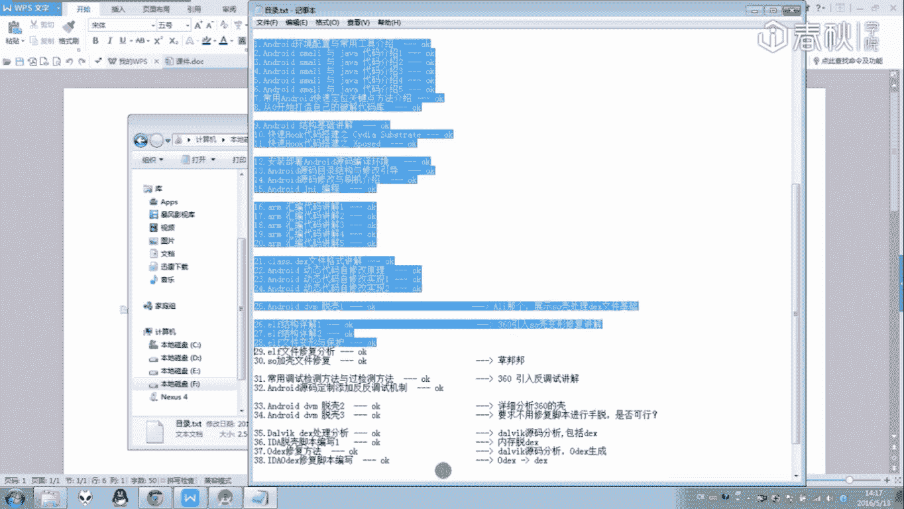

我们通过查看一个安卓源码，哎，就能够发现一些蛛丝马迹，哎，就可以找到一个hush table。哎，突然间发现原来加驶层需要寻找这么一个hush table来寻找它的一个deskclass load。

然后我们再通过这样一个class load呢唉，又能够获取到它原始的一个class数据，然后再进行一个修复。这些安卓系统可以卓系统本身，它的源码本身都告诉我们答案了。

然后再看一下下面ja克哎ja口我们应该怎么样去完成一个原始的一个DS的替换，怎么样去完成一个。怎样去完成一个application替替换，也是一样。

可以通过阅读安卓它本身用来加载DS文件数据的一个那块的东西，那就能够找到它的一个价载的原理了哎。所以说我们前面视里所介绍的一些方法的话，它所有所有所有都可以通过所有的安卓源码来完成的。

那么在这里唉我知道这么多同学，他们来这个课程的话，最主要目的就是想来学习这样一个脱壳的一个方法。然后也非常多同学的话认为这么一个脱口哎它是非常重要的。但是这么多节课看起来是不是发现其实这个脱口本身啊。

这个脱加库本身的话，并不是我们想象中的那么难。它要调试，哎，就过来它调试，它要检测过来它要检测，它内存解密TS文件，那我们这从内存中给把它的文件给动不出来。其实这些都不是那么难，都可以哎。

都可以通过查看一个安卓代码来找到它的一个入手点。所以其实啊其实啊其实除非这些技术本身的话，最重要的是并不是有么并不是怎么样去找它一个to口，然后对每一个呃每一个加固都分别找出一个脱口方法。

最重要的应该是输入整一个安卓源码。我吗然后我们就能够猜测出那些加固会在安卓的一个系统中哪一个函数入手，或者说它的结构哪一步入手来搞，来把它的一个代码给隐藏起来，然后进行一个动态的一个加载。

这一些的话都可以。通过读这个代码来进行一个完成。所以后面的话你会发现，其实后面呢这里有有一节课实战，那么肯定前面就会有一节课，或者说是节课实际上前面肯定是会有一节课的是来讲解这一个安卓源码。呃。

会讲到哪一部分适合这块数据相关的。我像后面后面大家家在自己哎这些课程结束以后，会面大家自己学习的时候的话，也能够多点的去阅读一下整一个安卓代码。当发现有哪一块不懂，或者说哪一个地方要坑的话，哎。

多点的去域看一下代码。实际上这种加密还有说解密，我们与一个加密者的一个对抗之中呢，其实啊最为根本的一个对抗，并不是我们的会员能力的对抗，或者说我们调试能力对抗。最根本的就是看我们对安卓系统源码。

哪一个比较熟悉。哎，哪一个知道的可以用来做一个调试，做加密的点比较多。哎，那么哪一个就赢了。所以最为核心的话应该是这一块，并且作为核。那么所以在这里的话。🎼虽然哎后面的这几节课。

后面的这四节课可能哎什么用脚本拖这脱脱壳这一课，可能你们会看的比较开心。然后前面讲到这些UF文件结构啊，或者说给到DEX文件结构的时候，就觉得非常无聊，想直接跳。但其实啊这一项讲到这一种结构的时候。

其才是更加重要的一个地方。我们只有把结构都弄懂了。哎，我们才知道怎么样去对它进行一个修复。我们把DES结构给弄懂了。那么我们就知道我应该从内存中怎么样去找出来，然后把它给动出来。对对？像这一节课的话。

哎，这节课只是给了你们大家一个脚本，然后给了大家一个思路。后面这思路如果用不了。哎，那么这这节课就废了。但是假如我们熟悉这一个安卓整个系统的源码足够熟悉的话，哎，那么我们就能够找到另外一种方法。

另外一条思路，写出另外一种脚本，哎，然后还是一样，把它代码把可给拖出来。那么这一个就是一个按卓源码，哎，我们看一下多么重要的一节课，那一些常规的一些呃调试的一个技能的话，也是不能够给落下了。啊。

那么我们再来对比一下啊。

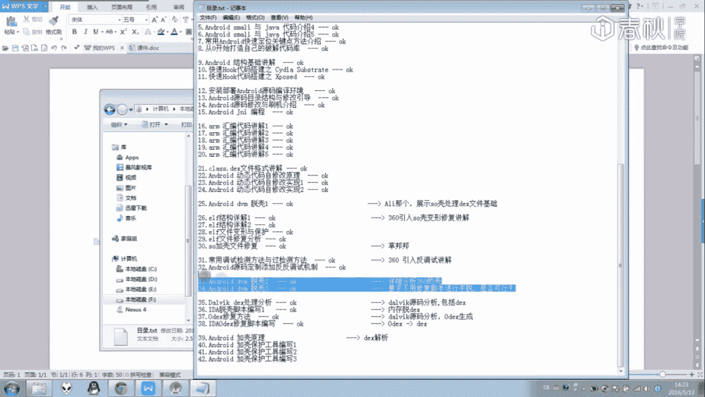

嗯。这个课程。那么在课程开始以后，那么今历的时间比较长，我记得是大概是去年的12月开始，然后到今年的1个6月份结束。那么中间的话经过了半年，整一个安卓系统的话，它发生了非常非常非常多的一个变化。

所以整个课程目录刚开始刚开始列目录的时候的话，也没有想到那么多，哎，所以呢这里面会发现有一些地方是没有那么多有一些课程它本身的话是不怎么现实的。就像这的1个DVM虚拟机。

那么现在基本上都换成1个AD虚拟机了。那么现在在讲这个就已经没有了。所以这些课程的话会有一些变动，那么最终的话就变成这个样子。我我认为这个修改的话是非常有必要的。哎，是非常重要的。

是为了更紧当新时代的一个角度。

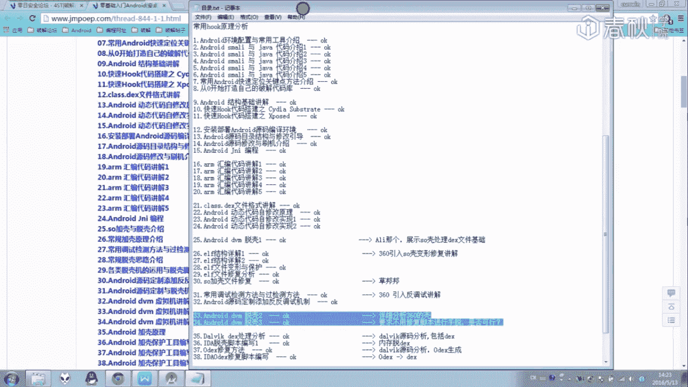

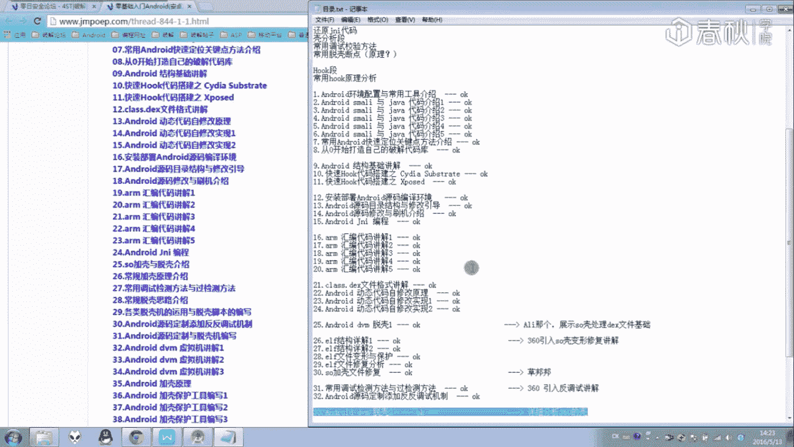

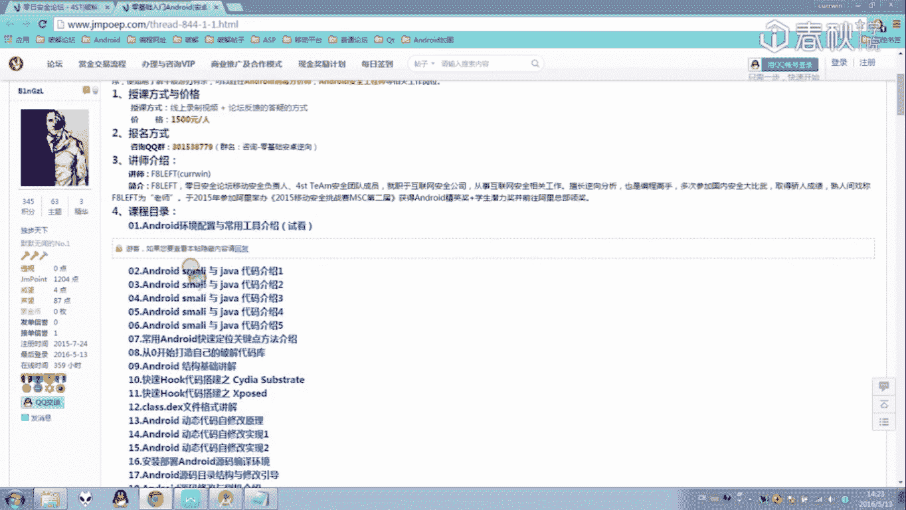

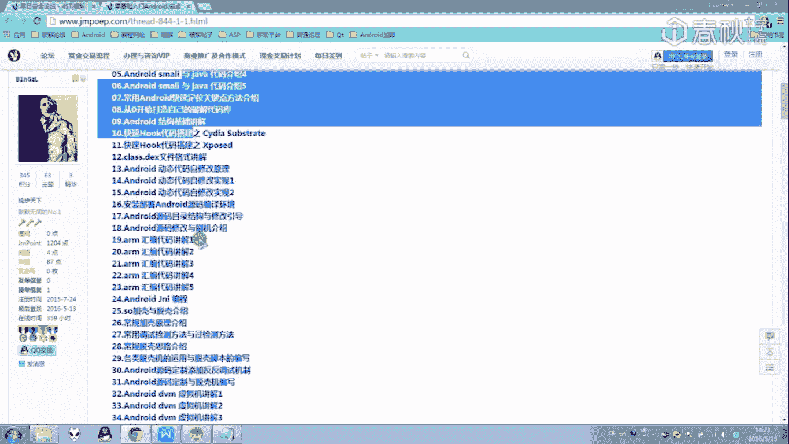

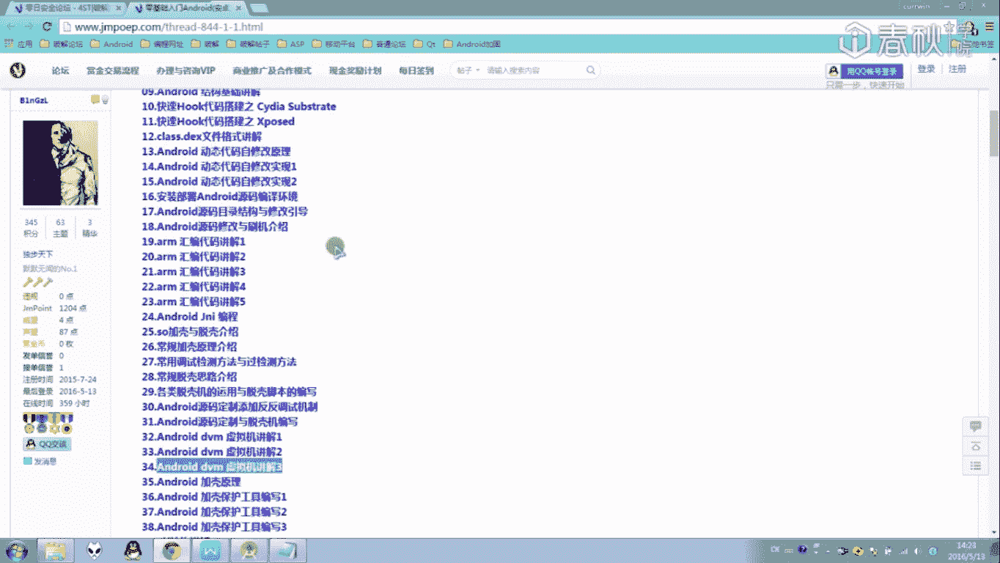

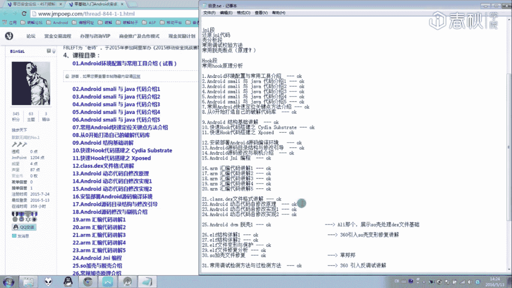

那么这里哎在以上的话就是对前面的这些课程的一个总结了。那么大家说话多话少都已经学要半年了，从一个嗯成一个说好的一个零基础，然后里面的话又讲到一个smarile代码，还有加尔代码。

甚至连一个on代码也个也可以讲了，就是这些最为基本的东西。

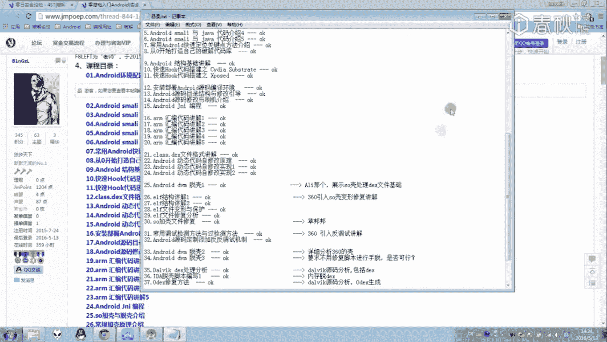

各位经都已经提到过了。那么立剑这半年时间那么，我希望大家的话呃我希望效果的话就是不要仅仅去停留在这样一个编译的一个东西。这样一个情况。或者说这样这么一个只限于不要只仅仅停留在我们的一个立项调试情况。

那么一些编程上的一个工也不要落下。比如说一个java的一个代码编译的一个编写，还有一个C加代码来编写。我相信这6个月过程中的话，抽点时间出来学习的话，对于我们的一个立项话是有非常非常大的帮助的。

以前我在学习window立下时候，前辈已经跟我们已经跟我说过了，其实下所有的立项哎，所有的一上手就想就想要来破解软件是非常非常不科学的一个东西的。我们应该做的事情应该就是应该把一个基础给打好。

我们这里对一个卓来说，就应该把一个层的编程基础。层的一个C加编程的基础给打好，把。要把这些东西给打好以后，我们才能看得懂它的汇编代码在干什么。比如说我们我们的C加加来完成一个自家操作。

那么对应在一个汇编代码的话，就是取消内存一块数据加一，然后把这一块数据给存当前内存中去。那么这C加加代码就对应在汇编的话是这么一回事。那么从java代码它也对应在这样一个smar代码中。

他们也是有这么一个对应的关系的，我们只有把这样一个编码哎，编程的一个能力给搞住了，然后把系统中的某些调用它是怎么调有一下函数的话，它能够什么操作什么做用。把这些都给送熟悉了。懂了。

那么我们在立项过程中的话，就能够信息很多了。那最后算一下这样一个加可，另一个加的话，基本上我就仅仅给了大家代码，然后略微的讲了一下整个工具的一个运行的一个过程。

那么具体的一个实现并没有一步一步的跟大家来码代码。那么其实码代码这一块的话，我是不怎么想讲的。因为讲了。没用。看得懂能能看懂的同学直接看代码就能够懂哦。不懂的同学的话，还是需要去补充一下一个知识。

那么安卓加可这一块虽然只有4克，但实际上把这个加密，把一个加固给学习完以后，这些好以后的话，对解密对解口的话是大有帮助的。你只要自己想欢一个口，哎。

那么就可以知道整一个系统中有哪一些点是可以让我们进行一个入手的。那么在加壳过程中又有哪一些地方是需要注意的，以后从中的话可又可以获到一些函数，或者说是招一些可以用了脱口函数。

甚至是说程序解渴解码的一个思路。哎，都可以从这样一个加口的过程中，从自己解渴的过程中呢，去把这些东西给获取下来的。所以这个夹壳的话也是比较重要的。没有。啊，那么以上以上的话就是对呃这一套教程的一些总结。

然后里面的话。这个目录的块给大家来大家如果以后啊，想要回顾一下教程的话，可以看一下这些这几个目录。里面的话就有可以快速的找到我们对应的一个地方了。

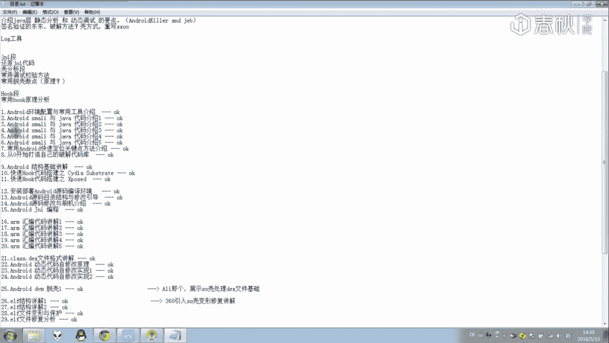

干。🎼那么这里呃到今天的话，呃，这一课为止的话，这一套教程就正式结束了。不知道大家能够能不能够从中学到一些东西。如果能够学得到的话，那么我认为这一个教程的话已经是万是一个成功了。啊。

那么在那么这一套教程就正式到此为止。谢谢大家。

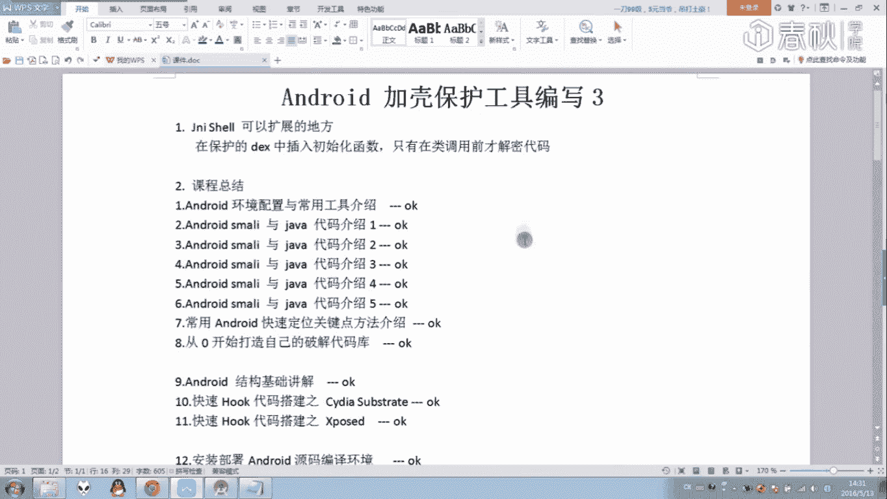