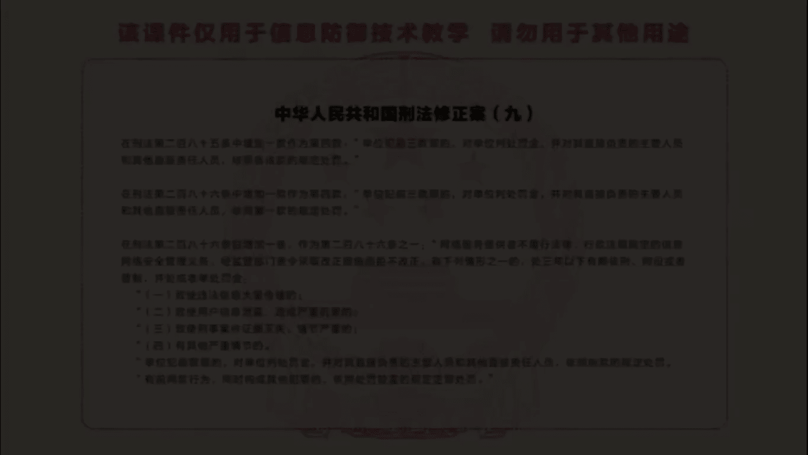
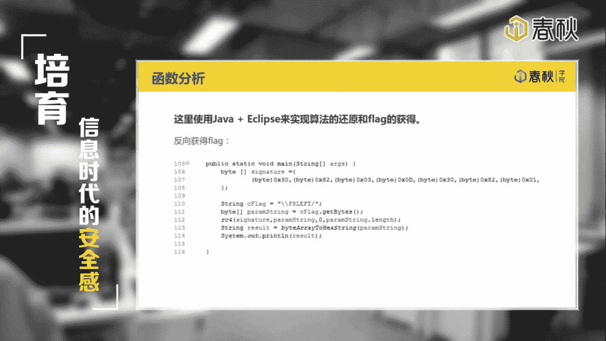

# i春秋零基础入门Android逆向 - P12：课时1 阶段考核 - 老网恋教父了 - BV1sg4y1B7zB

。🎼。🎼嗯。Yeah。🎼大家好，本次课程，我们对零基础入门安卓逆向的阶段考核部分进行思路讲解。阶段考核的题目CM一出的比较简单，都是些基本的知识点，函数量不大，就算是初次接触，相信也不难了解当中的原理。

本次考察的知识点，一，APK反调试2、签名校验。3、函数分析。如果能够独自一人做出这个APK题目，那么恭喜你证明你前一阶段的学习效果是非常不错的。当然，如果没有弄出来也没关系，看下面的分析就能发现。

其实并不难。首先是第一部分APK反调是。APP中对模拟器与调试状态进行了简单的检测。位于APP这个类中，如果发现异常，直接结束进程。当然，要绕过也是比较简单的。直接把smily中调用Q process。

函数的代码删除即可，也可以在men activity on create函数其始插入wait for debu函数，启动程序再进行attach，这样也可以绕过当中的检测部分。看到这里。

可能有同学会感到疑惑。在课程中，我们讲到程序的入口点在带laun属性的activity中。那么为什么会找到这个APP类呢？答案在maniffa中。如果是没有指定入口点的进程。

那么初始化流程是applicationactivity。在这个应用中指定了自己写的进程入口点，在maniffa中定义。那么程序的初始化流程应该是。E，P， main activity。

我们都知道一个进程内可以有多个窗体，但是自身的进程实力只能有一个。因此，程序在初始化的时候，会先初始化进程，然后再初始化窗口。所以这里便出现了进程入口点与窗口入口点之分。下面进入第二个部分，签名校验。

程序整个check流程与签名校验关系密切。程序校验的调用都在check类中。于是我们重点关注check函数的流程。该函数调用RC4函数对输入的flag进行了操作，然后与C flagag这个定值进行比较。

而RC4的第一个参数是调用真key函数的返回值。显然，重点都放在了真 key部分。我们来看真 key的实现。

通过系统的package manager获得程序的package info中的signatures信息。这里也就是所谓的签名信息了。并把该信息取出返回。这个签名信息将直接作为RC4的密钥，参与到解密中。

因此，假如前面对原始的APK包进行了修改并重新签名的话，这里其实的签名值也就变了。当然，RRC4的结果也不同了，最终得到flag自然是错误的。直接进行调试是不可行的。因为在APP中有调试校验。

在这里简单的提供几种方法来绕过签名校验。一、hoookK进函数。通过叉po或CD对JK函数进行hoook，并且直接获取其返回值。该值便可直接用于RC4的解密中取。

2、ho is debugger connected函数。直接返回fors。也可以阻止对调试的检测。3、编写程序获取签名。这里调用的get package info函数，也可以获取其他应用的签名数据。

因此，可以简单的编写一个应用来获取这个CME的签名信息。4、直接获取签名信息。如果对APK比较熟悉的话。那么应该知道，APK的签名信息都放在m in文件夹中。

signatures中的值便是该文件夹下shirt点RSA当中的数据。范围如图中选中的部分，0X038到0X337。关于shirt点RSA的格式。大家可以自行查一下资料。签名校验常用于应用的保护之中。

如果发现应用反变译重打包后，程序运行异常，可以考虑程序中带有签名校验。签名教研的关键词为signature certificateificate等。我们进入第三部分函数分析。

用JEB或android killer进行反编译，基本上可以获得非常接近源码的java代码了。用java或安卓来还原算法，找到flag。这里是他的伪代码。当然，就算不认得RC4函数。

只要看懂其中变换的核心，只是一个亦或变换的话，也能猜出这是一个对称加密的函数。加减密共有一套算法，所以直接拷贝反编译的java代码，把签名信息的字节逐个拿出来，最多再补充一些类型转换的语法就可以使用了。

使用android studio或ecclipse写程序就可以获得flag。这里使用java和ecclipse来实现算法的还原和flag的获得。首先，模拟程序的check。

字符串input就是我们在程序的输入框中输入的字符串。不要忘记man activity中对输入的长度还有限制。经过RRC4处理后，result就是我们的字符串。算法中会和F8left这个字符串进行比较。

对称的我们把F8left字符串输入，然后做对应的处理result字符串就是最后获得的flag了。

🎼嗯。