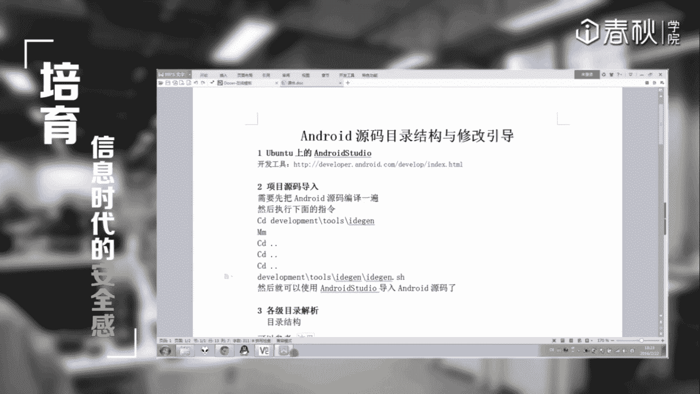
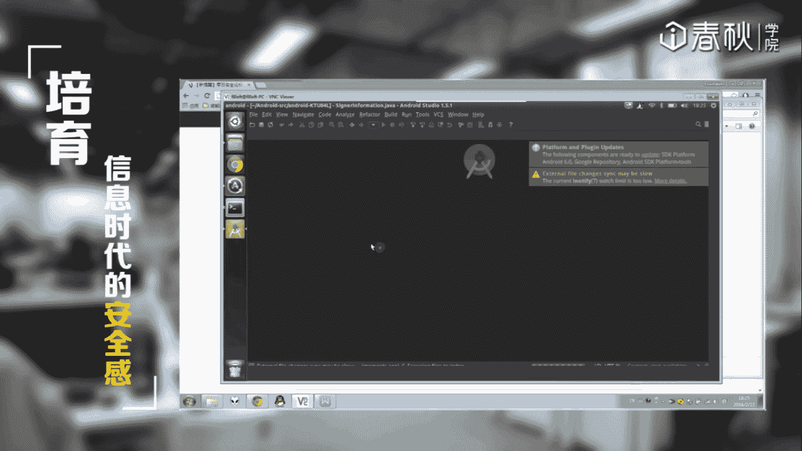
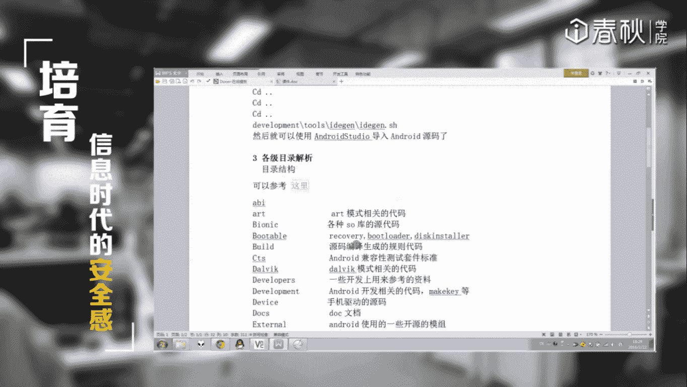
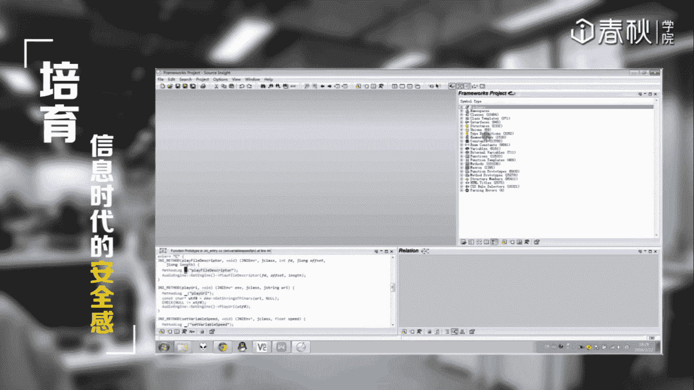
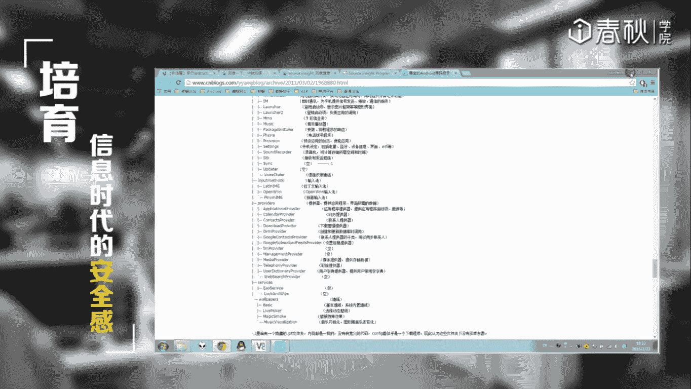

# i春秋零基础入门Android逆向 - P14：课时2 Android源码目录结构与修改引导 📂

在本节课中，我们将学习如何高效地查看和阅读庞大的Android源代码。Android源码包含数万个文件，我们将借助工具来快速定位和阅读代码，并了解其基本的目录结构。

## 工具介绍：Android Studio 🛠️

上一节我们提到了Android源码的庞大，本节中我们来看看如何借助工具来阅读它。首先介绍的是官方开发工具Android Studio。

Android Studio是一个通用的跨平台开发软件，在Windows、Linux和macOS上都有对应的版本。如果你在Linux系统上，可以从官网下载对应的Linux版本程序。

它的界面和操作方式与Windows版本基本一致。运行Android Studio需要一个Java环境，你需要预先安装并配置好JDK。

**配置JDK环境变量示例（Linux）:**
```bash
export JAVA_HOME=/path/to/your/jdk
export PATH=$JAVA_HOME/bin:$PATH
```

配置好环境后，即可在Linux环境下使用Android Studio进行开发或代码查看。

## 利用编译环境生成IDE项目 🔧



如果已经成功编译过Android源码，我们可以利用其自带的脚本为IDE（如IntelliJ IDEA）生成项目文件，以便更好地阅读代码。

这个方法的前提是**已完成一次完整的源码编译**。编译成功后，在`out`目录下会生成系统镜像等文件。

以下是生成IDE项目文件的步骤：



1.  **进入脚本目录**：首先，需要进入源码目录下的 `development/tools/idegen`。
2.  **配置编译环境**：在运行编译命令前，必须导入Android的编译环境变量。可以运行`source build/envsetup.sh`来配置。
3.  **执行编译**：在`idegen`目录下，执行`mm`命令（或`mmm development/tools/idegen`）对当前目录进行编译。这会生成一个关键的`idegen.jar`文件。
4.  **生成项目文件**：返回到Android源码的根目录，运行脚本 `development/tools/idegen/idegen.sh`。该脚本会调用上一步生成的`idegen.jar`。
5.  **导入IDE**：脚本运行成功后，会在源码根目录生成 `android.ipr` 和 `android.iml` 文件。使用IntelliJ IDEA或Android Studio的 **Open** 功能，打开这个 `.ipr` 文件，即可将整个Android源码作为项目导入，进行代码跳转和阅读。

## 其他代码阅读工具 🧰

除了Android Studio，还有其他优秀的代码阅读工具。

以下是两款常用的工具：

*   **Source Insight**：这是一款在Windows平台上非常强大的源代码阅读和分析工具。它支持多种语言，在代码导航、交叉引用、上下文查看方面功能出色。**注意**：导入Android源码时，建议不要一次性导入全部文件（否则会非常慢），可以按模块（例如`frameworks`）分批导入进行分析。
*   **Vim / Ctags / Cscope**：对于习惯在Linux命令行下工作的开发者，可以使用Vim编辑器配合Ctags（生成标签索引）和Cscope（代码搜索工具）来阅读源码。这种方式效率高，但学习曲线稍陡。





## Android源码目录结构概览 🗂️

了解源码的目录结构有助于我们快速定位到感兴趣的模块。

Android源码的目录组织是有规律的。以下是一些核心目录的简要说明：

*   **`art/`**： Android Runtime (ART) 的实现目录。Android 5.0之后，ART取代了Dalvik成为默认运行时。
*   **`dalvik/`**： Dalvik虚拟机的实现目录。在编译时，这里和`art/`目录会分别生成相关的库文件（如`.so`文件）。
*   **`bionic/`**： Android的C库（libc）、动态链接器（libdl）等实现。如果你想研究系统底层调用或修改某些库函数，需要查看这里的代码。
*   **`frameworks/`**： **核心框架代码**。这里包含了Android系统大部分的核心服务和应用框架，如ActivityManagerService、WindowManagerService等，是逆向分析中最常接触的目录之一。
*   **`system/`**： 一些核心的系统服务和工具。
*   **`development/`**： 开发相关工具和NDK/SDK的部分源码。
*   **`packages/`**： 系统核心应用（如设置、浏览器）和预装应用的代码。



对于初学者，建议先从 `frameworks/` 和 `bionic/` 目录开始探索，它们对于理解Android系统运行机制至关重要。

## 总结 📝

本节课中我们一起学习了如何高效地阅读Android源码。我们介绍了使用Android Studio和生成IDE项目文件的方法，也了解了Source Insight等辅助工具。最后，我们概览了Android源码的核心目录结构，知道了`frameworks`和`bionic`等关键目录的作用。掌握这些工具和知识，将为后续的Android逆向分析打下坚实的基础。