# i春秋零基础入门Android逆向 - P15：课时3  Android源码修改与刷机介绍 - 老网恋教父了 - BV1sg4y1B7zB

🎼。

嗯，好的呃，大家好，是贾赛邦。那么今天的话就来给大家把安卓代码的最后一部分给讲解一下。嗯，首先我得进来给大家来理清楚一件事情啊，在前面的话，在前两节课我们就已经说好了如何去下载一个安卓源码。

但实际上我们所能够下载代下载的到的的一个代码呢，是最为基本的一个安卓代码。实际上这是一次说这是不完整的，它应该还一个完整的代码，应该还包含一个内核代码。而这个所谓的内核代码的话。

它对应着手机的版本不一样，或者说是某呃模某模模拟器的不一样，它可以对应着不同的一个内内内核代码。所以呃在这里我们就需要根据自己手机的一个版本的话，来选择合适的一个内核代码来进行一个下载了。

那么我们可以在这个网址中所能够查看得到我们的一个代码的一个呃一些信息。

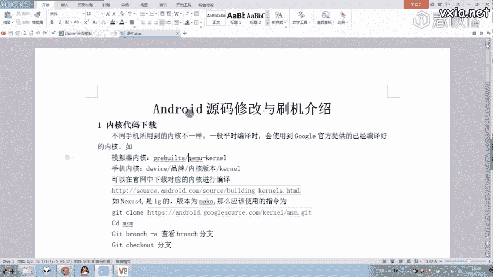

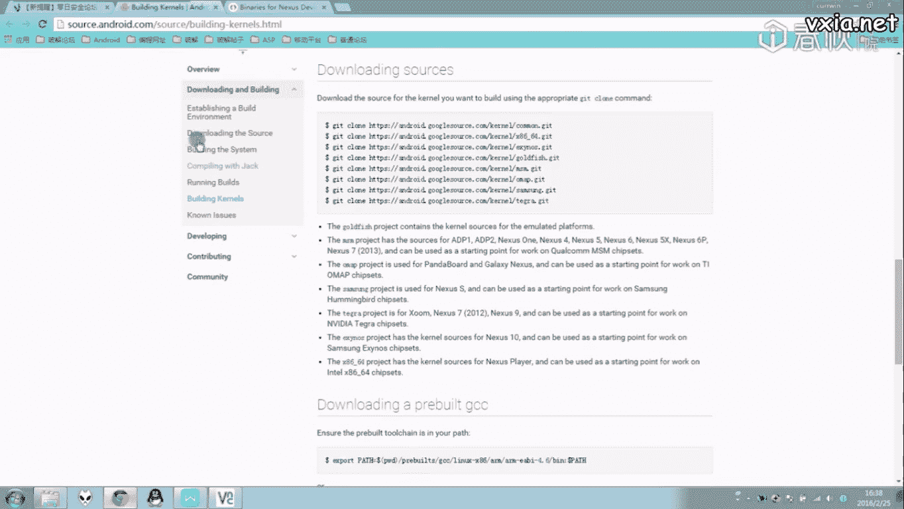

呃，举一个例子来说，举一个例子来说啊，我所使用到的一个手机是04，然后LG出版是mel的一个东西。

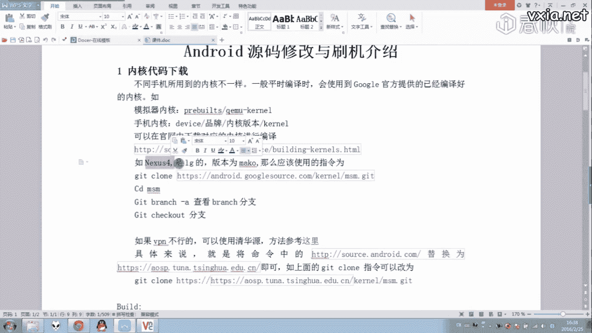

那么我们就能够在这个表中所查看得到。好，marical然后是一个in4。那么可以看到它原码的位置在这里，那么我们就应该使用这样一个呃代码。

接着我们的view convey就是编译设置的框一个so default con。如果是连的手机是其他的话的话，也是一类似的。在这一个表中可以查看得到需要的信息。好。

在下面在下面也可以看到更为详细的一些说明。比如说go fish project，就是一个模模拟器的一个内核。那么如果你是想要编页内核给模拟器使用的话，就可以下载这样一个用这一句代码来下载一个源码。好。

那么这里我们找到我的手机版本浏览是看到它是一个MSN的一个pro。那么这里就找到这样一个MSN的一个版本，好，使用这样一条指令来进行一个代码下载。往往上找一下，然后这样1个MSM的话。

它会它成一个markel。哎，如果是一个gofish水，那就是呃。gofish project块应该是在一个common的一个project块。那应该是其他的一个编辑版本了。好，那么找到这些以后呢。

我们就可以开始的进行一个下载。但在此之前啊，先要让大家来看一下啊这个地址啊这一个地址想大大家都知道这是一个谷歌的一个源码地址，这是需要翻墙才能够下载得到的。那么我们如果如果不想翻墙的话，有没有办法呢？

有啊，有的呃，和上两节课一样。我们可以使用清华的一个语来进行一个下载。啊，具体的用法就是把一个呃正常的一个谷歌代码中的所有这个地址给替换成这个地址就可以使用一个代理来进行一个下载了。

那么比如说比如说比如说本来我应该是使用这一个指令来进行一个代码下载的。

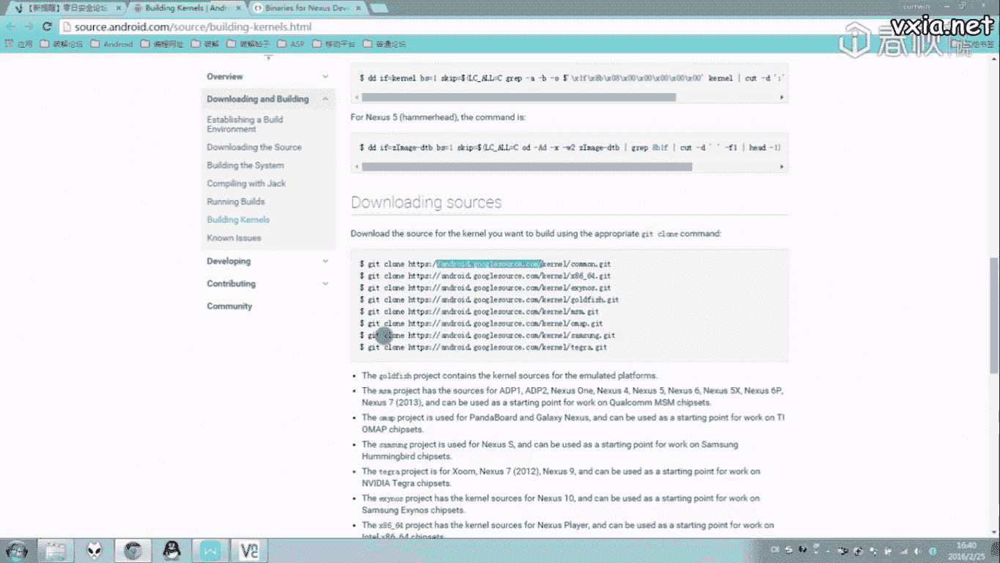

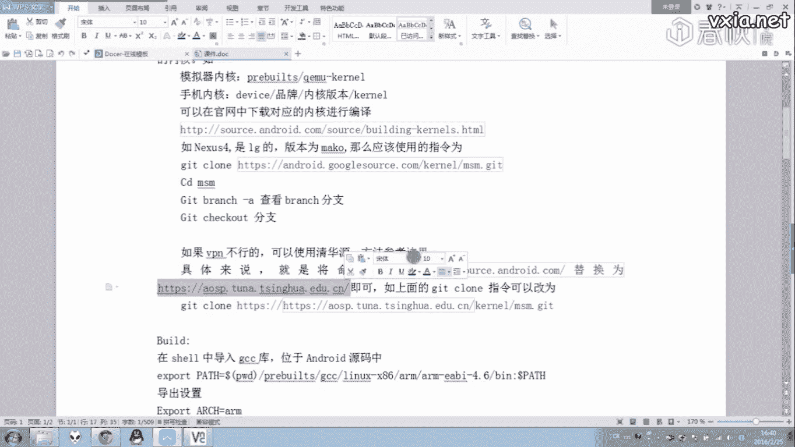

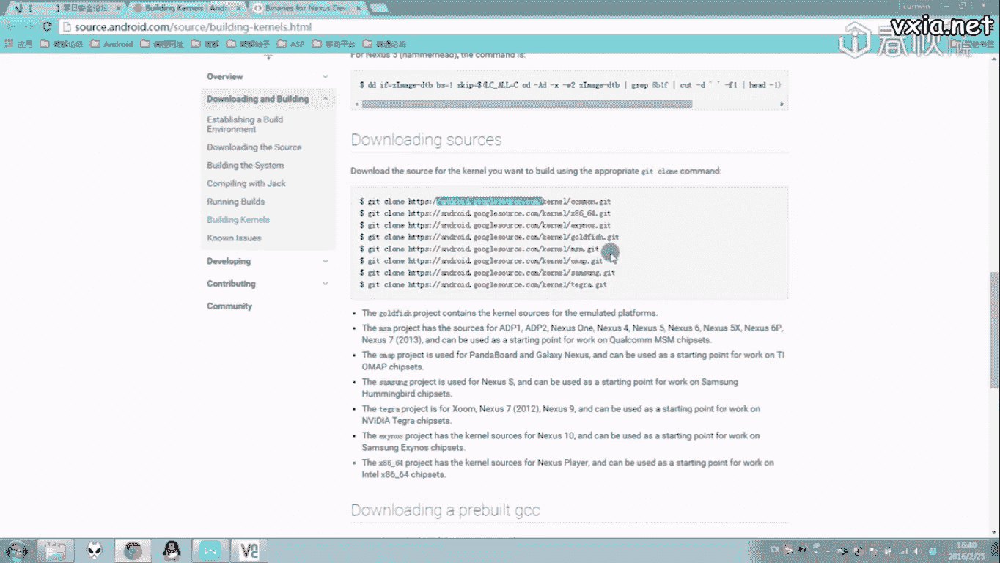

我再试理一下，本来我应该使用这样一个指令来进行一个代码下载的。那么这里我只需要把啊在一个安卓 source里面给替换为这样一个地址。

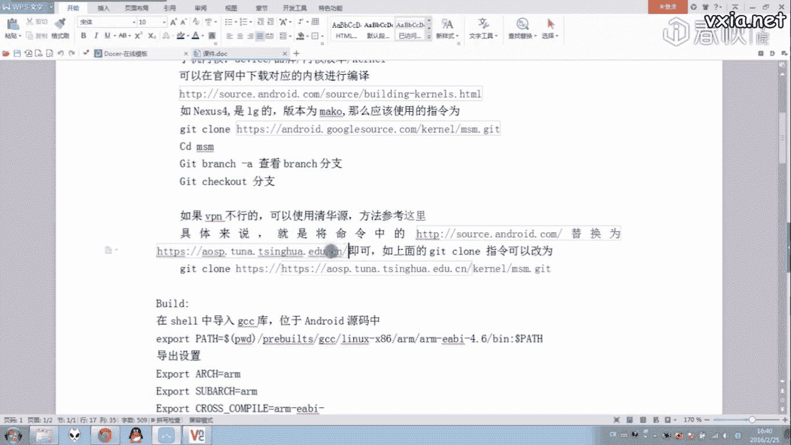

好。我们把这个给替换上去。嗯，我们一行还是使用一个d肯定聊天器可以下载啊。好，7万可以去按回车。哎，那么它就只能就能够自动的完成一个呃下载了。那么这一个就是一个源码下载的一个方法。呃。

这里呢这里的话要注意着对应着这己的一个手机的一个内容，一个版本来来下载对应的一个project。我是MSM不知道你呢是什么。如果你是使用一个nusiceS的，话，要下载这样一个三星的一个版本。

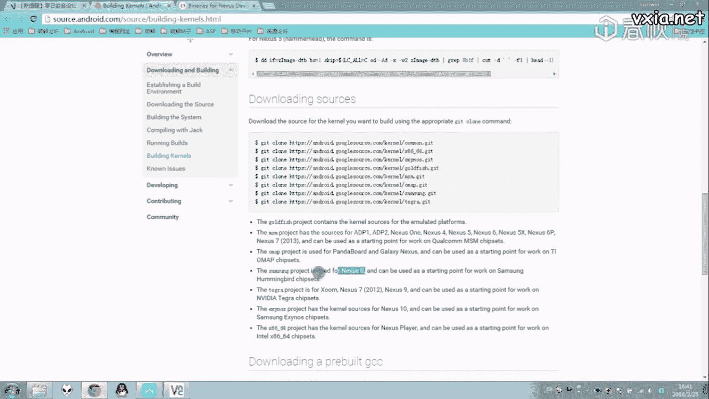

好，这是一个内核代码的一个下载。那么下载完以后，我们就应该进行一个编译了。啊，编译的时候还还是一样，编译的时候还是一样。首先我们把一个内核代码给下载以后存放到对应的一个安卓源码的目录之下。

比如说这里我就把整一个内核代码给放到这一个文件中，markcleken核心的一个M3。那么这是我整一个内核的一个代码。啊，首先我们刚开始下载下来的时候呢，是一个空白的文件。

你可以看到整一个文件夹里面是一个空的，是因为它还没有进行一个版本的切换，所以没有进行。所以是看不到对应的一些信息的，我们要进入到这样一个目录下使用一个呃bo令码进行一个切换。好。

我们来看一下它有多少分支啊。那么可以看到在这一个代码里面，它有这么多远程的一个分支。那么在这里我们就要选择适合于自己的一个分支啊。好，我们来看一下我们的一个手机啊。

我们我的的手机的话是micelmicel是特首我的一个linux5的一个linux4的一个版本了。好，再来看一下我我们的代码对应的是一个kiick卡，kiick卡跨是4点几的。然后跨是5。0的。好。

我们是4。4的，所以就对应的kiick卡。好，那么那么我们就可以看到我们对应的内核版本，就是这一个代码对应的内核版本是这么一个呃分支，我们就切换到这一个分支上面去来进行一个编译了。啊。

7换分切换分支的话是使用一个get check out的一个指令。然后后面就跟着我们的一个分支的一个。呃的一个名称，然后进行回测，就能够进行切换。其他切换完以后的话。

就能够在原文件中看到我们的所有的内核代码了。当看到这么多文件给出现以后呢，就证明我们可以进行一个正常的一个编译了。好，那么这里我们就来进行一个呃编译。呃。

编译内核的话呃还是一样和编译安卓代码的步骤是差不多的。首先还是得为安整一个每一套安卓代码进行一个环境的一个初始化的一个设置。好，那么我们现在测试这样一个bu了。首先得导出1个JDK6的一个位置。

那么像前一节课已经说了，前一节课不要如果要用到vi studio的话，是要装JK7的，对不对？那么如果我们想要在编译安卓云码说要切换到JDK6，那么不是很麻烦吗？好。

那么在这里我就写一个小的小本来看一下，来进行一个快速的一个切换，我来解释一下它每一条指令的一个作用吧。首先第一步它就在呃用这样一个JDK1。6的一个呃代码一个环境给替换了J加 home的一个环境。

接着就来重新设置这一下J加一 home还有class最后就把一个啊JDK的JAJDK6的一个版本给设置到pass变量中。当这几条命令过去以后的话，那么我整一个命令行就已经切换到一个JDK6的一个版本了。

现在可以看一下。好。然后这里本来我是默认是1。82。好，接着它的下一条指令的话是对一个安卓的代码的一个们每一个环境进行一个初始化设置。那么这个脚本过后呢，就能够使用make指令，还有MN指令之类的。

最后就导入一个模模拟器的编译设置。好，我们来运行这样一个啊环境初始化一个脚本。好，我们再来看一下，也这样把这样一个脚本过后的java版本。好，可以看到现现在已经切成最JDK6了。

但材在运行器还是一个JDK8的一个版本的。我要切了GDK6以后，才能够编义这样1个4。4的一个代码。好，把这样一个代码给初始化以后呢，我们就能够进入到一个内核代码中进行一个拼译。我们进行一个切换。好呃。

接着到代码中去，那么再进行一个。呃，用make资金来进行编译之前呢，我们还需要进行一些数字的一些导入。首先是一个添加一个安卓源码的一个G器C库。如果是没有对应的代码的话。

也可以呃单独的去把一个编译库给下下来。呃，具体的来说的话就是在呃可以使用这一条指令。添在这条指令。

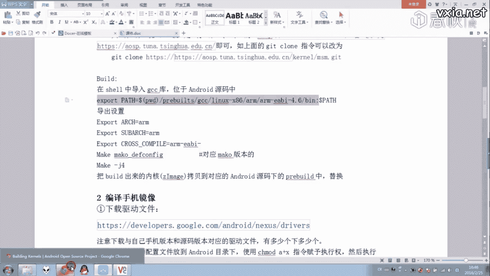

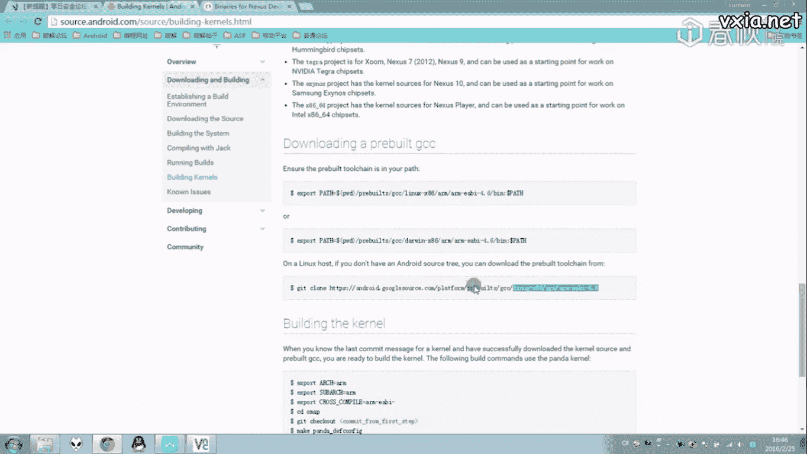

来下载这样一个直线器库。那么这里呃在安卓页码中已经收到了啊，就在这个位置中，在preview的一个目录下。在平民目录下来一个就是7里的差86。我你家啊。嗯，我的是这个字。6一个并。

把这样一个地方的一个地址给导出给导出到pass变量之中。然后接着就来导出一个交交叉编异的一些设置。比如说一个cro话是这样一个，然后是R文本。

然后使用一个mic def啊这里的一个呃嗯默认设置的话是对应的原码的这一个地方的。好后这里它提示我要使用这样一个micmic def的一个变译编译设置。那么这里我就选择这一个。

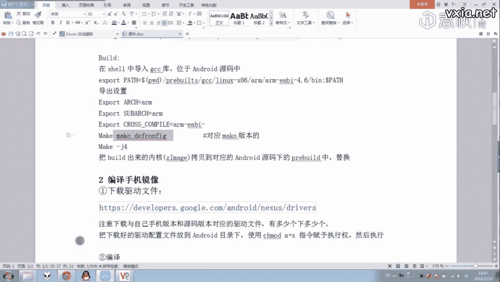

好。接着呃但是啊如果你是其他的也要手手机的话机，要用上面的一些版本，你要具体的来看一下自己手机的一个呃版本才行。我另想试的话是对应的一个micel。才能够使用这样一个设置的。如果设定的鼠额框。

应该是这个。

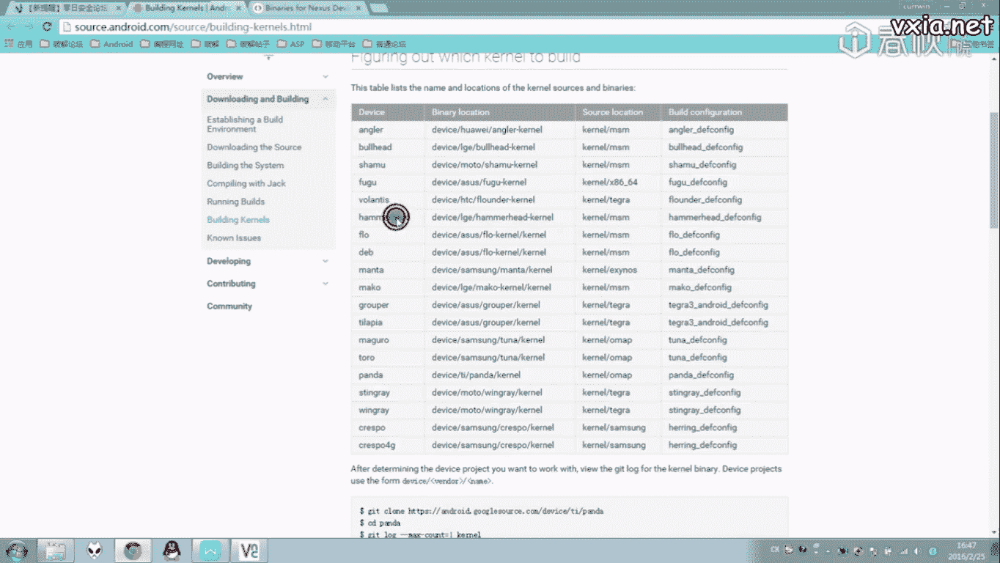

好。最后再使用一个m这次的进行一个拼译。好，那么在这里啊，我已经把一个整一套编译指令给写到这个地方中去了。好啊，看以看一下，现在导出一个GGC的pass变量，然后是一个加叉设置。

然后使用一个markel的一个指令，最后进行一个编译趋释。呃，编译完以后的话，就把编译仪编译出来的一个imagage给拷贝到我们的一个呃设备之中去。我们进行一个变异。嗯。好。

那么这里啊就能够进行了一个呃代码的一个编译了呃，编译完啊，这里等能等能它编译吧。啊，编译完以后的话，就会如果是正常编译的话，应该是会生成一个Z image文件的。就在这里嗯在这里这 image文件的话。

应该在呃。可选在这里。那是二区而且I也不自人群。那个嗯。哎呀哎，我看一下我。好啊，那么这样一个就是一个呃生成的一个imagage文件。这一个就是我们所谓的一个内核文件。我们在编译按卓源码的时候。

需要把这样一个内核文件给编译进去，才能够给说是缩新的一个内核。好，那么这里因为我以前已经编译过一次内核了。这已经看到它说明了，哎，我编译出了一个那些文件，好，就放在这个目录下，就对应着我这个文件。好。

那我要把这个文件给拷贝到我们的一个呃安卓源码中的对应的一个pre编目录下给替换它原始的内核才算是成功了。好，我们找到我们的一个原始代码中的内核。那，也是一样啊，在一个dvoice里面去。好。

设备一 works。然后LGE是我的一个手机的一个版本，好是一个markle的内核，然后就来替换这一个内核文件，把ex image进行重命名命名为kennel，然后替替换这个文件。

就这样就完成了一个内核的一个替换。好。那么这一个时候再去重新的进行一次安卓源码编译，就能够把我们刚才编译出来内核给替换进去了。如果是这一个话就来过来手机和不一样，就来替换这一个其他的一些地方啊。

这是呃相对应的好，这是一样的。啊，这是类似的这是类似的。好，那么大家在这一步的时候，请呃小心一点啊，不然的话很容易把手手机给摔坏了。

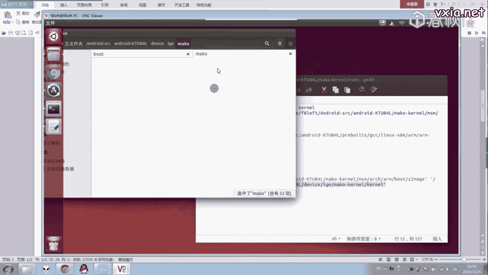

好，啊，那么这样给替换完以后呢，就算是把一个呃内核给给你完了。啊，这个时候可以直这个时候如果你前面已经把驱动给配置好了的话，就可以跳过这一步了。如果没有没有的话。

就来就需要去对应的手机的版本来下载相应的一个驱动，可以在这个地方给找到呃手机对应的一个驱动文件。

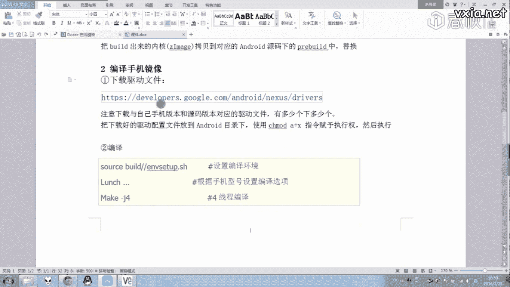

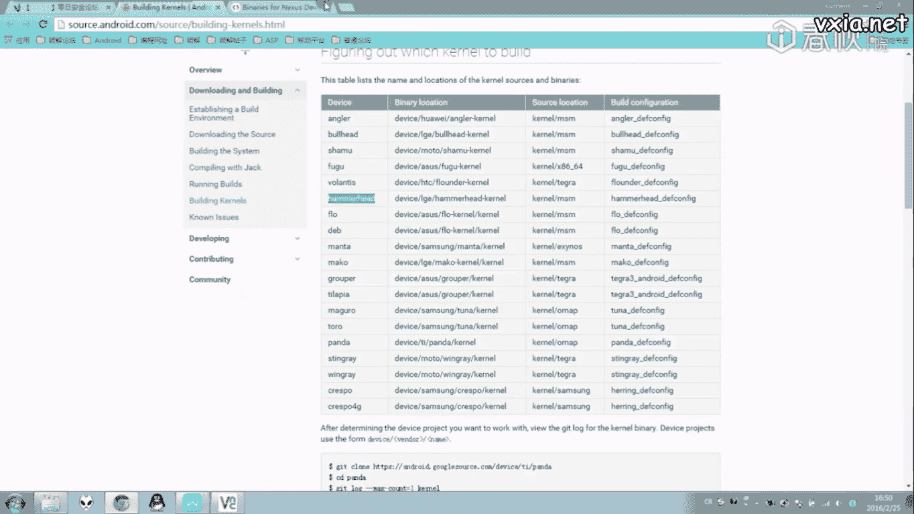

嗯，在这个目录下可以看到这么多，我们找到自己的源码，你自己的手机一的版本是0。4。

啊，这款是的很好。

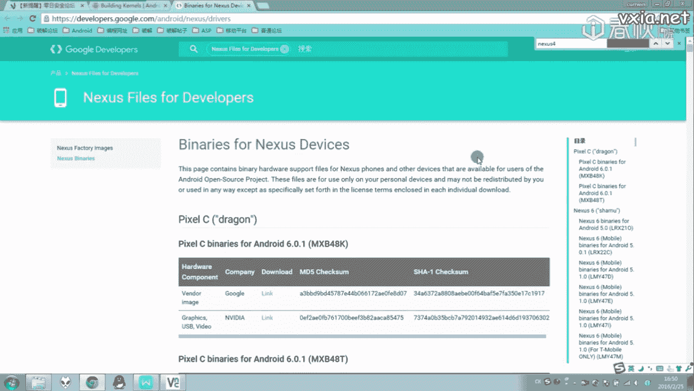

好，这是一个mel的一个类型，看一下5器怎么的，看一下。

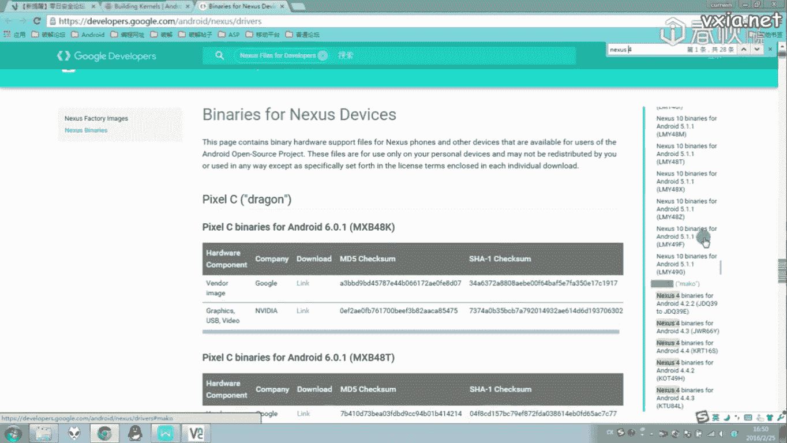

winina是口，那么linus5的话是ho hub head啊，就是ho head就是刚才看到的这个。

好，那么我们就来选择这己对应的手机一个版本。好，比如说这是令25要替换的一个位置啊。如果是lin5就话就替换这个文件。如果我是lin4了，话就替换这个。

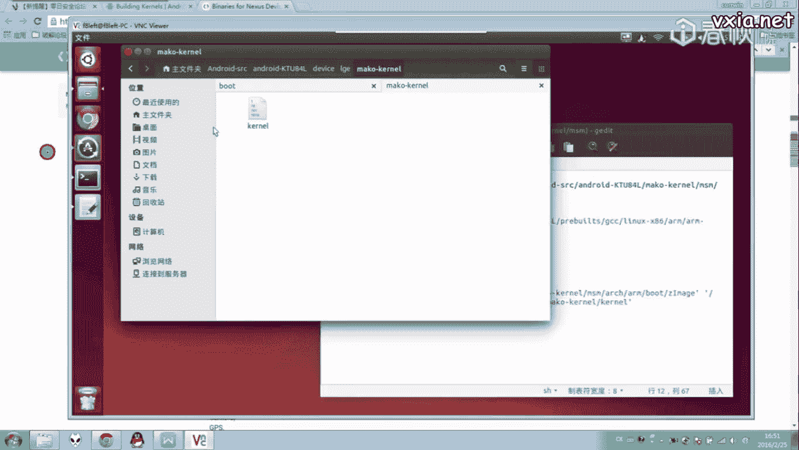

好，我们找到自己的手机，因为是是一个mark版本了，然后找到我们安卓源码所对应的一个版本。我们是4。4。3KTU84L呃，如果你是下载KT884P的话，就是下面这个。

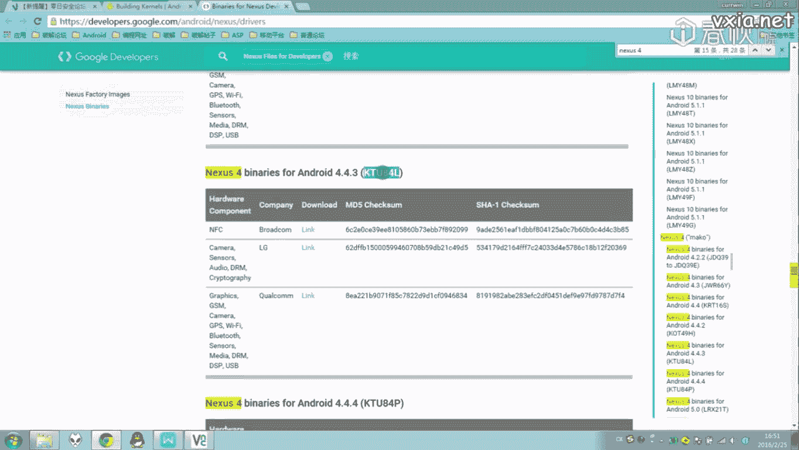

我们的呃手机的代码是84L哦，那就是这个。

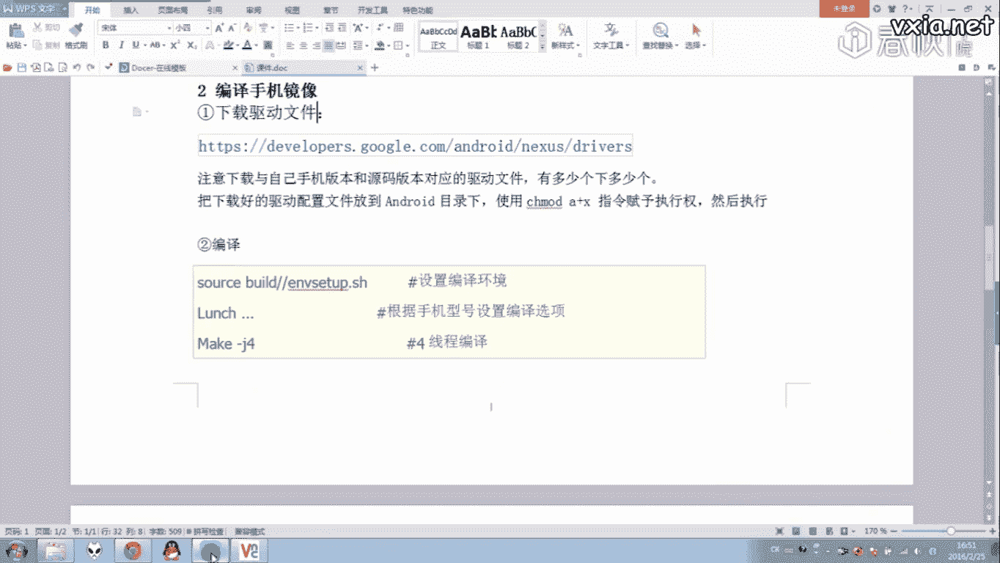

那么这里就要把这里就是我们的一个驱动文件，这里就可以直接的把驱动给下下载下来。那么把这有多少进下载多少，下载完以后的话，就对里面的文件进行一个解压，可以解压出几个脚本文件。

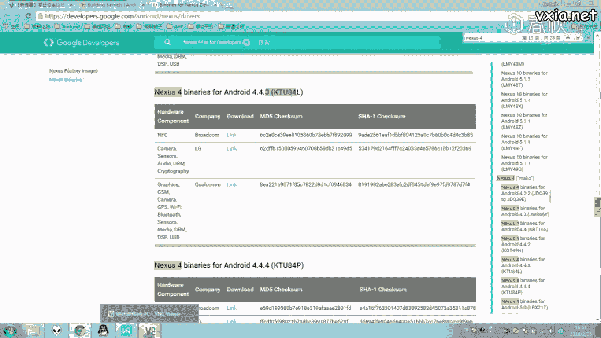

好嗯。看一下呃，把。解压出来的的一个脚本文件应该是。应该是类似于这样一一个东西的，把。把一些脚本文件给拷贝到源码的目录之下。好，这里就是对应的我这几个文件啊，然后运行一次，让他们来给解压出对应的一个呃。

让他们给解压出我们对应的一个。

那，属性啊，这些脚本话，它要执行的话，得先来赋予一些呃执行的一个权限。我们是使用1个HMD来进行一个权限能的一个赋予的。好，我进来试一试啊。呃，在每一个脚板之行之前呢。哎，先来进行一个。权限的设置。

这里使用A加X，表明它赋予一个执行权限。好，把这个给设置完以后的话就能够运行了。哦，A水7。嗯，我们在这里试一下执行一个呃版本，这是我刚才过宇权下面的一个脚本文件，然后然后它就有一个说明说明说明说明。

然后然后它是要需要我输一个Ibri as that。好，把这个输入完以后，回车它就可以进行一些操作，给示放一些东西。啊后同样的对这里三个脚本哎。

下载上来下载下来的所有东西的几个脚本都放到代码目录下面运行一遍。好，这样运行完以后呢，就能够把一个手机的驱动给释放出来了。那么这个时候我们就能够进行一个编译了。呃。

编页的时候还是在一个bush里面去进行一个设置了。好，不过这里要给北先切换一下一个呃。要得先切换一下一个东西啊，首先要设置一个边界环境，使用source指令，或者说刚才我的一个enment。

这已经给设置好了，就不用再进行一个设置了。好，这里是要弄起来切换一个变译编译的一个分支。我要编辑1个marel版的1个AOSP然就是11，那就是对应着我的linow4的。如果是linux5的话。

就编辑这一个好，我设一是11。

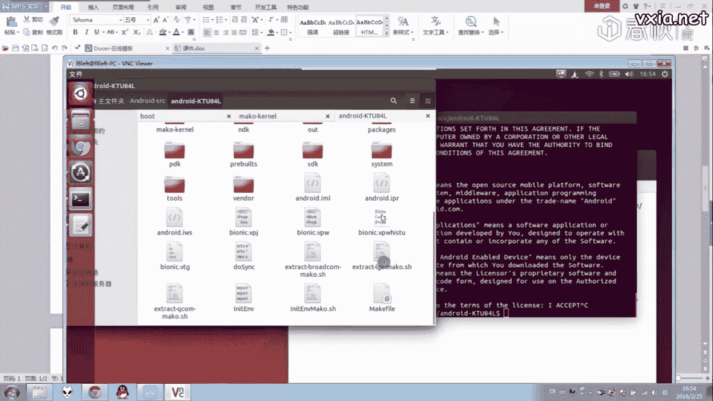

给切过去。好，这个时候就能够呃进行一个编译了。那这个时候就能进行用一个make指定了进行个编译。好。

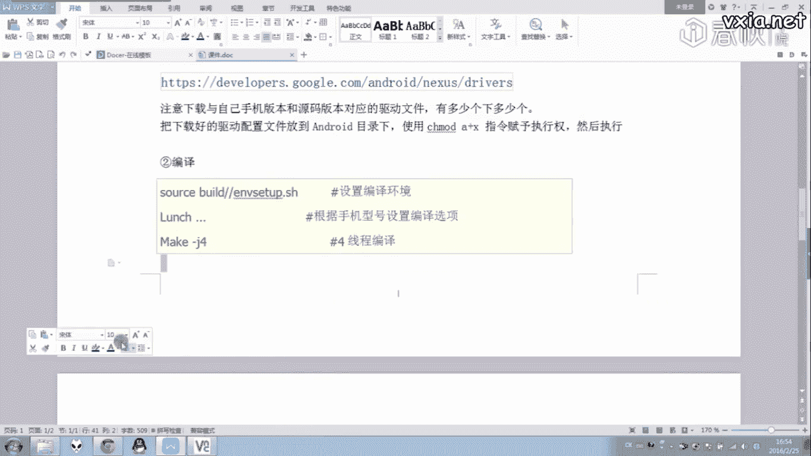

这一步呃在此之前的话，都还是与一个呃。还是与那个什么是一样的，和和以前明确的时候是一样的啊，这里他说我因为因为环金配置的一个问题所导致一个错误啊，那么这里的话是因为我刚才已经导出过一次军势期了。

然后这里就重复就失败了。

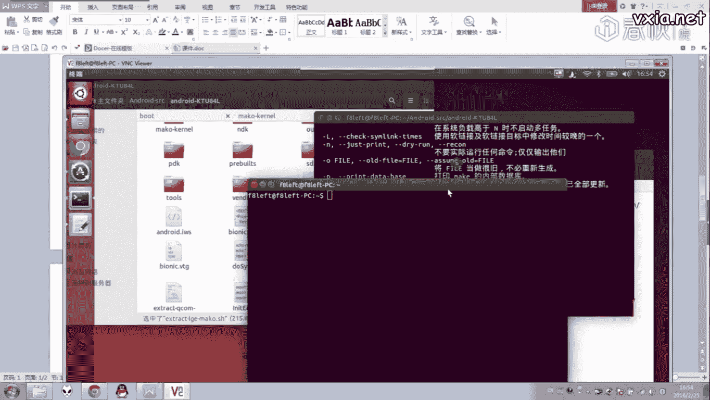

我们重新来。先出始号文件环境，然后使用n取来切换一个编译版本，可以编一个m版的。发进てかけに。好，那么这里等它结束以后的话，那么整一个系统就会整一个手机的一个内核就会给编译出来。啊。

那么在这里我们就先来等待它呃跳到编译完成以后的一个时间段吧。嗯，好的啊，那么这里的话，我已经呃成功的编译完一次了啊，由于过程中出了点问题，所以现在你们是看不到那个编译成功的一个目录的。

那么编译成功的那个效果的话，和设节课中所显示的是一模一样的。好，那么在这个时候啊，在已经啊编译完以后的话，我们就可以来正式进行一个刷机了。哦，那么在锁地机之前的话，请一定要千万要注意一下。

你的系统是已经把驱动给放好了。还有把内个给嵌好。不然的话，编译所有的文件就可以直接导致你的机器给摆板是很有可能的。好，那么这个时候我们来进行一个刷机。嗯，那么说这个时候的话。

我们也是也要使用1个APP的一个指令。首先是我们要重启到一个butotload的一个方一个地方，来，就是一个faest boot的一个模式。好，我们输入这一个一条指令。啊，这是一个从启意思啊。

ADBbo。然后。好，我们进入到一个bo loaderfa boot boot loader。好飞以车啊，这个时候如果已经成功的接入手机的话，那么这条指令应该应该会让手机进行一个重启。

然后就可以重启到一个呃win收的模式啊，那么这一个在这个模模式的下块，你会呃看到是一个安卓标志的小矮人，然后里面呃它肚子一打开。那是这种图像。好，那么看到这个图像以后。

上面就已经成功的进入到一个fatbook的模式。那么这个时候就可以从用fatbook的一系列的指令来，进行一个刷击。那么这里呢我们就设一个f指令来对所有的东西进行一个就是进行一个重新刷写。

然后是一个刚W指令进行一个双击。我们我们呃说完以后的话，就可以从内核到一个stem全部给刷一次。好，这条指令。啊，你问一下，那么在这种情况下，有可能你们的手机是连不上去的那是因为没有配置USB设置。

那么具体的话可以看一下呃，第十二课那个51ros文件，把那个ws文件给放到恰线上D方以后改一下用户名啊。那么这里就使用fasbook指令。啊，这里的块我就不进行一个刷机了。因为我的记者已经配置好了啊。

说了话会发者很奇怪的问题。啊，那么我们使用fasbook时间进行一个重启。好，那么这个时候手机就可以正常的进进行一个重启。啊，如果你啊使用这一条指令进行重全部刷一遍的话。

手机也是会在刷完以后进行一个重启的。啊，在刷这的时候，千万要记住不要动那个USUSB的线。如果你的USB链接是不怎么稳的话，请注意一下，要呃换一条比较好的线才行。好，那么这是一个缩机的一个地方。好呃。

另外一块还有呃几几条呃其他的指令可以跟大家说一下啊，这是一个在配扫一个安卓编译环境以后，可以直接使用的一些指令。首先是一个N指令的框，使以以后就可以编辑按卓是统的输入模块。好，然后X是1个MM指令。

就可以编于目录下的模块。比如说你并不想对整个系统进行重新编义一遍的话，那么就可以用CD指令来进入都进入到某一个目录之下。需用AM指令。好，那么就可以编辑编入到编译当前目录的一个呃文件了。

然后那么AM的话就可以指定编译的一个目录文件。啊，这几个是相辅相成的。那么makeSOD的话就是你在修改了某一部分的代码，并且使用1个MM或者AMDC是部分重编译的话。

那么就需要使用在一一条指令来把修改过文件给整合到这些文件之中。整合完以后呢再才能再刷才能够生效。好，那么这一节的话就是呃这些就是关于一个代码刷机的一个东西，一个一个介绍了。🎼好。

那么这节课的话就到此为止了，谢谢大家。

