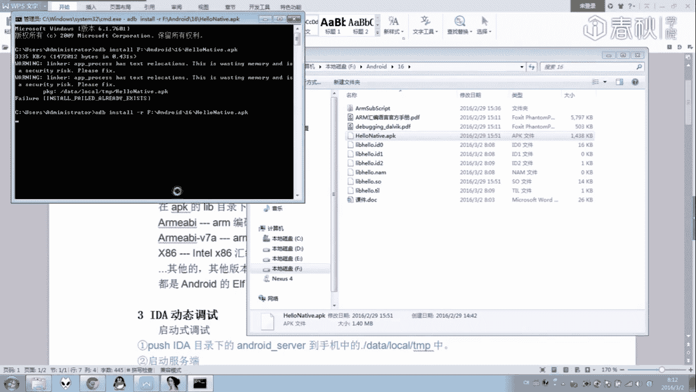
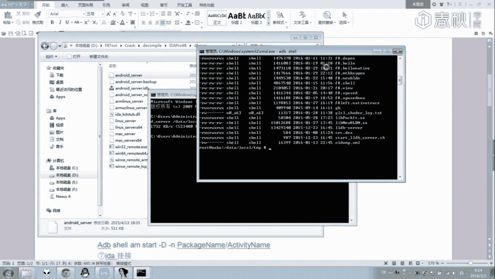
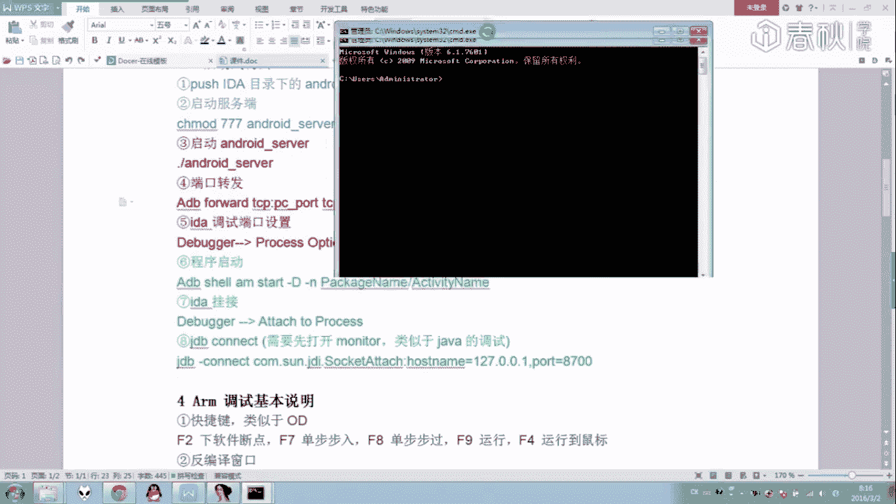
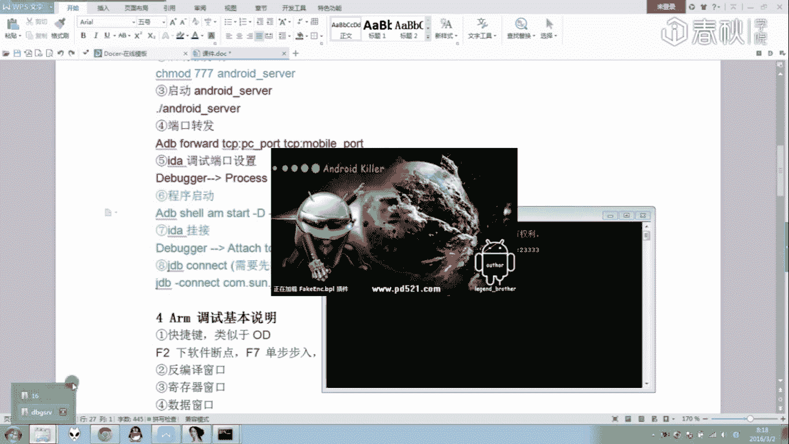
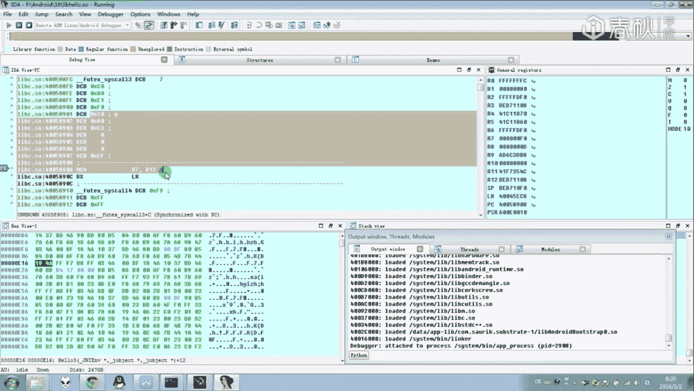
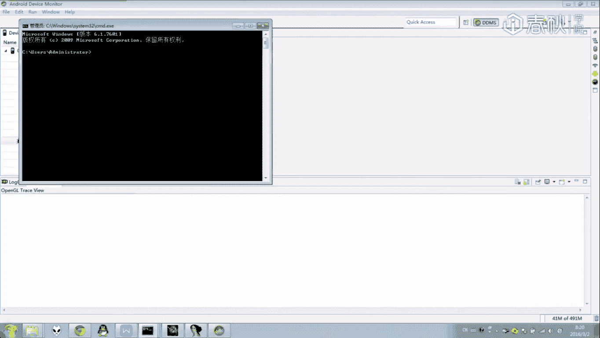
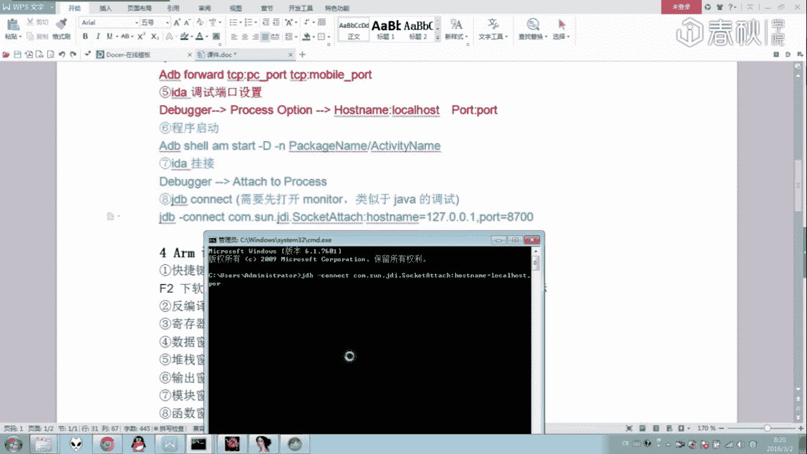
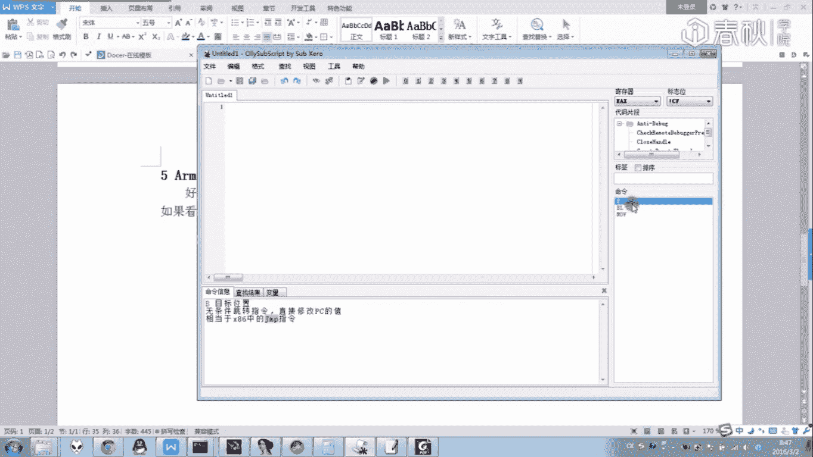

# i春秋零基础入门Android逆向 - P17：课时1 ARM汇编代码讲解1 🧠


在本节课中，我们将学习如何使用IDA工具对Android SO文件进行调试，并初步认识ARM汇编指令。我们将通过实际操作，观察和分析汇编代码在调试过程中的执行流程与寄存器变化。

---

## 概述与工具介绍

上一节我们介绍了Android逆向的基础环境。本节中，我们来看看进行ARM汇编分析的核心工具——IDA。

IDA是一款功能强大的反汇编和调试工具，支持插件和脚本扩展。它是分析Android平台SO文件的主要软件。虽然其调试功能相对基础，但在图形界面调试器中，IDA是目前较为易用的选择。


## 目标文件与调试准备



我们的目标是调试一个经过修改的APK文件中的SO文件。该SO文件位于APK的`lib`目录下，根据设备架构（如`armeabi-v7a`）选择加载。

首先，我们需要从APK中提取目标SO文件。APK本质上是ZIP压缩包，可以使用压缩软件直接打开并提取`lib`目录下的对应SO文件。




## 使用IDA加载与分析SO文件

将提取出的SO文件拖入IDA，它会自动识别文件格式（ELF）并进行分析。分析完成后，我们可以在函数列表中看到诸如`Hello3`这样的本地函数，其实现内容以ARM汇编代码形式展示。




这些汇编指令共同实现了原C++代码的功能。为了理解每条指令的作用，我们需要对其进行动态调试。




## 启动调试环境

调试需要在手机上启动调试服务，并将端口转发到电脑。以下是具体步骤：







1.  将IDA目录下的`android_server`推送到手机`/data/local/tmp`目录，并重命名（避免检测）。
    ```bash
    adb push android_server /data/local/tmp/andser
    ```
2.  赋予可执行权限并运行。
    ```bash
    adb shell
    cd /data/local/tmp
    chmod 755 andser
    ./andser
    ```
3.  服务启动后，会监听一个端口（默认23946，可用`-p`参数修改）。在电脑上使用`adb forward`命令进行端口转发。
    ```bash
    adb forward tcp:23946 tcp:23946
    ```
4.  在IDA中配置调试器选项：`Debugger` -> `Process options`，设置`Hostname`为`127.0.0.1`，端口为转发的端口号。


## 附加进程与下断点

配置好调试器后，需要以调试模式启动目标应用，并将IDA附加到进程。

1.  使用`am start`命令以调试模式启动应用。
    ```bash
    adb shell am start -D -n com.example.demo/.MainActivity
    ```
2.  在IDA中选择`Debugger` -> `Attach to process`，找到并附加到目标进程。
3.  附加成功后，使用`jdb`命令连接Java调试端口，使Java层继续运行。
    ```bash
    jdb -connect com.sun.jdi.SocketAttach:hostname=127.0.0.1,port=8700
    ```
4.  程序运行后，IDA会加载SO文件。此时，我们可以在目标函数（如`Hello3`）处按`F2`键下断点。


## 调试界面与基本操作

成功附加并触发断点后，我们进入调试界面。需要熟悉以下几个核心窗口和操作：

*   **反汇编窗口**：显示当前执行的汇编指令。
*   **寄存器窗口**：显示`R0-R15`、`SP`（堆栈指针）、`LR`（链接寄存器）、`PC`（程序计数器）等寄存器的值。蓝色表示值在上一步发生了改变。
*   **堆栈窗口**：显示当前堆栈内存的内容。
*   **内存窗口**：用于查看任意内存地址的数据。

以下是常用的调试快捷键：
*   `F2`： 设置/取消断点。
*   `F7`： 单步步入（进入函数调用）。
*   `F8`： 单步步过（执行完整个函数）。
*   `F9`： 继续运行。
*   `F4`： 运行到光标处。


## ARM汇编指令实例分析

现在，我们通过单步执行，观察几条常见ARM指令的执行效果。

以下是`Hello3`函数开头的一段汇编代码及其作用分析：

1.  **PUSH指令**
    ```assembly
    PUSH    {R7,LR}
    ```
    这条指令将寄存器`R7`和`LR`的值依次压入堆栈。执行后，`SP`（堆栈指针）的值会减小，堆栈中新增两个数据单元。

2.  **SUB指令**
    ```assembly
    SUB     SP, SP, #0x10
    ```
    这条指令为局部变量在堆栈上分配空间。其效果等同于 `SP = SP - 0x10`。

3.  **ADD指令**
    ```assembly
    ADD     R7, SP, #0
    ```
    这条指令将堆栈指针`SP`的值赋给`R7`寄存器。效果等同于 `R7 = SP + 0`，常用于后续基于`R7`的地址偏移访问。

4.  **STR指令**
    ```assembly
    STR     R0, [R7,#0x10+var_4]
    ```
    这是一条存储指令。它将寄存器`R0`中的值，存储到内存地址为 `[R7 + 0x10 + var_4]` 的位置。`var_4`是一个IDA生成的变量，代表偏移量。

5.  **LDR指令**
    ```assembly
    LDR     R0, [R7,#0x10+var_10]
    ```
    这是一条加载指令。与`STR`相反，它将内存地址 `[R7 + 0x10 + var_10]` 处的值加载到寄存器`R0`中。

6.  **BL指令**
    ```assembly
    BL      sub_123456
    ```
    这是一条带链接的跳转指令。它执行两个操作：将下一条指令的地址存入`LR`寄存器，然后跳转到目标函数`sub_123456`执行。用于函数调用。

7.  **MOV指令**
    ```assembly
    MOV     R1, R3
    ```
    这是一条数据传送指令。它将寄存器`R3`的值复制到寄存器`R1`中。效果等同于 `R1 = R3`。


## 学习方法与总结

本节课中，我们一起学习了使用IDA进行Android SO文件调试的基本流程，并认识了`PUSH`、`SUB`、`STR`、`LDR`、`BL`、`MOV`等核心ARM汇编指令。

对于初学者，理解每条指令需要结合调试实践。一个有效的学习方法是：在调试过程中，为不熟悉的指令添加注释。例如，在IDA中右键点击指令，选择编辑注释，记录该指令的实际作用。

通过反复调试、观察寄存器与内存变化、并查阅资料或手册，可以逐步建立起对ARM汇编代码的阅读和理解能力。建议将常用的指令功能整理成笔记，方便后续快速查阅。




**课后作业**：请按照教程流程，成功对目标SO文件进行调试，并尝试为5条不同的ARM指令添加注释说明。