# i春秋零基础入门Android逆向 - P22：课时1 class.dex文件格式讲解 - 老网恋教父了 - BV1sg4y1B7zB

🎼。

嗯，好的嗯，大家好，我是讲师艾8。那么今天的话就来讲一个d的一个文件。那么啊经过前面这几几这节课以啊，相信大家都已经知道了啊，对于一个APK文件来说的话，它里面的有有一个文件是最重要。

那么这个就是一个文件。这个文件的话，它存放的整一个程序运行所需要的一些质检码。那么按卓系统在运行这个程序的时候，就可以优先加载这样一个d文件，然后把里面的一些代码给解析出来。

然后在对这些代码进行一个执行。那么我们在修改的时候，实间上也就是完成对这样的一个d文件进行一个修改的一个过程。

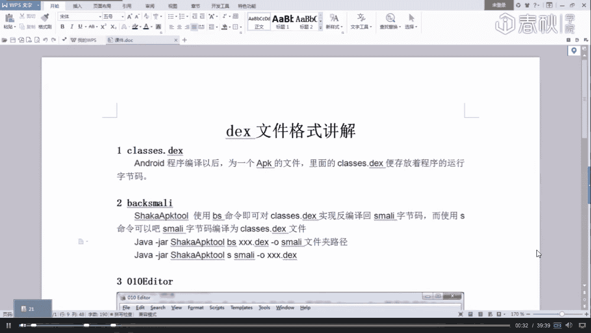

所以呃对于我对于我们来说，呃而知道这样一个ds文件的一个格式的话是非常重要的。哦，那么我们就来尝试着去进行对它进行一些定项嘛。首先这样一个袋始文件的话，它是存放着一些smmiile这件码的。

我们可以设用一个任个AP可 do的1个BS的一个命令，可以对这些字节码完成一个反律页。我们来看一下。

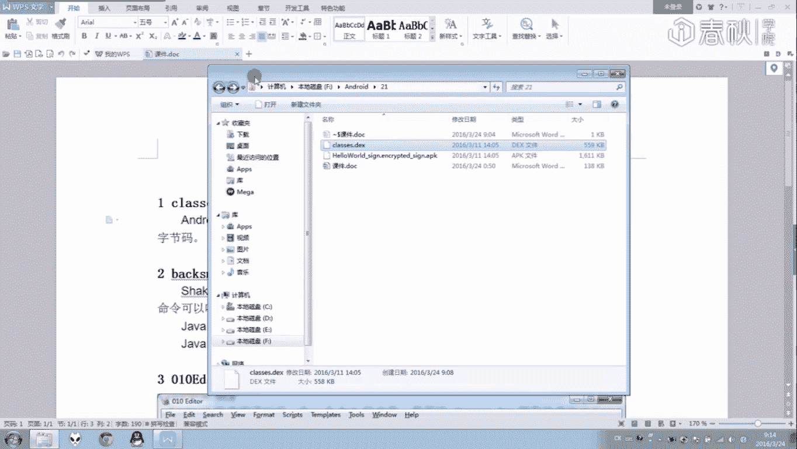

先来看一下这样一个。下来APK two的一些啊指令的一些说明了。

我来看一下他有哪一些功劳。

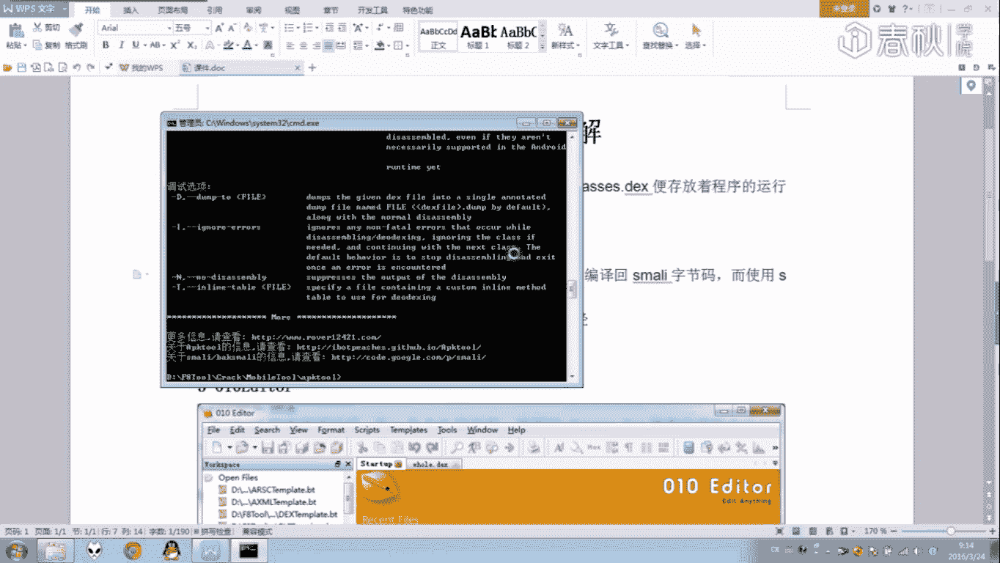

好，我看一下。首先是对基本的对一个APP to进行一个反编译的一个功能。然后在下面的话还有另外一些两个选项，就是这样一个smar的一个选项。还有一个是back smart的一个选项。

其实这两个的话本来是一个分开的个JI文件是用来对安卓程序安了一个文件大陆进行一个编译还有编译的。那么这样一个话就对它进行了一个集成。那么集成以后话就是像这一种形式的东西了。我们就。

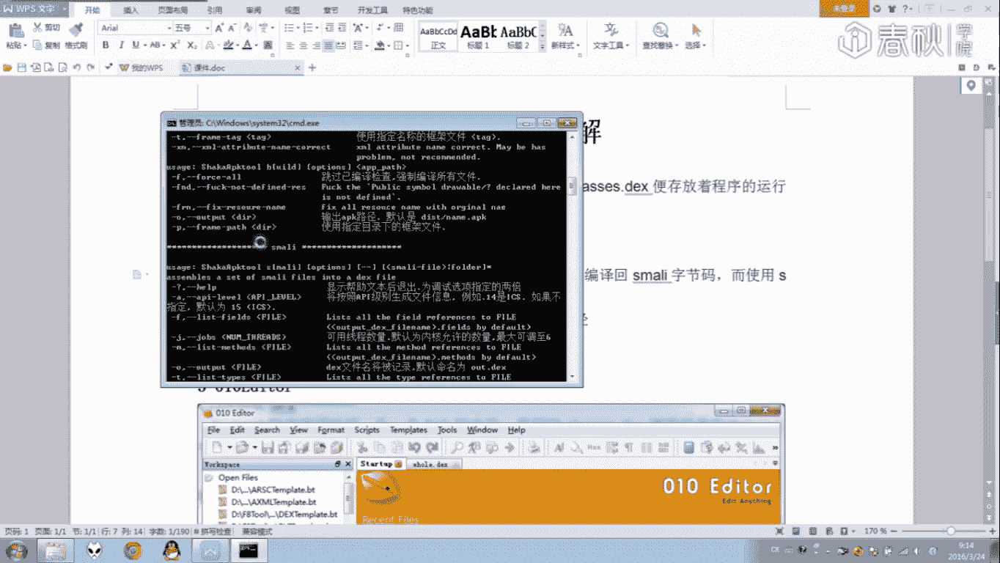

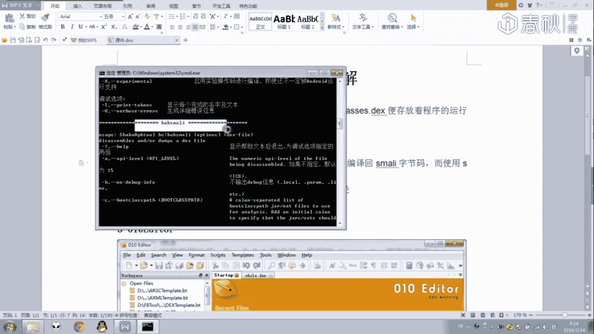

试着用一个卸卡APK two来对这些这样一个dt文件进行一个反应。用法话是很简单的how back money。

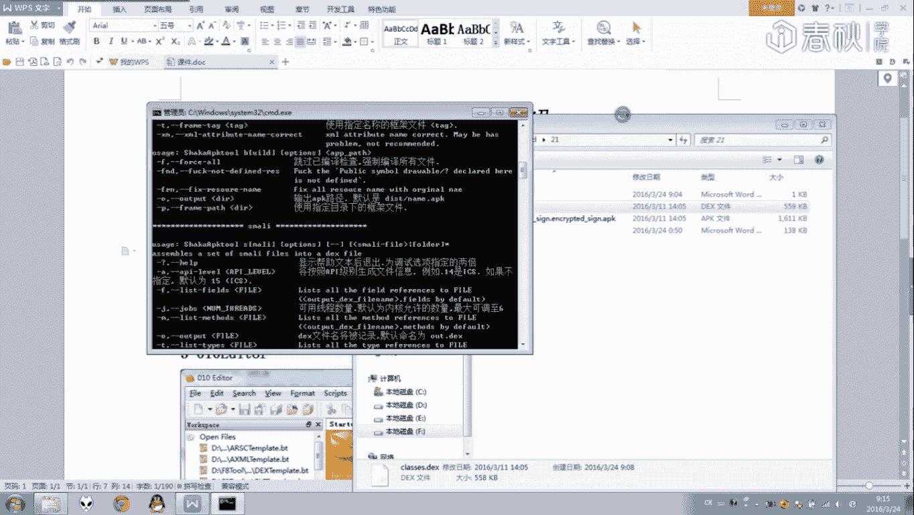

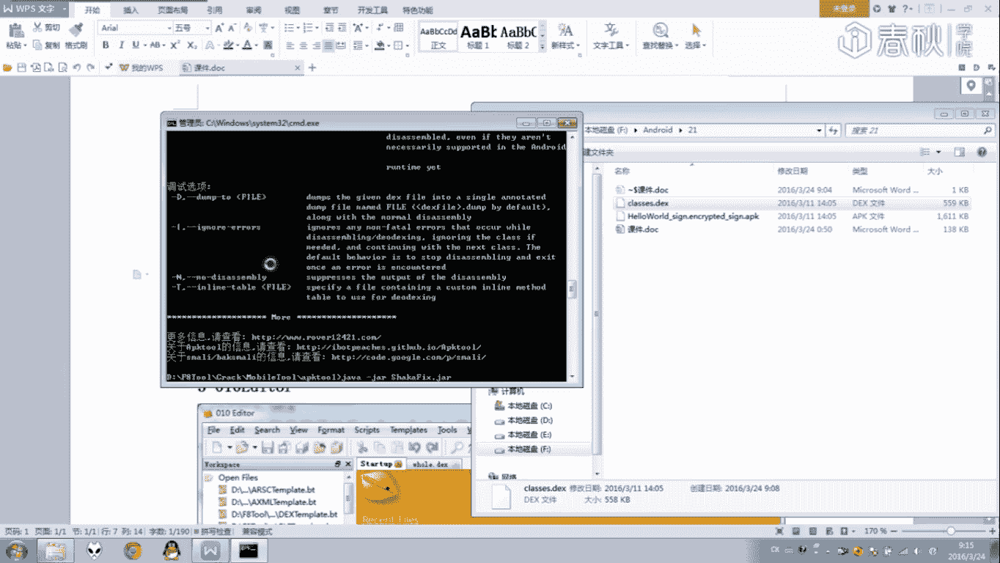

然后输入的是1个DNX文件，但到O叉的话选择一个输出的一个路径。

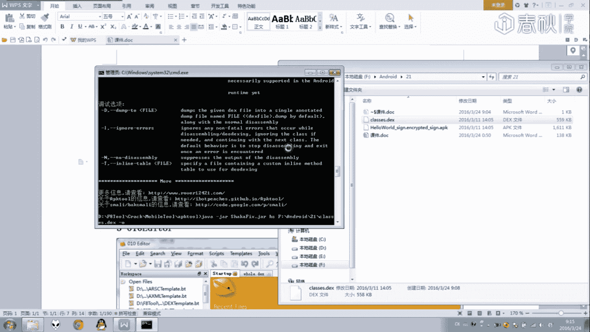

好，确定，那么它就会输出一个呃class的一个文件夹。

这个件夹里面全放呢就是我们的一个呃。

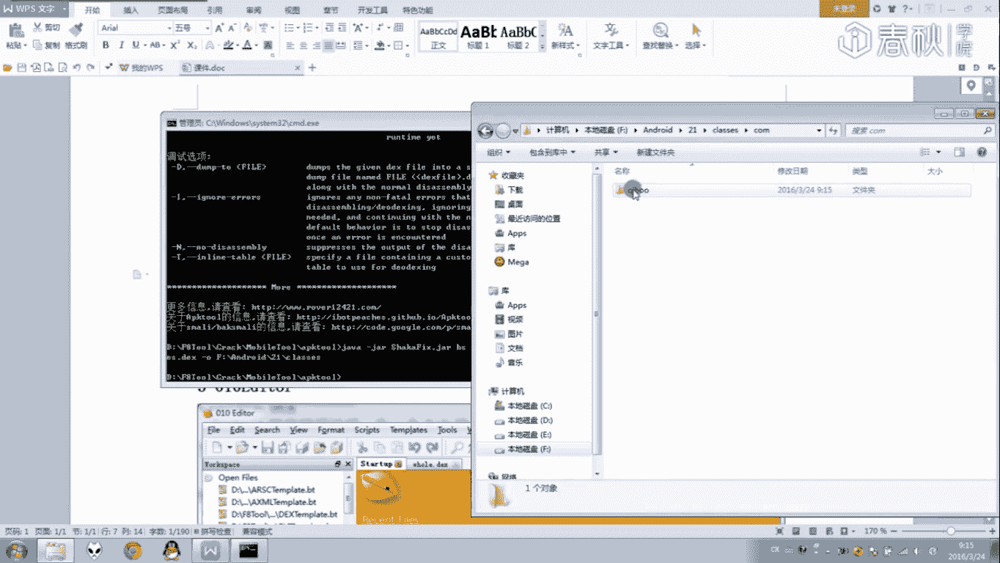

蚂里的一个代码啊那。同样的我们这用一个smar里的一个指令，行然后输入是文件夹，以后goO的话是一个输出的一个des软键路径。

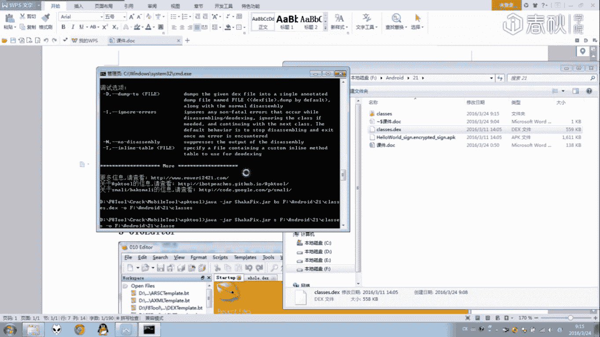

点DX啊，那么它就会完成的完成对计个文件呢进行进行一个smail的一个操作。然后就是最终就输出一个des文件好。

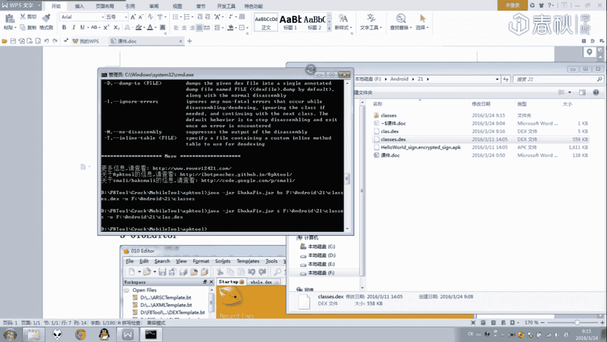

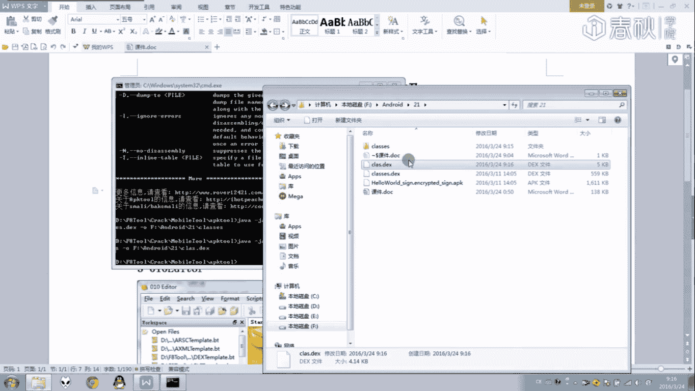

那么这两个文件就是一个反面以后，然后加一个再编辑回来那两个文件它看是不是一样的。其实他看一下他们的大小不一样，说明他们存放数据是不一样的，但是他们的功能是不是一样是不是一样。呃，从理论上来说。

它们的功能是肯定是一样的。因为他们都是从同样的一个代码中给编过来。但为什么他们的一个大小可生下这么多啊，我们用一个呃一个GEB来打开看一下，看一下它们的功能吧，首先是我们反面以后的好。

可以看到它的流量结构很简单，这只有一个smar的一个类，这只有一个类是一个几乎3360的一个夹克，那么那么可以看到话它里面只有一个 applicationplication的一个类。

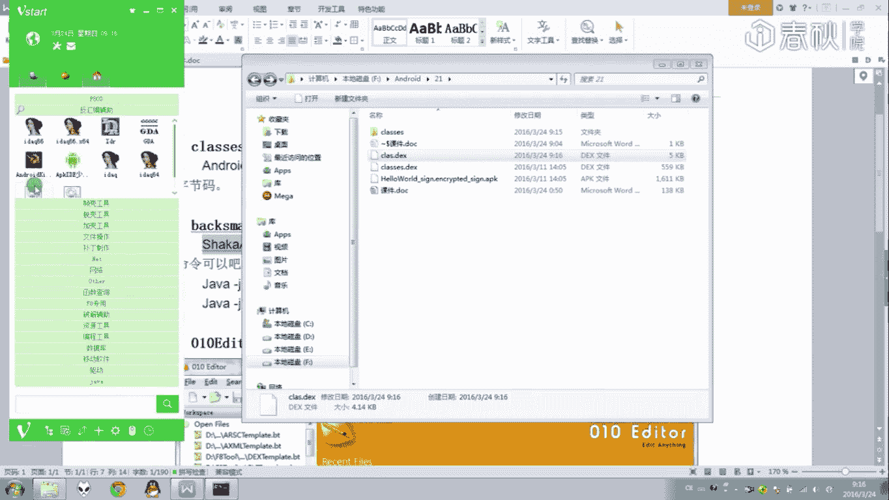

我们再回头来看一下它原来的一个classs文件。哎，发现它也是一样的，它里面也是这种这样的这样的一个类，对吧？但是它的大小哎就确差相差了这么多，他们里面的数据也差了这么多。那是为什么？你是为什么？

这是因为这样1个360360的壳啊，它可以对呃戴鼠文件的数据进行一定程度上的一个抽取。

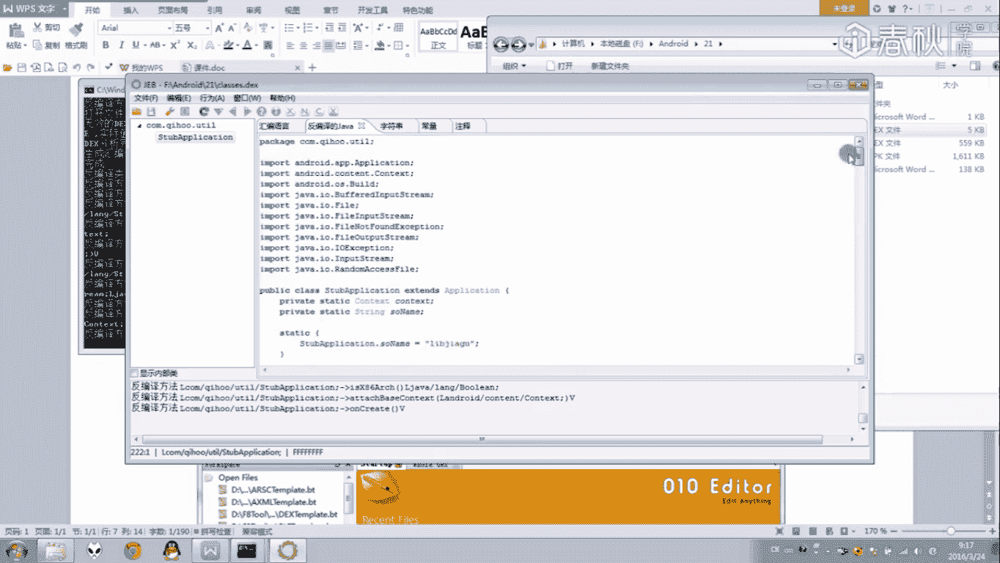

好，这些一定程度上抽取哎来达到呃在一些时候动态的还原的一个效果。那么我们就要要要来看一下这么一个小小的DS文件中，它里面到底存放了哪一些信息，哪哪些信息是和执行的代码有关的。呃。

就是说唉让程序可以执行的一些代码。那么另外它还有另外哪一些信息，用来呃描述这样一个d文件的一个信息的。我们就来看一下吧。

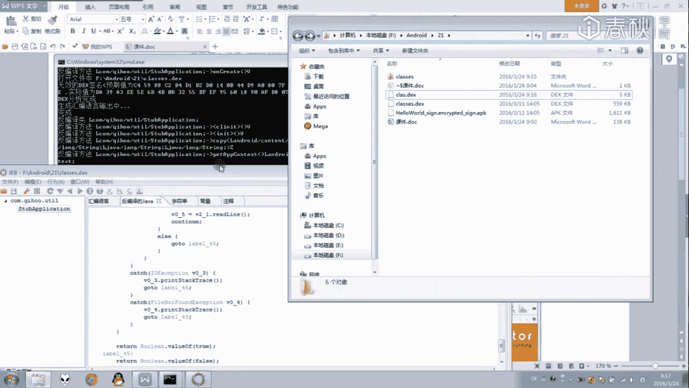

我们来看一下这样一个但s文件的一个结构。

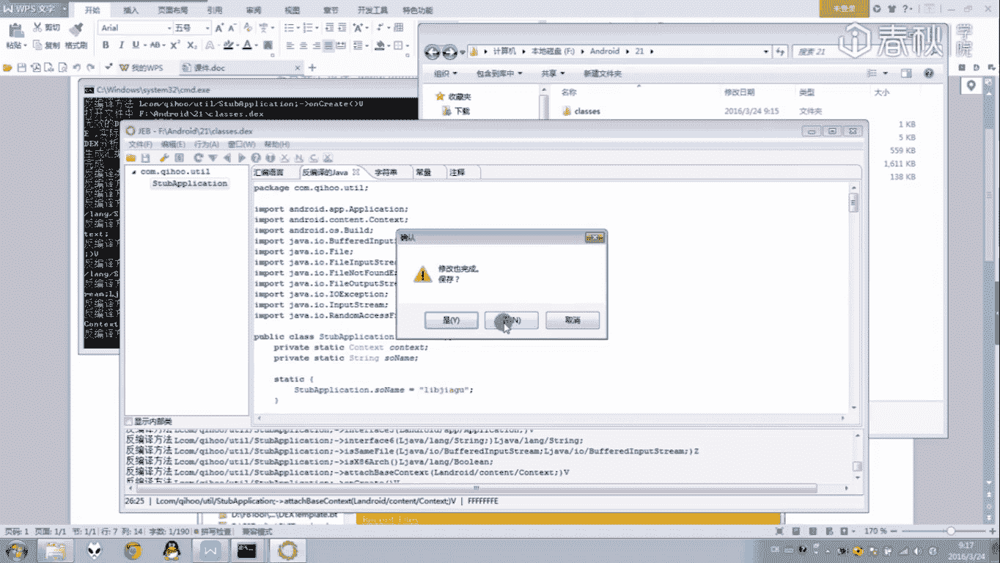

那另外的话得先来说明一下话，哎，我们要学好这一节课的话，学好这样一个d文件原件结构是非常有必要，而且是非常重要的。呃，这也是非常理所当然的一个事情啊。因为一些程序，比如说你你想要脱壳。

那么得先知道这样一个可这样一个自解码，对吧？它原本是什么样的一个形式嘛，才能把它给拖出来，对吧？自己自彼吧。

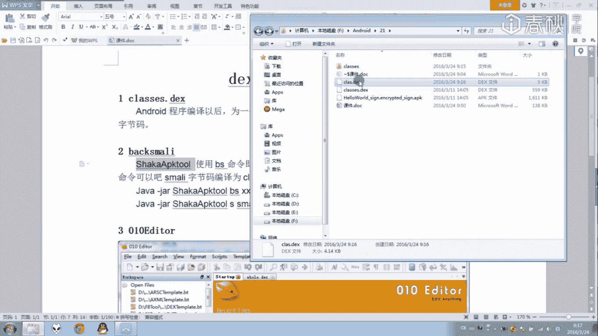

我出的个话哎，等一个程序把它解把怎样把全整个壳给解决完以后，哎，还不知道他是。可花呢就非常的烂了了。我们来看一下这样一个ds文件，它是什么样的一个格式。然。

那么这里我们就下来就要来介绍另外一款一个工具了。这这个工具的话，在安卓力3中也是呃在在脱壳中啊是选得最为常常见的一个东西了。呃，我们来打开看一下话。

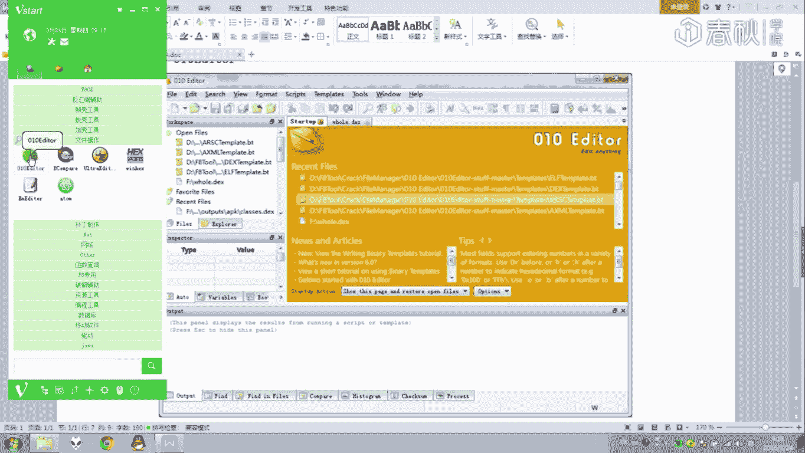

为什么说它非常常见呢？因为它呃除了它有强大的一个呃这个镜制编辑功能以外呢，那还提供了非常多的一个模板。我们来看一下它的模板的话是这种其实的这么多对吧？这些模模板的话可以在网上网上给下载得到。

那么这些模板有什么作用呢？就可以这这些模板作用，就是哎经过我们自己本身的原原来某一些操作，就能够完成这一个文件的一个解析，这是非常厉害的一个脚本的一个扩展。

那么这里我们就选择可以打开一个dash文件的一个模板，这个模板的话，哎就这些模板可以用来解析一个DEX文件啊，这是比常厉害的一种东西吧。我们来打开的这这个cus文件好。

现在是一个啊石用镜制的形式给加载过来的吧。然后可以然后一个运行一个模板，选择一个d模板。

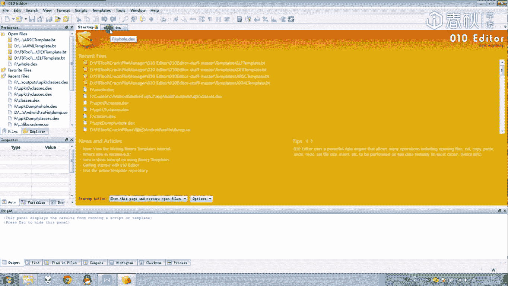

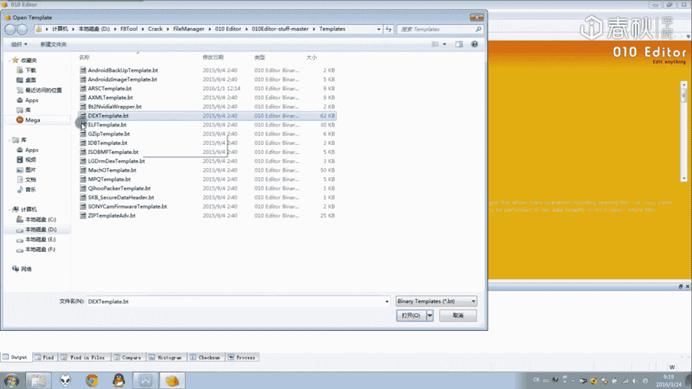

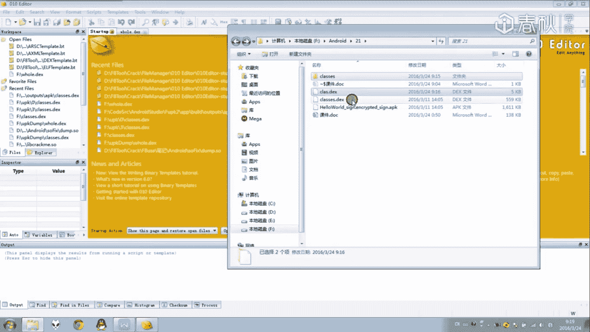

嗯。那么它这里就完成了完成了对整1个DX文件的一个解析，一个解码的一个操作。

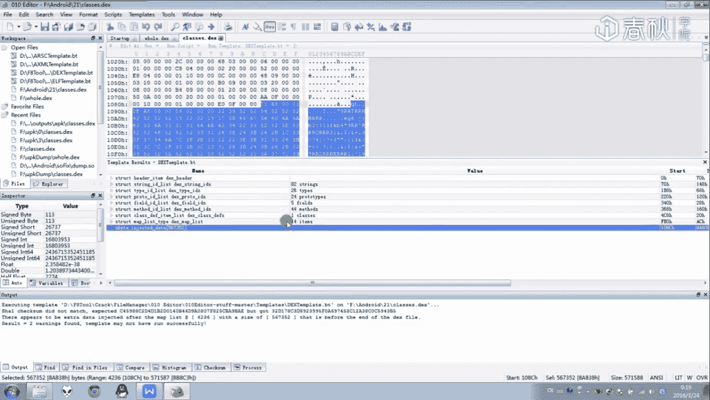

那，所以说在一个立项过程中，我们经常会用到这款工具，用这里可以看一下它里面里面的一些数据，对吧？看一下哪一些数据是冗余的，还有说哪一些数据是合法非法，然后对应的存放的自符串的一个地方在哪。

然后存放在一个DS文件的地方在哪。比如说哎在这里好看到这样一个strID里面点进去就是它存放自符串信息的一些地方好，有这么多。哎，就是。

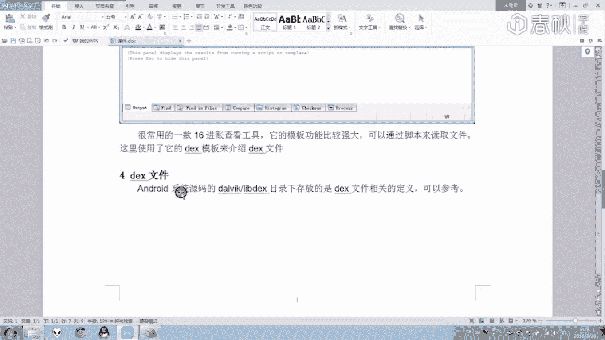

它存到自我创新息的一些地方。还有另外这一些就是它有余的一些代码，对吧？这些英的话证明它是非法的一些代码。这里这里这其实这一个话就是存放一个原始的1个DDX文件的一个压缩的一个呃辅辅助信息的一些地方。

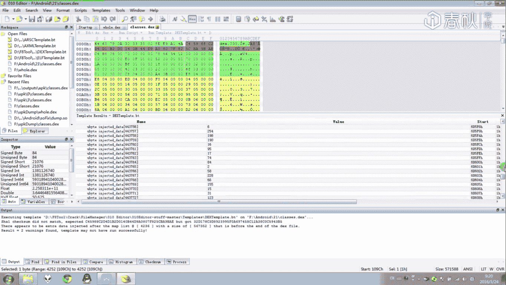

啊，这是这1个360的一个壳的一个代版大概的一个浏览。我们再来看一下吧。呃，虽然说我这另外我这里再来介绍一个呃DAX文件的一个呃源代码的一个地方。我们安卓系统它解析DADXX文件相关的一个。

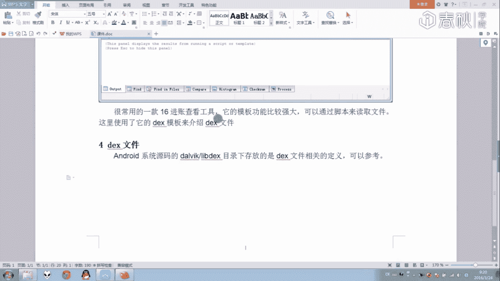

代码的话就存放在这个目录下一个d二位的一个luerDX的一个目录下。那么可以在安卓系统这个目录下的话找到对DEX文件解析相关的一些地方。好，那么从这里我们就从这里呃开始去进行对它进行一个解析吧。

首先每1个DEX文件，再加载到一个安卓的内存之中呢。

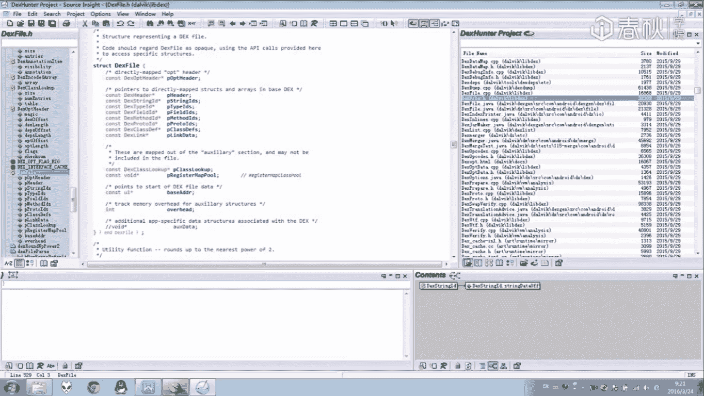

在在这大内存以后呢，它都是1个DDX five的一个结构体，就说明这是1个DEX文件。然后它里面有好几个指针就完成这一个文件的一个指向。首先是1个DEX1个head的一个指针。

这个head的话就对应着我们的一个啊整一个DAX文件的一个这样的一个开头，可以看到这里是这是1个DEXhead的一个结构了。可以看到这里面有几个参数啊。首先第一个是一个magage number。

就是一个魔魔术啊。后来标志的这是一个非常明显的1个D一和D一个X文件，它里面的话也是很简单，就是DEX035啊，就是这几个非常简单的一个魔术好。那，看一下这里。进过来看一下吧，嘿。

首先是一个八字节的一个魔术，定成1个DS035。那么它在内存中下载完以后啊，也是这样这样一种形式的一个方式的。安卓把这样一个电视软键它加载来之后，就直接mac键内存，然后进行一个解析了。

这是head中的一个魔术。那么我我们我们往下再来看一下吧，啊，对于这样1个DNAX head对于怎样怎样ge文件的一个起头。对大家再次我进来个图。

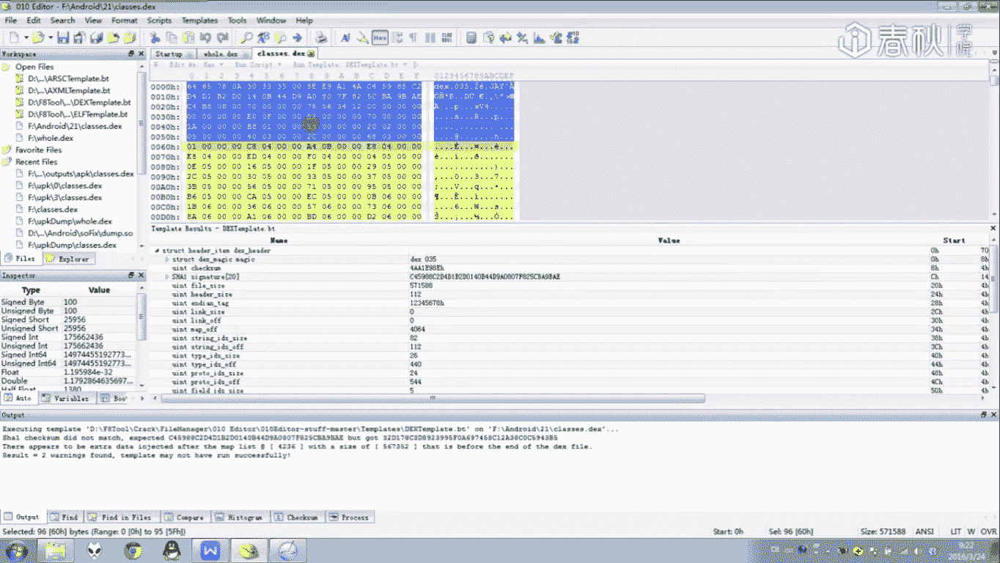

它里面有这么多数据。所以首先第一个是魔术，是不是用来标志的是不是一个合法的DDEX文件。如果是合法的话，那么它这应该是DEX035的一个形式。那么在下面就是一个确认。那么这个确认的话。

就是对整个DEX这上这样的一个数据进行一个求和。如果核实合法的话，呃，说明这个DEX文件的话是合法。那么再下一个就是一个hsh的一个值也是一样，对整个文对整个DAX数据的话进行一个啊求hush的一个值。

好，这接接着往下走，就是一个f size。那f size的话，它比较特别的话，就是存放着整一个文件的一个大小。我们再回头来看一下这个f size。好，比比如说这里标志的文件大小。

它是这么大的一个数据的话。

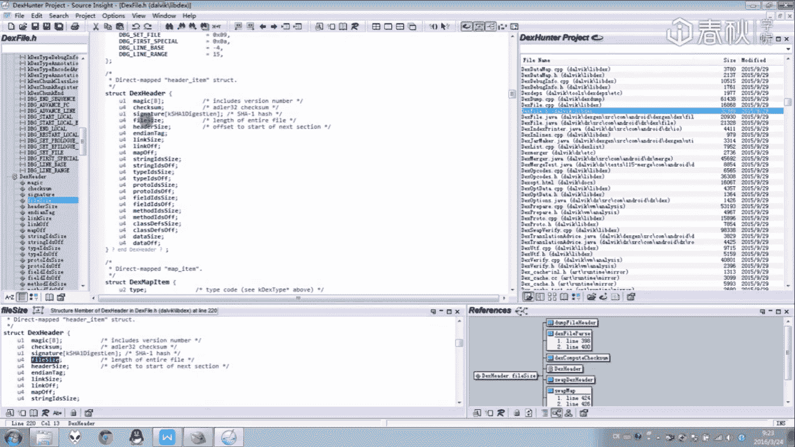

号是1个8B8C4的一个大小，我们往下拖一下好，对吧？是不是是不是呢就这么大，对吧？就是这么大。那么按卓系统它加载来的时候，就会把这么大的一个数据给加载来过去了哈。

那么这是表明整一个ds文件大小的一个头。

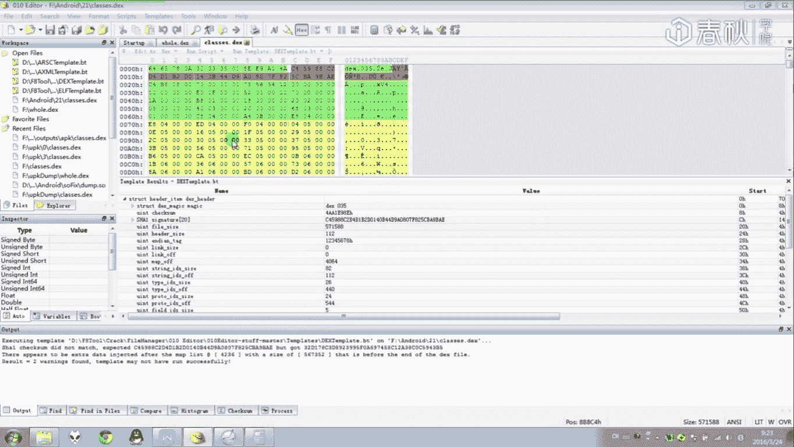

好，那另外还有一个head size  head size是什么意思啊，看一下of star session也就是说head size话它一般来说就是整一个DEX head整一这么大的一个大小。

但如果它跟但实际上它也有有可能没变那样大。那么它指向了一个地址的话，就是下一个呃节的一个起始部分。那么下一个节的话晚点再说。那么这里就是1个112，也就是整一个des文件的一个大小。

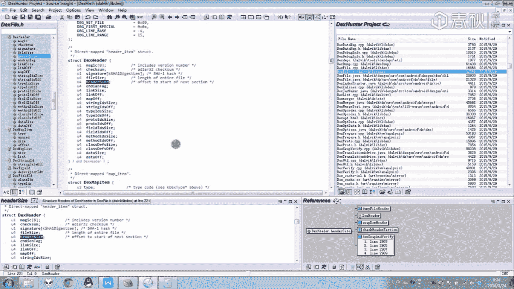

212转换过来就是70，就这就是这么多。这是DEX头的一个大小。

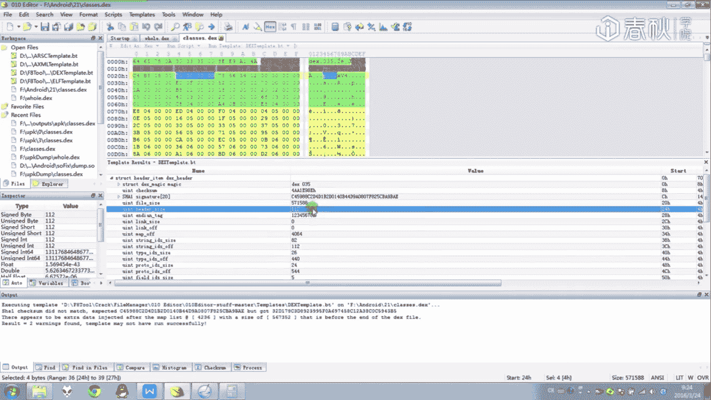

好，继下要来看。这个inddia tag tag，这里是表明着哎整个d文件，它到底是一个大专直学序呢，还是一个小端序。好，那么这里就不用管了。然后1212345678，像这种情况的话。

都是一种一个小端自学序，对吧？1234，然后5678是小端直接序来了啊。

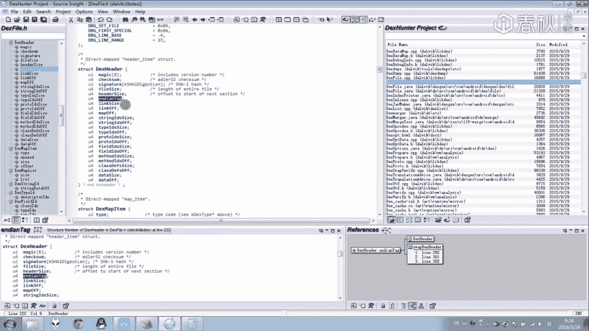

然后这里是link sign of set，那么从那么这这下面的几个就是作为啊对于d件最为基本的一些数据。然后下面的几个数据的话，就标志了它下几个下几个head的下几个session的一个偏移地址。

还有它的大小。我们从总体上看一下它的结构啊，一个size，还有一个link of，还有一个m of还有一个str一个s还有 of size，然后 size，还有它偏移 of set对吧？

哦这么多几个都是标志的一些大小，还有一个偏移的一个数据。我们来看一下这几个head，这一个head什么意思啊？

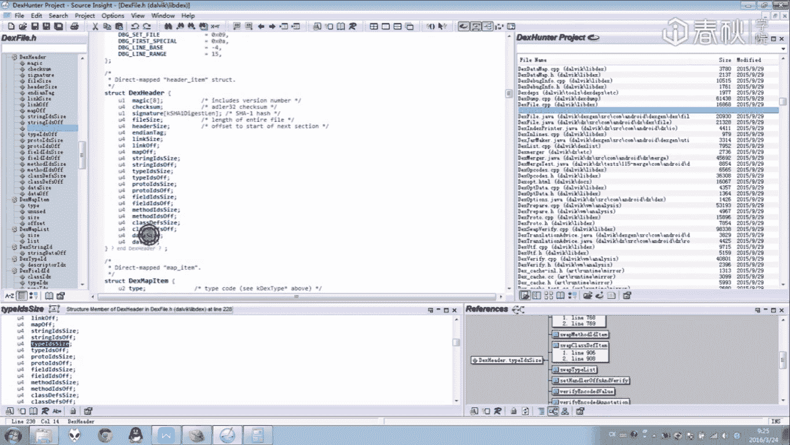

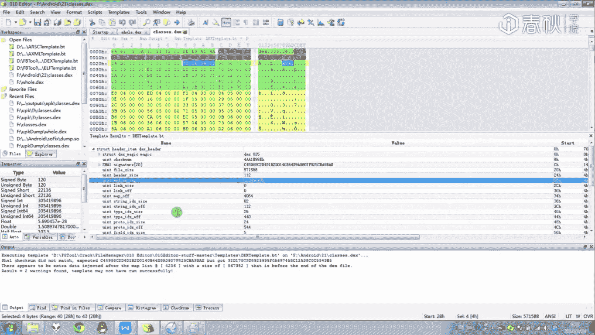

首先是一个呃str idea miss的一个东西。那么它对应着就是这里了一个str idea的side和 offset。

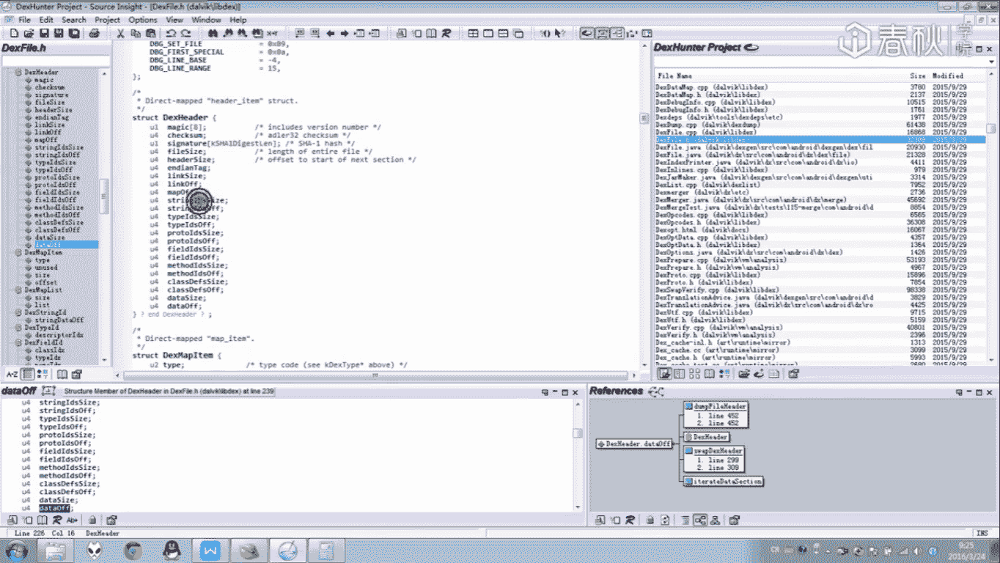

hello就是这样一个讯ID的ID的一个起始地址。从这里可以标明出来，哎，它在112就是0叉70的一个位置，它偏移这么多，是下一个讯ID的一个7始就到这里为止。好，那么我来回头看一下哈。

讯ID它从0叉70啊，从这里开始了。然后它大小就由这样这里这里一个地方给出啊，大小是呃52。那么这里直接弄加过去就可以了。呃，这大小的话，注意一下，大小并不是指16径至上的大小。

我是说这到底有这几个结构体，这里总共有呃550352个大小，0差52个1个strID的一个结构。你可以想象成这里实际上是一个 string案例的一个数组就可以了。那么这里这里就说明了这样的案例的话。

它的开始地址，这个数组的开始地址是这样一个地方。然后它总共有是这么多个结构，对吧？它是一个结构体，一个呃结构体，然后它有0。8个结构，这么多。然后下面呢也是类似的一个太ID的一个7实地址在440。

那么它总共有26个结构体。给并着来好。我这里其他也是一样，付少ID的话就对应着这个。然后这个fe IDD什么什么什么什么什么什么的class，对吧？好。那么这是一个head。

还有它与它对应的节相关的一个结构。那么按卓系统它将下来的时候，就会根据这样一个head来把对应的一些节的信息给map上去，给读取过来。好，介绍完这个一个head话我文们说到这里。

接着再来说一下下面的几一些节的一个信息。

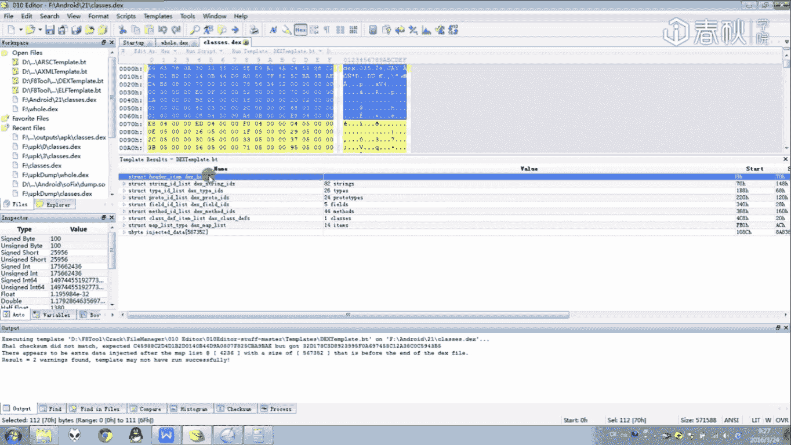

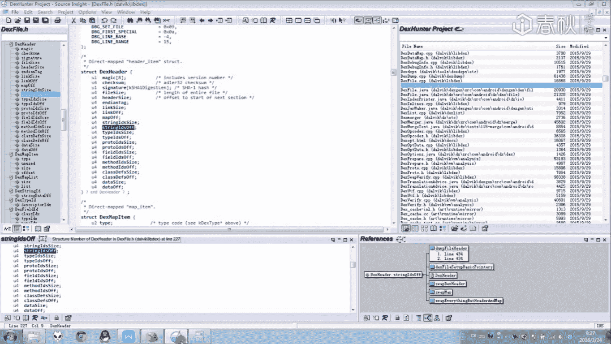

好，首先先来看一下，这里等由于在一个str ID中还有str of set中给m的一个str ID的一个信息了。时间 ID的话哎顾名思义就是存放一个字符串，就存放一个字符串信息的一个东西了。

我们来看一下这样一个str IDDS list的一个地方。回头来看一下啊。

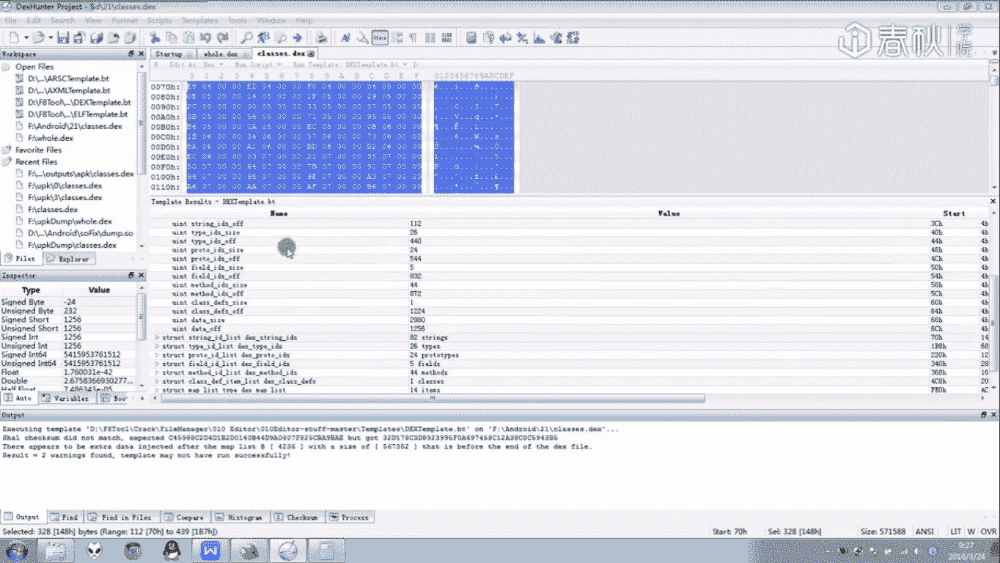

好，对的这里d的一个讯ID。它里面的结构很简单，就只有一个P，就是一个g data的一个off。说白了就是就是它指向的一个呃自由串输数据的一个起始地址。

我们来看一下，这里总共有82个str item，对吧？有82个str的ID的一个数组，组合，这里对应着有82个82个好，配你为1个0套70的一个地方。来看一下这8个ite，我们来滚一下。

它每个ite里面呢都是一个哎一个入色结构，也就是一个in性的一个在4个字节的吧。入势的话表明它在4个字节的一个了。那么MU2UE的话，相相对应的来说就是在两个字节占一个字节的一个东西，就是由嗯。

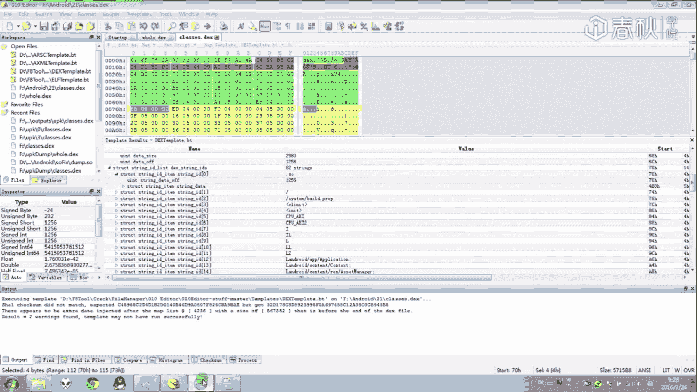

啊是它自己定义的一个地地方吧，也也是挺好理解的。NN4，然后N1N32。

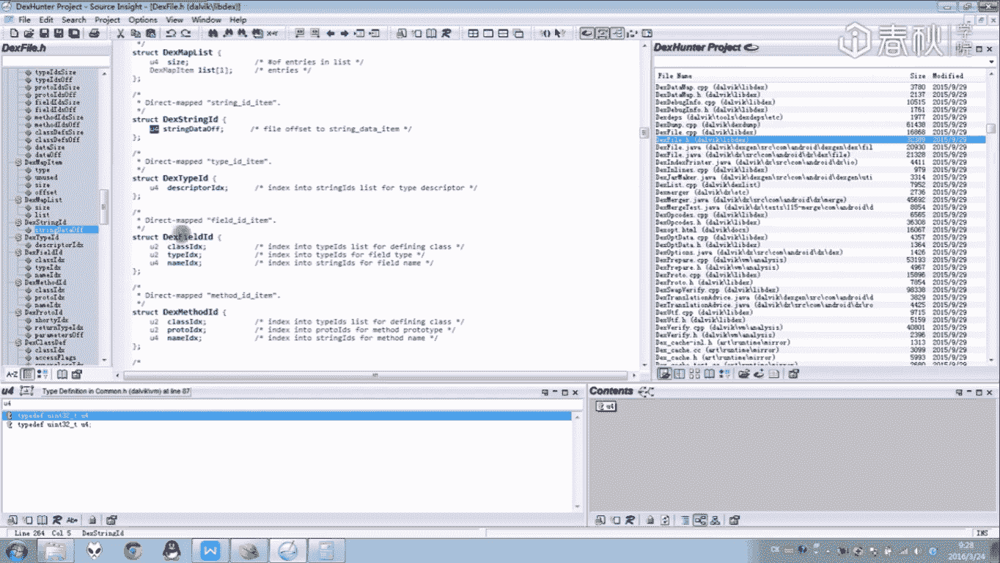

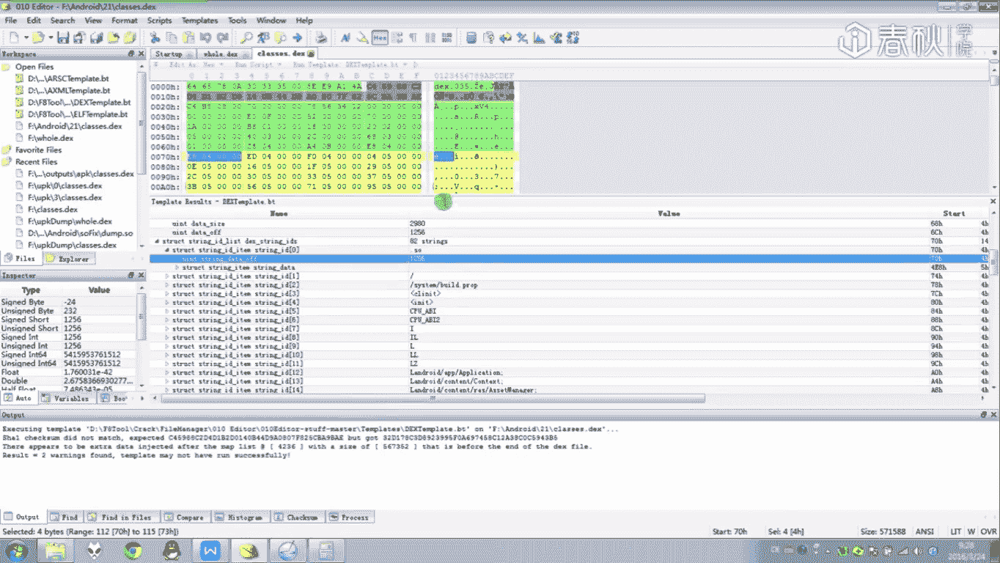

好，我们来看一下这每一个虚电脑的话，它里面就只有一个优势结构的一个东西，然后就存放着它的字符串的一个偏移地址。

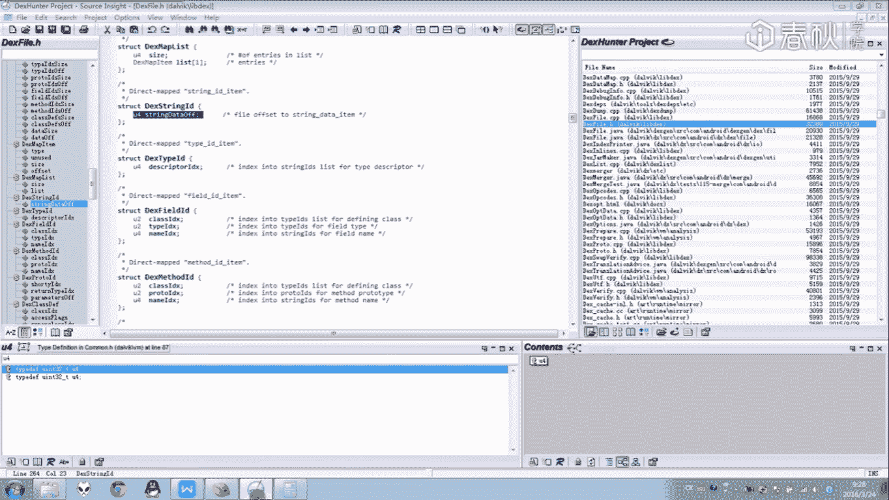

好，比如说这里指标到这里第一个ite，这一个ite里面它里面的一个of offset信息是一个03418，也就是1256。我们跳到1256的这样一个地方中的话，就可以看到它实际存放的一个字符串了。好。

跳过来，然后418。哎，看一下它实际存放的就是这样一个SO的一个。呃，信息了，那么对应在对应在下面的也是一样的好，它第三个字母串，那么它的一个存放的一个str data of现的地址是1个5504。

那么跳过来好，504跳到这里，那就是存放在1个CIIT的一个东西。那么这里的所有字符串都是以这种形式是吧？里面就都是以所有这种形式来进行一个存放的。好，那么这也是只像1个5565556好，也是一样。

然后只像这样一个。只上这样一个啊。呃，东西就是这样一个这串。那么这些字符创的指向的话也是呃比较特别特别，对吧？我们随便的来看一下这样一个指向上的一个字符吧。弄个简单一点的。好。

比如说这里的一个close好，可以看到。首先这个字上前面的话是一个标于它长度的一个东西，然后后面就是它实际上起始位置。然后最后的话它还还会有一个00来作为一个分割。当然这也没有的话。

也可能也没有什么关系，但这样还是有。那么前面指向着它就串长度的话是一个比较特别。因为这个并不是普通的一个圈，或者说in，这是一个叫做一个ULEB的一个数据。

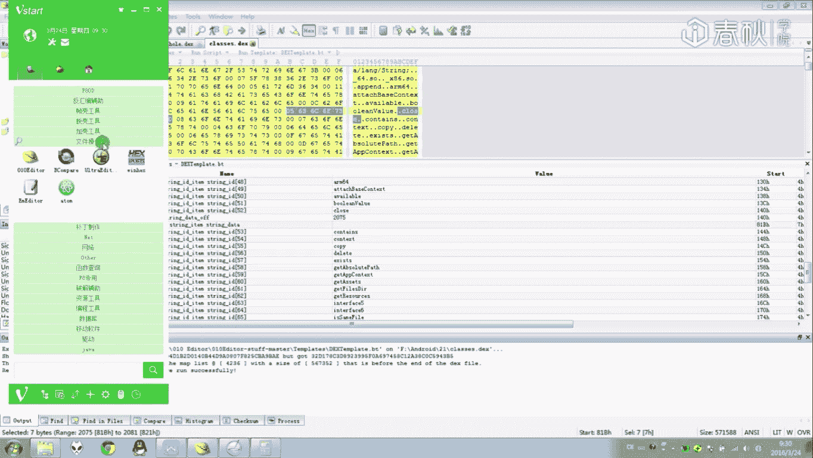

这是一些叫做1个ULEB的一个数据。那ULEB它什么意思呢？平常我们的一个int。你像我们我们的硬头都是大用4个字节，然后它从低位开始就会表为它最低位的一个数据吧。然后每一位这片都都会用8倍。

那么ULEB的话，它比较特别，它很s亮的话，它美它就是它是一个变长的一个int数组。It常很 in。好，我们来找一个长一点的看能不能找到一个超出它默认长度的。好，那么这里没有这里没有没有办法找到的话。

去这个来进行一个说明吧。那，这没有办法找到，我们选的短一点的也行。呃，ULEB它顾名思义就是一个变长int了，它占用的位置的话就是有它可能占用一个字节，对吧？如果小的时候它占用一个字节。

如果多的时候最多可以，它可以占用5个字节。那是为什么呢？那是为什么呢？我们知道对于每一个int来说，对于每一个int来说，它都是肯定会占用4个字节的，但是看一下这些字符串它就这些字符串。

实际上哎它并不可能每一个都需要用这么多字节数量来表示。比如说这个字符串的长度，它只用这1个ED哎就能够给表示出来啊。那为了节省空间的话，大哲都会用使用这样一个变成int来存放一些数据的。好。

那么这一这个int它是怎么回事呢？我们来看一下每一个int的话，它最多有32位，32个只减32位。好，12345678第一个字节。第二个字节。第三个之接。好，第四个字节硬桃话它至上四个字节都像这么多的。

那么我们有没有什么好的办法来对它实现了一个压缩的一个。压压压缩的一个作用呢，你们可以看到，实际上这里有有些位数的话是我们并不需要使用的。好，那么这里UULEB的话就使用了一个比较机比较取巧的一个方法。

就是说它每一位呢就只使用。比说每一个字节，每个字节有8位，有8位，可以看到每个字节有8位，它都不全部使用这8位，它只使用一个第7位。第七位。好，我第七位哎那么这么多，那么这明这里一个字节。

它最多就能够表示这么7位的一个数据。那么最高一位是什么用啊？哎，最高一位有什么用呢？这一位就表明了它是不是他下面还没是不是使用下一位的一个数据了。比如说哎当一个in一个in。

它超出了一个0叉7F的一个数据的时候，那么在那里假如说是80，假如说是8080的话。呃，80的话它本来是这个样子的对吧？对于80的话，它对于一个in来说，它本来是应该是一个样子的。

对ULEB来说就不一样了。因为ULEB的话，它只使用第7位的话，那么第八位它就没有办法表示。那么这第八位的话，它就要推迟到下一位，推迟到下一个自己码中去了。同时就把最高位置为一。表明他要使用第二个字节。

要使用下一个字节。好，那弄过来就是像这种形式了。好。把一个T高位推到这里，然后同时把一个这边计成机。好，那么这里就是它表明了一个。这种情况就是他一个呃graB的一个情况，对应着80。

实际上这也是非常好理解的对吧？比说这里有这么长的一段数据，假设啊我们把这一个给转成去LEB的话，就是把第。前七位哎，放到第一个字节中去好，这是前七位看一下啊，接着因为他他找了一下。

发现到第八位以上还有其他信息。好，100以上还有其他信息，他就把这个信息给推迟到下一个字节中去了。好，这也是第一个字节啊，第一个字节同时它把这个字节的最高位置也支成一。然后先接下他就把呃给推迟下来了。

这里基本上存放这下一个字节，下一个字节它也一样，同样存放一个最大7位的一个数据。那这里是1234567好。那么这里他就把这些数据给存放到下一个字节中去了。然后他他他再找了一下，哎，发现发现它下面还有。

然后他就把最高位给制成一了。然后等于他要使用下一个字节了。好，下一个字节，从这里开始的12，然后34567，同样也只能存放七遍的一个数据。好，这是下一个自节的一个数据。好，再找一下各位还他有好。

继续继承一，然后继续使用下一个数据。然后就是123和4567。好，这几个就放到下一位中。高位一样，再制乘一。然后这是1个1234，最后只有4个字节，那么最后它就只需要使用这个字也好了。

所以说第五个字节的话，它就最多就只能使用这个第四位的一个数据了。那么它在解析的时候也是一样，先把这几个放到最低位中。如果发现它的高位就是第八位是一的话，就使用下一个字节的一个数据。好把这个字节数据的话。

就移移动到对应的地方，哎，如果再然后再来检查一下，进行相应的一个移动一个扩展。比如然后这里因为我们的数据不是这么别扭的。好，比如说只是1111，然后第二个字节的话是1个111，然后是12345。

比如说是这样一个数据给转成1个ULED变化，那也是一样的。啊，这里的第七位是过来好，这里进行了扩展。咖味就制成一。然后下面也是一个7位一，然后234567。啊，这是一个7位，那么发现后面都是零了。

不需要了。那么这里这样的一个数据以ULEB的话，就是这样两个字节就能表示了。那么这里就是一个变成硬的的一个作用。我们来看一下这些字符串前面的一些变成in。

就是这个数据啊这个数据因为它并没有超过1个CF的一个范围，所以这里的EA的话。对啊，EA的话，它并它的高位并不是一个E的话，么这里EA就是直接能勾直接读出来啊，它长度就是这么多呃。

6那么对应的这个字符串的长度就是这样一个20的一个一个值。好，这是是它的一个自串的一个指箱，还有它ULEB。那么这里就是一个str data data of下指下一个字主串的一个系地址。好呃。

那么这里就是一个str ID list的一个数据。那么在str ID list以后，那下面的话还有一个t ID list。那么t at list的话，在这里也指明了一个size，还有一个offset。

这就是它的一个type IDD的一个截一个截区数据。我们看一下这个截数据的话，它到底存放了什么信息。下面的一个上面的一个 stream结的话存放在 stream的一个偏移。那么tap的话。

按按照我们的一个认势来说话，它就是存放着一个tab的一个偏移了。就是它的话它里面存放了的都是一些啊一些啊类型的一个定义。比如说inter的一个定义呀，还有一些呃stem啊。

什么什么一个一个呃文件类一个格式类型的一个定义了。转过来看一下啊，好，一个他 ID list转过来发现里面也是一样，和 string一样，非常简单。

就是一个优势的一个结构来存放一个呃discript IDS。那么这里存放的一个数据框就是指向一个 string的1个ID了。我们来看一下什么叫指向一个啊。比如说这里每一个的的话。

它里面就只有一个in型的一个一个优势大小的一个数据。比如说这里的优势大小数据是07，这个零什么意思？这就对应着来说就是它在第7个数组。比如说第7个 string的一个位置就存放着我们这里的数据好。

我们转到第个对应着就是一个I的一个数据。那么对这个来说，它选址也是一样的先取出里面的值那么里面的一个ID的一个值的话，就对应着 string的个IDX了。好，那么这里比如说这个为的话。

那么它对应着 string，它就指向一个IEC的一个数据。那么为的一个数的话，就指向一个的一数据。好，转过来。选了一个EE1C就是对于你个。呃，2828哎看一下是不是一个excion的一个数据，对吧？

那么实际上它安 list史的话里面存放的就是对应的一个str ID list的一个信息了。你可以看到的话，唉你这么这样这样一个tact，它也是样子上一个 string的一个东西。这里就是一个t at呢。

它是一个对时间的一个指向。ch的都是一个str ID list的。然后在下面再下一个结构体的话，就是一个phot的一个结构。photo结构又是什么东西，我们展开看一下的话，可以从这里大致来看一下。

大致来看一下，这也实际上就是存放的一些函数的一些呃定义，函是的一些描描述。比如说这里就表面呢是一个外函数的一个signature，然后这里是外函数里面有一个参数 find一个描描描述。

这里呢pho的话就是存放一些函数的一些定义啊之类的东西。我们展开看一下，就会发现里面唉展开看一下，我们也可以给大家看一下，只像一个photo IDS哈。

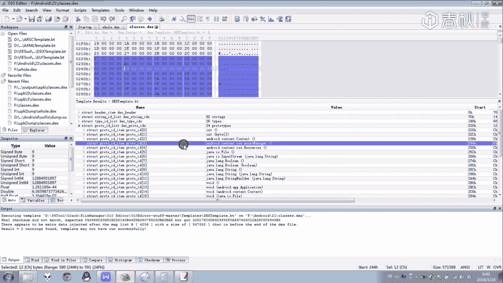

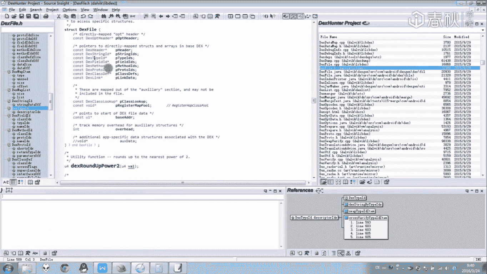

你先是一个st IDS，然后它是它一个s里的话，就是我们前面经常用到的一个呃描描述符了，然后是一个返回类型的一个描述。然后它是一个参数的一个套多算参数，然后对些单这些参数的一些描述符。

你如说找这样一个呃int型int的一个返回的一个地方来说，那么它节写就是搬出那边I了，因为它没有参数，后面就不用跟了。然后是它返回的一个字节，返回就有个int。

然后它没有参数这里的of pair参出的偏N地址就是零了。然后对应着我们找一个有参，有带一个布尔参数展开来看一下。好是它的简写是一个一个呃ZC的话是一个反回类型是LZ对吧？LZ返回类型是这一种样子啊。

L加个，然后它里面使用的是一个么东西，然后它返回地址返返回的一个东西就是一个波啊，然后它里面带有一个参数是一个exact参数就是一个，它参数偏异地址这么多地址这么多。

转过去哎可以看到它们这就是对一个参数表述这一个参数它大小是一，然后它然后后面等紧接着就是它的那些参数的一个list。呃，这些历史的话也是一样的话，存放的是一个太ID的一个指针。

那么在肽ID为23的地方存就存放着这样一个ja，就是对应着这里的一个互头ID的一个。诶。一个p paragraph的一个呃对应的一个类型。找一个多一点的一个类型吧，没有两个参数以上啊。

比如说这里返回类型为一个word，因为它里面有两个性参数的，展开来看一下的话，那是一个word，然后后面是两个L的就是一个结构写，一个op，有个二字 object类型的一个写了。好反回类型是word。

然后它的一个参数有那么多。好转过去看一下，它里面有两个一个有两个参数，这也就是二了。好，每个参数的话就放到这里。嗯第一个参数是个序类型，它就由肽IDV19这地方进行了描述。好。

我们来回头开再看一下肽IDV19的地方是不是卷了，这肯定是卷的。因为它是这样一个个指向的哈，指过来肽DV19哈str好，这么这里就有有一个指向来确定了。好，那么下一个也是一样，指向为R它第十9的一地方。

好，那这里就是一个pho头 IDD它是有这么几个方法来进行一个指定的。好，再来往下看，下面的话就是一个fieldd IDD的一个结构体了。嗯，好好。

这个IE它同样也是有三个东西来决定的是一个classRDX，然后是一个tIDRDX，然后是一个laRDX。再来看一下话，它是描写某一些buil的一个子。build就是一个什么意思啊？

就是它的一个类型哈对应的一个名称的一个描述符了。对吧我这里比如说这个field它它它就表明了，哎在这个其有一个application到application里面的一个SO lamp的一个参数。

一个这样一个field，它是一个适应的类型的一个东西。我们来找一个实例来看一下，这样理解可比较难。好。转过来。找一下它是在一个呃 applicationplication里面呢。

这有一个SO land的一个属性的。我们来回头看一下SOland。

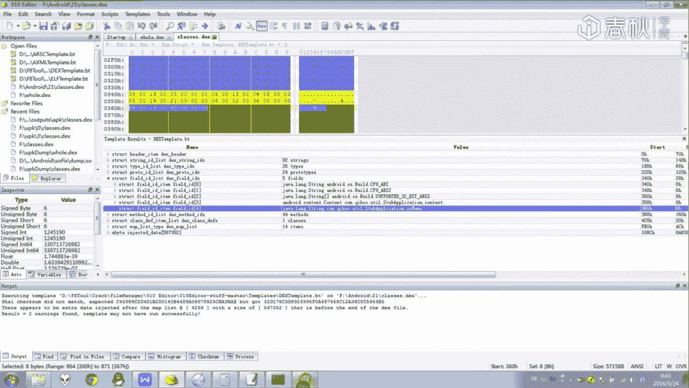

好，就是这里了就是这里的。好，它是一个讯类型的，哎，它就这样意思了。它SO链在这这个类里面，它是一个序类型的一个东西。那么这里的fe的话就是描述这样一种呃东西了。

就是这样一个类里面的某一些呃fe的一个相关的一个信息。

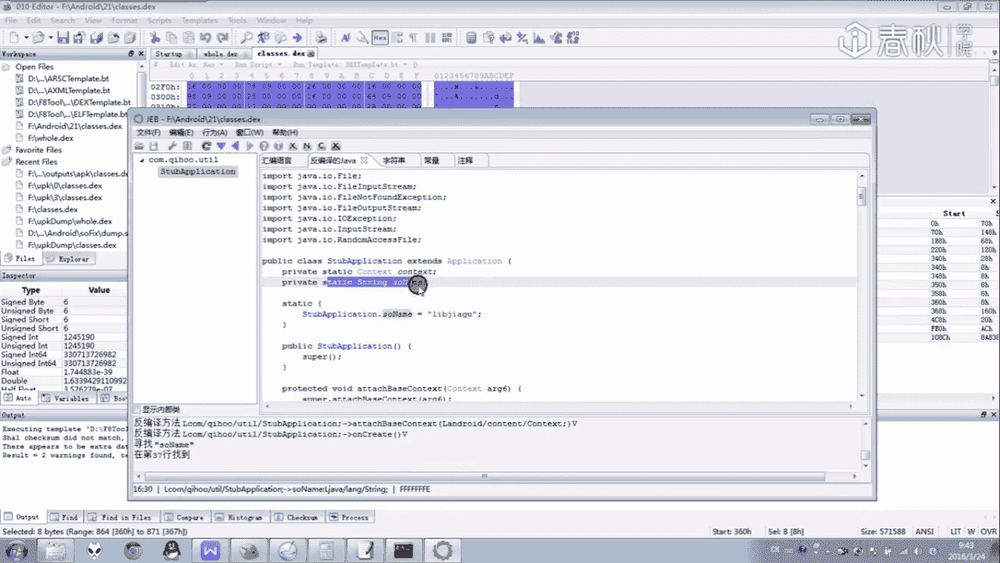

来看看一下它就有这么一个几个信息吧。首先是它对应着一个class IDX IDS的话就是对应就是一个class的一个inex的一个地方了。

然后t的话就是指就是指向一个的一个字串刚才已经看到了是一个序类型了这是一个序。后的话对应着就是这样一个field的一个名称了。这个话相对来说比较简单，就是一个一个。

那我这里就是这样哎这样这么多东西来构成了每一个feel的一个指向一个属性。我这里的话就是一个，比如说哎那么这个feel的话，它就是一个序的一个速度，名称就这样一个样子，它是在这个类里面的哈。

那这里也是非常好理解的。然后再下一个就是mettter IDS啊，从名字来说，就是知道它是描述一个方法的了。我们展开，随便找一个方法来展开来看一下。

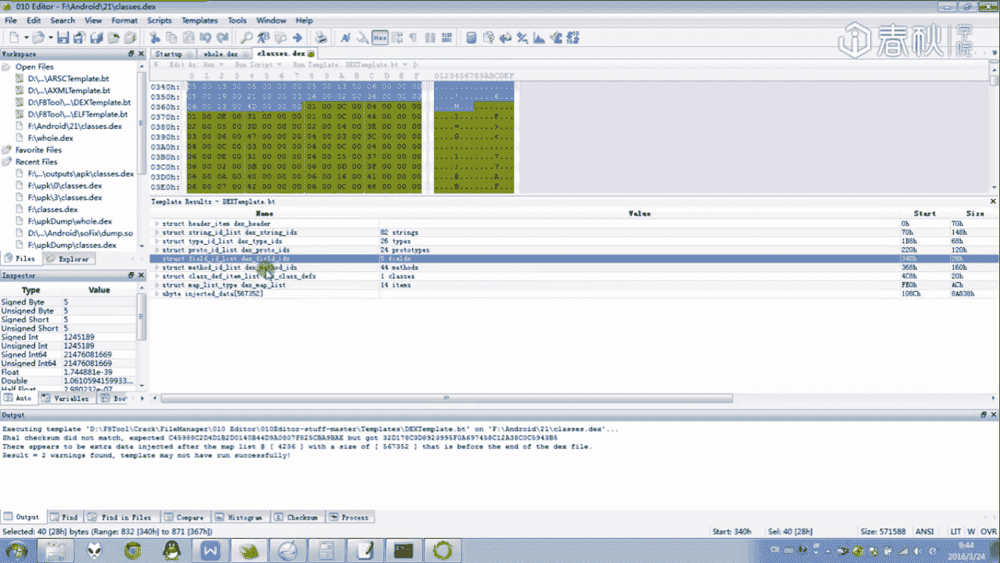

再找点是，从这里也可能找到。

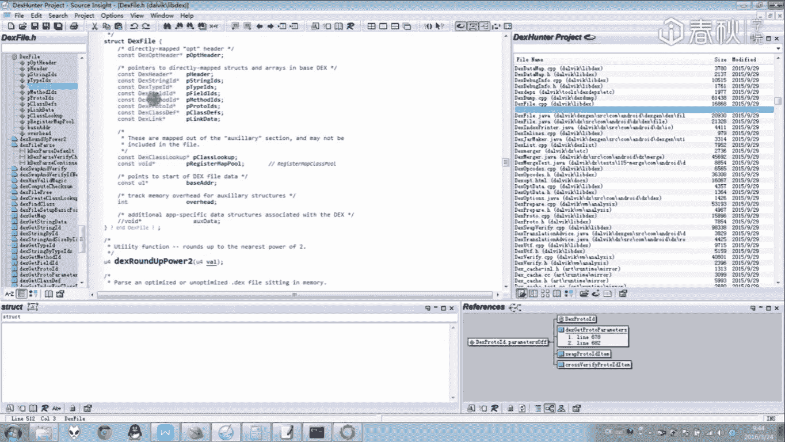

好这里plus然后I迪跟LID。好看一下class的话，class就不用说了，和刚才一个太一个field IDX是一样的。然后是个photo IDSpho IDX的话前面已经介绍过了。

里面是存放一些class里面的一些整个函数相关的一个信息，也就是函数类型的。然后比如说in然后什么对吧？那么这里整个class的话就是根据一个pho IDX来描述它的一个参数，还有返回类型的。

然后lan的话对应讲一个class一个。然后那么这个结构也是非常好懂的一个东西，对吧？classus对应着class的这么一个东西，然后它的一个参数啊，反子是这样描述的。然后的名称这就这种形式呢好。

那么这里就是一个measure，然后下面呢就是一个class DF的结构。呃，那么classDEF结构和存放所有类的一个结构。那么这比这里比较简单，就是只有一个类了。那么这个这一个类的话。

它对应的一个index就是0就就是一个6了。呃，注意一下，这class IDDX的话它不一定是从一个零开始对吧？它可能从其他地到比如说789开始，然后它也不一定是连续的。

虽然说class dF的话就不并不等于class IDXclass并不等于个DXclassF的话，它是存放一个class相关的一个信息了。比如说这个class就存放着一个IDX为6的一个信息。

这么的IDX为6什么意思啊？其实这里就是对应的一个 IDD为6的一个信息了。好转过来。对吧对应着他他ID为6个信息。实际上一个class index the话。

它肯定是可以从一个t1个RDX中找到回来的。好，那么这里就是存放在一个差相关的一个信息。比如说它的一些访访问标志服务啊，还有它的一个diffffer of啊，然后下面的话就是一些呃pat取的一些数据了。

比如说自串数据都是存放在存放在这里的，存放在这种地方的。那么下面的话哎下面一些数据的话并并不重要。下面的数据并不重要。下面自己看的话就可以了。我们这里就就来介绍一下一个d的一个文件格式了。

d的一个呃class的一个格式。好，转过来。充电码就可以这在在I这里找到t bug格式，然后里面有这么多啊这么多，还要cIDS，然后像它的一个法访问的标标志符，然后它的一个负类的1个IIDX。

系个 interview 嗬，即系之 like家。一个anunr然后然后是一个class data。好，那么一步一步看过来的话也是一样的。副类是一个application的一个类。

minterface for spice，这些都可以看一下啊，可以看一下。那么最后呢最后的话就来看一下这样一个class的一个转过来class data股比时义就存放在这样一个一个class的一个实间上的一个数据了。

跳过来就是这样也就这样形式了。classtic话它里面都存放了整个class中，它到底存放了多少多少个fi，然后又存放了多少个方法。它都是这样一个弄起来。那么这里的每一个数据的话，首先是一个4个。

东西的1个ULEB128就是的一个变差硬存放的一个数据，主要是一个cfi的一个size，然后一个in field size。如果这前有的话，哎得一个指答辩方法，还有一个real方法的一个指明。

如果有的话，哎那么就会加下面 patchch上相应的一个东西了。比如说这里它的t feel的话是有0差2的一个大小，那么下面就会跟着的是一个呃一个一个 set的一个数据了。打开看一下，它里面有两个好。

那两个指定呢就是一个在QIDX里面，还有它访问权限了。QIDS别如说fe IDDX对零3的话，对应着就是这里的一个零3的一个数据啊，然后就是这么一个ge。嗯，这也其实也这样一个一其实上对应过去的关系。

然后下面就是就是它的一个访问权限。好，那么对应着个 ID的话应该是一个。由于没有，那么下面就不跟着，然后后再往下看的话是一个d，因为它是，它里面有结构的话，它就会把一个me结构给放下来。

那么同同样的一个也有它它就会把一个vis的话给放到后面去。这样一步步跟过去，这是一个变长的一个结构，那是一个变长的结构。那是安卓，它设计的这设计的比较巧妙巧妙的一个地方了。

我们来看一下一个racal打一个方法的一个主体，方法它也是一样，哎也是一样。它里面走过去以后，它存放着一个方法的index也是方法的名称。从上面的这个表中可以查到一个ms IDD可以查到。

这下是它的一个访问权限，然后是它的一个代码的一个偏移地址。代码偏移地址哎，从这里可以找到一个它使用到多少个计存器，那后它里面的一个in一个指令有多多长。那么下面就是存放每一个指令的一个长度。

还有它是是不是有一个trive啊这些数据。那么这些数学话比较琐碎比较琐碎，这也不好介绍。那么到后面留留到后面实战的时候再来介绍啊。总之啊那么整一个DXS文件的话，就是通过这样的一些啊不不断的一些指向啊。

一些什么什么来不断的完成这些构建。那么最基本的话就是这样1个DXS head了。这个head的话指向他们后面每个每个节的一些数据。然后这是一个的一个节就存放着一一些描述符。

IDS的话就是存放一个程序的一些呃可以用的一个硬的类型啊之类的一个t然后复合ID的话就是一个me的一个。定义啊一个方法的一个名称的一个一个struct，然后是一个fe ID哎。

一个每一个 field的一个属性一个me还有class。可以看到这样一个classF在整个DEXX文件的话一步一步对应过来，唉，可以看到它是呃每每一个地方都是非常比较简单的。

然后它每个地方所描述的信息都是各种直来直去啊，但是他描述的确实能够描描描描述描描述的非常清楚，这是一个非常高效的一个性一个东西啊。因为他这里就是每对每一个数据进行了进进行了一个打包。

比如说他就算情况呢在里的一个节中，然后派就是这样一个节中，然后me就放到这么一个节中去。那么这里的一个一个结哎，就构成了怎样整个DEX文件了。那么按安卓系统它加载的时候。

就会用用到这这么这些结合数据来把这些结合结描述的信息给一步一步给还原过来。我这里就是整一个Ides的一个文件。

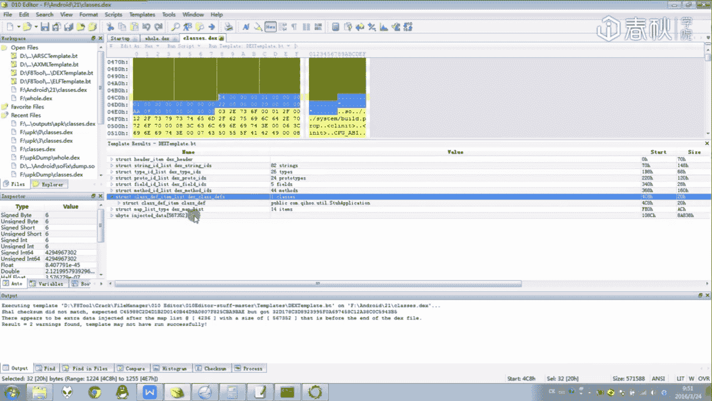

嗯，想要看他看一下安卓系统它实现的代码的话，可以在这个地方来找一下这个LBDS目录下。那可以看一下这里有这么多的一个定义啊，一些定义一个结构体的定义，还有还有一些取求方法的取求函数的一些定义。

那具体不懂的话，可以从这里找一下。你这个还是算了这个结构体还是属于比较简单的那种吧。🎼好，那么这一节课练话话就到此为止了，谢谢大家。🎼。

。

