# i春秋零基础入门Android逆向 - 课时23：Android动态代码自修改原理 🛠️


在本节课中，我们将要学习Android中动态代码自修改的基本原理。这是理解许多APP加固技术（如360加固、梆梆加固等）的基础。我们将通过分析DEX文件结构，并动手修改一个简单APP的字节码，来直观地理解程序如何在运行时改变自身的执行逻辑。

## 概述：动态修改的原理

上一节我们介绍了DEX文件的基本结构。本节中我们来看看，加壳程序是如何利用这些结构来实现动态代码自修改的。

对于一些经过加固的APP，反编译后可能看不到真实的代码逻辑，程序却能正常运行。这是因为程序在加载时，对自身的代码进行了动态修改，将原始的指令填充了回去。这种技术的基础就是代码自修改。

## DEX文件中的可修改结构

那么，DEX文件中有哪些机制可以被加壳程序利用呢？我们回顾一下DEX文件的内容。

DEX文件的入口是`DexHeader`。其内部包含一个`ClassDef`结构体数组，存放了所有类的描述符。每个`ClassDef`中有一个关键数据`class_data_off`，它指向一个`DexClassData`结构体。

`DexClassData`结构体的第一个参数是`DexHeader`，它使用ULEB128编码存储了字段和方法的数量。根据这些数量，会初始化后续结构体的长度。


以下是`DexClassData`中方法相关的核心结构：
*   `DexMethod`结构体描述了方法的属性，如访问标志（public等）。
*   其中包含`code_off`字段，这是一个偏移地址，指向`DexCode`结构体。


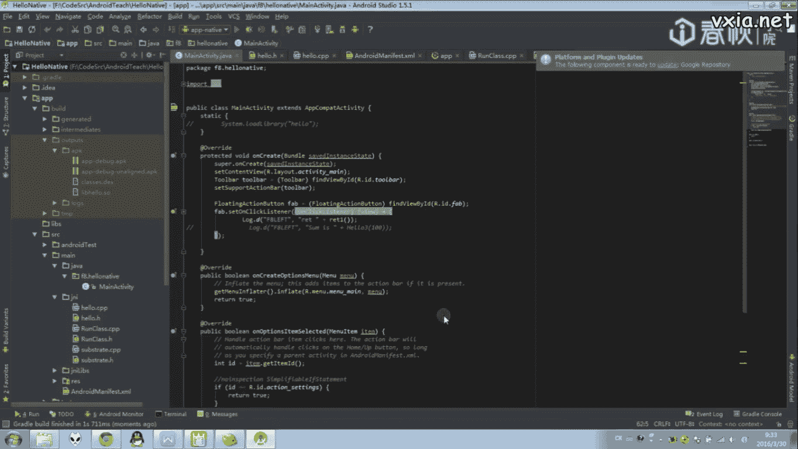

`DexCode`结构体存放了方法的具体实现内容，例如：
*   使用的寄存器数量
*   参数数量
*   指令集的长度 (`insns_size`)
*   指令集的真实内容 (`insns`)

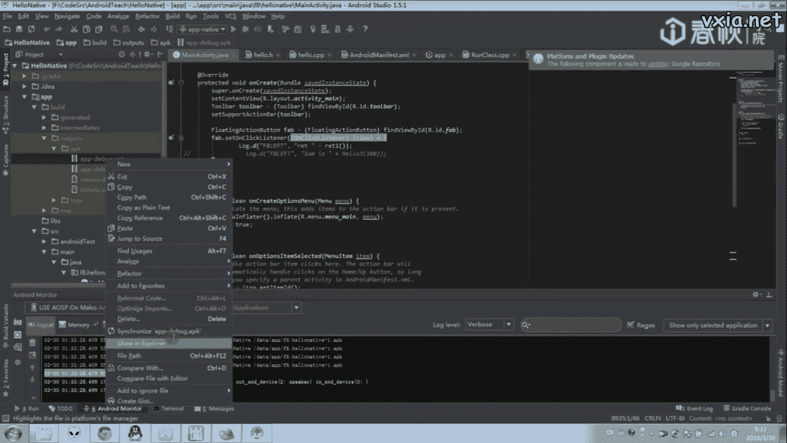

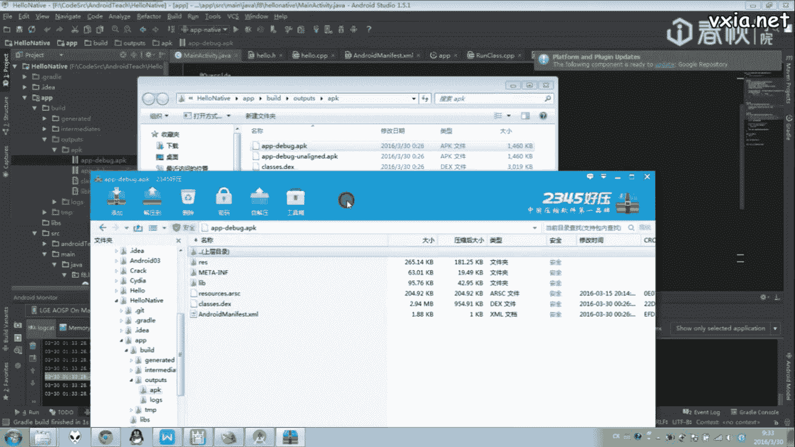

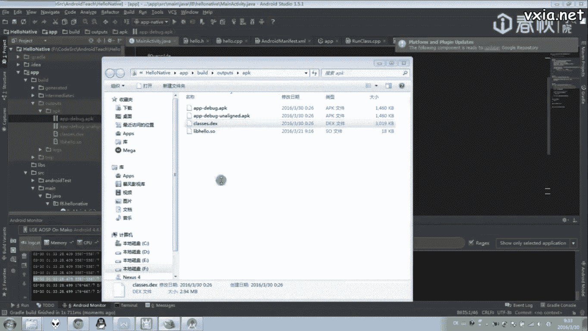

**核心概念**：程序运行时，Android系统会动态解析`DexCode`结构体中的`insns`数据来执行指令。所谓的动态修改，就是在程序加载后，找到这个结构体，并修改`insns`中的指令内容。许多加固软件（如阿里加固、梆梆加固）的保护原理正是如此：将原始指令抽取出来，在运行时动态释放并填充回`insns`中。

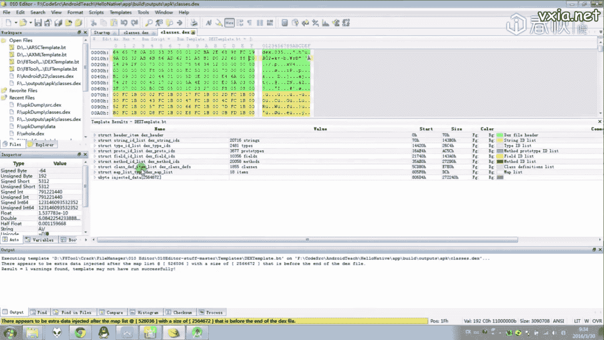

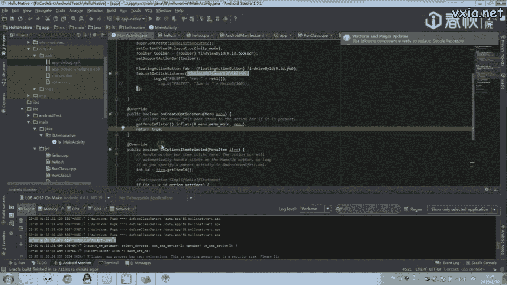

## 实践：修改一个简单APP的字节码

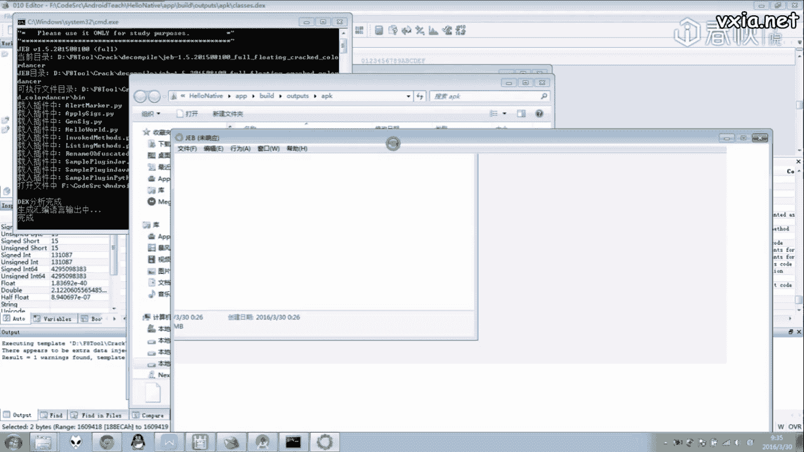

为了验证原理，我们通过一个简单的实验来修改APP的字节码。

### 目标程序分析

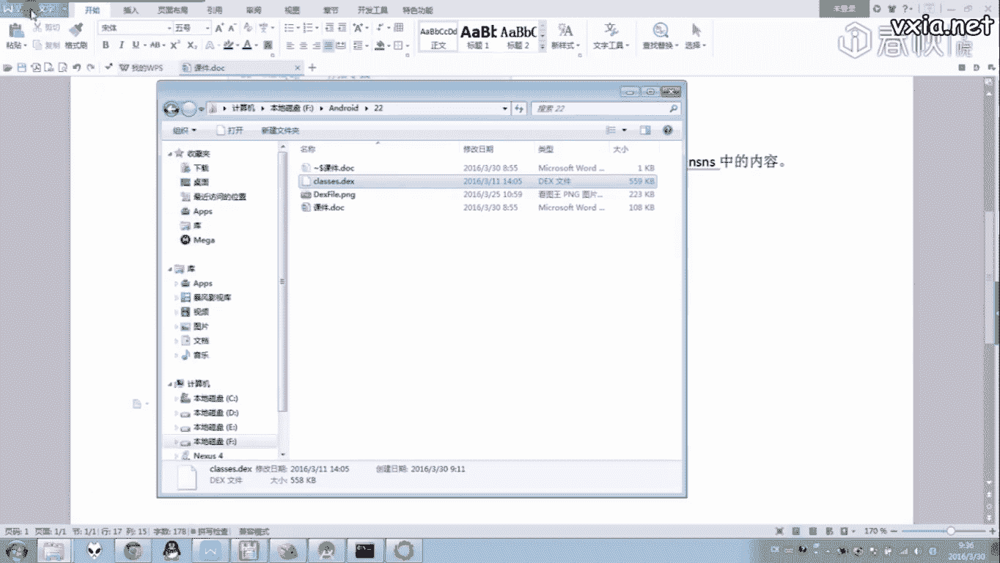

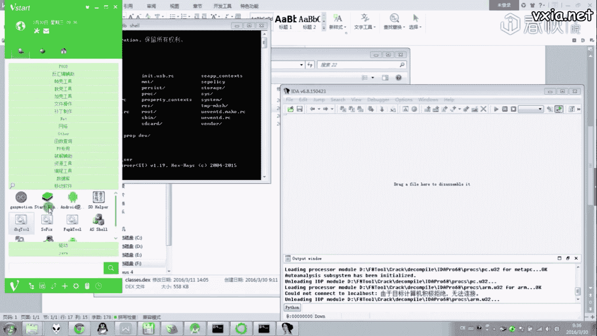

我们编写一个简单的Android程序，其中包含一个返回整数1的方法`returnOne()`。

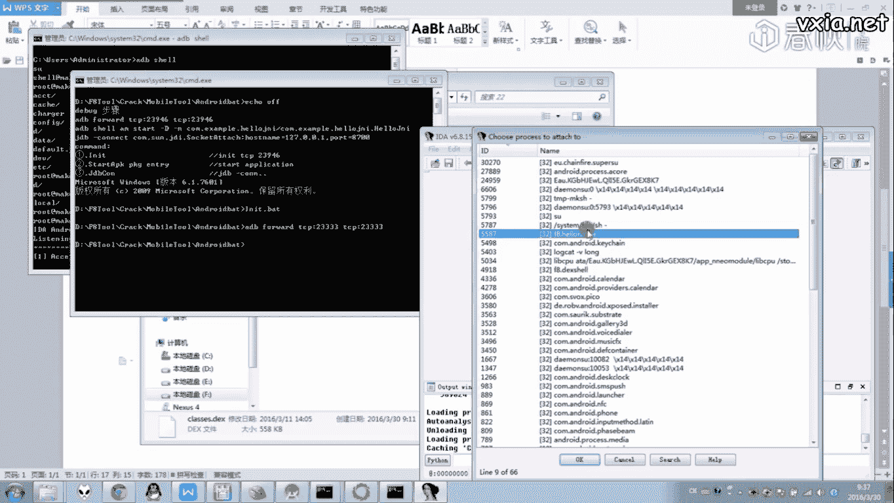

其对应的Dalvik字节码关键指令如下：
```
const/4 v0, 0x1  // 对应的操作码是 0x12, 0x10
return v0        // 对应的操作码是 0x0f, 0x00
```
这段代码的含义是：将常量1赋值给寄存器v0，然后返回v0的值。程序正常运行时会打印出“1”。

### 定位与修改

我们的目标是将`const/4 v0, 0x1` (0x12, 0x10) 修改为 `const/4 v0, 0x2` (0x12, 0x20)，让方法返回2。

以下是修改步骤：
1.  使用调试器（如IDA）附加到运行中的APP进程。
2.  在内存映射中搜索DEX文件，通常可以通过特征`dex.035`来定位其基地址。
3.  计算目标方法`DexCode`中`insns`在内存中的绝对地址：`DEX基地址 + code_off偏移 + insns偏移`。
4.  在内存中直接修改该地址的指令数据，将`0x1210`改为`0x1220`。

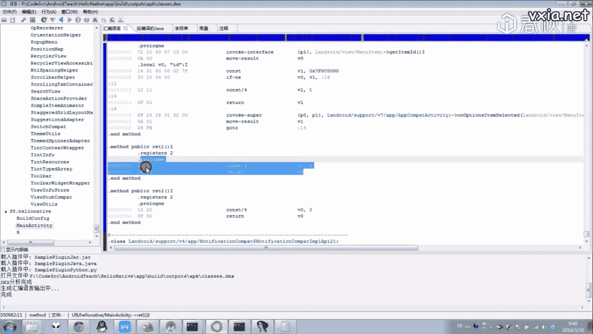

修改完成后，点击按钮，程序输出从“1”变成了“2”。这证明我们对内存中指令的动态修改成功生效了。

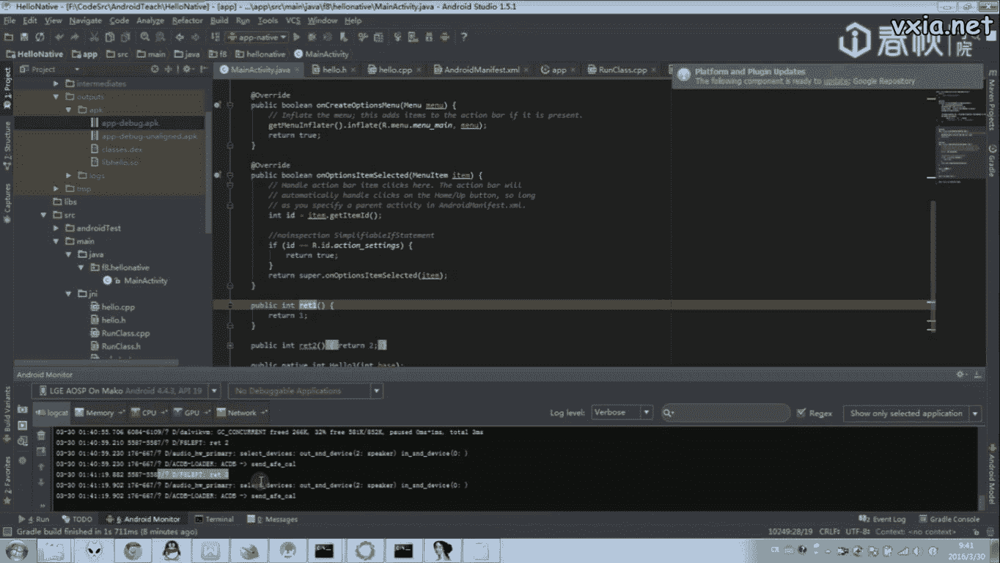

## 总结

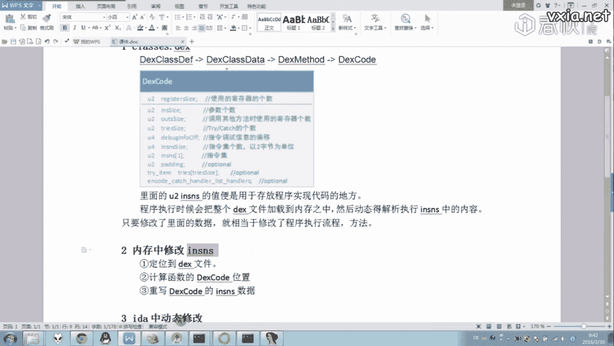

本节课中我们一起学习了Android动态代码自修改的原理。核心在于理解DEX文件中`DexCode`结构体的`insns`字段存储了可执行的字节码，运行时修改此内存区域即可改变程序行为。这是许多加固技术的底层基础。当然，在实际实现中，关键问题在于如何编程定位到DEX文件及具体的`insns`地址，这部分内容我们将在下一节课详细探讨。