# i春秋零基础入门Android逆向 - P24：课时3 Android 动态代码自修改实现1 - 老网恋教父了 - BV1sg4y1B7zB

🎼。

呃，好的，呃，大家好，我是讲师艾8。那么今天我们就来讲一下关于如何的去实现一个安卓的代码修改的一个方法。在上一节课中呢，我们就已经探讨过了。

我们怎么按手动的去通过修改安卓中的一个dess code的一个结构来达到一个代码修改的一个效果。那么这节课中呢，我们就来关注一下如何出去通过一个编程的一个手段来修改它的一个代码。

我们先来看一下这样一个呃dary的一个。deavi的一个呃DS的一个结构吧嗯，我们都已经知道了，好这节科中也已经介绍过了呃，安I中的一个函数代码是存放在这样一个dess code的一个结构之中的。

呃dess code的话里面就有一个INSNS size，还有它的一个INSNS的一个结构。那么这里就是打代表着它的一个指令的一个呃长度，还有它指令的一个实际内容。我们要做的话就是要找到这个结构。

然后修改它里面的内容。哎，那么这样一改就完事了。我们就来开始去修改了。但是然在这里我们得先来注意一下的话。在整一个安卓的系统之中，唉，它要执行的时候。

并不是直接是并不是去直接的去执行这种什么dess code的一个结构的。它是因为这种结构的话是属于一个存储方面的结构。它对依据执行来方面来说的话，哎，似不是不太有利的。

所以在一个安卓系统它在加加载整一个des文件的时候呢，是会首先是通过某一些函数啊，相应的一个存储结构给转换成可以方便于运行的一个结构。比如说这样一个dess code的结构的话。

买这样一个dessk code结构和一个des method的结构，就可以一起转换成一个me的一个结构。然后dessk class data的话就会转换转换成一个class的一个结构。

那des head还有这个desboard的话就会转换成1个DVNTEX的结构。那么相关转换的代码的话都存放在这样一个ob的一个里面。那么我们在这里呃在后面几节课程的话。

肯定是会和一个看语与源码关联的比较多的。因为我们要讨论的这种行为的话，是与一个ja可比较类似的一个行为。那么这个时候我们是否能够正常的运行。呃，是不是能够修改它的代码，就有很大一部分的程度啊。

就和我们基于我们与一个源码的一个熟悉熟悉熟悉程度有关了。所以呢在这里唉我们一定要多点啊去看那个源码来看来找一下它的一个。啊，有没有什么地方可以让我们去直直接修改的一个呃接口。好。

我们先来看一下这个安卓系统，它是怎么样去解解析在一个d文件，然后把它转换成一个相相应的一个结构吧。那么它的一个代码目录的话就存放在这个位置，一个dary VM的一个 over9里面。

当然这个话是仅仅相当于一个drry模式下的。如果是呃ARR模式模式下的话也是有相关的一个实现文件了，它路线的话也也同样在一个目录之下。如果是如果是ar模式话在这里art对吧？然后是里面的一个win。啊。

然后就是下面里面的一个。其他东西也是一个类似一个结构，什么一个debug，然后da还就这你的一些相关的一个内容。如果是按的话，就请大家去研研研究相关的一个代码吧。这里我们就只讲一个ga模式下。啊。

那么drry模式下的一个它解析这个 testify文件的话的存放在这这里。首先是它的一些结构体的一个东西。我们来打开interof来看一下它的一个结构体。好，我们来找到这一个ob结构。

在drry幕录下VMO的 object里面。我把到它打开。好，呃，这里是一个opjectject的一个呃文件。然后这里的话就是它的一些结构了。那。

每一个对应的一个呃在这里的每一个存储的结构呢都都会在一个deavi中对应在相应的一个运运行中的一个结构的。我们往下来找一下，首先是它的一个访问标志位呃，这个的话和呃存储的结构是一模一样的。好。

往下翻往下翻话，我们慢找一下，首先是一个最基本的一个oper结构。好这个公管好，这个公管。好，我们找到往下找，我们会找到这一个这个结构叫做一个strop的结构。那么顾名思义的话。

它就是用来存放我们的字符串数据的一个结构。那么程序系统运行的时候，就会以把我们的一个string的一个东西一个地方。也就是嗯。也就是这里的一个呃DX的一个str。

其实就是把这个str IDD的里面的一个数据给一个一个都会把它解析，给转换成这个 object的一个结构。我们在跑的话，唉，下面就可以有像还有一些其他的一个石像，类似field的一个结构。

对应着一个city feel，还有个easstert field。就这样3 feel还有 eastern feel。当偷都都会从一个病重派生出来了。啊然后class over的话。

就是从一个class department里面转出来的。还有它的一个message结构，就是我们这节课的一个目标，就是这样一个mess结构，直接的去找到这样的一个结构，然后修改它的一个代码。

来看一下的话里面话还会有一个ISMS size，还有它的一个ISMS的一个指针。在这这两项的话是对应着我们的一个存储上的一个指令级的长度，还有它的一个指令的一个存存存储地方的。可以看一下哈。

它的一个运算结构和它的存储结构是高度相似的。那么在安卓中的话也会在啊对应的第八条着相应的一个实现。有了相应的一个转换。那么它转换的地方的话，可以参考一下这样一个位置就是一个DVNDXX的一个位置里面。

里面的话有这样一个函数，叫做DDVMDX发op为什么怎么什么那么这个函数的话，在安卓运行的时候，就可以自动调用到它来对我我们的ds文件来进行一个解析。

然后给转换成我们上面刚才讲过这几个几个呃运行中的一个结构。嗯，以前的话一个I加密的话，可以通过对这样一个函数来下断点，就可以获取到对原始的1个DS文件。这也是其中的原因之一。

就是因为哎这个安卓系统就是通过这个函数来对个t文件来进行一个解析的。那但实际上的话现在的话呃，它已经可以步步走这个函数了。

因为这个函数实际上是可以通过一个手动的方法来进行一个实现的那所以现在脱合点的话就不在这这里了。那这里也过且说一下吧，也就把它的一个按加面话可通过对这个函数下一个断点可以拖出来了。好。

那么我们现在就来找到这个函数，来看一下它是怎么去进行一个转换的。我们转到这个1个CP文件。好，开过去。嗯，首先嗯首先我们来看一下它的一些相关的一些函数吧，它们有几个函数呢？

DNDX方DVMBEX这一个就是一个整一个d文件给map到内存中之后就会转换成这种格式。我们来看一下它的一个结构体。首先是一个DX file的几个结构体。

那么这个结构起的况就可以指向整1个DIDAX的一个文件的一个起始的一个位置。那么1个DAX head的话，就可相应的可以指向我们的de的一个head，也就是一个什么DAX开头DXX035开头的那个头。

也就是呃也就是呃。这里啊也就是这一个位置啊。然后就是一个D那么这DEX head和DAX发不同之处的话，就是假如这个d的话，它们优优优化过的话，它就会以多了1个DEXOVTheader。

那么这个OPT head的话就是优化了相关东西。接着这也就是它的对应的一个呃训的一个。对应的一个stream，还有一个tpho field的话，对应的一些呃指针。这是一个sstr object的地方。

还有存放一个class的地方，还有方法，还有fi的一个地方。呃，整一个d写的文件数据的话，都都会经过一个解析，给存放到这样一个结构体之中。呃，在脱壳的时候的话，我们在某种程度上在脱壳的时候。

我们只需要取到这个结构体，哎，就能够把把一个dt文件给重组出来了。这也是一个脱壳的一个一部分的一个原理。呃，那么这里我们就来看一下它是怎样的把一个ds文件给push到这样一个结构体之中的。

我们来往下找一下，呃这个函数的话就是从一个文件中去打开我们的一个ds文件。哎，那么哎那么下面下面我们来看一下说明就是一个打开一个ds文件，然后就是把它给解解剖成1个DIDDX的一个结构。

然后这里就是释化一个内存好，我们走挪过去，我们看一下这个函数。好，那么进入以后的话，我们来看一下它有三个参数，一个是它的一个地址，还有它的长度，就是它在内存中就是整个dess文件中，在内存中的一个地址。

还有长度的。也就是说它第一个参数，第一个长度是它的DS文件其实其始地址。起始为止，然后它第二个长度的话就是一个ds文件的一个长度了。所以像这个断点的话，可以把通过第一个行第一个参数，第二个参数哎。

把整个dss文件中从内存中给读取出来。这是非常正常的一个非常好好的一个一点。好，我们往下跑，我们来看一下它看怎么的去把一个这个地址藏多的东西给解，给解析到这个内存器中去了。那么我们来看一下。

首先就是通过1个DX five配的一个函数呢，就是把我们的一个内存中的一个地址，就是一个东西给传转换成一个DA给解析成1个DXfi的一个结构。那么DXfi的话，上一节工在上节课已经介绍过了。

就是像这种结构的话就是直接的把它的一些数据给mac到一个这里个上面去了。这是DXY配置的一个结构啊。那么具体来实现可以看一下，那么它大致的一个。大致的一个实现的话就是直接的把内存中相关的一个位置。

比如说它的一个head位置给赋予到相关的位置。对，比如说head位置哎head在内内存中的位置放到这里，然后一个具的位置放到这里。唉，把它和起始的位置分别的去放到相关的一个地方中去，就是解析一下。

放到相关的地方中去，顺便里面还可以进行一些呃str上的一个校验。如果失败的话，就会以直接把在一个失败的一个东西。啊，那么这里就是一个WDXY配置一个函数，它可以解析1个DAAX文件。那往下跑的话。

就会看到它可以从一个desify中哎给就是把除把一个desify文件通过这个函数给解析成一个DVNDX的文件走过去。就可以看到啊相关相应的一个一些实线了，对吧？就可以初始化一些结构，一些长度。

一些大小之类的，给先先分配一下空间。然后下面就是。对一些空间进行一个复制，就是一个它均的结构体。唉，现在初始化一些，然后进行一个复制。这个啊什么什么。

然后然后相关的一些初始化的话还会在更加以后面的一个地方。那么这里就是我们啊。notice那这里的话就是呃整一个解析的一个大致的一个地方。那么更加详细的话，更加详细的地方的话，只能让大家下面自己去看。好。

但是这里已经给予我们足够的一个提示了。我们这里有几个方法。首先第一步那有其中一个方法，就是先来取到它的一个。那desify的一个结构体。然后我们再来把desify中。

把我们的一个mes的一个结构给取出来。还有另外一个就是一个取到这里这样的1个DEDADAX的一个结构体。然后从这这一个结构体之中的一个mes最中找到我们我们的一个方法，把它的方法进行一个修改。啊。

这是非常基本的一个想法，但是实现起来的话可能就比较麻烦，比较难。那么这里我们就来看一下有没有其他比较比较取巧的方法来找到来达到一个修改的一个效果。好，那么这里我们就从1个JNI中进行一个入手。

那么JNI的话顾名思义就是一个GNIGNI在前几节课中也已经有用到过了。那么我们可以看一下这样一个GNI就是我们来看一下它里面有有没有相关的一个代码，可以让我们直接的去获取到这样一个me的一个结构题。

那么这样获取过来的话，我们就能够直接的就对代码进行一个修改了。我们找到一个GNI的CP它的实实现的代码在这个位置。那目录目录下的一个DAV1个GNI里面去。好，我们跳跳转到这里。

那这里的话就是存在了所有的1个JNI的代码的一个实现了。可能说呃可能对每每一个不一样的系统版本这里的方法可能呃方法的具体实现可能是不一样。那他们的接口的话是肯定是一样的对吧？ge every啊什么的。

这就是它的一些方法的一个具体的一个实现。我们来找一下有没有直接的可以让我们去获取一个方法的一个。这能直接的去获取一个mettter的 method结构体的一个方法。直接诉讼吧。

just tell let how matters。我是R迪，我们来找一下。嗯。GNI好。那，这里的话比较长，我们就。快速翻一下快速翻一下，那最好还是使用一些搜索啊之类的什么来转向。嗯。

这这里的话也可以直接呢通过去找一个这样一点H来通，来看一下它的一个东西，do methods。啊，这个是不能给我们使用的。just特别是。什面。

Do like please college visitors。う。好，我们找到这样一个方法。哎，大家具体看一下这个方法。我们为什么我们为什么会说哎这个方法我们可以通过这个方法去找到我们的一个东西。

首先嗯这个方法话，它的说明就是很简单啊。它就是通过一个java上的一个mess，就是在java上的这样一个mess结构体。通过这个方法就可以直接获得它的1个GPSSID。好。

那么问题就来了这样1个GMSID到底底是一个什么鬼东西呢？我们来看一下啊，这里是这里就是很简单的一个就行一个decode，然后进行一个保什么，然后就是进行一个返回，返回的时候它进行了一个呃强制转换。

我们来转快看一下它转向显示什么样的结构体。点过去看一下，大家可以看到它实际上转换前它是一个mes的一个指针。也就是说的话。就是说对于这样一个JI来说，最 measure。

ID实际上就是一个m流体的一个值。只是它里面只要我们确实接使用它的地址而已。这里的话对应着其他获取这样一个GPS者RE的一个其他方法也是一样的。实际上它就是反黑了这样一个me结构体的一个指针了。好。

那么这里我们就可以通过通过一个强制转换，把一个GMSIDS的一个值强制转换成一个met结构体的一个指针，来获得整一个方函数的一个结构体，一个met的结构体。那么既然知道这些的话。

我们就可以啊开始的去直接的去进行一个执行了，这些都是一些最基本的一个东西，对吧？好，那么下面我们就来开始进行一个编程上的一个实现。首先我们就来嗯打开我们的个按卓思点这点吧，我们就来开始的去写代码。

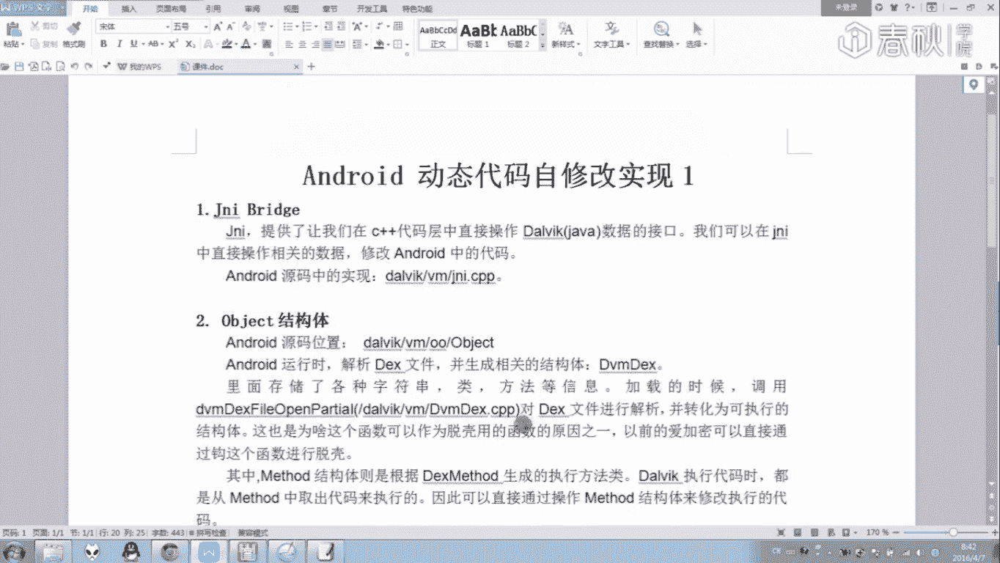

嗯，也还是一样这里的代码话，就为了简单起见的话，就以这些简辑的方法来跟大家来说一下它的一个原理性的一个东西啊。嗯，首先这里的一个mes结构体。我们刚才这里找找到了这样一个me结构体的框。

它对于我们的一个编程上来说是一个隐藏的，它只它只提供我们的它的地址给我们使用。所以我们这里假如我们是想要去使用到它的整一个me结构体的框，是需要我们去手动的去把它的一个代码进行一个呃导出的。

它的一个结构体以进行一个导出，导出的话，就是把一个安卓上相关的一个实现给导出过来。那当然发这眼块呃，网上也有不少已经你叫人帮我们给导出好了，这里我们就。那，随便弄一下就好了。ああ。

名字跨去实验前然后放到相应的相应的一个地方。我们这里就是创建一个项目职业。好，那么这里的话也就按照木认来。

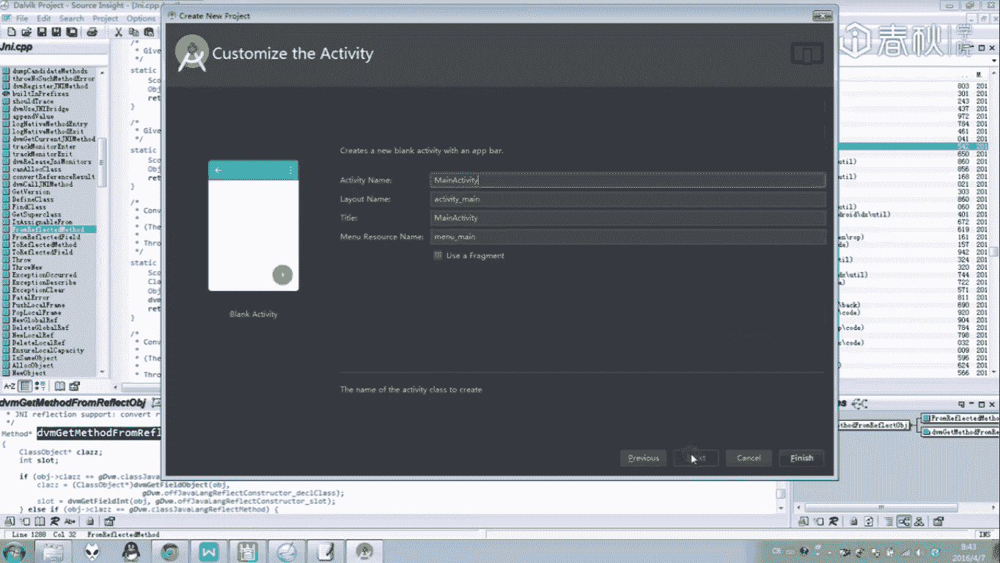

碰建一个项目的话。事实像这种情况就直接创建一个项目了。那么这里我们项目创建完以后的话，还是一样要编写它的一个对应的一个GNI的一个代码。因为这里我们还是是通过GNI实现了，注意一下。

像这种直接操作内存的话，都是需要通过1个GNI进行一个实现的。所以这里也就是要跑一个CCR加的一个代码了。那么对于对于你写这二部分的话，在前几节课中已经有讲到过了。我这也话就不再详细要展开了。

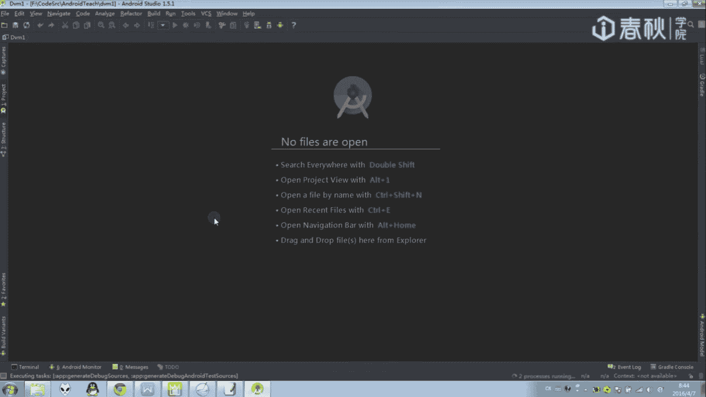

好，我们就来改一下改一下它的一个D一个GID一试试，让它把它的JI字词给改出来。

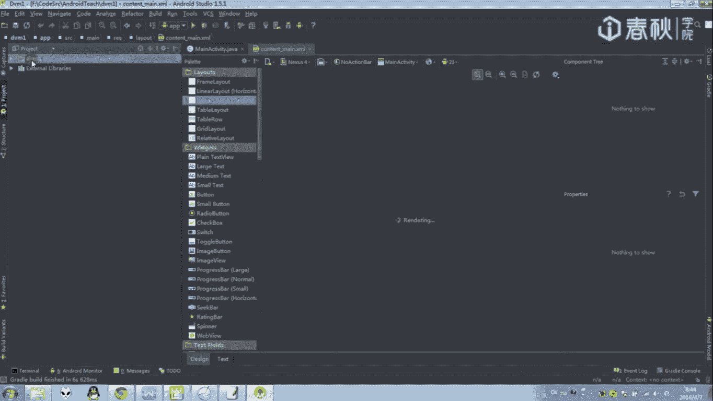

这是pir冷头，然后0。6。

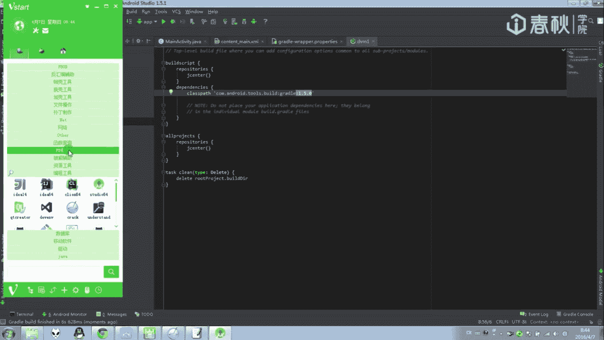

我们来看一下它的一个对应的一个地方，在这。

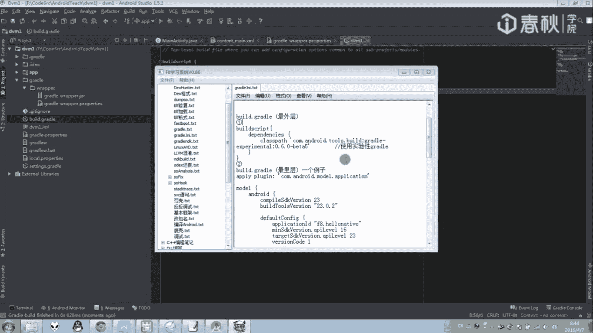

然后对啊对下代码地方全部都改一下。把它直线给改出来。呃，这一方面修改的话和前几课前几节课讲的是候且你要一模一样了。嗯。快速的改一下吧。

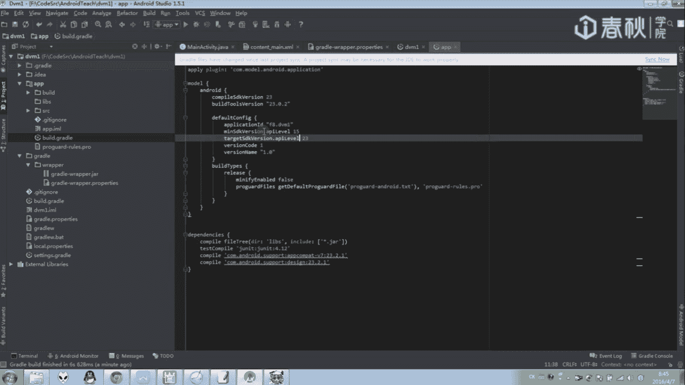

然后上面就是一个prof的东西。

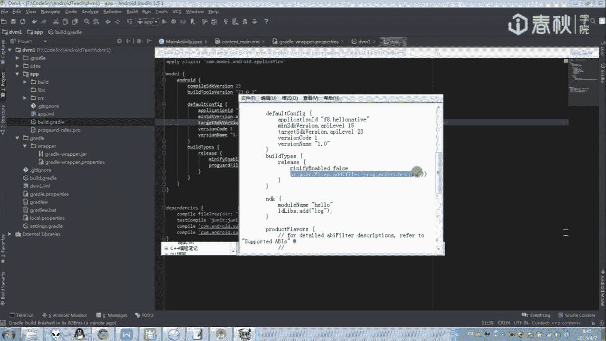

然后再往下话就是1个NDK了。说明证明一下我们要生成了1个NDK模块。把对应的一些地址给加上去。好缩新一下。の那ら下のや。那摩托稍息一下以后的话，我们就来呃正式开始我们的一个呃编程JIR的一个代码了。

我们等他来完成一个刷新网。好嗯，那么现在已经说新完，我们就来开始去写它的那个代码。首先还是和前几节课怎说一样，我们先来动一个returne号 return的一个函数，我们来看一下。嗯。

那么这个函数的话就是单纯的要反回一个一。然后另外啊下面下面还要写一个函数，就是ent2。好，我们就在这里就来打在点击按钮以后，就来打一个呃lock的一个提示。好多个把这几个加上去。

我们就来可以尝试跑一下。那么现在的话跑起来之肯定是直接就是要反馈一个一的一个数据了。就是很定的还是很定的。我们来直接抛起来。Okay。好，那么这里就是它直一刻直一1个一的一个值。

我们来看一下它里面的两个函数。

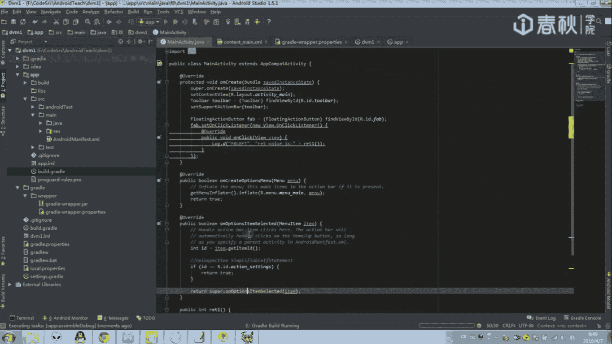

就是在一个retturn一还有return2，它里面的具体的一个代码的一个实现。呃，扫到他生产的个PT文件。

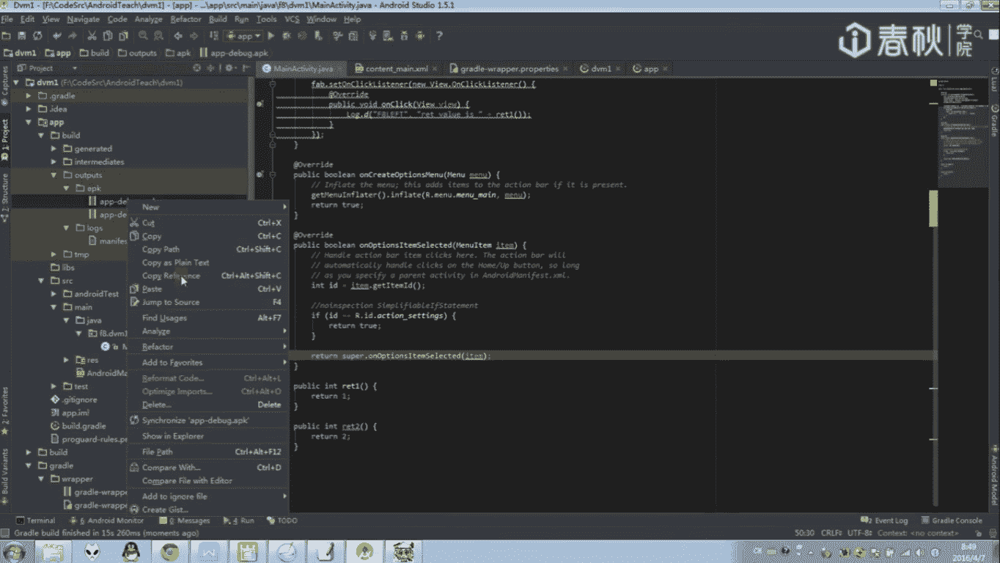

我们来看一下啊，啊，这里是肯定是把移拉回车泥。好，我们来找一下它实现的相关的一个代码，好了。

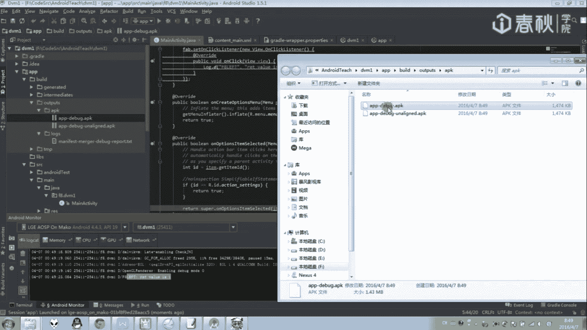

我们解析一下它的一个单词的一个文件。

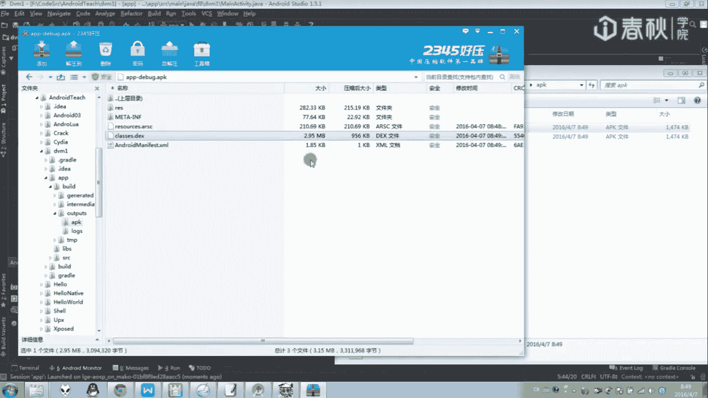

找等他。然后就是用你10艾iter来这行要打开。

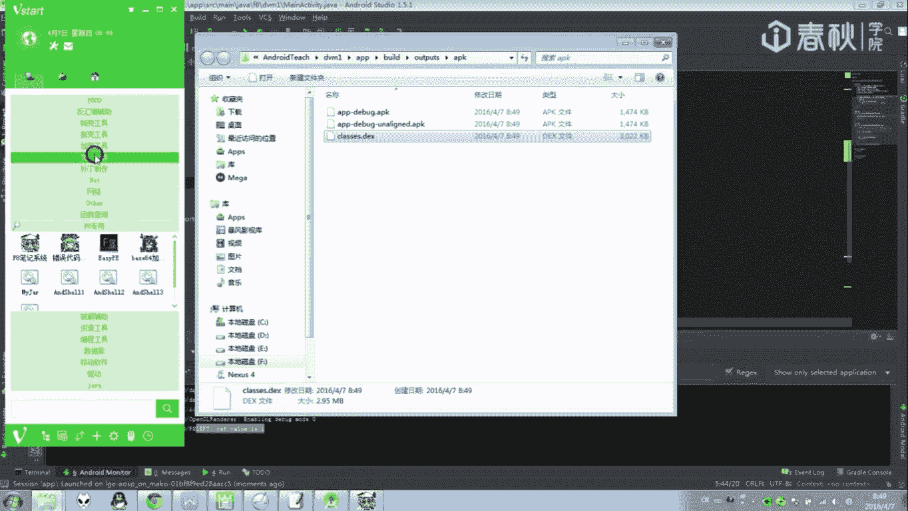

跑一下它的一个呃脚本。

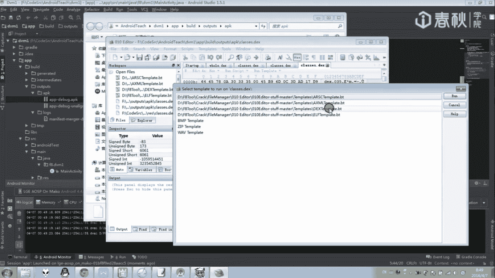

然后走到一个对应的class的一个地方。找到对应的一个类的这个实线。那跑回一个class data里面的一个vis里面的话，就可以看我们刚才写的两个函数，turn一还有return2。

然后展开的话展闪下它的coded data里面的ISNSNS结构，这里就是存放着它的一个最原始的一个看一下它里面的话就是有4个字节构成，就是一个12还有1020F00，这是回一的。

那么2话就是一个12200F00，就是对应的一个实现。我们来看一下，就是这里的1200F00。那么我们现在要改我们现在要做操作的话，就是把这个东西给改成这一种属性。好。

我们就来开始去跑到它的1个GNI方法中去，直接去对它进行一个修改吧。

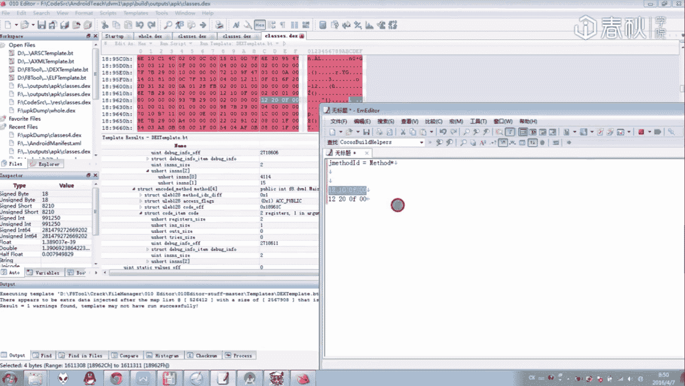

嗯，首先我们要来创创建一个let的一个方法。好，我们方法快去。随便起我们来看一下这里假如说这里我们要调用到这样一个方法的话，首先要去获取一下java上的一个mes结构体，所以我们就要传递相应的一个。啊。

首先进去了，没籽儿。嗯。好，那这是一个声命好这结构这样的结构体以后，我们就来开始进行一个参数的一个传递。首先先来获取一下这一个类的这样一个比特尼的一个方法。这一个类的这一个类是M和tT。好。

那么这里的话我们就需要通过一个反射来进行一个获取了。反射的话在最初的一节课中已经有教到过。那么这里啊我们就来。或取吧geive me，然后获取获取它的这个方法。首先是他与韩世明。然后是它的一个参数。

那边这也是一个零差的话，就就是直接就这样的一个样子了。好，然后。p取一下它有一个ever case。好，把一个mes的一个结果给取出来。这是通过反射来获取了G的方法。

然后再用这我们的一个量水函数来进行一个。传递我们的N结构体来，直接对它进行一个代码进行一个修改，然后打印一下提示。后这里我们已经修改好它的代码了。あと？等后下面再一行。好。

我这里哎在这样层上的一个布置已经弄完了。那么下面的话我们就来跑到一个letty层中去，把这个方法来把它实现一下。

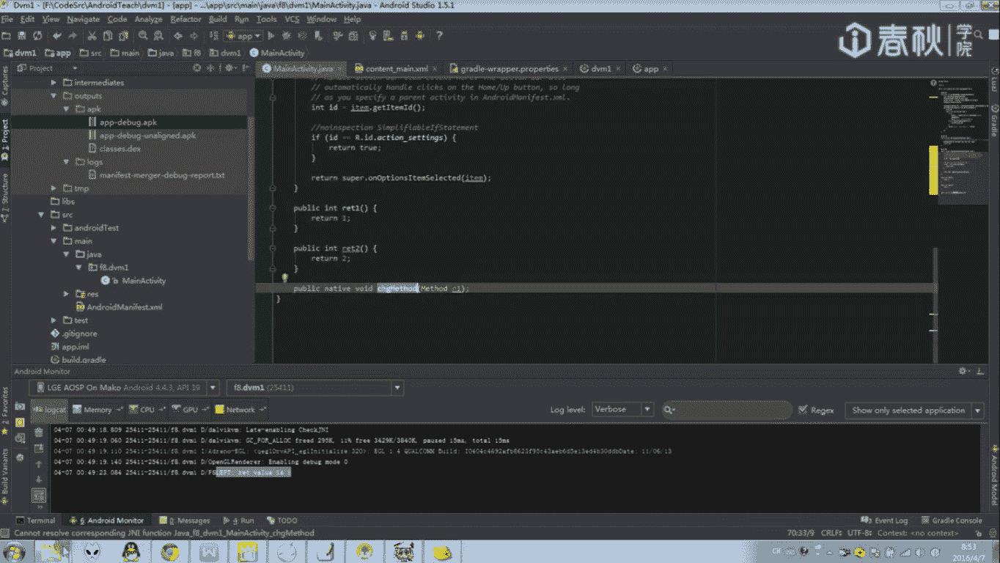

现在话先把以前所写的一个立体上的一个东西给拷过来吧。这也是为了一个代码上的一个重用来减少以我们一个工作量吧。它那体里面的1个APP，然后source这样目录下，把它全部拷过来。

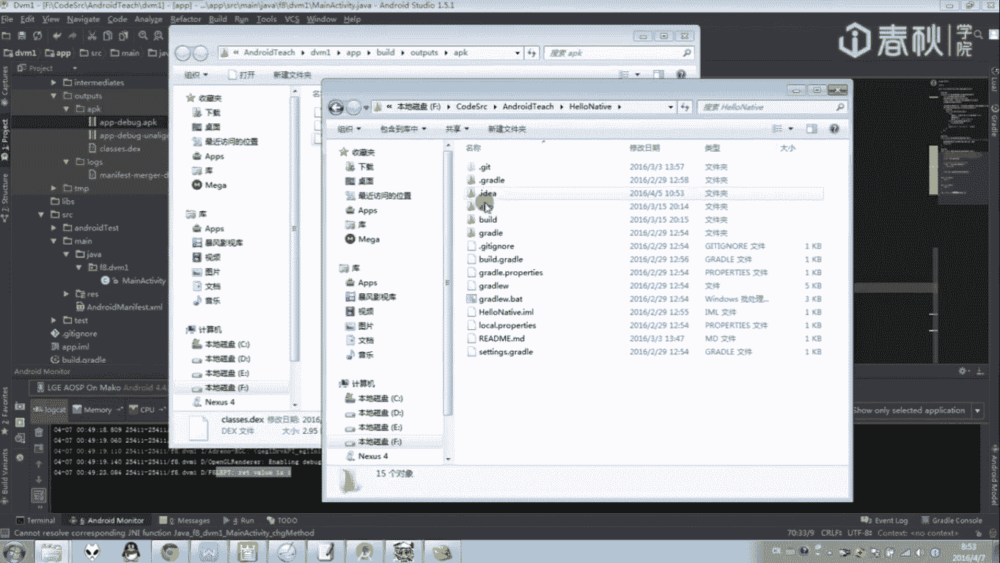

好啊，把对应不需要东西给删一下。好，再刷新一下这样一个配置。Yeah。那我们下面就来开始这次进行一个码代码了。看这次的一个马代码。呃，前面这些不需要修改了。一些呃在这啊on络里面注册函数，对吧？

注册函数这些地方都不用改了好。把对应的一些东西给实现一下。啊，首先是一个方法。首先是一个方法，我们这里的方法也是这个。然后他也它是一个呃。一个一个函一个普一个普通函数，所以它第一个第二个参数是一个ob。

然后第第三个参数也是一个重最 object，因为它里面是一个me的一个东西。好，里面具体的实线不用管反是一个word。好，那么这是一个呃最普遍的普通的一个圆形。

然后下面就把它注册到我们的一个ja号函数中去。后注册的话就是在这里了啊一个首先是一个类眼名字，内的一个描述符，类的一个dicscription。好DND。另一个T提搜，然后然后是一个函数名。

是群里面群里面字。并着上面的也是一样的。好。然后是它类的一个描述符，本它类型是外，中间的话是穿的一个mess的一个结构体。点过去看一下华丽是这样一个东西。这是java中的反射中的一个方法。

我们就要调到雕这样一个方法。对吧然后是一个me。然后把它改成呃代码中可以识别的一种形式，试试前面加个这个L，然后后面准备用斜杠点用斜杠来替换。然后后面加个方式份号，对up者来说，这样然后进行一个注册。

然后这里。再把我们的一个libberberry给加载过来。好，这里的老板名字是一个hello，我们就来加讲这个酷了。那这里就是把一个最基本的一个模型给弄弄出来了。那么下面就是来完成一个方法上的一个实现。

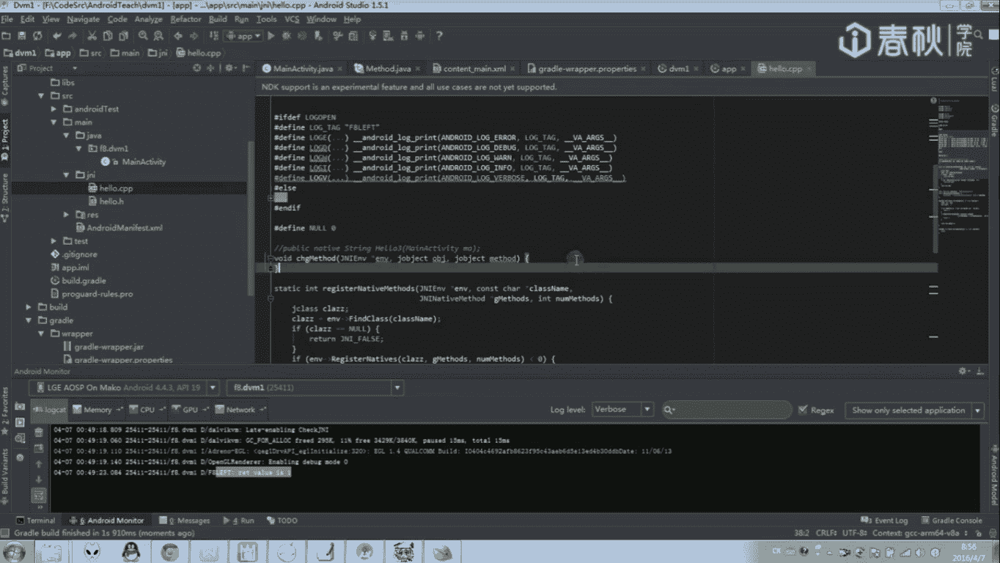

那首先我们要调用到这个方法，是调用到这个方法。

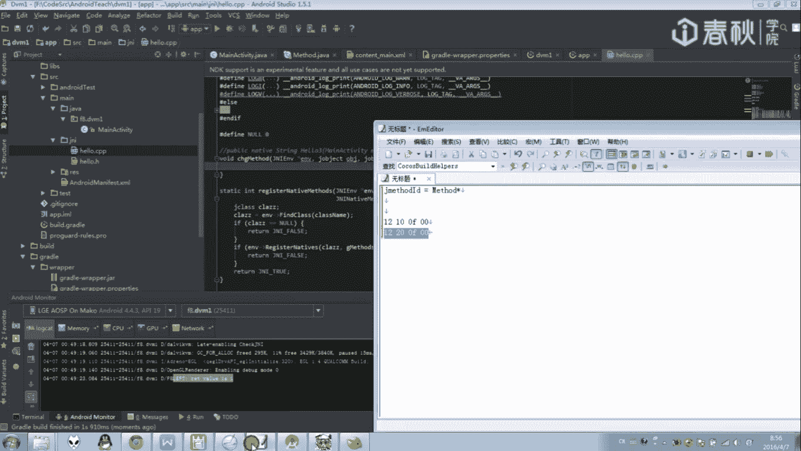

ifform method先把这些以注册方式给填上去了。

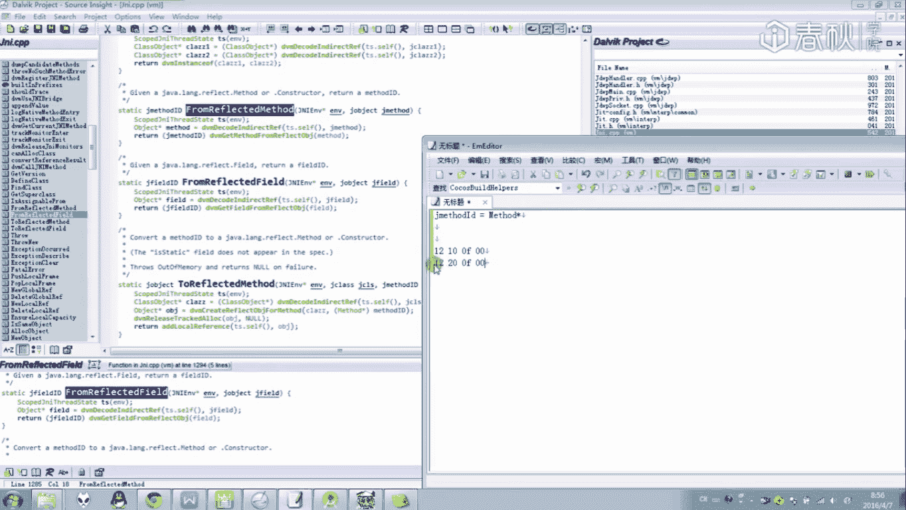

啊，注意看一下注意看一下。呃，第一个款式衬衣。然后第二个class return2。这是几个最基本的一个结构体。我们就来调用一个方法。

首先我们通过调用这一个方法来把它从一个java上的这样一个这样一个met结构体也转换成种欧文器啊，这中能够识别的一个jamat IDD结构。好。

就是把一个这好的metter结构可以转换成西藏的一个metter了。好，我们来找吧。1mi FROM。嗯。好，调这个方法。我们 method里面有几个一个一个这一个参数，就是一个mes的一个参数。好。

那么下面我们这已经知道这样一个meser，它实际上就是一个哎那MID实际实际上就是一个mes的一个指针了。

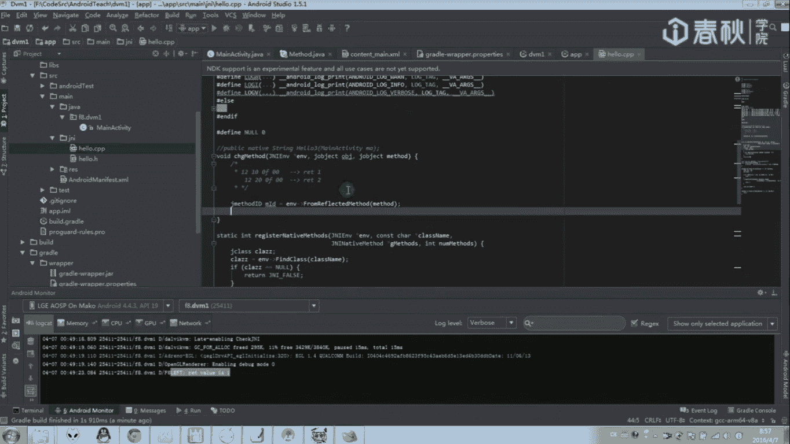

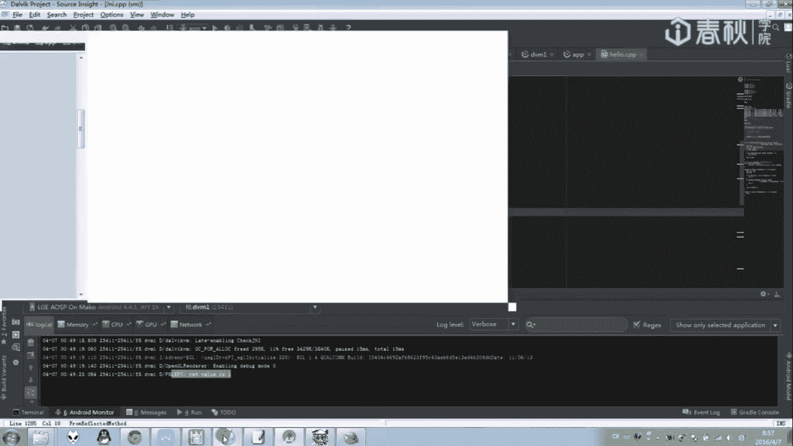

那么这里我们就把它直接强制的给转换成一个mes的一个灯。好，我们把它对地下进行一个强制转换。呃，结果这里再看一下就会以发现了整一个啊GNI中并没有把这样一个mess结构体给导出来。

所以这样的一个mes结构体的话，就需要我们手动的从一个安卓代码中进行一个导出。这里也我已经完成了一个导出，就在这个文件夹中去。好，下面大家自己自己去使用的话，都进已进退了。

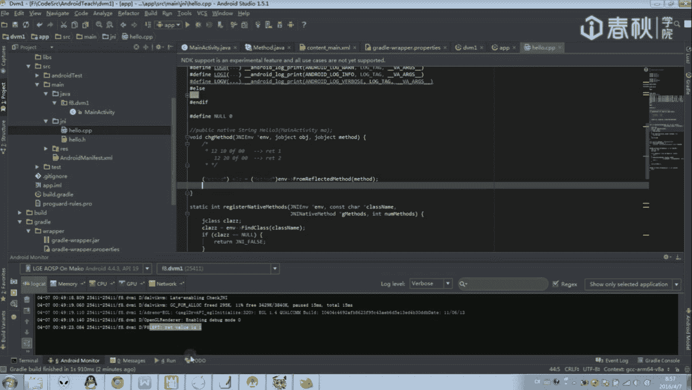

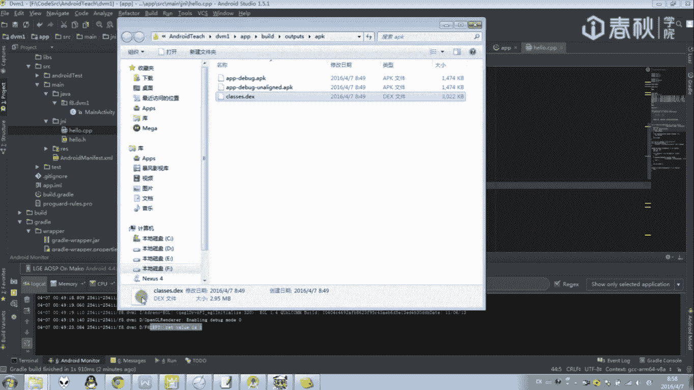

你这我就接了。

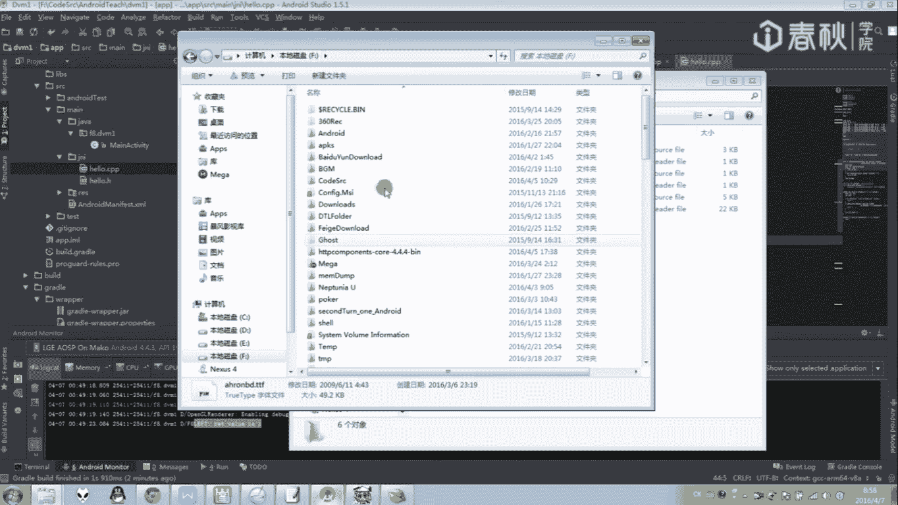

跑过来。好。晚这待会再烤过来。我们刷新一下，把相应的档围给导入一下。好，那么这里就已经把一个mes的一个指针给导入过来了。好，接着我们就来对它的代码进行一个修改。好。

那这里的话我们就来采取一个比较取巧的方法吧。好，把它的一个字检码给以拷到这里，我们要这是我们目标的目标质检码。然后直接的。把它有一个INSNS的一个指针给转到我们这里的一个地方。然后把这个弄成全局的。

好，那么我们这里尝试的去跑起来，我们来看一下我们这样修改一个效果。呃，这原色里呢原理就很简单，就是跑起来就直接嗯。

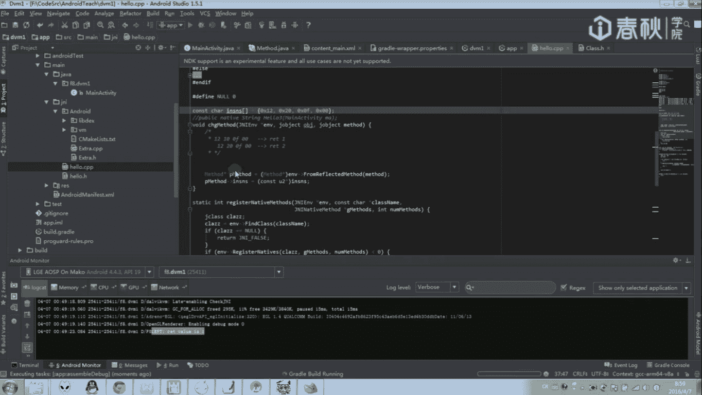

把它给获取过来，然后就什么的什么的。嗯，这里我导这里我导入的时候，里面有一些属性框写的比较糟糕那么。可能就是要添加一些边辑的一个选项才行。我问系。看下方我们要添加一个engn那的c频fl的一个选项。嗯。

在这里家。嗯。嗯，算了，这个代码没不怎么重要，先注册掉这里。你直接返回好起来先，因为这也并不重要。先跑起来再说。嗯，这些代码的话是我从另外一个项目中给爬出来的。那这个项目也可以在我的一个主页。

我的一个Q号主页上给下载得到啊，大家可以去看一下，然后。然后我们先把大码给抛起来，来看一下它的一个执行的一个效果。

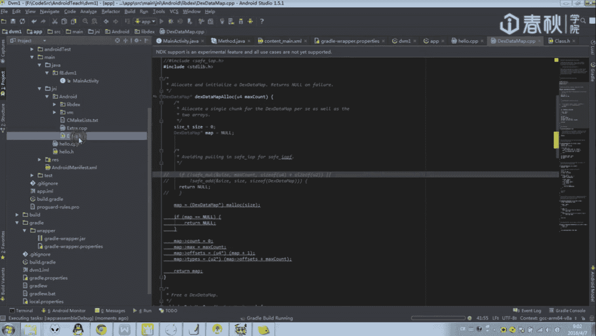

那么现在一个程序就已经呃给跑起来了，我们来尝试一下。点击哎它防碍执金被改变了，就是证明它的一个修改已经给成功了1点m的寸，然后一个防碍执撑2。这里啊，这就是一个。

直接要通过对一个message体进行一个修改，来把它一个大脑给改掉。那么这里虽然我这里是直接把它的指针的指向给改一下，把这里的指向给改一下。

但实际上的话要直接的修改它的1个INSNS里指针指向的内容也是可以的。实际上这个INSN的话，就是指向我们范案中的相应的一个code的一个交体。就是和我们上一节课中所讲的是一模一样的。

但是由于它有一个内存属性的一个保护的话，如果是想要去修改它的一个内容的话，首先是需要去修改它的一个map的一个访问属性的。这这一点的话在下一节课中再说了。那么这节课的话就暂且先介绍到这里为止。

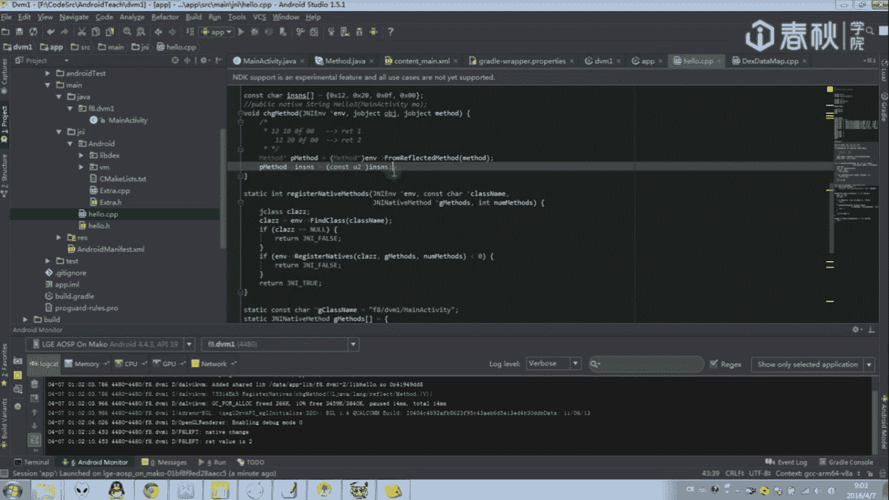

我们再来对这个方法来进行一个呃介绍一下吧。那由于这里这里的话，我们就来由于在这里我们就来导出了1个GNI1个安卓系统的一些结构。来，那么这里完题就来了。因为这是一个没没有被系统所导出来的一个数据。

所以他。这一个数据这个结构体，很有可能在部分厂厂商厂商之中的话都是被修改过了。那么这里很有可能就需要我们去进行一个进行这样的一个适配了。就是说不同的系统版本的话。

它里面的结构体可能也会有一个小小的一个修改。所以虽然这个方法比较简单放虽然比较简单，但是后期的话是要对不同机型来分别的去做一个适配上的。所以这个方法哎用在使用方面上可能会比较少。用的比较少。

现在比较简单，的就可能弄的比较少。呃，做这些适配方法的话，大家大家可能要下面自己弄吧。那么现在普配的话是用另外一种方法，就是一种直接修复电视的这样的一个方法。那么这个方法的话。

我们就会在一个下节下一节课中所介绍介绍嘛。那对于现在的一些加壳框一些加壳的一些程序，他们都是使用我们下一节课中所要介绍的的一个方法的啊，所以我们还在下一节课中，我们再来介绍相应的一个实现吧。

那么这节课的的话就暂时先到此为止了，谢谢大家。

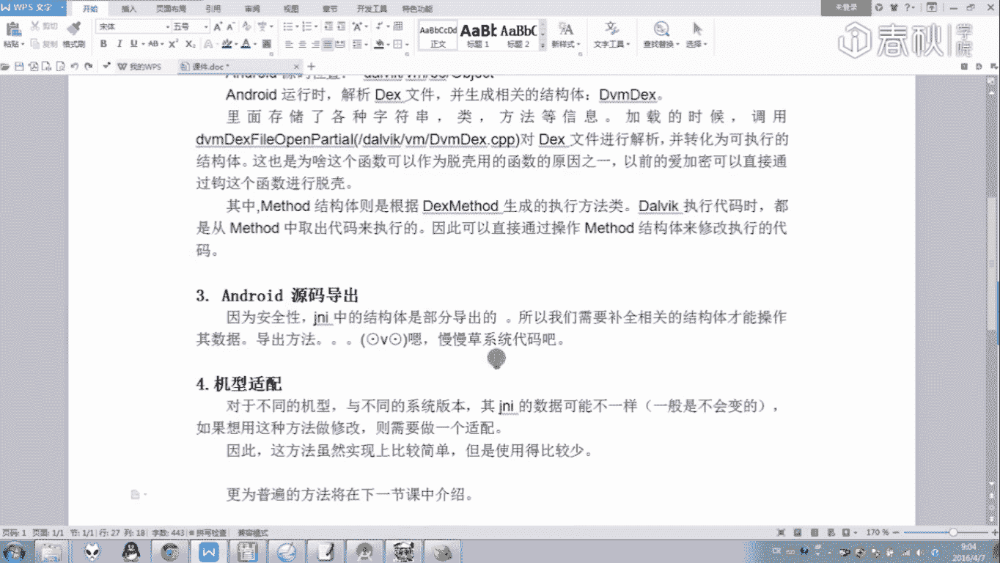