# i春秋零基础入门Android逆向 - P27：课时2 ELF结构详解：动态运行库so文件的文件组成结构 📚


## 概述

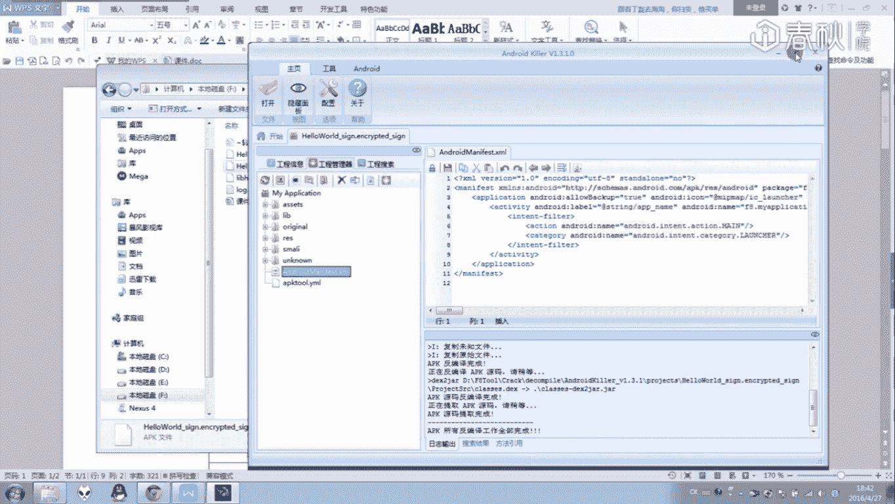

在本节课中，我们将要学习Android动态链接库（so文件）的核心格式——ELF（Executable and Linkable Format）结构。理解ELF文件的结构是分析、修复和脱壳加密so文件的基础。我们将从两种视图（链接视图与执行视图）入手，详细解析ELF头、程序头表和节头表的作用与关系。

---

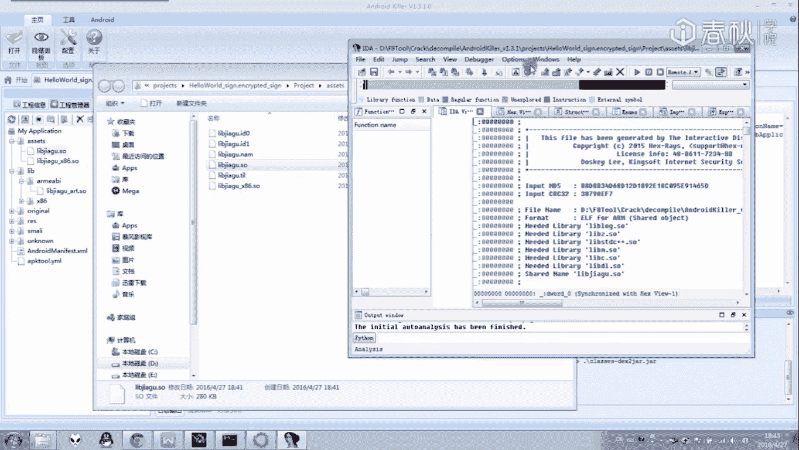

## ELF文件总览：两种视图

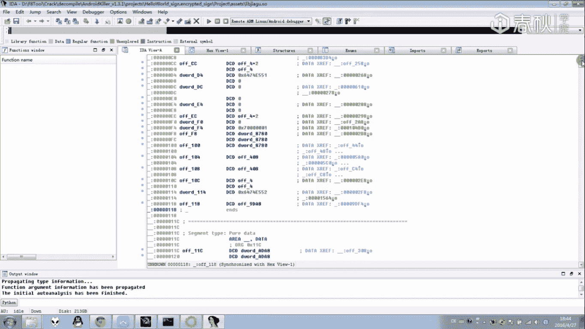

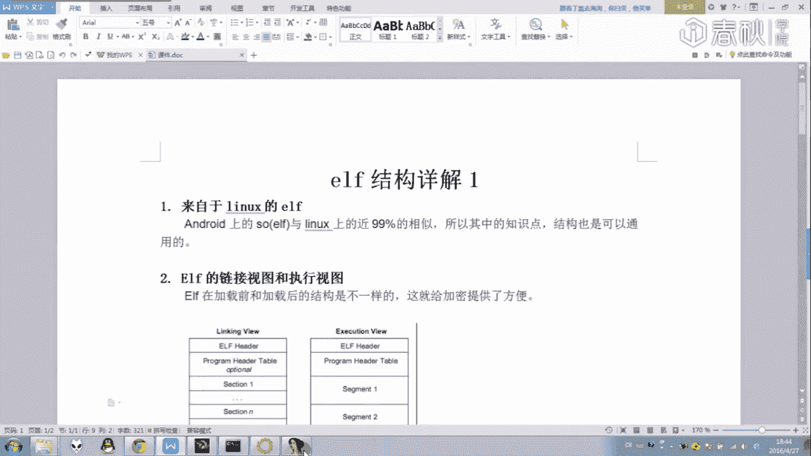

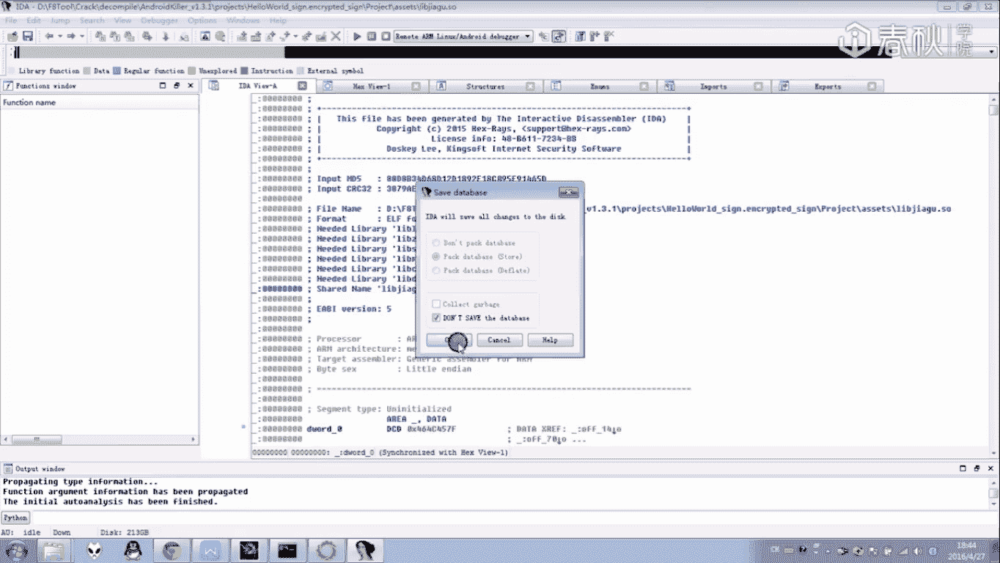

一个ELF格式的so文件，在磁盘存储和内存加载时呈现出两种不同的结构视图。

*   **链接视图**：这是静态分析工具（如IDA）看到的视图。它由**ELF头**、**节头表**和一系列**节**组成。节头表详细描述了每个节（如代码节、数据节、字符串表等）在文件中的位置和属性。
*   **执行视图**：这是操作系统加载器（如Linker）将文件加载到内存中运行的视图。它由**ELF头**、**程序头表**和一系列**段**组成。程序头表告诉系统如何将文件的不同部分映射到进程的虚拟内存空间。

**关键点**：加载时，链接视图中的多个“节”会根据其属性（如可读、可写、可执行）被合并到执行视图的少数几个“段”中，以提升加载效率。这种视图的差异，为so文件的加密保护提供了操作空间。

---

## 核心结构解析

上一节我们介绍了ELF的两种视图，本节中我们来看看构成这些视图的三个核心数据结构。

### 1. ELF头（ELF Header）

ELF头位于文件开头，相当于整个文件的“地图索引”。它存储了最基本的信息，例如：
*   文件魔数（`0x7f ‘E’ ‘L’ ‘F’`）
*   文件类型（如共享库）
*   目标机器架构（如ARM）
*   程序头表和节头表在文件中的**偏移地址**、**表项大小**和**数量**

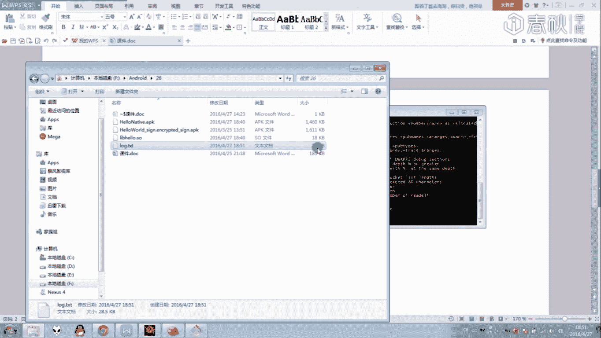

**公式/代码描述**：在C语言中，ELF头通常对应结构体 `Elf32_Ehdr` 或 `Elf64_Ehdr`。

### 2. 节头表（Section Header Table）

节头表是静态分析工具的“指南针”。IDA等工具主要依靠它来解析文件。

以下是节头表所管理的一些关键节（Section）：
*   **`.text`节**：存放主要的执行代码。
*   **`.data`节**：存放已初始化的全局变量和静态变量。
*   **`.rodata`节**：存放只读数据，如字符串常量。
*   **`.dynsym`节（动态符号表）**：存放动态链接所需的符号信息（如函数名）。
*   **`.dynstr`节（动态字符串表）**：存放动态符号表所需的字符串。
*   **`.rel.dyn`/`.rel.plt`节（重定位表）**：存放需要重定位的信息。
*   **`.plt`节（过程链接表）**：用于调用外部共享库的函数。
*   **`.got`节（全局偏移表）**：存储外部函数和全局变量的实际地址。

**作用**：每个节头表条目都精确描述了一个节在文件中的位置、大小、类型和内存属性。通过分析这些节，我们可以找到函数、字符串和导入导出信息。

### 3. 程序头表（Program Header Table）

程序头表是系统加载器的“施工图纸”。Linker根据它来布置进程的虚拟内存空间。

以下是程序头表中常见的段类型：
*   **`PT_LOAD`段**：这是最重要的类型，标识需要被加载到内存的段。一个ELF文件通常至少有两个LOAD段，一个存放代码和只读数据（可读可执行），另一个存放可读写数据。
*   **`PT_DYNAMIC`段**：指向动态链接信息，其中包含`.dynamic`节。
*   **`PT_INTERP`段**：指定程序解释器（如`/system/bin/linker`）的路径，仅存在于可执行文件。

**作用**：每个程序头表条目描述了一个**段**（Segment）的信息，包括该段在文件和内存中的偏移、大小、访问权限等。加载时，文件内容被映射到内存，形成执行视图。

---

## 实践观察：链接视图 vs 执行视图

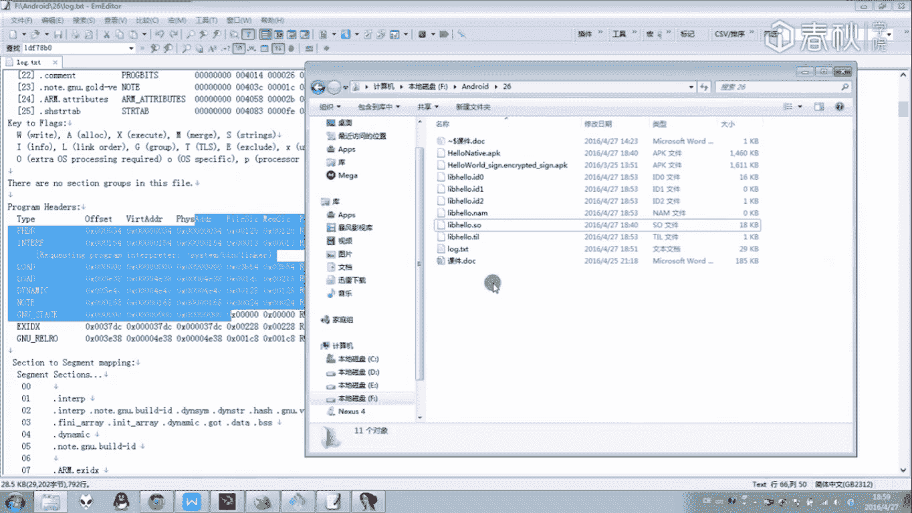

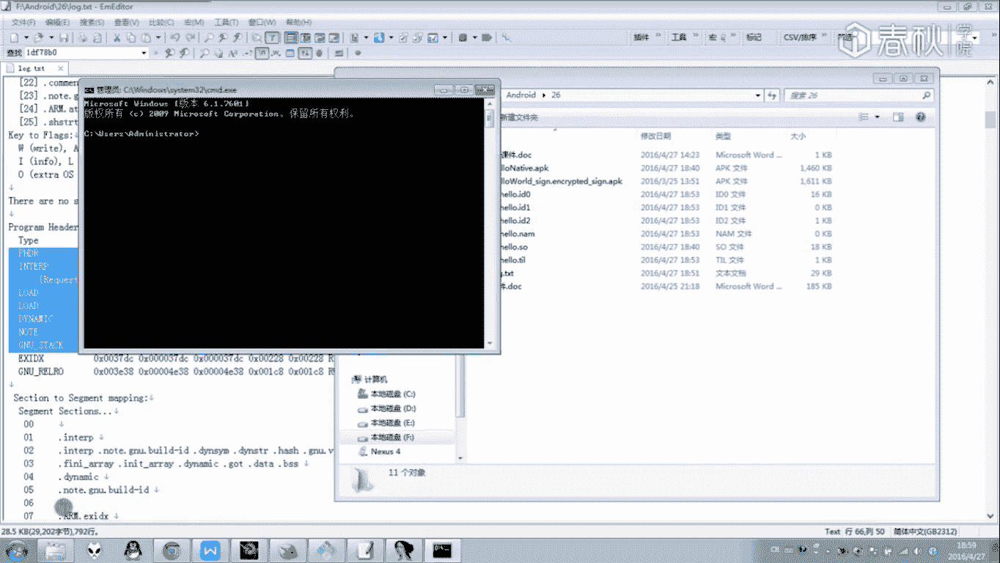

理论需要结合实践。让我们通过工具来直观感受这两种视图的差异。

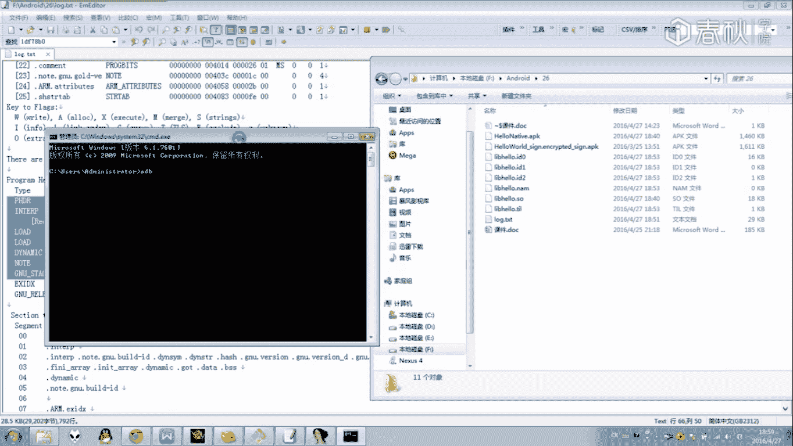

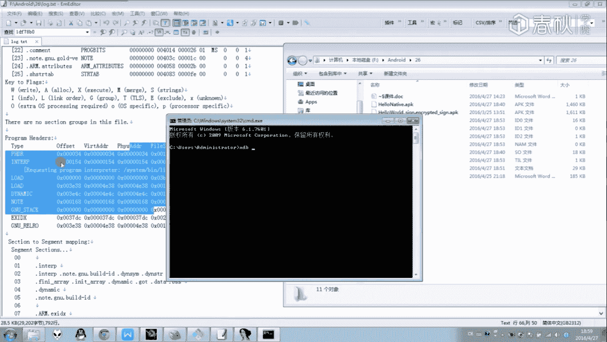

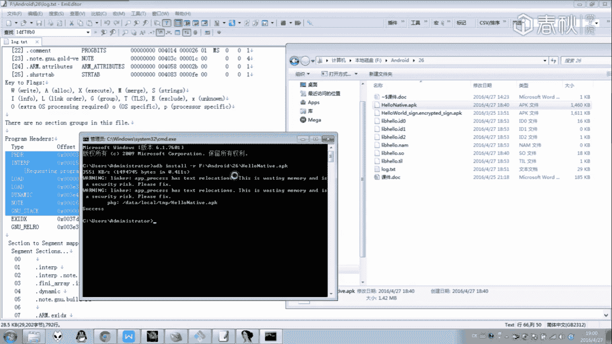

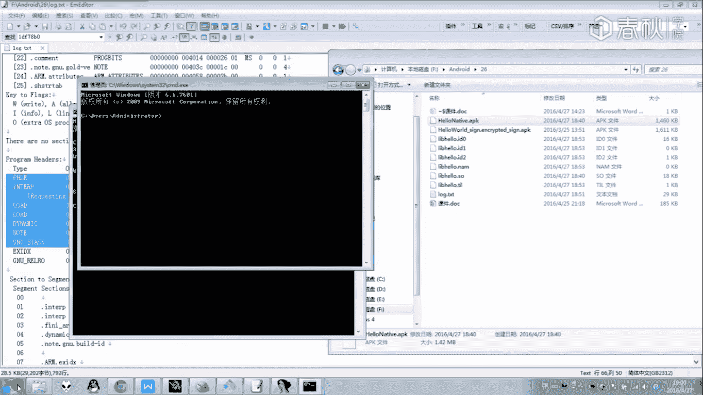

### 观察链接视图

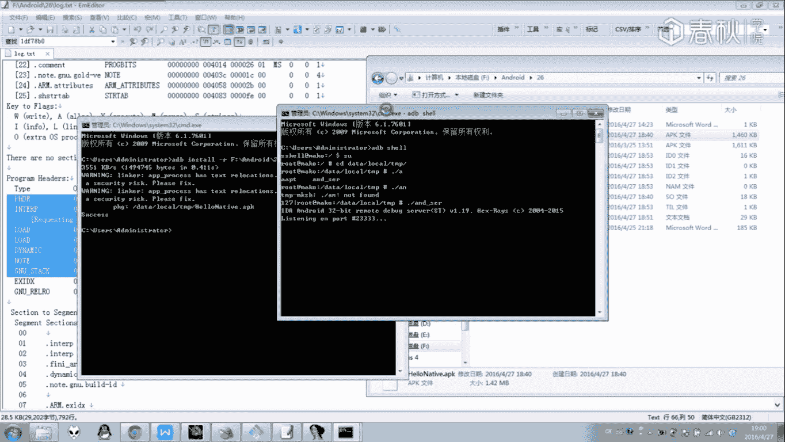


我们可以使用Linux下的 `readelf` 工具来查看一个未加密so文件的详细信息。
```bash
readelf -a target.so > info.txt
```
打开 `info.txt` 文件，你可以清晰地看到ELF头、详细的节头表（包含数十个节）以及程序头表。

### 观察执行视图

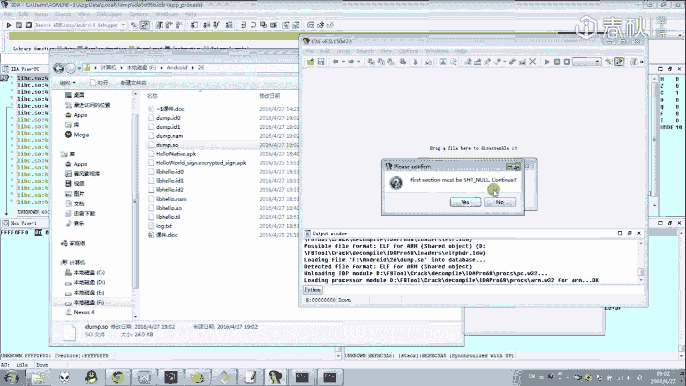

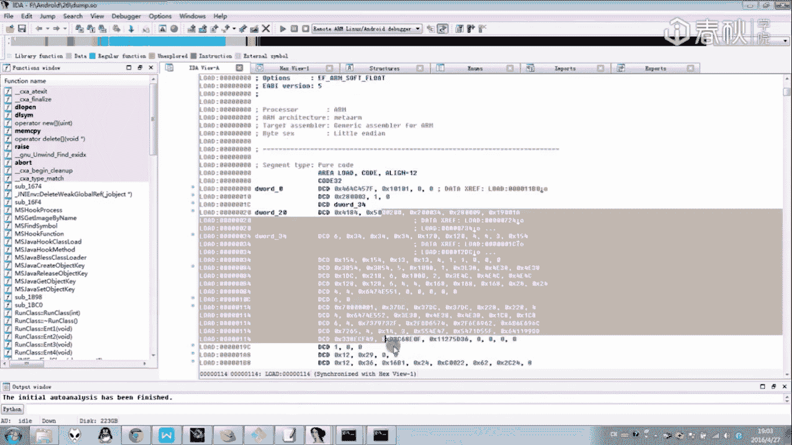

将so文件加载到Android进程内存后，其结构变为执行视图。我们可以从内存中将其“转储”（dump）出来。

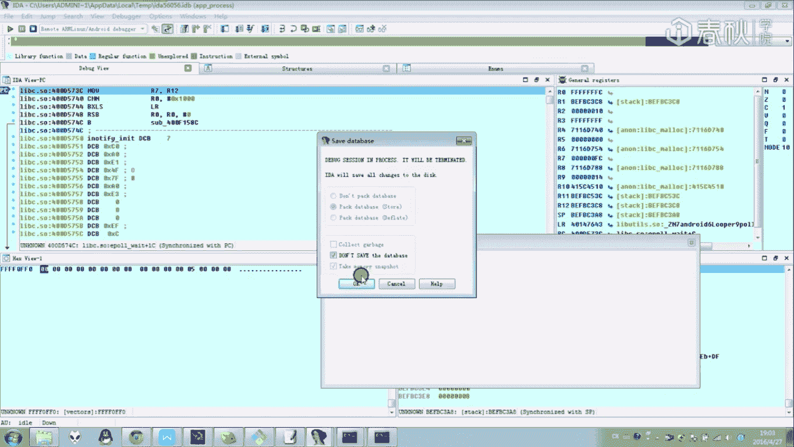

1.  使用调试器（如IDA）附加到目标进程。
2.  找到so文件在内存中的基址和大小。
3.  将这段内存数据保存为新的文件。

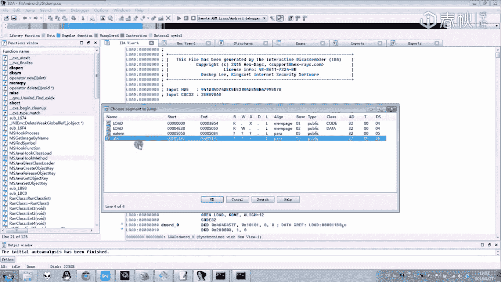

用IDA分析这个从内存dump出来的文件，按 `Ctrl+S` 查看段（Section）信息。你会发现，此时段的数量远少于原始文件的节（Section）数量，通常只包含几个主要的LOAD段、`.dynamic`段等。这正是链接视图的“节”被合并到执行视图“段”的结果。同时，由于缺少完整的节头表信息，IDA的静态分析能力会受限。

---

## 加固如何利用ELF结构？

回顾本节课开头提到的360加固样本，其导致IDA分析失败的原因现在就很清晰了：

**加固方案**：篡改或破坏了so文件**链接视图**中的关键数据——**节头表**，在其中填充了错误的或混淆的信息。
**导致结果**：IDA等静态分析工具严重依赖节头表来解析文件结构。当节头表被破坏后，IDA无法正确识别代码、数据节，因此分析失败，函数无法识别。
**为何可行**：因为Android系统加载so文件（形成执行视图）依赖的是**程序头表**和**ELF头**。加固厂商通常不会破坏这两部分，否则文件无法被正常加载执行。他们只破坏对静态分析至关重要的节头表，实现了“能运行，难分析”的保护效果。

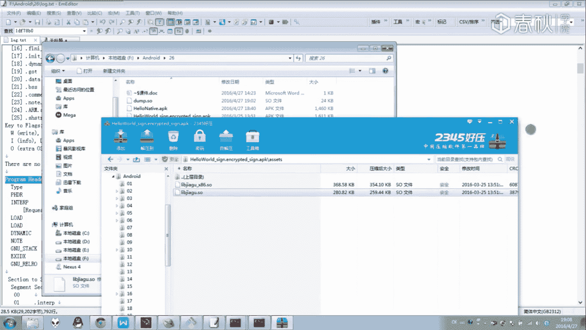

---

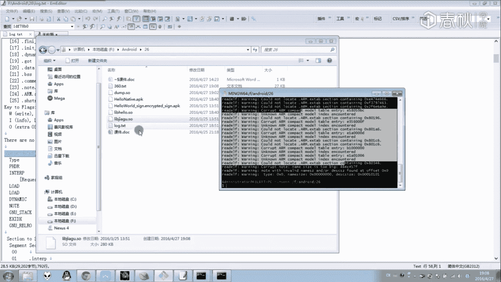

## 总结

本节课中我们一起学习了ELF文件的核心结构。我们明确了：
1.  ELF文件存在**链接视图**和**执行视图**，分别服务于静态分析和动态加载。
2.  三个核心结构是：**ELF头**（总索引）、**节头表**（静态分析关键）、**程序头表**（动态加载关键）。
3.  现代加固技术（如360加固）常通过**破坏节头表**来对抗静态分析，同时保证程序头表完好以支持正常运行为基本原理。

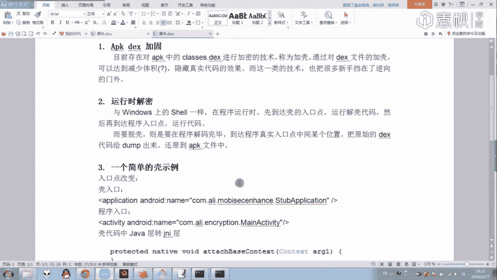

理解这些基础知识，是我们下一步学习如何修复被破坏的节头表、还原so文件原始结构并进行脱壳的必经之路。下节课，我们将开始探讨具体的修复方法。