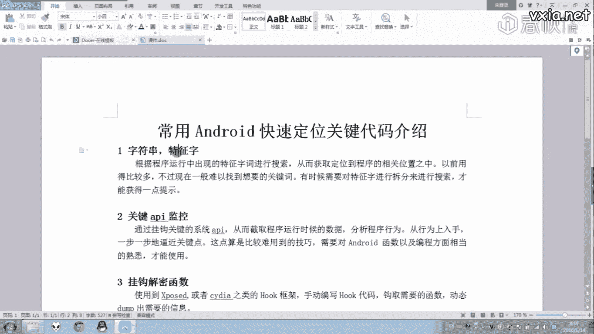
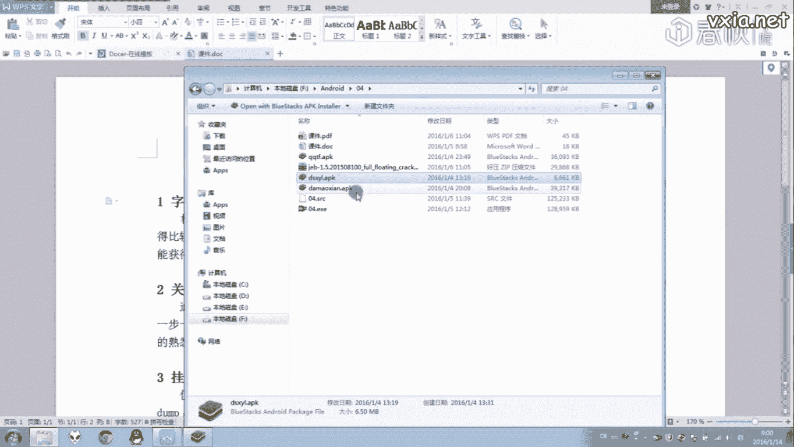
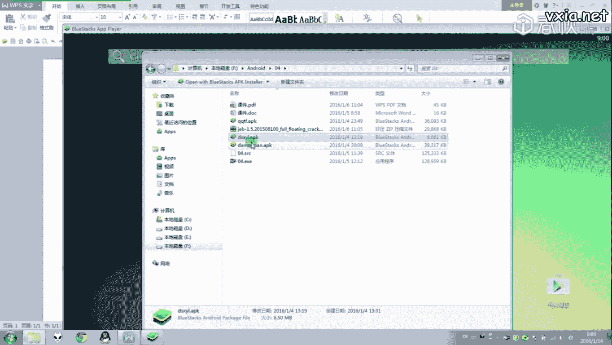
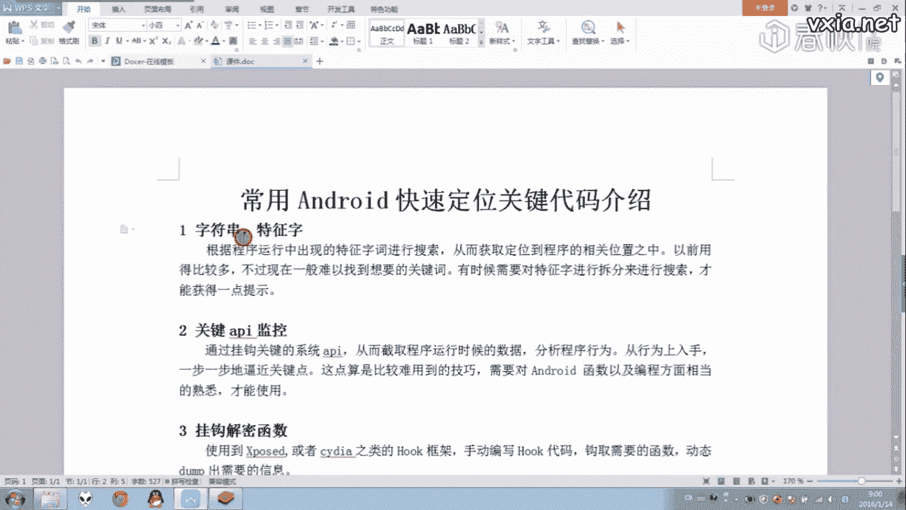
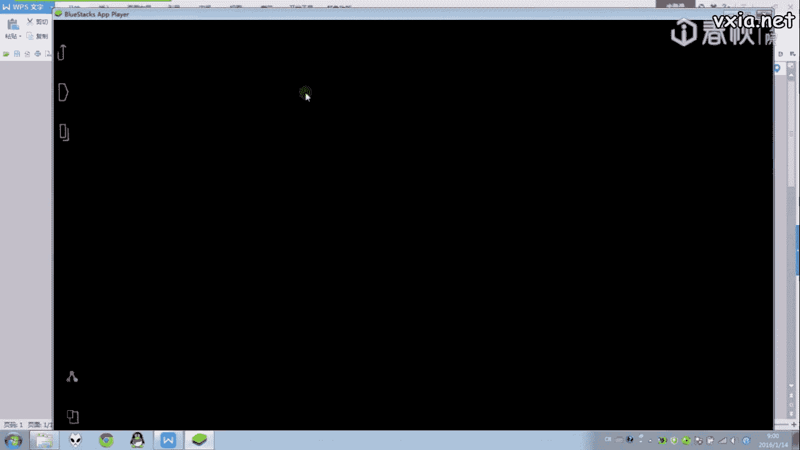
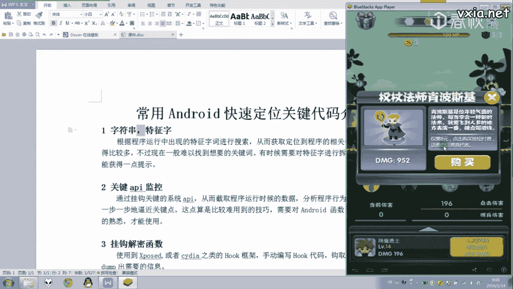
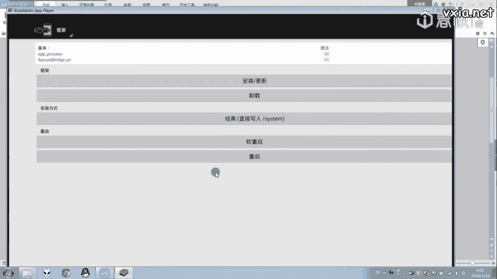
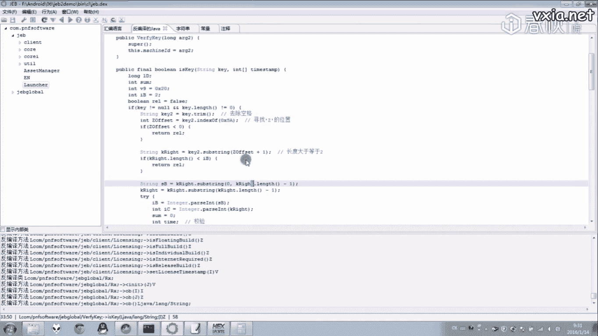

# i春秋零基础入门Android逆向 - 课时7：常用Android快速定位关键点方法介绍 🎯




在本节课中，我们将系统性地学习几种在Android逆向分析中，用于快速定位程序关键代码位置的核心技巧。这些方法在前面的课程中已有所涉及，本节课将对其进行归纳和总结。





## 概述 📋





逆向分析的核心步骤之一是找到程序的关键逻辑点，例如注册验证、网络请求、数据加密等。掌握高效的定位方法能极大提升分析效率。本节将介绍五种实用的定位技巧。

## 1. 字符串或特征码搜索



上一节我们介绍了静态分析的基础，本节中我们来看看如何利用字符串进行快速定位。这是一种基础且直接的方法，通过搜索程序运行时显示的特定文本（如提示信息、ID名称等），可以快速定位到生成这些字符串的代码位置。

例如，在分析一个游戏时，可以搜索其`GKID`等特定字符串，从而迅速定位到相关处理逻辑。




程序中的字符串通常是程序与用户交互信息的载体。如下图所示，通过搜索“购买”等字符串，可以定位到购买功能的相关代码。


然而，对于现代加固过的应用程序，此方法效果有限。因为关键的字符串常被加密，只在运行时动态解密，正如我们上节课所演示的那样。


## 2. 监控系统敏感API调用

除了静态搜索，动态监控也是强大的定位手段。通过挂钩（Hook）程序调用的系统关键API（函数），可以监控程序的行为，例如网络通信、文件读写等。

目前有许多工具可以实现此功能。例如，`Xposed`框架的某些模块可以监控应用程序在运行中调用的系统API，并输出函数调用参数及结果。


以下是使用此类工具的一般步骤：
1.  安装并启用监控模块（如`Xposed`插件）。
2.  重启设备或应用。
3.  运行目标应用，在工具中查看拦截到的API调用日志。

通过过滤日志，可以专注于分析网络请求、广播接收等关键行为。此外，也有其他工具可以专门监控对SD卡的操作等。

## 3. 挂钩关键自定义函数

对于更深入的分析，我们需要挂钩程序自身的关键函数。这需要一定的编程能力，通常借助`Xposed`或`Frida`等框架编写代码来实现。

其核心思想是：在目标函数执行前后插入我们的代码，以记录参数、修改返回值或输出解密后的数据。例如，上节课中字符串解密的函数，就可以通过挂钩来实时获取解密后的明文字符串。

代码示例（概念性）：
```javascript
// Frida 脚本示例：挂钩某个函数并打印参数
Interceptor.attach(targetFunctionAddress, {
    onEnter: function(args) {
        console.log("函数被调用，参数1: " + args[0]);
    },
    onLeave: function(retval) {
        console.log("函数返回: " + retval);
    }
});
```

此方法更为强大和灵活，我们将在后续课程中结合具体案例进行实践。

## 4. 利用Android Profiler进行方法跟踪

`Android Profiler`（或旧版DDMS中的`Traceview`）功能远不止查看日志。它提供了强大的动态分析能力，可以跟踪方法的调用栈和执行耗时。

首先，其`DDMS`视图可以查看应用日志，这在前几课已使用过。

其次，它具备线程监控功能。你可以查看应用所有线程的状态及其调用方法。


最强大的功能之一是**方法跟踪（Method Tracing）**。以下是进行分析的步骤：
1.  在`Android Profiler`中启动对目标应用的方法记录。
2.  在应用上执行关键操作（如点击支付按钮）。
3.  停止记录，分析生成的调用轨迹报告。

报告会展示记录期间所有线程调用的方法及其关系。通过层层分析调用栈，可以定位到关键方法。例如，从`Activity`的`onCreate`方法开始，跟踪到`支付按钮`的点击事件，最终找到执行支付逻辑的`pay`方法。如果该方法调用到`Native`层（`SO`库），则需进一步分析`SO`代码。

此外，也可以在代码中手动插入`startMethodTracing()`和`stopMethodTracing()`来跟踪特定代码段。

## 5. 日志输出与动态调试

最后两种是贯穿始终的常用方法。

*   **日志输出**：在怀疑的关键代码处，插入`Log.d()`等语句输出变量值或执行状态。这是一种非常有效的“探针”手段。
*   **动态调试**：使用调试器（如`IDA Pro`, `Android Studio Debugger`）附加到进程，实时监控变量、控制执行流程。这是分析复杂逻辑的利器，但当程序有反调试机制时，可能需要结合其他方法。

## 课程总结

本节课我们一起学习了五种Android逆向中快速定位关键代码的技巧：
1.  **字符串搜索**：适用于未加密字符串的简单定位。
2.  **API监控**：通过挂钩系统API动态分析行为。
3.  **函数挂钩**：深入挂钩自定义函数，用于解密、逻辑分析。
4.  **方法跟踪**：利用性能分析工具获取完整的调用链路。
5.  **日志与调试**：基础且强大的动态分析手段。

掌握这些方法并灵活运用，能帮助你在逆向分析中更快地找到突破口。本节课没有具体作业，建议你使用上述方法重新分析前几节课的APK文件，尝试从不同角度定位关键点。

---

## 附：上节课作业思路解析

以下是对上节课（第6课）`GDB`分析作业的简要思路解析，供参考。

**目标**：分析注册码验证逻辑。

1.  **定位关键点**：使用字符串搜索或交叉引用，找到设置过期时间戳的函数，并定位其调用处，即验证函数。
2.  **分析验证函数**：
    *   函数接收输入注册码和一个整型数组（用于返回过期时间）。
    *   注册码格式大致为：`[前缀]Z[时间码][校验位]`。
    *   核心验证步骤：
        *   分割字符串，提取`Z`后面的部分`B+C`（`C`为最后一位）。
        *   `B`是加密后的过期时间信息，`C`是`B`的校验位（对`B`的每4位求和后模10的结果）。
        *   校验通过后，将`B`与特定值异或解密，得到过期时间戳，存入数组。
        *   另一部分验证涉及对机器码（`ID`）的运算和比对，确保注册码与设备绑定。
3.  **逆向心得**：整个分析过程需要耐心跟踪函数流程，并熟悉Java常用方法（如`split`, `indexOf`, `parseInt`）。扎实的编程功底能极大帮助理解代码意图。

通过这个例子可以看出，逆向分析是对逻辑推理和代码理解能力的综合考验。不断练习是提升的最佳途径。




本节课内容到此结束。🎉