# i春秋零基础入门Android逆向 - P34：课时9 Android DVM 脱壳2 🔍

在本节课中，我们将学习如何对一个较新版本的360加固应用进行分析和脱壳。我们将从分析应用入口点开始，逐步深入到SO文件的修复、混淆分析以及关键的解码函数定位，最终目标是提取出被保护的原生DEX数据。

---

## 概述与目标文件

本节课的目标文件是一个由360加固保保护的APP。我们将以此为例，分析其保护机制并完成脱壳。即使未来版本有所变化，其核心原理和分析思路也基本一致。

---

## 第一步：分析应用入口点

首先，我们需要找到应用的入口点，这通常从分析 `AndroidManifest.xml` 文件开始。

以下是分析步骤：

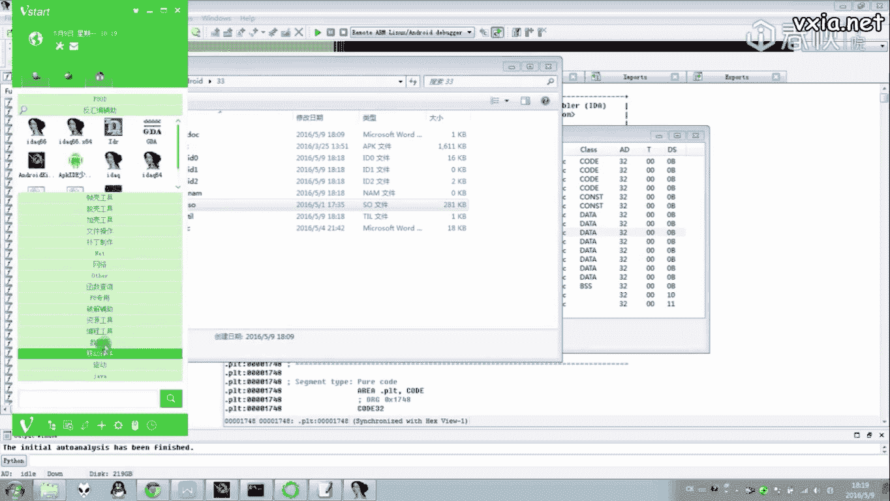

1.  查找 `application` 标签，定位其 `android:name` 属性。
2.  本例中，入口点为 `com.qihoo.util.StubApp`，这证实了应用由360加固保保护。
3.  在逆向工具（如JEB）中加载并反编译这个 `StubApp` 类，开始分析外壳逻辑。

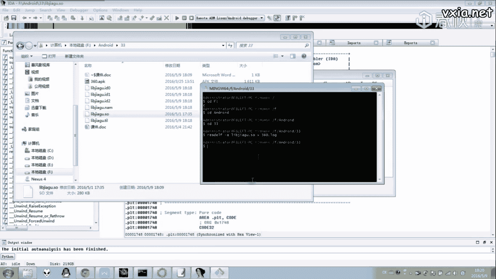

---

## 第二步：定位并修复外壳SO文件

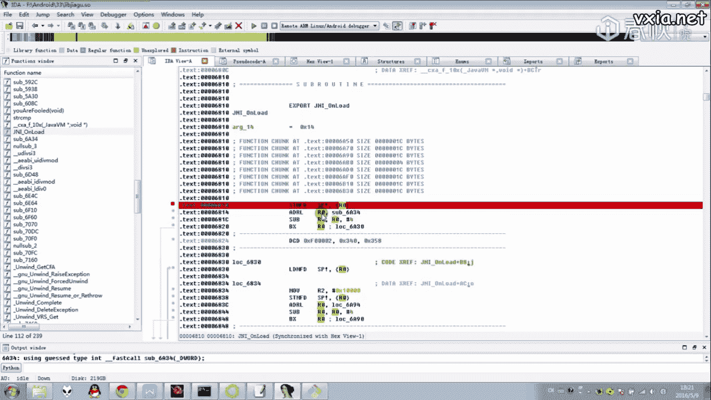

上一节我们找到了应用入口，本节中我们来看看外壳如何加载核心SO文件。

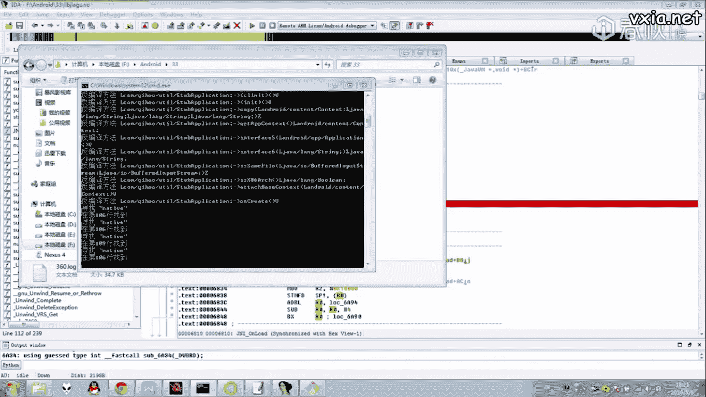

在 `StubApp` 的 `attachBaseContext` 方法中，程序会根据设备架构（如x86/arm）和运行时环境（DVM/ART）从资源中释放并加载对应的SO文件。对于DVM环境，它会释放一个特定的SO文件。

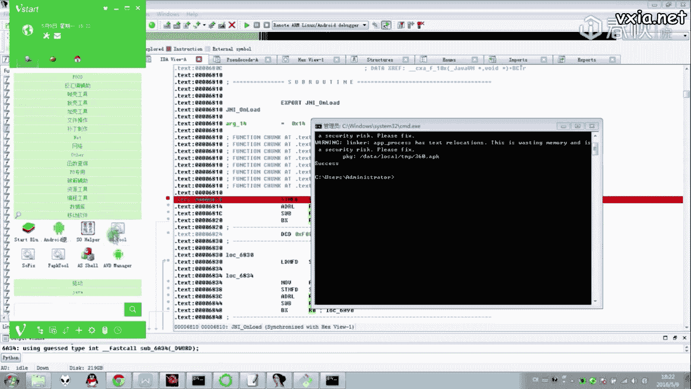

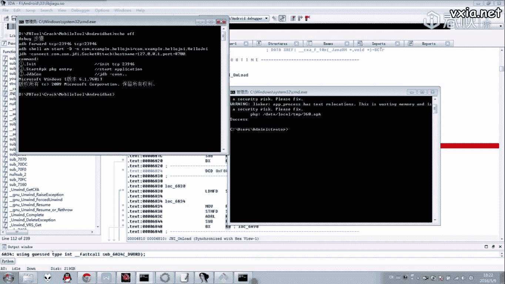

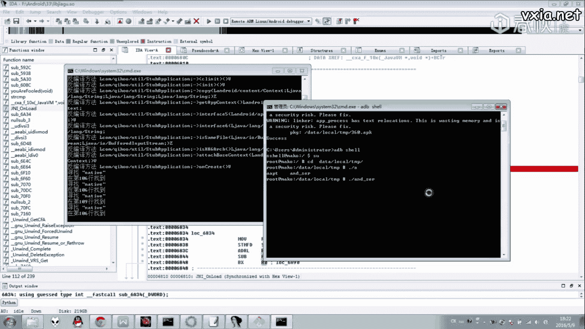

这个SO文件通常经过处理，需要先进行修复。修复方法可参考前几节课的内容。修复完成后，使用IDA Pro等工具加载分析。

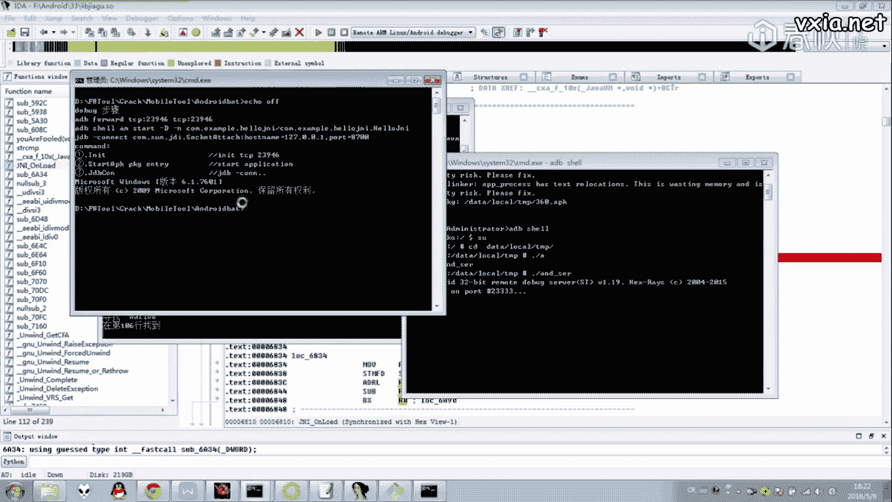

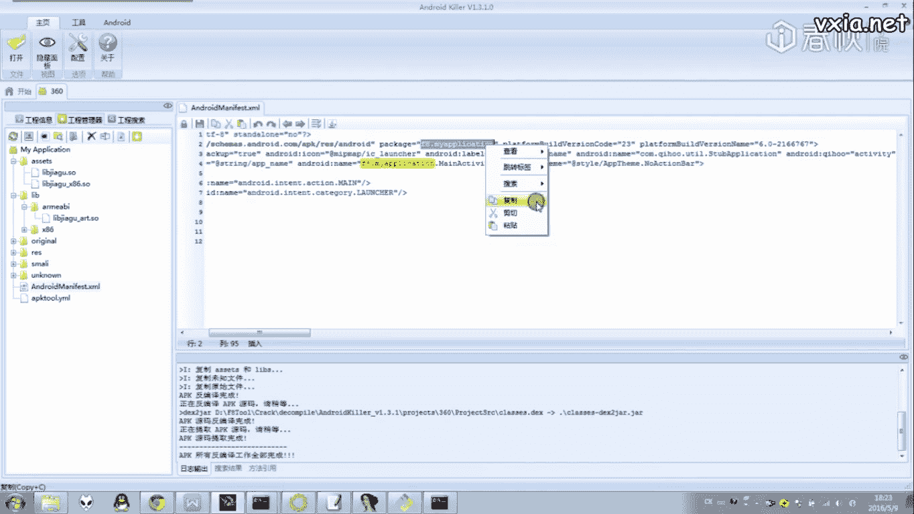

---

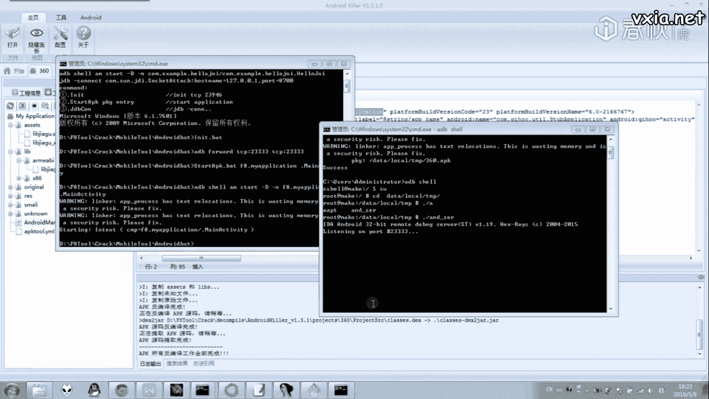

## 第三步：查找JNI接口函数

分析SO文件时，需要知道Java层通过JNI调用了哪些Native函数。

以下是查找方法：

1.  在 `StubApp` 的代码中搜索 `System.loadLibrary` 或类似加载SO的语句。
2.  进一步搜索 `native` 关键字，找到声明的Native方法。
3.  记录下这些JNI函数名，它们将是SO文件分析的关键切入点。

---

## 第四步：静态分析与入口点探查

修复并打开SO文件后，我们开始进行静态分析。

首先，检查SO文件是否有特殊的区段。本例中存在 `UPX0`、`UPX1` 等区段，表明使用了UPX压缩。接着，我们需要寻找SO的初始化函数。

1.  检查 `init` 和 `init_array` 区段：本例中 `init` 函数为空，`init_array` 也仅调用了一个空函数。
2.  重点关注 `JNI_OnLoad` 函数：这是SO被加载时，在初始化之后会调用的关键函数，通常是脱壳逻辑的起点。

然而，IDA对 `JNI_OnLoad` 的F5反编译结果混乱，说明该函数被混淆了。

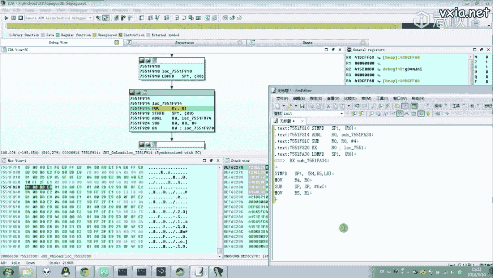

---

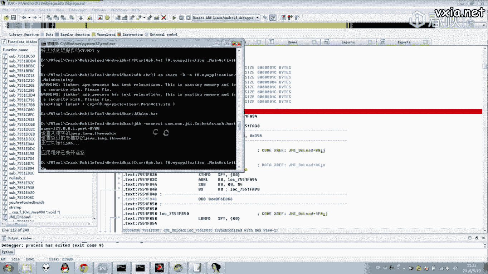

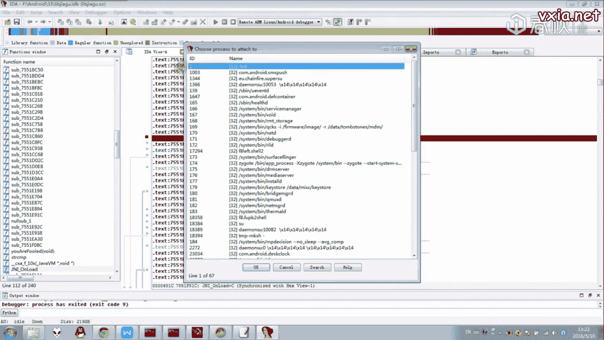

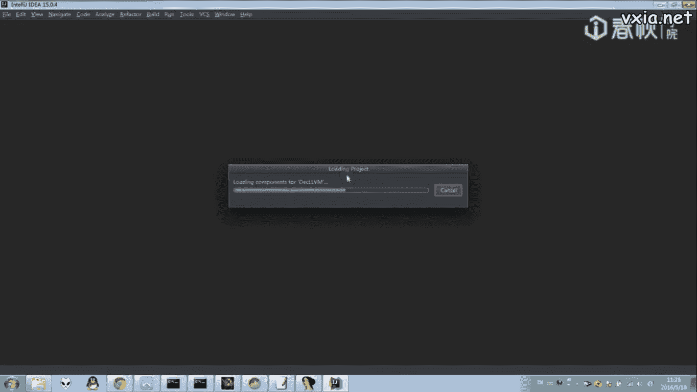

## 第五步：动态调试与混淆分析

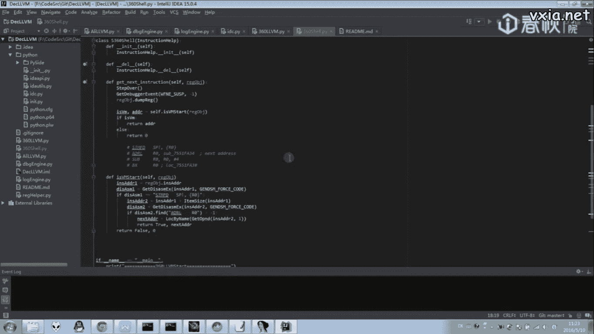

由于静态分析受阻，我们需要进行动态调试来理清控制流。

以下是调试准备步骤：

1.  确保应用已处理反调试（参考上节课内容）。
2.  以调试模式启动应用：`adb shell am start -D -n package/name/.MainActivity`。
3.  使用IDA附加到目标进程，并设置断点在 `JNI_OnLoad` 函数。

开始调试后，单步跟踪汇编代码。可以发现，360使用了**控制流扁平化混淆**，其特征是大量通过计算地址进行跳转的指令块，中间穿插着真实的业务指令。

这种混淆虽然干扰了反编译器的分析，但模式固定，可以手动或通过脚本进行还原。

---

## 第六步：编写脚本对抗混淆

手动分析混淆代码效率低下。鉴于其模式固定，我们可以编写IDA Python脚本来自动化还原控制流。

脚本的核心逻辑是：
*   识别特征指令序列（如保存寄存器、计算跳转地址、跳转、恢复寄存器）。
*   将这些指令序列替换为等价的直接跳转指令（`B destination`）。
*   从而让IDA能够正确识别函数边界和流程，进行反编译。

运行脚本后，`JNI_OnLoad` 的函数逻辑变得清晰可读。

---

## 第七步：分析关键解码函数

清理混淆后，我们分析 `JNI_OnLoad`。它主要进行了一些初始化，并调用了一个关键函数（名称被混淆，如 `cxa_` 等）。

动态跟踪进入这个关键函数，发现其核心操作如下：

1.  **拷贝UPX压缩数据**：从 `UPX1` 区段拷贝数据到新申请的内存。
2.  **UPX解压**：调用解压函数，对上述数据进行第一层解压。
3.  **申请内存并二次解密**：根据解压后数据的头部信息申请内存，并调用另一个函数进行解密（可能涉及密钥运算）。
4.  **跳转到解密后的代码**：解密后的数据是一段新的函数代码（位于新申请的 `DEBUG` 区段），程序将执行权移交过去。

这个最终被执行的函数，才是真正负责**加载和解密原始DEX文件**的核心逻辑。

---

## 第八步：提取内存Dump

由于解密后的代码和DEX数据都存在于动态申请的内存中，IDA调试结束后这些数据会丢失。因此，必须在调试过程中将它们从内存中转储（Dump）到本地文件。

以下是转储步骤：

1.  在调试时，定位到解密数据所在的内存区间（例如 `DEBUG` 区段）。
2.  记录该内存块的起始地址和大小。
3.  使用IDA的脚本功能或插件，将该内存区域的内容写入文件。

为了确保数据完整，建议将包含解密函数及附近可能相关的内存区域一并转储。

---

## 第九步：分析转储文件

将转储出的二进制文件用另一个IDA实例打开。

1.  设置正确的加载基址，使其与动态调试时的地址匹配。
2.  让IDA重新分析，识别函数和代码。
3.  定位到之前找到的核心解密函数（现在是静态地址），进行分析。

至此，我们已经成功绕过了外壳的混淆和保护，定位到了最核心的DEX解密逻辑。具体的解密算法分析和DEX提取操作，将在下一节课详细讲解。

---

## 总结

本节课中，我们一起学习了针对360加固壳的完整分析流程：

1.  **入口分析**：从 `AndroidManifest.xml` 找到外壳 `Application`。
2.  **SO分析**：定位、修复并加载外壳SO文件。
3.  **对抗混淆**：通过动态调试识别控制流扁平化混淆，并编写脚本进行还原。
4.  **定位解密逻辑**：跟踪 `JNI_OnLoad` 及后续函数，找到UPX解压和二次解密的过程。
5.  **内存转储**：在调试时将解密后的关键代码和数据Dump到本地。
6.  **静态分析**：对转储文件进行静态分析，定位最终的解密函数。

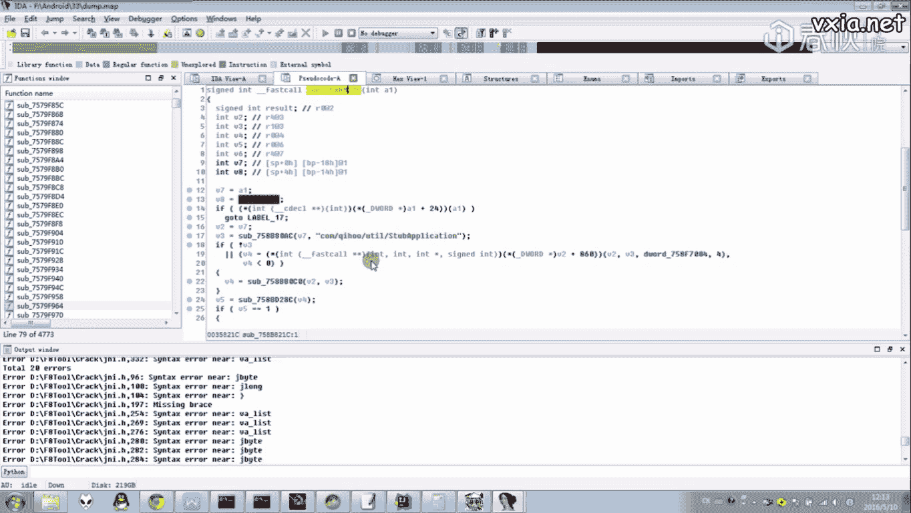

这个过程涵盖了Android逆向中脱壳的常见技术和思路，掌握了这些，对于分析其他类似的加固方案也大有裨益。