# i春秋零基础入门Android逆向 - P35：课时10  Android dvm 脱壳3 - 老网恋教父了 - BV1sg4y1B7zB

🎼홍。

嗯，好的呃，大家好，这里是0日安全论坛的安卓零基础逆向热门培训教程，我是蒋包。那么接下来的话就来讲一个安卓DV脱壳第三课，这节课将会把上一节课还没有讲完的一个脱壳内容给搞定。

那么我们给还原到上一节课的一个课程中。那么这里呃一个地址，还说已经进入到一个调试这样一个状态。然后话这边还动出一个map地址出来，然后进行了次重定位。

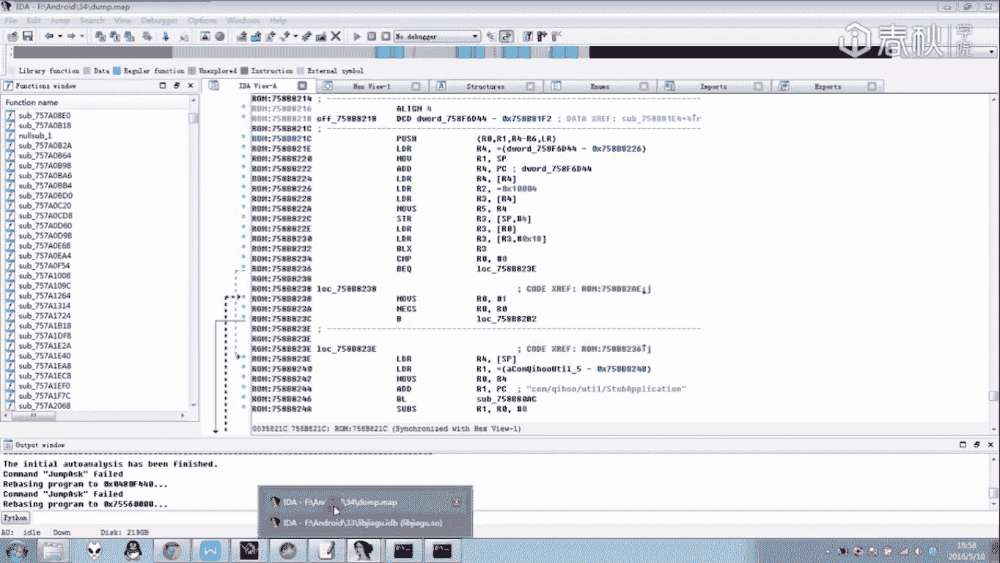

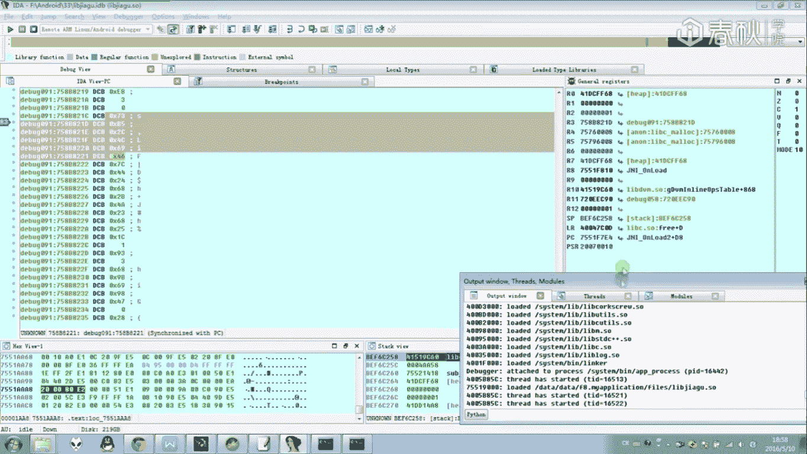

嗯，那么这里呃其实的话这样动出来卖的话，把地址进行下重定位的话，理论上就能够直接使用的。因为这个整个安卓程序，从理论上来说，它每一次呃加载的时候的一个位置是。

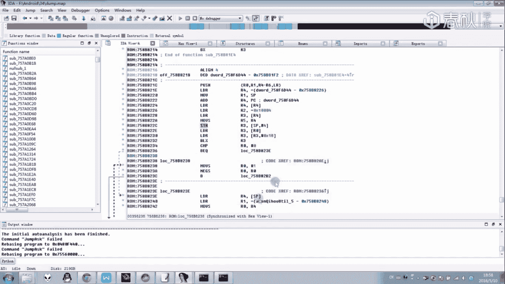

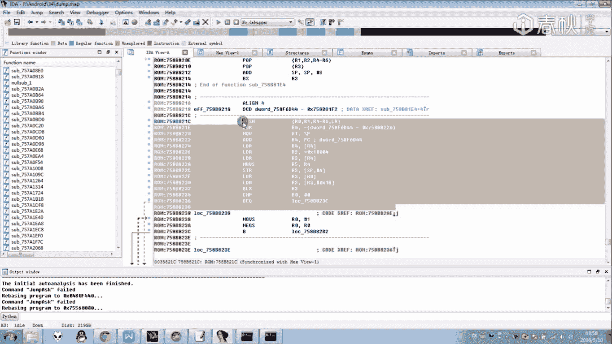

应该是一样的。当然偶尔的话在一些基础上反馈不一样。那么这点请大家注意了。那么注意一下，把一个相应的一个位置，然后函数的地址给找出来，然后进行一下，从另外。

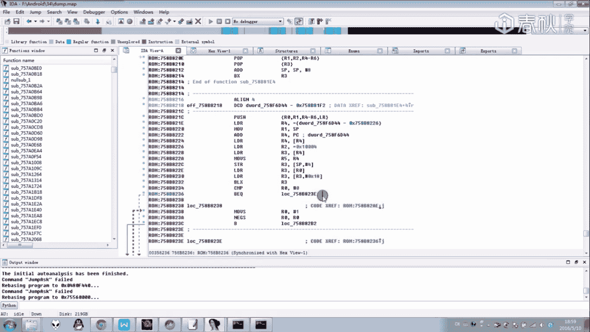

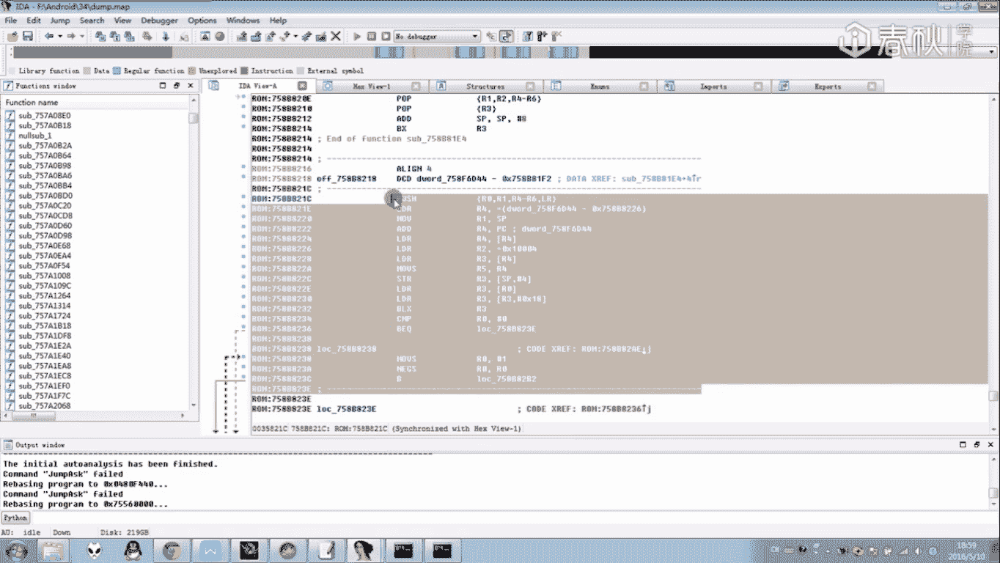

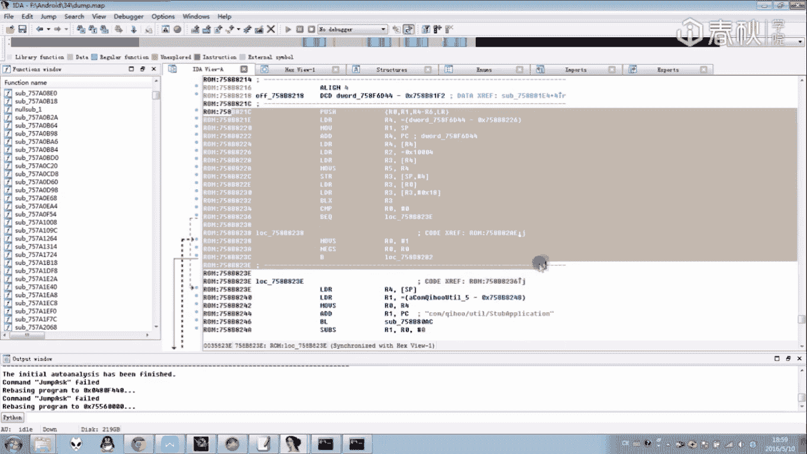

好，那么这里已经找到这个2塞个地址在这个地方。好，我们这里嗯这是一个创的一个函数，我们改一下。

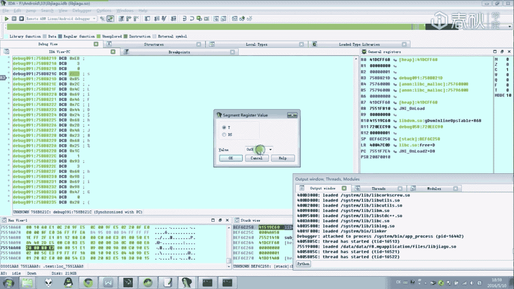

啊，然后创建一个函数，通么这里就是我们要找的一个J爱 on的一个函数。然后再个4个4。诶保管房管。那么在这里呃这个函数这个汇编的函数框就对应着我们动出m数据的这个地址。我们看一下他的地址。

我们呃这里已经对完了。好，这个地址是这个地方，我们来开始进行一个调试。首先它这里已经识别为一个创的一个数据了，我们把它转换到函数，然后按F5进行版面一。

那么这里可以看一下话这样直接转换出来代码还是比较清晰可行的。那么在这里的话哎还是一样，进行一些参数修改后加载一些我们的一个head文件。

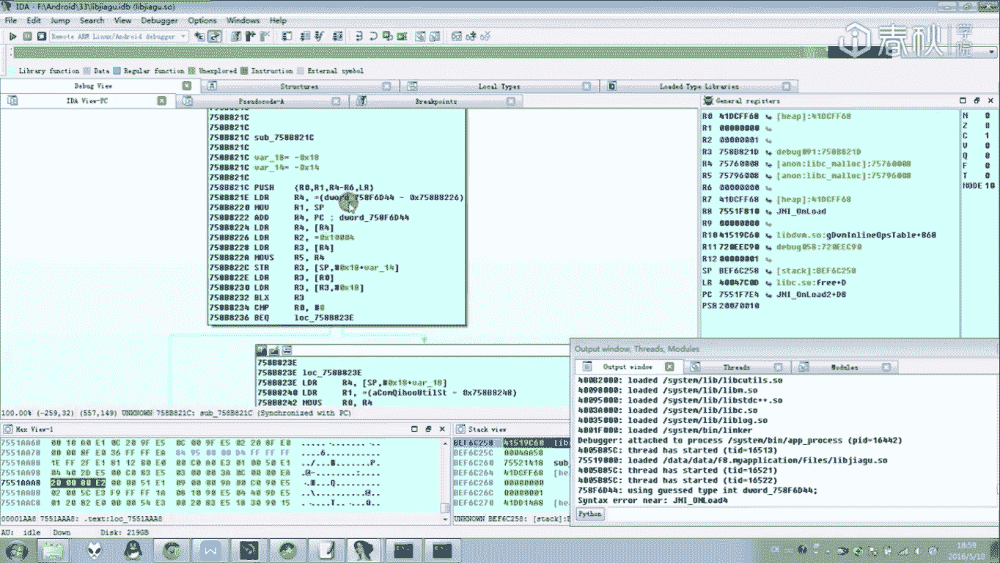

好，我们这里直接load一个sfin header好，结果这样直接加载，它提示失败，这是为什么？那是因为我们当初加载的时候，并没有按照按照它的一个loader的方式来进行一个加载，所以它默认的很多属性。

很多设置的话并没有被搞起来。那么在这里我们需要手动的去进行一些设置才行。啊，我们来看一下它要求我们进行什么设置啊。首先第一个就是一个compil在otioncompr这里我们要设置一下我们的一个编译器。

好，在这里找到它。那在这里由于这样一个呃这样一种呃GNI的跨度是使用一个更加加来进行一个编译的好，我们都选这个。啊，那么下面等一下默来找一些，我们继续来loadify，然后加载一个head文件。结果。

他我们本来应该理论上刚加起来成功，结果发现上面哎他提提的这样一些问题了。呃，那些一些本来应该有的数据没有被加载过来，这是为什么呢？这是因为他呃。

它里面的一个complier没有被设置完成一些特征库没有被加载啊，我们进来加载一下它的一些特征库will open view里面可以看到里面有两个la，一个是sign，一个是然后安卓一个I的话。

就根据这两个文两个两个view里面的一个加载过来的一个sign文件的话来进行库文件的一个加载，我们打开好，那么这里它说没有办法去呃识别这compilr，我们打开它然后按键插入我们的一个呃识别库。

那么在这里首先我们插入一个IM的一个编配库那么接着再插一个加加的一个库好，更加加un好，把这两个库插入过来以后，那么这里的里面可以看一下。

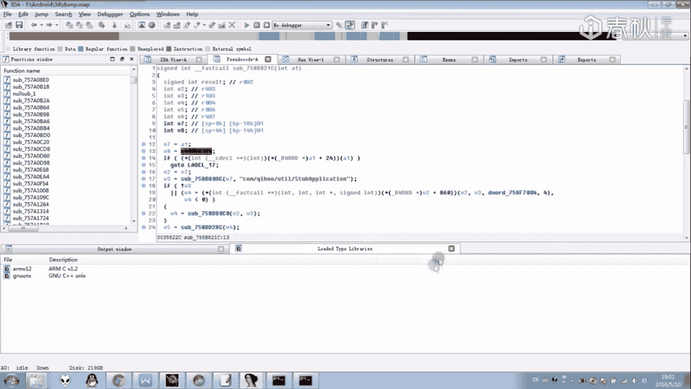

里面的话就已经导入了一些标准的一个类型了，都能够在这里识别。并且在这种情况之下的话，我们也能够唉这时候也能够正常的一个加载一个head文件了。

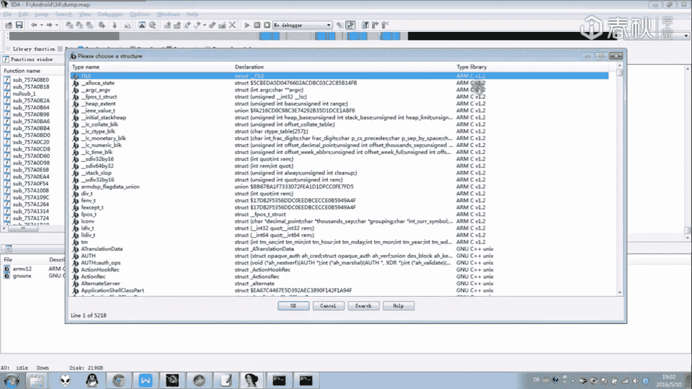

好，再把它加载过来。加载完以后，就能够按照我们平时的一方式一样进行一个调试进行一个测试了。那我们来继续考。

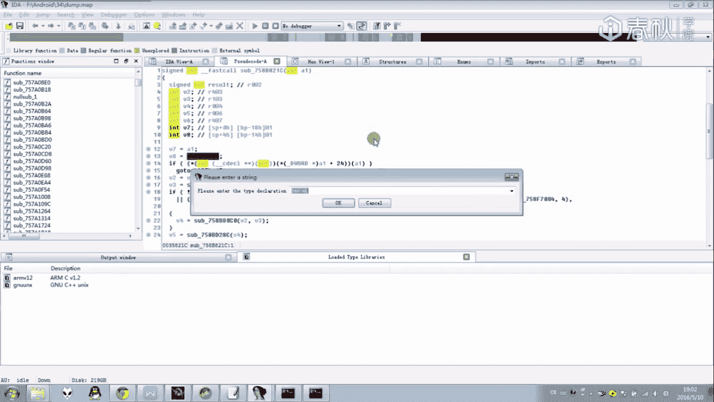

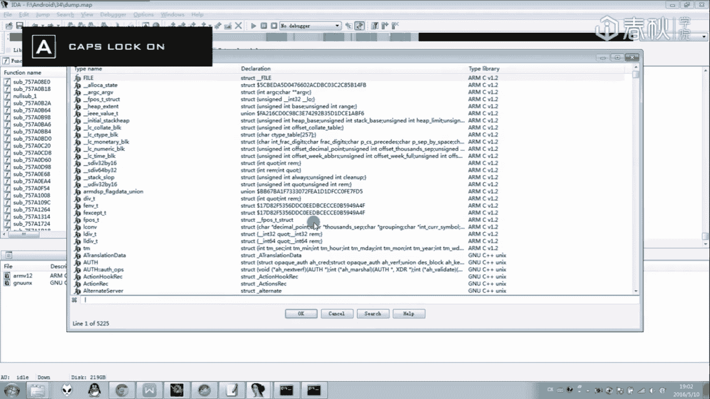

火车左边。然后第二个是一个遮加 in one的。啊，我们在这里改一下，第一个它就是一个价约。然后这是一个中央 onload函数。

一个它面然后它调一个environment的数据来获取到一个environment的结构题。那么这里就是一个EANV的一个结构。好，把这个地址改一下。

那么在这里哎可以看到它开始对我那个我们的一个nike函数来完成一个注册了。注册的时候存放在这个地方就是这个地址就就存放我们的一个Gme结构体。然后它长度是4，我们修改一下它。然后长多这是。

然后这里是一个let table。呃，改一下它是一个长度为4的一个数组。好。可那么这里就把它的一个名称，还有它的一个呃特征码，以及它的函数地址都分别存到这个结构体中去了。我们双击过去的话，就能够看到哎。

这是interface5，还有interface678都有。那么下面的7和8没有被注册，没有被加层注册的话，你应该不会用到就不用管。我们这里可以把一个5和6的一个地址给搞一下。特征这样子。

然后函数地址在这这是我。然后下面的class6。那么这下面两个就是分为47和8。哦，把这条改一下。

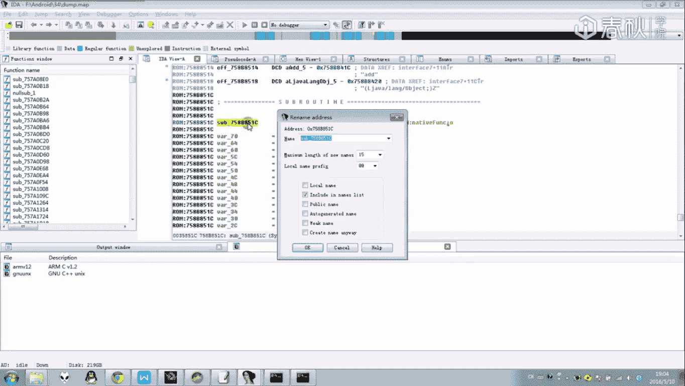

那么方便我们后面分析好，我们回到刚才那个J的一个函数，我们回到这里，我们继续来完成分析。首先这里就是啊这到放下一个的话就是一个函数，这个函数才显上就是一个fin class函数。

它寻找这样一个class文件。因为它就要进行一个动态注册嘛，然后就要寻找我们的这样一个这样的一个类。那么这一个类就是一个proces application的一个类就是一个入口的程序。

用来释放呃application入口点，我们点击过去的话，可以发现哎它第一参是J。

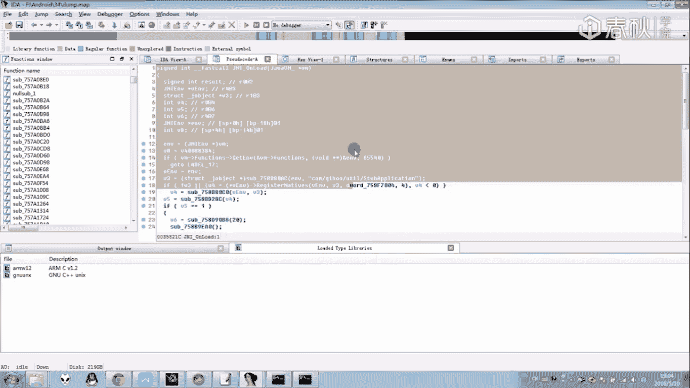

然后调到fin class里面，哎，就来找到我们的一个类啊。我们加fin class。好，那么这里先找到我们的class，然后注册一个ly函数。那么这个写过GNI的话都被按接到这个结构条。

那么下面就到这个函数，还不知道怎么用，双击过去看一下。好，这里第一个参数也是GNR environment。哎，这是一个清除异常的一个函数。我们这个放配公馆。好，清除完异常以后，哎，就到下一个函数。

下一个函数的话注意一下啊，它另个反义词是一或者是2，如果是一或者是二的时候，就分别调入不一样的一个数据。好，我们来看一下这一和二可能不一样。我们走到这个函数里面去进行进一步的一个分析。嗨哎。

我们来看一下那里面的夸降到。这里都是一些啊函数。那么具体一个分析话挺类言的。那么我们可以根据这些字符串的特征来大致猜一下这个函数到底是干什么的。首先它里面调到1个D2的1个S文件。

就是这个SO的话是用来加载某一些函数的一个地址的。那么这个的话很有可能是判断这个SO有没有加载或者说是什么之类的。

然后下面可以看到有个DVM有1个CRT然后根据是不是DVN还有ART的话来进行一个返回值哎这V字的话，就是一个一为一还是返回为2。那么很显然这个就是判断这个程序是一个ART模式呢。

还是运行在一个DVM模式去下的。哎，我们可以拆想来的话，其实在这里就是对一个程序的一个运行版本进行一个判断。并且哎进行某一些初始化的一个操作。好。那么我们就来进行一个命名，进行个猜想。

那么假如哎假如是一个D一样的话。假如CAADN模式下话就执行这个函数。假如CAIT模式下话哎就执行这个函数。那么默认默认情况下都获取不了的话，就执行第三个函数啊。

第三个函数的话就是1个DVM模式下哎完全一样的一个函数啊。那么这两个函数里面到底干些什么东西呢？哎也可以尽快进去看看一下，大致看一下，那么这个的话希望大家熟悉一下的话，哎，这些地址啊之类的。呃。

很显然就是一些用来解密的一个函数。对吧这是一些需要我们进行一个解密的数据。那么其实啊这个函数里面就根据我们的一个家长的一个模式进行进行一个函数的一个解密。哎，把它这些东西都解密完以后，哎。

就能够给返回了。那么这里无论是DVM还是CRT哎，这里实际上就是一个解密的一个函数而已。对吧下面的话哎也是一样进行一个结构体的一个初始化。

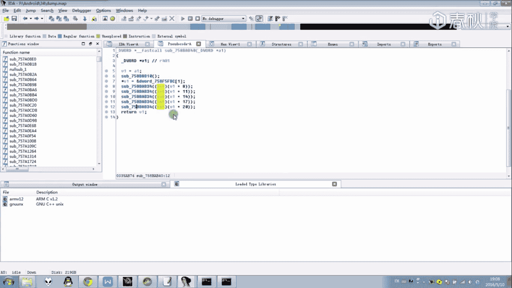

好，那么前面这些都不怎么重要，实际上都不怎么重要，或许是进行一些资源的释放，或者说是进行一个资源的解密，这都有可能。但这个并不重要。我们最关最关注的是它在哪一个地方把我们的一个ds文件给释放出来。

给还原回来了。我们最主要就是找到这一个点，然后把原始的d数据给当出来。哎，那么结果在这里我们看到上一个函数中所反回的这样一个结构体中，在下面调用了，然后调用完以后哎，就根据这样调的结果给反回数据。

如果是反回复一的话，那么这个SO文件就加载失败。如果是反回这一个的话，哎，它就加价成功了。

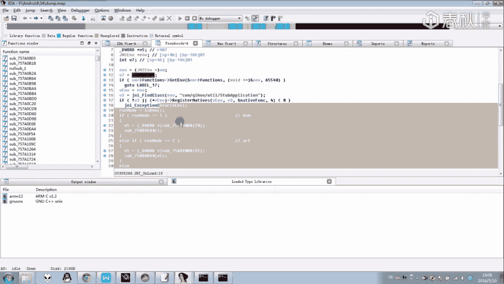

那么这个学后JR都知道，我们写JII的时候要返回这样一个GIword的一个数据。哎，这样的一个SO文件才会正常加载，否则整个程序就会报错。那么很显啊这个这个函数就非常重要了。从我们一个编程的角度来说。

这个函数就变非常重要。哎，那么我们可以大胆猜想，实际上这个函数就是用来释放DEX数据的一个地方。假如释放DEX数据释败了，哎，那么它就把负一，让整个程序直接崩溃掉，打不开。如果成功的话，就把它一个JI。

哎，那么整个程序就继续跑起来了。所以在这里我们是要跟踪到这个函数，我们要看一下它到底是调用到哪一个地方。因为这里来看一下这是一个偏异地址的一个plus一个文件，我们找一下它是在调到哪个地方的。好。

我们看一下B2叉L3。它是对应着这个地址和A我们在对应的地方下一个断点。

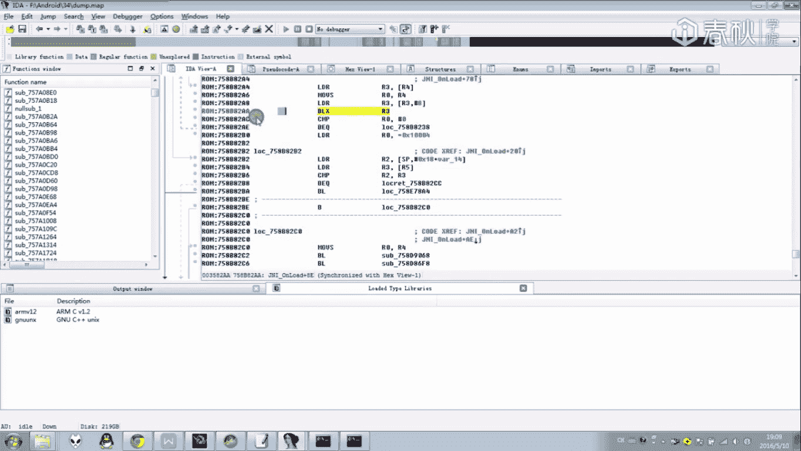

找到它下一个断点。呃，到这里下一个断点，然后看一下23数据。执行起来。好，那么这个时候已经在断下来，然后准备跳转到我们的1个23的函数中去，跟过旭方看一下，它还是处于一个底报表区段之中。

那么这里它的一个个位数是一个一是一个基数。那么跳过来的时候可以转成一个创的一个模式啊，那么这里就在这个它上一个地址就是函数的起始地址转成一个函数。

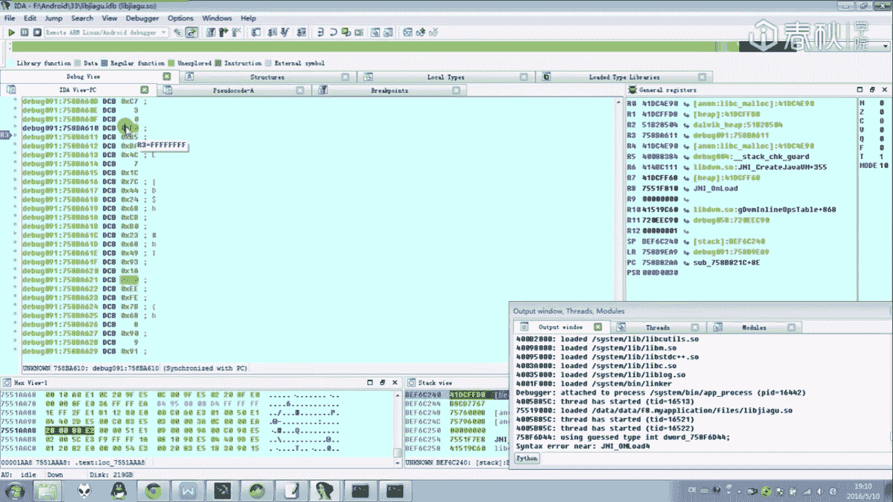

好，那么函数开始地址在这个地方，我们转到洞城面中学进行了分析。哎，已经分析出来，就在这一个函数地址中啊，左成函数。然后进行F5反面义分析，我们看一下它第一参是什么东西啊，第一参第一个参数。

我们回到刚才那个地方，我们看一下它第一个参数什么。它第一个参数的话就是它传递过来的Ds指针，就是一个class文件哈。哎我们记住它传递过来是一个ds指针。我们再回到那个函数中去。假设这是一个什么。好。

都是啊假算是一个dere函数。我们来看一下它app管变E代码，我们看一下它是怎么操作的。首先我们大致的浏览一下，可以让我们直接看出来的一个数据。首先唉它从内存中找到这样一个pas的一个文件，哎。

它找到它干什么呢，哎，继续往下跑。哎，有个report，还有一个是哎，这个有没有可能是一个签名验证，对吧？然后假如哎这里是vis有可能是加载失败，然后就把错误信息，然后直接跳转退出了，对不对？哎。

然后这里是一个循环，这个循环到底干什么呢？它很有可能就是进行一个资源的一个释放，比如说带手键的释放，哎，然后不断的进行一个循环，然后解密释放，对吧？然后后面的话应该还会有一个替换的什么之类的，哎。

下面的话还有X个T。那么这里无论怎么看，都是与那个DVM。都是1个DS文件释放是很有可能很有可能的。所以这个函数的话，我们目前就认为它非常可疑。所以我们就接下来要对它进行一个详细的分析。

看一下它一个可阅地方在哪？有必要的时候哎，甚至还需要进行一个动态跟踪。好，首先视明是一个d的一个指针。然后下面13方就是选用取中它的一个函数地址了。我们来看一下它的一些函数。

首先我们遇到这样一个DX一个文件，我们来看一下它到底干什么的。像这种情况，我们说你过去，你也看到吧，它这里的话就是读取到这样一个process一个m数据，然后再进行一个变利进行一个判断。

那我很想要夸克是读取内存中的一个map的一个文件，然后从中来寻找我们的一个啊寻寻找我们的这个地址。然后里面里面有一个回调函数，就在这个地方。哎，找到这个文件以后。

就调用到这个回调来干一些不叫什么奇奇怪怪的事情。而且有过安卓变程经验都知道，像这种情况，这种的个max数据的话，它内存中的话肯定是指向我们自身的一个将来过来的des，不信的话，可以这样直接搜索一下。

看对吧？

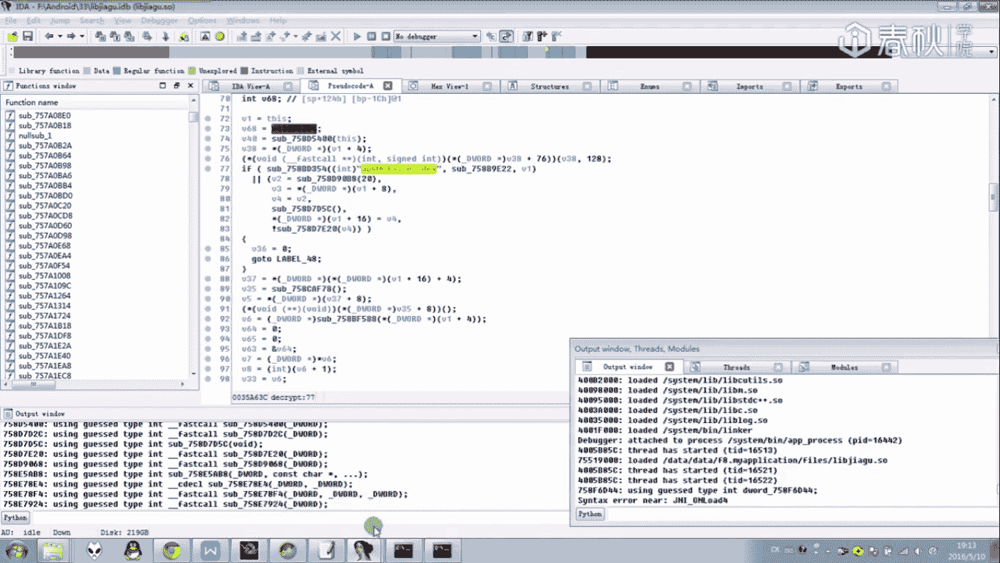

肯定是指向我们的这样1个APK的1个dess文件起始地址了。所以但这里实际上就是定位到我们原始DEX的起始位置。

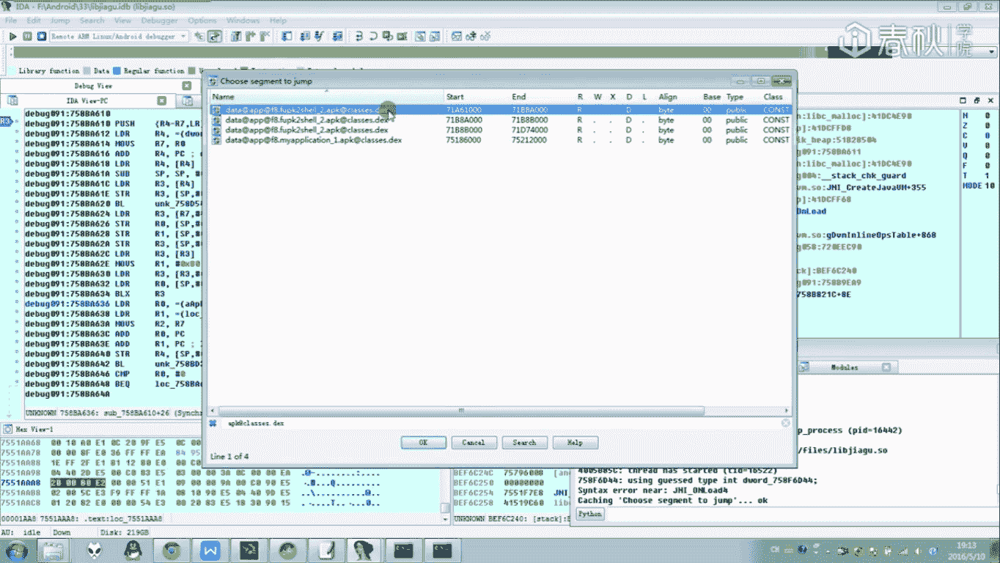

并且进行某一些操作。那么这个360它为什么要进行这样的一个操作呢？啊，这是由360它本身的一个比较特殊的一个性质性质给决定的。因为它360它本身的话，它加密完以后的一个dess文件的数据呢。

它是直接存放到一个扩展到一个dess文件里面中去了。好，那么这里我们可以看一下。对可以看一下，呃，可以看到上面上面的一个d数据的话是特别大有500多M有5500多K。如果是其他的d的文件的话。

实际上哎像这种这么一个class的一个d数据的话，实际上可能顶多也就只有呃十几K左右就完事了。

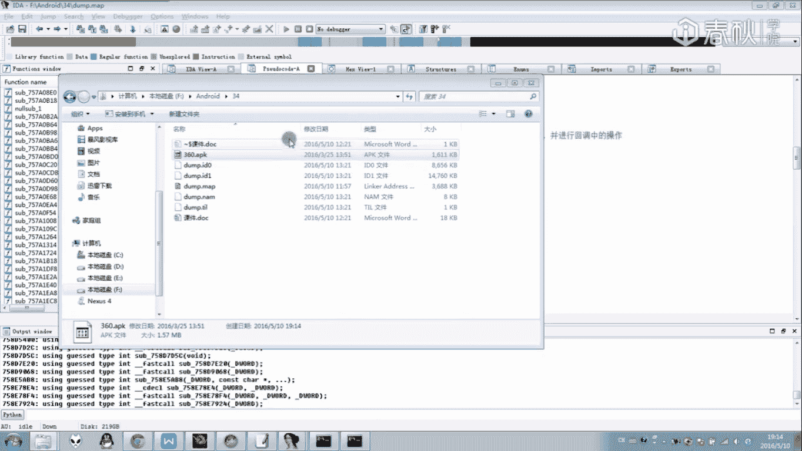

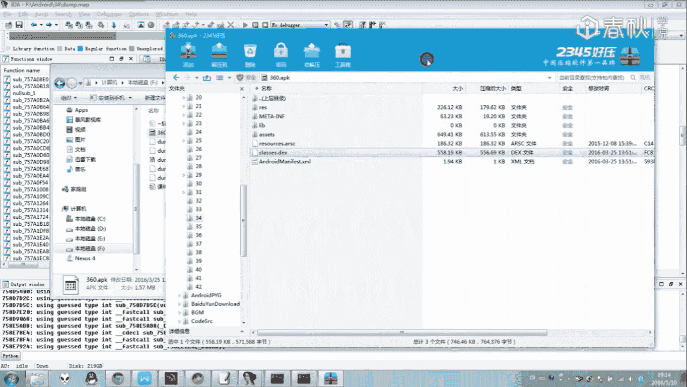

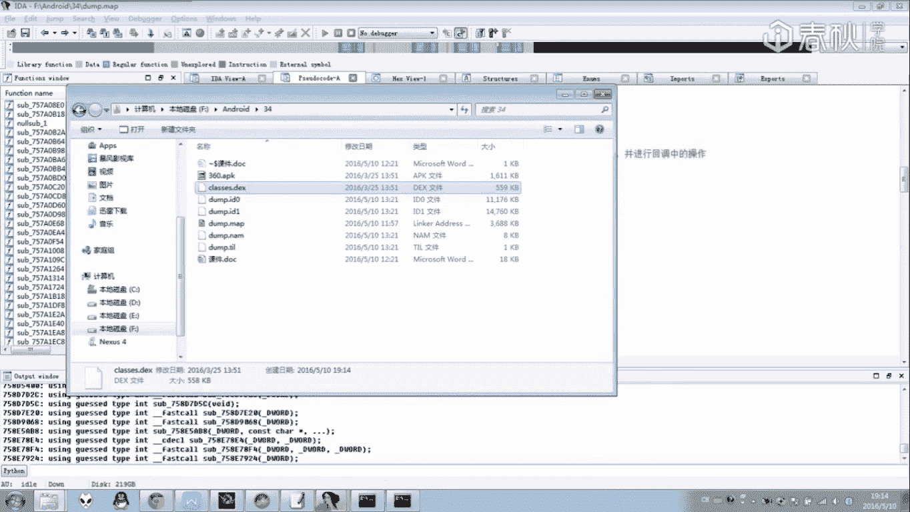

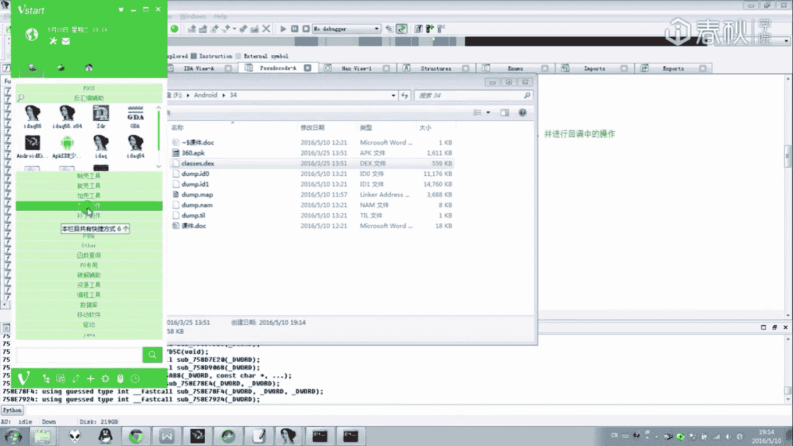

那么既然他有这么多K的话，那么他肯定是拥有一些冗余的一个数据的。我们跑一下脚本，看一下它哪一些数据是有效的。我们看一下文件为哎，就在这里，到这个地方就已经结束了。

那么后边的这一堆数据都是对于这一个des文件是不需要的，是额外被pa上去的。那么实际上后面这一部分数据的话，就是原始的DS数据进行一个加密，以后压缩，存放到这一块地址的。

所以360它在解密的时候也需要定位到原始的DS文件基的地址，也就是定定位到这一块地址，然后进行某一中裁某种程度上的一个解密。好，我们把这个解密都这个地方都记录下来。

我们准备来看一下它是怎么去操作这一块内存的。

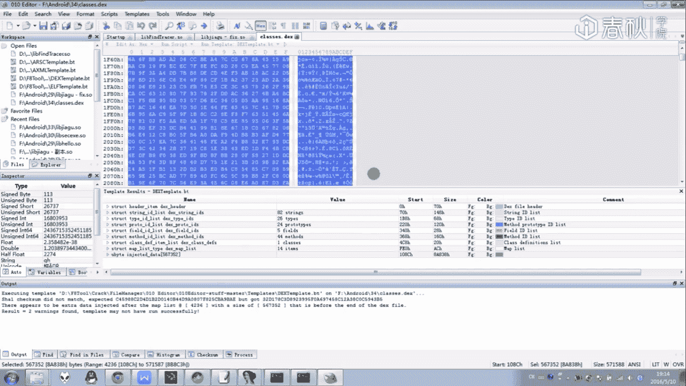

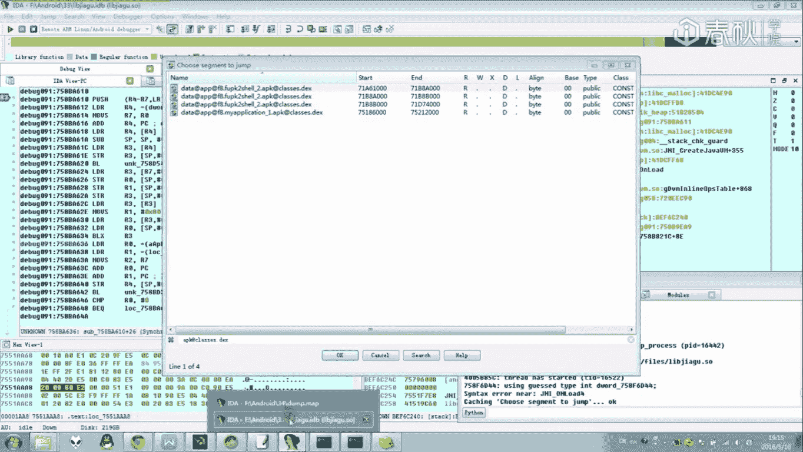

并且在这里我们已经知道它已经开始定位我我们的一个内存地址了。我这里写就是在这个地址里面要干一些羞羞的事情了啊。然后里面的话又是一些类的一个函数的一个调。哎，像这种对于类的调用的话。

我们就可能需要进行个跟踪，才能看到它一个进行了什么东西的。当然到目前为止，我们还只是进行一个大致的一个分析。所以在这边的话，我们只是需要大致的去了解一下他到底干了一些什么东西就行了。哎。

对吧我们大致的来跑一下，看一下它找了一些什么东心，这用到一些什么函数。好好，这里的话应该是成功失败之类的。然后下面是一个外循环。对吧然后一个Y中也会也会有雷加，然后是什么的？哎。

结果我们慢慢跑一下函数的话，这个Y中的函数是非常可疑了，大家看一下。哎，这到2G4一个方法，可能是用IG4来进行某种解密，对吧？

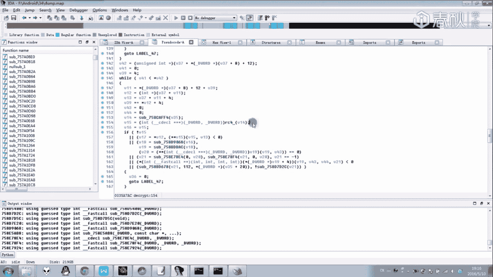

这有可能是调用的阿RT4进行一个解密。那么这一段的Y内容的话，很有可能就与个DDDX文件解密相关了。我们继续来找一下它其他的一个函数。哎，比如说这里就是初始化1个RT4的一个结构体。好。

那么这里的话呃一个vis。

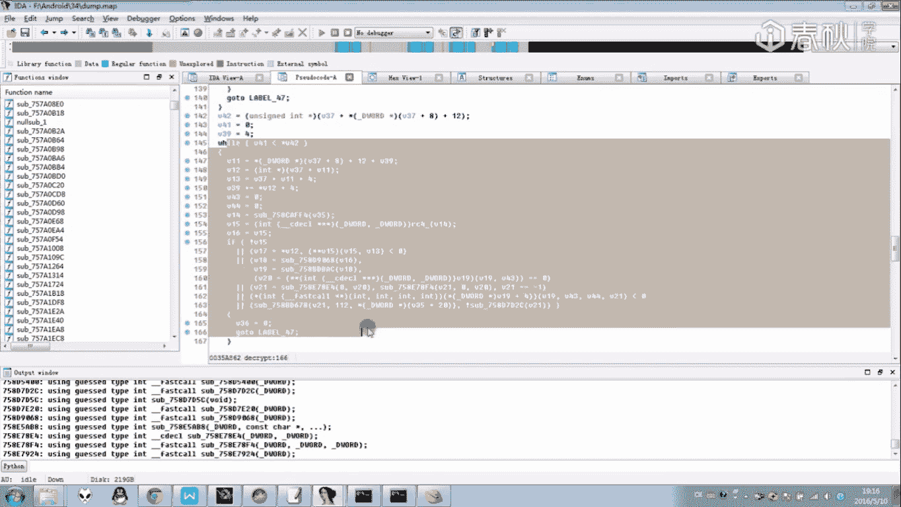

然后什么的，我们来慢慢跑。那么这里的话就给vis给服务一个地址。这个地址到底是干什么的，我们也可以跳过来来继续看一下。

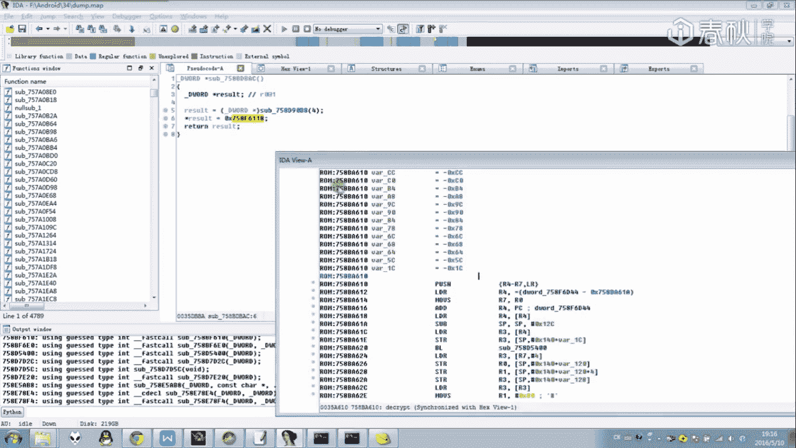

对吧？好，那么这些嗯都可以都可以大致的去浏览一下。有兴趣的话就呃有兴趣的话可以去跟一下这一部分的话，就是用来进行1个DAS文件释放的。好，那那么这一步就是最后的一步疑抑惑。

对ds文件进行个抑惑进行一个解码。哎，接着就对它的一个d子头来进行一个判断。比如说在这里就是判断它头四个字节是不是DX杠N。如果是的话，哎，就等明证明它解压成功了，哎，直接直接返回。哎。

然后下面的块就是进行一个函数的一个函数图的替换之类了。

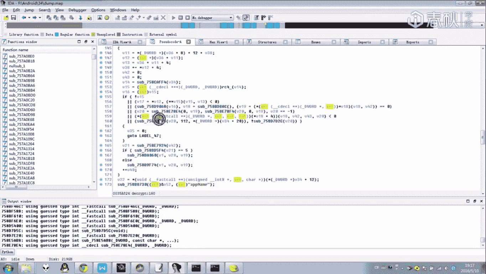

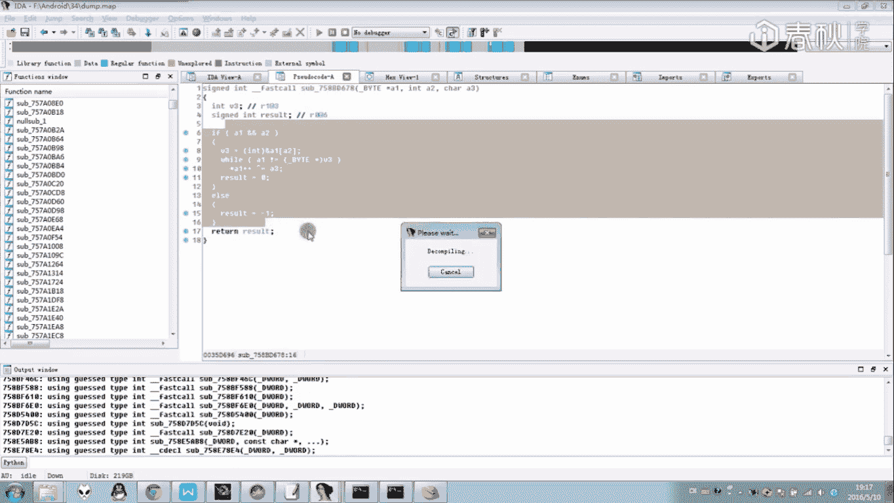

好，那么下面的话就可能是对于某一些类进行一个初始化。好，那么在这里在这里我们通过一个正态分析的话，就看到有几个函数比较可疑。特别是这样一个Y循环的地方的话，这里面很有可能是超与超级没有关。

并且哎在这个地方话可以看到一个desk头的一个数据。这里很有可能是比较4个字节跑过来的话，说定里面就是一个文字比较的一个函数。所以唉把这些数据都记录下来以后。

我们进入到这样一个Y循环中来一步一步的进行一个判断，来看跟踪一下。好，那么这是一个Y循环的一个起始地址。好，在这个地方，我们到对应的地方下一个断点。然后进行大步的调试。好，哇。

这是一个外里面循环的一个地址。呃，从一个万循环里面哎往慢跑下去。那么我们觉得有有关键的一个函数的话，就是在一个value的地方。来在这里下一个断点。

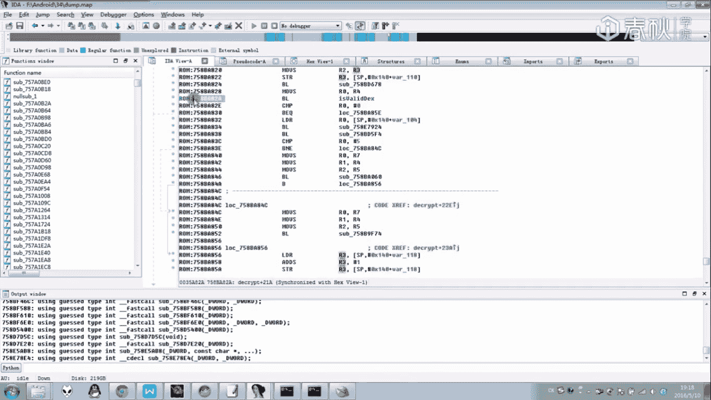

提醒一下，这个函是比较重要。那接下来就开始进行一个单步跟踪，我们登过去23周，慢慢的看一下它是不是在这个函数里面完成一个解码。啊，首先就跑到1个APTX这样一个数据中来进行一个文件的定位。

麦中的个数据的一个定位。在这里好，我们跑过去来看一下它返回地址好是0。好吗？那继续走。好呃，在这里我们第一次走的话，就直接用F8，不要因F7进去一些函式中来看它做什么了。

我们最主要的话就是用F8来不断走。然后关注一下它计存器窗口的一个变化，因为从这样计存器窗口中，很有可能去泄露出某一些比较关键的一个信息，遇到比较可疑的一个函数的话，哎，就可以这直接跳转过来，跳转过来。

然后看一下它里面到底出现了什么操作，对吧？比如说这里哎像这种情况，看一下L一就已经发现它定位到这样1个75186000的这样一个地方，哎，前面是D1Y030。

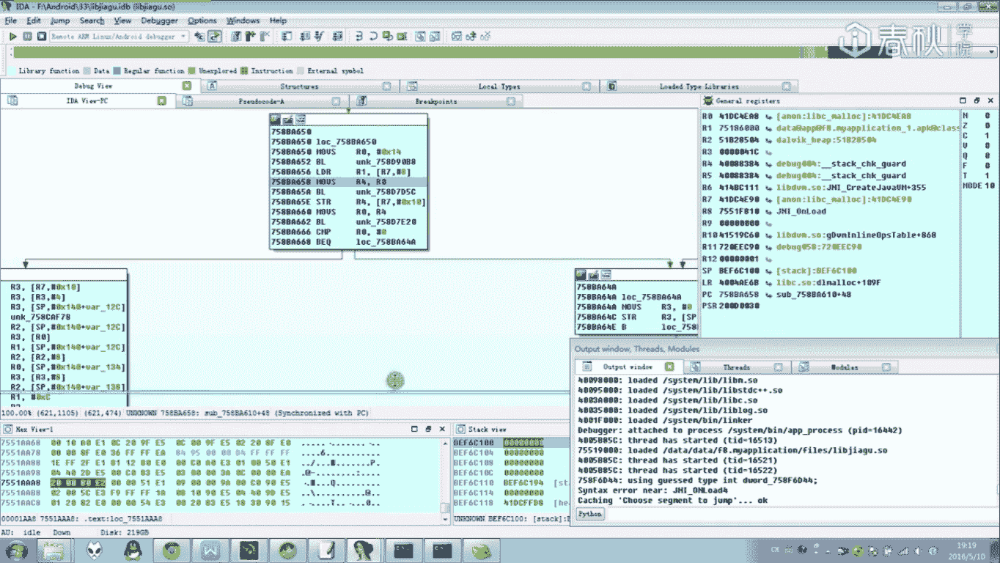

比如说这1个75186000的一个地方，我们来看一下它的一个地址。嗯。在这里就定位到我们的1个ABK的S文件的一个起始地址了。那么这里唉上面已经进行了一个matt数据的一个定位。

那么在下面哎它定位到这个地方的话，显上就要呃继续往下跑，定位到我们的一个压缩以后的一个数据，然后进行一个全面的操作。

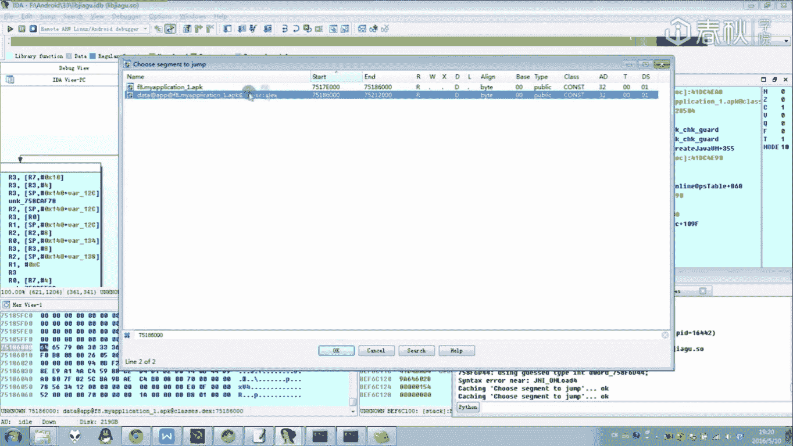

那么在下面的话，我们就继续跑下去。好，那么这里画哎一些函数地址，比如说它定位到这个地方。啊，我们来跟踪一下，看一下里面啊，可能是检测我我们的一个啊一个设置上的一个版本了。

那么我们就通过这样的一些数据来不断的进行一个检查。来看一下它需要读取的一些数据，还有说一些key之类的啊。啊，从中获取到我们想要的要关键的一个信息。好，那么在下面，那我们再继续跑。啊。

们在这里呃在这里已经定位到我们的一个压缩以后的一个数据了，就是一个被加密以后，数据就在这这一块。它在这边已经定位到了看到吧？然后92RT12啊什么的，然后下面就是要进行一个相应的一个解密操作。

进行一个还原之类的。哎，都可以在这里去进行一个搞。慢慢跑慢慢跑。注意一下它来这里的一个内存的变化。慢慢走过去。好，那么这里就进行了比较。我们来看一下跑到哪个地方啊，跑到它第一个Y里面去了。哇。

这个还不重要，我们继续跑。我们注意的看一下这计存器中落在它第二个区段的一些数据，或者说是它溜出来的一些数据。那么这些数据的话，很有可能是用它用来存放它解压解码来数据的一个地方的。我们把这些都留意一下。

然后注意一下跟踪。好，那么这是一个Y循环。我们可以看到在是一个Y循环里面的话啊，没有看到特别重要的一个信息。所以呢这边就直接快速的一个跑过。好，我们到下一个。地方好到这里为止，我们跳这时间。

然后看到这里来对这样一个report字幕串中，可能进行某一些操作了。我们来看一下，我们来看一下他到底干些什么东西。好，走过去。好，可能还不这么的重怎么重要，哎，继续走。来看一下它里面的一些参数。

还有说它一个函数的一个反黑词。来到这个地方。好，继续跑过去。那么因为这一部分内容的话，看不看不懂的地方的话，直接跑过去。好。我继续跑。哎，然后这里的话已经进入到我们因为比较重要的一个呃地方了。好。

那么在这边的话就要可能要慢一点了。因为刚才已经分析中已经收到过这部分的内容很有可能是有个解码是相关的。我们数下去注意一下哎，154，还有说它一个内存中的一个地址，滤出来一个数据。

比如说这几个加密数据之类的。特别是函数调用的时候，哎，我们要注意一下。比如说这个函数我们来看一下的话。好，那我这个函数化是进行某一种初始化，我们跳过去。那么下一个函数的话就是降到个二级4雷的地方了哈。

对吧24那么可能是进行1个24获取24函数，或者说进行24的一个减面。因为有可能我们直接跑过去，这里也是一样跑过去。然后到这个地方，哎，这个地方就变成了这一个这一个东西，这个地址在干什么的。

我们目前还不知道。把这些哎这些有可能有用的数据都记录下来，都留意留心一下。好。然后又是1个26的一个函数跳转，这时候注意一下20和21250的话呃是我们刚才的赋予过来的地址。

然后2121的话就是我们解密完解密以后数据的厚一点点厚一块地方，哎，然后呢它的长度是1个866C186C1什么呢？一个概念呢，就是我们的就是大概就是这里的这个呃呃所有的一个长度。

除除去它加在密头一个长度。实际上话这个的话就是类似于一个简密函数一样的一个地方。啊，我们慢慢跑过去。好，看一下2022120221。澳们播。填数据的话啊。注意来获取一下，再跟踪一下，然后又是一个跳转来。

我们来看一下它的一个入仓，还有一个出餐。对吧是像这种样子的，像这种样子的这两个都留意一下。好，到下一个函数是一个zero这这段的一个数序。好继续跑。然后又是一个跳转，好，里面数据还是这一块。

那我们看一下这一块数据，它到底用它来干些什么东西。很有可能就是利用它来进行某一些加解密的一个操作呗。那我们来慢慢跑。注意一下注一下。那，因为在这因为实际上到这里的话，原始第一X数据已经出来了。

只是我们还没有离还没有看到而已。那么在这里的话就是跑下去。哎，就会看到这里哎这个函数就把它原始ge头给还原过去了。那么下面的这一段如果是这个带数据比较熟悉的话，就会发现这一段。

实际上就是存放一个带数据的一个地方。哎，是不是和这个结构不是非常类似的，对吧？哎，这就是存放一个dash数据的一个地方，我们走过去。呃，刚才这里的话已经找到我们的一个des tool。

那么在这里这一个就是一个完整的一个desash文件。啊，我们从这一个函数开始就能够进行一个脱壳，然后进行一个把它动不出来的。那么这里就是对一个dess的一个头四个字节进行一个判断的一个地方。哎。

我们看一下，把这个地址和d数据给d出来。我们跑一下一个dm的一个脚本。

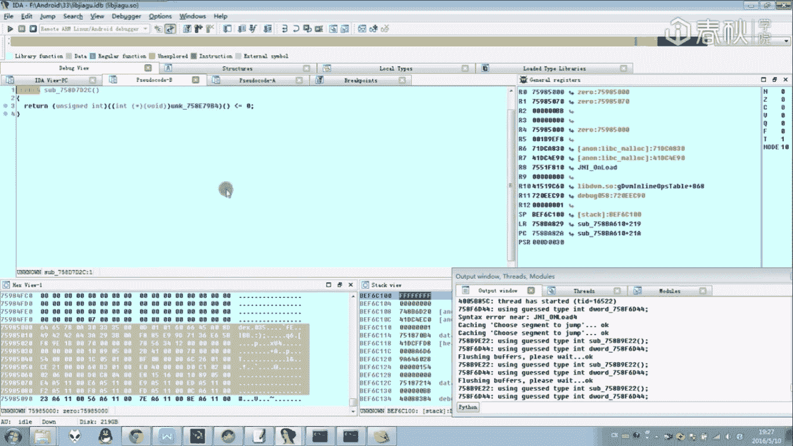

你们拷一下这个脚本，然后把我们的数据给弄出来。那么它起始位置是这个。好，我们跑一下这职业脚本，其手地址在这里。然后它的长度的话就在这一个地方，哎，对电s文件的格式比较熟悉的话。

它的长度就在偏1为0差20的一个地方，大小是1个EB什么什么。91F8好，那么它大小是这样，我们把这个数据给动出来。然后给放到这里。好，然后跑先跑一下这个脚本。那么由于这一个呃但始文件的话还是比较大的。

我们这个脚本可能要跑得久一点。然后大家可以看到的话，从刚才对于这样一个商业元的可给分析下来的话，可以发现，实际上呃这个可他呃对加减密的话也是这样一个一回事。所以比较重要的话，哎。

比较关键是话还是一个耐心。只要有足够耐心的话，肯定能够把这样一个相应的一个解码的一个地方给定位到的。因为程需要加长他肯定会存在这样一个解压啊解码的一个顺序段的。那么我相信的话，只要有足够的耐心。

谁都能够找到这么一个地方。那么其他壳话哎也是类似的。找的，只要找到这样一个脱壳底的话，就能够把这样一个壳给脱出来了。那么下面我再额外说一下，为什么这里是一个外耳的一个循环呢？

我么可以看到的是哎在这里有一次这是个Y循环，然后进行一个加载。那是为什么？哎，这是因为有一种有一种情况，就是一些APK文件，它里面可能并不只包含1个DAAEX文件，可能有一个多个des文件。

那么这里就通过一个Y循环，把这里的多个dess文件给通通给解码出来，那么就完事了。

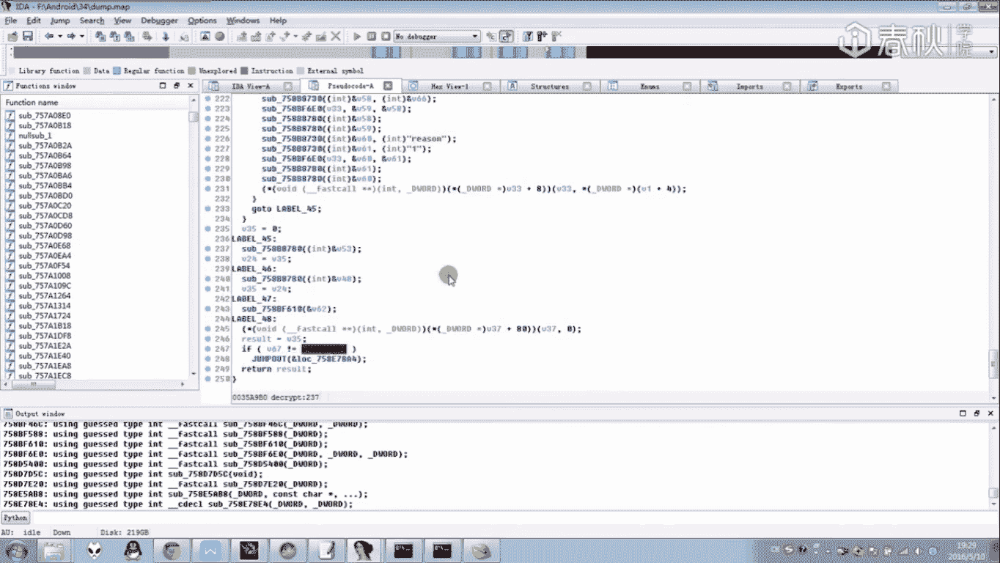

那么这里是通过一个Y循环来进行一个解码的。那么由于我这里加密的一个ds文件，就只有一个ds数据。哎，所以这里的Y循环只执行一次。

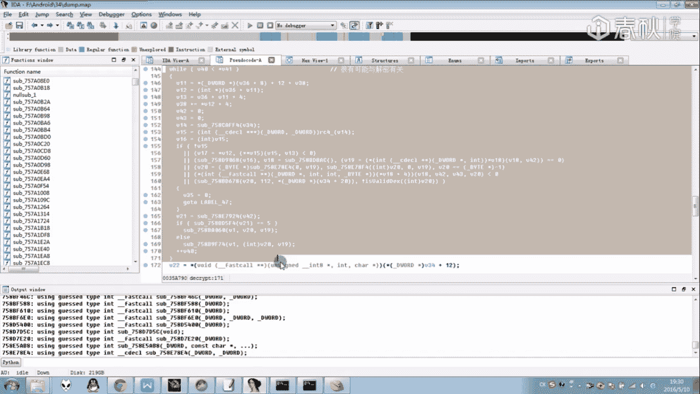

好。

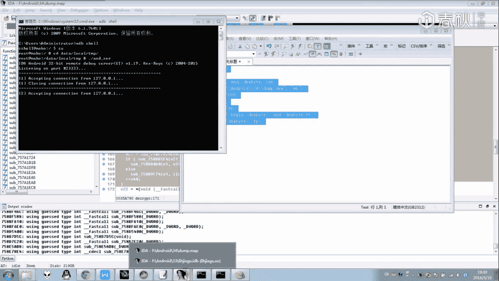

这两块已经把整个数据给动出来了。我们看一下还动出来这个EN多的一个数据，我们看一下它的一个。他的一个是不是有效的？加载。好，我们把它给加到内存中去，然后等它完成这个东西。唉，看一下是不是已经完成了。

那么这里就是我们把一个原始最原始的一个d数据给全部搞出来了。

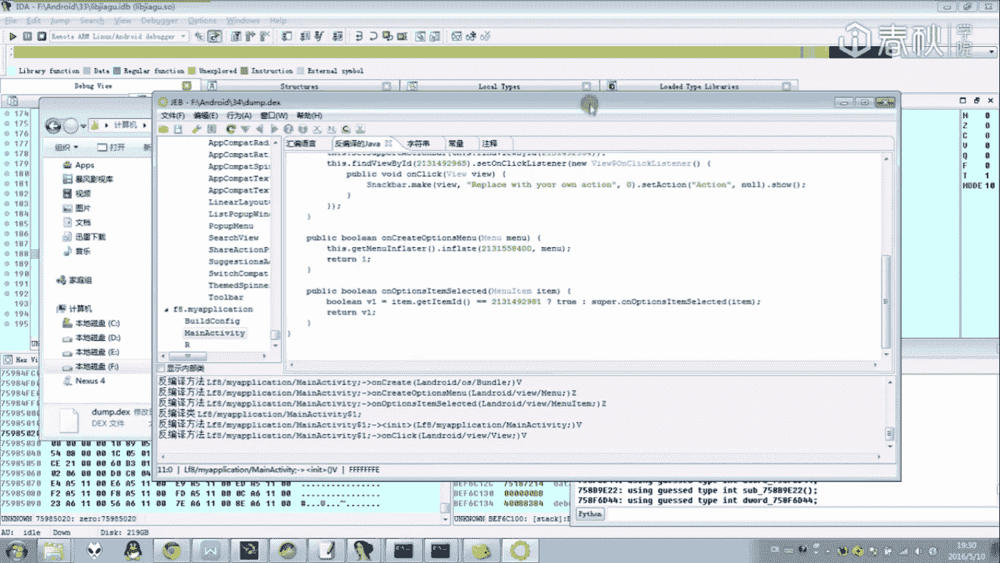

对啊，所以全部搞出来了。那么这个带数据的话，就可以给放到我们原始APK文件中来完成一个呃修复。好，这里既然我们已经把一个原始的APK给搞出来以后，那就能够完成一个修复了。

那么修复的方法和我DVN托第一课中哎讲到的是一样。这里既然把一个原始数据给搞出来，我们就对它进行一个反问意，然后放到1个APAPK中。

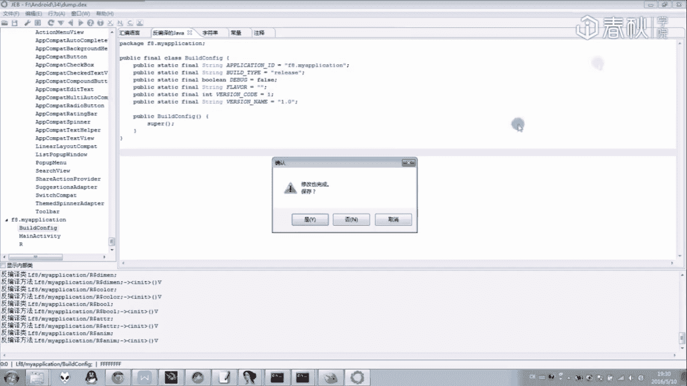

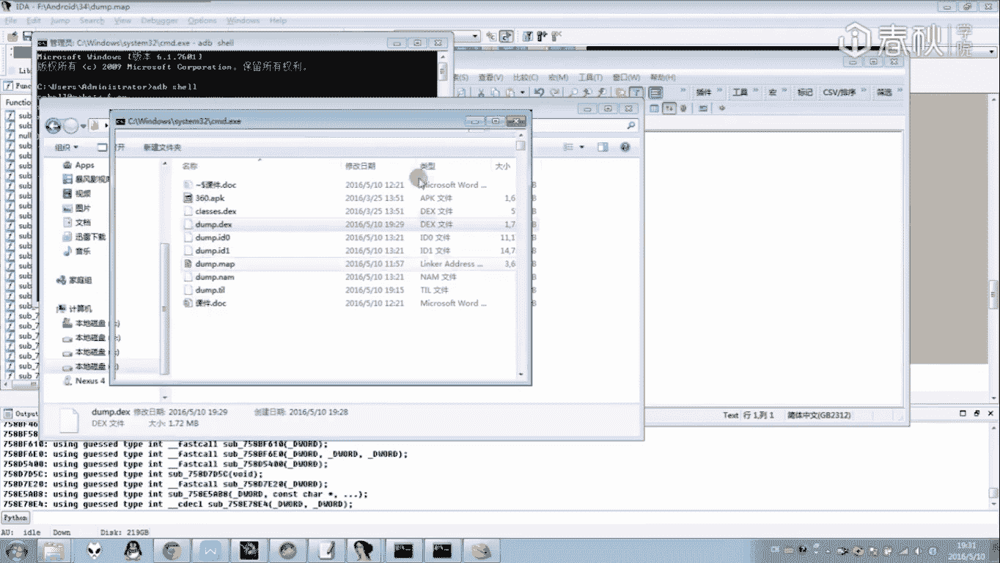

要什 smile哈。

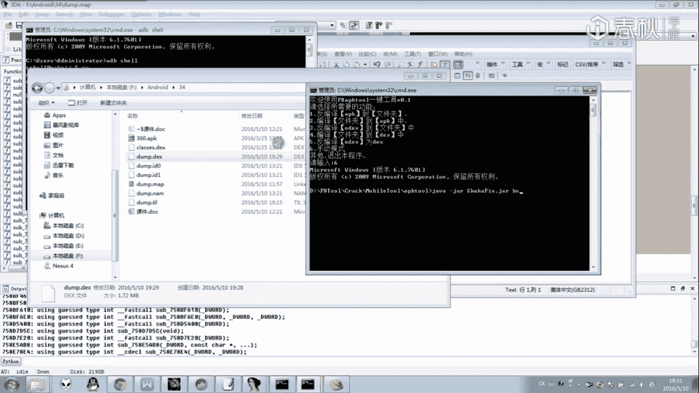

然后是一个输出定时。

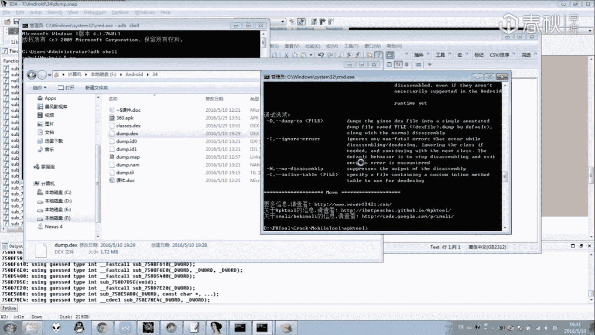

嗯。看一下，我忘了他怎么用，我都。

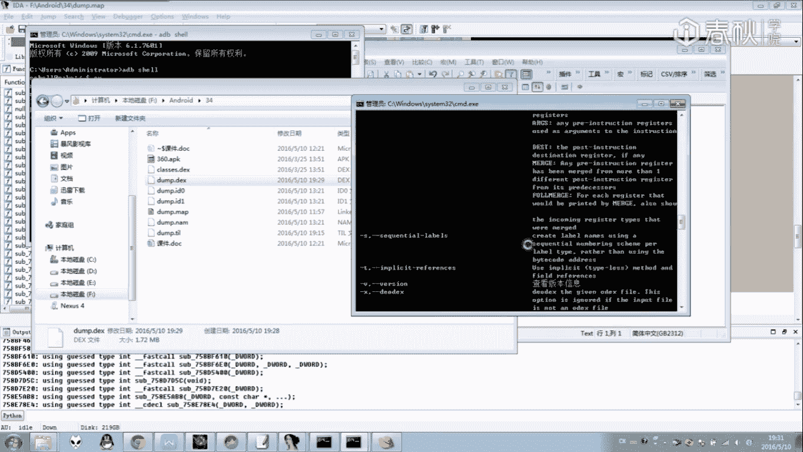

，什么好后面要加一个杠 over的一个参数。

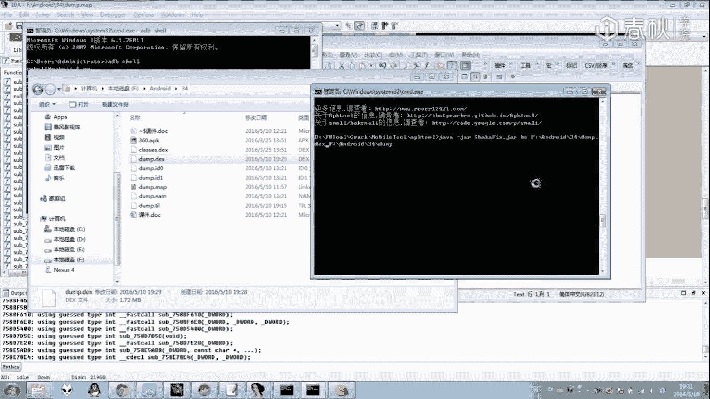

好，那我在这里就是动出来的所有数据，然后还原回去。

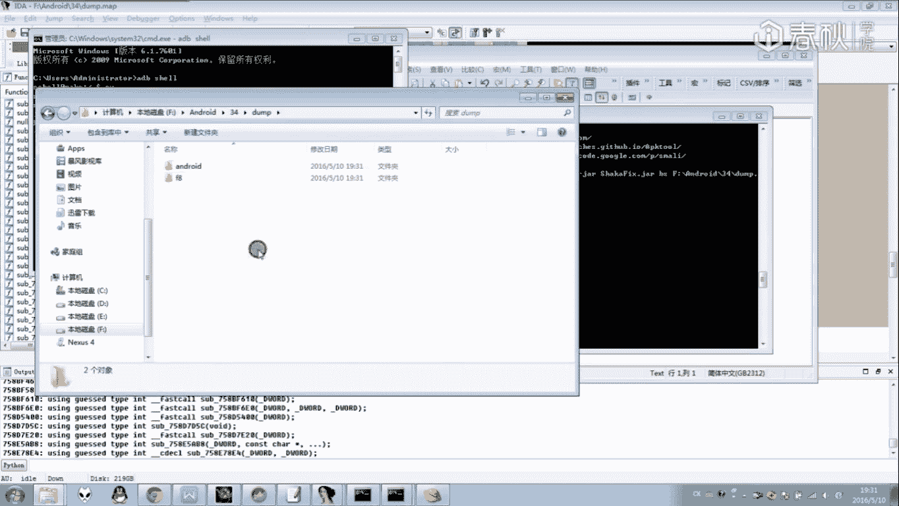

找到我们那个smarile路径，欢迎回去。好。然后进行一个替换。接着把它的一个呃 applicationplication的入口点给干掉。自信だけに。嗯。好，那么在这里的话毕竟是可以报错的。

肯定会报错的。因为这里哎除了这把这个呃 application干掉是还不够的。我们来看一下它这个报错的一个原因，他说没有办法发这个一个呃就是有一个在一个package中。

那是为什么我们来看一下这个min除了一个plication标签以外呢，它还会有这样一个标签啊，正是这样一个标签，导致一个反面意习把把这个干掉。好，再进行一编译。哦，那么这么一来就能够成功了比拟成功了。

哎，对也能够进行一个安装。我们来安装看一下一个执行，对吧？那么这里哎这样安装完成已行完成，也能够程序也能够正常的跑起来了。

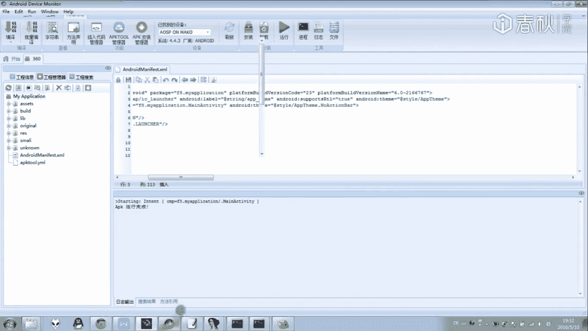

那么这里这里的话就是一个呃程序员的一个手toer，啊，是一个手动toer。那么从里面的话呃还是要进行。

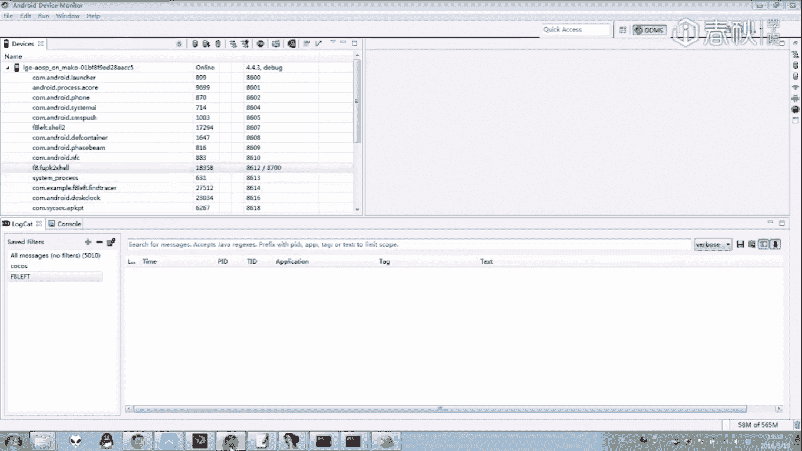

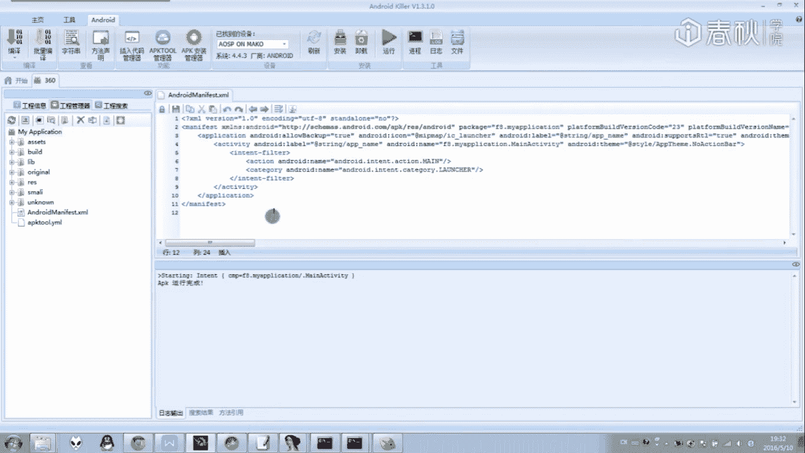

比较强大的一个呃需要一个比较强大的一个分析功能的。那，这里就最主要的话还是跟大家来简简单单的来说一下如何去进行一个可的一个分析。那，可以看到的话，哎，整一步整一套流程给操作下来。

实际上可能也没有大家想象中的那么难。那么希望大家话在下面也可以尝试的自己去找一些其他的一些可。或者说再找找一个360的一些可来去自己去尝试的去进行一下脱壳。

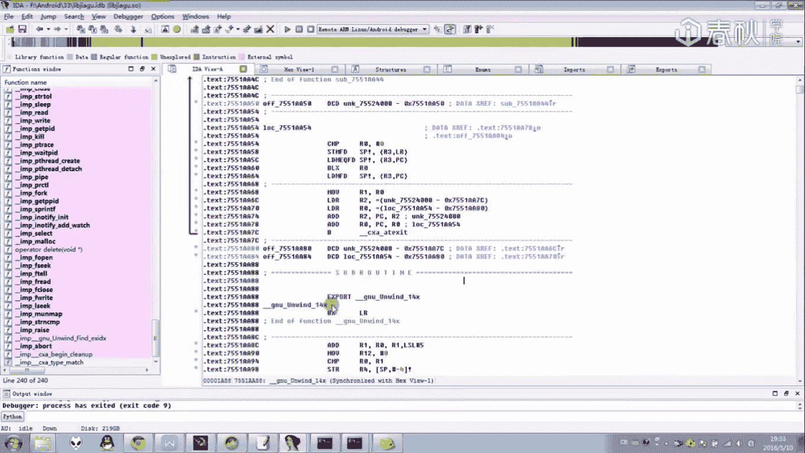

🎼好，那么这节课的内容的话就到此为止，谢谢大家。

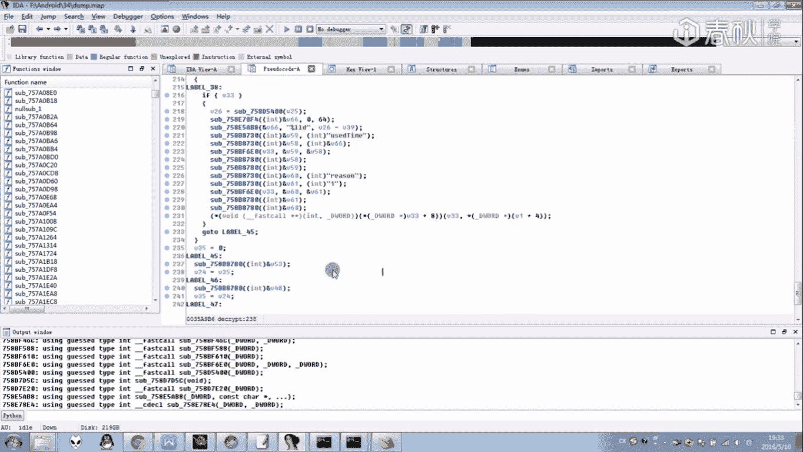