# i春秋零基础入门Android逆向 - P40：课时1 Android 加壳原理 🛡️

在本节课中，我们将要学习Android应用加壳的基本原理。加壳是一种保护应用程序原始代码（DEX文件）的技术，通过加密和动态加载来隐藏核心逻辑。理解加壳原理对于后续学习脱壳技术至关重要。

## 课程概述

加壳与脱壳是相辅相成的技术。学习如何编写一个壳，能帮助我们更深入地理解加固应用是如何运作的，从而在逆向分析时找到突破口。本节课将介绍加壳所需的核心概念、安卓系统中的关键类以及加壳的基本流程。

## 加壳的目的与基本原理

所有加固方案（如360、阿里加固）的核心目的，都是为了隐藏原始的DEX文件数据，从而保护程序自身的代码逻辑。

保护DEX文件的核心技术涉及**动态加载**。在Java层，可以通过`DexClassLoader`类来动态加载DEX文件。

**代码示例：DexClassLoader**
```java
DexClassLoader loader = new DexClassLoader(dexPath, optimizedDirectory, libraryPath, parentClassLoader);
```
*   `dexPath`: 需要加载的DEX/JAR/APK文件在内存中的路径。
*   `optimizedDirectory`: 优化后的ODEX文件释放目录。
*   `libraryPath`: 依赖的本地库（SO文件）路径。
*   `parentClassLoader`: 父类加载器，通常传入系统的ClassLoader即可。

## 加壳的实现流程

以下是网络加固服务对APK进行加固的典型步骤：

1.  **加密原始DEX文件**：提取APK中的原始DEX文件，按照自定义算法进行加密。加密后的数据通常存放在APK的资源目录或外壳自身的DEX中。
2.  **添加壳的入口点**：在APK中插入一个自定义的`Application`类，作为壳的入口。这个`Application`会在程序启动时率先执行，负责解密和释放被加密的DEX文件。此过程可能涉及Native层（SO文件）的操作。
3.  **修改AndroidManifest.xml**：在`AndroidManifest.xml`文件的`<application>`标签中，将其`android:name`属性指向外壳的`Application`类。如果原程序本身有自定义的`Application`，则需要将其类名保存下来，待解密完成后通过反射重新加载和还原。
4.  **回编译与签名**：将修改后的文件重新打包成APK并签名。

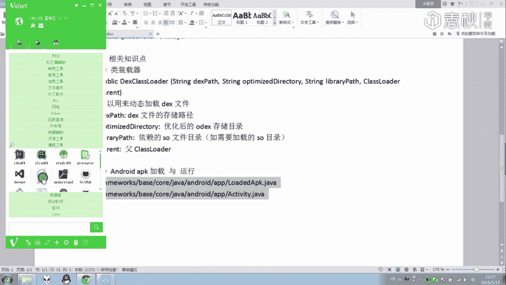

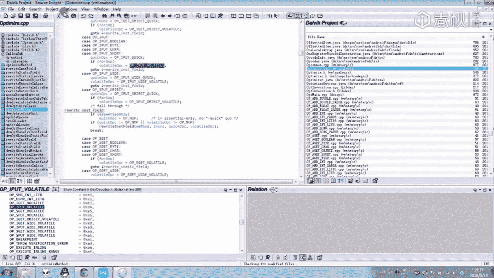

这种流程使得加固具有通用性。因为加壳和解壳使用同一套逻辑和SO文件，所以分析一次某加固方案的SO文件，就可以用于脱去所有使用该方案加固的应用。

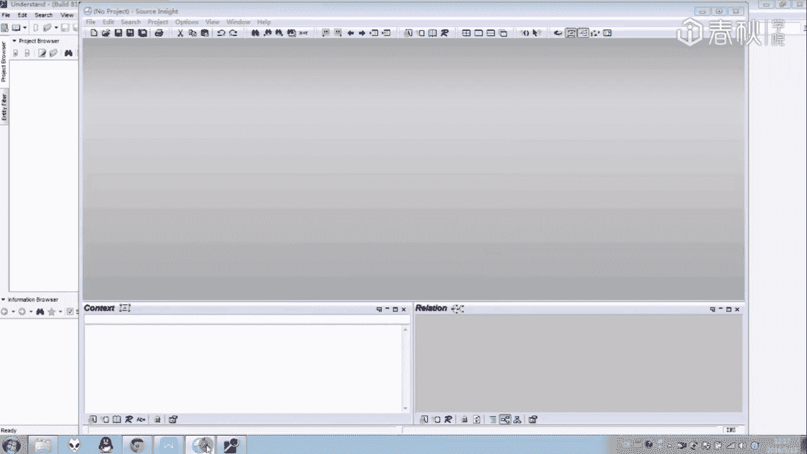

## 安卓系统加载关键类分析

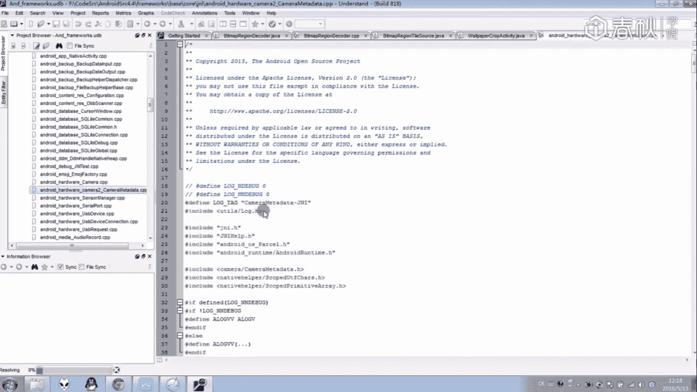

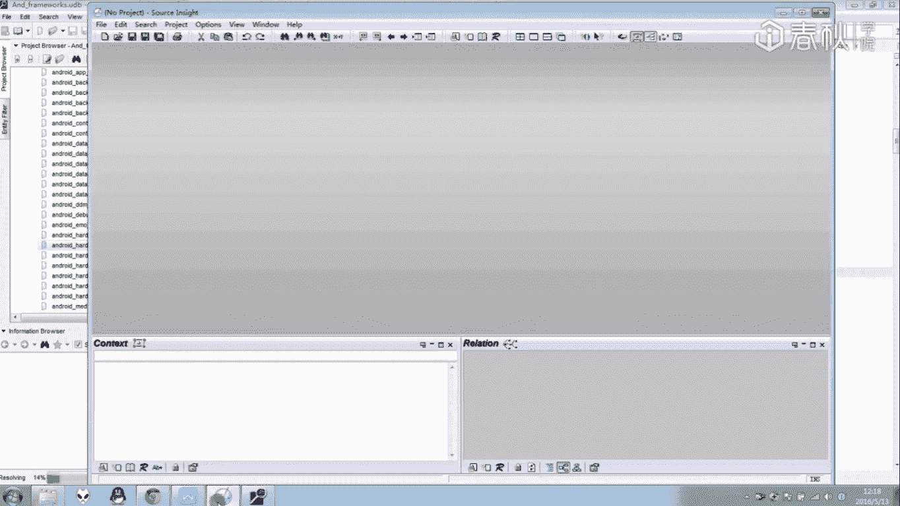

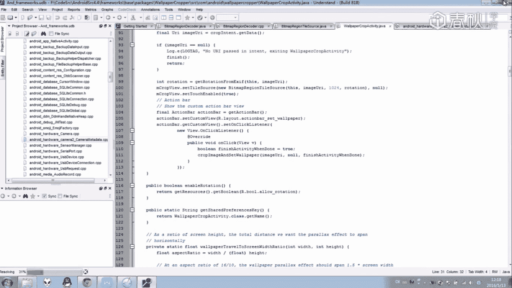

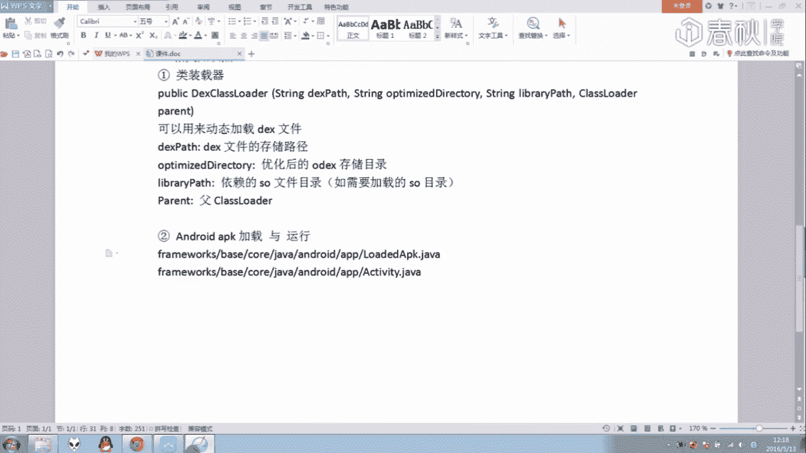

为了实现无缝的动态加载和解密，壳程序必须让应用的状态与未加固时一致。这意味着，壳需要将解密后的DEX文件数据正确地“安装”到安卓系统运行时预期的位置。

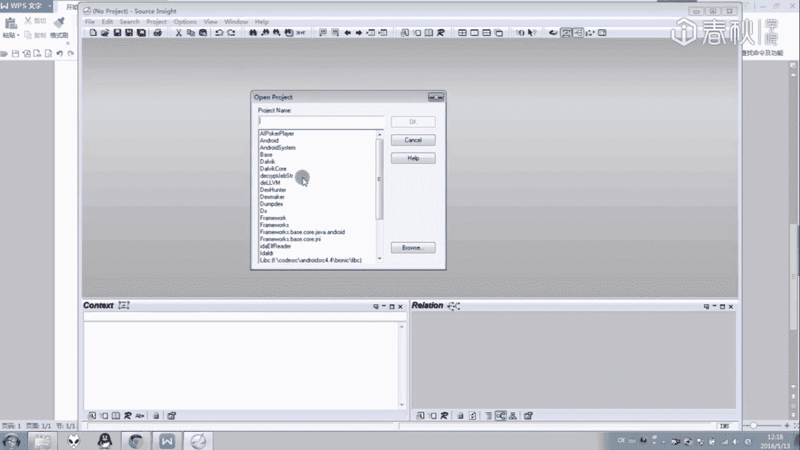

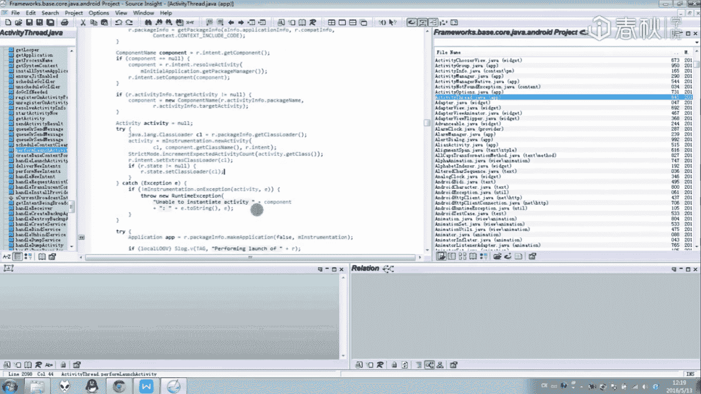

上一节我们介绍了加壳的宏观流程，本节中我们来看看安卓系统在加载APK时，哪些关键的数据结构会被影响。我们需要重点关注两个Java类，它们位于Android 4.4源码的`frameworks/base/core/java/android/app`目录下：


1.  `LoadedApk`
2.  `ActivityThread`

### LoadedApk 类分析

`LoadedApk`类封装了每个APK加载到内存后的数据。其中最重要的域是`mClassLoader`，它存储了用于加载该APK中所有类的类加载器。

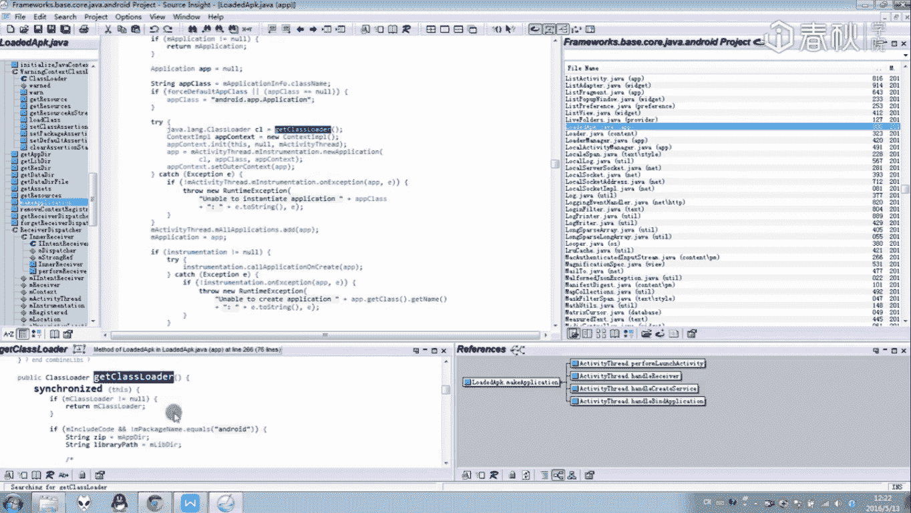

在应用启动时，系统会调用`LoadedApk`的`makeApplication`方法来创建`Application`实例。如果我们的壳替换了原始的`Application`，就需要在适当时机（例如解密完成后）通过反射调用类似逻辑，重新创建并替换回原始的`Application`实例和对应的`mClassLoader`。

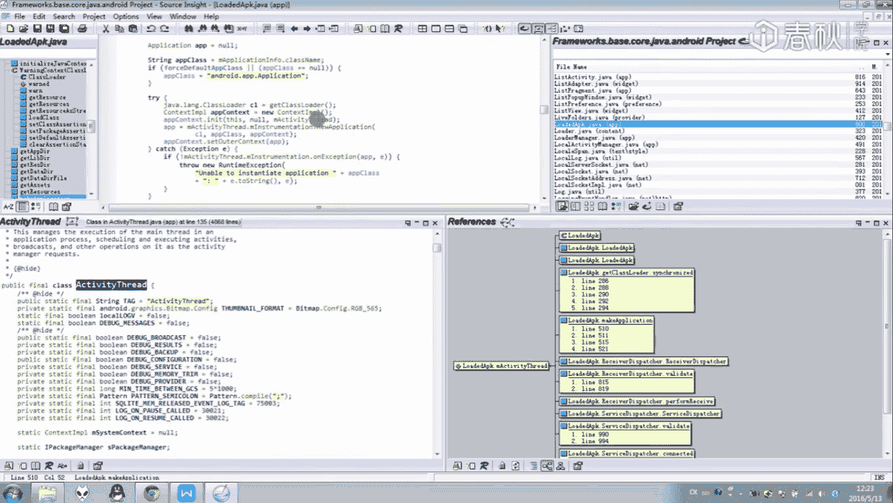

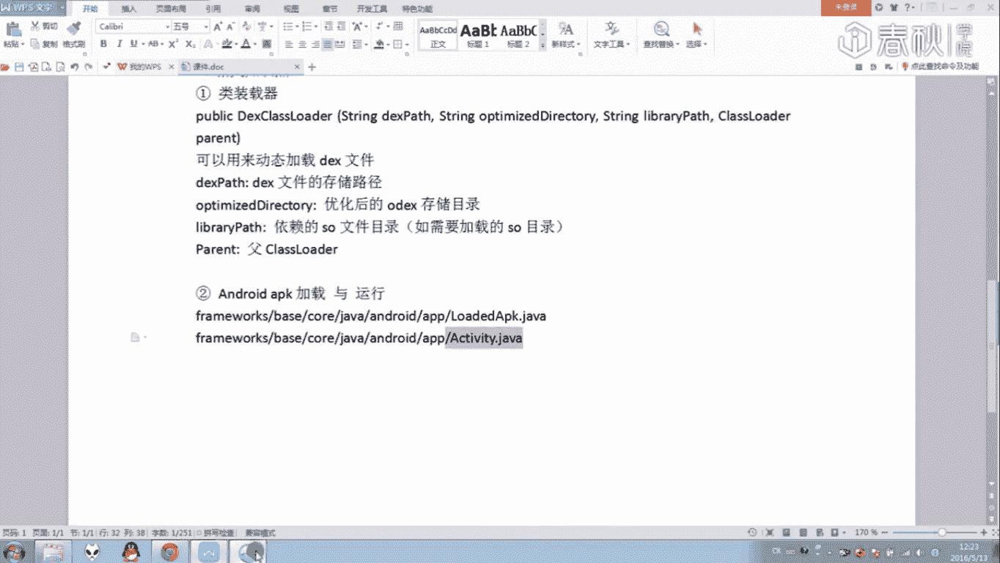

### ActivityThread 类分析

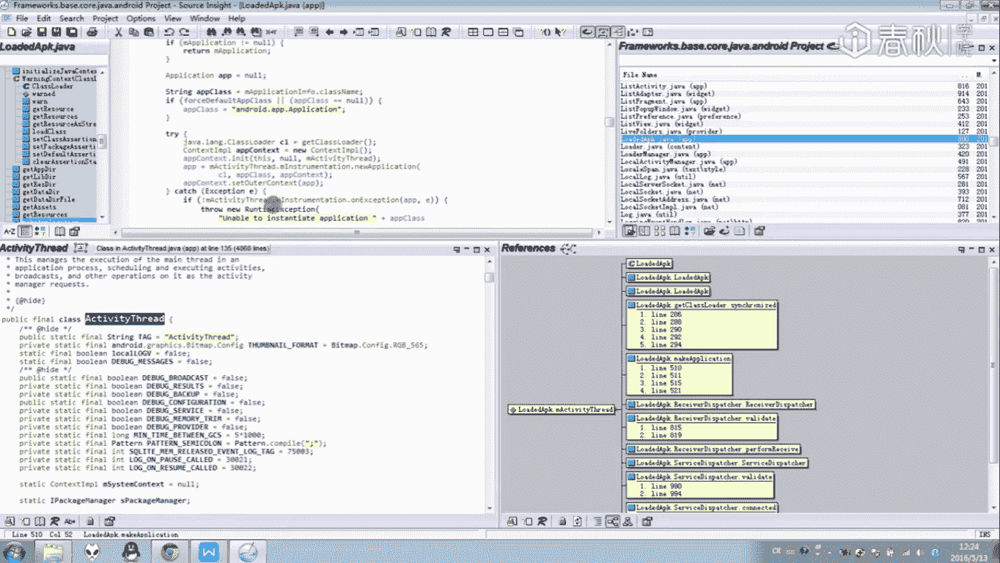

`ActivityThread`代表应用的主线程，它管理着应用的核心组件。其中`mInitialApplication`域存储了应用的`Application`对象，`mAllApplications`列表存储了所有的`Application`对象。

当壳程序需要还原原始应用状态时，必须通过反射修改`ActivityThread`中的这些域，将外壳的`Application`替换为原始应用的`Application`。

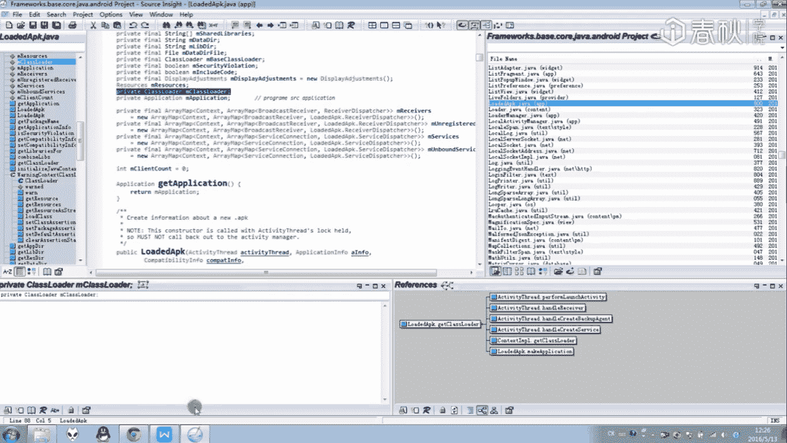

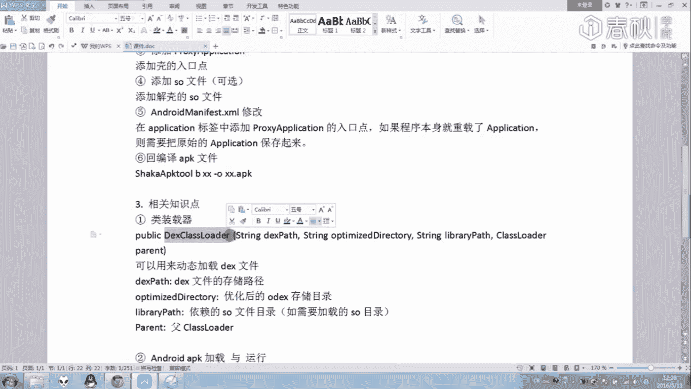

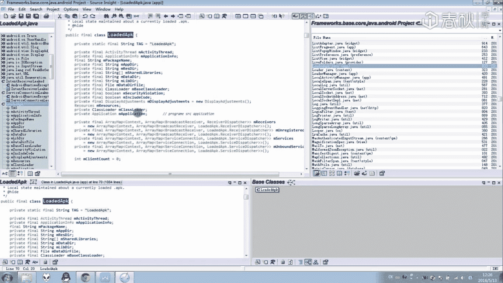


以下是分析系统源码时需要用到的工具：
*   **Source Insight**: 轻量快速，适合代码阅读和导航。
*   **Understand**: 功能更强大，提供更深入的分析功能（如代码度量、依赖图），但占用资源较多。

建议选择一款熟悉的工具，仔细阅读`LoadedApk`和`ActivityThread`的源码，理解其中各个域和方法的作用，这是实现一个功能完整壳的基础。

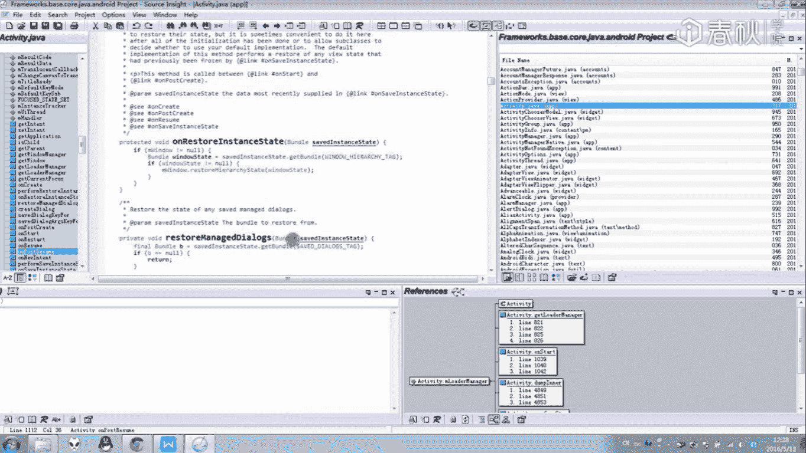

## 总结


本节课我们一起学习了Android加壳技术的基本原理。我们了解到加壳的核心在于**加密原始DEX**、**通过自定义Application动态解密加载**以及**关键系统数据结构的替换**。掌握`DexClassLoader`、`LoadedApk`和`ActivityThread`等核心概念，是理解乃至自己实现加壳功能的第一步。虽然涉及系统底层知识有一定难度，但这份理解将极大地助力于后续的脱壳与分析工作。