# i春秋零基础入门Android逆向 - P42：课时3  Android 加壳保护工具编写2 - 老网恋教父了 - BV1sg4y1B7zB

🎼。

我是。那么今天的话来讲一个呃加和第二课。那么这节课的话将会去讲解一下如何去通过一个JI层来进行一个加合。

那么上一节课的话就经响到过如何在java层上就是一个利用java代码来完成一个DX文件的一个释放解密。然后加到内存中去，并且已经收到它要应该替换哪一些数据。呃，该替换哪些数据替换哪些数据。

那么在那里呃这是那个java层上的一个实践。那么下面的话还是有一个JI层上一个实现。也就是一个let层上的实现了。那么这节课讲到的一个内容的话，可能会比较接近于我们平常弄的一些脱壳一些可的一个加密。

因为这些代码的话基本上都是我从一个从一些加密的一个可中就直接抄回来了。呃，那么在这借近于呃接近于这样一个mobil就是一个阿里的一个口，主要还是抄它的一些代码。

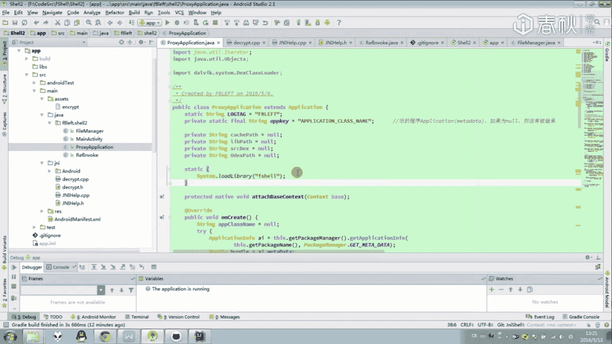

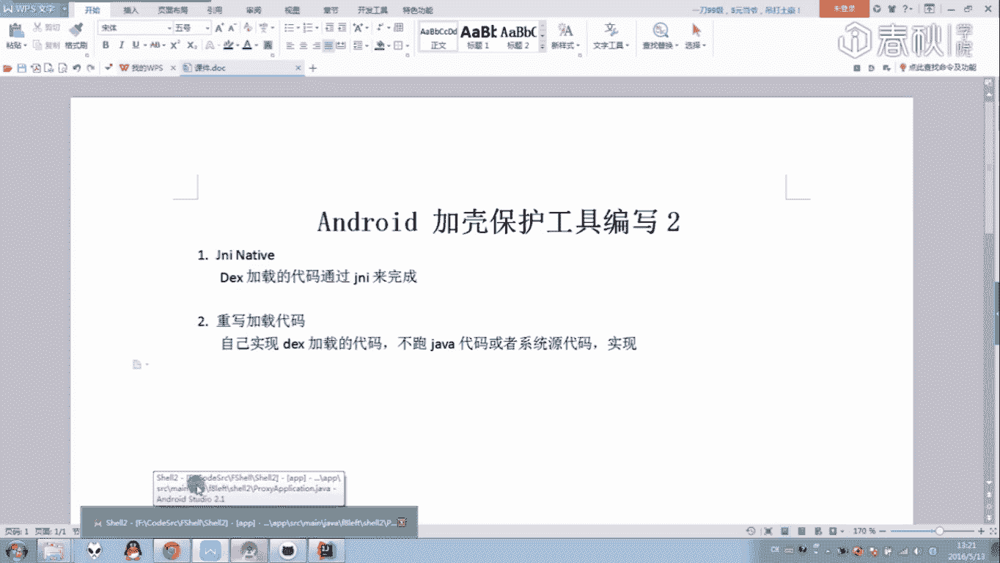

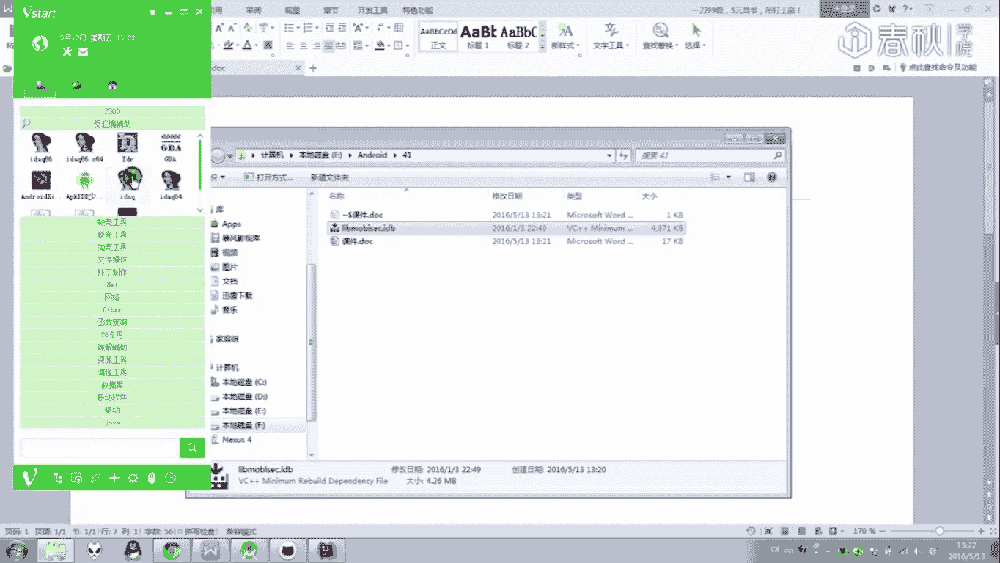

实现。那么这个呃这个可的话已经在DVME的1个APP文件中已经给出了。

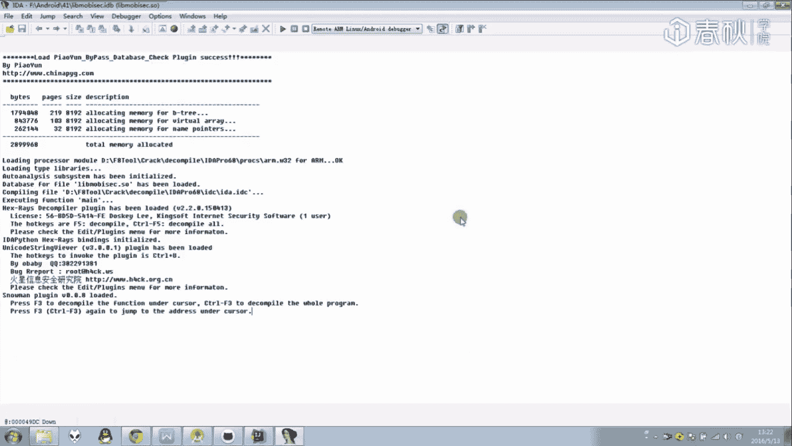

那么在这里我主要只是抄它一些代码。如果中哎如果说对于我课程中的一些代码，关心关心有一些地方是不完整的话，可以从啊这外一个分析文档中给把它的一些东西进行一个补充给搞完。

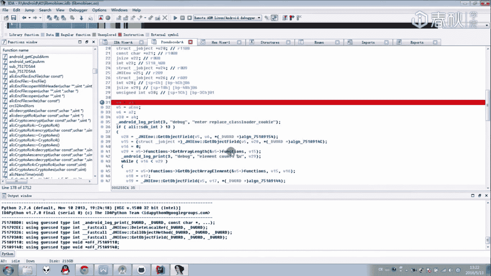

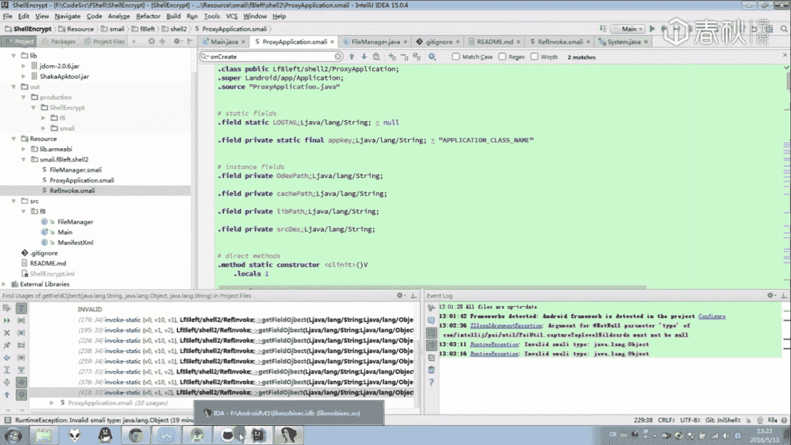

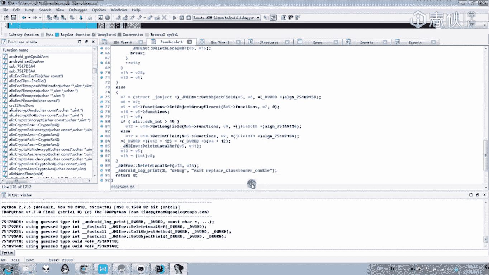

好，那么下面就来开始去讲我的这个可。那么这个这个层也是一个let上它一些初始的一个实现一些基本架构的话还是与一个java上的一个的话是非非常之类似的。

我看一下里面还是有一些啊之类的一些东西实现它入口点还是在plication中先入了这个ces。然后在这一个plication中有两个函数，第一个是。那么这里变成一个let上一个函数。

那么下面加在一个S中来实现这个函数来完成一个文件。然后on函数的话，这里基本就没变，还是要直接来创建回可的原原本的一个。

那么下面的话我们就来看一下在GNI层是怎么样去完成这一个attach base contest的一个操作。我们啊分析艾说的话，先从1个GR钟入手。因为这里面的话。

哎所有可基本上都是在这里进行一个letttic函数的注册，还说一些集其一些其他的一些类的一个初始化。那么首先就获取一个environment传递一个joration过去。

来判断我们程序加载的一个版本是不是对的。如果是对的话，就可以注册一个lett的一个类。那么先调用fin class，然后调用一个register letter来进行一个注册。好，等注册完以后。

那么注册的一个mesa数据结构体都存放在这个结构中，Jlet method一个结构体里面就存放着哎我们要实现的一个letlet的一个方法。

那么在这里就是重写了一个ja墙上的一个attach base contest1个数据。然后重启完以后，那么直接程序把这个均安on的话就直接返回了。里面会还有一个均安还有的一个类。

这一个类的话是进行一个辅助的，里面的话就是存放着。里面就是存放的一些结构体，一个价层上的一个mes IDD啊，或者说是一个方法ID的一些呃补充一些说明。

那么里面的话就存放着这么一些结构的一个属性一个内容。好，那么这里是一些呃J样 on闹钟追 on闹钟的一个实现。好，么这里唉可以看到里面的话只是单纯的注册了这么一个函数了。我们就跑到这个函数中去。

那么这样那个安卓ABC加载的时候，就会调用到这个函数，然后跑到le中去。那么它里面的参数前两个就是卓系统传递给这个函数的一个还它个cont的一个plication。

然后第三个参数的话就对应着这里的第一个参数一个cont的一个数据，就是一个base的一个cont。那么首先我们还希望大家还记得我们要调用到这个方法这样一个方法的时候。

首先第一步的话就是一个uperplicationat一个b就是调用它的一构建函数。果不调的话，那么下面所操作的话同是会直接一个崩溃的。像这种重写的方法的话，千万不要忘记调用这个方法。

首先调用一个类的一个初始化方法。然后来完成一个简密。那么成一个初始化。那么接着接下来的思路还是一样，要释放制约文件中的这个文件到一个内存中，然后完成一个加载，加载完以后再替换掉一个load底。

一个加载后的一个cookie中的一个数据。好，我们来看一下。那么下面这些操作的话，基本上就是完成这么一个方法，一个加载。首先是获取到它的一些函数的一个地址。比如说我们要把这个类释放到哪一个地方。

或者说它在哪一个地方。哎，那么这里就是把一些初始化的数据进行一个。嗯初始的一个地址进行一个获取进行初始化，然后进行一个保存。然后可以看到哎，这里的话都是用一些方法来进行一个保存了。

首先就获取到这个结构体的数据，或取然后取到它的一个文件位置保存来进行一个保存吧。那么这里的话就打印出g pass。然后下面的话就获取呃信息。然后根据这一个APP的话，获取它一个let层的一个目录。

也就是一个的一个目录了。根据这里的let成不一样。假如它的一个API版本比较小的话，那么直接let的一个路径的话，就在我们的个d目录就是一个d data中的里面的B目录中直接获取到这个数据。

假如它的一个API版本比较高的话，就直接通过cont的这么一个值来通过获取这样一个值来获取到它的一个LB所在的一个目录，获取完以后。那么就来获取它其他的一个路径。

比如说当前程序的一个agage learn，还有说它的1个APK路径，把这些都搞下来以后，那么下面就开始进行一个释放了。那么这里就是进行一个释放的一个函数。

那么将会在这一个函数中哎对文件对资源文件也是这样一个inquire文件。已经做做一个参数进行传递了。对这样一个资源文件完成一个释放，然后加载到内存中去。那么加载结果进行一个返回。

它加载的长度也会进行一个返回，里面实现的话可以看一下，就是直接来获取到一个ss manager的一个数据来进行一个获取哎，然后进行一个读取，利用这样一个s域的一个方法来进行一个读取。

那么最后还可以进行一个关闭。然后把当初的所有数据呢都会读取到这样一个memory中去的。好，那么这里这就是一个同学。读取完以后呢，哎它求滑结果会返回到这个地方。哎。

那么这就是一个涉及到一个内存的一个加载。加载完以后呢，还会有一个解密。解密的话就是在这里就是一个解密的一个函数了。那样一个解密函数的话，和加乘上的一个解密函数是一定是一一对应的啊。

那么这里就完成一个加载，完成一个一个解密，解密完以后就能够直接给替换到我们的一个cookie中去了。啊，下面就是完成一个cookie的一个替换。好，那么再看一下，哎，这也开始这样一个cookie。

先来获取一个class load，然后就把一个class load的一个数据来进行一个替换。我们跟进去看一下它是怎么样去完成一个替换的。啊按么这里的替换的一个操作块，也是呃从其他地方捉回来了。

里面的话就是通过便利java的这么一个数据，geble feel，然后获取到的一个DX的一个ele数据，然后取学到它的一个长度。哎，然后渠道以后呢，就我们就对我们传递过来的一一个体数据直接进行一个替换。

那么这里的个固体数据的话，实际上就是一个DX2加的一个结构体。那么这个结构体大前面托稿时候已经讲到过这个结构体的话是用来。存放当前所有已经加载了1个APBK的一个信息的。

那么刚一来就完成了对于我们那个class的文件数据的一个替换。那么这么替换过去的话，就能够对个APK的个 cookie来完成一个修改了。那么里面呃我参考到的一个代码也可给大家。那么这个代码的话。

实际上就是前几科。在DV托一分析的那个AAPBK中，也就是一个阿里的一个早期版本的一个实验性加口。

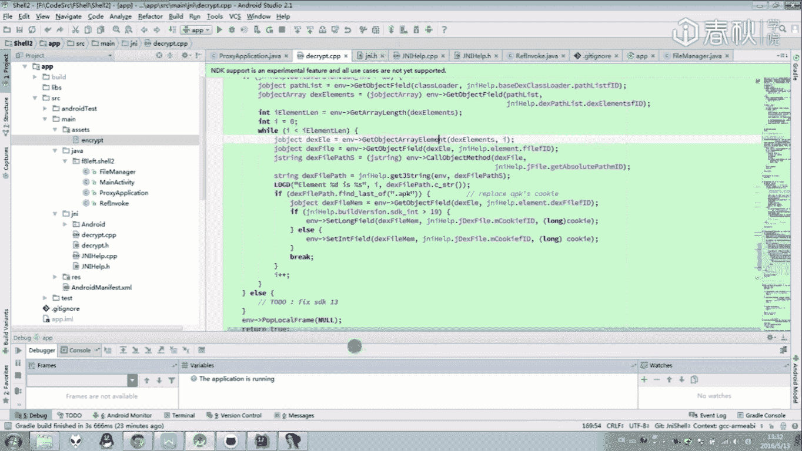

那里面的话就是一些代码。是是是它的一些实现啊，那么具体的一些实现话还是一样。在JI成的实现的话，网上资料不多啊，这种情况或者去抄一下其他加密口的一个代码。

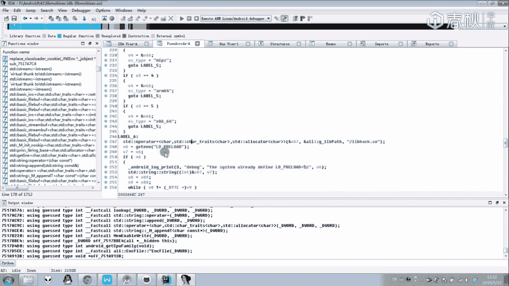

就是看一下他们到底是怎么样去完成这样一个加密解密的一个实现的。哎，对吧哎对于这样一个open fri，还说什么的一些代码可以都可以完成一个参考。那么里面这也就是我写了这样一个GI口。

当然这里说的比较简单，但实际上写下来的话还是要耗费比较多的时间的。因为里面因为里面的话就涉及到一个呃一个GI的一个调试，但是说它的一些啊JI层的代码，或者说和教程代码的一个交互。呃。

这里面的话可能是需要一个比较好的一个编程供给。那么具体说来说编程的话也是也不好教，应该怎么写代码的话，这些人去靠大家自己去呃自己去摸索一下了。如果在对于编程方面说比较熟悉的话呢，对于这个函数啊。

这个项目的话，看起来应该是比较容易看懂。来看一下这样一个GIhow里面的话，实际上就是通过各种的一个get的一个方法，还有所有pre的方法呢来获取到一个全局的一个呃教层上的一个引用。

把它的这些数据都获取到哎方便方便在这样一个de的一个函数中来完成一个解密。还说一个映射呃教层的一个替换中种。这些啊都是为了要来开加快我们的一个开发速度的。

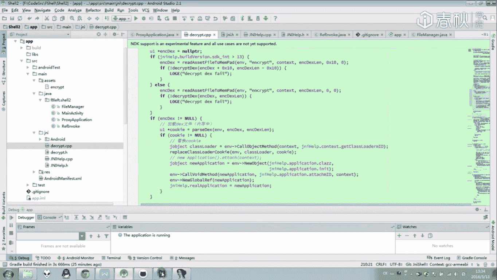

好，那么既然啊在这里有一个加密的代码，那么对应的就有一个加密的一个外壳。那么在这里的话，就会通过这么一个外壳来完成一个解解密的一个加密的一个操作。

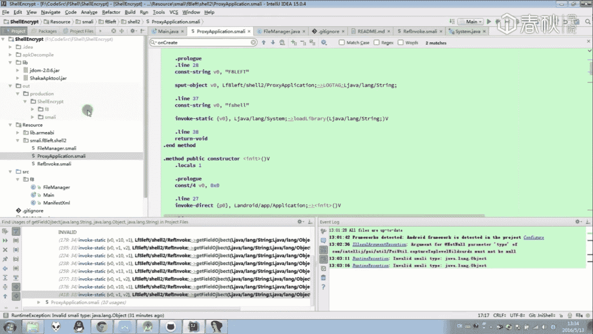

来看一下这一天I成立个外壳的话，它操作步骤也是一样的，哎还是一样的，该拷贝什么就拷贝什么。如果有SO文件，那么这也就多拷贝了1个SO文件。那么就是通过啊这么一些东西啊，这么一些细小啊。

一些东西的话就完成这么1个JNI上的一个价格了。那么就完成这一个ja口。那下面的话就来说一下一些其他的地方吧。呃。

正如呃说一下与to有外地方前面to的时候已经说到了有一些函数是可以让我们的一个可直接参考，并且像这种DDVNDX open的话，网上已经有文章呃说过，可以通过在这个函数来下断点来拓出一个可了。

是为什么呢？我们来看一下我们ja口的时候，我们要对内内存中的内存中的一个DX文件数据，也就是说内存中已经解密过的一个文件数据来进行一个转换成内转换成DVM可执行的一个DVMDDVM的一个结构体。

那么这里的话就需要用到呃用到一个可用到一个程序中用到一个安卓进程序卓系统中本来就有的一个可能本来就有的一个函数代码大像这里的话，一般的可能是通过这样一个反射调来。

直接调用一个系统中的一个代码来直接进行一个转换的。那么在这里看到一个playX中话，就会在这里根据系统的AAPI版本，假如大于13的话，就可以调用到一个open DXY这个函数在前面已经讲过了。

假如它小于等于13的话，就可以调一个DVMDXY openen的一个函数。那么它就是通过这么一个反射调样的话，哎，来把来完成这样一个内存中第X文件的一个解析，然后进行一个加载。

我这也是为什么我们前面脱壳的时候可以说在一个地方下一个断点的一个原因。那么大家有兴趣的话，可以看一下其他厂商的一个实现。里面的话也是呃会有一些类似的一个黄色调样的一个地方的。啊。

那么这里就是一个GNI层的一个加密啊，或者说是一个D一层的释放。嗯，还是一样还是一样，代码的话会给大家。那么大家在下面挂自行去研究一下它的一个代码一个实现。

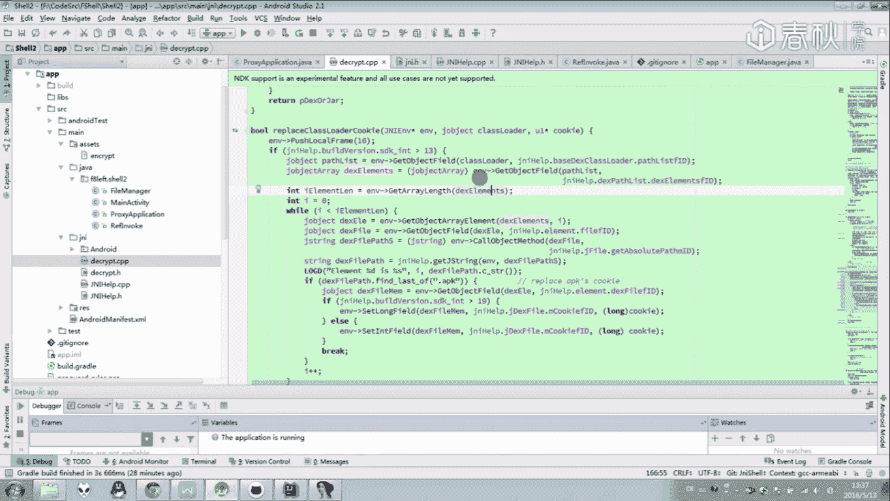

好，朋么，那么这节课练的话就到此为止了，谢谢大家。🎼悟空悟空。🎼。

