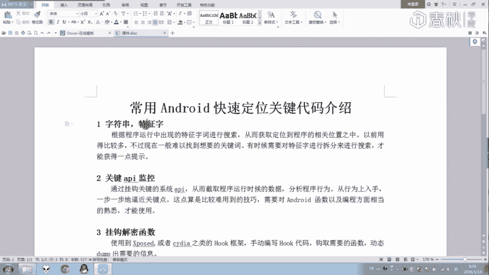
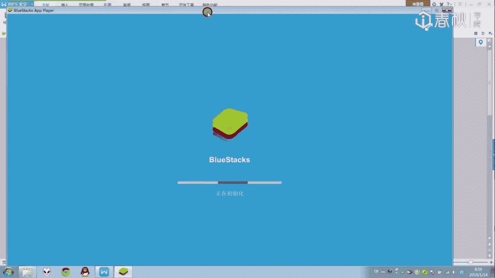
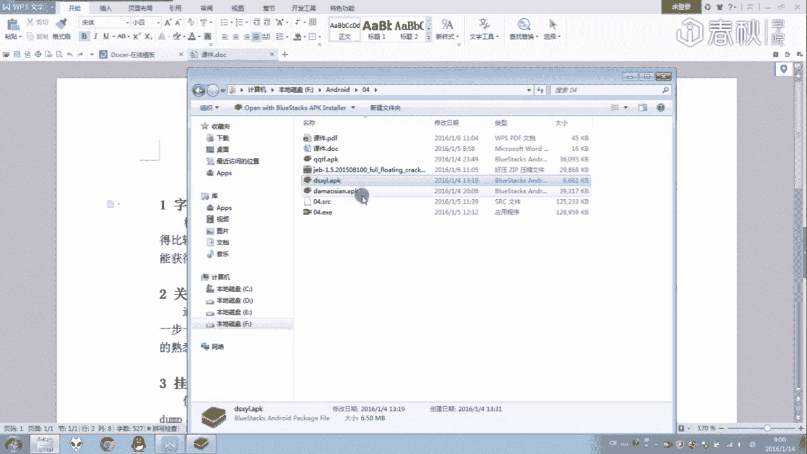
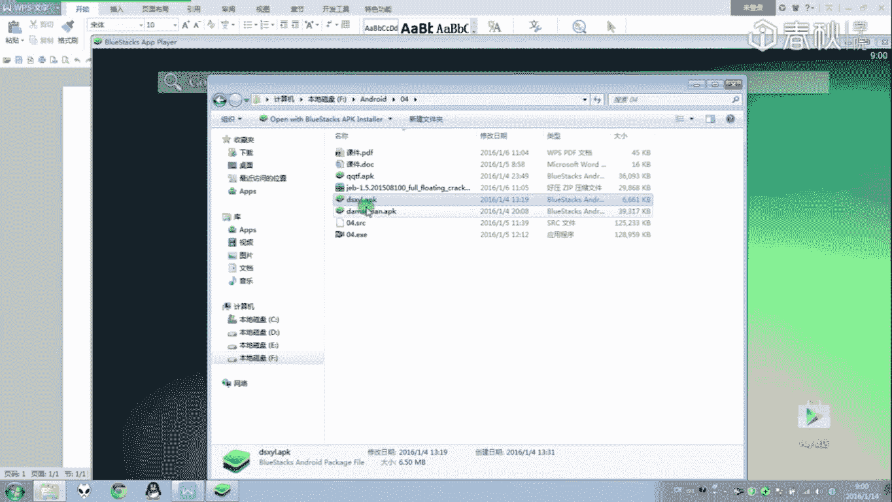
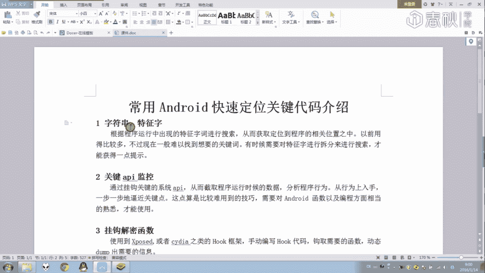
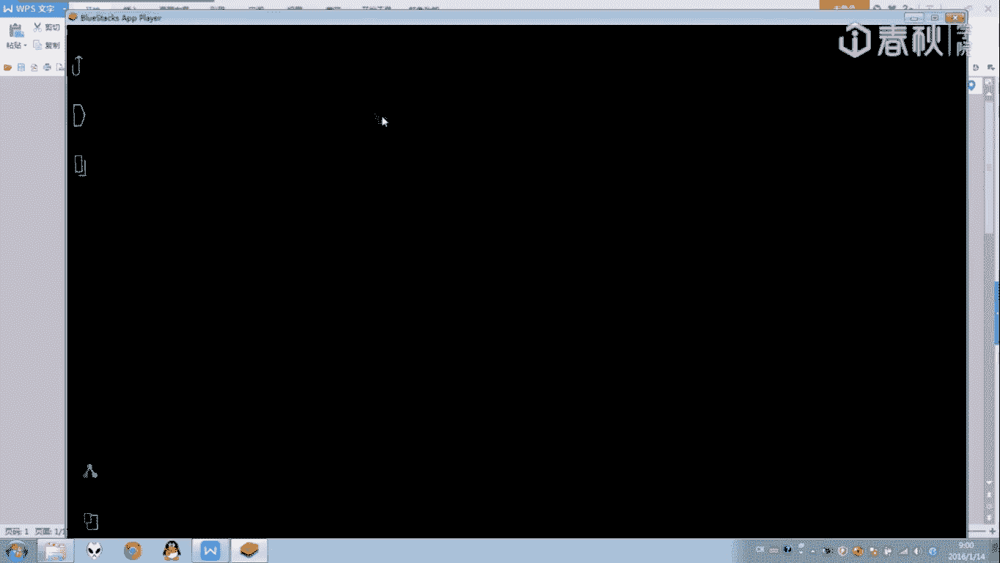
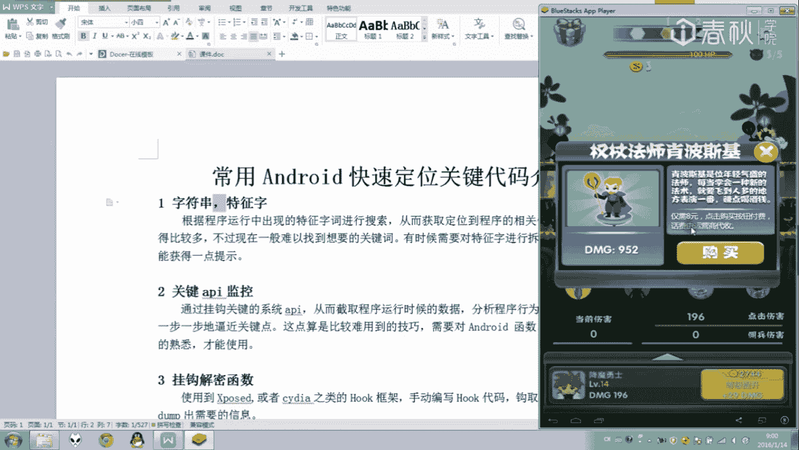
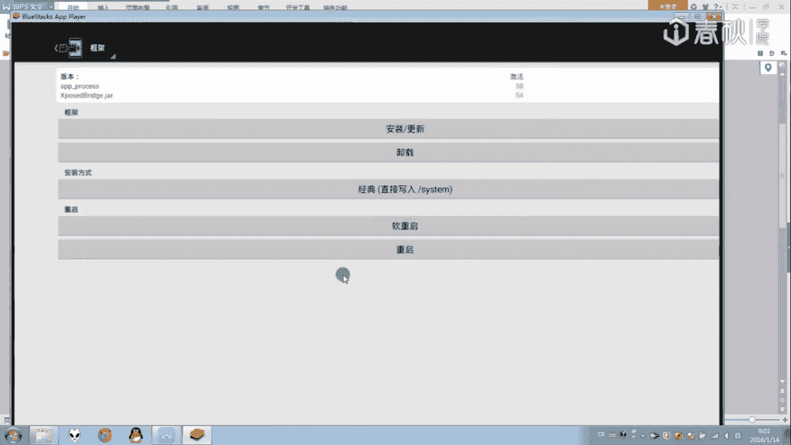
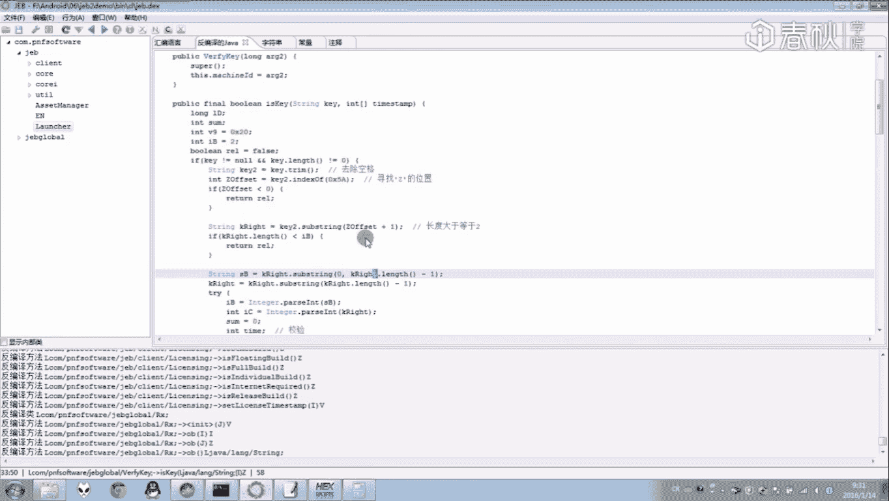

# i春秋零基础入门Android逆向 - P7：课时7 常用Android快速定位关键点方法介绍 🎯





在本节课中，我们将系统性地学习几种在Android逆向分析中快速定位关键代码的常用方法。这些技巧在前面的课程中已有涉及，本节课将进行归纳总结，帮助你建立更清晰的思路。





## 概述 📋





逆向分析的核心之一是找到程序的关键逻辑点。我们将介绍五种实用的定位方法：字符串搜索、API监控、函数挂钩、方法跟踪与日志打印、以及动态调试。掌握这些方法能有效提升分析效率。

---



## 1. 字符串/特征码搜索 🔍

上一节我们概述了课程内容，本节中我们来看看第一种方法：字符串或特征码搜索。此方法通过搜索程序中的特定字符串（如提示信息、ID等）来定位相关代码位置。



在之前的第三课和第四课中，我们已经使用过此方法。


例如，针对某个游戏，我们可以搜索它的“GJID”等字符串，从而快速定位到程序运行的相关流程。


这些字符串通常是程序与用户交互时显示的信息。点击进入找到的字符串位置，就可能看到如购买提示等关键代码。


然而，对于现代的程序（APK），字符串常被加密处理，难以直接搜索定位。正如上一课演示的，关键字符串可能在运行时动态解密。因此，此方法目前应用有限，但在某些情况下仍有效。

---

## 2. 系统敏感API监控 📊

字符串搜索受限时，我们可以监控程序调用的系统API。API即应用程序接口，本质上是系统提供的函数。通过挂钩（Hook）关键的系统函数，可以分析程序行为。

目前有许多工具可以实现API监控。


例如，可以使用名为“追影”的Xposed插件。启用该模块并重启后，即可监控程序运行中调用的系统API。

该工具能记录函数调用及其参数、返回值等数据。通过设置过滤（如包名 `com.example.app`），可以聚焦于目标程序。

以下是监控到的数据示例：
```
API被调用: getDeviceId()
返回值: 862548039754123
API被调用: sendBroadcast()
参数: Intent{action=USER_PRESENT}
```

此方法能有效监控网络请求、广播接收等关键操作。此外，也有其他工具可以监控文件（如SD卡）访问等行为，这在分析中也很常用。

---

## 3. 关键函数挂钩 🪝

本节介绍更深入的技巧：对特定函数进行挂钩。这通常需要一定的编程能力，借助Xposed或Frida等框架手动编写代码来实现。

其原理是：在目标函数执行前后插入自定义代码，从而拦截或修改其行为。例如，上一课中字符串解密的函数，就可以通过挂钩，在运行时自动输出解密后的结果。

代码框架示意（Xposed）：
```java
XposedHelpers.findAndHookMethod("com.example.TargetClass",
        loadPackageParam.classLoader,
        "targetMethod",
        String.class,
        new XC_MethodHook() {
            @Override
            protected void afterHookedMethod(MethodHookParam param) throws Throwable {
                // 输出解密后的字符串
                Log.d("Hook", "Result: " + param.getResult());
            }
        });
```

此方法在后续编写插件课程中会具体演示。

---

## 4. 方法跟踪与日志打印 📝

除了查看日志（Logcat），Android Studio的Profiler（或旧版的DDMS）工具功能非常强大，可用于方法跟踪。

以下是其主要功能：

*   **线程监控**：可以查看所有线程的状态和调用栈。
*   **方法跟踪（Trace）**：记录程序在特定时间段内调用的所有方法。



激活方法跟踪后，会生成详细的调用记录。通过分析这些记录，可以找到关键方法。例如，在跟踪记录中搜索“pay”、“purchase”等关键词，可以定位与支付相关的类和方法，进而找到核心逻辑点。

此外，也可以在代码中手动插入跟踪点：
```java
Debug.startMethodTracing("sampleTrace");
// ... 要分析的代码段 ...
Debug.stopMethodTracing();
```
跟踪文件可在设备存储中查看和分析。

---

## 5. 动态调试 🐛

动态调试是逆向分析中非常高效的方法。通过调试器（如Android Studio、IDA）附加到运行中的进程，可以实时查看变量、控制执行流程。

虽然好用，但某些程序会进行反调试检测，此时可能需要结合前几种静态或跟踪方法。

---

## 课程总结 🎓

本节课我们一起系统学习了五种Android逆向中定位关键点的常用方法：
1.  **字符串搜索**：适用于未加密字符串的快速定位。
2.  **API监控**：通过挂钩系统调用分析程序行为。
3.  **函数挂钩**：针对特定函数进行深度拦截与分析。
4.  **方法跟踪与日志**：利用专业工具进行运行时分析和信息输出。
5.  **动态调试**：实时交互式分析程序逻辑。

掌握这些方法需要结合对Java/Android开发的理解和不断的实践。建议使用本课介绍的方法，重新分析前几节课的APK文件，尝试从不同角度定位关键代码。

---

## 附：第六课作业解析（注册算法分析）🔐

以下是上一节课（第6课）作业的简要分析思路，供参考。若你已独立完成，可跳过此部分。

**目标**：分析一个APK的注册验证逻辑。

**定位关键点**：
1.  使用字符串或特征码搜索，找到与“过期时间”、“校验”相关的类（例如 `LicenseValidator`）。
2.  在验证函数中，找到返回成功（`return true`）和失败（`return false`）的逻辑分支。

**分析验证函数**：
假设关键函数为 `boolean checkLicense(String key, int[] expiryDate)`。
1.  **输入**：`key` 为用户输入的注册码，`expiryDate` 为输出的过期时间（数组）。
2.  **流程分析**：
    *   检查 `key` 是否为空或长度不足。
    *   在 `key` 中查找分隔符（如 ‘Z’），将 `key` 分割为前后两部分 `partA` 和 `partB`。
    *   对 `partB` 进行进一步分割和校验：
        *   将其分为 `B1`（大部分字符）和 `B2`（最后一位校验位）。
        *   `B2` 可能是 `B1` 的校验和（例如，对 `B1` 的字符值求和后取模）。
        *   校验通过后，`B1` 经过特定运算（如异或一个固定值）可解密出真正的过期时间戳，存入 `expiryDate`。
    *   对 `partA` 进行处理，可能与设备ID（机器码）进行运算比对，完成另一层校验。
3.  **结论**：注册码 `key` 的格式可能为 `[设备相关校验码]Z[加密的过期时间][校验位]`。整个验证过程涉及字符串操作、类型转换、算术运算和逻辑比较。


逆向分析就像一步步解读程序的“心思”，需要对代码流程和编程语言有良好的理解。扎实的开发功底是成为逆向高手的基石。