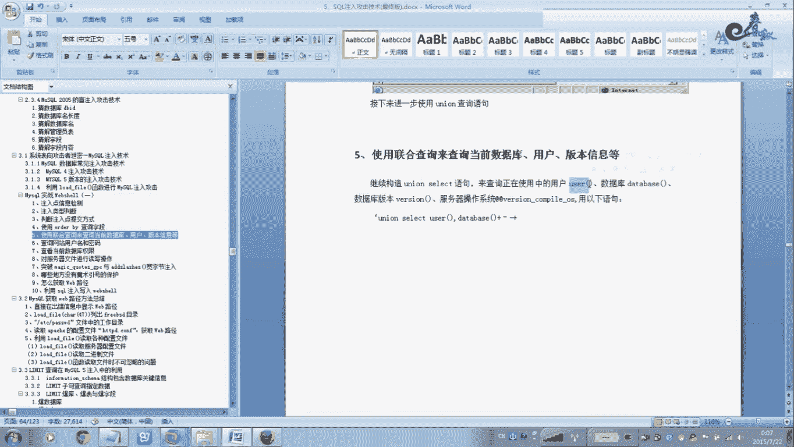
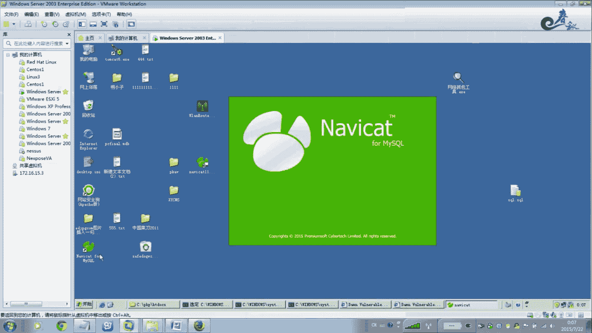
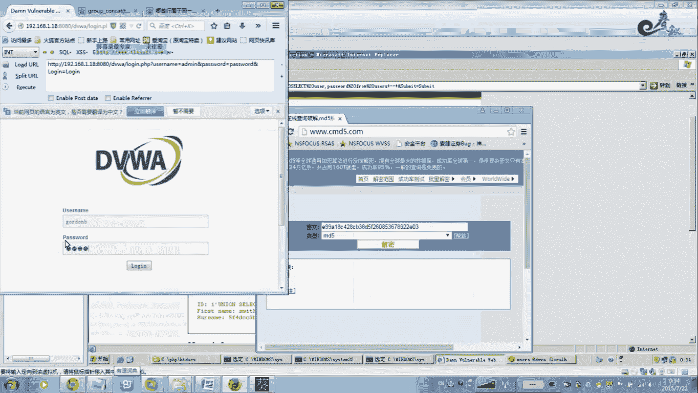
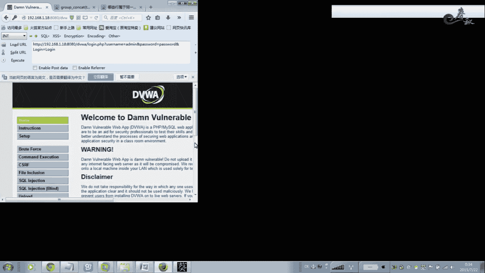
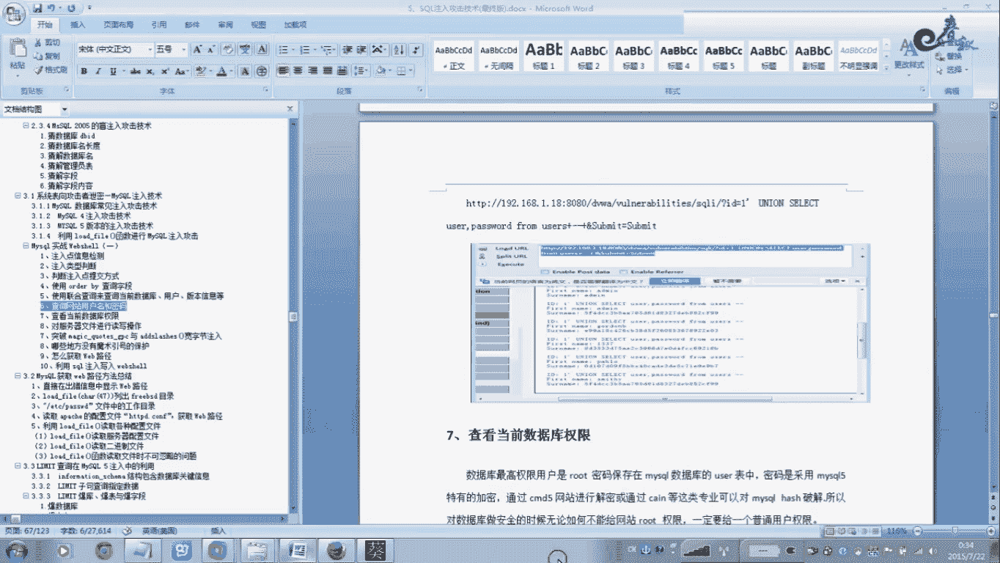

# 经典15年i春秋渗透测试系统化教程 - P12：课时4 注入式攻击-MySQL手工注入一个站 - 老网恋教父了 - BV1n54y1B7F7

好，就是我们刚才讲解。

刚才我们已经讲到了这个注入点的这个信息探这。啊，怎么通过单引号或者按的语句来进行判断？呃，接着碰撞之后是否存在注落点，那么。检测到注入点之后，我们通过什么？碰断这个注入类型，就是这个注入点是。

数字型注入还是字符型，还是C数型注入。当我们确定了这个注入类型之后，我们要第三步要知道。他的这个注入点的这个提交方式是get交get错方式提交还是po，还是codes。那么这三种方法呃，我都教给大家了。

怎么样去。测试啊手工测试。那么现在我们这节课主要讲解一下。第四步就是au by，然后进行查询字段。那么这个od by怎么样去使用？非常简单。od by语句在my my s code里面。

包括这个acces accessces，包括这个。呃，其他的数据库都会使用的，而且是。相当好用的一个一条语句。那么这条语句它是主要是对这个查询结果进行一个排序。那么上面的语句中啊有两个有两列。

就是说我们这个。等一下，我会给大家演示，马上会演示这个。用DVWA来演示。查询他的这个库这个表里面有多少列啊。那么使用au曼语句就可以按照第一列啊，或者啊这个数据库有啊这个for类目啊。第二列有这个。

他这个表里面啊表里面有有多少列，多少列啊，他都会查询，然进行一个排序。如果当我们没有这个查询到鄂洲办鄂洲办34。或者屋这些。报错的时候，那说明我们这个数据库里面这个表里面。

数据库的表里面它是没有这不存在列的，它就会产生报错。那么我们接着呃下面就给大家实例演示一下。因为我们我知道这个地方是存在注路点啊，这个是通过扫描器哈，或者是手工来进行验证。啊，这个地方是否存在重点？

那么在这里我们。加一个单引号。呃，打一好呃，空格。奥豆板。当我输入列个5的时候。他报错。那么说明这个数据库里面不存在。第五点。那么我们接到。说了三白还是不错。除了案。诶。没问题，那说明就是这。两列。

那么我们这个地方既然检测出来了，欧曼检测出来，也就注意好，你在检测欧曼检测的时候，你不用管它。或者你首先搞一个大的数字啊，或者十看看页面返回是否正常。如果返回不正常，那么你就987。654321啊。

进行测。反正测试。当他正常页面的时候，那说明我们这个列出这个知道这个这个数据库表里面的这个。自动列锁啊那为2啊为2。好。呃，这个材色出来之后。那么我们就可以用优汀克sle语句来进行查选。好。

我们这里呃在这里注意一下，这个单也好。那单引行，你看到这里他这个源代码里面。他这个是。一看到这里是一个字符型的，应该是他用这个单两个单引后把它。这个这个ID。这个变压D。它是在单引号里面啊。

刚才已经讲过了，所以说我们需要在前面这里这个地方这有个单引号嘛，是吧？我们需要在这个地方闭合一下。在知。闭合一下这个这个单音号这个单音号其实就是跟这个前面这个单引号闭合了。啊，闭合了。等我们输。

当我们输入这个例如等于一的时候，它其实我们用这个当引号的时候。其实他这里有一个单引号的是吧，他这里有一个单引号，只是你你看不到你在数据库里面是有的。啊，单独查选的时候。还是这种模式的。好。那么后面。

不是这些代码里面还有一个单引号吗？这里有个单引号，对不对？那么这个单也好，是我们这个后面。其实你说用这个单引号也是可以，但这里报错了啊，对报错了，其实是没有问题的。我上次查觉还可以啊。

那么你唯一的办法是吧？如果报错了，不行，DVW。DVWA不行的话，那么你就是用这个嗯加减减加。嗯。这个是一个加设连接啊，这个这两个这个是一个。注射啊在卖SK。所以说这个。这样就够造了。

这么最东的这个语句它其实是这种模式。啊，是这种，所以在这里加个单以后也是不会报错的啊，也是可以。你不对。应该加到这里对加到这里应该加这里。这样的话就可以了。我加这个不加也行，因为这里注视了嘛。

这没关系的。所以在这个猪肉的时候，一定要注意啊这个。嗯。字符型中等水液，包括收缩型，尤其是收缩型，一定要。把这个。单引号这些。闭合一下，或者用注射符把它注释掉。不让他就是后面这一句把它直接没有了啊。

这里啊两个刚刚。能够更杠。就没有了啊，注释掉了。好，下面我们就给大家。接着下一步讲解，就是说呃现在对这个ordo by语句应该非常熟悉的吧。在欧克3这节课已经给大家详细讲解过了。好，接着我们在这里。嗯。

使用这个来到第五步，就是说当我们确定这个。呃，列鼠就是自动啊，也就是自动嘛。确定完之后，我们就需要。通过联合查询嗯优克le查询当前的这个数据库用户版本。就是说我当前这个网站是什么意思？

这这第五步是什么意思呢？就是说。我这个网站DVWA我当前打开了这个网站这个页面啊。这个页面。当前使用的数据库是哪一个库啊，他的数据库是哪一个库？啊，他使用的这个mySQ的账号是什么权限，是什么账号？嗯。

他的这个数据库的版本啊，当前这个网上的数据库的版本是什么版本啊，它的操作系统是怎么操作系统啊，它的操作系统的版本是什么版本后，我们通过这个。联合查询来进行。查询啊，联话查询。操这个这个地方应该大一好有。

刚才扫了一个答应啊。要闭合的。嗯，Ulink的ss。刚才显示是2一是吧？这个空格去掉。是这种模式吧，对不对？那么两个字段的话啊，两列也就是两列两个字段的话。那么我们把我这里写的啊。

用户的话使用这个右手这个函数。

啊，数查数据库的话，用dtabase。那么我们分别带这两个随便啊，随便你都可以。啊，例如我要查询当前的。用酷。嗯。把音乐改了，说明这两个一样，可以和谐啊和谐的。写写进去。科写。那，现在我要查出来了。

当前的这个。数据库。第一个是是吧，它是按顺序来的哈。第一个我查的是d的 base，那就是数据库是DVWA是吧？我们看一下到底是不是DVWA。很简单，在这个地方。

嗯，这个是吧DVW对不对？DVW。当前他使用的这个。这个依据呢。当前他使用的这个。用户。他使用的是看没有路车用户。啊，logo host就是当前我这个玩站是频路测啊，最高权限路测是MQ的。

相当于这个卖SK路里面的这个最高权限哈啊，数据库最高权限相当于我们操作性能的admin。这个管理员用户。好，接着我们来看一下。如果你要查询这个。版本这个其他的呢。嗯，卫什么版本啊。当前版本是非常重要。

版本是非常重要。那版本的话，查选的话在这个地方。为什么要查询版面？我们刚前面给大家讲过。我第一步我基本上都是来查询版本的。为什么我看一下他的这个m的版本是。是不是不是5电0啊，5电0以上啊。

一看到这里啊就有希望了，而且路水用户，那么我们就可以。非常灵活的，不像俄克萨斯这样的数据库一样。要进行暴力拆解。暴力拆解。我现在只需要什么？通过这个。那SK的这个。

他有一个库叫做这个库information。这个库这个库是刚这个库就是保存了我们这里。卖SQl里面所有的数据库哈，这些这些这些这些这些这些这些从第一个到最后所有数据库里面的表表自动。

所有的表数据全部完成在这个里面。所以说这个是mySK65的一个通病，一个漏洞版，它以上的版本都有。全部在这个啊，所以像张晚这个卖买SQ的数据库，它都有一个这样的库。

他这个库就专门来存取这所有的数据库里面的表。既然我们有了这些表之后，我们可以想怎么干就怎么干吧，对不对？我想查询数据库账号啊、密码都是可以的。好。现在我们这一步啊第五步。大家应该非常清楚了啊。

联合查询可以查询当前数据库用户版本好。下班你好。好，我们来到第六。查询网站的用户名和密码。前面跟大家讲过。所有的这个库都存表明列名相关信息都存储在这个库里面。呃，现在我们来看一下啊怎么样去查找。

通过这个联合查询。有是哪个。把这个group。依次按顺序来进行。tableable lip。把这个表。查选出来。他如果你不知道他这个glo这个这个是什么意思，你要放到百度里面一查就出来了，对不对？

所以你在学这个，你要我把猪路搞好，你。你一定要这个对这个snake语句啊，查询语句非常熟悉。你看。送日歌。高校查选函数总结。这个函数是返回，带有一个来自一个组的连接。啊，飞空的字符项结果。啊，通俗的讲。

就是说。会计上哪些列属于哪一个统一族？将同一组的列把它列出来啊，他说这个行义这里也举个例子，大家可以认真可以看一下。啊，案例案例。这属于。同一个组同一列把它列出来。

就是他查询我们这个表tableable。那么我们在这里打开这个库啊，学习的时候啊，大家注意一定要。对着这个库这个表里面来看，有个tables啊。t卡度。哎，我操。他用错了。这个表。哎。

这标题面怎么没有信息哦，正正正在打开家政有点忙啊。这个数据量比较多，所以他打开慢，因为这么多库都存在这个表里面，所以所以打开你看很慢的，是吧？你看4741条啊。刚剪成这一夜才一条。700多页。好。

f来自哪一个库？来自哪一个库，来自这个库吧。你看来自这个库吧。就是这个是主的意思啊，就是这个这个行数。来自这个库要查询查询这个。这个table name table table name啊。

这个表来自这个库条件是什么？这个table。这个SCHEMA这个表。我们来找到这个。条件把这个关了。就是这个也就是自动吧，表里面的这个字动啊，这个自动。等于这个是什么意思啊？注意哈。

如果你在这里输入这个。我在这里解释过了。这个是一个酷的名字，0X64767761。是DVWA。也就是说我这个是从哪里得出来的？DVW a。十六进制。对对照一下啊，0X64767761。

所以我们在查询的时候。你要把这个库名啊转换成为16G带入进去查询。带录进去查询。如果你直接输入DVW，那么你查选的时候会包受出出现问题。追啊。这个是为什么呢？这个东西其实很简单。呃。

DVW你这个几个字母啊，你带录进去之后啊。你像这个PSP默认有一些函数。呃，我举个最简单PP点INN这个。PSP的这个文件里面有个魔术符号，就是过滤这些。但以后这些特殊的一些东西。嗯。你只有转换了这些。

之后他是绕过去的啊，绕过去的。但是在这里。你也必须要进行转换的，所以说转换成16经级。他只能接受这种。你好，我是经过测试的，你换成其他的，你看DVW，你看行不行啊，是百分之百应该是不行的。好。

我们再绍一句。这条语句结合起来是什么意思的？他就是说。他就是说。这条语句我通过联合查询。查询这个库。这个库里面这个表。表里面的这个字弹。这个知道。退步这个字弹。这个自动里面的。来自于什么？

他现这个字段里面来自于。DVWA。这个库里面的。表的信息所有表的信息。他是这个这个意思，明白没有？就是查选DVWA这个库里面的。表里面的写。库里面的所有表意思是说，这句话的整条语句得总结起来。

就是产选这个哪一个库首先。查询是我们这个库吧，这个库里面的哪一个。哪个表，我们这个表吧，表里面的条件是。因为WA这个库吧。DVWA这个库里面的。表吧。查询这个库就会显示这个库里面的一些表吧。

是这个意思啊是这个意思。这个是这个函数就是依次，就是说按这个组按这个组的形式，这个不是讲解了吗？就是说会计算出。这个好。啊，这一列或者同一行。同一行的这个。条件为这个你DVWA的这个库里面的。

所有表啊全部它列出来啊，全部把它列出来。所以表列出来，那么是不是这个意思啊，是不是这个意思？这个函数大家自己认真去嗯看一下啊。还有为还有其他的解释啊，其他的解释，反正你不懂，你去查。

这个东西我教的教你们这种方法。这一条一条的11一条的一条的分析，对着这个库，大开用这个软件打开，或者你是通过这个命令好像也是可以的啊。啊，你这个sl去要查询时，只要你巧密点，你对于初学者来讲的话，嗯。

没这个必要啊。因为因为你这个你要是要你这样的话，你越学的越多变成DBA了。所以你用这个软件简单，鼠标要点一点，一看就明白。还要节省时间。我们在这里能不能找到有没有这个DVWA的，你可以在这里查吧。操。

这个太忙了。查查查DVWA是是不是啊？T步推补这个这个表是吧？DVW啊，走走。哎，出来了。点W。DVWA这个。这个库是吧，这个库里面有有有有两个表，应该是gost book跟us匙，对不对？没错吧。

我们来看一下这个效果啊，看一下这个效果。看是不是这么回事啊，看是不是这么回事。你大第耳经啊。很清楚。那把这个语句复制过来吧。系咩。粘贴过去。当然好去掉打一下空格。专业。好，出来了。

查询出来这个呃DVWA这个库有两个表，一个是这个表，你这个一个表两个表，我们来看一下是不是这两个表。对，看到对没有？是吧？没错吧，我们再来看一下这里。这个DVW这个表里面是这个这个库里面是不是这两个表。

没错吧。好。现在我们是把这个。这个裤子怎么得来的呀？这个裤是通过这里是吧，这个。在第五步就。查询出来。对不对？😔，这样的话，我们就把这个网站的这为用户名。而，不是这个网站的这个DVW这个库我们知道了啊。

第五步的时候我们就知道了。在第六在第六步的时候，我们得到了起码？DVWA的这个什么？库里面的这个表吧，两个表都。都查选出来了吧。你在这里可以看到这两个表是吧，这两个表没问题吧。好。

这个表我们已经查选出来了。那么接着我们来查询。表里面的数据吧是吧有了库不库有有了库，下面是表，表里面下面是吧，字档字动下面是数据。一步一有一层一层的关系哈。

所以说你这个地方一定要非常清楚它是怎么样去走的一个流程。这里我们查询了，我们来看我们在正在录侵过程中，我一看到这个。哪些是？会出现保存用户名和密码的。表咧。对不对？一个是A厘米表吧。

右手表一看到右手哎这个地方。这样的一般的是不是保存用户名和密码的表吧，一看又是这样的。啊，用户嘛，那就用户表白。啊，一定是保存用户密和密码的表呗。那么我们就针对这个表来吧。来进行。查里面的子弹吧。好。

接着我们来看，那么如果要查选右手下面的所有列，就是自动的名的信息的话，那么这里我注意一下注了一下。这个烟花面上最个这个里面的最个。Cl。他是记录所有数据库名的，所有列名的信息表。他最好。

他就在这个下面啊。我们在这里面可以找得到，打开这个是吧？这个库里面的。C开头的就是这个吧，应该是没错吧。这个这个表它是记录所有的数据库里面的列名。所以这个MSK和它它这一点做的相当好。

我做一层一层的关系。好，在这里面来查。这里这个里面才是保存了我们所列的哈。所以列里所有数据库所有列的表信息表。有联合查询查询。把这个带入到第二个。第二个字当里面来自fong。来自哪一个。

现在是现在不是来自像第一个一样哈，来自一个酷是吧，来自这个表是吧？现在是。查知道了是吧，因为我们我们。我们前面已经把来自他这的时候，我们已经查询出了什么查询出来了。表吧，一个DVWA的这个两个表吧。

一个右手表，还有一个什么表？那个我们刚才给你看了还有个什么表？还有一个这个高st book表要吧。表我们查询时，现在我们是查询列，所以我们flog来自的时候来自这个列来自这个表啊。

这个表里面是保存了所有的列的信息。条件是什么？table name是吧？这个名字是这个0X是代表什么？不懂，你查一下哈。这个我告诉你。那还原一下。应该是。US b i。不对。有个S啊，我操。出来了。

是这个你对着看。来自这个右手表啊，我们查询是右手表，所以条件是归要条件是这个。是这个。这个表因为我们上上面查询的是是什么？是这个库，现在查询的是表。表里面。帮我们把这条语句复制进去。

看啊我们能不能查询出它里面的。所有的列的信息就所有的自动哈说说明白一点，就所有的自动。好。现在出来了，看到没有？表是这两个表吧，我们查询的是刚才是来自呃这个。这个语句是。table name是等于什么？

是等于这个右侧是吧？也就是说我们在这个库里面，你可以看的在这里可以看得看得到。嗯，是右手的。那你自己查一下吧。这这里太多了，因为保存了所有的库的嘛。嗯，你通过是那个语据查询也也可以。呃，低低的好多啊。

第一点没有吗？第二个嘛。那查吗？他是对义关系的。好，但是自己去查吧，我自己在这里找得到，百分之百是有，不然是不可能出来的，是吧？好，这样的话，我们通过。这一步之后，那么我们就得到了什么？

DVW库里面的两个表，表里面的什么，右手表里面的什么这些知道。嗯。不对呀。😔，不对呀。😔，这不对呀。这语句语句还没执行呀。这渔就复制错了。没有进去啊。六月六月1号。这虚拟机的问题。呃。

其实在物理机也可以啊，物理机我因为登录的时候，这个课件信息老是。变尾高，就是说那个。定位W啊。因为他测试输入的话，跳他木的是个高的级别，高的级别的话没有注入点，所以你这个漏洞没法测试。

所以我在虚拟机里面。嗯，这样吧，可以的，现在应该可以了。哦，已经OK了啊，复制进去了这条鱼。好，我们来看一下。在这个数据库里面。呃，在数据库里面找到DVWA右手表，看是不是有这些字档。12345。

对不对？我们来看一下。对应一下没问题吧，对不对？好，这样的话我们呢。所以自动已经OK了，把查选出来吧password右手你看是啊，右手password。好，现在我们来查右手password。

一看到这里知道右手是用户密码，password是密码呗，对不对？这样的话我们就得出来什么。得出来一个。这个右手表。所以得知道，也就是说库我们第一步得出来库里面就是。手表。表里面我们在找。

知道知道里面我们在找。密码好，现在我们就通过这一步来查询密码呗。是吧这很简单了，这这这个。这个在O里面都讲过了，把右手跟password分别带入到一样这里面，这两个字段。对不对？😔，好。睇未啊？Ad面。

这个用户这个密码是这个密码。啊，这个是这个是不是？还，1337这个。我们随便拿一个呗。把这个这个是MD5加密的值。那么我们要解密。呃来到CMD5。见妹呗。靠这个要购买啊。还要钱啊。这也太变态了吧。

在当然还要那个。你找一个免费查询的地方。对这这里当然我我有账好这个MD我可以免费查。这里我演肃的话就算了吧。你直接。直接给大家演示一下。暴力破姐也可以。好， a b c 二二三。我们就用这个账号吧。

试一下登录号。ABC123。这个是6个米。登录上去之后，我们我们就OK。ABC123ABC123。

试一下。OK能登录上去吧。

登上来了，那这个就是我们今天这节课所讲到这。买SK5里面怎么样去？SK的注入啊，到了拉账号密码是吧，最终就是。拉到这个管理员账号密码，登录这个网站。好，下一节课我们接着来看一下后面的啊。今天就讲到这里。

