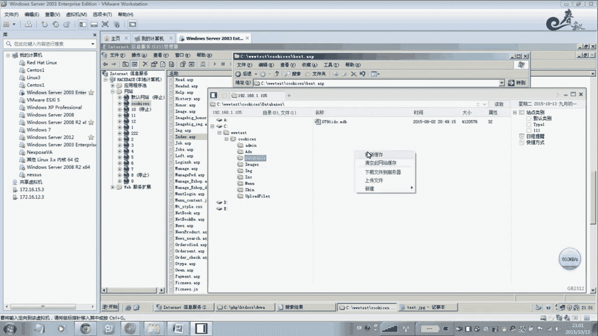
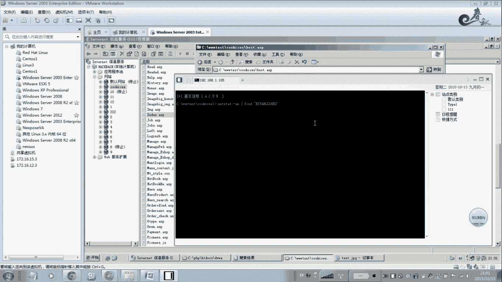
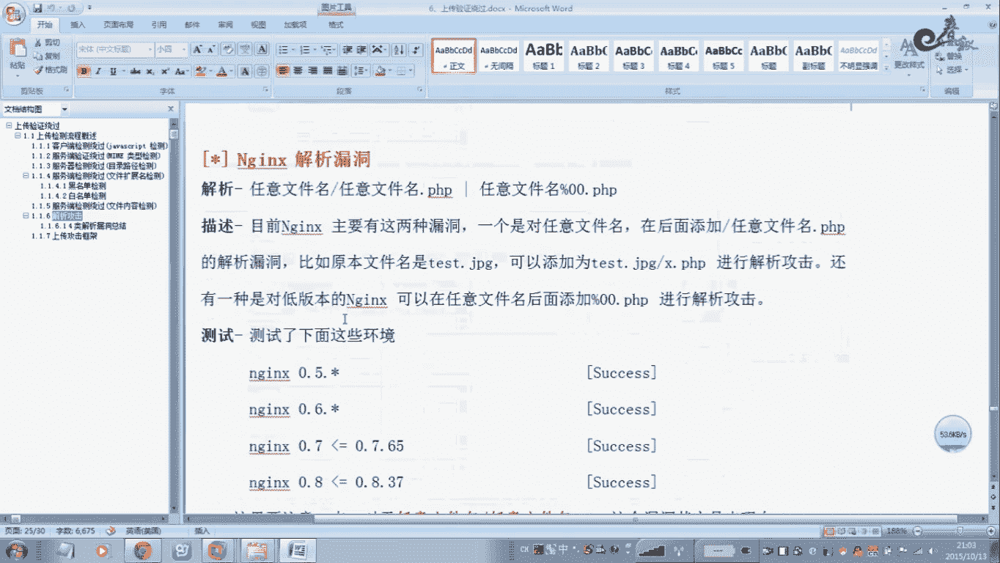
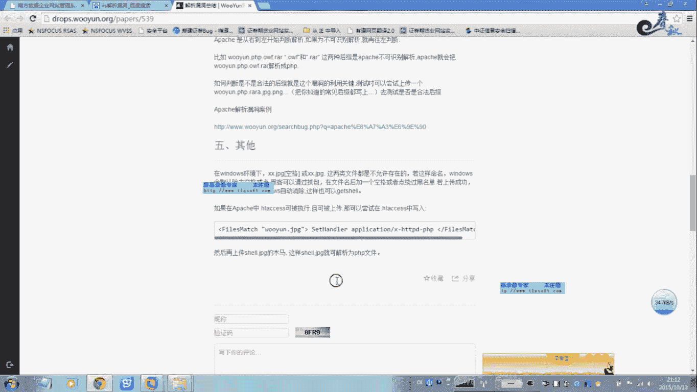

# 经典15年i春秋渗透测试系统化教程 - P27：课时6 上传漏洞-解析漏洞及上传攻击框架讲解 - 老网恋教父了 - BV1n54y1B7F7

🎼Yeah。好，我们这节课把这个解析流程给大家讲解一下，嗯，大概就是四类，一个是阿巴奇的啊，还有1个IOS那个是PHPC加。嗯，那么这这几个我们在这节课大概就把这个上传内容全部讲解完毕。好。

这些大家自己看一下。对一对。啊，我们呃来直接看一下这个在这一边我们没什么太多讲解啊，我们来看一下这个解析啊，关于这个本地这个包含解析啊，呃这个我留在这个本呃包含了段这个单独一块去讲解。

这个我们在这里不再讲解。后面马上就要强到这个报函来了。呃，首先我们来看一下阿巴奇那种解析内容。阿巴奇我前面给大家讲解过呃，它属于白命单 logogo哈，它不属于黑名单啊，这一点大家要注意。

也就是说阿巴奇在解析的时候，文件名啊，只要你命成这种形式，也是这种形式的文件，那么阿巴奇它是从后面解析的。如果你命对这个扩张名字啊，这个扩张名，如果阿巴奇不认识，那么它就向上一级解析啊。

如果X2还不还不认识，那么向X一解析，直直到这个阿巴奇认识这个扩张名为止，它是这么样的一个解析过程。所以说我们一般的上传这个木马的时候，我们上传一个列路。木马点PHP后面再点叉叉叉或者哎YYYXXS啊。

这样的后面这样的话XXYYZZ这些扩张名R87绝对不认识的，是没有不存在的这个扩张名。所以它向前面。解析的话，往前走的话，那么他就找到了一个点PSHP，那么就把木马点PSP来进行解析啊。

前面上面这个课栈里面不是给大家讲解过了吗？是吧？像这个前面的刚才上一节课就给大家演说了一下阿巴奇它存在这个解析的。那么它影响哪些版本的版本很多的哈，像这些版本它都2。282。2。059啊，2。26啊。

这些它都会影响啊，它都存在这个这啊，这些版本，阿巴奇的这些版本，所以大家一定要嗯涉及到高的版本。当然这个阿巴奇，还有一个就是说我们这个嗯你像PS呃，这个属于什么嗯。黑名单的形式吧，也就是说在黑名。

在黑名单里面。如果没有PHP3，有的服务器它支持PHP34啊5啊这些这样的扩展名。那么我们在上传的时候，把这个呃木马的这个扩展名PHP改成PHP3这样的形式啊，这也呃这也是可以的啊。这一个小技巧啊。

它不算什么漏洞，啊，只是像IOS一样。嗯，它默然有一些支持像C11啊2啊SA这样的上权啊，这些我们扩展面。呃，这个也是没什么太多讲解哈，这里有调整呃，这里各个版本都都存在啊，都可以。都是成功的，没问题。

好，我们这个前面的客户们演示一下这个ISIS的解析来的。呃，I解析这个动物，这里就用这个啊。啊，别用这个啊这里这个地址，这个地址我把它放在这里打开了啊，登记。那么它是在这个路径下面，我们首先。Yeah。

Okay。嗯，我放了一个木马，那么这个木马这里有一个AP的一句话，大家可以看到啊，这里啊一句话木马是吧？1。AP那么像这样的，百分之百是可以解析的，1点SP是没问题啊。但是注意我们在上传的时候。

AP这样的。扩大名的这个木码能上传吗？绝对是不允许上传像PSHBGSP那么我们需要什么解析类的解析类动态是怎么样呢？I你像这样的哈，注意翻译好蝶比如GPG啊，GPG像F这样的图片，它是可以允许上传。

对吧？啊，一般的像上传简历啊，上传资料啊，这些图片是可以上传的一些烂堂，对不对？这个时候不存在什么问题好，有了这个就比较。啊，这就是这个ISOS解析类的啊，2003下面的解析的。那么这个危险性比较大。

你看它图片的图片是元素上传，一上传，哎上传上去了。但是这样的这样的一些扩张品是能，就是说IS如果你去。存在IS存在这个类的。那么你你在连接的时候，你看啊。这样的是允始连接吗？你看一点。AP分号啊。

分号点GPG好，我们编辑你看。双击一下，哎，是可以点击的，没问题。你看。是吧。没任何问题。这就是解析漏洞。所以说你一定要服务器，一定要打最新的这个补丁呃，这微软这个补丁。针对这个解析内段。

好多服务器它是没有打这个补丁的。嗯，我在测渗透厕所过程中，在工作过程中。嗯，这个成功的率相当高相当高。一搞一个卷啊一搞一个卷。啊，当然ISOS还有一个哈还有一个机气类的，它是这种的形式。

最个例子那个嗯白斯。来一个文件夹，这个命名如果能如果能建文件夹，这命名啊，如果你是这样的一个名字，你看那么被s点AP。那么你把你的木马放在这里。那么你在这里，你妹妹。命运规则GPG。

这也是当这个当做这个只要你这个只要你的文件夹如果是点SP的或者PSP什么的啊，那么它下面的文件任何文件都都都都会当做这个什么SP来。解析执行啊，不信你们我们来看一下啊，不信我们来看一下。天我们看一下。

在这个地方是一个base点是吧，AP那么这个仿斜杠啊，这个是一点什么GPG这样行吗？你这可以吗？你看是没有任何问题的，是吧？

没任何问题，对不对？你们在这里还可以动断执行。你看。

是没任何问题的，只行这些东西。所以说它这个。Yeah。呃，包括我们不要扩展你也是可以的，不管什么都会当做这个什么。又是一个亿。都会当做这个SP来执行。嗯，哎呀，我这个。车到了。你看啊。要不要都无所谓。

都会当作我来执行，你看没问题吧，是吧？这就是这个解析漏的。啊，我们这个接绍我们下面的人，当那IS7。5还有啊。这是6。0点。从6。0下午我们是没任何问题啊，因为我这里没有没有去演示这个。

没有去搭建这个环境啊，S7。5G是2008。2018操作型那么7。5的话，你也很简也是一样的，方法很简单。也就是说它命名是什么？命一个图片。比如1点GPG，那么你后面再加一个他加一个什么仿斜杠。对呀。

加一个仿斜杠，你像这个len一样，这个解析漏段一样，你加一个仿斜杠就行。加一个仿斜杠，后面再接一个什么ABC点PHP这样的啊，所以是不是456啊都是可以啊，也是可以啊来进行解析来解析。

你看才看到这里是吧？嗯。他是PHP微博42点GBG反斜杠X点PHP啊，这样的话。也是没任何问题的。

关于这个解析类的啊，嗯网上也有很多哈。

例如呃各种解析内容都有。例如IS。啊，你一定要解析这容。所以大家在学习过程中一定要学会查找资料啊。谢谢多多多重总结，你看。解析的这种总结，物月上面都有啊都有。你看这是这个是什么？就我刚才解讲解过的。嗯。

按目录解析文件解析是不是？啊。还要用3号啊，这种的看到没？也是刚才我讲过的，这是针对IIS的，你看IS的对不对？那么针的这个IS7。07。5呢，像呃IS7。07。5lenus它这个一样的哈。

8呃这个是lenus的话是小于8。0。3的啊这个版本。啊多层的这个机型解析内容。那么这个机型的解析内中就是说。他是这个木兰这个facetoC加开起来装了下。

那么这个黑K上传这个名为就这个名字随便取啊一个婺源点击BG啊啊。那么这个这个图片里面就写上你的这个一句话啊，一句话。然后就是在这个。你这个你这个木马的这个GPG后面加一个反斜杠点PSB。嗯。

在这个目录下就会生成一个什么sll点。PSP设置PSP你看一下它这个。那这个你看。一定要注意哈，按照他这个方法来。首先。啊，你新建新建一用计时版，新建一个计时板，把这个把这个木马啊一句话放进去。

放进去之后呢，接着怎么去做呢？他这注意啊，这这个他的这个一句话在这里哈，这个这个是在在这里，它这个前面是做什么的，前面它这个就是说我们这个生产这个4要点PSP的这个。呃。

一个名一个就是说把这个一句话等于相当于写落到4要点PSP里面，也是这么一个一个过程。就是说只要我们在图片后面加一个仿斜杠点PSP的时候。那么他就会在。当进来这个目录下面就会生成这个数要点。

点PSP那么这个内容你可以看到，用有软件攻破的时候，也就是这种方法攻破的。还有心浪分站的。啊，K哎这个是天时天时顿吧啊，一些域民你看都是这样的呃，案例很多被攻破的。这IS啊7。5。大家可以回去试一下。

呃，还有就是说等一下啊。格这个这个这款中间键啊，也就是说呃我们刚才讲讲解了阿巴奇IS，还有这个。他这个是只要小于8。0。3啊。以下的版块都存在这个空自己代码执行的这种啊。

就是说呃像这种就是说在图片后面直接加上个像这个003小00%，后面点PSP。啊。就可以就可以了。Yeah。这个也是相当危险的啊相当危险的。本来可以嗯去测试测试。接着阿巴奇阿巴奇没什么大家算吃。

我们讲解过了。啊，把这个地址啊也给大家哈放在这里哈。放这个文档里面。你最后面吧。我要自己回去去看一下。嗯。嗯，这里我都讲解过了啊，都讲解过了。Yeah。好，下面我们来看一下上权上权根据这个框架。嗯。

这个大家自己看一下吧，其实都差不多解析这种白米档黑名拉啊，哪些属于这个呃黑名档老虎，哪些属于白米档啊，零0杂档本地包含IS解析的X解析，这些都属于白米单黑米拉有这些。哪些是你看代码产的一些解析没动。

最主要的是下面一张图啊，上传攻击流程图。那么这个是很重要的，就是我们在防御过程中就要一产一产的进行做防御。那么我们首先看一下黑K是怎么样去攻击的啊，采用这个上传内容。首先就是说我们用户啊在输入的时候。

就是上传的时候，首先一个轻量级的一个检测，这个检测就是判的，也就通过javascript来判断你上传的是否GPG啊，或者GIF啊还是PSP啊GSPP啊这样的啊。

这这这段代javascript代码直接可以删掉的啊，没什么用。比后通过BRRP改一个扩造名就可以了，就绕过去了。因为它这个是什么是真的这是什么。真的的是这个。本地啊就是本地一个检测啊。

就本地的一个安全防御。所以说这这一部分是这么绕过去的，包括命名这个类型的这个检测。比如说在前面加一个这个SP1句换木啊里面前面加一个什么呃加IF格式的一个头啊，改一下这个类型就可以突破啊。

检测绕过这两种方法，那么文文件内容文件内容这个检测是代码注入过程啊，代码注入绕过一般采用这种方式，那么检测绕过来像录加扩张名这个检测啊，一般采用这个检测呃这个有这个。呃，黑名单白名单这种绕过方法。

那黑名单的一些文件大小写文名单这个列表 logo过啊，特殊文件名绕过啊就有啊零0匝道啊，在前面都给大家演示过了啊，这些黑名单啊，白名单00匝档啊，包括这个解析漏段啊都是可以的啊，如果没有成功呢。

如果这些呃方法啊检测 logogo都没绕过去。那么我们最下一步就是通过这个解析类段啊解析内容有HSCCESS文件解析有本地包含这些解析，那包含类洞，这个是看你这个尤其是有些呢有这个包含类洞。

本地包含原分包含这些内容啊啊，以前像PSP168，包括自己开不了程序，有尤其是PSB很多这个上有这个包含内洞，那包含内段，只要我们。嗯。包含的这个上传任何文件，只要包含进去，都可以当做这个什么。啊。

PSHP来执行的啊执行。那么应用层解析漏洞呢有R8体的解析漏洞，有ISN的啊这些解析等等。那么这个图就是我们针对它一层一层的进行防御。那么这个攻击破产呢也是这么攻击的啊。

就是说以后我们去做渗透试的时候只要有上传的地方，大家可以参照这个图来一层一层它能不能进行突破啊，能不能突破啊，通过解析漏段啊白名单黑名单啊啊，啊PP这个啊，直接改个名字啊，对不对？是吧？

改个类型啊进行捞过，看能不能捞过啊等等。整个上传的这个流程就是这样的防御也就是这么做的啊，防御建议大家看一下嗯DVW。他的高还高级别呃，他这个防御的代码。是推荐给大家在写程序的时。

参照这个DVW的高级别去写啊，这样的话就可以杜绝这方面的这个上传内动。因为上传内动是相当危险的，只要你只要存着上传的一步到位，直接拉到尾部水，甚至控制这个整台服务器在进行这光攻击。

所以说它这个还是很危险的。好，关于今天我们这节课嗯上传内动就讲到这里啊，大家有什么嗯不懂的问题，到时候我们再进行讨论。

