# 经典15年i春秋渗透测试系统化教程 - P2：课时2  HTTP请求与响应 - 老网恋教父了 - BV1n54y1B7F7

🎼Yeah。Yeah。这次我们来问一下第三张呃，前面两张第一张和第二张，我后面给你们补充一下吧。我讲第三讲第三章之前，我先让你呃。把这个微博三车测试的这个。流程跟这个。也根据了这个你构成的这个。

需要讲解的哪些知识啊，给你讲呃了解一下。你我。有一张图。首先我们来看一下这张图在微博三度测所大概有哪些需要学习的？这一个空气这个。呃，每一个板块到时我会单独的这个。不程视频给你们分解。

它每每一块它里面的知识点比较多哈，所以说微博上的测色，如果你要做深的话，它是还是比较难的。如果做一个是中级的血瓶，中高级血瓶。嗯，还是。比较容易啊，就是说大概也就那么一个月，就是说你认真去学习啊。

大概就是可以从事这个甚至培试工作。首先你要了解一下什么是微博这个应用空气啊，如SKTP头啊。二个他的这个外部的更新的特点啊，包括这个这些都是基础知识，前面给你发了两张啊，昨天晚上给你发了两张。

你自己去看一下。呃，第二呢他这个。是信息搜集啊，通过各种，包括一些工具啊扫描器。攻击平台比如第3块是攻击平台啊，攻击平台有啊IS啊287啊是吧，操作系统啊，windows密。没有充天见啊。

没哦里数据库啊。并且也不时。咁可见准节。呃，包括这个。USF呃，包括这个软件的这个平态的这个使用，包括卡里啊、BT5啊这些软件。深证这一块是用户门密码安全暴力破解包括验证码识别。包括这个真正闹过。

就是说啊需要输入用户的运望怎么去唠呃，通过一些修摊的方法呃破解这个绘画，呃CSRF空间啊，这个都是会到这个。包括现在这个地块给你。店里面讲理包括这个呃股放攻击啊。

包括实验水大包这些都会在这个或取进行击片。那个是。微关键站这块要指纹识别SL规则。我边目录啊。可以破解啊权限底升啊，垂直水平权限。你识啊。啊，后面你自己看一下吧，等一下把这个图发给你。

这种进行在网上先查一些资料学习，那里还有一张。嗯，那么今天我们这节课主要是给你讲解一下这个基术片。一个外部这个技础和一个朋友。发过来的，我觉得挺好的。正好参照我这个个案来给你讲解。就这每一大块啊。

我会单独给你。因为今天我们讲这一块嘛，安全这个为保安全，包括这个更多测试这个待遇啊发展趋势啊，这个我说过这个后面再补充吧，我们直接实战啊，总节重点，到时你直接我有这方面工作慢慢的，后面要课程慢慢的更新。

通过扫描记得使用把机行号上册和输入上传二账。就是王是不使到这个包括这种啊。先把这这一大块给你讲解。其他的就是说。呃，后面是。以小动画的形式，就是一个一个的补充。呃，到最后。

我们需要还要提这个分测测试报告啊。好，现在我们来回到这个第三证的这个内容来讲理。这个是我们这个。他的这个应用程序使用这个不同的具体实现这个功能。那么本当主要介绍这个生透程质。

在根据这个微博应用程序的时候，遇到一些关键的地区就是分析这个STTV协议，包括这个逐迹服当常用的小协议啊，用于这个什么样的情形下，我们需要对数据进行编码啊。包过他的这个油期的这个。

相关信息就是版本发回过来的信息。通过我们这个HTTP抓包，我们得到一些前期生测试的一些重要啊重要内容。首先我们来看一下HTTP啊，呃，大家学外补的时候。

我们离不开这个部HTTP这个协议就是因为我们的外部我们公司采用的HTTP或者HTPS是吧？这种模式就是那做超文本安全协议就这个单个英文单词的这个东写啊，这个是。呃。

hpotext这个是这个抛文本的一次啊，这个是全区这个协议的意思。但是作用是做什么用的呢？H是DTP它主要是保问这个官网文网使用的这个核心通新协议。

就是今天我们所使用的这个wordb应用程序的这个指寸的这个通信协议啊，最初。这是TP它只是一个这个什么。明白。那静态的资源一个开发的一个检标协议。就是我们被告以前啊。你看这5几年。刚开始啊我这道。

打开的微博站点的时候，就是1个HTML像现在的是动态的，有什么PSP啊、DSD啊、SPX啊等那是吧？嗯，而且网站也做的比较。美观各方面功量也比较强大以前就是一个简单的一些节的页面。啊。

没有也上面什么东西都没有啊，也更懂不上什么他没打开网上阿里夸跳的这个广告都是没有的。最简单的1个IPTM。然后这本于静态什么叫静态，就是说我们打开一个网页啊。不问意思吧。啊，打个改度是吧，反正那个是个。

我不对。动态是我们在这个就是说我们在这里看到的内容，跟我们在这个源代码看到的这个里面的东西是一样的是一样的。当然且当然这个百度不是静态的，这个是动态的，随去变化的这个内容。就是说我跟你说一下。

就是说静态。SDML啊，包括SDM这个静态的置。源代码就是说我们直接通过右键查看源代码可以看到的这个内容就是说跟网页它首页显示的内容是一模一样的。这些电单我们是可以直接保存的。

把空间页啊保存放在记事本里面，你或者你立称为都可以通过这个这个菜单码，方记的菜单码立成为页面。这是呃放在记事本里面重命名为HTMI的。嗯打开的跟他当前的这个。这一样是一样的。那静态的它是没有隐藏的东西。

这跟他们是什么安全，这个安不安全。因为这个东西本身就是公开的啊，所以说你你没看见没有看见这个在网上说那个什么就是DML这些个东西。动态工地是吧？然后呢。啊，形成了这个什么就在原有的基础基础的上去。

还是说DK基础之上扩挡。呃，第扩展到今天的这个。等动态的呃数据库来进行采取。就像PSPRDSPR。这个方面你了解一下，大家嗯。Okay。好，下面我们来看一下HD的请。The city。

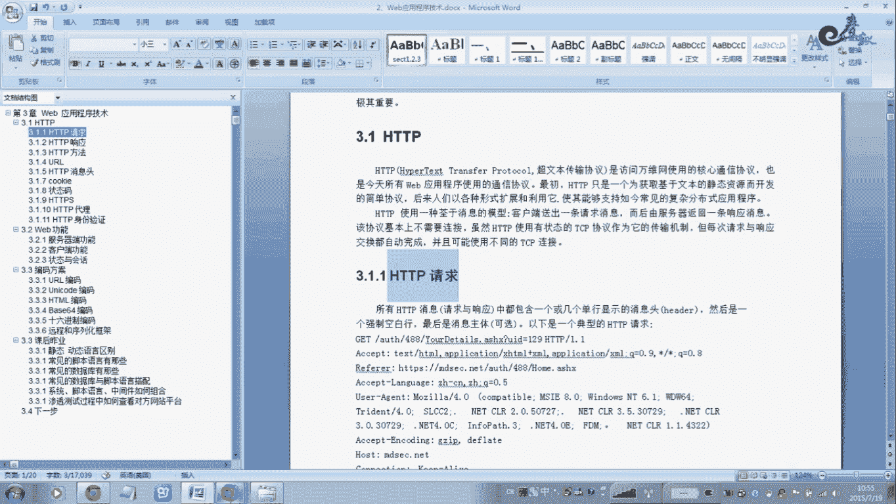

呃，在虚拟机演示后者在对网演示都一样好，我先打开一个维博看点。

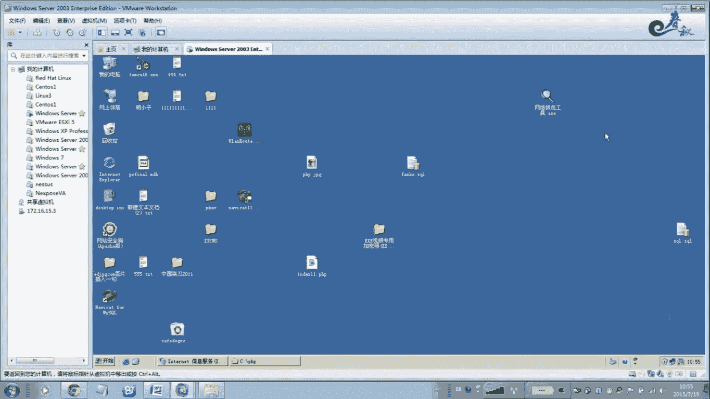

呃，讲这个SCP请求之前啊。你需要。你需要重新一换原件叫EURRP啊，这个叫做神器。关于这方面的教材，网上也比较多，你自己去看一下啊。呃，这个原件我这里已经安装了，它需要照个环境，就说BUIP的安装对。

等再等一下，我可以打包给你啊。啊，这在网上不有啊，怎么样就安装它DIRP。这里我已经安装好了。这是一款。是外部三D测试的一款综合工具啊功然比较强大。好，我们打开它。然后这款软件我后面会在整个过程中。

用到哪一块，我会给你讲解哪一块。直接通通这个环境交布环境之后，直接商击这个。我这里应该是破给版本啊，你在网上下载配地版，因软件是资费的。网上也有破解版本，给1。52的好用没有，现在是最新版本1。6的吧。

啊，大概也没什么区别不一样。呃，目前没有中文版本，都是这个英万版本。所以你在学习过程中你必须要。这简单的英文啊，必须要熟悉。在用贷款原件之前，你还要设置一个东西。就说配置我们的这个IED方T里面的这个。

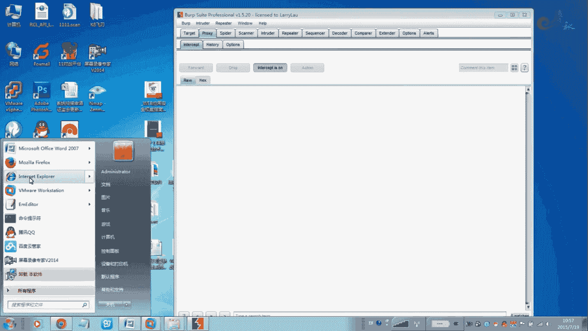

And。为什么我们要配置这个代理呢？案理是填127。0。0。18080口呃，这个当口你自己提要。就是说我们这个浏览这个UIP这款原件。在这个地方就是你在这添加。这个是。

地址就是说你这个地址跟这个地址是一样的。这个地方填写端口，就这个端口8080，那你这里就填写8080。点完之后点就OK我这里已经添加好了。啊，这添加一下。这样的话你才能可以办理，就是意思是什么意思呢？

就是说我们这个使用这个。就打开一个网页，就是说我们通过这个本地的代理这个127。0。0。18080。在继行。往外就是说我设置完之后，那么我。打开网页的时候。等我再打开网页的时。

那么这个地方打开网页的时候，那么这个信息啊。他就会被我们抓取的啊，不是说。所有的网页内容都是通过我。Yeah。那个BURP软件就是等这样的话，我可以看能听清楚。因为将来我们可是楼梯类的嘛？

都是通过这款原件来进行实验。这常方便。而且供量相当强大，安全审计啊，一个排名榜里面工具排名榜里面。前几个啊，反正最少也是前10位吧啊，国际排名。中物元吧。加婺元的。Yeah。包吧，那我这有。你好。

现在是打不开文缘的，为什么我这里拦截了拦截。最好，这个是转发的意思啊，这个是转发。啊。这个是东西。这个是显项，这个是应用的是呃灯光的一些配置。啊，我发生到这个选项，发生到另外一个选项。呃，我们不用管了。

先我把它全部放开啊，这样的话物点就打开了，你看到没？啊。啊，如果我把这里点击offer。咁模会。这样的话就没有使用代理药。这样使用代理页，这样的话我打开任何一个站点。

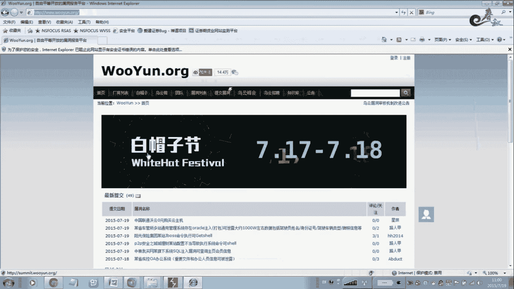

那么并没有。都不会传输到任何数。因为我点击这个on的时。我们开始。那么这个时候通过去回收一下。哎一呀啊务员的这个。哦，知知道了。要打开这个就是D一B这个包。把水先把它递到来，那个文档拿开。

那么你注意一下所有的这个SDB消息包括请求议嗯不包含一个或者几行的显示，这个没有消息。啊，对是什么意思？就是说我们这里呢被抓住了这么多条息。但有呃每个选项都特别不同的行一。这就是头。

然后是一个什么强期的这个空盘，另外是一个交接体啊。那么下面就是一个典型的钢点。那么这里我不给你把它解释了。那这个百度上面也有，百度上面也有那么是什么行义的？北京是 it。我怕咗。那么它是一个请求方式啊。

这个请求方式有什么？有配置，有报s的，一个特者。I第三种。那么我现在是打开微远这个模式，那么这个是什么这就形。我的这方面，如果是pospos是这么pos一般的是这个租户用户的密码点击底交登录。

一般的这情来讲，包括查询一般的是pos。还有扣调式扣钥式这个东接填写在扣角式这个。还没啊，在这这个这个里面啊，就是我们在做路的时候。嗯，可能会给你分解。这个一般是腾取这个。呃。

用户这就是一般是用户名义嘛，用户名义嘛，也认证相关的信息啊，包括这个我我们也举个例子吧，也那个污远，用污远之后呢。

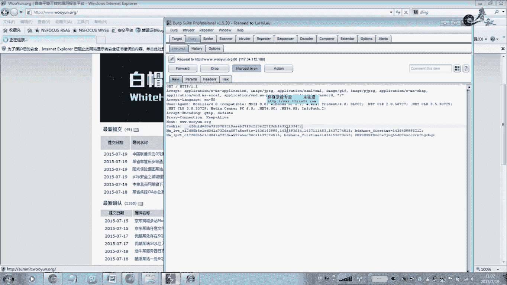

嗯。再一次登录的时候，如果你不需要输入用户名密码，那这么的，那么这个。过程就是特续式的这个作用，说我们的这个相关信息啊，账号相关信息啊，保存这个后缺。然后下次登录的时候，那我再一次做做这个用户没有买。

他直接换成这个本地的登录啊非常的。呃，现在我们先这个是今在给大家解出一础目。不怎么。嗯，这个是什么意思呢？再注意啊，你注意一下这个对手法结刚这个是代表喷体意思。应该是N，不亮是不好，我现在点一下这个对。

这个。我们转发一下。明白。哦。看到没有细母。如果我单场发的时候。那他就是来到了这个。啊，对那你看你看一下这里。对え。我那转发过去连数据报信发到那边。

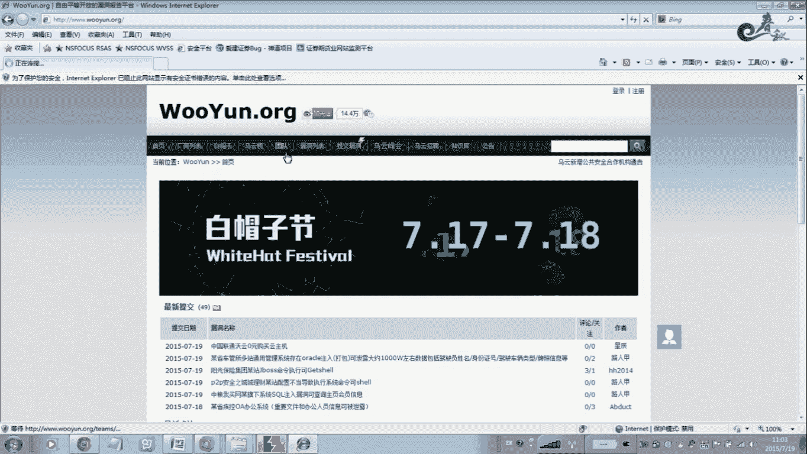

呢个地方你睇下。那是这个目录。EIR呃DAMS。

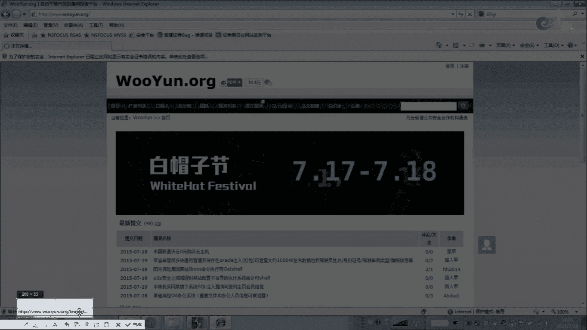

是吧。那么这个是这个就说我们最所请求的是哪一个目录？如果你打开主页的这N啊，N就是代表这个保动的这个企页这个N目录。

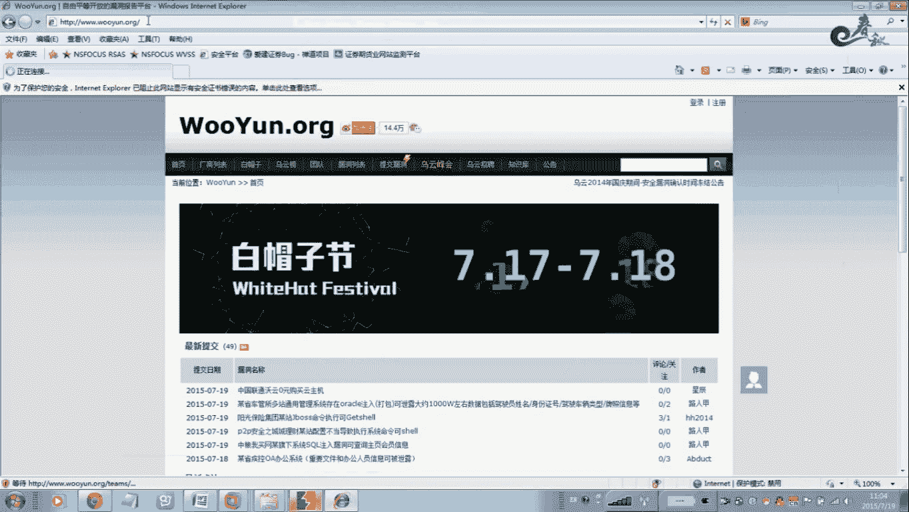

是对应的这个。嗯，把这个我问。对应的就是说是就我这个网站如果是在这个下面是吧，如果无远的账是在这个。那个目录下面做务员的这个培序员代么表非也好啊对。那么我们打开的。原来所谓的时候只是盗用的这个EX点D。

通过我是。访问了这个目录，那么说明是访问了这个文件夹有一个什么？文件夹有一个啊这个金室的这个文件夹啊中端口这里。可以哦，一般呢是百分之百新建了一个这样的一个文件夹。用文件夹下面有。其他的页面啊也有这幕。

里面。你个页咩。呃，有这个。这个这个目录器页面啊这个目录器页面就我们这个团队这个当等你在这个地方它远远做了一些安全的一个配置。那就是说把这个后面的这个。地面把它隐藏掉了，就是在这个地方。嗯，这些在。

就是在真正的这个网络里，那里面这个哦他做不了这样。或者这个稳定态啊稳定态。就是你你看一下我们。随便打几个账的。你办的是他的账号，这应该是。Oh。随便搞一个账是吧。Oh。都是有路径的。

应该是具体到一个页面的，你说一下。随便输入个东西。因为放怎么这么慢。具体哪一个具体到哪一个文件啊，这个我不讲，可能自己去。你看找一个站抓一下报安就知道了。怎么接到后面讲组的。

所以说这个技术啊在这里我做了一个详细的一个解释。这第一个说明是。一种方法动词啊，因为它是一个。方法中有这种有po啊。这就是接收啊，哦那你还可以通过什么？这种模式也可以看得出。

什么就说比方是以什么方式提交的。大家好好后。我屋这里面有一个。功能才不能做。我看讲是应该是有一个网络性的。在这个地方。在这里你可以看得到，嗯，我估它这个空量还比较强大的。你看到没有？前面这里有地图是吧。

那你你就说帮他打开一个网站是以什么模式，你觉是以ge种方式还是pos的模式啊？在这里你可以看得到啊可以看得到。IP地址会有原件IP地址大小文件。安太码都要。哦，你又唔理包波啊。嗯，那这个历史信息呢。

可以。公园。就是验直关件，但这个这个请求并没有这个消息的具体。因此在消息投后啊空白行中是没有数据的，就是没有数据的。所以啊说清这1万A的所以说。包括这个所企业的资源的名称，以及这个包含的这个客户端。

像这个该资源体积的这个参数啊。包括口先参是这个字府创主。对你可以看一下这个这这一块我给你讲解一下这个。呃ADD这个版本啊，1。01。1啊。他都是这个浏览器，嗯，在这里我也有嗯，一加1的版本。

部部分浏览器是一一的版本嗯，那个以前老的浏览器啊，所以说我没有更新的，什么I16。0是6。0I1就6。0是。一天你该是哦顶天应该是。1。0的。可以自己发包，可以看一下啊，默认是1。1的版本，不是TV1。

1。或是说他这里都会标识出来啊。或是说他这个配送模式你大概就是说你要知道。呃，对方你打开一个网站是请求模式啊，请求的这个资源，包括他的这个版本HDTP。那我们看一下这个。ACCED。他这种。

他这个是它的作用是做什么用的？它是欧洲社和纽端制支持的这个。买M1这个类型的这个。对，就是说他支持哪些这个。语言就是说这个列如HTMS的。啊，那理解这个。利息也就是我们这个。浏览器看他支不知行。

你看一下嗯这里。如果是。非常这个地方是。那个5月7号。我发表所有的一个。那我看一下他的这个浏览器支持什么？有这个图片的呀，有XML的呀加F的呀等等，他这里都有，你看没。那么这个我。每一个我也给你。

做了一个注射啊，在这里注射一下，但是它含义就是说用为标准化的这个表志这个文本一些。文本信息这个是表示HTMI的文档二是一些数据更了解一下就行了。但是他知识的这个类型啊。我秘密这个类心。

中明他就是支持这个这些类型，我明解标明白。这个离付啊，第三大块就是我们这个离付。就是我们在三个测试过程中用的比较多的是CSRF。就说很多扫描就在扫描过程中。像AP看啊农的R那个WBSS啊啊，这些扫描器。

他不是采用这个。你fo嗯通过这个leafo来进行碰到这个。这种肯战CSRF攻击。是怎么判断的呢？这个意思我们说打开一个物源。啊，婺远这个大有得找，打开婺远。🎼，ですあ。关是。我看一下他这里有的没有。

很到之前没有。那我们只能看这里了，历史记术。那个含义是。碰到这个。我们这个。网站就是说从哪里来从哪里来到哪到哪里去。就是说昨键是我如果是打开的是微源文档，一般的情况下，这个离付啊，它也是无远的。

如果我这个house，他要跟哪个比较的是跟我们这个house。这个比较。跟这个比。就是说。如果hosse都是hos是什么？是主定意思？就说。你打开哪一个网站，你打开微博。呃，微博这是打开的微博。

同明他这个是。那如果扫描就扫描的话，刚哥跑那个。PSSRA一。啊就也就是说。我这个house打开我打开了哪一个网站，那house手机是哪一个网站的，对不对？就是说我打现在打开的是会员。

那么这个好是百分之百5元不吧。那么我们品配的是无源了，也挺赔就是无源。那这个是如果他这里有离缝。那么离缝的话，那那么说明了它如果这个离缝是也是那在正常情况下，也是有意思啊，我们现在是。我想了一下。

我通过这这个页面，这个这样的话就离谱了。不5元。那没有。通过物源这个建立来的就3W。点5元点ORG。我我问到这个这个页面。不说前面是从哪里来的，是从这个从这里来的，所以说。我不是通过什么外面来的。啊。

可以看到这里。这个地方就不一样了啊，你像这个地方你看到没有？这里是主机是什么？微博的。恢博。那你不是无原来的。看了没有？就我们访蚊就是通过婺源过来的，屋源，就是我们打开打开的是这个地方。

不是这个地方是有屋源。正常情况下是不要跟这个bos是一样的。是？举个例我打开百度。对嘅。啊另外一个商点，那那个地方可如说是百度，供们通过什么？百度来的就百度来到这个这个。哦。

这笔的话是通过微源来到这个位置，这个意思。下面这个是语言，呃铝览器知识的这个语言。这里都有。我哋。这是个语言。我这个地方有些有一些他每一个这个网站还不一样，因为这个头有一点点小的区别。呃，那个。

在这里有啊中文啊BS的这样是吧？嗯他他那也给你做了一下注释。我嘅兴。优先像我们呃如果你是在国外的话，也嗯每个国家是不一样哈。一般优先是中像我们在国内的话，中国的话优先是中转。The这这个。那我理解。

浏岸系知识的这个中文包括简体中文，但这里不会有一个。我不得标明。这你可以可以可以看到DM表示本体的文啊，DM是表较示中文的意思。就是说我们里面技术知识的语言的这个类型。原理，那这里还有一个Q啊有个Q。

AQ是一个传常用的这个系数，他做什么用？它是一个0啊一的这个范围啊，我得职越打倾向于这个。获得的。这个在之前表志的这个内容啊。在这个地方你可以在这里面。哦。我在百度里面查一下这个腾讯，这个一般我用的少。

一般不用。那我没有什么用。嗯，在这里可以看得到，你在这里可以。嗯。唯一的一个解释。对。这么来吧，你搞这个地方。Thank。像卡的话，百度里面一卡就比较方便。你啊，咩。那这里就也释的比较详细。

我因为我挺多倾向于或取的这个非常草。之前的这个类型的表示的内容。嗯，你自己看一下，他这个地方。了解一下他说知识的语言就行了。肯用我那是没有用的。呃，第三个下面的讲节。又是X嗯，这个是代表什么含义？

就是我们在这个地。那这个消息图就是几构语主要是与就是器对其他的这个。当才所请求的这个客户端软件有关的信息啊。但是现在大部分我们抓高点啊，它都是这样的一个。嗯，这种这种头里面。都什么意思呢？这个。

我这个情况就是是这个图。但是那个。嗯，冷安器啊。人是按理说是应该是这个地方是不一样的，每个浏览器不一样，它这个不头是不样的。一样的，但是啊为什么会出现这种？因为这个。咱那个lateter space啊。

这个理论器啊。只要历史上嗯。要有许多2分时的这用。因为呢呢个点做。因为他遗留下来的留下来。现在很多人且也也只用一直使用这个。就使用这个不那个潜。1。包括IE浏览器，微软IE浏览器也是保留了这。

或是啊没什么太多讲解啊，今给你讲解。就说那个。本州的主义。这个ACC。这个。被告是代表什么行业的？表示的是浏论器知识的压缩编码，有这个VCIP啊。有这种类型。这个压缩编码这个但本运尾这是比较清楚的。

就是你也可以装一个火锅插件，就说我们在做优化的时候。可以看得到，有些是采用了这个压缩模式。他说的。他面都有啊都有。就说我们这个面接支持的这个压洲编码。这些方面是留呃了解一下就行了。

你大概知道他是什么行业。这就是呃不是我们在后面一个详细讲解，专们针对他的这个估计。这个是导致实体与配货上的一个连接情况。哦，你呢点。呃，这个是在渗在测试过程中我用的比较多的。问题。要想家电视。

在这个断案机里面有一个这个功能。就这个这转发。传包的意思。他是什么意思呢？这里我嗯再一个这个。这是一个朋友。发过来的一个。就是挑战就是说这个。嗯，大概若让的话像VIP费养吧，还是什么？

做一个呃要课程的话，他需要。不光比说内测，比说这个三6K的内测。就是有一个这样的一个题目。啊，总共我就加了一个图，我顺面写这个文账的时候。把这个是暗夜。不留下来了。你可以看到这个题目这。

希望让你找到这个paword这个密码。而且他有一个提示是，而且从百度过来进入第二关，需要把IPD行文档。不是说在我们这个实际过程中啊，在三次采计过程中。那一个问题是。有些他限制了。

只允许某1个IP地址转问。我某1个IP地址。防管要包括这个防火墙的ACA的规则啊，对吧？包括这个IPtable软进来个都是可以限制这个IP地址的。你的一个访问情况，那我允许哪些记者来访问我这台就不略。

那么这个这种模式我们就可以突破。那为我知道这个它的规则列表里面的软件IP地址可原许的情况下，这样的我就可以。通过这个建筑和这VIRP的文化可能性化的。你叫佢出嚟。就这么简单，你看啊直接。

首先我们需要疑货，或是的我刚才说过。这是我在CSRFDB里面的比较多啊，CSR。呢你比较度。那么这个在这里它是起到的作用，用么了CFRF。因为他这个。

我来说完全都知道地方的这个防护软件也机器古怪的用不样。哎有他只他通过什么来判断的，包括。包括这个邮件这我大才过的。嗯，像无力看法，我想就百度里面就可以设置，那就是采用零售的模式，就碰断这个。

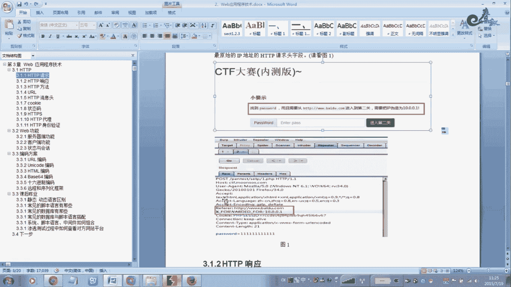

你去下载一个资源，举个例子啊，如果这个婺远这个地方是有下载。下载对不对？点下载，但是下载的时候你需要。叫什么？需要这个。会员账号密码登录上去，你才能下载这个资源。但是有一点你看。

不像关闭这个流览器的时候。那么这个计样机在渲雷里面下载不了。包括后者你不登录情况下，那么你你都不能下载，只有登录了，你才能下载。那么这些防护软件是怎么做到的？再通过这个离。

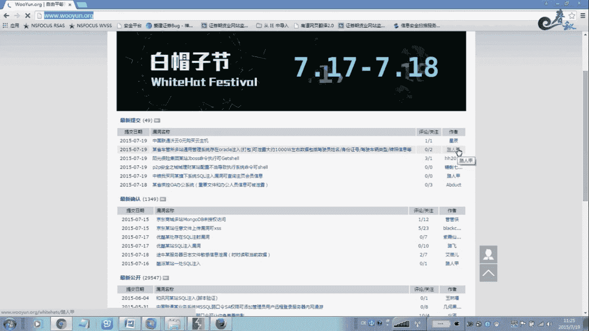

压放的然后。

我看你请求，就是说你打开这个页，打开你打开这个下载的个点如后对啊，这是这个是下载。我判到你这个就说是不是。

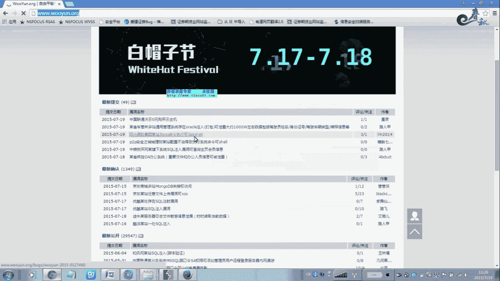

通过我本案。来进行下载资源的。就通过这个离货来判断，或不是来自于本账。如果你请这了本站的资源。

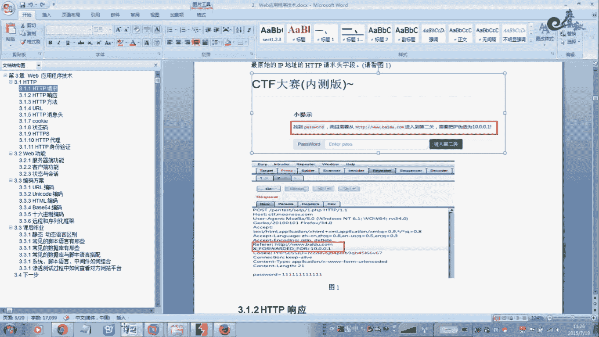

这一个是本判的。

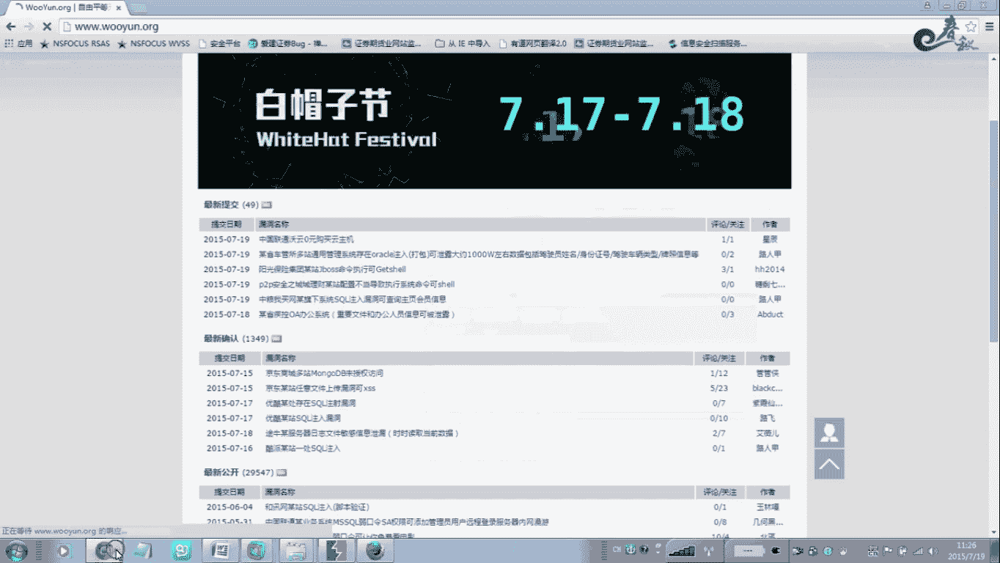

那么你就可以。价格。所以说别的人直接拉个炫雷去。换一个连接壁址，但是别人做了反爆点，那些雷里面哎侠不正啊，哪下，这意味什么？说，你能把离数改一下，你说改成什么？刚后你做BRP下载资源的时候。

BRP发一个包看一下有一个程。是吧是是是的，般们就是说你看哪个上下载，嗯，以后就是哪个上的。如果你通过迅雷人力下载，但你发现我离步不是啊出问题了。啊，那通过其他的地方呢进行访了这个上面。

那么通过一方的防盗链，它是防止的手。

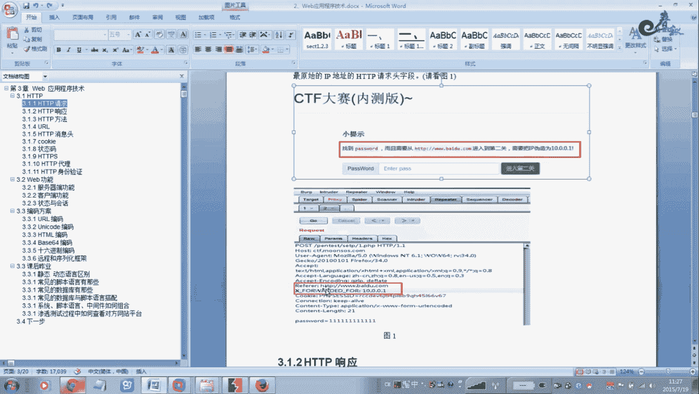

任何落任何来任何地方来来过来的地址，我都给我都把它对，不允许你驾载资源。啊，只接通过本账就是说通入了。

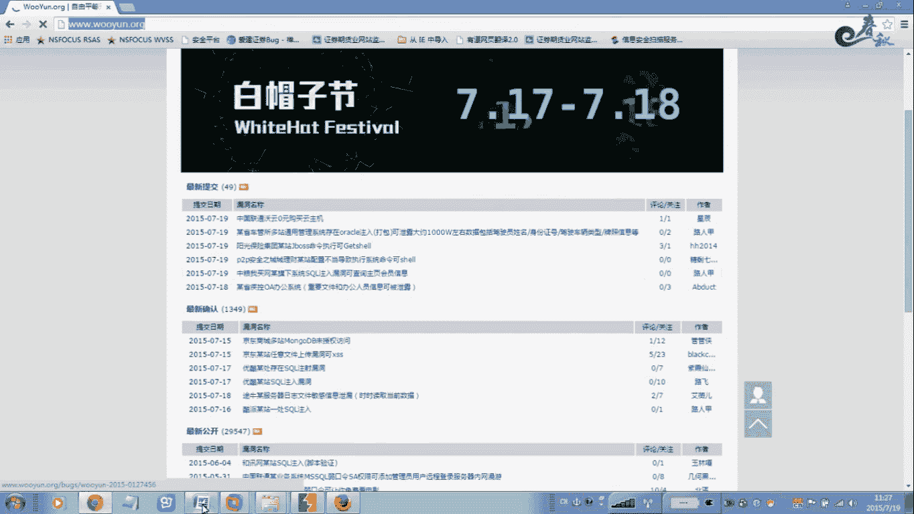

啊，我我看到这个离合是我自己的，是我自己在账。反说能通过我这个上的进行再到资源。那这样的话。那么。那就是允许的。那么这里他也是一样，这个案例他也是一样的。可以看到那个。他需要是。我取是通过百度来。

比如说他是碰到你一步的。比如说你通过其他的。非常过的。他放到这个离座如果不是白。那么我是必须的。不果你使用什么手段，而不是拒绝。我关于他第一个碰到碰到离后，是不是。在我这个规则里面。第二个是IB地址。

我我允许老个ID就，这样的话我是。把这个一服改成就给目标RP改VRP在这里可以改掉，可以改一下。那个太哎这个地方是没有默认情况的，但是没有这个情况，没有这个。Thank。你先吃饭吧，我我不用吃的。

默认情况下，你们看一下这个这个这个地方看for word，然后这里就不打了啊，这你这自己可以打吧，这样就大写掉。嗯，这个这个我这个让。应解几。这的我就突破了这个。IP地线我个1个IP地址。这样的话。

常的防货墙包括这个。嗯，其他的一些我们一看。这那林凤。是达到我的要求，就是我我要。这个里面呢就是说。我这个蛋还是来自我第三的长。而且这个IP地址也分在我这个记里面。多谢大你。看了对啊。

那么直接可以嗯别突摸了。呃，通不道这里没有加另外一张。不过之道其实我在这个。我在这个。房时我在这里给你这个你tail，我在讲示。问一下。发生这个事啊，这个呢个。右边你可以看到这个密码。但是我。啊。

这个是HDDB投的这个情求啊，等就下面来讲一下HTP响应版。

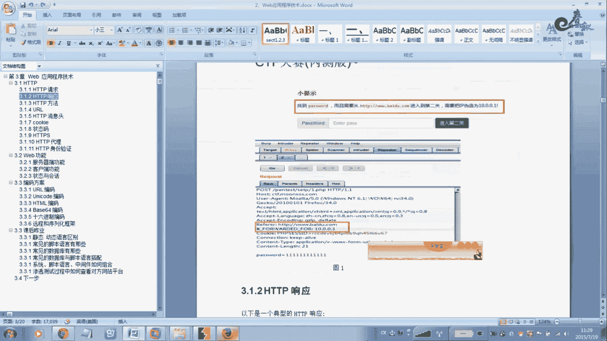

