# 经典15年i春秋渗透测试系统化教程 - P38：课时2 远程命令执行-PHP命令执行 - 老网恋教父了 - BV1n54y1B7F7

🎼Yeah。好，接者讲解。呃，刚才这个地方有点问题啊，不知道程序代码的问题啊。嗯，那代码还是这样子。

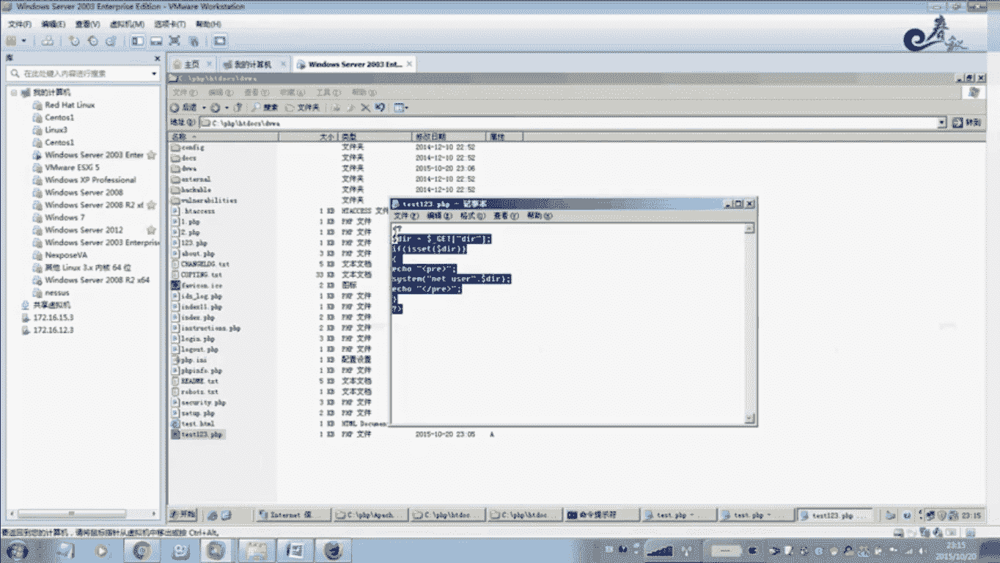

呃，这路径搞错了，他路径搞错了。然，我一直在这里调试的时候。你看。呃，我改了个名字。你看g个 test是这个吧，对不对？那，我这个加一个嗯。问好DR。你看这都是报错的，对不对？

你在这里接一个任何东西都是错误的。这个我们发现我这个地方。啊这个t是在这里。我以后改了个名字，发现找不到这个文件。那在这个路径下面，DVWA对不对？那这个路径下面那这个是这个道理。那么记得我们在这里的。

能 taste。点儿，那这个时候我们再执行。那，你看这个路径是错误的。DVW。这样就执行就OK了嗯。在我们这个边呢只行这个边的，这里是一个碰到，也碰到它是否复制是否有东西。呃，接着再输出。

你你看他就用到了system，你看执行这个lateter use。只能自执行这个lotous是吧？啊，这个DR只只能等于这头右。也就是当我们去输入这个DRR的时候，如果ID接上这个参数DRR这个就是。

嗯。只要我们在这里。嗯，在这在这里你把这个关了吧。只要我们在这个推色点PHB后面Y号ID就是这个DRI这个参数。其到这个参数它就执行了。因为这个参数带给了他吧是吧？

而如我们这个stem呢就是把这个let use啊执行完之后给这个参数。点R这个参数，这样的话我们就嗯。直接执行了我们这个lato use这个命令，你看所以执行这个命令，对不对？

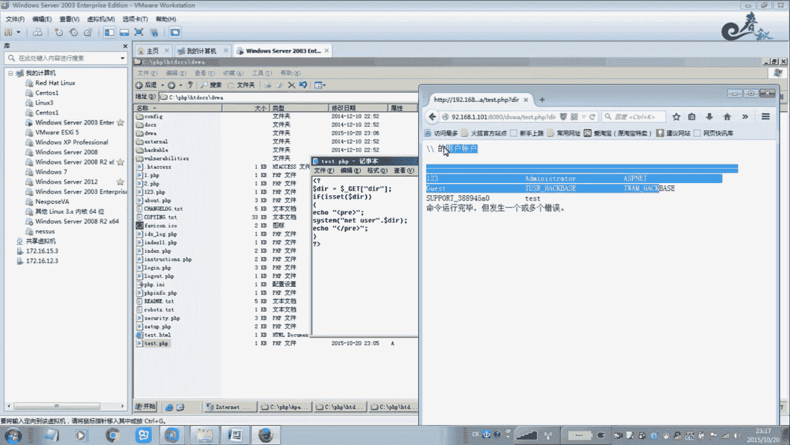

嗯，等然。那我在按理说这个是安全的吧，就按照我们就是平常的程序上来讲，他没有考虑到这个其他的方面。因为我们这里是复知是怎么回事啊？

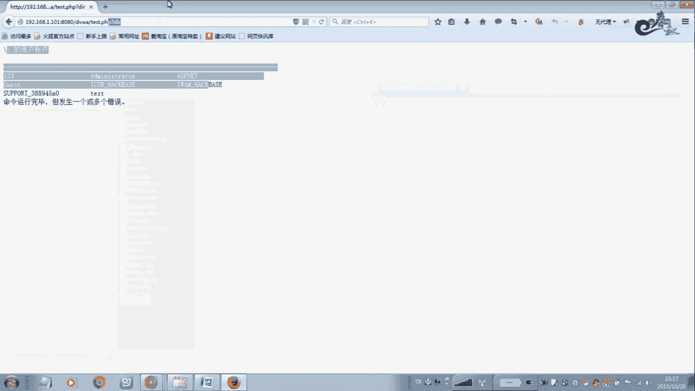

就是说我直接1个DR，而这个DR我只有你接DRR这个参数才行。我接其他的了，你其他的你加个D行吗？绝对报错，绝对是不行啊，这个是毫无疑问的。对不对？所说你直接输入DR，而我这个DRR写死了。

在这里写的很死。作为程序员乱讲，他说我写的很死的。那DRR只只有这个输入这个DRR这个参数的时候，就是说我们这个负一个这个值是latous。

执行就是说我们this time就就是这个嗯我们在这里后面会讲解就是执行系统命令系统命令执行let yes给这个DRR嗯这个变量。对不对？再输出来啊，EC轴输出，这样的话。

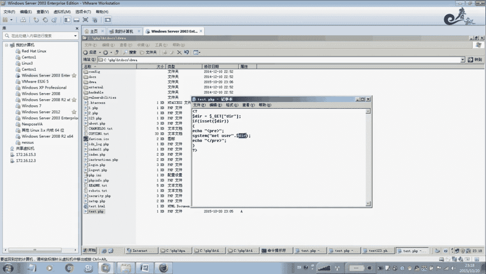

按理说是没问题，就是说你这里只能接DR啊，DR只能执行这个内特右手这个命令。那类的钥手只只能复制给D二。但是你注意，但是嗯。

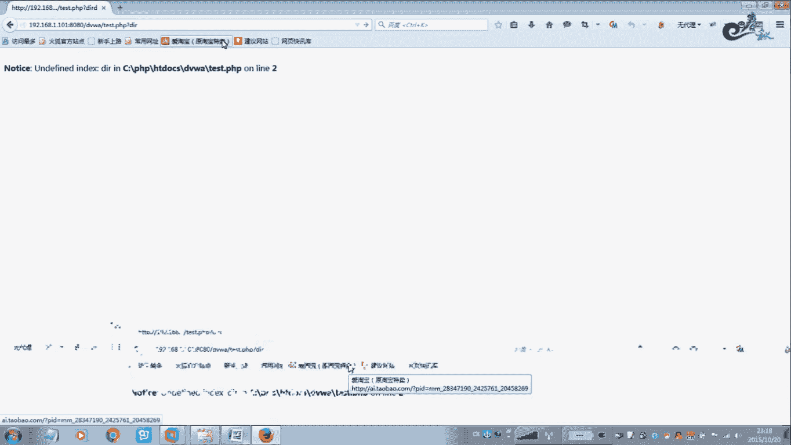

很多人忘记了一个什么。忘记了一个什么东西啊？

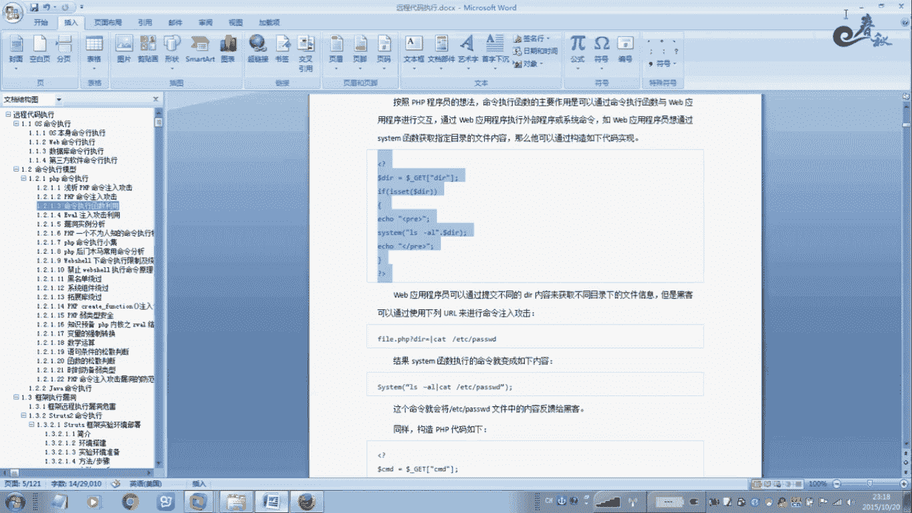

问你一个这个玩意。哦。忘记了这个一一个符号，在PSP里面，它有一个还有一个任何房子。这这个连接符号啊，连接符号这个符号。也就是说我可以执行什么？在这个连接法号这里，我可以执行DRR。你看。哎。

就是这个这个还没有啊还真嗯不道。嗯，看下。嗯，之前没容要是DII。嗯，执行一个其他的命令吧。CD。

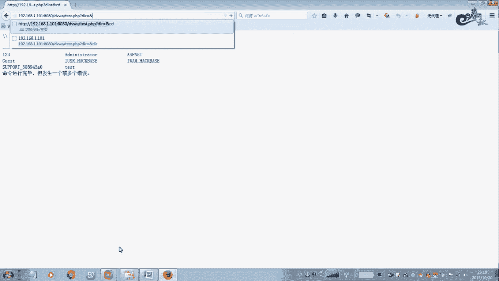

Yeah。

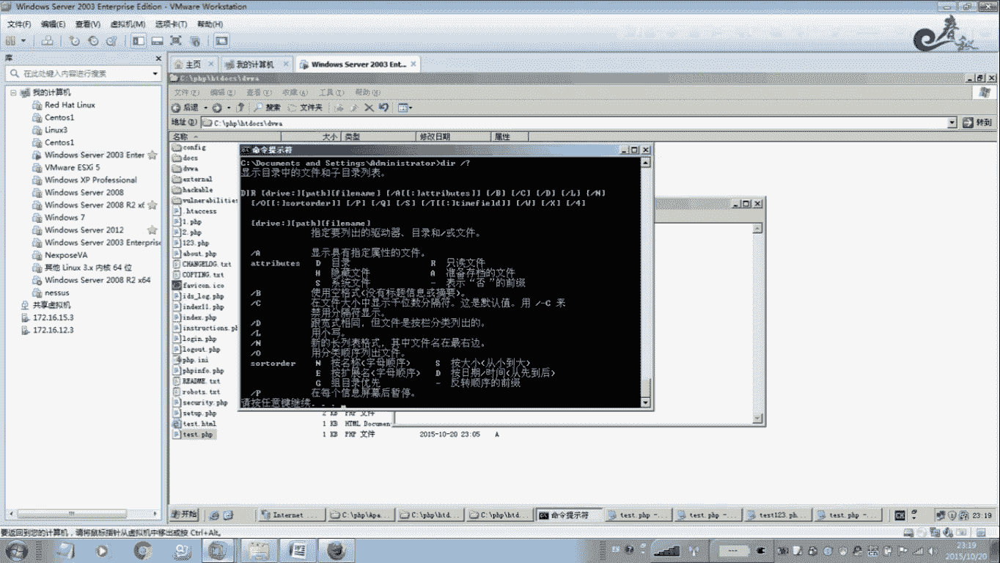

Oh。关迎。嗯，这个 later going。嗯，这种还不行。这个点就否在这里还不行，那只能这样做。可用这个。嗯，怎样这样。嗯。这样就可以了。就是说用这个符号。这这样的话这个房就是一个相当于一个点。

就是说当前面为甲的时候。我就算前，不管你前面伪真还是伪假。我可以执行同时连，就是说同时执行委托要匙的杠M这个面。啊。是这么回事的。现在找明白没有？就当我这如果没有了。你后我如果没有这个房。

你看没有我们事行加个等号。这个没问题是吧？是吧等我在后面再接一个这个呢，大家注意哈，大家注意啊，当你去掉这个符号，没这个符号的时候，你是不可能成功的啊，你执行任何命令也不成功，很直的是。加上这个符号。

就可以了。哎，我看一下啊，当我这个地方嗯。按理说这个符也是可以的，我看一下，试一下啊，这个符还是不行，在这里不行。这个房子有一个有些地方是可以的。刚才还有一个就是这个两个两个那个两个竖杠。啊。

两个速感不行，嗯，只能一个。嗯，搞错了。Okay。Yeah。这一个。两个。阳光按理说也是可以的。哎，哎看你看一下两个哈，两个的作用，你看跟一个两个是有区别的呀。你看啊。一个他只执行了后面的，对不对？

直接他后面的。后面这个letttle右手杠M这个命，因为我是两个的两个，你看。两个这个符号呢，还出现到前面跟后面的看。点第二这个嗯。

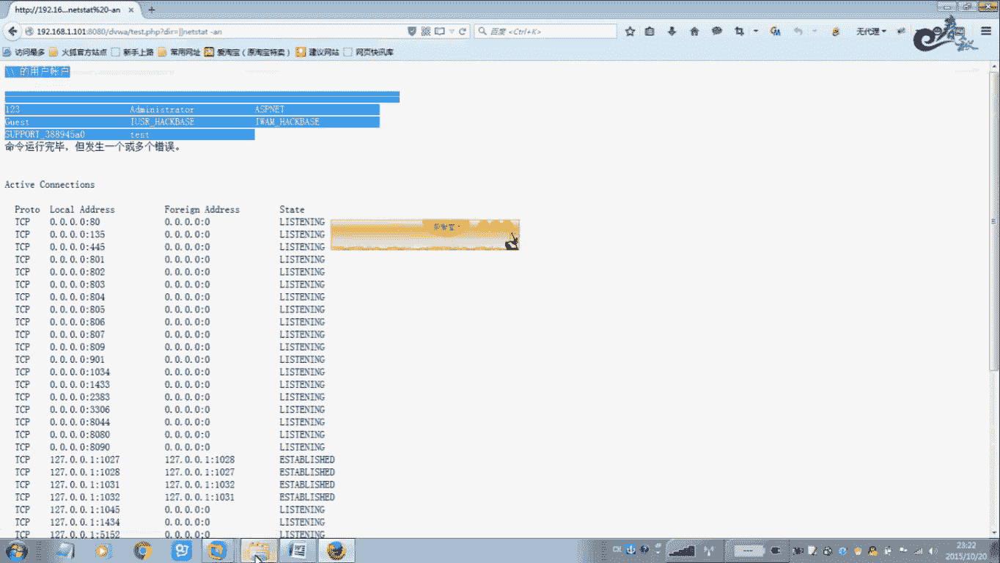

这个命令也执行的。

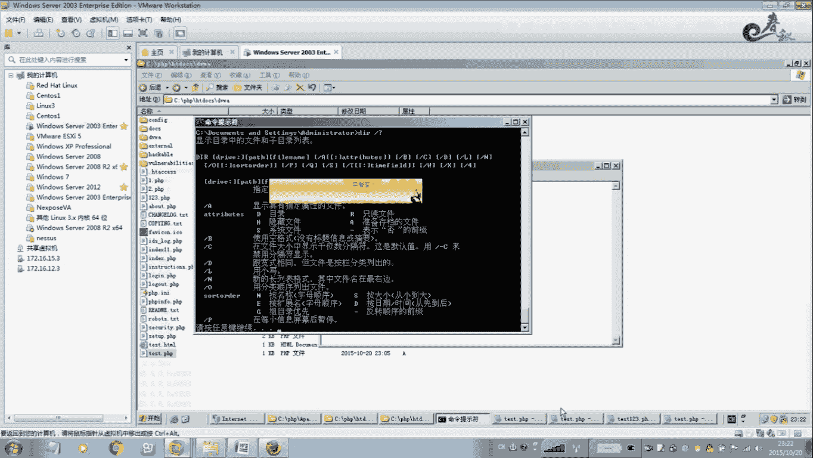

啊，lattle use就是本身的复制本身的一个lattle use执行的。

而且还把这个后面这个也连接起来执行。这个管道符号这个在linux系统里面就是管道符号啊，管道符号。啊，就是说你程序员你你忘了，你就是你忘记了，就是说有这些特殊符号可以，不管你前面执行真与假啊。

有了这个管道符号之后，它可以AK。攻击者可以在后面计上他想要的攻击命令来进行执行。啊，来进行执行，这个是非常危险的啊是非常危险的这就是这个命令执行。

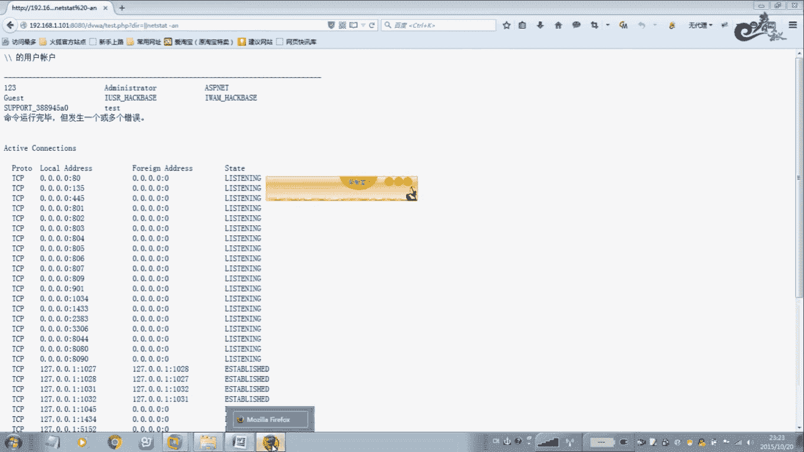

好，关于这个我们就给他。讲讲到这里。啊，下面大家可以自己看一下。嗯，我们来看一下第二个。第二个是PSP这个。来调用这个呃外部应用程序命令执行的这EXEC啊。

这个函数这个函数可以用到这个执行一个外部的应用程序啊，外部的应用程序。那么这个其中的com呃这个comment的话就是一个命令。嗯，欧洲负责就是输出啊，执行输出这个煤阳的这个周券。

那么这个他就是嗯乘上这个执行命令后的一个障态值。好，那么我们来看一下这个代码。大家自己可以看一下啊，对于我们经不做实验了哈，这个是一样的哈那是一样的。这个在这个嗯这个一句话木码里面用的比较多。

进行远程连接啊，执行命令啊是吧？那大概到我生在上序的非常清楚，也是一样啊，就是当我们。给出去说就是获取到。用户输到的东西的知道，直接给这个变量，获取到的这个参数值，直接给这个变量啊。

用这个EXEC来执行啊来执行这个变量。同时这个他说不做这个变了，就是当我们获取到了这个嗯。获取到底这获取的这个这个前面的什么的这个。变量这个执行的命令之后啊，来进行。输出每一行支付券。嗯。

那么第三个就是这个。索THRU啊这个函数这个函数也是用的多的啊，这个可以用来这个执行这个U case这个一些都没有。并且显示原时的这个输出。呃。

当我们这个unic case这个命令输出是二进制这个数据的时候，并且需要直接返回k伦览器的时候。那么需要使用的这个函数。来代来替代这个stem跟ECC啊这两个函数。他也是可以执行命的啊，是一个这种形式。

那么第4个啊需要EXEC那也是执行需要命令，并返回这个输出的字符权。那么函数的原型是这种函原型。那么写进comment它是这个参数的执行命令的。那么实例那大家就是放在虚拟机里面哈，放在记事本里面啊。

立长为一个扩张名为PHP的来进行测试啊进行测试。呃，第五个是院算服啊，这个大家可能用的稍微少一些，但是捞过一些黑名单还是很有用的。预是用这两个符号。按这种的那要是运算符，它预需要EXEC的动呢是相同的。

啊大然也也有的人是第一次见过，唉，这个也是可以与这个需要EXEC这个跟才是相同啊，它也是可以执行需要命令，并且返回这个输出的支符串的。这个大码啊，你看。我们获取到的这个。参数传给这个变量之后啊。

实上在这里一个把再把这个你看。就是当我们列入这个这个变量里面，当我们就是负值的时候，付给这个例如付一个let右或者DRR的命令，那直接传给了这个变，这接着输出这个变。看到没有？

这样就就可以进行执行命令了。啊，执行命令它这个也是可以的，大家可以把它复制到这个虚拟机里面，一测试这是OK的啊。帮我们把它复责一下吧。来暂停一下。好，我把这个代码已经复制到了这个讯机里面啊，放到这里哈。

来保存一下，大家认家看一下啊。CMD啊用的这个符号好。就是用的这两个符嗯，这个法一边一个。因为这个哎大家可以看到这些变成双一号一样的。啊，不是啊，他是因为我们你看到前面的代码，对不对？

他这个是嗯那种符号，你看这样的代码都是，你发现谁。是一个商业号的。哎，不对呀，这个。

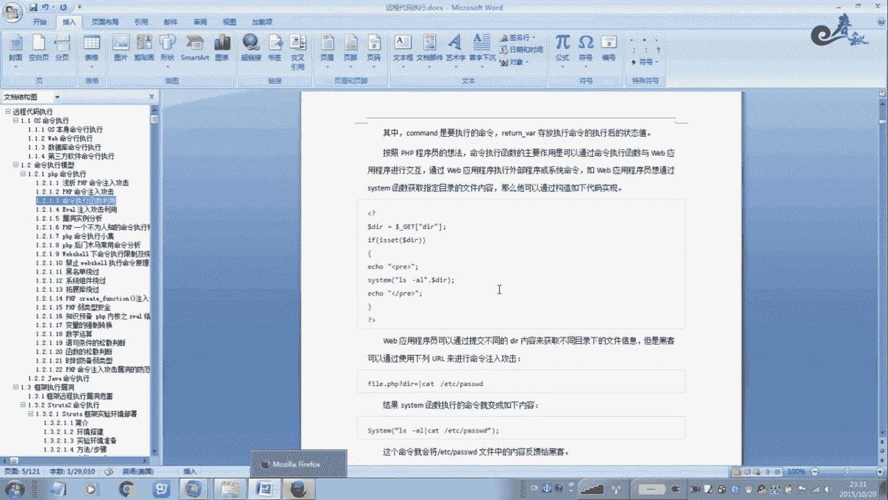

啊，在这里啊，这个是没问题的，这个啊在这里再看一下啊，你看用这个。哦，我们在这里保存一下。没要关闭，我们在这里执行。碰到这个地方问好CMD是吧？CMD你这样是绝对有问题的，看到没有？

那你看这里价格等于哈。这个lattle我们分传一个letttle钥匙过去，你看是不是执行命令了，对不对？没问题吧。能DR人对不对？那你就别目录，知？啊列出来是当前目录，你看。没任何问题吧，你看当天的。

想潭方便吧。是吧。这接明年执行。这样的话相当于大家写什么写一句话木马一样写一句话木马，你可以想做什么就做什么。而大家大家有的时候呃突破万uff的时候啊，就突破万uff的时候，很多人嗯。就用网上那么嘛。

网上木码的更量强大，爷要小码小码就是没有被。没被瓦F拦截大码都被挖府拦截了放火的啊，有的杀毒员家杀掉了。那么你自己写木马的话，很简单吧，你写一个命令执行这样的一个木马，就几行代码。

这几行代码你可以变化的，变化无情可以改变的。就是说你看它。

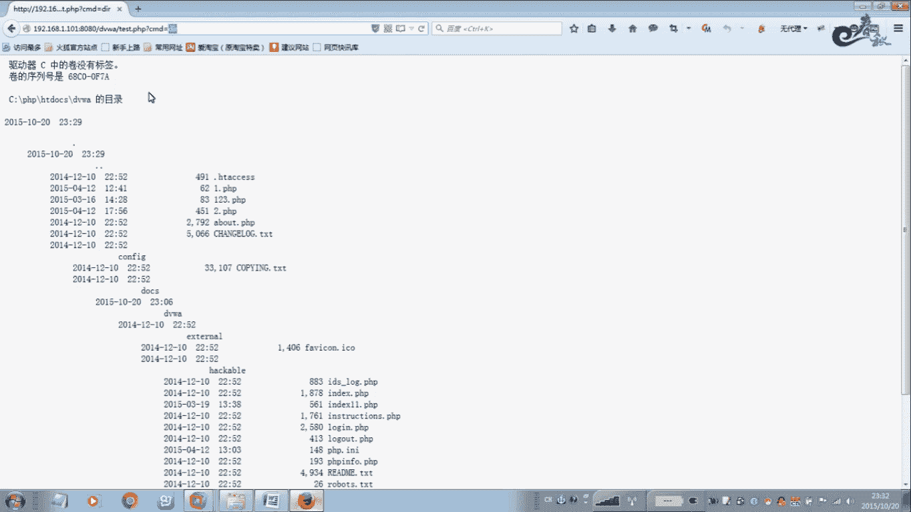

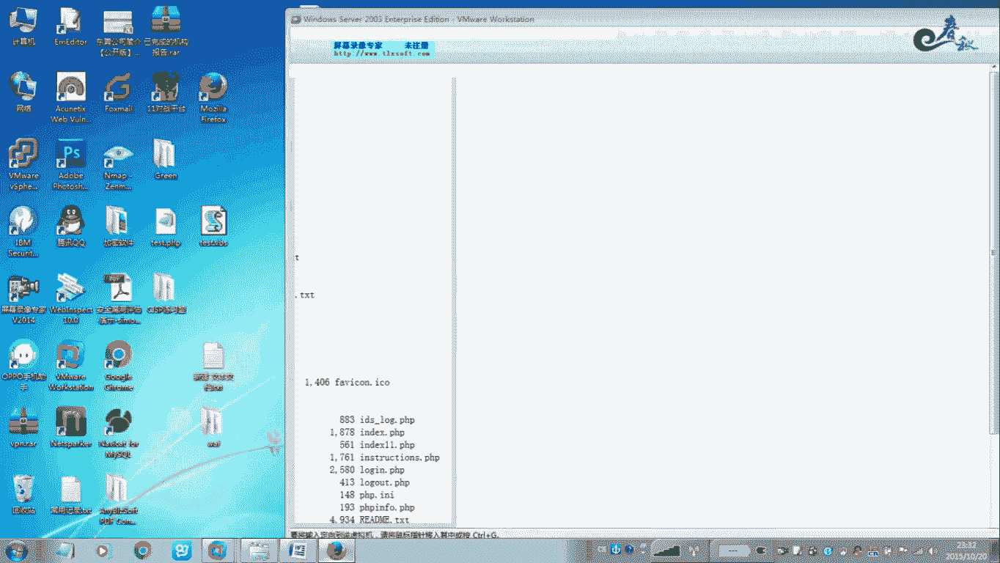

嗯，万福拦截了哪一些这个。函数，那么哪些没拦节，哪些可以加密的，哪些可以大消写等等很多方法来突破。所以说你一定要知道这些方法啊，知道这些方法，知道了这些方法之后，那么你就。屠夫就很简单了。啊。

那么这个我们就给大家演示到这里。那么接着我们下面的一课啊下面看。我院山府。好，那么接着我们看一下E这个EV这个AL注入攻具这个利用。那么在PHP语言的中啊，取到上面5种方啊。

55种常见的这个命令执行函数，可以导致这个命令注入攻击吧。还有例外一种命令注入攻击方式，就是称我们称为这个EVLLA这个注入攻击方式。那么这个函数它是将参数啊将参数字符串作为这个PHP程序代码来执行啊。

这个大家看没遇见的比较好而是作为代码来执行的。用户可以将PHP代码PHP是保存成为字符串的一个形式啊，然后传给ZBEVLA这个函数来执行。那么它的方法是最终的啊，原先是最终模型。啊，这一个有一个实例啊。

一个简单的一个实例，你看。啊。从绿个只给这个参数或取给给变量，再接着。ULAV。啊，因为LAL来进行执行。那么这个是当做PHP代码来执行，不是当做命令来执行，是PHP代码来执行。

这个时候当我们这个CMD如果等于这个PHP in这个是PHP代码是吧？这样的话它返回的结果就变成这种了。当做代码来执行。嗯，那么如果我这个地方是什么，后面接上一句话木码嘞，那我是不是我就可以点击了。

那当是一句话木码。如果我这个地方是木码，那就可以了。那如果这种方式呢，是不是我们就可以。嗯，过一些wa夫这些方式，这也是一种方法。因为我为什么要讲这么多方法呢？就是为了在我们这个渗偷赛术过程中啊。

很多东西都是被wa夫啊各方面一些安全上拦拦解了。然够有了这些方法。我们讲了这么多方法，大家就可以进行突破啊进行突破。嗯。等等PSP语言就还有一个什呃，这这些啊dbl啊STRdbl这些函数等等。

一样可以同样啊也是可以实现这个EVLAAL这个注入攻击效果啊。那么这个例子的描叙，我们在这里也给大家。一个模型也给大家看了一下啊，已经写了一下啊，也有实列啊也有实列大家可以去这些测试一下测试一下。

然后在这里我就不再一一的给大家演示了啊，代码都给大家了，你这样放在虚拟机里面，一放粘贴啊，一执行搭建一个黄金就可以了。Yeah。啊，那么接着我们看一下这个就是在互联网上面啊。

我们包括污眼污眼网上报的一些漏洞。那么我们拉出一部分代码来给大家讲解一下。那么通过前面我们这个PS命PSP命令这个注入攻击啊，了解了一些情况，我们会以结合实际的那种成次的情况。

分析一下如何利用这个命令注入来进行等级。首先我们像国内用的比较多的像租子。这个著名的一个致梦人网站，就DDCMS。嗯。这个5。7的SPE的这个版本哈，那么这个呢段是存的这个这个文件啊这个文件。

这个版本的这个文件里面，你找你可以下载这个版本哈，在本地搭建一下，自己做这个实验，这里我就不再演示。这个文件这个可以被这个只读一句话啊，后面代码。

那么这个什么PSP连的这个这个嗯给大家在包放里面就给他讲解过了啊啊，你们给解释过了。我没想关在门看了呀，嗯，他用到的是1V2。EVAL这个函数。你没有顾虑，直接打入进去了。我再用红色的一个标记。

那么通过分析采判，我们发现这个代码。这位置分类这个分类也是这个呃mobilshop就是就是来构造这个函数的。而插入的代码正好是我们上面描述这个命令之路的这个函数啊，这个函数还有一部分大家没有贴出来啊。

那么在这个执行内容的时候。是否为可控制类的？大家可以看到后面就知道PSB这个两点的那发斜杠，这个input它是一个输入输入流。也就是说可以通过这个pos的方式。获取相应的原始数据内容。

可以构造这个pos的这个数据包进行一个控制，这样的话可以导致这个秘密输入的中的一个形成。那么这个漏洞怎么样去利用啊，怎么样去利用？呃，这个内容利用方法也就是说很简单，就是找到这个网站的有一个目录。

就到了这个PELUS这个目录的1个CARR这个点PSP这个软件。那么这个文件你可以看到这里是吧，你看到这里。嗯，这里一个new啊新建一个这个。没看没？后面他们出现在这个这类来构造函数中。你看这。

你看这里的利用方法是很简单的，就是pos，就是用pos的方式提交。像这个文件CR这个我们就是说提交内容是哪些内容呢？写了1个ECH。啊。写入一个抗门的这个主路测试啊，面临主路测试。

接着我们返回数机包里面，这个过去就返回之后啊，返回包里面有这个。有了我们提交的这个comment的注入这个代码，这样的话说明是OK的。因为ECS出写入这些内容啊，返回的也时这些内容说明是没有任何问题的。

这就是我们这个漏洞的一个过程。网上有详细的一个解释，这里我也做了一下描述信息，大家可以去知道自己练习。

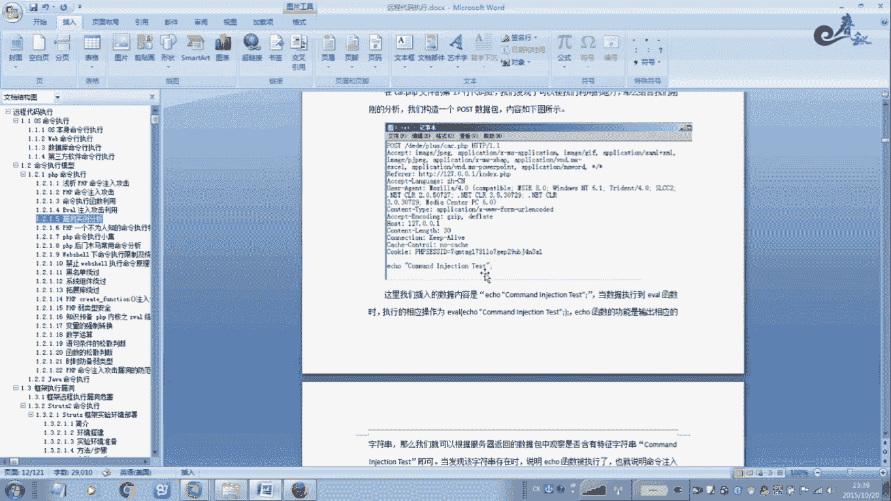

这样的话，我们既然是存在命令注入，那么我们就可以插入计换木码啊这一插入方式。啊，最后我不在网上也给大家把这个嗯。

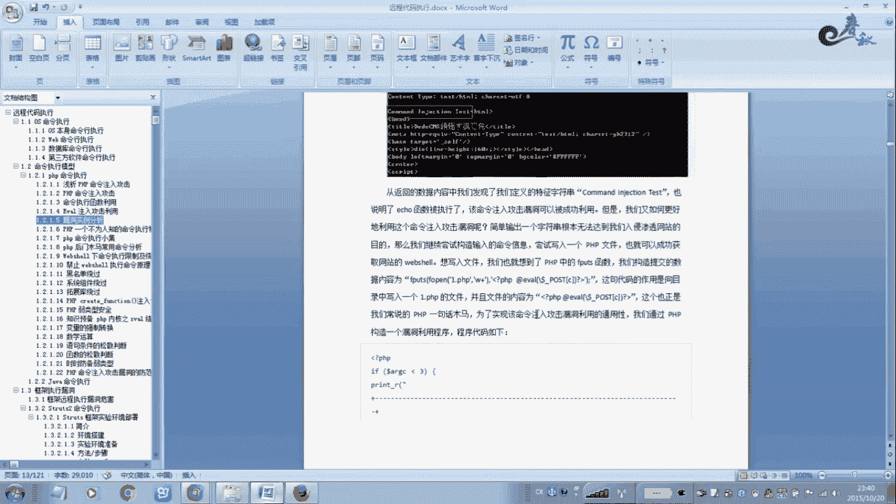

这个PSP代码就利用了这个。EXP啊，也发在。你也才到这里，我直接保存为PSP。啊，这因为在嗯攻击的时候要更击哪个的网站，你就说这只要是。嗯，5点5点几。DDCMS的。5。7的SPE啊。没有打补丁的。

那么多次会以成到这个的人。那么采用方法很简单，那么直接在这嗯把这个代码。你保存完之后啊。我给出的这部分代码把它保存完之后，嗯，你要根击哪个网站在这写一下路径，对应的路径写好。那么就可以攻击了。

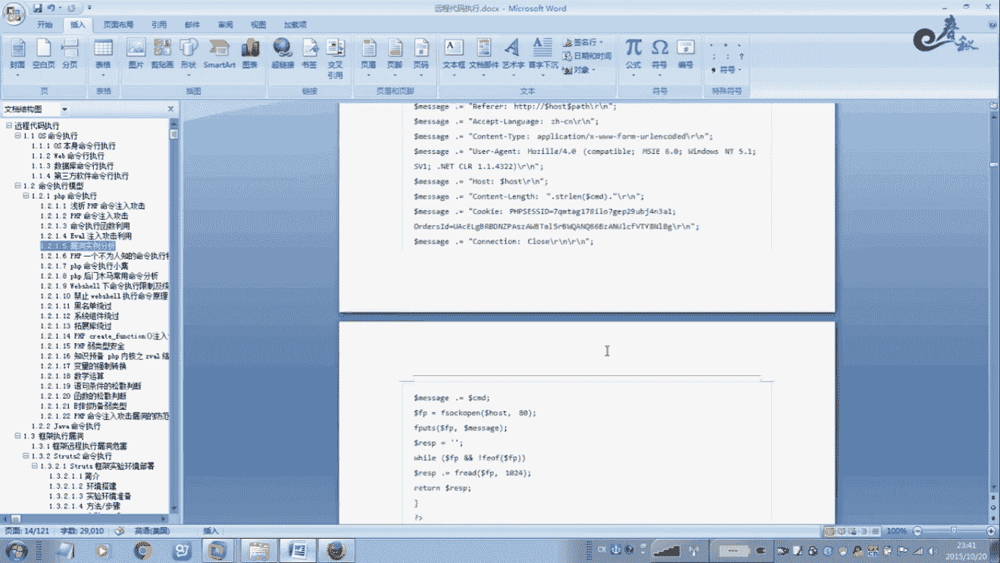

被给攻击了。那么你当在你本机的话，它它这个是是这么使用的PSP啊，DSDCMS57P点PSP对不对？是这种。你看。嗯，后面是接这个更接网站地址，这是路径。嗯，这样就可以了嗯这样就可以了，就可以攻击了啊。

就可以攻击了。那这样的话。

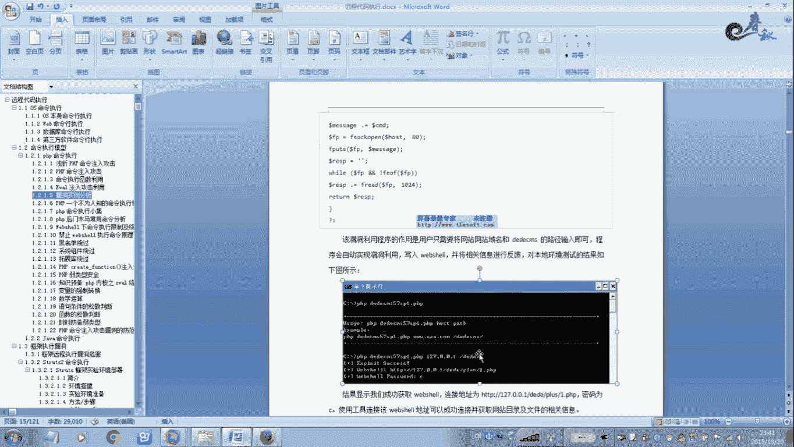

成功之后，那么直接把一句换码嗯插进去了。那有1个1点PSP面板为C啊，直接用插拉机连接就是了啊，你连接就是。

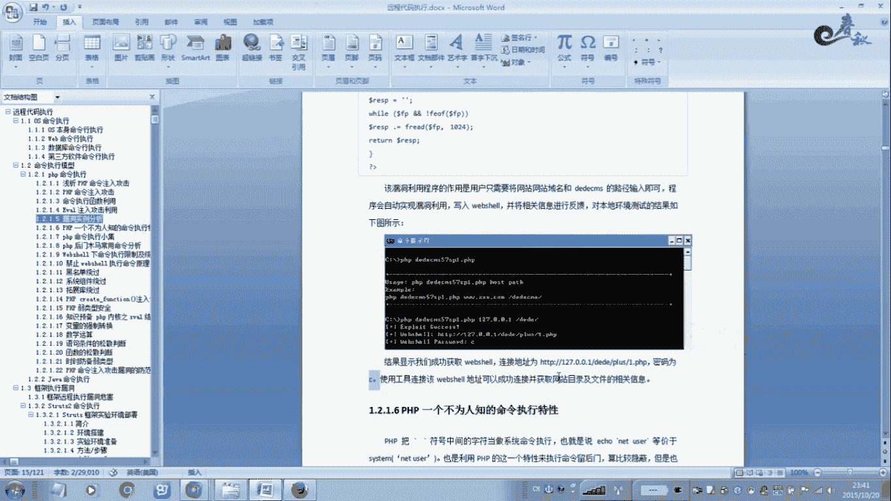

那就可以打到一个卫博士了。嗯，这个大家会当着一个作业吧，大家回去之后练习啊，这个命令命命临这个。

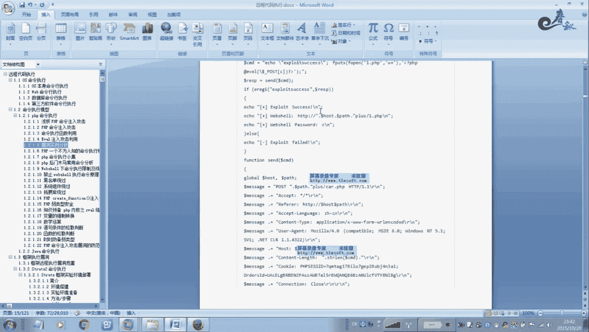

P时平米你自行。这是一个呃，当时刚出来的时候，好多网站遭殃啊，现在大部分网站都修过这个东西，但是有一小部分人用的这套程序还是没修啊，有没修的。

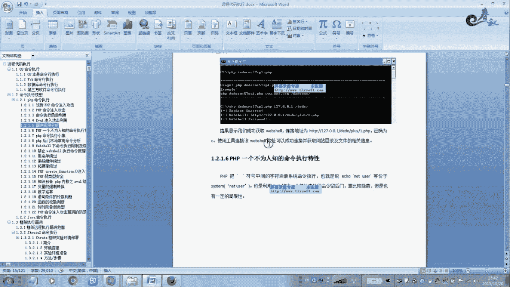

Yes。呃，抗命令执行的一个特性啊，就是不为人知的一个就是这个符号前面给大家讲过啊，在这里就不再讲解。嗯通过这种方式啊bl啊，看到没有？你看内存看清楚啊。他这里嗯通过一个什么？黑哥不理你。你这个。

来执行啊，这个你这个符号里面呢就当做这个命令，通过它来进行。执行命令就执行出来吧。通过这种方式方便吧，对不对？所以说命令执行这个PSP太灵活了，太强大了。只要你。他是变化万千的啊，不断的。变化。

比如说你要看你对PSHP的熟练程度啊，熟练程度。所以说有些安全软件啊要突破也是很简单的啊，只是一些你像万科，只是把目前市场上面的一些常见的一些工具里面用到的一些东西把它。拦截掉了。

但是你手工去嗯自己写一些东西，一般都是拦截不了的啊，拦截不了的。你了解它的原理之后。啊，下面是我搜集到的一些PSHP命令执行的一些。嗯，代码大家可以去看一下啊，你看各种这个。一些函数都写写都写在这里啊。

你看16年写的啊，整体的一些代码。在你下班吧，啊，你看是吧？SYCCM啊CMD各种都都写在这里，反正可以直接拉拉过去做用就是的啊。包括这个PSB后门木马常用的一些嗯命令分析啊。

一般像一句化木马执行系统命令，它一般用到最些啊用到这些。啊，干嘛这个执行啊和加密啊自用到这些文件包含和生成啊用到这些。啊，等等你看。嗯，这个我就不一一讲解了哈，大家可以自己你像一些加密啊。

怎么样去对这个代码进行隐藏加密啊，用这种形式啊，这个是一句话的啊，一句话我就呃隐藏进行嗯加密方式就变成这种了，这也是为了躲过这个杀毒软件跟wiuff的。嗯，还有这种形式，你看。Yeah。

这种形式这个是用的这个函数啊，这个函数来进行加密。那这个变化很大吧，对不对？这都是一些方法代表的一些技巧。这些都是可以用的哈，加外面也是可以用哈，不是说不能用。

那接着我们看一下微不需要的时命令执行这个限制logo方法。首先我们来看一下这个PSHP微博摄啊，这个是怎么样去执行这个。系统美女。他主要是搜索这个关键定位的一下代码嗯一下代码。听样。包括F的一些拦截。

它也是拦截这些拦截这些常见的嗯也是拦截这些。但是主要是按它这个是这张代码一思按，它是按顺序来进行执行啊，调用执行。首先看有没有嗯这个系统的stem拦截没有，如果没拦截，就直接这个。

用这个系统的sstem来进行执行命令啊，如果呢。那么后面就不会执行啊，他就直接用第一个了。如果第一个嗯不能用第二个，第二个不能用第三个，第三个不能用第四个，第四个不能用第五个。啊，总共5个啊。

就这样往下往下用啊，看有没有。但是他这个配个这个工具啊，它是都没有写全的啊，它有很多一些嗯之行这个系统命令的一些函数都没有写进去啊，写了部分啊，写了百分之八九十吧，还有10%靠你自己去挖掘的啊。

你自己挖掘的话，一般是可以茂过一些。嗯，这个。wi衣一些安全软件和杀毒软件的。你看这里有一个例子啊，就是说嗯很多一些管理员，嗯，包括安全软件，他直接是把这个禁一要想禁止这个微博需要这个执行命令的话。嗯。

像PSP里面它有1个PSP点NN就搭建阿巴奇的嗯PSP环境的。那么它有一个P嗯有一个文件叫配置文件叫PHBTINI在INI里面有一行这行dable fun fun。那么这个是就是它里面有这些还有这个。

那么这个他他就是说把它禁用了。那么嗯改成offer之后啊，就进禁用之后啊，进用之后你会发现，就是我们通过菜刀等等一些的一些软件，在维不需要执行命令来说是不能执行的啊。

因为它这因为它这个服务器这个PSP环架这个PSHB点开这个这一行，它禁止到这个值来执行这个系统内。但是我们要绕过的话啊，它有很多方法哈。然后首先你要知道原理，那么你知道原理之后啊，它进用了哪些。

那么你再烙过，那么很简单了。那么我们来看一看PSP里面它有哪些可以执行系统命义啊？系统命营。那么有这么多，它只。只进了默认只进了这么几个，那么这几个是远远不够的。我们可以用这些符号的，对不对？

还有很多的这么这些啊都可以来执行。那么我们自己写一个。哎，写一个上传，一个上传上去，那不这样的话，我们再执行，那不就绕过去了嘛，对不对？我也意讲的啊这个的嗯。可以给他的。引用一下公公员。

他就是说他自己写了一个，他就用到了这个啊。这个函数这个函数很少能用，所以说嗯它就可以执行系统命令啊，执行系统命令。因为它这个也遇到了很多人遇到的一些问题啊，在拉到微brashop之后，不能执行系统命令。

你可以看啊，他拉到微brashop用插刀连接，但是他发现。

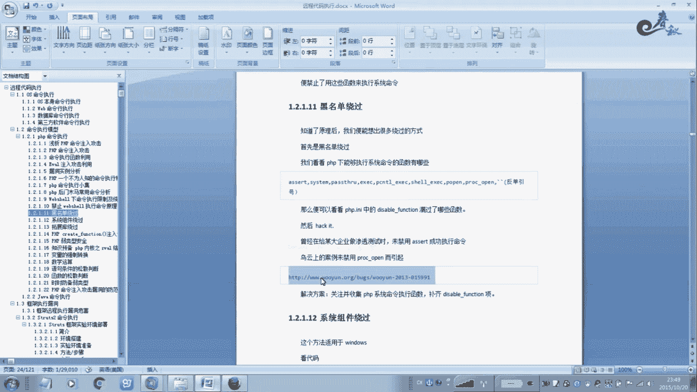

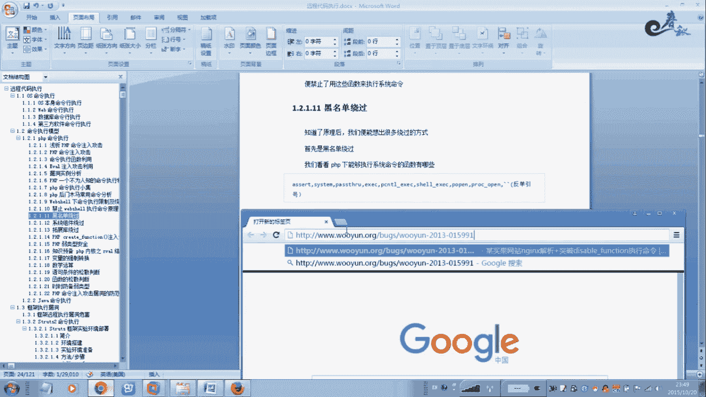

哎，这些被禁用了啊，这些被禁用了，禁用之后，他就没法执行系统命令。那后这也像我一样写1个PSP文件。那这个PS文件这个我这个更改就是做什么用的呢？你看他接到这个PSP文件，这PS更览就是利用了这个嗯。

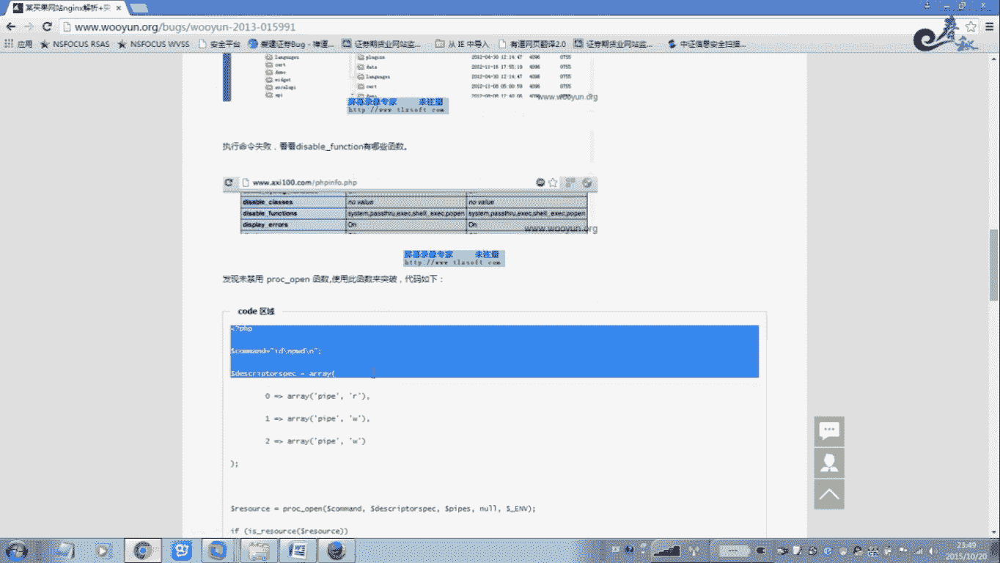

这个函数啊。他没利用了这个黑名单没有的函数来执行系统命令你看。啊，录册用户啊这个这些系统的是吧，个组啊，加ID啊对不对？UID好了，这样这样不就O了，拉过去了吗？

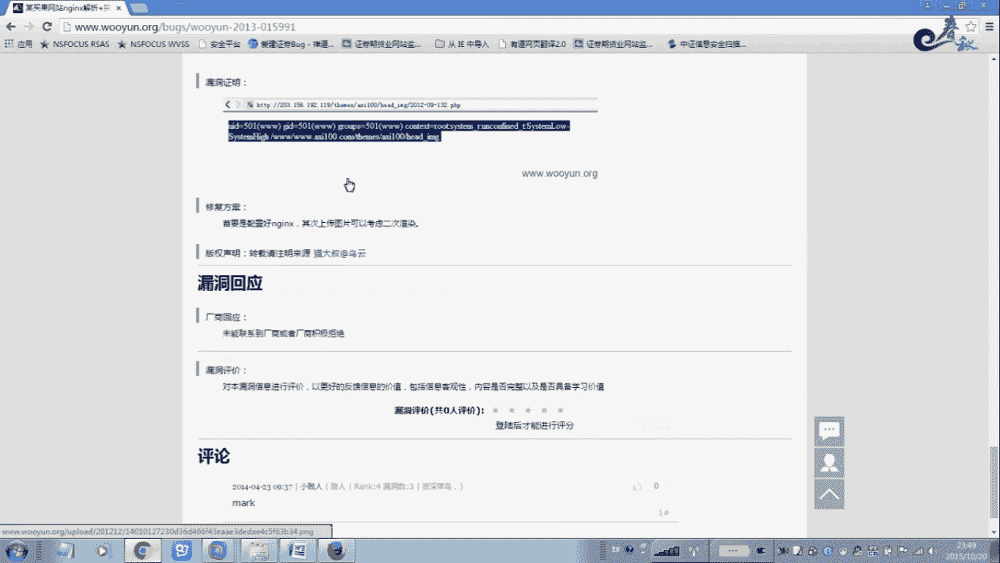

Yeah。啊，看一下系统组件的logo，组件logo嗯这个方法是否win的。把代码提出来了，大家可以看一下。那这个。这个东西嗯作用还是很很有用的。在提全过程中。嗯，对于做安全的朋友来讲。如果想。

实现那个。嗯。不想别让这个攻击者闹过。通过那个这个。组件，那么有些人把这个直接把它删掉啊，这个是比较安全的，但是大部分人都是没删的。因为系统默认它有这个文件，它一般目前不会删。我给来改名字了，多吃一些。

回去先澡去，你先等等。还有扩张裤那个啊扩张裤那个。这个我用的比较少。嗯，但是这个。我在这里也总结了提出来了啊，总结也提出来了啊，也有部分人在用。明能再用。就是来证据编译这个PSB扩张库里。嗯。

啊重新一个在网上下载之后，PSHP这个包之后啊啊进行解压，解压之后再进入这个目录，来进行生产美为1个DL的一个扩张股。他他是这么回事的。那这里大家自己看一下吧，这里讲解的话太多太多了。啊，你看。

还有这个嗯最后啊我这里还看给大家1个PSP这个425啊3一些调用方法都写了。嗯，通过这个文。好，接着我们看一下这个PSP里面呢啊g只能创建这个。创造一个匿名函数啊创着一个匿名函数来进行啊命令执行。

你看他的个心最你说这个比着批是不是灵活。你这全国经用呢，我也可以用这个行这个cate这个三格上来进行创建一个匿名样素啊。这样的话，如果你没有严格对参数的一个权利进行一个过滤的话。

供积者就可以各造这个退出的支付账传递给这个来执行任一运啊，所以说这个PSB大码这个。这个安全性也相当重要。你靠着万福的环检，你那天方夜谭，你道万福这个东西，它只虽是说对一些。出现过的一些函数来进行拦解。

但是我只通过一些创建方式的，没有的，你知道我创建什么方式？那我不就唠过了吗，对不对？绕不了踢床，执行命令嘛，这样那我就没办法了。所以说你从代码层啊。来进行严格顾虑，你跟不说你，我不允许你。

我不能我不使用这些命令执行的方式。或者我会我需要真真的要需要这个执行的时候，命令执行的时候要要在这个交互室显示出来的是。那么我需要在这个PHP代码里面做严格的限制写死，我只允许。你只是哪一个东西？

其他的统统拒绝，我摆民党得放子。用光名党的方式来给于实践。等一下后面我会给大家讲解一下这个PSP这个。D你呀这个DVW这个呃命令执行，他别的他是怎么做的，大家可以去借鉴接鉴到时。你看强奸的你看。

相万不错。水有个方法。嗯，大家自己认真看一下吧，这里我就不再一啰嗦了，还有这个PSHP漏信息安全，明白。还有这个其他类。变了了一个强制转换。嗯，是原号。松山判纳跟那个。我这个。啊，这个我们就讲到这里吧。

关于这个PSHP这个做落攻击这个漏洞防范跟DVW啊，下节课给他一起跟他家通读一下代码。再给大家把这个。讲解一下吧。

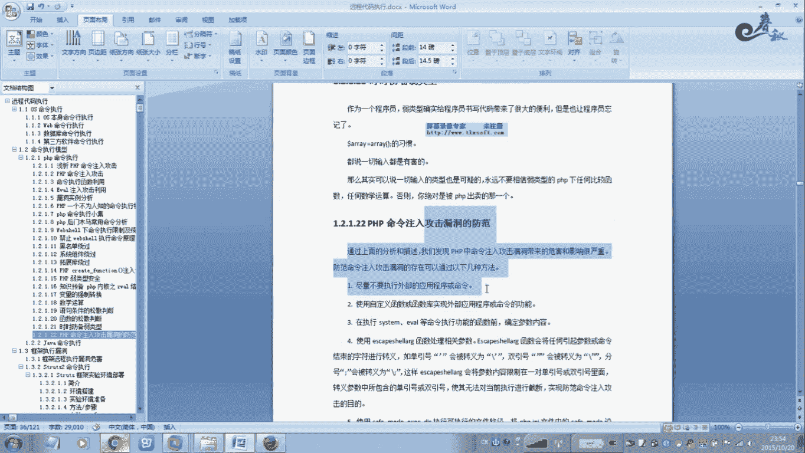