# 经典15年i春秋渗透测试系统化教程 - P41：课时5 Jobss远程命令执行视频 - 老网恋教父了 - BV1n54y1B7F7

喂，大家好，今天我们这节课给大家讲解一下Gboss这个命名执行这个内容。呃，关于Gboss这个内容执行呃，用扫描器呃，AWVS它都可以扫出来哈，就是这个内容。他也少数很多啊。

包包括最近出的这个反序列化那种啊，我在教程里面也讲起来，等一下在这节课，因为新的工具出来了啊，灵活运运用呃，这些工具怎么样去拉微博数啊，包括这个修复类的啊，怎么样去修。

那么在这里我们给大家今天这节课讲解一下。嗯，首先我们是搭建环境啊。嗯。这个环境我已经搭建好了啊，在这个inux环境里面啊已经搭建好了。啊，就是这个呃用亚m啊，首先安装这个抓文环境。

安装完之后去用Wble gate在inux下面去下载这个机box啊。下载完之后进行解压，解压之后进行啊，这个要不要无所谓哈。呃，解压之后就是直接直接进入这个目录。哎，不是对，解压完之后。

我们我我在这里用了1个MV，就是把它进行解压出来的啊，解压出来这改名了改名。把它全哦，这个MV是复制。直接相当于就是改名灰字啊，把这个解压出来的进行拷贝到了这个gebos这个目录啊，改。

并且命名为Gboss啊Gbos这个目录。在新增的一个用户啊，给到他一个权限啊，给他一个权限不权。再切换到这个用户啊，再进直接进入这个目录啊，有一个拉点SH杠B来进行00。0。0就是直接执行了啊。

执行这个接报的运行运行完之后就是来到这跟我这里一样。啊，因为这个下载安装需要一段时间，那么我把这个安装步骤就省了，大家回去之后自己安装一下啊，其实。好，下面我们给大家嗯来讲解一下啊。

这个漏洞怎么样去用啊，用到的一款工具叫这个工具。这个在网上自己去下载好Gbos这个GXML啊这个工具而名称叫HAHTMLADAPTOR漏洞利用工具啊。

是这个网站PRGPRG点CN这个网站出的一个一款工具。那么这个工具的运行原理其实跟其实相当于就是相当于一个漏口令。那么在这里其实有一篇文章啊讲解了。那么在这里我也给大家嗯。来到这个木给大家说一下。

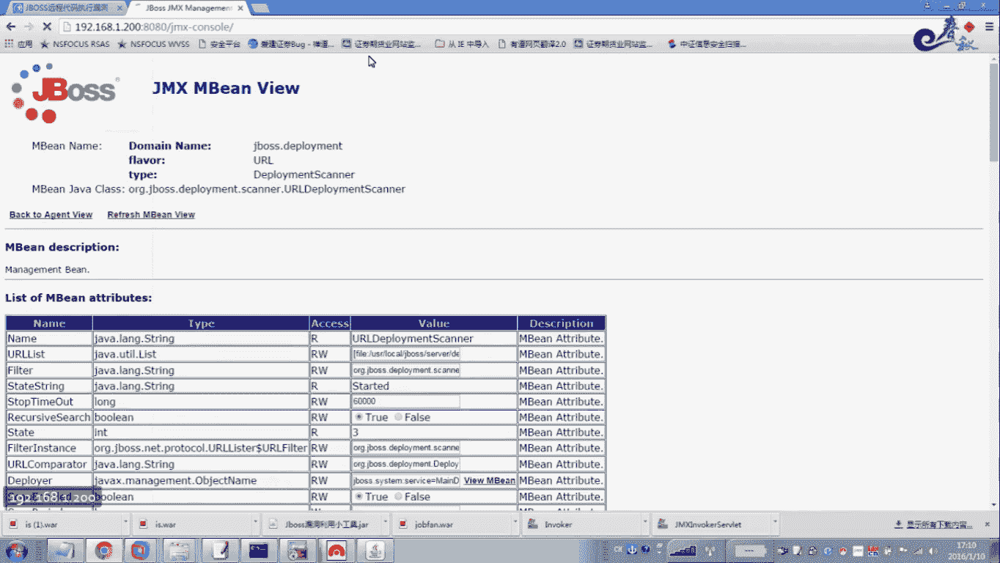

他其实是调用的是一个。这个木这个。这里进去之后，来到这里。啊，ADDURL在这个地方我们添加一个什么微博。那么这里我就是在windows系统下面搭建了一个文件。

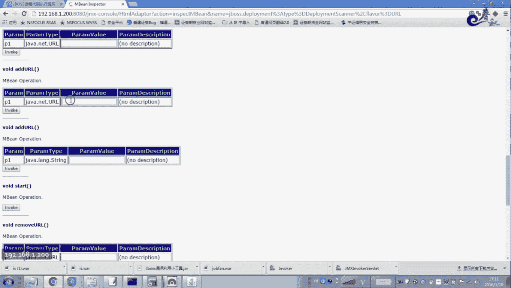

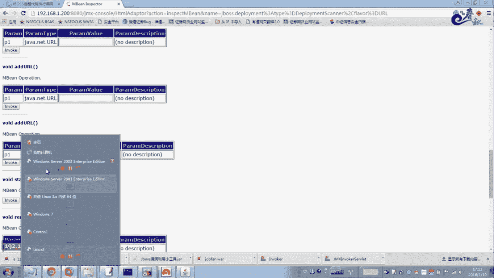

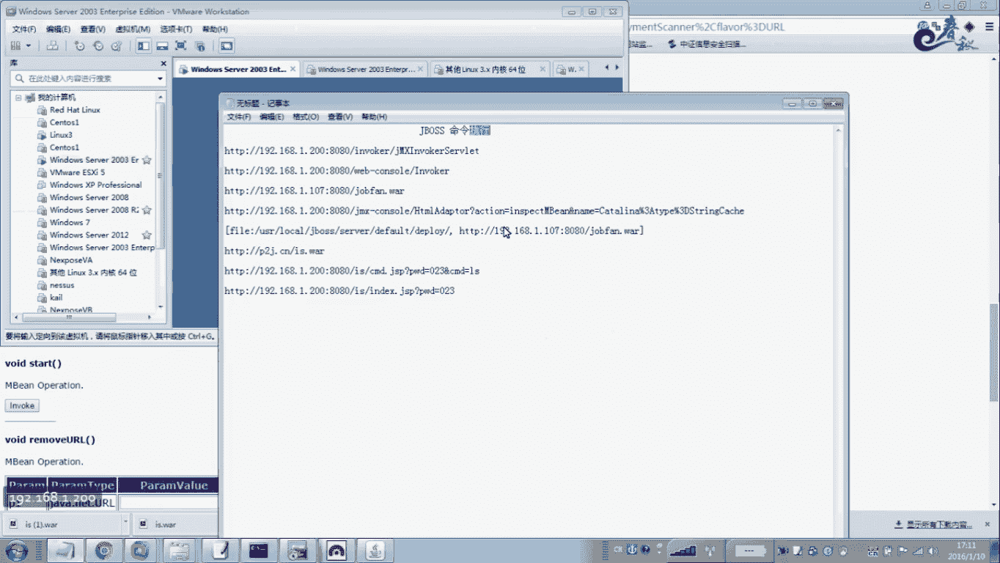

他部署的话要扩展米为WAR的哈，也就是说你必须要1个WAR。这个木马。那么这个木马我跟大家说一下哈。呃，这个码你在网上去下载都有啊，别人已经做好的。那过这里你看我这里啊。用用这个解压软件把它打开。

里面就是一些GS屏幕吧。

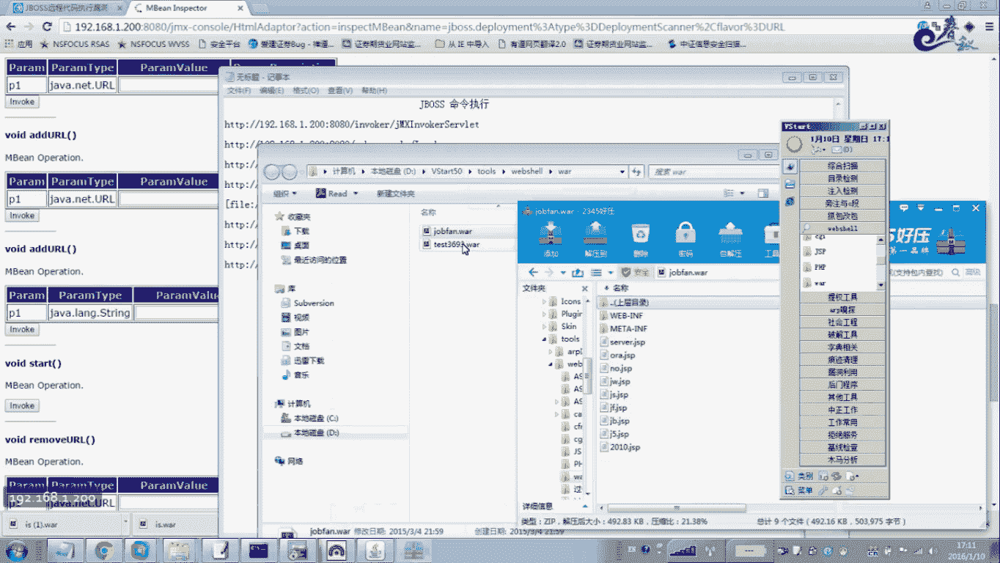

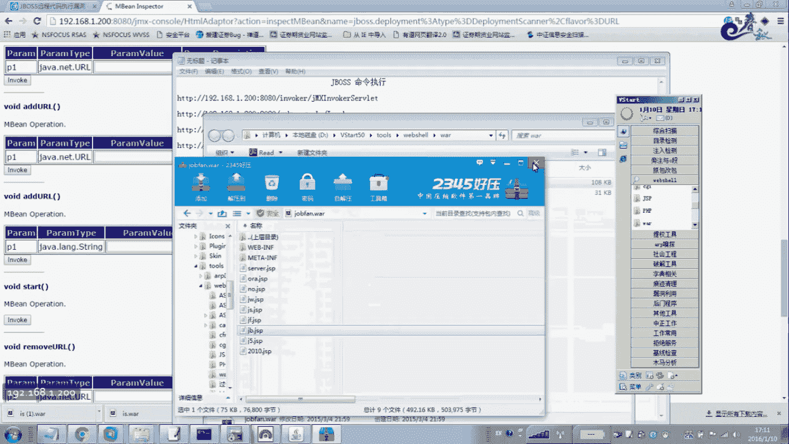

就说你首先你如果在本地模拟的话，你那么你在本地的话就直接先搭建一个这个。一个站点啊，用windowsinux都可以去搭建啊，就是说这个码WAR的这个码来下载啊，粘贴到这里啊，直接点击这个啊。

这样就可以的。

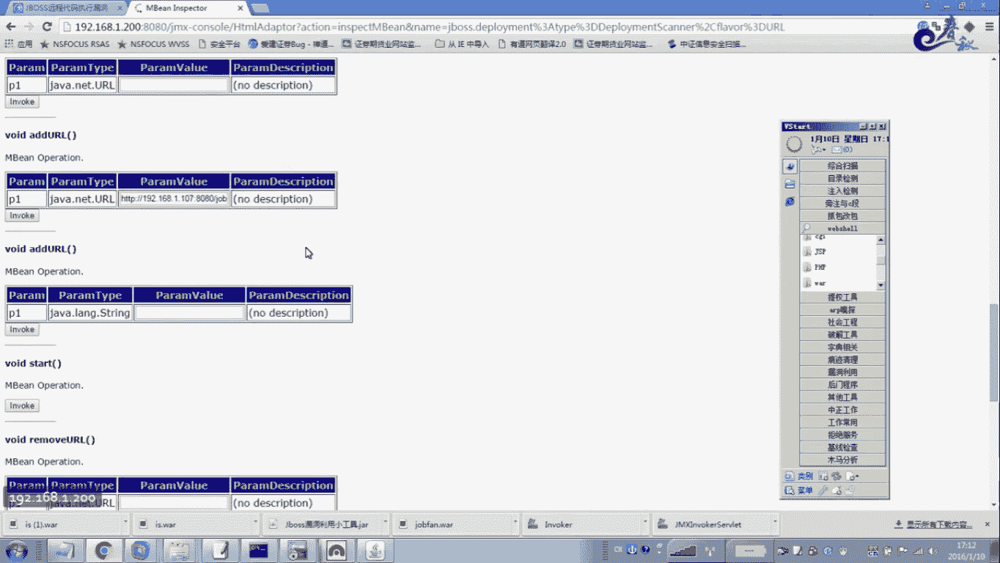

呃，我们这里的话就用工具吧，这个工具也是挺方便的啊，应该工具跟这个原理应该是差不多的哈。它这个也是叫命临执行。然后其实这种方法就是我刚才就是教大的一种方法，它也是可以拉微博射的。

但这个工具好像也是通过这种方法，但不一定。

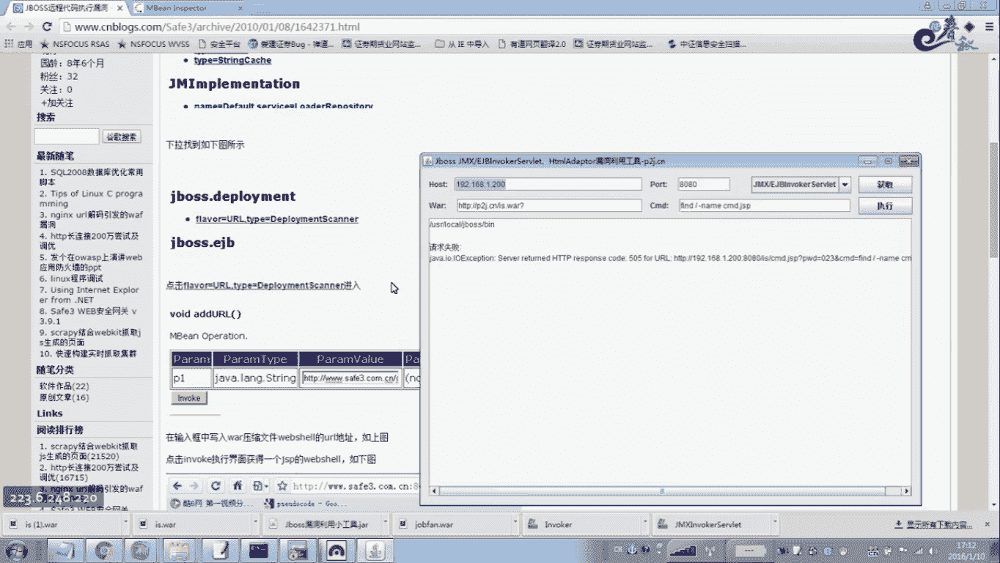

它的修复这个修复这个漏洞的办法啊，这里也说了，就是给这个加个密码啊，加一个。因为默兰只你安装耳机 boss，它是没有设置密码的，所以你要加上一个访问密码啊，这样的话它就可以啊进行。因为你加了一个密码。

你没法进到这个目录来进行部署啊，进行部署远程的这个文件到本地去。

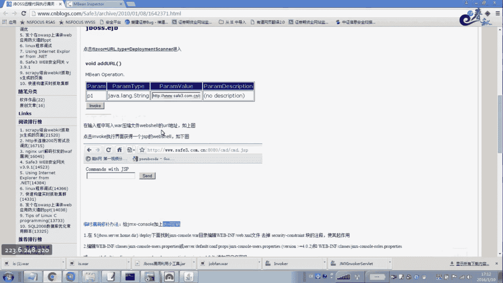

。好。

那么下面我们就给大家来直接演示吧哈，安装完之后，它默认端口是8080，好像就是8080端口。那么这个嗯我们就是说你直接说如果你是80端口，那么你就填80端口。如果你其他的端口，你就填其他的端口。

这个根据你自己，那么你在这里可以看的啊，我这里就是啊late start杠。杠ANT是吧，它这里端口啊，开启来是哪一个端口？哇。好，下面我们就在这里啊。首先我们那么这里的话这个工具它有一个网站哈。

调用的是这个网站。它这个工网站呢它已经部署好了啊，你看一下啊，它其实就是一个什么码，你看啊把这里下载了啊，已经下载，你看啊啊这里下载。

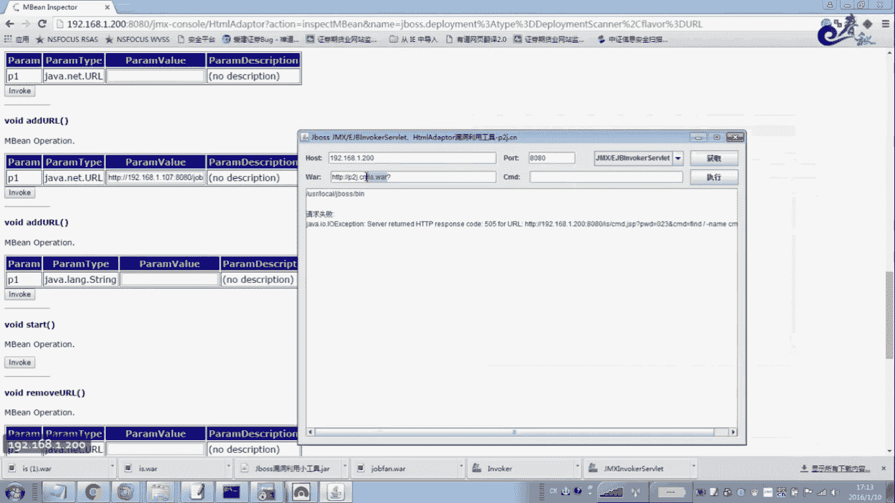

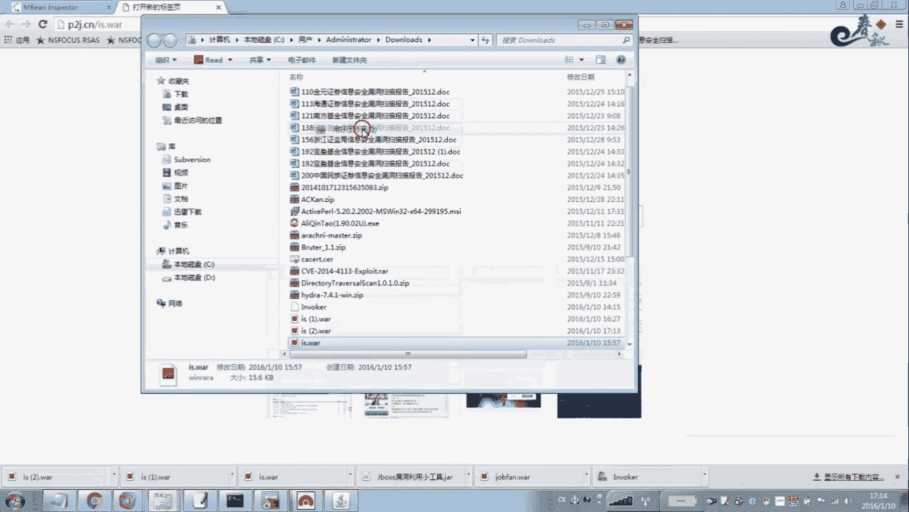

啊，这里有啊两光码，一个是英DX点GSP，一个是CMD点GSP好。

那么你要首先根据知道，知道它它这个调用的一个码，就是远程的一个码。你首先部署一个远程的木马。它这里既然这个网站已经部署好了的话，那么你就用它的网站上的码也行，反正做测试嘛，当然一般情况下。

建议不要用就用它们的码，一般有些码它留一些后码啊，是吧？根具留一些后码，那么我们知道它这个原理自己部署就行了。啊，我们在这个地方啊直接执行举个例子啊，我们现在获取一下是吧？

请求成功如果我要执行命令LS你看啊它就列出来了是吧？就在这里的执行命令，if了举个例子。你看。啊，191681。200其实就是对应的，就是我最低的。Yeah。啊，就是这个。就你那个的系统。那么这样的话。

那么你想做什么就做什么了吧，对吧？你建账号做其他的，因为这里就是命令执行嘛。好。那么下面他其实在地方啊，就是已经相当于那么我们举个例子哈。啊，那么他这个码是就你执行命临之后。

其实他这个马已经到了这个里面的码，就是说我们这个。

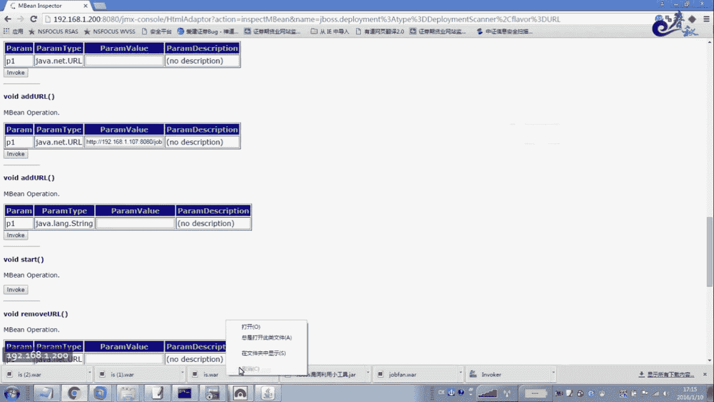

它这个码已经等于相当于直接你执行完之后，你一连接，它就直接等于相当于到了这个服务器上去了哈。不相信我们来查找一下哈，看一下。换的杠。嗯。Lve。啊，找一个他这个码就先找这个嘛啊。CM地点。

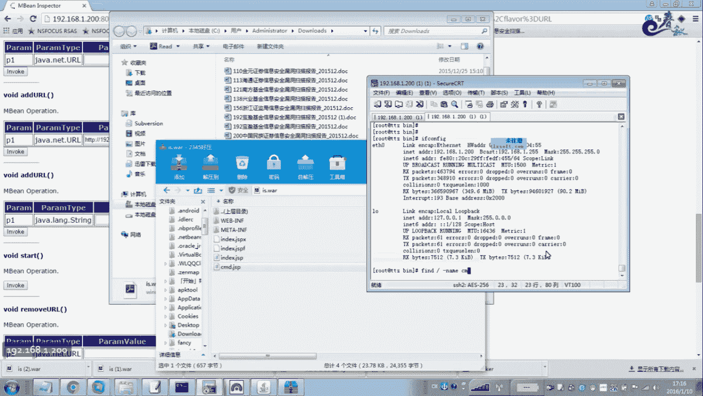

DSP。我们来看一下它这个嗯。服务器上我们执行完之后，就其其实它将相当于部署了一个，把这个包已经部署到了服务器上去了。你在这里。一操作他直接过去。我们来看有没有哈，它其实是有的啊，它有你看到没有？

它一个临时啊，自己创建了一个临时，你看是吧？啊，inDS点击SP的。他也有的。加有。那你可以在这里，你可以看一下效果。看里面的内容。あ。Oh。其实就是这个马里面的马马的没有。你看这个就是木马，对不对？

就是我们的码的内容023对不对？023在这里可以看得到，其实它这里也是023吧，对应的是吧？你看就是一模一样的好。呃，那么它是如果是我们在服务器上，现在我们知道它这个码，就是我们执行完之后啊。

在这里执行命令。其实我们这连接啊获取的时候，就只是把这个IS点WR啊，里面的码直接部署到了我们的服务器上去了。所以工具就这么方便了。我们这个如果手工的话太麻烦了啊，就是麻。

就是我们用工具就比较快快捷一些，比较快捷一些。好，下面我们就是嗯怎么去，就是说。如果我想拉微博shop，或者是这个嗯我们直接就是说连接这个通过菜刀连接，那么怎么去点啊，怎么去点好，我们在这里说一下啊。

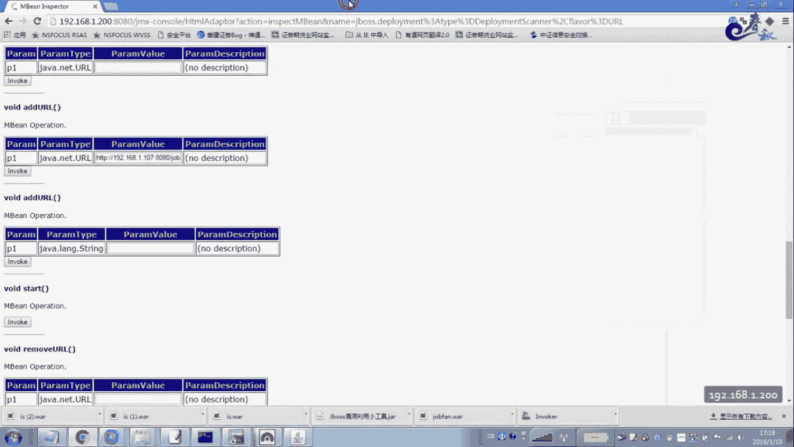

它是这么连接的这么连接的。它其实是这种连接方式，就是说你可以在这里可以看一下它这个地方。

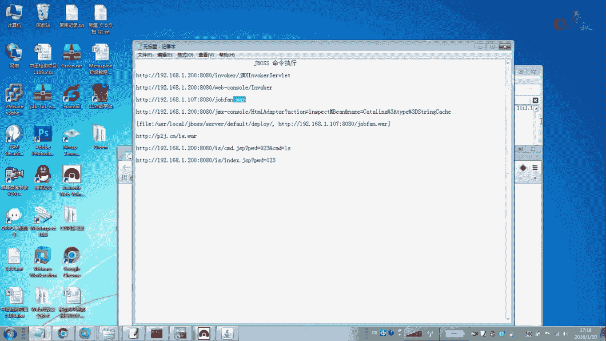

他加了1个IS目录，这个。呃，我们看一下，就是说我们随便输入一个命令啊，例如刚刚。让他报错吧啊，那个我们随便输个文件。好，他报错的话，你看他他这里告诉你一个连接方式，是这种连接方式。啊，这种连接方式。

好。那么我就用这个。你看啊呃他这个还有一个后面还有一件。它是怎么连接？好，这么连接的话，我们现在来来执行，我不用工具执行密。那这种即时命令也可以，你看是吧？PWD啊都是可以的啊，命令执行对不对？

没问题吧，对不对啊，你的衣服抗费了。啊啊，也是可以的，没任何问题这样也是可以。那么现在我换嗯换一个码，换一个inDX。就换了这个包里面的吗。

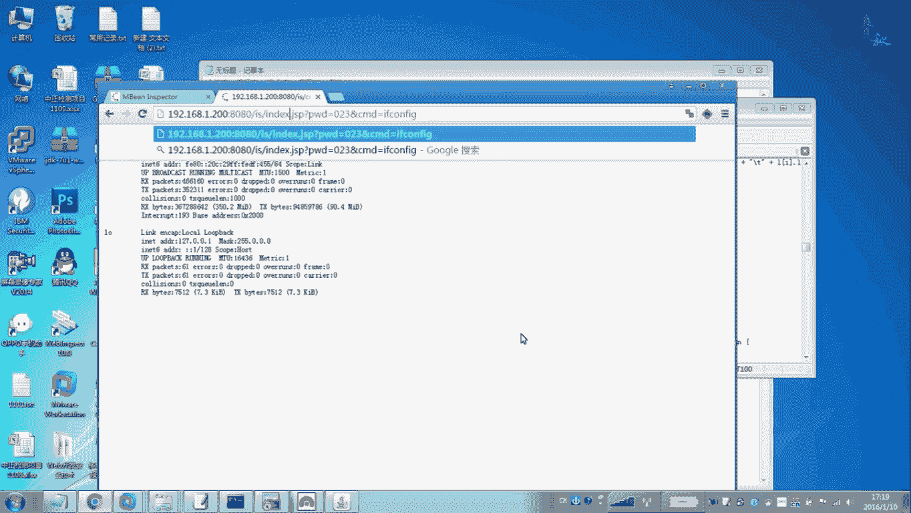

换一下这个。

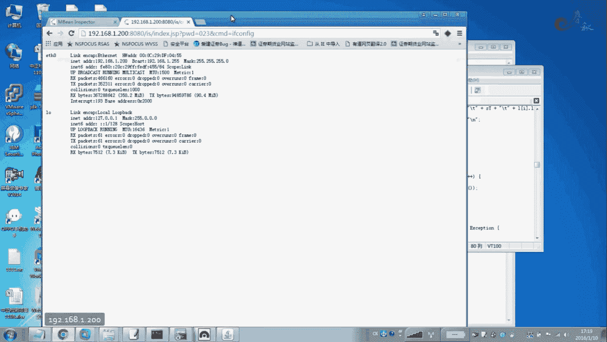

这里有个一句话嘛。是用菜刀直接连接的。嗯，这里有。

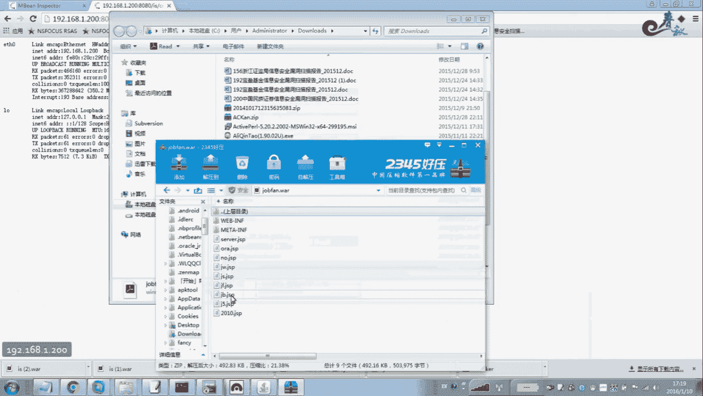

啊，不对不对不对，这个。呃，这里有个一句话的啊一句话的。好，那么我们就这个嗯。这个密码是023好，那么你看到这里就是okK的，执行成功。那么我们用菜刀连接一下。呃，这里我已经添加了啊，已经添加了。

添加我就这编辑吧，密码会0023。好，我们直接在这个地方啊点点击文件管理啊，就可以连接上去了，对不对？没问题吧。哦，你就动端管理，你就动端管理，对不对？来这里来执行都是没问题的，对不对啊。

没任没任何问题，对不对？

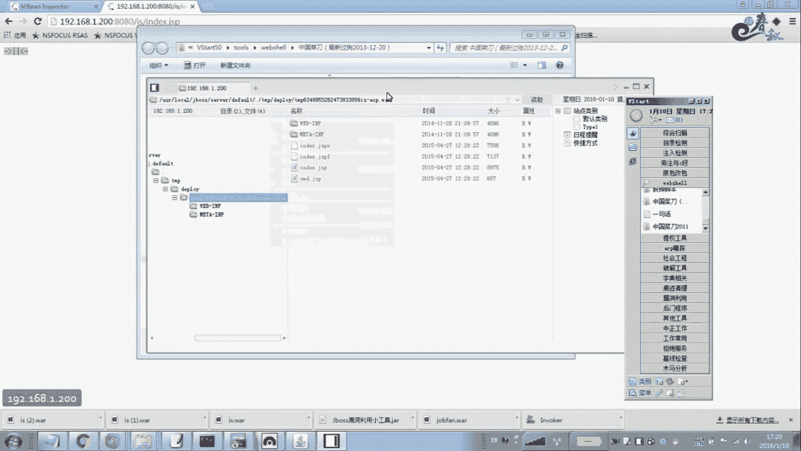

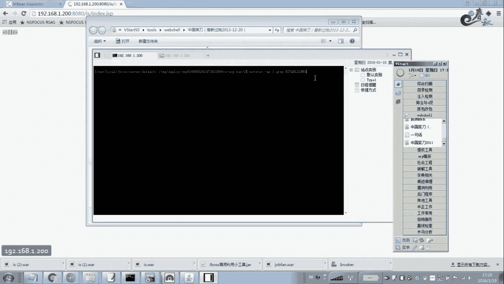

在这里执行命令，就是说这个的嗯它这个就是拉微波射小的方法，是这种方式啊是这种方式。那关于这种方法呢，我们就给大家讲到这里啊，讲到这里这个东西我就关了哈。

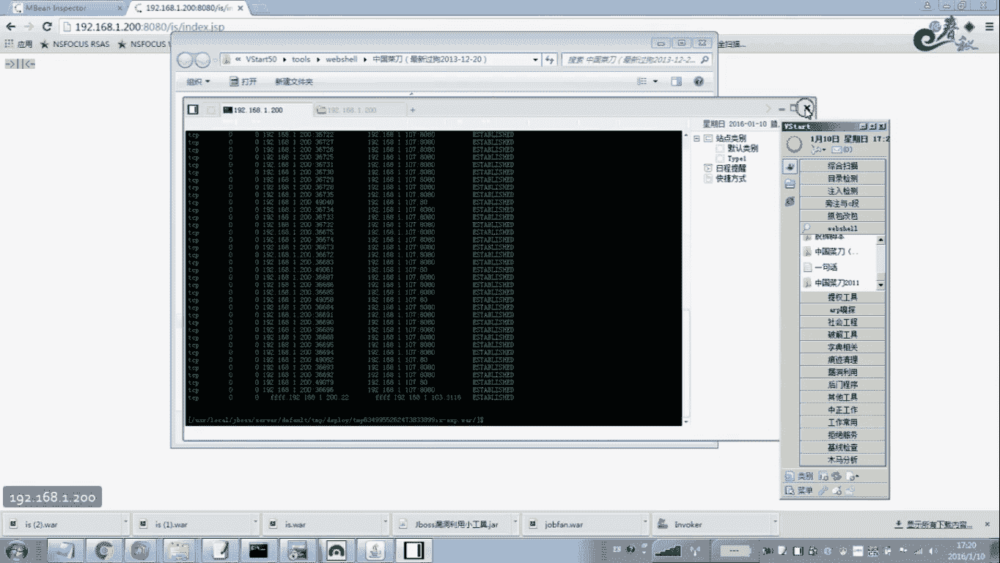

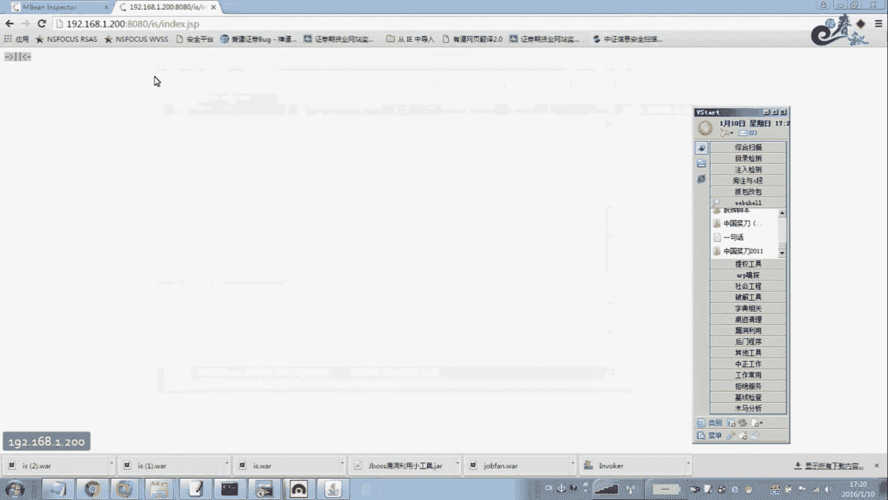

好，下面我们再给大家讲一下这个另外一个就是Gbos的一个嗯拉这个微波拉微波睡啊。但是这个环境我这个环境好像是不行的，好像有点问题。

呃，大家自己重新找一个就是说存载这个内洞的一个版本哈啊这个Gboss命令执器。其实我在深度测试过程中，这个内动是遇见比较多的啊一款内动就是在GBss里面。呃，这个内洞的利用啊工具啊，它用到的是。

一款这个工具就是说。啊，这个工具那么这个工具我们就是说直接你需要怎么呢，怎么去操作呢？嗯，这个地方就要改成你的。你来路径，其实这个文件我也存在，一般的情况下，建议大家把这个文件把它删掉啊。

杜绝这个漏洞的话。啊，就是这个路径。后面再接着获取内种，你响获取这个。操查看操作系统的这个名称，那么就这里执行好，这里出错了。嗯。哦，明白了明白了。前提环境一样脏一个照物环境哈。

因为我这里没有不存在这个漏洞啊不存在这个漏洞，所以这个方法就我教给大家。本来本来这个教程我已经做了啊，但是是用的用到的是网上的这呃别人企业的一个行列，一个用户的行列。但是这个教程不想不想公开啊，涉及到。

法律方面的一些东西，把直接执行啊撸嗯，在这个地方好像。

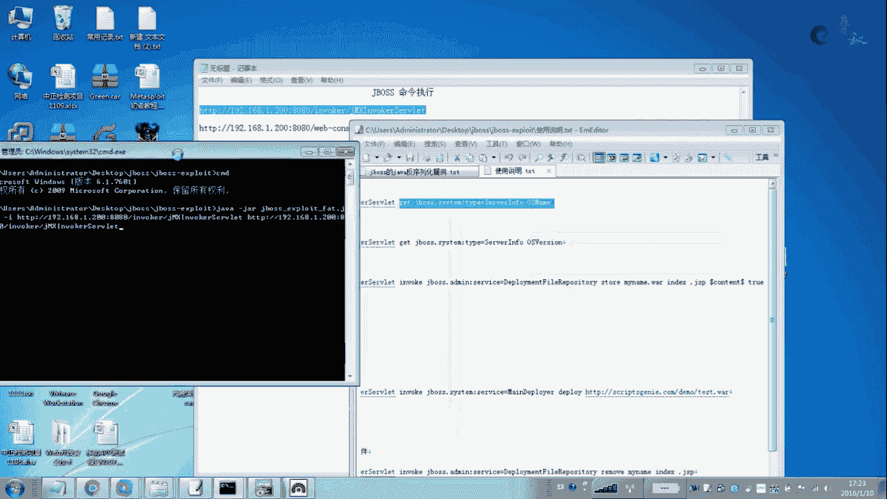

哦哦哦，明白了。Yeah。啊，如果存在的话，它就会执行出一个嗯显示操作系统出来。因为我这里不存在这个，所以所以它不会啊出现这个漏段。

就是说如果嗯就是说你只要把这个我这个地址换换成你的这一节的地址换成你的，还有这个don口号啊，这个don口号注意哈啊这里以前遇到的是10081啊，一般那种网站如果是80就80啊，8080。

你就8080根据前面的就是说你要测试的网站啊，测试的网站这个地方改就是的啊，包括远程如何去创建文件那微不是啊，这啊这里写的很清楚的哈，都写了都写了，当然包括远程部署啊。你才不说货，我也不睡了啊。

回去我也不睡了。删除文件。支持代理模式。支持这个什么用户名密维码带念证的方式在这里都有啊，都有。那么这个嗯大家好好去看一下，等要打包给大家，大家自己去认真学习学习。就是说这也是一种方法。

就是说但着前面条件下对方网站要存在这个漏洞，存在这个漏洞啊，如果不存在的话，你是不行的。呃，还有一个就是说Gboss漏洞，Gboss一个最新的一个反序列化漏洞。反序列化内容。

其实我们在这里实抓思去跟这个抓无反序列化这个漏洞演示已经演示过了哈。但是我们想给大家所说的是。嗯，所以说最近最新已经出来了。一款工具。嗯，就是这个。哎，对不对，这是welogs。

现在各类工具都已经出来了啊，就是网上就是关于反序列化的呀，有bos的呀，有这个weblock的阿宝奇的呀等等都已经出来了啊，它是怎么样去用的啊，我们在这里大家说一下。呃，大概的一个方式。

我我不知道这个这个行不行。我们看一下这个根据。好像你不接这个洞口行吗？这么慢？Okay。哦，已经okK的啊，没问题的，执行只是慢一些，稍微慢一些。这个是照我反序列化的。

就最新出来的一个零的啊一个最新的那种啊，现在大量的网站已经遭殃啊，包括这个block的。啊，它影响面很宽很宽。就是说你看啊就是你搭建个环境之后，你直接在这里能执行任何东西，包括写文件啊。

你这里写文件也是可以的啊，写写写这个啊，你把木码写上写进去也可以啊，这里也写写到根目录哈，直接写到根目录，就是说把。嗯，他在把这个上下上传去才功上去了。Yeah。你要上传成功，就是把这些贴上你的木马。

把那的木码贴进来，直接点击这个写入，这样的话就可以了。那么在这里我就不写不写了啊。大家自己写一下啊，这里就不重复写了。啊，那的。执些命令这个是就是最新出的工具哈。

就是比那个我们呃上一节课讲下一节课讲解到的这个在inex下面命令航模是对这个。就是另那个时叫编译的那些抓物抓物反序列化工具啊要好一些。这个是在windows下直接直接就是说能拉回不是要。

执行命令的一款工具比较方便哈，比较方便。嗯，好，那我关于今天我们这节课的演示，我们就给大家演示到这里。大家回去之后呢，自己搭建个环境，把一些Gbos的漏洞啊啊多进行采试测试。嗯。

关于Gboss其实也报了很多内洞哈，大家可以看一下Cbug上面Cbug有一关于Gboss的一些栏目，它里面有一些各类内洞啊，大家可以搭建个环境进行自我测试。

那么在今天我们这节课呢就给大家主要演示的啊命令执行啊，命令执行内洞。包括怎么样去修复修复的话，建议大家有些升级啊啊，包括啊临时解决方案，像尤其是这这这个文件啊。

该重命名的时候删除的时候就删除就不不会影响业务的情况下把它删掉啊删掉啊，这样的话就解决的一些命令执行，包括这个法序列化也是一样。因为这些文件啊，这个文件都可以把它进入啊。

一般来说可以解决这个命令执行的一些内容啊。关于这个该设置密码的时候，你一定要设置密码该打补丁的时候，你就升级补丁。

好，今天我们就讲到这里，大家有什么不懂的问题，到时候我们再进行讨论。