# 经典15年i春秋渗透测试系统化教程 - P44：课时2 php-multipartform-dos与Slow HTTP Denial - 老网恋教父了 - BV1n54y1B7F7

。我们这节课给大家把这个呃PSHP最新就出的一个倒士攻击类段啊，还有这个慢速攻击类段给大家演示一下。呃，关于这两个类段呃，也呃也是很多人在问到的一个问题，就是说不知道怎么去在做这个验证，就服务器啊。呃。

用这些扫描软件AWVS。还，包括一些绿蒙的一些设备啊，扫描的时候会扫出这些内容。但是大家注意哈，对于这些慢速工具啊，还是慢速攻击，还是这个PSP这个呃媒体。party呃part这个form这个内动啊。

这个倒时类动。呃，这个是百度发明的一个呃倒士攻击啊，针对PSP的这个呃。拒绝服务攻击漏洞。呃，这个漏洞是目前通杀所有的版本哈，通杀所有的版本。也就是说你的网站是PHP搭建的。

那么我就可以用这个漏洞攻击你啊，只要你没有升级啊，没有打不丁啊，最新的PHP那么我就可以让你的服务器瘫痪。呃，关于这个漏洞，婺源上面已经报露了啊，百度已经提交给婺源了。大家可以自己去看一下。

第二个是慢速攻击啊，慢速攻击这个内种呃，大量的服务器有啊，这个为什么呃到目前很多人还不知道呢？原因是国内的扫描器来讲，就是呃呃绿膜啊还是安痕呀。

还是APP看啊呃这个呃微博inP啊呃这些这些扫描器是扫不出这个慢速攻击类种的啊，很包括这个修复方案，网上也比较少。呃，包括呃我在进行这个渗透采试的时候。

就是说呃一些用户我用AW目前发现就是AWVS这款扫描器啊，针对这个慢速攻击这个漏洞。呃，扫描能力比较强啊，它能检测出来啊，包括这个这个来呢也应该也是可以检测出来的。反正这个一般的是嗯没问题的啊。

没任何问题的。就AWVS这个扫描器扫描出来的也叫这个啊慢速攻击。这个是毫无疑问的啊，经过我测试，那么大家的话呃自己去拉这个AWVS啊，去扫一下啊，对你的网站还是否存在这个慢速攻击那的啊。

或者是这个来的啊，如果存在，那么你就要及时修复啊，这个虽然拉不到你的服务器啊权限，但是它这个直接可以让你的网站一秒钟之内啊，就可以让你的网站瘫痪崩溃啊。呃，这一点大家就是说呃。对大家一个提醒吧。

为什么有很多人知道，哎呀这个是倒士攻击啊，D6S拒绝服务攻击，有大量的理量啊，路基啊，其实不是，其实别人就是一个。呃，两兆连的带宽加个人电脑。啊，一秒钟就把你的网上搞了。呃，所以说这个。嗯。

把这两个聊通的一个过程，我给大家嗯讲解一下。那么这里演示的话，我。啊，用到的一款工具叫做一个脚本啊。国外的一个脚板鞋。呃，这个首先我演示一下这个慢速跟击吧。这个慢速攻具就是这个。这个脚本好。

那么这个我已经下载下来了。呃，要用这个脚本，你首先装一下配呃，这个配上好啊，自己装一下。啊，我那我是刚开始是可以打开的。那么我们现在来进行一个攻击过程啊，一个攻击过程。呃，这个。加一个杠H。

那么你就可以看它的帮助说明。啊，帮助寿命。啊，他是这样去做。

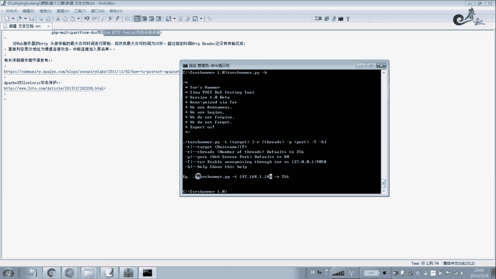

那么我这里的IP是110。

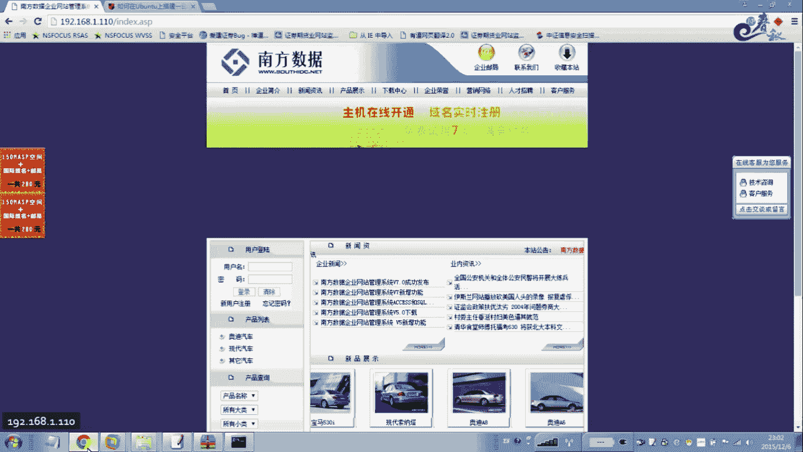

改一下IB地址啊，我们在这里不嗯他这个地方我们给大家说一下杠T。呃，共t就是说呃接目标的1个IP地址啊，你要攻记的啊，要根记哪哪哪一个域名或者这个哪1个IP地址。那么在这里填写ho name是域名啊。

或者是IP都可以，这个是线材啊，杠R256，你可以开到512或或者更大是吧？杠P是端口啊，默认我这里是80端口，那么嗯。我这里就不用填了，木认。如果你有单轨的话，那么你还要加一个参数啊。

加一个什么杠P参数。例如你8080啊，你就这样。就这样来进行测试。好，其他的也没什么多大作用啊。好，我们来更击彩试给看一下效果。好，现在正在攻击过程。好，现在我们再来看一下它这个地方能不能。

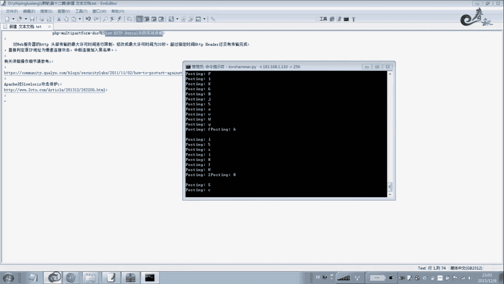

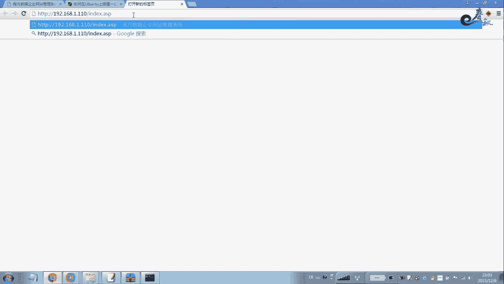

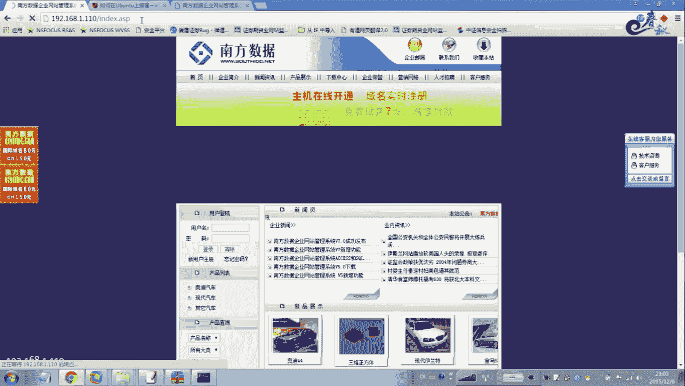

啊。大家可以看一下啊，现在是已经没气了。打不开了，大家看到啊，你看现在是打不开了哈，你看这里也是这里一个转转转，你看到没？在这一直转是吧？转了半天打不开啊。这就是慢速攻击啊。不管你怎么打，也是打不开的。

我上就一秒钟就死了。啊，一秒钟，现在我们暂停啊暂停。好，关于这个漏洞的一个修复啊，我在这里给大家说一下，就是说呃原理它是怎么回事的？

就是说对这个慢速工具就是对微博服务器的HTTV啊头部传输的最大许可时间进行了一个要进行一个限制啊，要进行限制。修改成最大许可时间为20秒，建议哈建议为20秒。啊，现在呢如果你装到万福一般都可以做的啊。

超过指定的时间，就HTV这个图还没有持续完成的话，那么我们就可以。直接判断有IP地址为慢速攻击啊，这样均档连接加入到黑名单。那么这就是一个防御方法。那么具体的一些怎么样去操作呢？

那么这里网上有很要有一些。

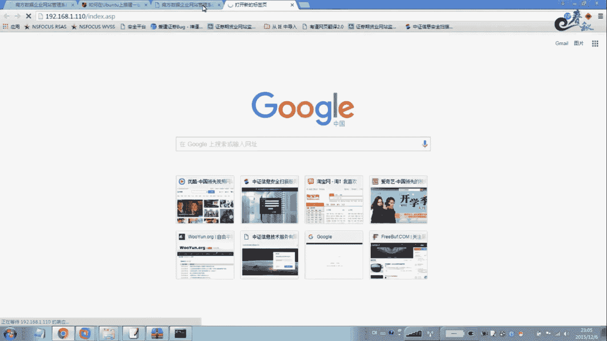

嗯，你看我这个已经打开了啊，这个我现在已经暂停了就打开了哈。

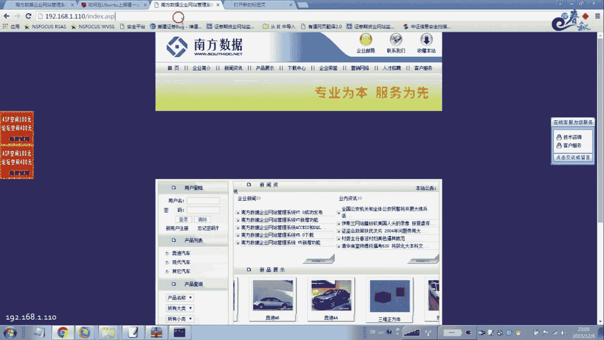

哎呀，不对。

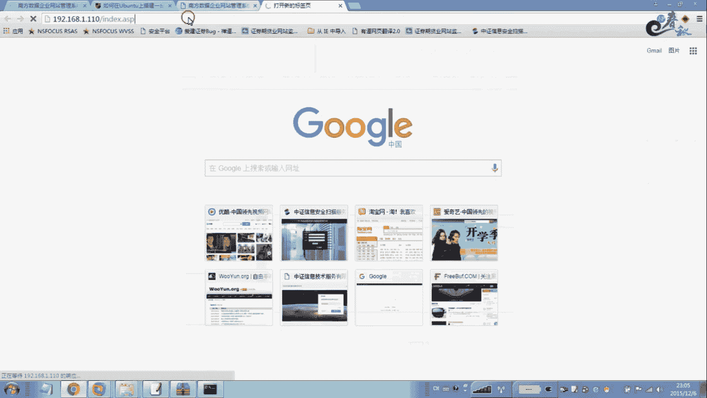

嗯，这暂停我还还打不开。攻击一下，怎么半天还没还没打开。

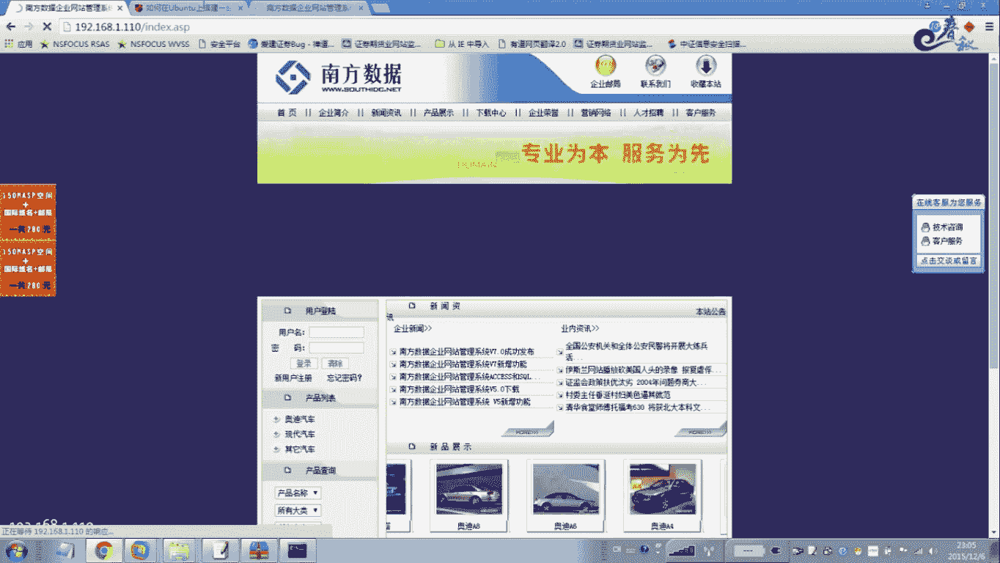

我没打开，我们就不管他了哈。好，我们这里看一下。这有关呃这个慢苏攻击的一个阿巴奇模块，怎么样去阻止？当然有军舰舰有很多哈呃阿巴奇啊、托姆卡斯啊，还有这个。我不老公啊。啊，等等。

所以每一个就是方法不一样啊，方法不一样。那么28起的话，你要阻止的话，那比较简单了，阿慢说根机直接。这个是在吴光区上面去。啊，我 on t版咩。你看啊用这个输对命令啊，进去之后改这个配置文件。啊。

只允许你看这里还设置了哈，只允许每个IP50个连接啊50个连接。嗯，这个是C彩。5色。这个是距离来自多大嗯1万个不同的IP地址的连接。活动7CP连接最大数量限制为25256。

这个当70%的CCECCBTCB连接被占用的时候，静止保持呃活动连接状态啊，是这么个这么做的，就你参照它来进行修改静值。改一下，那么就可以进行一个防御的这个呃这个慢速攻击啊，可以进行防御。啊，这个就是。

保持这个连接开启，不提出任何请求啊，就是拒绝。主三服务器的一个慢速的啊慢速的客户端啊慢速的客户端。他是这样。就是发发慢的啊，他这这是有些用户就是发送发送慢速的，就是一个。呃。连接。来阻塞我们这个服务器。

它是这样的一个过程，我我们就在这里来进行一个限制啊，来进行一个限制。

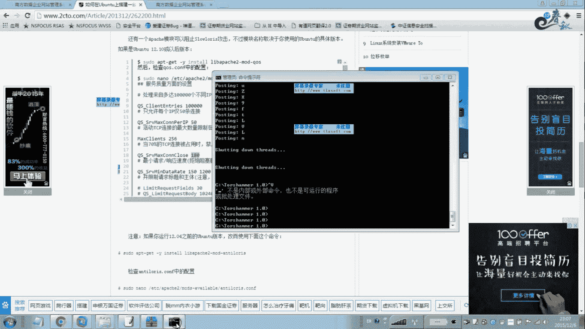

现在一般在这个呃防火墙啊这个wi里面去设置的。来进行拦截啊这个慢速攻箭。啊，尤其有一些就是嗯使用微波loc的啊中间件的去搭建网站的。他这个修补方法的找都都没找到啊，系往后有。

但是你改了之后还是存在慢速攻击。很多站点就是说针对这个漏洞也是头动的啊，所以大家用R87tomo cut还是比较方便一点。它提供的这个方法，一般的是都可以。拦截的啊都可以拦截这种攻击。好。

第二个类洞是我们这个PHP这个啊到次攻击。那么这个呢呢我在我录了一个教程哈呃这个教程呢等一下我把这个录像嗯放一下，给大家可以看一下。可以给大家看一下。大家看一下最新的这个嗯。呃。

PSP这个道士攻击这个内灯啊，百度研发啊研究出来的一款内灯啊，已经在婺远上面嗯报告了。那么呃看一下我的一个演示过程吧。呃这个录像我前段时间已经因为录制给公司其他的人一个演示，所以针对录录像了一下啊。

在本地搭建了一个环境啊，针对PSP这个东西。这个是百度百度发明的一个内容。研制出来的一个。呃，上报到物源上面。嗯，这个你在百度一搜呃，刚出来没多久。那就这个攻击倒此攻击，它针的专门针对PSHP呃。

通杀PHP所有版本，只要是PHP的都可以通杀。

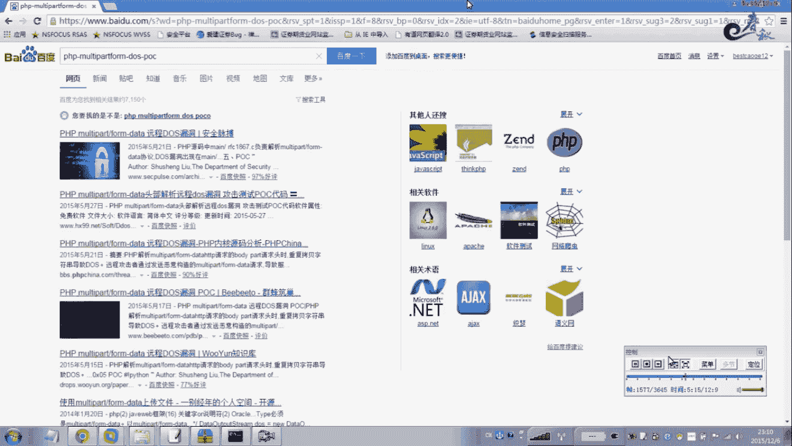

呃，这里我就在寻拟机一下是吧？呃，为了效果，我我就不找网账了。嗯，这个是106，我主机我主机是搭进那个阿巴奇啊。

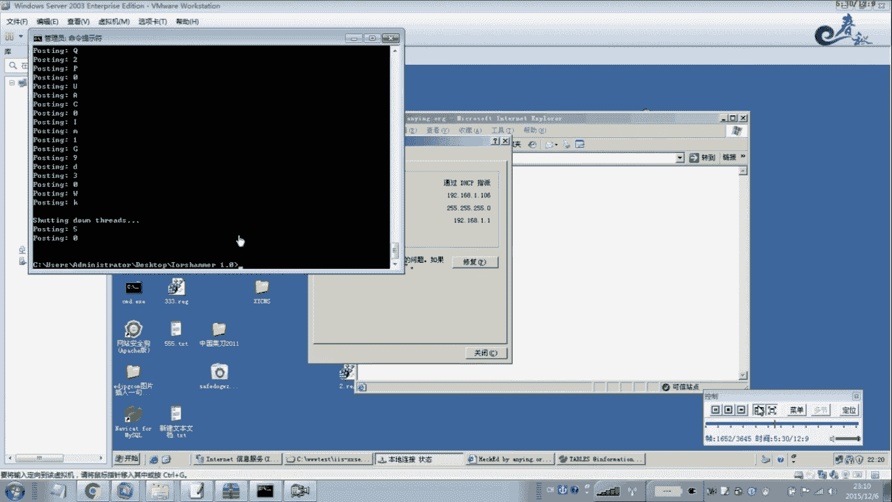

打电话话八零八零。那个你看一下这个。记住是PSP的通杀啊，通杀PSP。主要是没有升级补丁，就没打最新的补丁。因为刚出来没多久嘛。我这个地方是1D6，我试一下，拼一下IIP地址192。点168。1。

106。好，OK联通是吧。然这里就行了。攻击吧，开始。返回到根目录。这个叫的PSP。哎，我看一下他他这个使用过程。

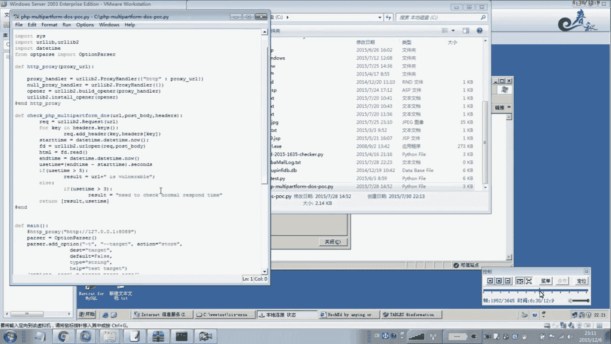

这没办法。后面接IP地址。168。1。106。我们试一下啊。嗯，要不要当腿啊？我们先不用当腿。打开精彩。

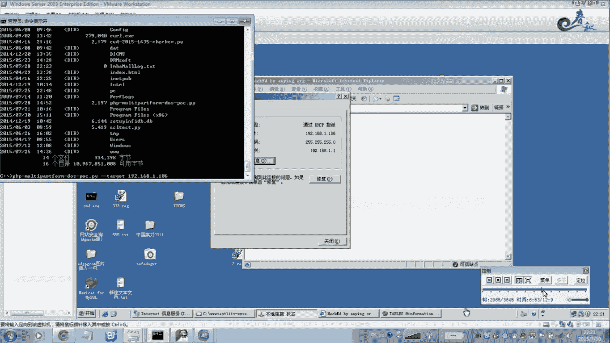

佢跟登佢有关系未有。我，上次垂出的，因为刚出来这个内存刚出来的时候，拆出来一下，效果特别明显。所以没有。对这个结本没有仔细研究。哎，不对。喺上面有个洞。嗯这个地方。IP地址搞错了。等等一下。

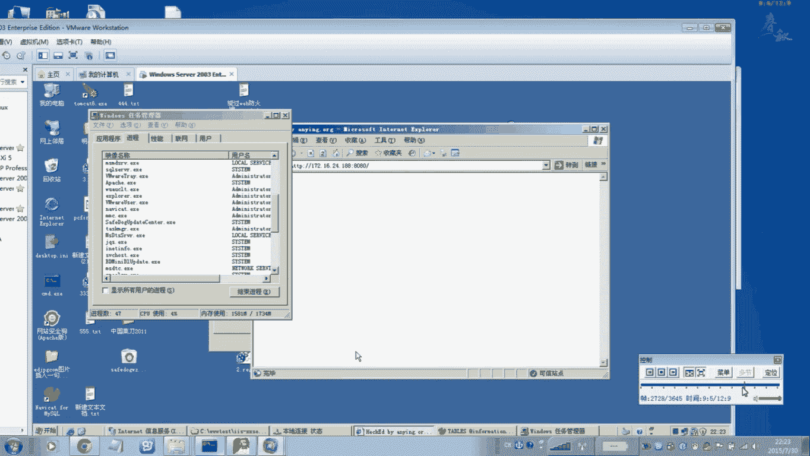

搞什么？だかでリす。我说怎么回事啊，怎么接收不到数据报是吧？192点168点。现在是0%是吧，2%。看效果啊。所个这个地方。哎，我这个IP电又没复制过了。哎，终于复制过来。等一下吧，等等这个。

背中か看这。带着看。大家看一下这里的效果哈，它这个脚本的一个攻击很简单，就是一个tger啊，刚刚tt后面接这个呃要攻击的1个IP地址啊，要就是你彩色的站点，后面接上你这个站点的一个单口号。

因为我这里是8080。如果你是默认的是80端口，那么你这里就不用写端口都可以。啊，如果有端口号，你写上端口号啊，这样进行攻击。这样的话可以看一下效果，CPU直接达到百分之百。啊，看一下。嗯。

我再打开网站看一下。你看这个特别明显，风可一关看页面打开CPA就下来了，你看。但。在房间。一下就死，你看晚上CPU是百分之百。当我当我这里不攻击的时候，那么他这里就是CPU使用率1%2%啊或者百0。

哎呀，一公斤它就百分之百啊，效果特别明显。

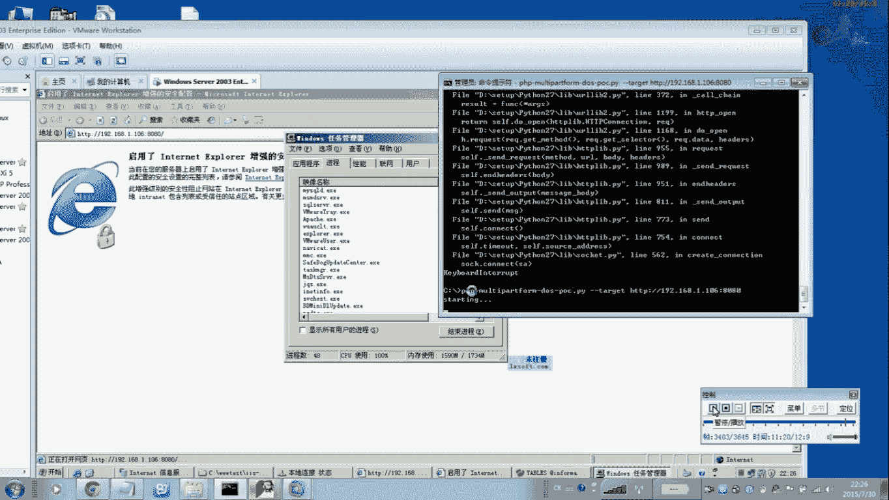

呃，关于他的详细呃这个修补方法。啊，修布方法就是大家嗯升级这个。对这个升级一下啊，就是说大家在百度啊在百度里面一搜，就把这个。放在百度里面一搜就出来了。很多呃升级一下PSP啊就行了。好，关于这点。

我们就给大家演示到这里。

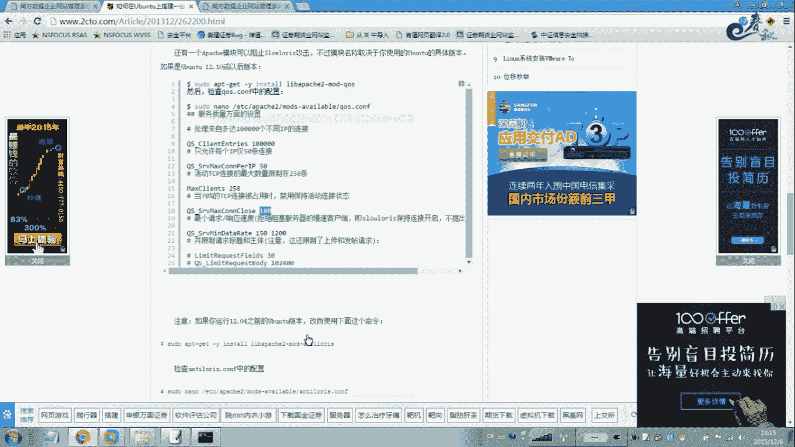

回去之后，大家去自己练习一下。

