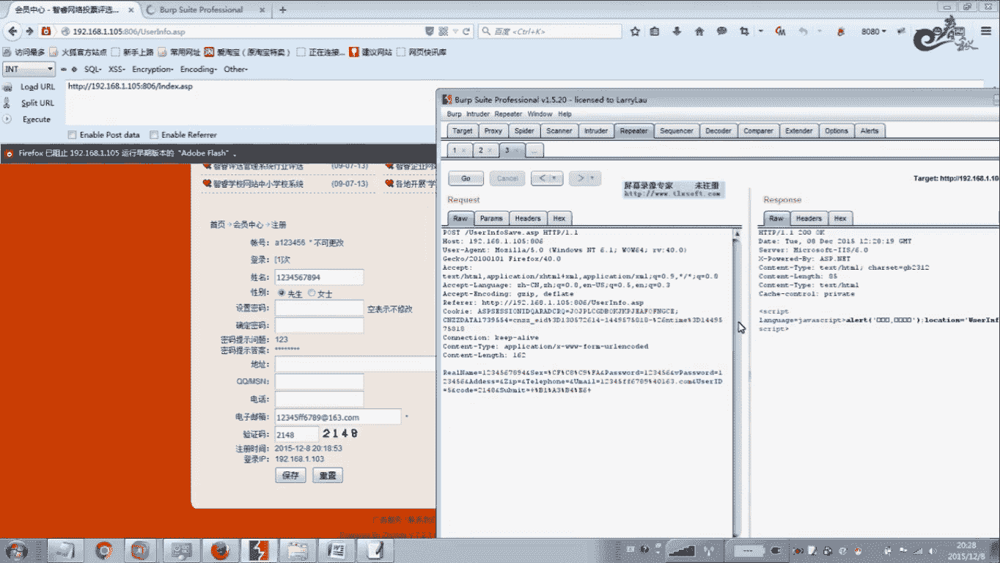
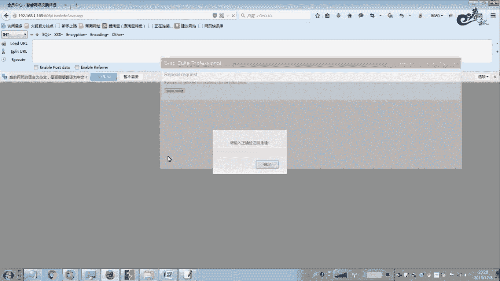
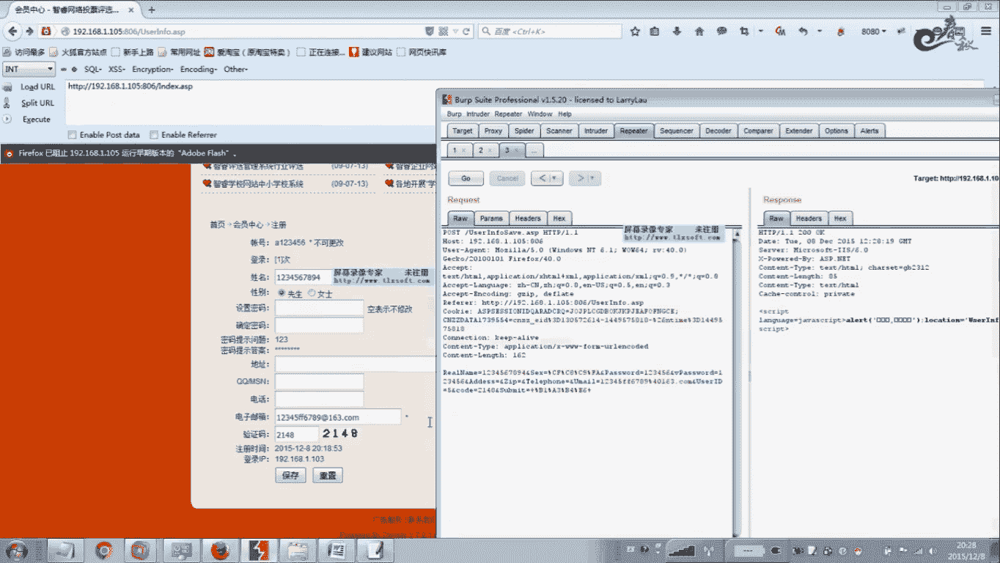
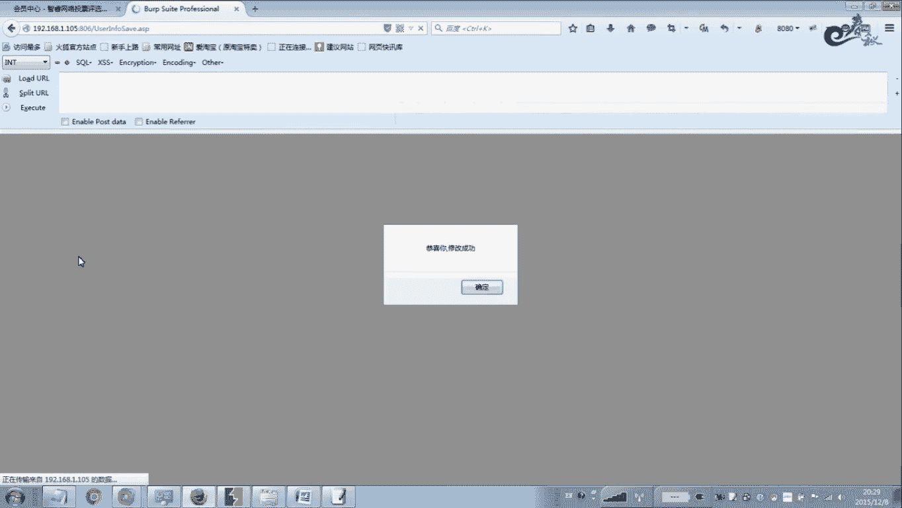
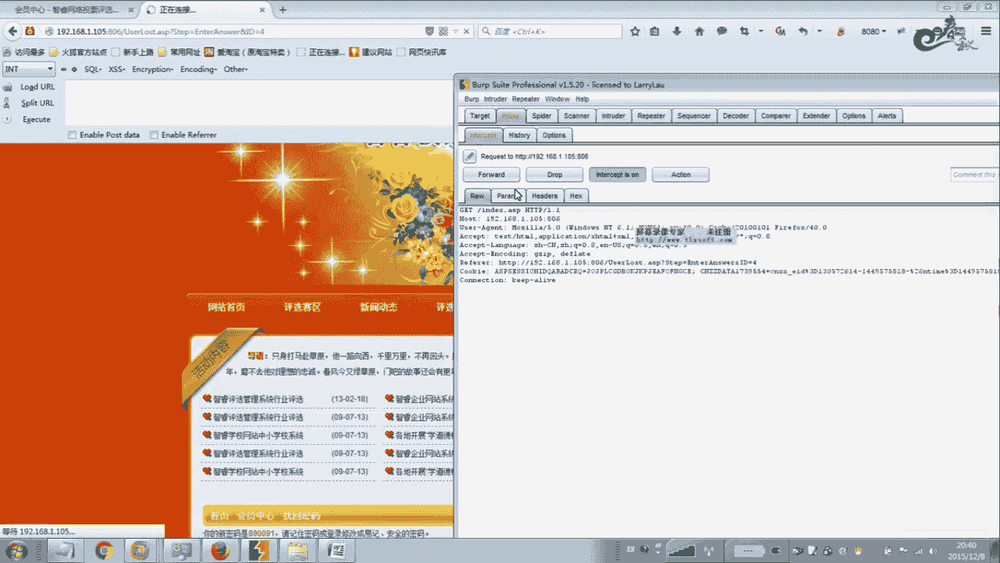
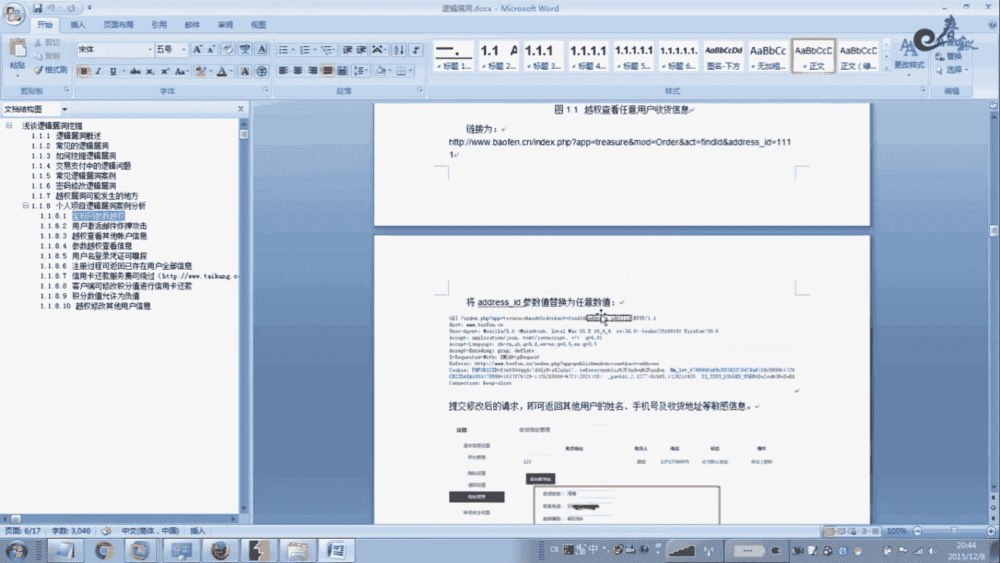

# 经典15年i春秋渗透测试系统化教程 - P46：课时4 逻辑、越权漏洞挖掘（中） - 老网恋教父了 - BV1n54y1B7F7

好，下面我们给大家演示一下呃，怎么去找逻辑楼上的一些方法技巧。那么在这里呃这里不一定这个等一下演示大概是个越权的一样的那种。但是方法嗯。我们给大家教大家一些方法。一般的我们在一些忘记了密码啊。

登录的地方注册的地方，我们找一些看有没有逻辑漏种，包括越权操作啊，越权。好，我们首先呢注册用户啊注册用户。那么这里有一些注册用户的方啊这个地方，那么这个地方也有注册一些方面的一些漏洞。

那么在大家可以看到网上有很多一些啊你要登注一些网站，要注册账号是吧？这个账号我们可以批量注册啊，发垃圾广告。帮我批量发帖。那么再怎么样去做一这局再怎么去做呢？我们这样做。那这个地方呃嗯这没有手机包吗？

哦。我们是个代理。呃，举个例子哈，based。一。呃，院后面也被收益吧。嗯，密码123456。你来123456。呃，123随便。嗯，456。嗯。邮箱随便填写。0566。

那么他这个地方主要为什么能恶意注册？因因为他这个验证码这个地方有问题，这个验证码呃问题出现在哪里？就是说大家可以看一下我们验证码的这一章节，它这个地方就是说。呃，建立连接之后。

就是说服务端没有及时这个销毁这个验证码啊，没有及时销毁这个验证码，造成的就是恶意注测。包括这些地方的判荡，例如密码，这个呃随便输入啊随便输入，也就是说没有进行一个。呃。

他这个安全性的碰的力度必须要大于8位啊，数字加字母加特殊符号。包括它的一个聚册的一个限制。就是说例如你1个IP地址，你注册一个账号之后啊，1个间隔多长时间？才允许注册啊。那么他这些都没有做限制。

那么这个时候我们可以进行一个拦截。拦节来进行修改数据包。其实我们注意啊找逻辑漏洞，就是我们在这些参数这个地方，这些参数啊每一个参数都有可能存在一些逻辑漏洞。那么这里的话因为。呃。

我这个例子跟这个这一节课的这个逻辑类动。有一点不沾边际啊，其先我们一般的就要找交易网站，因为我没有找到这个好的这个程序给大家来进行演示。但是后面呢我有很多案例，就是个人在项目上的一些案例。

做过的一些项目案例，给大家进行分享。这些案例你是在微远上面找不到的，都是一些个人做项目的时候，一些案例，就发现的一些楼辑类的。等一下会等一下会单独给大家进行讲解。但是这些案例呢也不好，嗯。

都是一些用户的。呃，信息啊就是说用户的一些网站也不好给大家，就是说拿对方的网站给大家演示。所以在这里呢。我们随便就是找了一套程序给大家大概就是说说一下啊，说一下这种情况。那么大家可以看一下哈。

其实我们把它。就说找楼梯的时候就改这些餐迁所。看改一个参数，尤其是在金额方面啊金额方面。就是说我们在这个举个例子，我们如果在接呃在交易的时候。呃，交100块钱，我们改成-100，看能不能进行提交成功。

发送到inc，我们来进行。首先模拟一个呃经常大家提到的一个问题，就是说呃怎么样去批量批量注册账号啊，就是这么注册。首先我们把这个清除所有的变量。用过米这个地方我们给它设置一个变量。啊，这个地方我们是。

诶。名称也给他设置一个吧。密码我们就保持不变。问题报左边，又想给他设置一个。我大概涉置三个遍。嗯，在这里我们就显显得交急吧，这样注册账号多一点。好，这里有3个啊，我们设置分别设置一下字典。

那么这里的话嗯。我们随便拿一件账号吧。第一个变量第二个变量名称我们就。呃，也用这个吧，不用付的。呃，第三个我们也试一下。第三个的话我们。我家邮箱。15163随便填写哈。啊这样用一个赛这个。

这个连接符号去在excel里面去。就是批量在后后后面去加这个。后缀啊，这里的话因为呃这个比较少，我那么在记色板里面手动加一下算了。那么其他的呢，我们就没必要睡了。好，下面我们来。试一下。啊。

我们呃这里有很多啊已经成功的哈。呃，看来具体了一大片。嗯，看哪一个是成功量，这两个数据包不一样的，有有341的是吧？嗯，随便找一个吧。啊，123456A。我们暂停好。不跑了。把这个地方来，我们。

丢弃掉数据报。呃，放行。好，我们来来到这里来登录一下。随便拉一个李罗这个账号。呃，密码123456123456A。123456A。密码123456。把登录。好，哎，登录进来了，欢迎你123456是吧。

登录的APPP就是这个。是吧可以电路没问题是吧？好，我们再来一个账号看一下。来一个这个。123456吧。试下多是几个账号。呃，密码也是。呃，这个的话账号123456密码也123456。我我们登录。好。

也可以登录上来，你看是吧。登录测试一次。看123啊，这个密码提示问题。这个是邮箱，邮箱都是随机的。哎，通过这一点，我们说明啊他这个地方是。呃，存在一个漏洞，就是批量注册账号。

这验证码主要是验证码这个地方存在问题。啊，服呃服就是说我们这个在GC账号的时候，这个呃验证码没有及时销毁啊，没有及时销毁。好，我们这个再接着看一下这个其他的也有有没有逻辑漏动。其他的地方。好，我们。

我们登录进去一个。好。我们来这样做吧，就说。我们用户登录之后，大家可以看到这里账号啊。这个密码这个地方它设置密码是不需要什么。不需要这个。重新输入这个原有密码，就是直接设置新密码。就可以进行一个保存。

那么这个地方存在那种。参加一个什么类动的CSRF攻击，对不对？也就是说它这个密码这个地方就是说。一般情况下就是说你要改密码，举个例子，我要要修改这个。A，123456的密码，那么一般情况下。

这个地方需要输入原有密码，原有密码，你再设置新密码吧，它这个地方直接设置新密码，不需要你再次确认。那么这个地方如果有夸张或者C呃CSRF攻击呢，那么直接我们直接钓鱼了。那么直接可以把它的密码啊。

用一个数据包，直接可以改了它的这个密码。那么还有方法就是说啊越常修改密码。那月去了。我们来看一下哈呃。给大家演示一下。买拦截手机包。就我们修改密码一下哈呃，这台密码是。1234567241234567。

这里随便改一下2700。保存。连解数据包。那件授权完之后呢。我们发送到这个inc里面。啊，不对不得，把它发送到这个里。配我来调试一下。那么这个地方我们首先知道这个名称是这个。姓名啊姓名应该啊，没错。

那么这个用户名这里虽然不可更改，那么我们这样是。我们刚才不是进行一个暴力破解吗？你想进行了一个批量注册账号吗？那么我们在这里。其实他这里有一点这个这一部分。我们把它复制。控屏一下。

那么这个是他的这个举册的地方的一个。好，我们在这点。操作。啊加上这个。我现在是想改这个123456啊这个账号。啊，那么这个名称呢，我改改随便改一下。呃，这个性别就保持不变，那密码呢我改成1234678。

12345678。这个有有手ID其实这个应该是用户的1个ID号吧，应该是这样的。好，等一下我们再看一下情况吧哈，看看IID号是不是usID啊，看是不是能能否越权不同的这个用户啊，一个用户好我们来。

发送一下，我们要看一下哈。浏览一下。看师傅。哦，这个地方应该有一个。手机包的一个拦截。好，恭喜你修改成功啊啊说明没问题的。嗯，这个地方是没有参在漏动的。所以说我们找楼梯漏洞跟月床漏洞都是这么找方法。

那我们也可以看一下啊。先把这个地方。关啦。是123456，随便改一个哈。这个都无所谓的。呃，2148。Okay。我们现在来看一下这个举个例子哈嗯。改ID号。右手ID。呃，改成呃，例如5改成5。

我看一下情感它是会变成什么样子。好，先把这条放行一下。

请输入验证码。哦，验证码错了。

呃，电话号码我们搞搞几个8吧。1234567891011。ID改成6。浏览一下。邮箱已经被注册。哦，这个邮箱也检测了。那么我们在这里。再改一下。在浏览。好，我们再看。

恭喜你修改成功。好，我们看一下。他这个地方是否修改成功？哦，两个FF值一个。哦，改的这个右手ID。是为6的啊为6的，大家去数据库里面找到这个账号。6Ius IDD是6的，看是否修改了成功哈。

这里我不看了，这个好像这个数据库好像还。还存在没找到。存在一定的问题，我们不用管它。那么我们找漏洞的方法啊，就是这么找进行一个不断的修改这些参数，看有什么变化啊，造成所么样的后果。关于这个方法。

我们在这里先大概就是这么说一下呃。当然我们这里接着我们反过头来哈，给大家再看一下。就是说呃如果是这个。还要忘记密码。忘记密码，我们这里。呃，他这个地方还没有，例如I呀。123456。12346。

登录一下密码不正确。改成多少124567。我们记一下。用户名。邮箱。像他这种一般的是密码找回这个地方是。不存在这种的，应该是不行。但是我们测试一下啊，也。嗯。他这个邮箱他其实根本上没有发邮箱。

就是他只是一个本地判的。好，我们点下一步。他告诉你密码提示问题。啊，我们有可能就是说。他这个问题啊，这个密码提示答案，说不定他是在这个地方。查看源代码。我们看元代码里面有没有我们的想要的答案。找一下哈。

举个例子，这一部分。因为我们知道答案答案，我们要看能不能搜出来。哦，他这里是没有的，举例是像如果是123呢。啊，他这里有。把它搜掉。定没有。这登录的用户名好，他这个地方是不存在这个。内动的。好。

但是我们这里有一个什么ID等于4，我们发现了一个这样这种问题，我们记下来。好，在这个地方。我我们的邮箱是有的。嗯，提示问题。啊，它有些是写入在直接写入到源代码里面啊，网页原件。

所以说它这个它这个地方不存在这个内洞啊，这这录制的漏洞。我们来看一下他这个信息里面有没有其他的。我们刚才找到了一个。我们等一下可以有可能进行需要修改的，可以修改掉。看什么样的后果？

还可以看一下有没有就是说。特别明显的一些参数哈。这个是很重要的。好，好像是没有。他这里插了一个广告。看到没有。那这套程序里面有一个这个大家可以去分析一下，看到底是做什么的。应该做什么统计的？好。

没有的话，我们只能这样了嘛。嗯。哦，刚才我们发现一个，但是我们还没测试。这个参数是吧？它这个地方有个ID等于4啊，ID等于4是代表什么呢？我也不知道啊。我刚才发刚刚才知道。我们ID战5看一下效果。

说的题示答案不正确。哦，他是这个的。如果ID。如果ID等于4嘞。哦，他是这个起到这个作用。如果ID等于3呢。如果ID等于一呢。等于0。嗯，读取数据库。异常。看到有这个地方可能也许也有可能会存在注路了的。

读到数据读不到数据。啊，读不到数据。你看也就是说他这个地方就是档案的ID号。它与数据库一个匹配。他这个匹配的有可能这个地方就是。就是说你可以让匹配到这个正确的答案。啊，正确的答案有可能。

我们在如果是负一的，我们看一下负数一，说不定有这个。啊，也是异层。好。但是我们也不知道他这个具体的这个，那么我们输入一个正确的，我们抓一下包，看能不能。有没有收获？嗯，他是等于4。哦。

他这个地方就是调到第四。没问题。你就是死。他只是把我们的问题啊以pos的这个数据包的形式提交上去的。看到没有？手机报的方式。这就是正确档案。这个正确答案是我们输入进去的。如果你改成其他的。

那么他就会不能，他就马上就是。你不会不会进入这个下一个环节。那么这个地方应该是绕不过去的啊，绕不过去。好。你们接着看一下。哦，他的密码就出来了。啊，帮它复制一下。那么我们看到这个密码。

会想到一个什么问题呢？其实这个密码是个糯密码。123456啊，6位的。啊，这个密码是可以嗯暴力破解。这6分面嘛，也就是两分钟的事情啊，2分钟的事情。但是他这个整个环节下来，像这种环节。那么就内种比较少。

像这种环节，他是很难突破的。呃，为什么呢？因为他每一步啊就是说第一步他验证了邮箱与它的这个数据库一个比较。第二步要需要你输入正确的这个。嗯，这个。答案就是密保，你才能进行下一步。

但是我们刚才督出那个数据库异常，这个异常，我们这个地方可以测试一些猪路啊。啊，看有没有就是说。嗯，其他的。通过其他的那种拉，这个地方没有的话，我们不用管它哈。我们教的是这个方法跟思路。好。

我们接着看一下。嗯，其他的地方。嗯没有是没有其他的一个。咨询呢。这个地方没有什么其他。嗯，这个地方不是不能上这个楼辑那种号。有什么投票支持啊？像投票有些有些条呃在这大概体一下哈，有的人喜欢就是搞投票。

然哈呃投票的一些突破方法啊，批量去投票。其实大家可以抓包。抓这个包嘞，你举个例子哈，这个抓包。姜伟顺便把这个大概说一下。这个包是170的啊，这个VUYTE这个ID这个等于170就是说。

帮我点击两下点击下的时候。那么我们就他就会增加一票，票数会为一。呃，我们需要把这个扣件信息，这个扣就是注意哈，这个扣角是我们这个地方需要把它删掉。因为有的就是说他以这个判断这个你一个用户啊投票的时候。

通过这个个体信息来判断的。觉得你记录你投票之后啊，那么我在科以做一下标记一样。那么一下子投的话，他就来进去碰了。他说你这个已经。已经投过了，不允许再投了，有的是以IP地址来判的啊。

有的是以IP地址来判的。如果课就是如果课就是判断的话，很简单，让我把课件室删掉就不就行了嘛，把这一节删了。全部删掉，在这低列头再放到BR这个。这个里面呢就是把它发送到底in骷。啊。

in骷里面 in骷里面，我们把这个嗯。变量全部清去掉。那么你在这里举个例子哈，添加一个变量。先这个变。那么这个变量呢，你在这里设一个字点，设一个大一点的字点，你设个一万。那么它是跑的话只变这个地方。

变这个地方无所谓啊，怎么一。一加一至一加3一。4移到1万去都没关系。但是我们最终呢其实呢投了1000。投了1万个票，如果你这1到1万1到1万的话，那么你就投1万票了啊，其实很简单的哈。如果一刻就是碰断。

关最关键是老火的IP地址碰断就比较老火。那么你就要挂这个代理IP地址了啊，用其他的软件就突破它了。那么在这里我就不再做太多的赘叙啊，太多的赘叙。或你在这个IE里面把这个扣角丝啊全部把它去掉。

就是说调到最高级本，不再记录这个co角扣角4啊，扣角4。

啊，这些一些方法啊思路。好，在这里我们这节课就大概讲一下讲到这里吧。呃，等一下我们就给大家。只把这个。个人的一些消麻列给大家讲一下啊，就是说嗯自己在这个项目上去做的一些东西。嗯。下面也摘了一下图啊。

大概的一些修补方法。我写了一下啊，当时怎么去做的？

