# 经典15年i春秋渗透测试系统化教程 - P48：课时6 暴力猜解原理及方法 - 老网恋教父了 - BV1n54y1B7F7

好，我们这节课给大家讲几下这个暴力拆解。呃，那么暴力拆解大家在渗透测试过程中也是用的最多的几乎啊，用的最常见的一种攻击。呃，大家看到就是说很多网站就是在渗透过程中没有找到那种字。没有找到人种之后。

一般都是通过暴力拆解对这个管理员后台，包括他的操作系统的这个CS这个呃。这个价格的一个模式进行一个暴力破解。如果呃一般只要你这个机器，包括网速跑机器的性能够好，包括这个网速够快也嗯密码。

强大结合你的社会公开学，一般情况下都是可以。得到这个密码的啊，用户名跟密码的啊，我们这过进行经过对这个相关的行业机构进行一个检测过哈。呃，大概就是说如果对100家机构啊进行渗透测试，大概有。呃。

60家机构啊有漏口令啊。记住哈，大概经过我的一个渗托过程中，就是10家里面有6家被可以被干掉。呃，因为漏口令被干掉了。好，我们看一下，那么什么是暴力这个呃暴力拆解呢？

在这里说一下暴力拆解其实简呃简单来说，就是将密码进行足够推上，直到找到这个真正的密码为止。啊，简单就一句话啊，很简单。那么我呃报警报警有CS模式，有还有一个什么BS架构。那么什么是CS价格暴力破解呢？

CS就是。客户端服务端啊客户端服务器是基于CS架构的这个应用程序。举个例子像。你开下面的这个SSH连接。嗯，FTPs数据库m。那么这些等等等等。那么这些都服务往往都是。这些都是这个CSCSCS价格。

也就是说这个Q当于服务服务器的一种模式。那么这些服务往往提供了一个高权限的用户啊，高权限用户。而这个高权限的用户往往可以执行过类操作系统命令，想搜个效果的SA权限。啊。

拉到了SA创线几乎就拉到了呃这台服务器的权限，像mySK的路权限奥利的这个呃SYS和这个sst账号。那么这个账号就是这个啊。这个高权限的一个。用户啊。那么使用这个高权限的用户啊。

能够在很大的程度上给开发人员带来很大的方便。但如果口令被破解，带来的危害也是相当大的。相当大。呃，这个我们等一呃到后面我会给大家讲解啊，怎么样去。通过这些工具来进行。暴力破解。啊。

还原我们一个就是在渗透过程中，它一个真实的一个环境啊，接着我们讲解一下，到时等一下这节课就把这个防御方法给大家讲一下吧。那么这个不管是BS啊，那么CS架构的一个。

这个暴力破解工具一般有HYDRA这款工具是最常见的。A卡y跟这个BT5。系统。他默认就是安装帮你已经安装了HYDRAA。那么这款软件也是我们目前最常用的一款软件。啊，最常用的一款软件在你那个下面的。

当然windows下面也有。还有一个X看啊X countX看我们在前面已经给大家讲解过它的暴力破解，我也是比较喜欢用的。以前在。早期的时候基本上就是2002015年16年的时候。

那个时候都是用Xcom进行扫描呃，暴力破解这个loc令。还有一款叫做BRUTER啊，这个跟SYDRA差不多。只是它这款工具是这个图形化界面，就是在windows上运行的。等一下会给大家。呃，看一下吧。

呃，就是这款工具。啊，非常不错的一款音具。好，我们。接着讲解。那么接着我们来看一下BS架构这个暴璃拆解的。那么BS什么是BS？BS是一般对这个微博的这个应用程序中的高权限用户进行一个拆解。举个例子。

如网站内容的管理系统的一些系统账户，一般是针对B一般是针对这个BS1个。暴力裁解。那么暴璃拆解这个BS端一般的我使用最多的是BORP，也就是说标护数。啊，最终来进行这个暴力拆解。几乎用这个都代替了。

都都是用这个来来做的。取非一些特殊的服务啊，我们会用一些。国内开发的一些小工具啊，针对性的一个攻击啊。这个有有。所以大家基本上就是学会了这两个呃这几款工具。这是HYDR跟BPX杠5。

那么这种这这些工具嗯，那么你暴力破解就差不多了啊，差不多了。那么其他的工具呢其实没什么太多的学习的。啊，也就是说差不多。而且这里话根就是都是最常见，而且功能是目前最强大的。那么讲讲了这三点之后。

现在大家了解了这个暴力拆解。知道这什么是CS，什么是BS价格。那么我们接着来看一下哈。嗯，我们就是搞渗透锤式。那么一般呢我们会用到哪些暴力破解工具？啊，针对什么方法。

我们用什么工具在这里给大家大概过一下。呃，首先我们看一下这个。CS的CS刚才我们介绍过这款工具，那么这个款这款工具等一下我会给大家大概讲解一下，我们来试一下吧。嗯。有关密码字点。好。

那么首先我们把这个虚接。

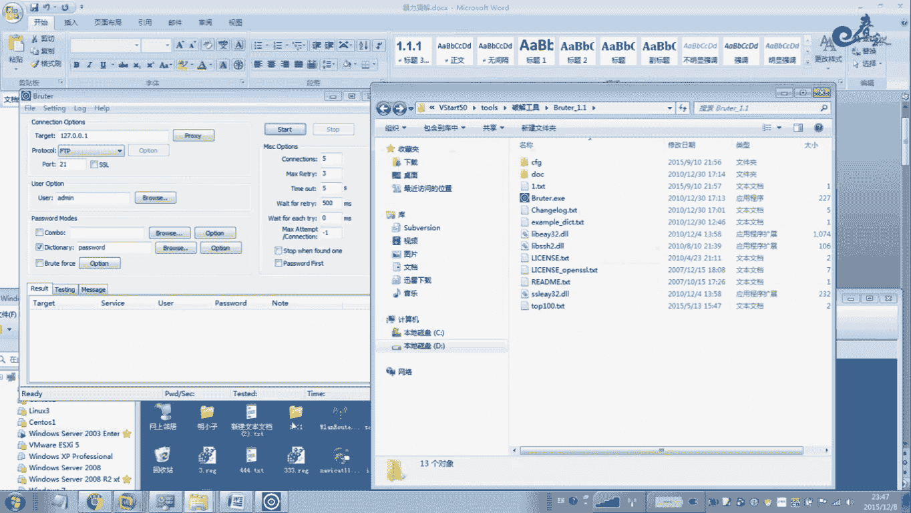

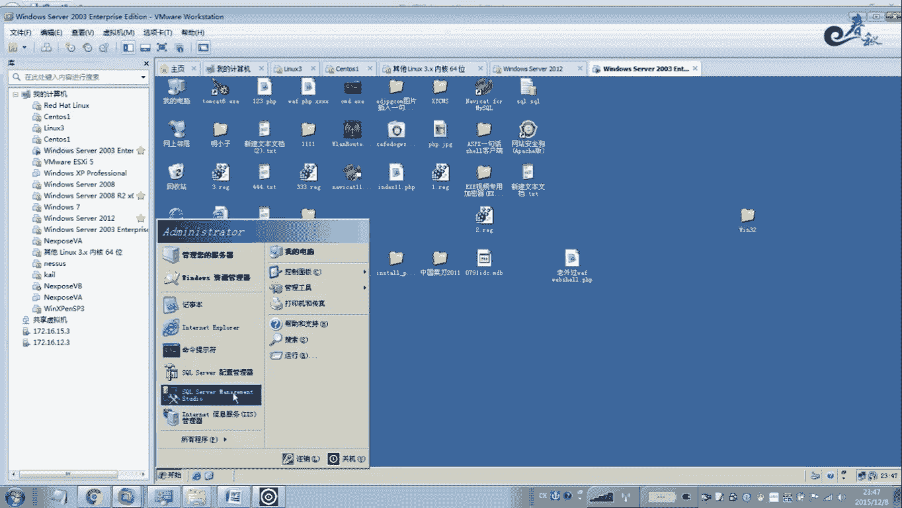

1。105。我看一下这个熏接到那边通不通。O。

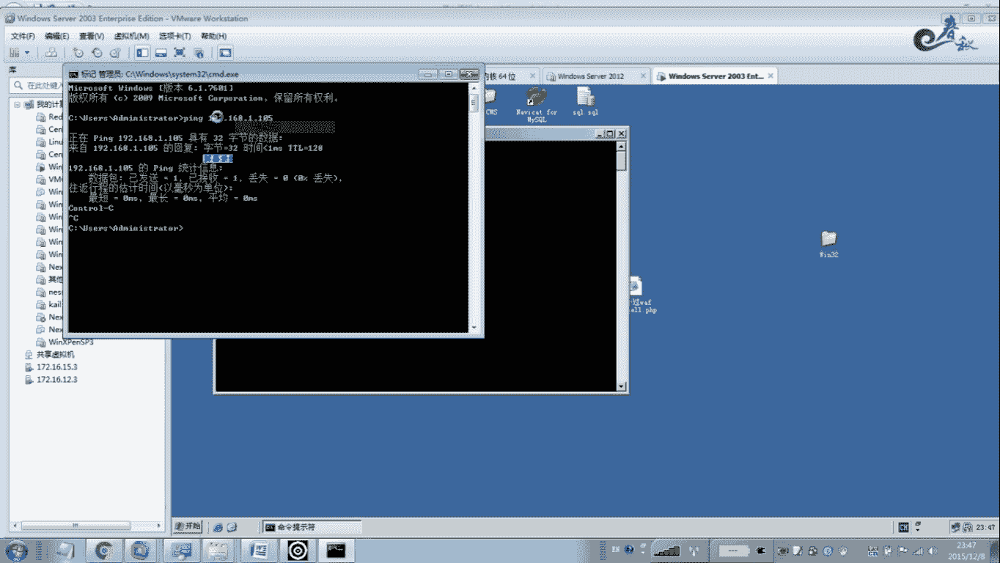

好，我们把它放在这里。我现在想破解。我这个虚拟机里面的这台操作系统的一个管理员账号。那么我就选择SMMSMB啊，就45端key这种的一个方式一个破解。这里有很多种协议。如果你破解FTP。

那么你就选FTP啊。如果你HTTP，你就选HTTP啊。呃，这个搜你就显搜 mySK就SK啊，有各种协议啊，自己选tto啊SSH啊、VMC啊，还有外博表单破解啊。也就说它这个东西啊。

它这个BRUTR这款工具啊，功量还是非常强大的哈。它既可以呃破解这个CS价构的，也可以破解BS价格的。在微博也可以暴力破也。所以功能还是挺强大。啊，速度也不错。好，我们给大家直接SN。

SMP我们破操作系统的这个呃密码。那么当口的话，SMB默认是45端口。那么用户名的话，我们一般情况下是什么呢？呃，大家都知道，一般情况下是ad是吧？就默认都是啊，除非他改了，就把这个管理员账号改变了。

重命名了，不然的话都是这个账号都是这个账号。也可以点击这个浏览。好，那么这个地方的话啊，我们选定。这个呢进行一个。暴力破解好。我们来看一下加载一个top100啊，密码字典。啊，这边的一些现成的数啊。

最大连接数超时错误。那么这个根据你自己的情况。来进行设置好，其他的选项呢我们就差不多了啊，我们点击这个。嗯。他这个路径我们注意应该是不能有中文的。他报这种错，一般情况下应该是这个问题。

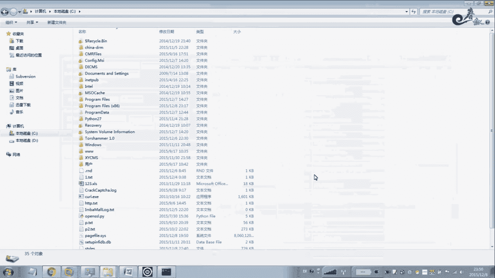

啊，我们就把它放在C方下面。所以国外的工具哈，凡是就是嗯老外的工具，一般对中外都支持不好。所以说一般情况下大家注意一下。啊，果然是你看速度很快哈，这100多个字点我鼠标一点就出来了。你看这么多字典。

我一跑。徐标这一点，他告诉你啊，账号是AB算是密码，123456。啊，123456。快吧，对不对？不相信我们再来改一个面码哈。啊，不改了吧，别耽误时间了。好。

那么为了件在我们这个是不是是不是123456，大家可以去啊重新进行一个取消啊，进行登录。

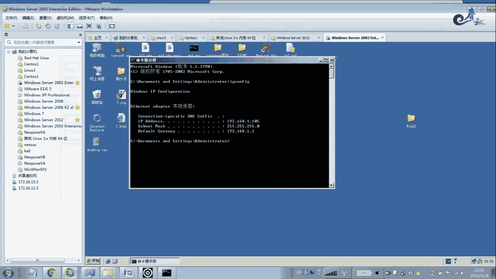

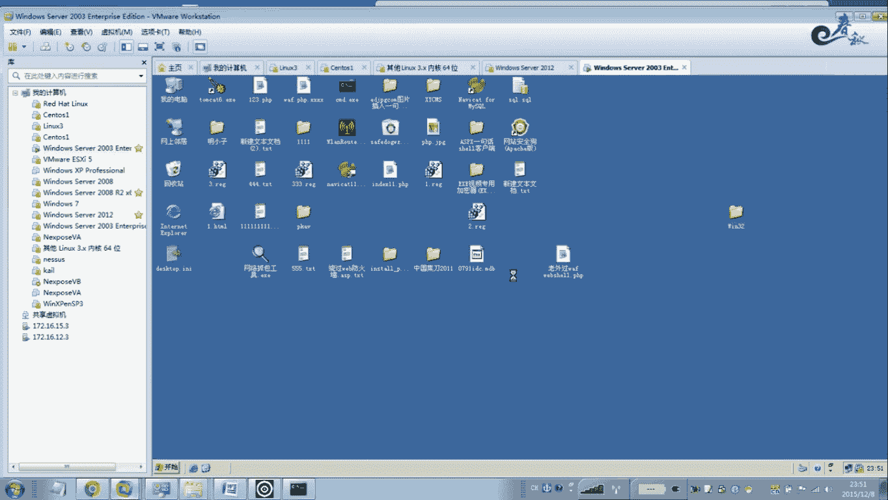

呃，关于其他的我们一些协议，大家自己去测试吧。我在这里不再做太多的一个演示。好，这款工具我们就给大家讲到这里。这款工具是个综合工具哈，BSCS都可以破解。速度速度也很快啊，一般的就是说。

我懒得去开BT5的时候啊，我一般用这个工具大概就跑一下，挂个字点啊，挂个用户名。他用户名面用户用户名也可以哈，加载这个字典好，都可以哈，在这里哈。也可以浏览哈，这个无所谓哈。好，还有一款工具啊。

这个是NTcan。啊，这个工具也是不错的。就是用户名破这个windows的这个windows操作系统的这个账号密码的。在这里这是填写用户名啊，ADM段AD名。

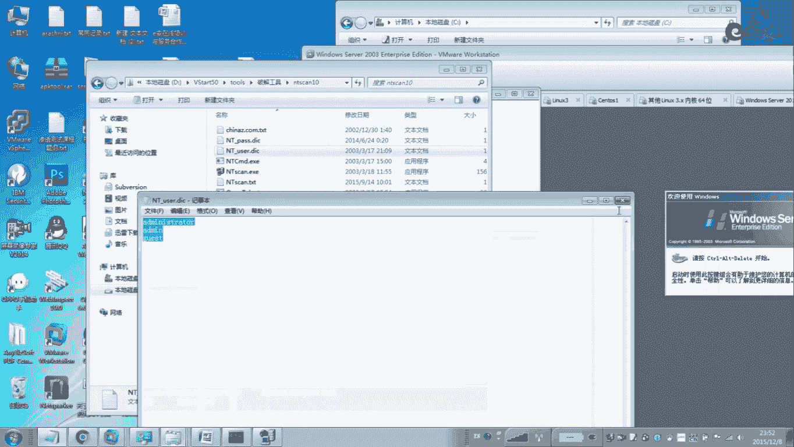

我，刚才这个已经具焦好了。我们在这里直接输入123456登录，哎，是可以登录的，没问题，对吧？

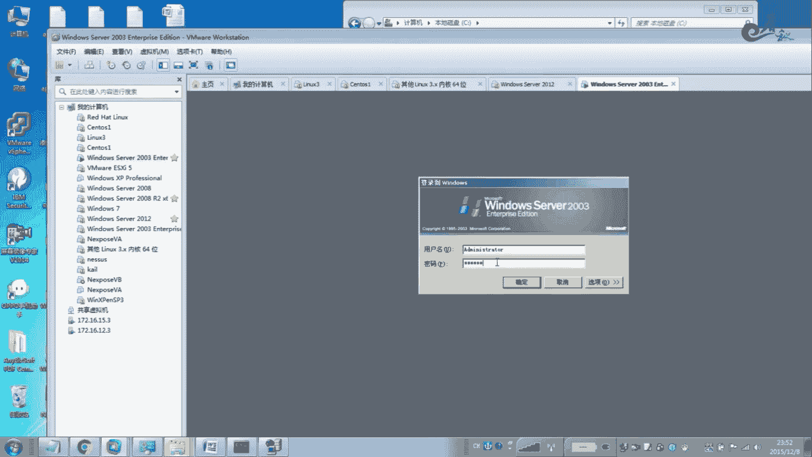

好，看一下这款根据啊，那么这个是密码啊，它默认这个密码还是不错。那就是说针对就是目前最常最常见的一些密码，它粘贴在这里，当然自己可以加一部分密码放在这里来进行暴力破解。啊，这款根据扫描速度也很快。

唯一的一个优点就是说可以对整个网道进行扫描。啊，刚才那个工具是没有这个针对网当的来进行批量的windows操作系统进行一个密码暴力破解。你看他也可以载录这个什么。就是说你你扫描出来的一些IP地址。

把这些IP地址载录到一个记事本里面，单击这个什么。打开工了。点击这个打开功能。可以把它载录到把IP地址写入介设版。嗯。打开之后就在在这把这个勾勾向上。

那么这样的话就可以直接读这个记事本里面的IP地址来进行一个暴力破解。这里有什么？一些连接连接通道有啊连接共享的通道，有这个A的，有IPC的，要有C盘的，后面加一个什么刀路符号，这个是一个隐藏的哈。

就是说我们在这里建立连接的时候，一般例如对方的仿符是隐藏的，例如1G2168。1。1是吧？你再加一个仿斜杠C盘什么。呃，这样的一个符号。那么默认是共享的好，C盘，这些像D盘啊。

你点击回车就可以进行一个访问的。啊，一般公开第默一般采用IP scan啊，就是说默认的一个，还有SMB45档口的有W。WM看的。好，我们进行一个扫描，可以检测，你可以看一下。啊，开始啊。

这个扫描速度很快。啊，错误了。是这样的。好，这样呢他就进行一个拼的过程。这这个地方是腰纹的。这款工具也是用的最多的哈。啊，就在V呃内网渗透里面批量的去拆解windows密码账号的时候。

那么基本上用到这款工具。出轨了。出来了半天才出来。好，我们在这里试一下啊。只要是漏口令，它一下子就出来了啊。他进行一个拼点探测。他有空密码的。啊，这个来看他马上就出来了是吧？啊，他告诉你啊。

191681。105啊，用户名AMS专属密码啊，这个123456啊，他就会告诉你。我们这里就不管他。我们接着看一下啊，还有关关于这个PHP卖A米啊，这就是这个应该送这个是呃BS价格的哈。啊。

一种暴力破解。所一般对我们一个网站。他后面有一个什么？安装了这个PSP买AM的个管理工具啊，来管理数据库。那么这个时候你可以把这个账号密码加到进来之后，点击开始爆破，就针对这个很快就可以破解出这个。

PS密买AM这个BS加个这个账号密码。当然还有就是说针对微波碎要的暴力破解工具也很多啊，微波碎要的。专们真的微不睡哦。回光效就是我们这个APPHPGSP木马是吧就登录的这个需要密码一个爆破。

还有针对这个就是说有的这个网站数据库啊，它ac数据库啊，它设了一个密码。那ok克目前俄克这个数据库设置的密码，就是说我们都可以进行破解的啊。目前都可你只要设置一个密码，就是把这个对方的这个数据库。

显定数据库打开一下，那么密码就显示出来了，把麦号也显示出来了，就这么简单，大家可以试一下好。这个这个都这个是毫无疑问的。O数据库的密码一读就出来了。嗯，还有一些字典字典生成器。

这个是我们在爆破过程中最有用的。暴暴力破解，就是说暴破解密码的时候，不是瞎鸡巴不是瞎这个破解好，不是随便就是进行一个破解。就是说我拿一个密码字典啊，挂在这个工具上面进行爆破一下试一下。啊，看有没漏口令。

但对于一些有安全意识的管理员来管理员来讲。他要你要暴力暴力破解他的这个loc口令是很困难的，是没有的几会啊，所以说我们要根据他的一些生日啊。啊，他叫什么名字啊，手机号啊、邮箱啊来进行生成这个。密码字点。

尤其是我们就是对微博进行渗透测试过程中去帮别的企业渗透过程中。我们如果有的企业他是要求很高的哈，就是你帮他去做渗透，你搞了半天，他给了嗯他他公司给你们公司搞给了这么多钱。

你搞了半天什么漏洞都没有找出来啊，什么漏洞没找出来。那么这个时候如果你只要拿下来一台服务器的话，那么我们要收集账号，收集什么账号，例如外博程序的数据库点击账号啊，操作系统账号包括嗯。

反正是服务器涉及到这个连接的账号的，包括数据库啊、各类数据库啊，只要是涉及到账号的，我们都把它收集起来。因为这个连接数据库的这个账号，包括首个搜5MSK的这些密码都是可以获取到的。

通过网站程序里面配置文件都可以获取到操作系统，我们也是一样，都可以用工具来直接读取读取到啊，得到这个密文密码，这个是毫无疑问的，都是可以实现的。包括嗯如果这个服务器管理员。

通过这个IE浏览器去浏览其他的网站是吧？包括这个缓存里面程序的一些密码，我们都是可以通通过工具。全部抓取到。啊，也就是说这个这台服务器的任何痕迹都可以收集起来。收集起来之后。

我们用绽放在这个密码字典里面来我们取道把这个把收集到的一个密码作为一个挂在到暴力破解工具里面，针对这个网档来进行批量的经通过这个扫描这个网档，用用收集到的密码来。针对其他的机器。来进行攻破。

这个在内文里面这个是。用的最常见的一种手段啊，就是我用的最常见的一种手段。那么这种手段呢也是。在渗透过程就收获很大。一般的我们只要拉下来一个管理员。那么其他的他这个管理员涉及到其他的服务器。

我们会全部更破。人由一种这个O还有这个毛病啊，包括我们搞计算机的人都有一个毛病。就是说设计账号设置这个账号密码的时候，尤其设置密码的时候啊。你的这个淘宝啊、邮箱啊呃QQ啊银行卡。

基本上好多人都是同一个密码呀啊。包括你管理的服务器啊，一般管理的服务器也一样啊，基本上是同一个密码，就算不同一个密码例如。嗯。例罗这个呃百度。百度这个。一二三。或者是百度。有的很多企业喜欢呃。

用这个密码，那为今年是2015年，那么前面是他的公付名称，后面加一个这个符号。这也这个。这个邮箱符号再接着嗯后面接这个年份，一般喜欢设这种设这种密码啊，公司的这个域名域名域名名称。再接一个。

后面接哪一年？或者是接搞一个什么啊，感叹号，这个这样的感叹号一般就是搞计算机的习惯设设置这种密码啊。呃，公司名单加这个年份当年的年份，再是加几个就是123的这个退出符号。

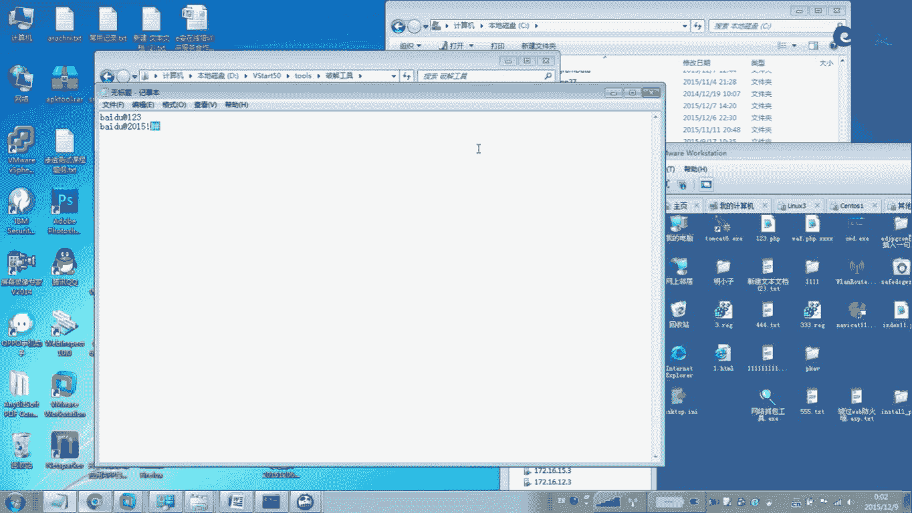

来进行一个组合，用于嘛一个组合。那么我们就是说找到规律之后来进行生成，用词典生成生产出来之后再进行一个暴力破解啊，批量的暴力破解。那么我们就可以。买出整个你话啊攞出整个你话。当那关于还有一些工具啊。

看一下这个这款工具也是一款暴力破解的，大家都过一下吧，就是说搞渗透。嗯，今后你们从事的工作就是搞专门做这方面，就是说大概过一遍哈嗯这个渗透就是暴力破解大概有哪些工具？啊，模块啊，这个也是一样看。是吧。

但是这款根据呢他有一个优点。什么优点呢？可以在这里设置设置这个IP啊模块啊，模模块这个地方。啊，这里有个参数启示IP锦数IP啊，也可以加载主机列表。

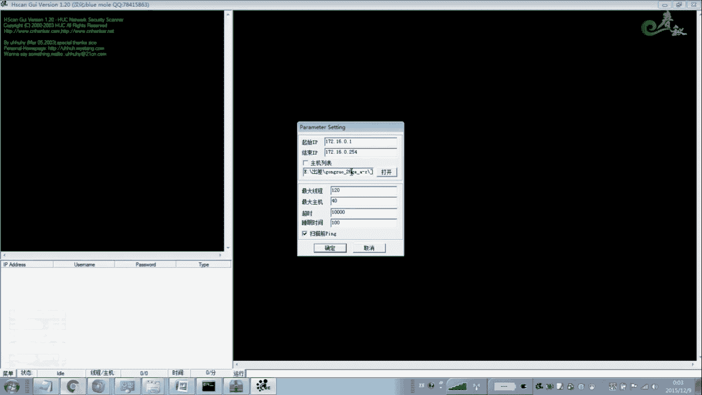

啊，通过这种方式的暴力破解。这种方式也是不错。这款工具我先在这里不再讲解LAZAGN这款工具很强大，我打算放在这个。嗯。后面的课程讲解就是说这个社会公开学啊，或者这个内容题全再讲解。呃。

这个是针对MD5一个暴力破解。啊，一个是查询，还有一个嗯报括。呃，网站我们经常会这个包括这个SK输入啊，得到这个脱库的过程中发现密码，好多是这个什么加密的，或者是说这个密码。

就是说我们在这个呃有的时候通过其他的一些锁动啊，得到了这个密码得到数据库的这个连接密码都是加密的。我们需要进行MD5加密的，或者网站密码也是加密的。我们一般的是都是通过MD5哈，就是说像网站的呀。啊。

一般是MD5加密。那么加密的话，我们要进行解暴力破解啊。解密。一般呢我们解密的话，一个方面是通过工具暴力破解。第二第二个方面，我们通过这个网站查询。那么网站就查询的话。

我们排在第一位就通过网上来进行解密。解密这个MD。然后解面不了，那没办法，我们只能通过工具的。好，还有一种就是说有的这个是真的够懒的哈，都很多人喜欢就是针的M。PDF啊PDF文档来进行一个加密。

包括word啊进行加密，几个s尔加密。那么目前来针对这些这些加密方法呢，目前都有工具。直接把密码清除掉啊，这款工具大家可以记一下，网上可以下载破解版本。那么这款工具直接可以就是安装完之后。

直接把你的这个PDF啊。拖进去之后进行解密。那么你这个密码就没了啊就清空了。很简单的。呃，这个也是碎要的暴力破节工具啊，针对外部碎要的。啊，不对，加载TXT啊TXT的一个界面。

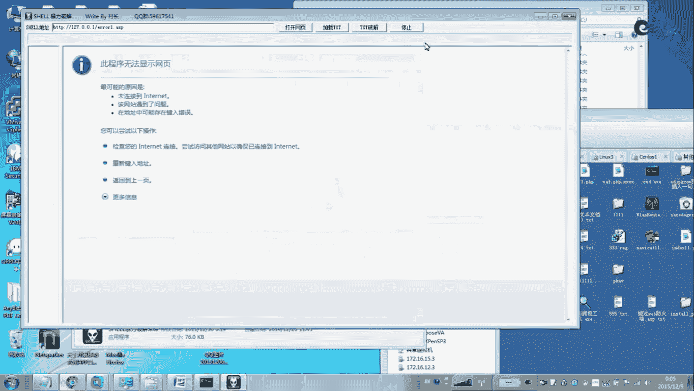

没关系，这个不管他吧。把这个ウナスで。呃，跟大家说一下在这里。

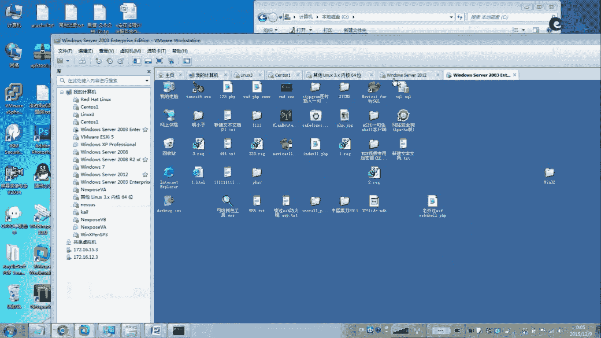

嗯，讲一个最常见的吧。咩。嗯那这个安全狗怎么又出来？其实在真正渗透过程中啊，我们先把这个还是讲一下吧。这个根据的用法是。

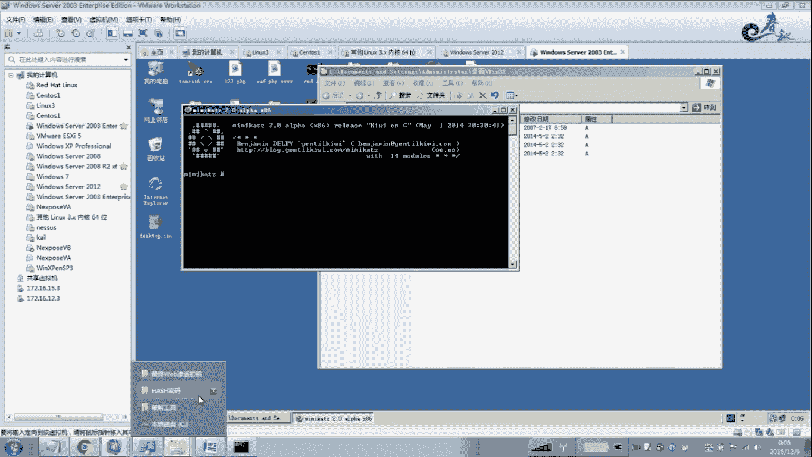

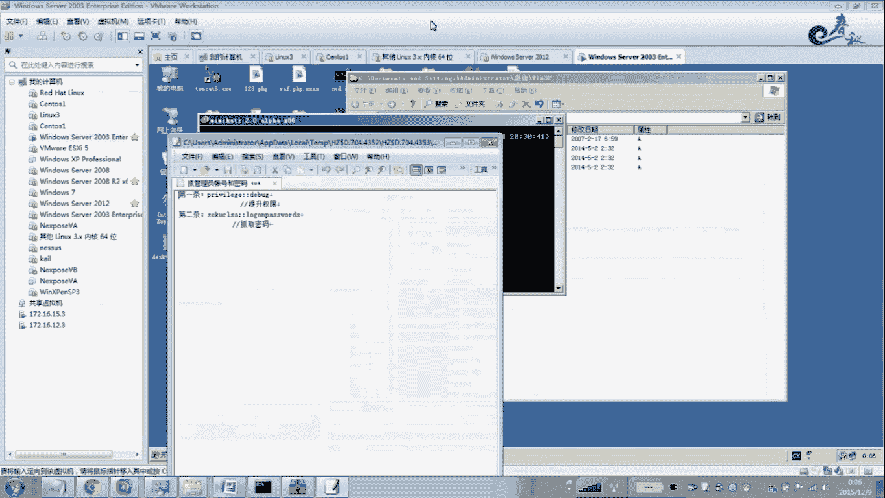

呃，用法是P而然。V安LEGE。第8个。好，接着我们说ciURLSA。LAGO NPA password。那么这个时候我们就可以。看一下很快的哈。我们就知道这个密码大你看哦。

123456123456对吧？没错吧，这个就是我们的管理员密码啊，管理员密码。就刚才暴力破解出来的是吧？这是个人密码它都可以破解出来哈，这让操作系统存在的。存在的包包括这个IS中间键的这个密码。

它都可以破解啊。中间键的它这个管理员的一个就按右手用户啊，只要操作系统的这个啊windows操作系统的用户密码，它都会读取出来。当然我们读取的话，一般的不不会用这样的工具。这个MIMIK啊这个。

car体这样这这个工具有一个缺点，就是说呃真正在我们录侵过程中，就是呃这个渗透测试过程中，在提全的时候，微博是提权的时候。他这个如果你在图形化界面操作啊，没问题。但是在这个命令好模式。

你要输出到一个记事本里面，我们能看到密码。在唯不是要不是交互式模式下，那不现实的啊，用这样的工具。所以说我们一般用到了一个嗯。这些哈西列一个读取密码的工具，这里有很多也例如getto哈奇啊。

还有getto pass。这些根据都收就好了。就是说我们在迷你航模式直接运运行它。直接导入到这个TXT文本里面。就不会产生一个胶互式的一个作用哈。胶互式的。

所以说这个呃这款工具我想在这个提转微波摄用模式下面去运行那。我不会用这样的工具啊，我们还是换其他的一些工具代替。

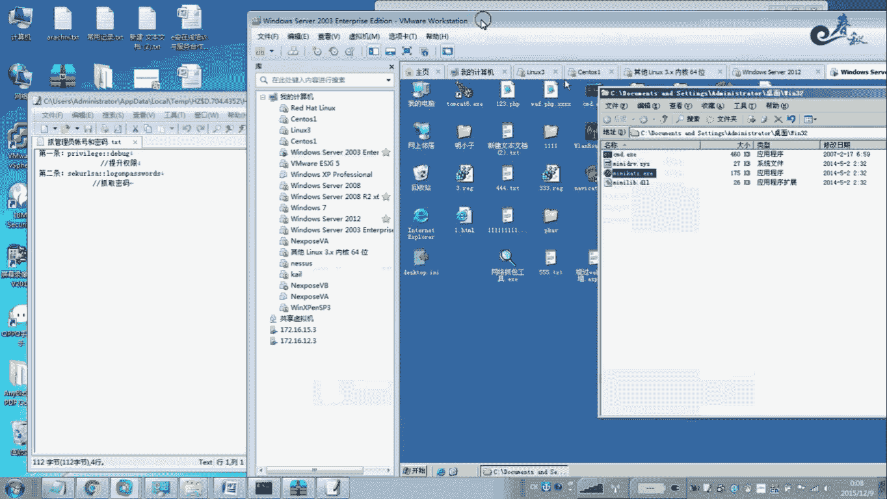

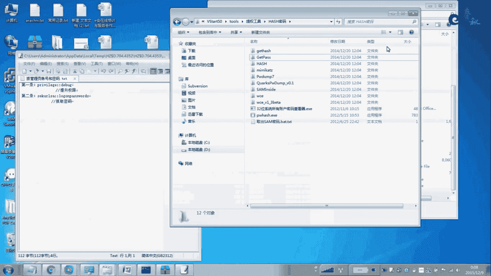

讲一下经验哈，就是讲一下经验。那么接着我们就用嗯再来看一下啊其他的一些。嗯，发最高工资吧。好，我们看到这里。这个工具啊是we博啊这个bl这个 pass wheel videode啊。

就是针对独绝IE浏览器里面的密码啊，这里我拉了一部分哈，给大家说一下。可以看，我随便拉了拉了一点点。啊，这里一下子全部读取出来了啊，你登录的网站地址、账号密码是吧？账号密码。全部有啊全部有。

这个还要读取这个什么嗯社交软件这个客户端里面的程序密码，将在社交上面的这个MS pass运行一下就是还可以读取什么，这里有读专门读取这个桌面上面的。两天桌面连接的啊，账号密码。这3389连接。

还有就是啊当然还有我那个工具我这里还没有下载，放在这里，还有一个叫做VPM的。啊，VPN的暴力破解工具就是怎样包括读取的呀？这个其实不在我们本节课之内哈，其实我在这里多讲了一些东西哈。嗯。

还有邮件给不到的。就是你你一般的用这些收邮件，搜邮件，这些搜一些邮件。那么这个账号密码。呃，都可以读取啊，我们在这里不再讲解。我过一遍哈。呃，这节课我们看看。好，下面我们看一下这个仿暴力破解。

仿暴力破解，我们不无论是BS还是CS价格，总结以下方法，一就是密码的复杂性。打觉C置密码一定要复杂，这是最基本的最底层的防线。密码设定一定要有这个侧点。这罗命嘛必须不能低于8位哈，不能说低于这个6位啊。

一般的是不低于8位，一般尽量在这个8位以上到16位之间。这个文章写的有问题。这文档这这这部分文档我从网上摘错的。所以。这里写的一般的标准啊，这个也是。标准的标准就是8位啊，按照这个国际的一些标准。

第二点是绝不允许以自己的所加号物的邮箱太然座为密码。很多人喜欢就是说。同一个密码。第三个就是用户名和密码，不能有任何联系。什么像管理员经宽松搞网站就是ADMAD名ADM888这种。哎。

张上免外又来一个张上。我得写上自己的手机号，那装3123。张三一23姨讲单好。搞得最聪明了。还有仅仅以上3点是不够的，就是说还有这类密码，千万不要用。因为在top100里面基本上都有，就最常见的。啊。

长度是够了，但是也危险。因为是乐口令呀。早已经被一些密码字典已经收集到了。所以说一般的别人挂了个攻击字典，一下就破解出来。所以要随着一个好的面码8位以上啊，面码面码长度。单与八位。而且这8位里面包含了。

大小写字母。啊，大小写字母最少以一个数字，还有一个特殊符号，三者结合。这样的话就攻击比较困难的啊攻击比较困难。第二种目就是防御方法，就是你也在嘛。这个是验证码这块的灯对于这个。

这个是对用户来讲哈对用户来讲。第一点。第二点是对于这个管理员，就是你维护网站啊，包括程序开放的人员来讲，验证码是最重要的啊最重要的。我们在验证码的这一章给大家讲解过。

因为使用验代码可以有效的防止恶意破解密码。要因为你输入一次错误的验代码又不一样的，所以暴力破解没戏的。包括刷票、论堂灌水都可以防止。所以说念证宝最主要的是缝制这个机器呢。是一个用户注册页面。

嵌入验证码之后，可以有效的防止机器人注册账号，发一些广告违法帖。呃，早期的时候，05年04年的时候那个时候没有没有几个战，有念上吧，那个时候就是说。开发一个广告发帖工具。靠天天打广告。做个1000多赞。

2000个赞。看下推广的时候，用个工具批量的，只要有只要有打广告的地方，有发帖的地方。那么无处不在广告。批量化的。那么至今这个验证码不单单可以有效的防止这个暴力破机刷票。

这个网络学件也可以防止一些CSRF攻击等等一些不安全的因素啊。CSRF攻击如果有了验证码，它也是没系列啊，也是不行啊，这就更击这些了。虽然说验证码是简单啊，虽然你也说验证码简单有效。

但是看什么类型的验证码。那么呃很多种类类型的这个验证码。现在目前有图片的，有手机的哈，有邮箱的，还有这个答题的。啊，有些验证码呢是可以识别啊可以破解的。那么在我们验证码的课程里面，我们给大家破解过。

给大家也讲解过怎么样去破解。啊，这里有共种验证码，大家自接可以看一下啊。最最变态的是目前最变态的这个念代码。呃，是123，我见过的是反正最老火的是12306的啊，他各种验代码都有。啊。

美女啊他在这里闲一下，有的时候看买火车票的时候，他在这在这个地方要你想定下面哪一个明星。啊，刷啥啥有一个问题，你在这勾。然又搞一个bo纸，上面哪一个是bos？啊，还喂是动物啊。反正各种问题都有。

你在这那个有的问题看半天没没看明白，图片有模糊，还有这种啊，就是滚动条的拖，把这个鼠标拖到他边搞一个这个口子。啊，一个口，那你把这个这这个地方拖拖拖到对应的这个缺口这个地方。嗯。当是他一般这常建的。

我们是这种建代嘛，就是说什么数字的呀，字母的呀。嗯。像这种验财码是很容易破解的。什么5108这个78721啊。一般的加这个波浪线的就不好破解，不好识别了啊，根据不好识别。但是也难识别啊能也难识别。

所以说千万啊千万不要被识别了。呃，关于后面呢，我们在这里不再做太多的讲解。第三部分就是嗯这个防御方法。我们这个登录日志啊，就限制登录次数啊，这个是很重要的，就是暴力破解啊，我们要限制登录次数。举个例子。

你密码错误3次，我就把你IP地址锁定15分钟。你有没有。因为使用登录日志啊，可以有效的防止这个方式啊可以暴力破解。登录日志意意味着是用户登录的时候，不是直接进行一个登录，而是去去登录日里面去查找。

因为是。永户时候永护。如果登录错误。还有这个登录这个错误的次数时间。不过连续是。如果是连续的时间连续错误的，那么我们就可以采取采采取某种措施。是我在日志里面框到日志里面有如我有三次错误。

那么我就把它的IP锁定，一般锁定为10分钟到15分钟，这样也是可以。防止暴力破解。那目前呢我们我提供给大家的方法呢，也就这么三种啊，这是目前最常见的。当然还有很更多的方法。啊，大家可以在网上去搜索啊。

我再强调一遍啊，防止暴力破解，一个是密码的复杂性，第二个是采用验证码。第三个是限制登录次数啊登录次数。好，第四呃，如果要说还有就是你要对于企业来讲，还是管理员来讲增加自己的一个安全意识。

不要就算密码建一个重要的密码，像银行密码，淘宝密码建议是不要跟你。管理的服务器啊，或者是上的论坛的密码是同一个，这样的话是很容易被暴力破解的。好，今天我们这节课就讲到这里，下节课再见。

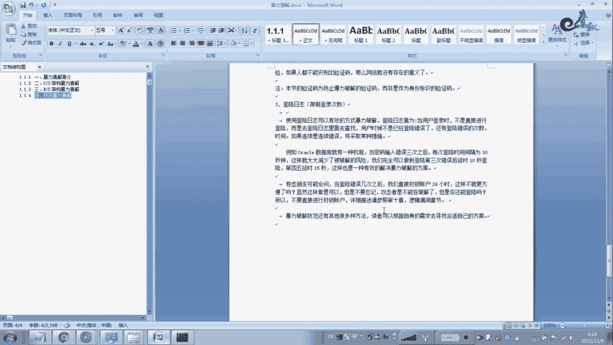