# 经典15年i春秋渗透测试系统化教程 - P54：课时2  Web应用其它常见漏洞总结（下） - 老网恋教父了 - BV1n54y1B7F7

好，接着我们来看一下IS等文件名啊，这个。漏洞。那么这个漏漏洞的话，其实就是嗯我这里写了一下危害哈。他这个其实作用不大好，作用不大。一般的就是2003超C安安装的这个点类头框架，一般都有这个档文件名。

他就是说这个主要是在这个微软的ISIS啊，在实现上这个存在这个文件这个枚举枚举那种。这共箭者可以利用此类的话或者美局网站服起来盖部组子上面的一些文件。啊，文件主要找网站后台的时候有点用啊。

就是说我们通过这个，而且它列出来文件啊，不会就是说全全程的好，它是一个简写啊简写。那么它的文害就是说根记者可以利用这个。字符来进行拆解或者便利这个服务器中的服务器中的一个文件名啊。

或者对IS服务器的一个点let头这个。呃，框战进行一个拒绝服务攻击啊，拒绝服务攻击。那么这个漏洞的验证过程啊，我在这里说一下啊。

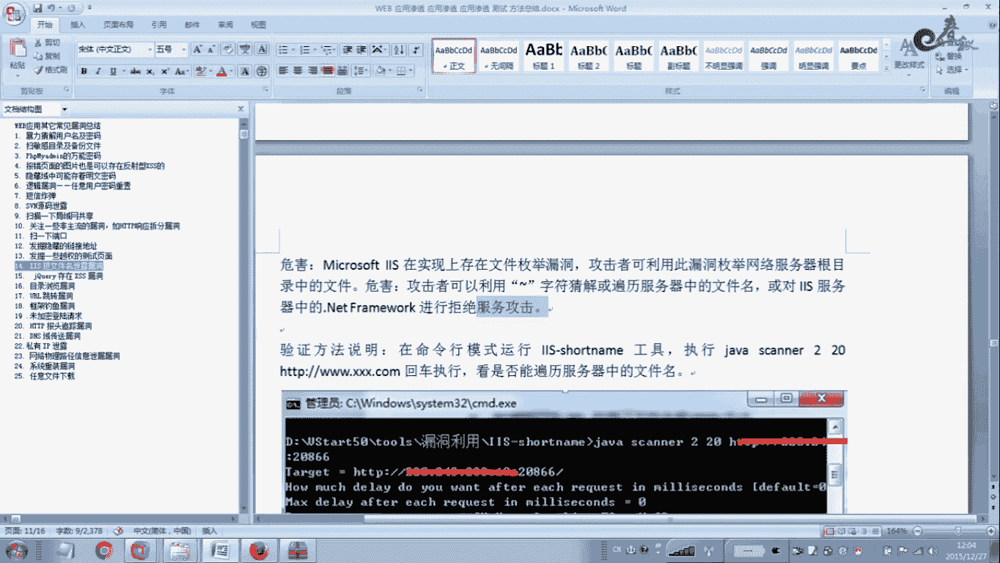

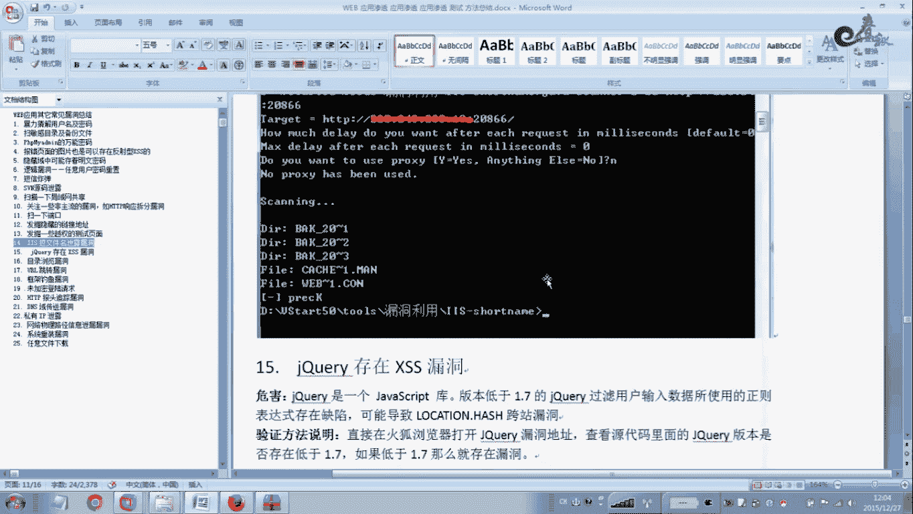

哦，我这里我还没清出哈。但是我在这个渗透特测过程中啊，这也是遇见大量的这个漏洞。

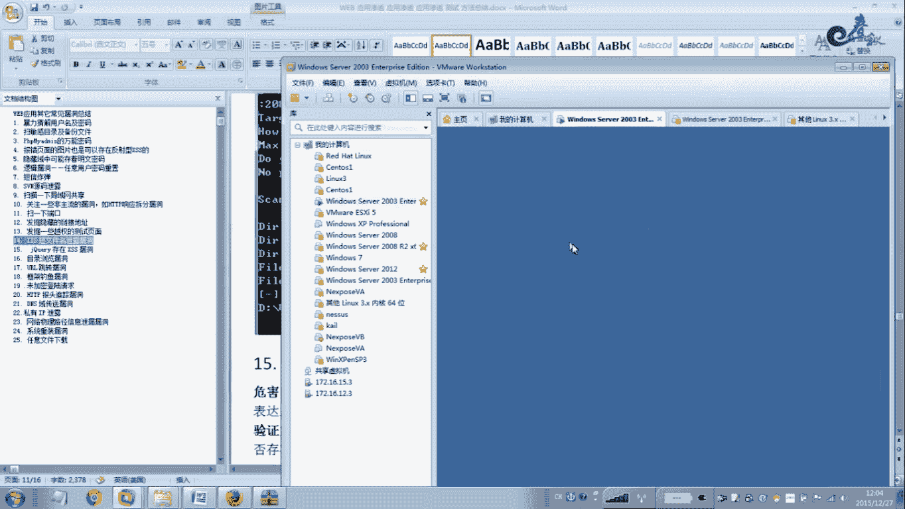

太多了。我这里有是有点那头，我不知道我这个。会不会存在这个。这个漏洞啊这个漏洞。啊，但是我交大的方法验证一下，大概说一下。

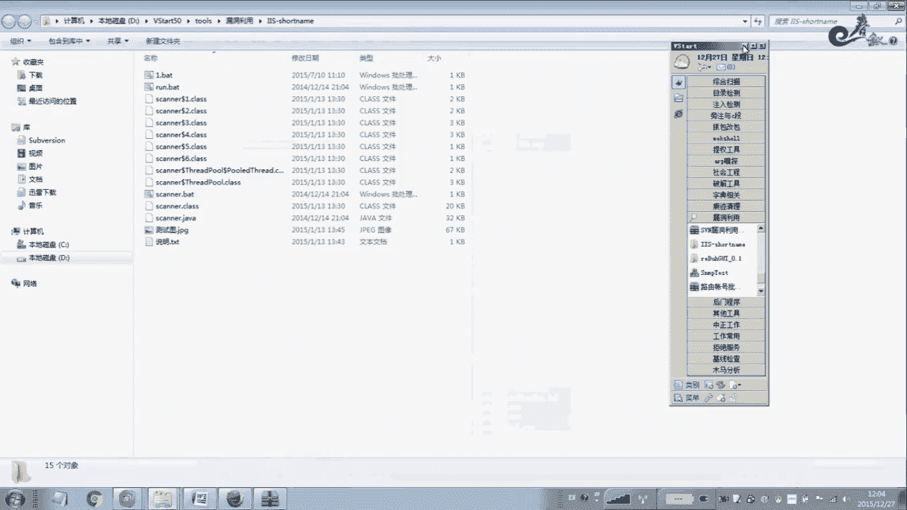

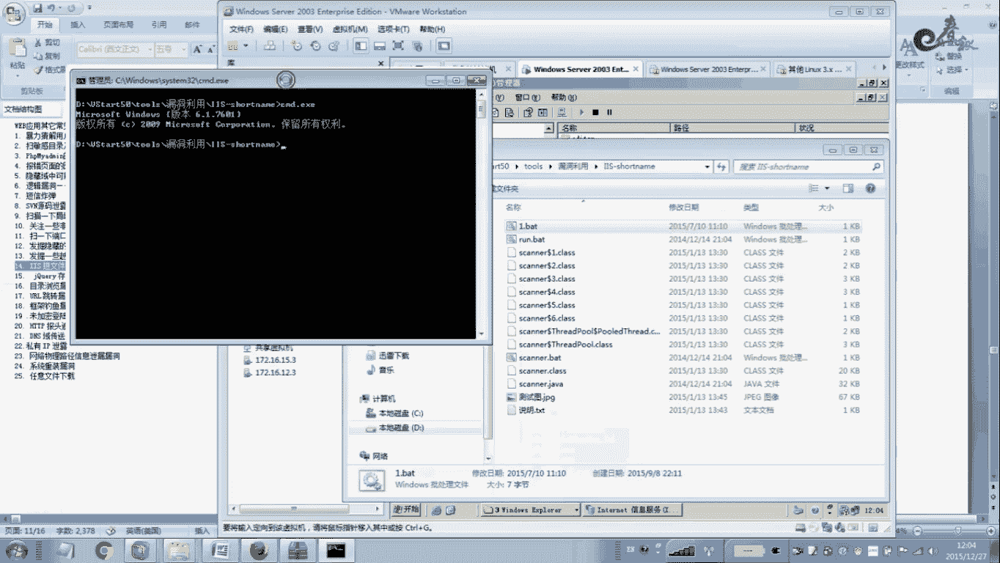

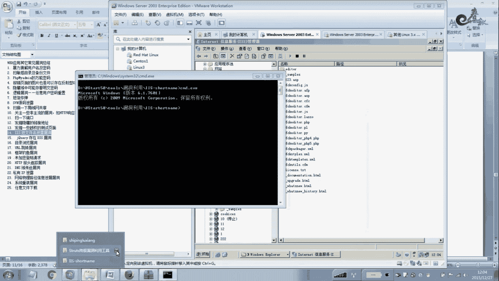

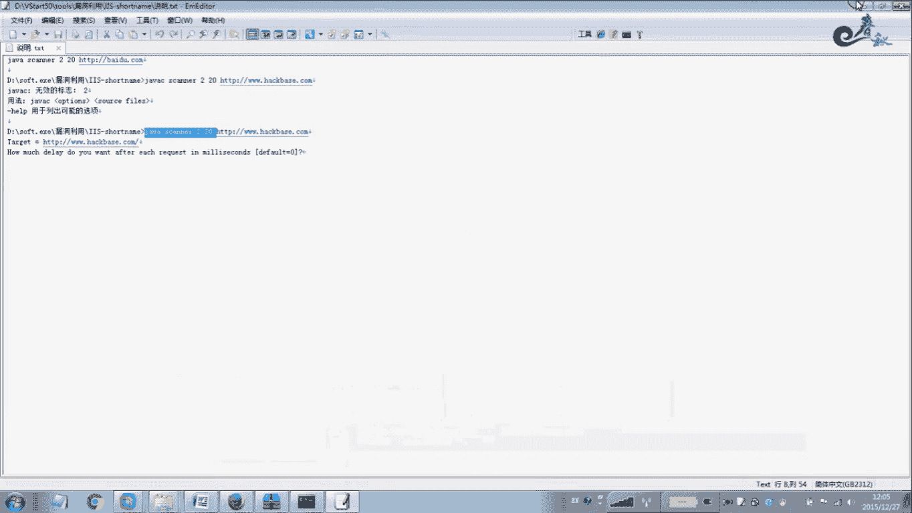

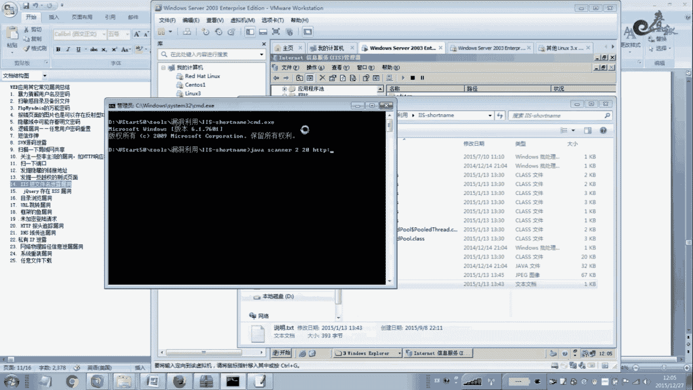

写入这个你要访问的网站。我，这个输入0。哎，就不代理。呃这个时候进行一个扫描。啊，我这里如果没有这个内容，那么他就会淋0。啊，没有找到。如果存在的话，那么在这里会它会列出一些文件哈。

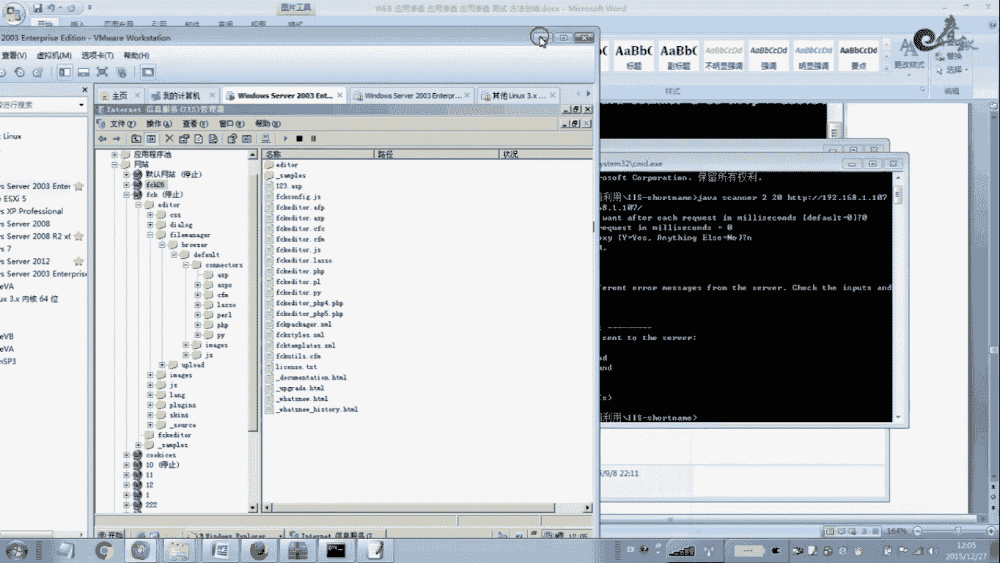

啊，DRL它会列列出一些文件，什么微博啊，波浪线一点comN啊。我们如果这个存在的话，一般的是有这个漏洞。

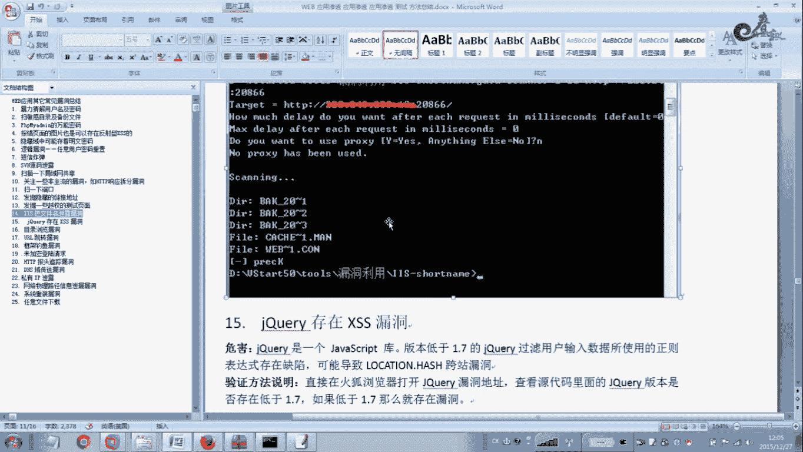

如果这里有显示出来，那么就是存着这个IS导文件名泄露内中。呃，这个内洞利用价值不高。一般的如果你能猜测到这个网站后台，那么它的价值就高与一般情况下与其他内洞结合使用。这IS等文件名。

有些报告里面他是把它当做高位类的嘛，高贵类的。机框里啊存在这个叉SS的下面一个。那么这个内洞哎嗯。呃，我我的评价他不能作为高于那的啊呃，一般的情况就是说也就是说中低位吧。但是利用起来。几乎。用不了。

就说大家可以发现好，不管绿蒙2很够类扫描器AWBS。嗯，他会把这个及跨的这个。嗯，彩色是种帮助这个。高位有种好。你没法在这个前端软件站里，只能去后端。扩到年的，那么它是一个什么？

它是一个dvascript的一个库啊，就是说。一般的是。版本低于11。7的版本。那么即跨递它是都会对过过滤用户啊输入的数据啊所使用的这个正规表达式啊，它是存在这个缺陷的，可以导致这个什么夸大啊。

这个lowcus。哈西夸大这种。你个方法说明的可以。呃，通过这个火狐浏览器，就是扫描器扫出来地址放在这里，一般是GS啊，郭大明。你可以看到他的这个。版本只要是低于电器的，那么它都会存在这个。

电话里才4S的热量。啊，他这就是说写报告的时候啊，你就这么写就行了啊，就这么写行了。根据这个版本啊根据这个版本来判断。直接下面就是目录浏览类的。目录浏浪沟通呢。

它是一个主要是由于这个呃微博服务器权限配置不当。啊，造成这个用户可以直接浏览这个。微博网站目录。呃，尤其是一些图片目录啊像。image javascript啊啊一些目录。那么这些目录一般呢是。

很容易存在这个目录浏览啊，目录浏览啊，就是说能在配置传限的时候，允许了这个浏览目录的权限，所以造成了就是说。啊，直接在这个文站后面截一个这个目录文目录目录名仿斜杠。

那么直接可以列出文件里就是附件上面的一些内容。啊，有些甚至把这个配置文件也列出来了，那么这个是非常危险的。只要有这个列目录权限，那么我就可以下载这个服务器。服务器上列出来的文件好，可以下载好。

那么这个啊送到中位类的吧，中位类的。用IE或者火狐直接打开就行了。就是扫描器扫出那个木子，你就你就放在IE里面一流浪就行了。还有这是后面就是这个URL跳转类的啊，这个在很多网站里面都有嗯。

包括是tras two也有，不一定是装s two啊。啊，那个网站程序都会有可能存在这个URA的跳转的容。也就是说它可以导致网上钓鱼恶意跳转，恶意跳转。就是说我们在这个地方。输到这个文站嗯。

后面也一般的是有一个什么。有一个参数，这个参数后面呢我们例如接一个你你的dlect啊，这个后面再接网站的这个域名。或者参数后面直接接这个等于这个某一个。

你指定的网站还可指定的网站攻击在或者是根击在指定的网站用。啊，那么你把这个地址发给别人，或者把这里进行编码一下。后面的这个域名编码一下，发给别人，别人一点击。那么其实来到了你指定的网站。

它主要是钓鱼作用哈，钓鱼。爷爷可能挂码啊，也可以。他说你你这个网站3W百度点com，如果挂木马了。啊，怪木马，那么你你用这个U2人都跳卷，就是你首先。因为对方看到的域名，其实例如我工商银行，如果有一个。

跳转对的，我跳转这个域米，我百度的域米，我改成其他的玉米。呃，挂挂了木马的这个玉呃，黑客指定的一个玉米。那么这个时候。对方看到的是工商域域名。但是后面我进行了一个编码。

一般在别人就是说没有安全经验来讲的话，包括有有经验的来讲，也不一定能判断出来。它不会嗯为了这个U2类编码进行一个解码吧。一一般情况下不会去解。那么一看到是工商工商一样的域名。

那他点击点击这个地址进去之后。或者在网上进行交易的时候啊，你你在这在这个地址上进行输入你的账号密码啊，进行转账吧。我们这你一点击进去之后就上当了啊上当了。你说的账号密码。

其实这个账号密码发到别人那里去了。这就是一个跳装。还有一个框架钓鱼啊，框架钓鱼也一样的，方法差不多。他主要是网站的应用程序，未对用户输入这个违宪做法进行一个有效的效应。么道子存在一个什么？

注入框架这个注入框架呢，我们可以嵌入这个恶意网站。啊，举个例子，这。这个地址。这个地址我载了一个图片哈，就是我在渗透测试过程中写报告的时候都是这么写。啊，就在这个地方啊。

它一个一般情况下1个SRC等于什么什么什么。那么在这个SIRC等于后面我们加上我们自己的一个要插入的网站。那么这个网站我一插入进去后，我插了一般是百度的呀，一回车。

那么你会发现在这个地方有一个百度的一个框架。一个框架。那么这个就是一个框架钓鱼啊，这个我根据跟这个跳转一样的。如果这个地方。网站被挂码了，百度被挂码了，那么你就中招了啊，中招了或者是。这个。

这个地方这个。框架这个地方啊，这个框架这个窗口这个地方，我这个网站跟你这个正规的网站是一模一样的。只是我。你要你在这里输这个登录页面。一般那个钓钓一个什么钓鱼的话，是一个这个。登录的这个窗口啊。

输入这个账号密码。其实这个账号密码就是你这个正规网站的一个。登录仓库的一个账号改密码，你输入进去一点登录。就把账号密码摘取了，发到我指定的这个数据库里面去了。还是未加密登录请求。那么这个是什么？

在很多三都测试报告里面是啊几乎大量的。那么这个是什么意思？一般情况下，如果没人采用HTPS啊。有43栋克啊这种那一般的情况下都都会存加这个内种。啊，就说你在。嗯。登录的时候。

登录的时候就是摘取一下数据包。输入用户名和密码啊，用BIP或者其他的工具都可以拦截一下数据包，看一下这个用户名密码是否加密了，尤键是密码这个地方。如果没有加密，别人可以进行。

如果在内网里面ARP欺骗的话，可以拦截到这个密码。啊，如过加密的话，别人拦截到了也是密完的啊，没用的。啊，一般的是解密花很长的时间来解密的要。所以说这个地方主要是这个放。主要是就是说这个作用吧。

还有就是说呃一些叉SS攻击啊盗取的时候盗取这个登录账号密码的时候，叉SS可以盗账号密码哈，盗取账号密码。那么在叉SS的时候，如果这个密码是加密的，那么你获取的密码也一样的啊，也是密外的。

所以说它主要是起到起到这个作用。这要要换意的话，就夫。你要一般采用这个。加密的是密码呃，这个传输过程中，这个密码要进行。密完传输啊，不要使用这个未加密来进行传输，他主要告诉你这个意思。主要是嗯。嗯。

我这地方少了一个漏洞。这个土粘错了哈。啊，这少了一个漏洞啊，应该这底还有一个漏洞。这里没写，咱这里说一下，链接注入。这个站将来会你会预知到哈，这个图片应该是链接住了啊。嗯，这个地方我扫了一张图啊。

第19扫了一张图，这个应该是20。反这也就不写了说一下。还有一个链接注入，链接注入跟这个夸赞差不多的哈，这是框架钓鱼啊。他是什么意思？一般的情况下就是说。我插入一个，就是说在这个一在登录的地方。

网站登录的地方插入一个地方。插入一个关键字，例如我插了一个test，你看一下这个代码哈。这个t都跳掉，我点击这个t我跳到百度会跳到百度去。百度这个页面。所以说我们在这个登录地方可以起进行一个欺骗性作用。

啊，欺骗性作用。那么这个欺骗作用咱们去欺骗的大大家就靠大家自己了。那么这里我只是教大家，这里只是说一个漏洞啊，一个漏漏洞。那么这个地方。一般情况下就是说我插入一个能插入一个东西，在页面能显示出来。

并且呢我点击这个tste的时候，能跳转到一个页面上去。那么它这个地方就是链接注入啊链接注入。就是说我。租了一个。想要的东西在你这个页面里面，在前包显示并且。我这个。嵌隆的东西是可以连接到任何地方去。

如果我把这个地方推始覆盖到这个提交这个地方呢。啊，我把这个透明的改配色改成提交这个两个汉字再覆盖到这个地方。会出现什么样的情况？会出现一个什么情况？当我点击这个。这个提交的时候。

其实点击了我这个tste。而且来到了一个什么页面呢？来到了我想要的一个页面。我指定了一个页面，那么这个指定的页面我做成，如果做成跟他这里一模一样，跟这个窗口一模一样。

我还告诉你在后前面在在在这个地方或者在这里。空白的地号告诉你，用红字标识出来，您连接超时，请重新输入账号密码。请重新输入账号密码。这个时候当你重新输入账号密码的时候，你就上当了。你再提交的时候。

这个时候提交到了。指定还可指定的这个是吗？数据库里面去了。啊，这个账号密码发过去了。呃，我这里好多地方重复了一下。这个又又又一个这个HTP这个报纸追踪来了，这个文档没整理好。你看一下这个bo追踪好。

就把这个pos gate改成TRSE。看一下效果。那么这个内段我说一下啊，这个HDE爆头我们上前一节课也给他说了，但是在前面的时候。这个地方好像纹档有点问题。

这个地方这个内洞的危害主要是就是说能能够通过这个构造这个恶意的这个cip这个脚本啊来追踪到HTTV的一1个爆头。啊，追踪一个棒头。而且通过这个。暴徒啊可以这个获取到一些敏感的信息。

像科举信息啊、证书啊、认证证书啊，全是起到这个作用，作用不是特别大。但是这个内洞呢特别大。特别难理用。其着我们看一下DN狙犬序列的啊，这个很多大档都有以前啊，现在慢慢的少了，以前一扫一大片。

一般小玩的也不会出现这种DNS曲全序列容，一般是大的，什么优酷啊。什么爱奇艺呀是吧？张总上这的网站很容易出现这种热洞。因为他们有自己的DNS区于全序啊，有有备份的DNS。在这种情况下。

柴油这个电是吹出去来的。

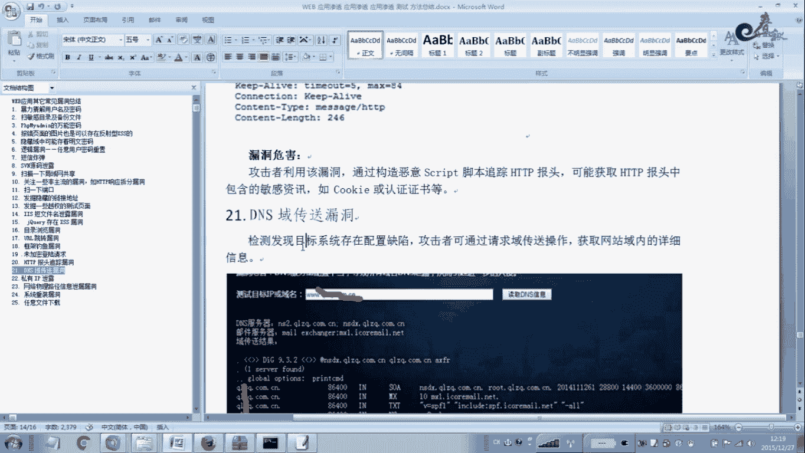

呃，这个大家可以用卡里进行测试。网上也有在线的工具哈，也或者用AWVS他也有有个DNS区域。啊，你把这玉米放进去，可以列出这个。二级玉米啊，就是这很多疫苗的只后。跟这个玉米相关的。他都可列出来啊。

这个二级域米都可列出来。我在这写一句话啊，就是说通过这个DNX区域厂序啊可以发现目标系统存在的一个配置缺陷。就是攻击者可以通过请求区域传输操作啊，可以获取到网站域内的详细信息啊。

就例着我这里有有这个网站QAZQ点COCOM点CM。接着我通过这个区域传序列的。啊，通过这个你在这个windows里面也会建载好数的。爱爱6个 up婆。再输入相应的参数。啊，这个网上都很多啊。

在百度里搜一大片啊。啊，教你怎单去验战这个的段，然后卡里也好验战的，一样都可以。他有个多余工具来进行验战。你看我这里加了一套图啊。啊，我这里加了一张图，这样的话你可以在这里可以看到这里。

把整个这个域名里面的这么BBS啊。BIG5啊啊这个CHAT啊。CIS等等是啊，包括VP啊。都可以列出来啊都可以列出来。他只要有的都可以列出来。呃，这个也嗯算作一个。低位漏洞吧。

就是说对我们渗透有帮助这个漏洞。啊，因为我们渗透一个网站，渗透写出来少。别人给你的只有一个域名，这个域名没漏洞啊，有些网站一般的给的是没漏洞的，你找不到那种，找不到那种。如果有个区域传序的啊。

我们就可以通过它。可以知道他这个玉米下面所有的其他的一些。啊，二级域米。啊因为暴力破解还不一样啊，暴力破解的话，有些。他取得名字比较复杂的话，你是。暴力破解不出来的哈，这一点你要注意一下。

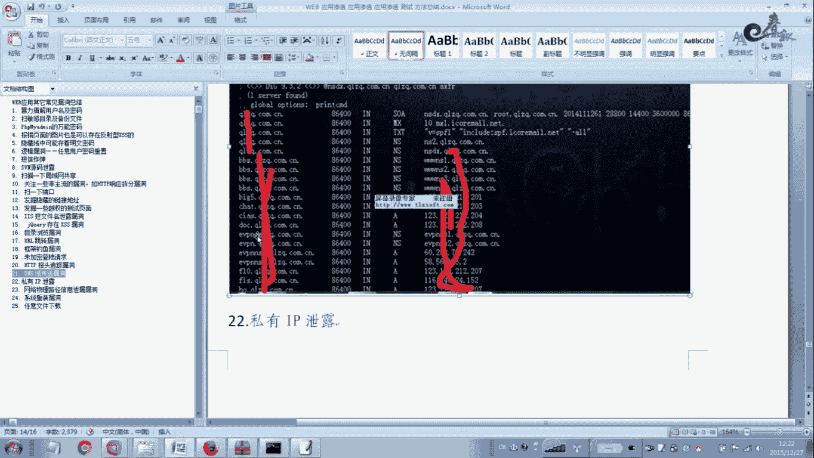

那是破解不出来。呃，接着我们来看一下信息泄露啊，信息泄露的这个。D位了。呃，关键是看他泄露的是什么信息啊。如果是账号密码对的，那么你可以上到高位。啊，包括网站这个。路径线路啊。呃。

有些能结合到注入类种攻击，拉到这个微波碎尔和服务器权限的。那么这个信息列也可以成为高物类洞。啊，也可以成为高部类的。所以高中第一根据你自己的来进行评价评估。一般这种情况是。

目标网站一般是没有对这个页面信息啊进行有效的安全过滤，或者输出到这个错误页面。啊。造成的这个信息泄露。大家可以看一下这里。那么这里的话直接泄露出来这个。内网的IP地址。我原得是直接泄露出来这个。

你像这个它直接泄露出来这个。屋里软件啊屋里软件如何这有主？那么我直接把这个。这个SP或者PSP或者脚本木码直接写入一句话，写入到这个对应的这个网站这个微博路径下面去。因为它泄露的就是这个绝对路径。啊。

绝对路径，你看这个是你那个是有说这个local2872的这个网站的一个绝对路径。系吧。还有一些系统重装内容啊，有些网站。他安装完之后啊，他没有去把这个安装文件把它删除掉。

这你是他的点PS点PSP啊这样的一些文件没有被删除。到是通过一些扫描器扫出这些漏洞，扫出这些漏洞之后啊。也可以去重新的网站城有安照。嗯。并且有的时候这个账号密码。

这个路程账号跟这个路程密码也在这个配置文件里页面里面直接显示出来的。包括数据库，这个是相当危险的。然后这个是相当危险的。当然一般情况下是这个。嗯，它是不允许你安装的，有的是程序就是为了安全这个考虑。

既算你能访问这个页面，也不允许你定级下一步安装。啊，下一步安装，为什么呢？因为他有些的时候他这个面不显示出来。系有你手么送来。啊，说明输的。但是通过这里，我们可以知道他这个。管理员是比较粗心的啊。

粗心大意啊，有些东西就是通过一些细节，就是渗透渗透渗透才质，就是通过多个细节来组合。啊，一些小漏洞组合起来会变成一个大漏洞。啊，能拿下你整个内网，说不定就是通过这些小内种。

所以细节注定成本啊细节注定成本。呃，我们接着看一下哈这个类意文件下载。那你晚件下载就是说。呃，一般是向U20提交任已知的这个文件名。可以下载文件那个到致网站敏感文件被下载。啊，这里做了一个解释。

那么这个我也是。在这个三雕这些管程中我遇的比较多的一个。遇见比较多的一个问题那种。那我看一下，我这里说的一个路径呃，发生一个pos的包，这个包呢有一个什么？fair pass啊，就是文件路径的意思。

文件路径等于我在这里发斜杠，微博点按N。嗯。微不点Xml啊后面已经重复了，应该是。啊，这个红德宽my name点微部点XML啊，应该说不是啊，是可以呃，是这样的。就发生怎样的一个包。

就可以把这个we博点叉ML下载下来。我们这个文件里面一般有这个账号密码啊数据库连接啊，网站账号密码，都么看到的账号密码都有可能在这个里面。都有可能在这个里面。包括我们会下载其他的一些文件。

康菲狗恋安这样的一些配置文件，或者或者这个。这个ETC目录的password这个嗯文件。啊，都可以进行一些下载，任意文件下载。就是说可以跨目录进行下载。啊。

一般的情议就是说能看到这个fa passfa name。这样就。文件名，那么你就直接把这个这个文件名后面加一个等于号，等于号就是后面接上我们的这个文件的物径。啊，这个文件这个路径我们一般写相对的哈。

这里我因为写了一个绝对路径哈。相对路径是点点反斜杠点点啊，这样是相对路径。相对路径绝对路径就是这么写。就是我知道这个文件在哪个目录下面，那么我就这么写。啊，是这么回事的。

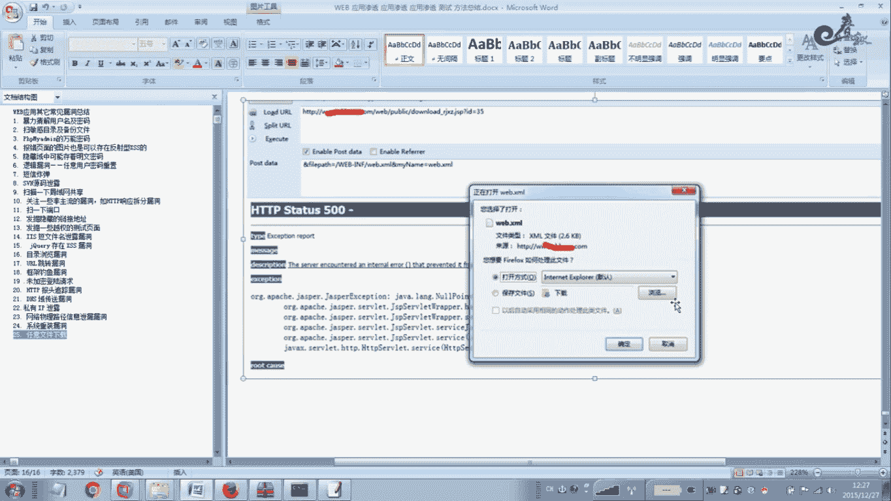

好，关于今天我们这节课。呃，大概的内容我们就讲这么多，就讲解到这里。呃，大家有什么疑问，到时候我们再进行一个讨论哈。今天就讲到这，下节课再见。

