# 经典15年i春秋渗透测试系统化教程 - P56：课时4 手机APP漏洞挖掘（下） - 老网恋教父了 - BV1n54y1B7F7

呃，我们接着讲解。呃，现在我们把这个。

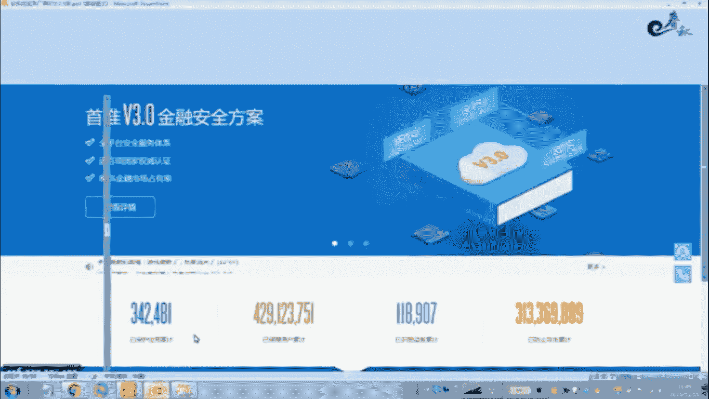

手工检测一个方法给大家说一下啊，主大概也是几个最常见的。那么关于其他的一些细节方面，大家还是用这个网上免费的一个在线平平台去检测。啊，这个平台检测我说我能达到百分之七八十啊，那种都能检测出来。好。

我们来看一下。那么首先我们讲一下它的自身的安全有反变异啊、代码混淆啊，包括其他问题啊。包括其他问题啊。呃，这一节这个PPT啊网上都有啊，我也是通过整理过来。好，我们首先看一下这个APK的反编译。

那么这边我随便准备了几个APK然，我建了一个test测试哈。啊，我们就拉这个APK给大家来检测吧。让他用他的工具。首先我们要用需要这个。啊，就用这个吧。样。用这个winRA2啊进行一个打开。

打开一个找到一个什么文件呢，叫做一个class的DEX文件就可以得到这个文件。APK多用winR2都可以打开哈，这DEX文件，然后把这个文件呢把它拖出来。拖出来之后再接受怎么样去做啊，这是第一步。

第二步呢，我们就用这个反编译啊，一款工具叫DEXRGAR这个反编译软件直接对这个文件呢进行一个编译。呃，这个用法在这里写了一下哈，很简单的。😊，Yeah。那把这个文件我们把它剪切一下啊。

剪切到哪一页这里。我把它替换一下。好，我们这里写一个PK。针对这个文件来进行反编译。

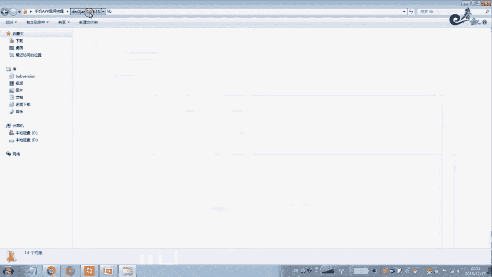

好，我们看一下哈商G这个P区里。

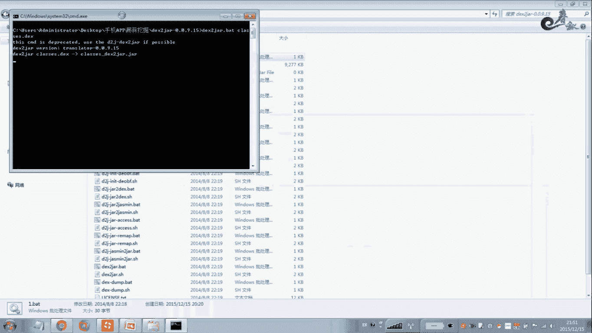

啊，它就进行一个反编译过程。お。呃，放编译过程需要等待一段时间。旁编译完之后，我们用这个呃GDGUI这款软件。直接打开这个反编译会得到一个glass啊，DDEX2GR2点GR这个文件。

那这个文件是我们仿编译的，所以用这个软件可以查看到仿编译的这个原蛋白。Okay。啊这个还没有完成哈。他直接生成在同一个目录哈。好，在这里生上完之后，就是这个文件了。那么这个文件我们需要要做的是怎么做呢？

看到一款工具。就这款工具。Oh。Oh。Yeah。好，打开它。啊，打开它之后就可以看到这个源代码源代码了，这个程序的看一下它这个代码是否进行一个加密混淆啊。你像他这种啊一般是没有进行加密混淆的啊。

一看这个就是原有的代码，这个是毫无疑问的啊，没什么太多讲解啊，这个代码是学过这个开发的啊，都都能看得懂。

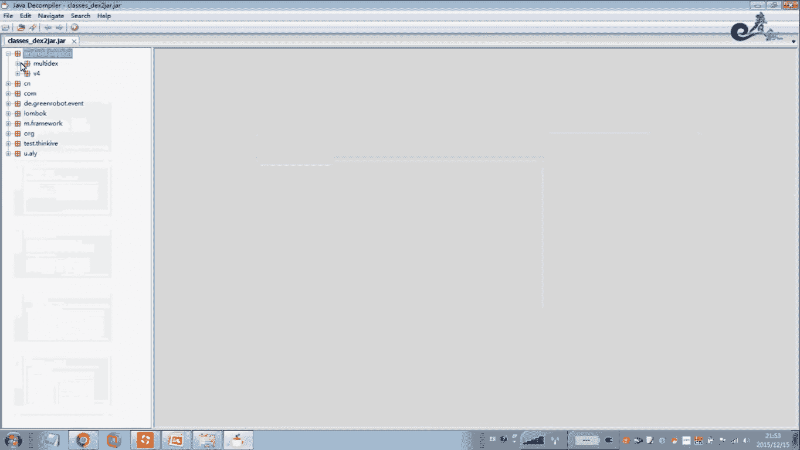

那么如果加密的它会是个什么样子嘞？它这个地方应该是有什么嗯啊这种的像这种它是进行一个蛋白混淆啊，加密的。比如说它有你像它这种蛋白混淆的。一些A是吧，用A大体AA大体AB啊。

你看不懂你你不知道他这个是什么。是吧。他全部是这种。做了一些简单的一些代码混淆哈，简单的代码混淆。那它这种就是简单的一个代码混淆。但是它有部分就是说没有去做，它就是软代码。全部放编译出来放编译出来。

那么再就是说。

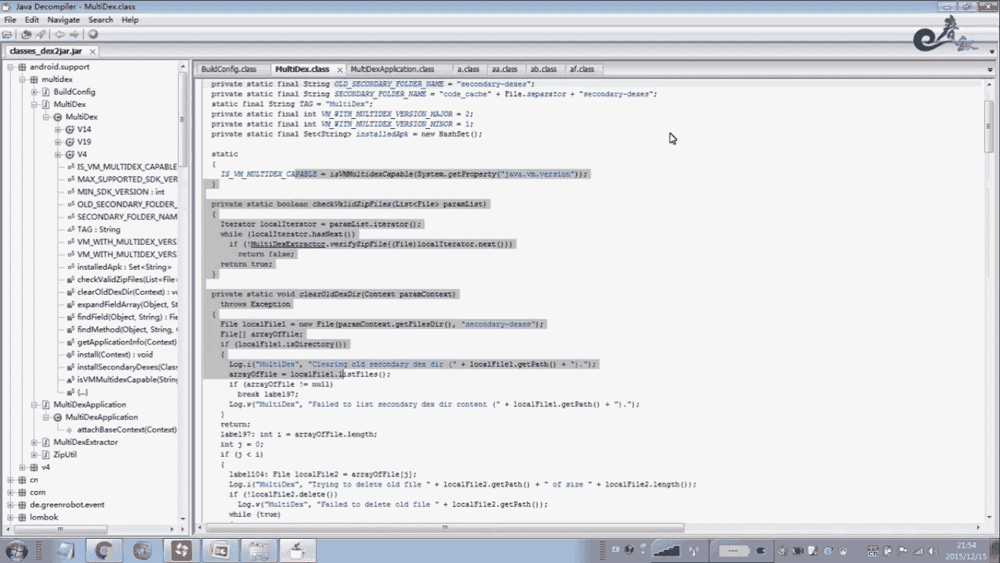

嗯，直接可以反编译反编译的过程就是这么回事。就是说我们通过反编译用工具查看它啊，看一下这里面源代码是否做了混淆啊，这是一个简单的一个过程。

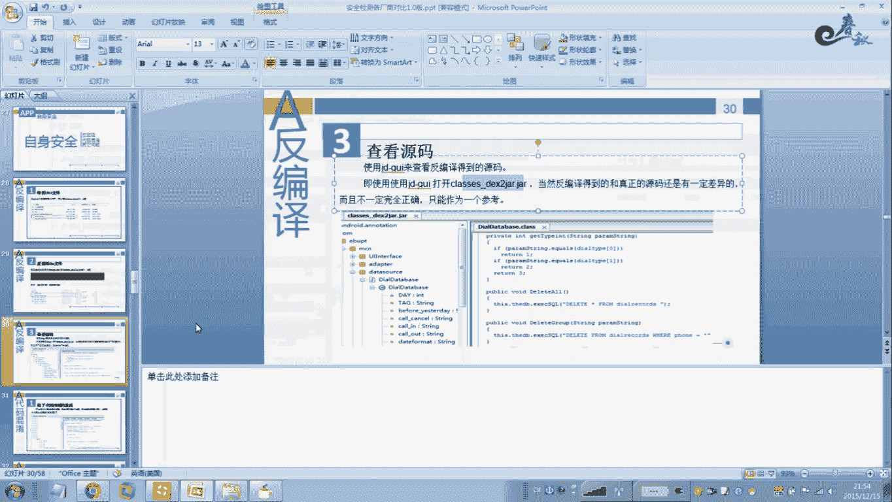

好，我们接着后面的看。如果做了软蛋码混淆，大家可以看到这张图啊，比如什么ABCDE啊这些。这样的话如果做了代码混淆，它起到一个什么作用呢？就是说你看这个源代码的话比较吃力啊，因为它的整个楼辑啊完全是。

海浪猜了。不知道他是。它的含义就是说这个代码它的一个逻辑结构是什么样子的呀，你是看不懂的，包括这个。虽以然你可以看到这个代码里面的一些变量函数，这些变量函数啊也是做了相应的这个替换处理啊。

做了相应的替换处理。这是未做的啊，全部报光啊，这个就是。原始的一个。APP代码。好，接着我们来看一下啊，另外一款就APK tour这个反编译APK啊，看它是怎么做的哈。那么这个是怎么做的一个过程呢？

我们把这个工具关闭，这里我也。打包呢把这个工具啊，就这款工具。那么这款工具我们也很简单。就改这里就行了啊，改这里后逻就是说我们。嗯，它这里有一个一个参数啊，第样是B呀，这个我们等一下试一下哈。

比如说APK文件输出的文件夹。而我们就是说把这个APK本身的APK把它复制。Okay。复制到这个软件目录。好，那么接着我们在这里这个。好。APPK。啊，这个参数是更低哈，就是软件使用的参数。呃。

记住我们在这个地方输出的文件夹，输出文件夹就是在当前目录生成一个什么文件夹？举个例子，我们就是。嗯。一样是。123吧4啊1234这个文件夹。啊，我们在这里保存一下。等，我们试一下哈。

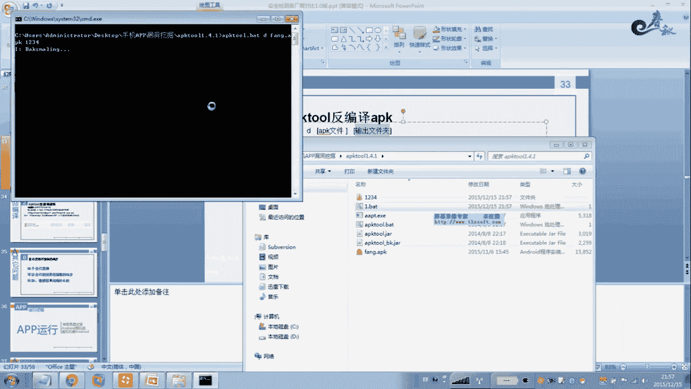

呃，这个是空的，空的话，我们这里应该就不对了。删掉。说明有点问题。呃，应该是B，那么这个参数应该是B。你们都试一下他这个参数。嗯，从这个地方有问题。那还是低吗？1234输出文件夹，1234没问题。Oh。

Yeah。我们接着讲解嗯。好，这个刚才这一个有问题啊，我把它重新拷贝到桌面上面，我先把它删掉啊。刚刚我扯了一下。换了1个APK刚才APK防边有问题。呃，换有另外1个APK就是这个APK。

大点APK那这个呢我建议大家就不要用中文目录啊，用这个。英文的目录就是说不要用中文的汉字做目录，所以说我这里用来汉字，所以反编译的时候有的时候会出问题。甚至这个ABAPK啊，有些如果加壳了的话。

它方编也反编不出来。啊，这里我们重新使用一下，这个D啊，这个参数啊，注意说D这个参数，这个是我们这个APK啊，网上下载的APK这个输输出到哪一个文件夹，1234这个文件夹。好，我们执行一下。啊。

这个时候它就啊已经放兵出来了啊，全部出来了。大家可以看一下啊，现在可以看到它的这个源代码了。啊，可以坐在这里可以看得到啊都可以看得到。他的资源文件啊、内部啊都在这里啊，都可以看得到SO文件啊。Yeah。

多样嘛。那么在这里的话，我们就大概演示的哈，是关于它里面怎么样去改，我们是另外一回事。我们不在这里做太度的去。主要是演示一下啊，能这么做，那么它就是一个漏洞啊，那么它就是一个漏洞。啊。

我们这个看一下毁编译，毁编译就是说呃经常在网上大家在官网有的一些搞攻击的人，喜欢下载别站官网的一些APK然，进行就是。对他进行二次打包。呃进在里面插入插入东西之后进行一个打包。还，打包的这个参数是一个。

B。好，我们给大家来一次二次打包吧。安装保其实很简单的哈。好，我们来看一下。他也是用了这个参用到这个工具，只改一下参数。后面就是说它这个地方要改一下，这个是1234。注意哈，就这个刚才反编译出来之后。

1234，那么我们随便在这里面任何一个文件哈，改一下，改一个东西。Oh。决定子么，我这加加几个色啊。如果我在里面。在源档里面，源代码里面加入一些恶意的代码，例如盗取这个账号密码的。

或者是钓鱼的一些网址或者一些广告插入进去之后。那么我再对他进行。打包。刚才是反编译出来的嘛，现在对这个1234里面重新打包啊打包的话，我刚才这里已经写完了。嗯。我么这里没变。我保存呢。Yeah。哦。

可以好，我们再看一下。

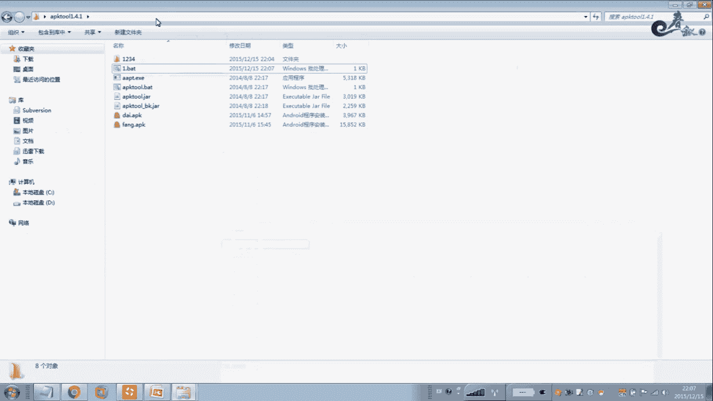

好，我们双击。好，现在他在正在打包，这对我们刚才已经修改的这个。放便宜出来的。你叫做这个打包S打包，也叫做下载的毁编译啊毁编译。打包完之后注意哈，它在这里有一个吻。会产生一个文件。1个APK文件。

后面这个APK文件我们在这里。稍等一下啊，它在这里就在这个文件夹下面。

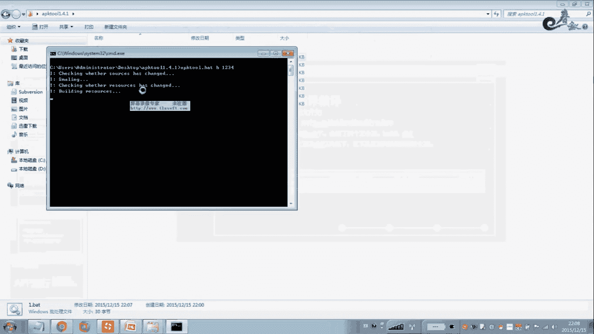

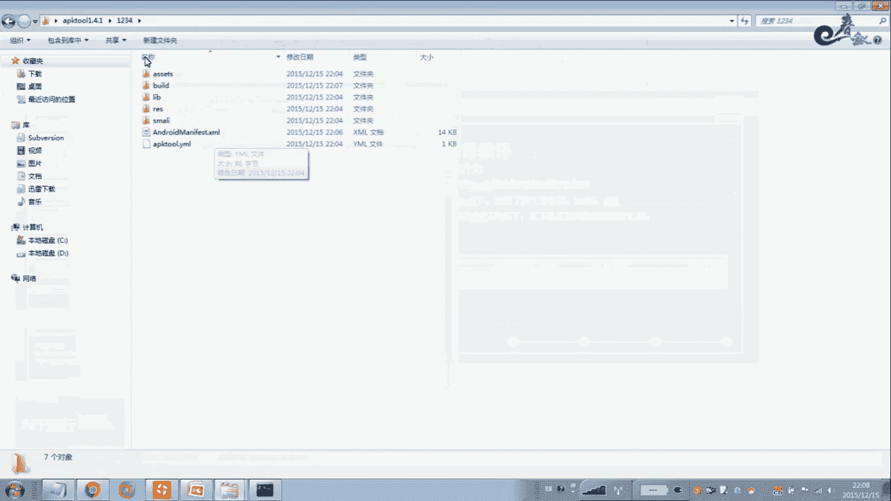

Oh。他现在还没打包完才。

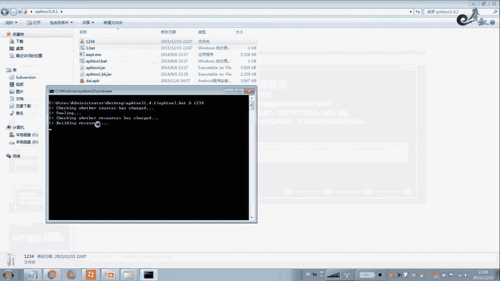

我让他打包吧，我们不管。好，后面关于这个。其他的一些漏段，比如说。我们在这里。

对呀刚才我用艾加密不是在扫描过程吗？扫描的时候就是扫描它会在官方网站，就是你上传1个APK上去之后，在官方网站下载下来有一波报告嘛。这个报告就是你当前APK的一些安全性。通过这些安全性的例如，举个例子。

Aiv安全这个权限更记检测。如果它存在漏洞，它告诉你这个ocive这个组件，这几行代码有有漏障，那么你需要进行一个什么？给他进行修改，怎么修改来，他告诉你。元旦呃这个拿一个文件，就是这个文件。

这个文件里面OTV这个配置信息。Sa来 with force。嗯。要么它s the force应该是你是为脆的还是危险的。那么你需要修改下啊对它进行修改。他都会告诉你啊，他有一个详细的一个导出。

包括其他的一些注解啊，怎么样去修改？啊，中位高位啊这些阶段已经做安全丢失了。就是说通过这个报告检测出来，检测出来是高位的或者中位的，你都对应它这个详细的一个模拟演示啊。模拟演示去调你的代码啊。

去改你的代码，就按照它的这个模拟演示建议的这个处理结果。建议去进行对代码进行做安全啊进行做安全。那么大概就这样的过程。好，我们现在这个地方已经完成了。好，我们完成之后，我们在这里看一下啊。

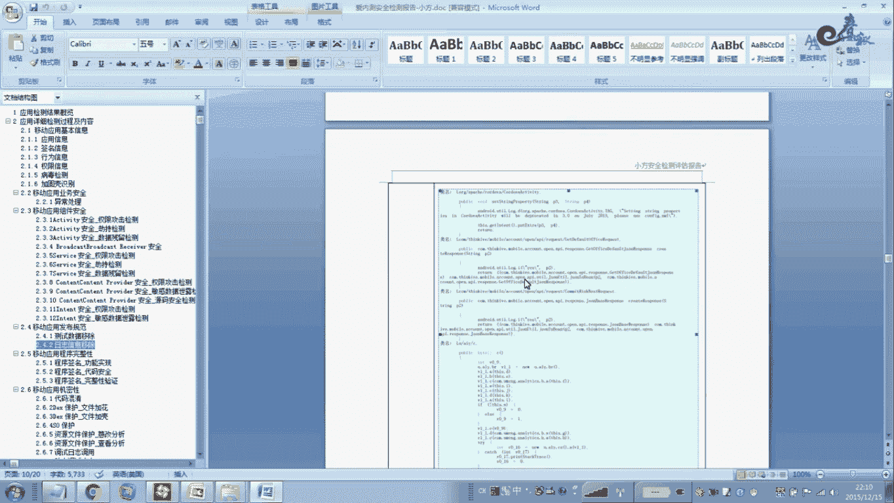

Yeah。嗯，它这里有一个dis多了一个dis啊，dis啊不是dis啊，disEIST那么这个文件夹就是说我们二次打包之后。就毁编译之后啊，你叫毁编译吧，就就叫毁编译吧。

毁编译之后进行一个最终的1个APPK。那么把这个这个就是我们刚才修改过的。啊，你可以在里面加入一些代码啊，一些后买，一些植入一些广告都可以。你再把这个APK上传到网上，然后别的下载。

那每次在手机上运行这些APK它里面应用的时候都会加载你的广告，这个是比较危险的啊，包括一些后门程序。所以说它这个就是漏洞啊。

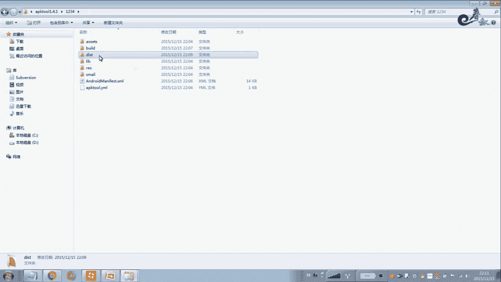

所以说APK它这个自身的这个安全啊，就是是相当于钓鱼绑绑后满一样。啊，就是说不像微博一样，直接就是说拉这个数据。啊，拿数据库就把你的服务器控制了啊，这个不一样的哈啊不一样。😊，这一点大家注意一下。好。

现在我们来看一下它这个APAPP的这个交互式的样票。呃，交互式的安全其实是跟微博渗透一样。那么讲这个交互式安全之前，我们教大家设置一下这个BRP啊，一般我们用到的最多的一款软件也是BRP。

进行调试内动啊，包括注路夸站都可以调试。那么怎么样去做嘞？首先打开你的。BIP。然，对手机一个监听，在手机设一个代理啊，那么这个我我教大家怎么去设置啊。在这个地方。

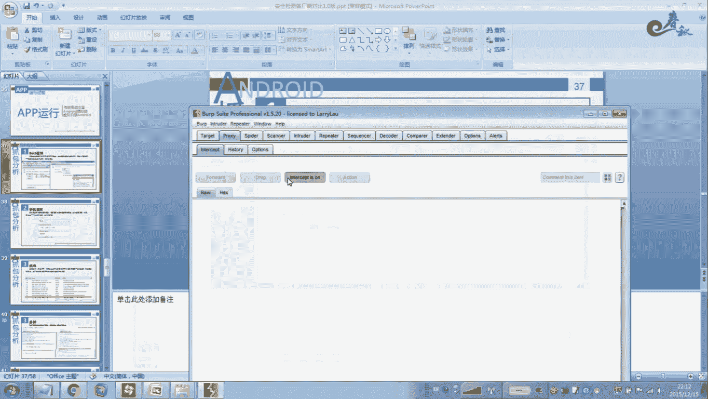

查看一下你的本机IP地址。

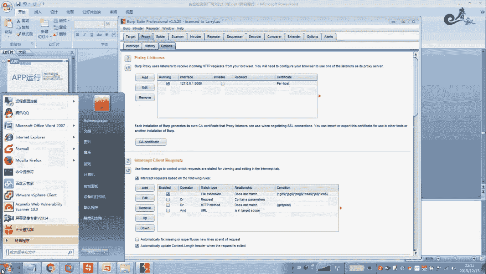

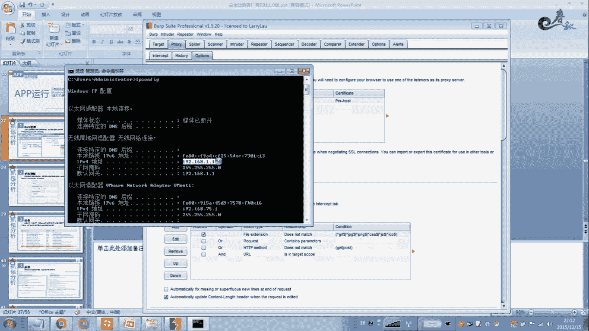

嗯。我帮给为8个8吧，是吧，可以吧？呃，这个地方选104好，OK把这个127去掉。那么这个代理就设好了。就是说我们在这个本机做这个代理啊，手机通过这个我这个电脑这个192。1681。

104这个888这个端给它进行访问。这样的话我在这BIRP开启代理之后，手机访问，那么手机访问了这个网站的所有数据包，我用BIRP全部拦截下来。啊，完解下来明白没有？是这样的一个过程。那么我看一下哈。

我现在呢我现在来设置一下手机，手机怎么设置呢？啊，这里加了一张图。好，我拿着手机来试一下。呃，我这个地方已经睡好了。我已经睡好了。把这个CIP好，这个手机CIP这个地方就是直接在这个。呃。

代理服务器这个就是说这个无线上网啊，你的无线上网这个地方。呃，连接这个。把它的代理 set成你这个当前这个BRIRP的这个。代地址当个是888就行了。好。有的人啊有的人你就是说有的学员会出现一种情况。

一种什么样的情况呢？嗯，手机这家代理也是不能。就是你设置到你这个电脑上的这个IP地址是IP地址啊。卸载来之后也不能上网，也也就是说抓不到数据包。这个BOIRP啊，这个软件已经抓到数据包了。啊。

已经拿你抓到水里边了。也是不行的它不行原因在哪里呢？注意哈，尤其是H抓HTTPS的吧。比如说这种画念，那么HTTPS。

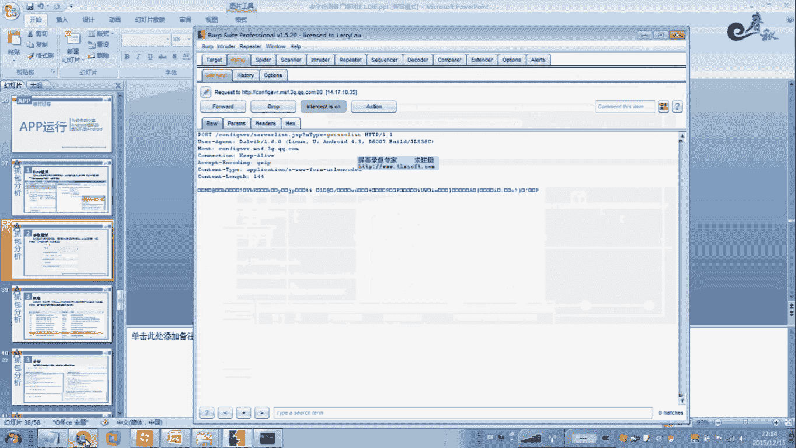

Yeah。

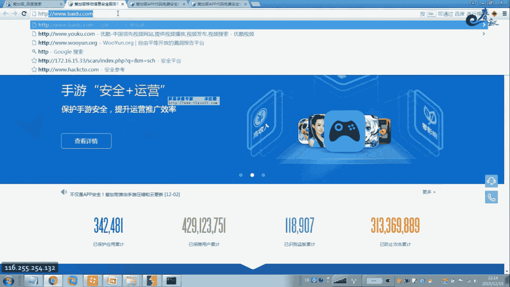

百度。Thank account。

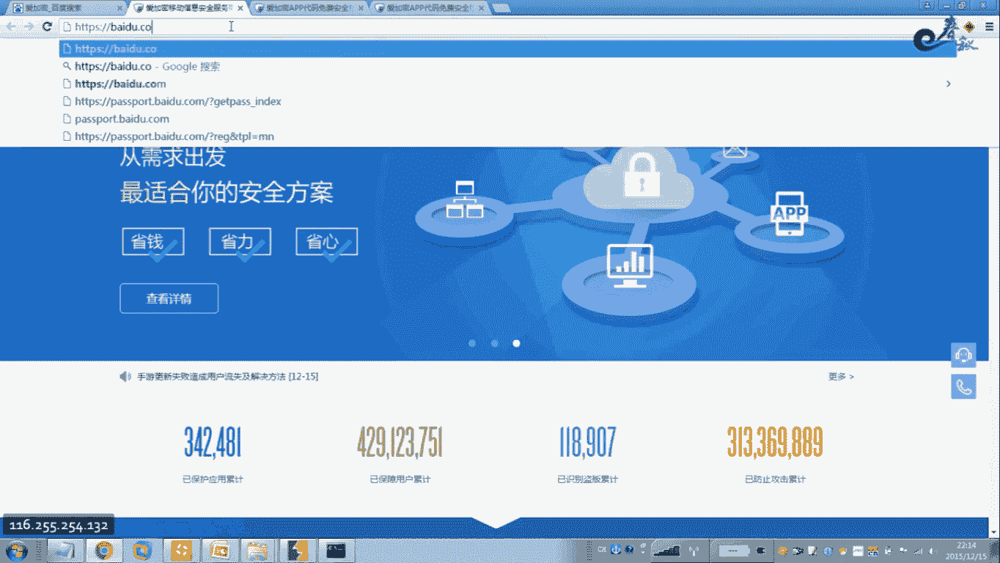

啊，这种包他抓不到。啊BRP没抓到，或者是说连HDTB的包也抓不到。不像我这里我这人都能抓哈，但有的人会抓不到，抓不到是原因为什么呢？我在这里说一下哈，注意。168点FP地址是。

104。

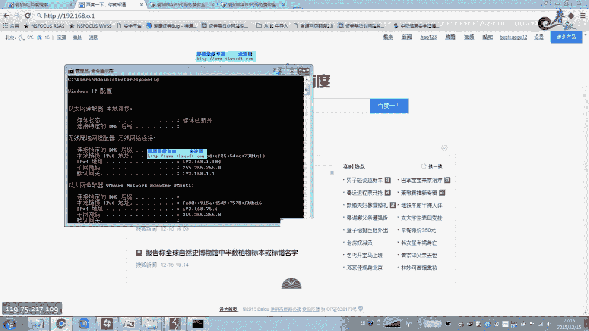

お。嗯。写错了。这个是1。104。这个就是我们这个代理的哈。这个地方。对。Yeah。稍等一下。嗯，怎么打不开？这个是BRRP的这个一个证书。Yeah。

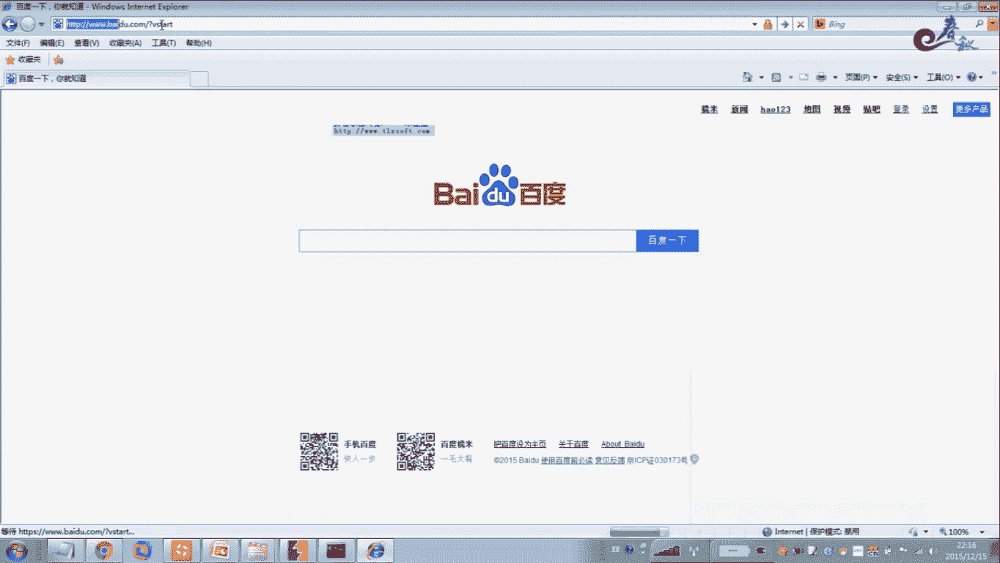

哎，这个地方怎么变了这个？好，在这个地方打开之后有一个什么CI证书，再把这个证书你下载下来，保存一下。这份书CACERT点DER把这个扩展名改一下哈。DER改成CER和D改成C保存的时候。

那么这里我也打包一个证书，这个是年装BUIP它就有这个功能。嗯。把这个证书就是用手机把这个地址打开之后啊，把这个证书下载到手机里面去。

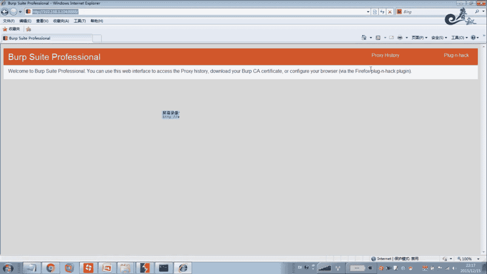

听清楚了哦。我这里已经给了大家一个啊CRT也可以，CER2也可以。啊，要把C改成D，把这个D改成改成C这一点大家一定要记住，就把这个放在手机里面，手机里面之后运行它倒入倒入到手机里面去。

这样的话就可以进行抓取这个HTTPSHTTP列包，不然你有的时候你就BRRP抓包抓不到。呃，这个是在你的手机里面，应该是s置里面啊，这个C里面有一个。呃，有一个功能叫做安全雨椅。

隐私安全与隐私这个地方有一个。后面有一个受信赖的这个凭据。啊，受信赖的凭据。哎呀好像下面有一个功能叫是从程序设备安装证书啊，也就是我们找到从程序设设备安装证书这个地方点一下就可以安装。

BRP这个证书首先前提条件，你要在手机上面把这个证证书复制到手机里面去啊，在在在手机里面找到这个从程序设备安装这个功能去安装这个证书，安装完之后。那么你就抓HTTP跟HTTPS的包就不会有问题了啊。

不会有问题的，就彻底解决了这个问题啊，这是很多人问到的一个问题，怎么去解决。那么我在这里说一下哈。啊，结着我们在这里带一下啊，现在我给大家我用我的手机哦，稍等一下，我用手机打开。网站。啊。

现在已经打开了。我的用的是oppo的手机啊，oppo的现在我把它转发掉。啊，现在我再稍等，我再接接着点一下啊，这个这个首页比较多的有。点一下这个京东。嗯。看一下啊，京东西已经okK了是吧？

有京东的网上京东点com。把手机打开咋，随便打开一个咋。那么我们怎么样去测测试这个漏洞？我们在这里来告诉大家，就是说交互式的那种测检测，把它发送到这个replay。在这个地方来了。

那这里我们离路楼楼辑那一段，我们加对里啊，加单引号啊，这个地方加个单引号查选，看是否有问题是吧？啊，302有5哎，这个地方应该不存在是哦，我不加单引号啊。啊，他是个跳转啊，它是一个跳转。我不加大一行。

也是跳转，你让它这个页面有个跳转，打开这个页面跳转到另外一个页面3。2。就说我们在这个地方改参数，跟我们楼级漏段啊，或者调筑啊，调光张啊，都可以在这里来做啊啊，我们上这里插入夸张代码，看能不能弹窗。

或者是说我们在这里嗯其他的一些字档啊，那括就式字段这个用户名言密码是否名文传输啊，是否加密的啊。可就是啊，我们。测一下，例如同样的用户名，我们测一下，看是否抱住这个返回的数据包里面有一些。

用户的一些敏感信息啊。我们都可以在这里来进行一个。replay啊repay。来进行一个调试啊，在这个功面上面。这个离配这个功能是比较强大的，我就是几乎就是说每次都会用啊，挑一些漏洞的时候。

挑猪啊、炒锅杖，还有挑命令执行啊，都可以在这里来来完成啊，都可以来完成。啊在这里我就不再做太多的讲解，主要是教大家一些方法。Yeah。呃，接着同时我们在这里也可以发送到这个什么。扫描里面爵士康里面。啊。

也可以爬行，也可以都可以啊，你们可以发送一下。在这里栏进行一个扫描。啊。扫描内种。啊，他在这里他就会告诉你看他在这里有一些。一个扫描检测过程。你看他正在省了一个请求数量400多万。啊，完成60%。

这是一些结果。啊这后应该中位高危流动下，他都会在这里告诉你。它这个VIP的扫描也会一样，扫多入扫夸张都可以检测出来一些常见的那容。但是我们我告诉大家所说的一点，它这个BIP我一直强调。

它的扫描功能没有什么APP看啊。嗯，我可打个啊。微波鹰皮克车安恒吕蒙的一些你像安恒的一些文件啊，吕门WVSS一些扫描器的功能那么强大。那么我们如果要用其他的扫描器去扫这个手手机这一块的一些网站。

就是APP。啊，因为这个。移动这些网站啊，这些网站就是说我们直接用这个电脑去打开，你是打不开的这一点是毫无疑问的。我们必须要用手机才能访问。那么这就像这种厂，我们可以装一个插件。

在在PPT这后面我给到大家一个网址。要装一下火狐这个插件。这里我就不该做太多的讲解了。嗯。

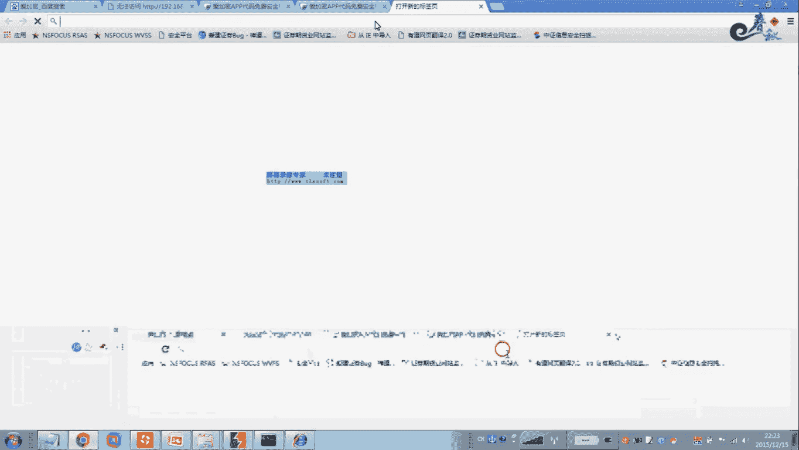

要在火狐里面装一个插件，就是在你打开你的火狐浏览器。

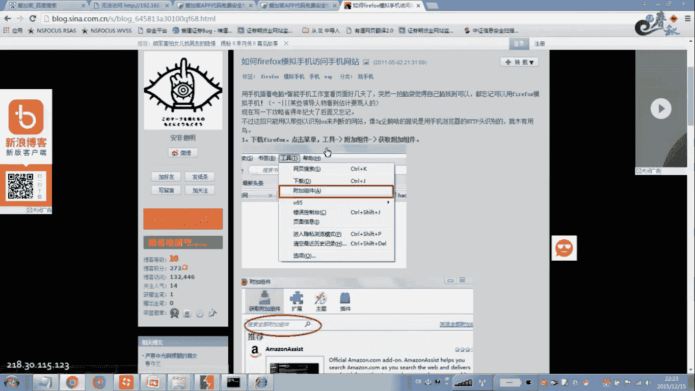

大概大概给大家说一下哈。Oh。你像APPcom扫安卓的IOS的都可以扫啊。APPcom有这个功能可以扫，这一点毫无疑问。大家可以看一下APPcom的一些说明啊，说明文档。

附加组件。

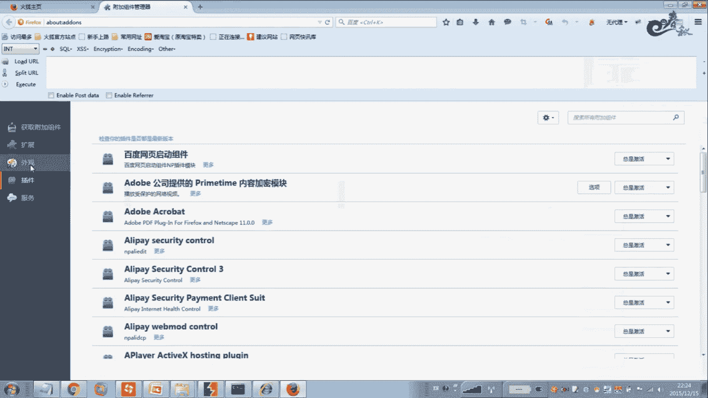

啊，咱了他的附加组件之后。进入这里在这里搜索不能里面，搜索不能搜哪几个组件呢，在这里写了一下。

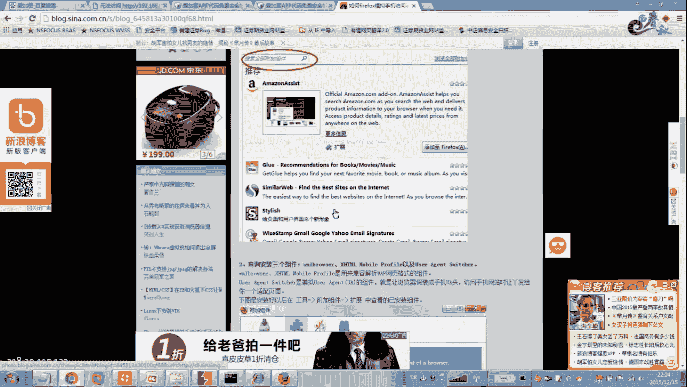

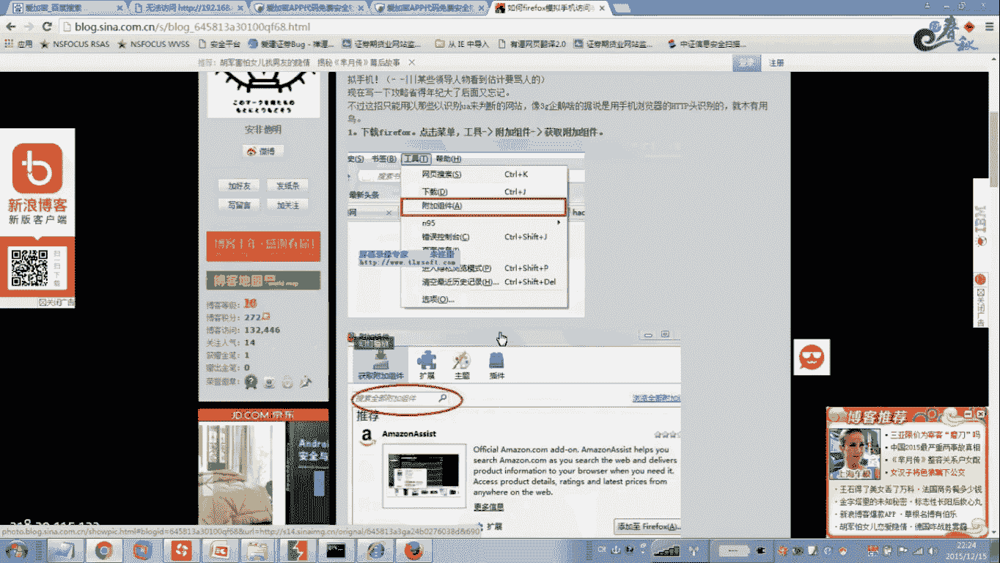

有这几个主页。啊，右手。agent啊switch这个组件还有VML。BROWSER这些流览的一些组件，包括其他的一些组件。那么这三个组件大家把啊。这三个组件把它进行一个下载，安装一下。

在火狐里面安装完之后重启一下火狐火狐浏览器，再设置一下啊，按照它的这个设置啊，在根在这个工具里面啊这个beforus。

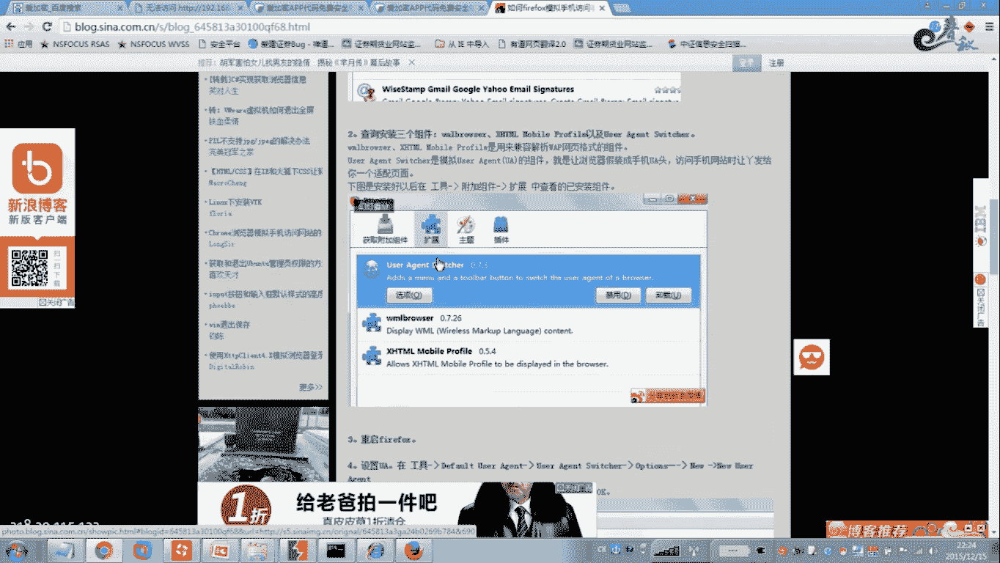

agent再打到这找到这个opposition里面new啊，new这个再是us右。

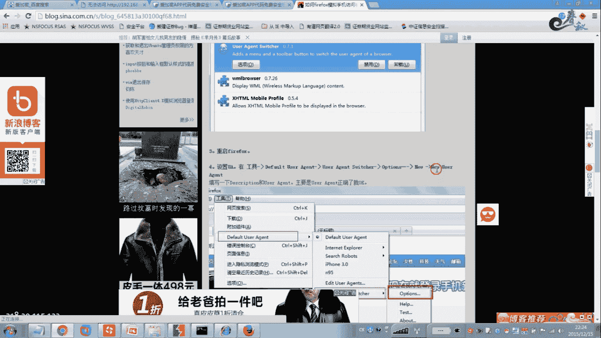

A跟找到这个功能啊，找到这个功能，它这里有什么苹果的，有安卓的，在这就可以选择，主要是这个设置这个。啊，you改这个user agent啊，找到这个选项，这个选一个op上了，找到它之后。

在这里新建一个新建之后，它对于填上你的UA名称。

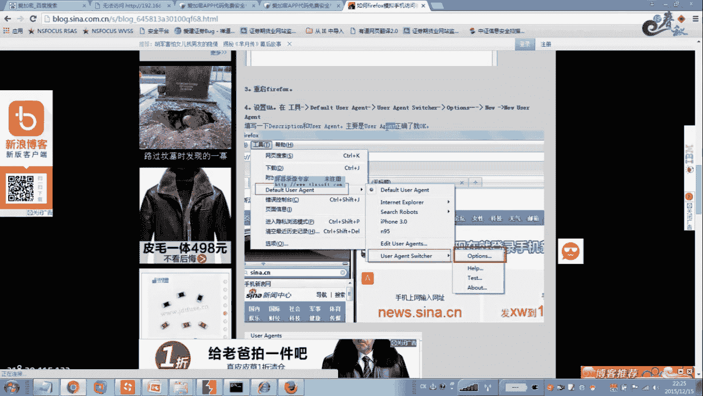

哎有位名称。再写写一下UA的一个填写处这些地方信息。那么这个信息呢在这里给了你啊。这几个常用的。啊，就是一个伪造号。一个伪造，这里认为是N95的，那么他这里给了你，你按照它进行一个伪造。伪造之后。

那么你再打开网站，那么它就模拟手机一样，你手机一样，看是吧？比较方便。

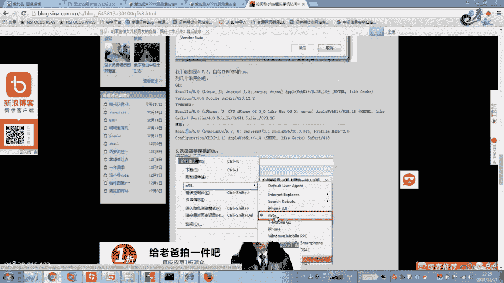

他默认这里也提供了很多哈。每吃可以倒入大量的。

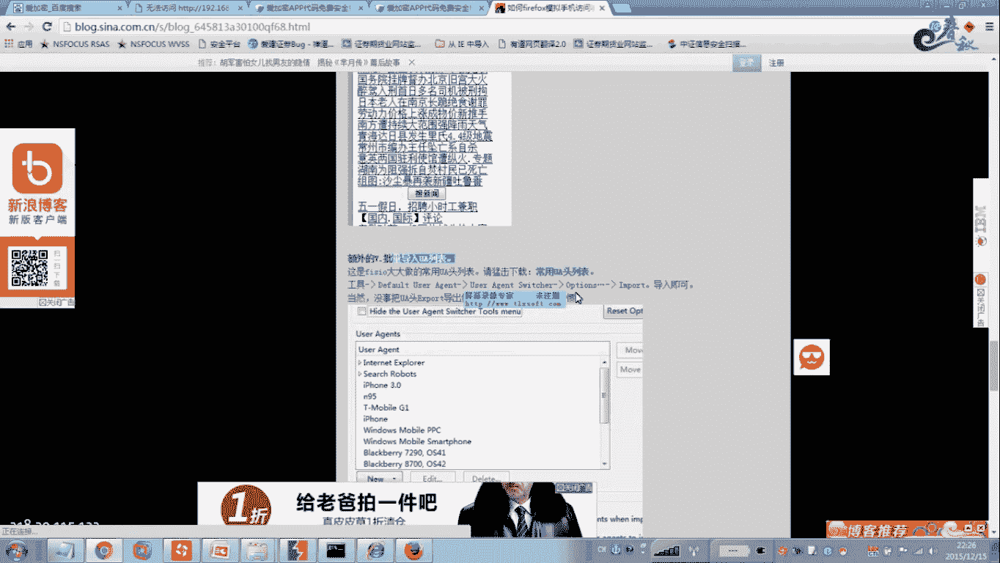

但那关于这个coon也是一样的，也可以这么做。大家自己去模拟一下，就是说你模拟之后它打开是这种的，你大家可以看一下。

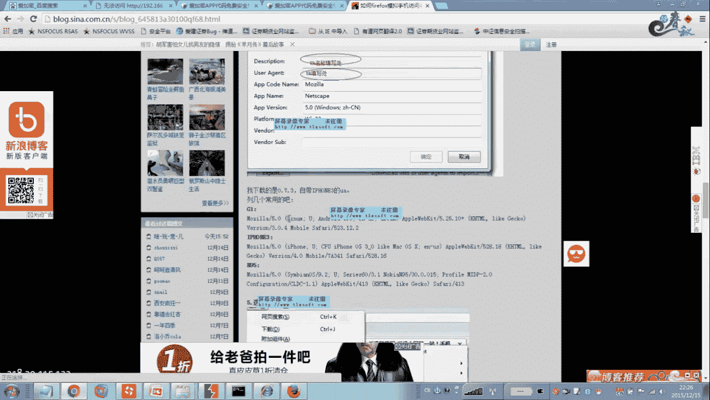

啊，大家可以看到这种情况跟手机一样的浏览新闻。那么这这个时候你再用这个AWS其他的一些去扫描，找到插件之后，你再去扫描，这样的话就可以扫描到了。当然你用BIRP也可以啊，这种方式也可以扫扫那种。

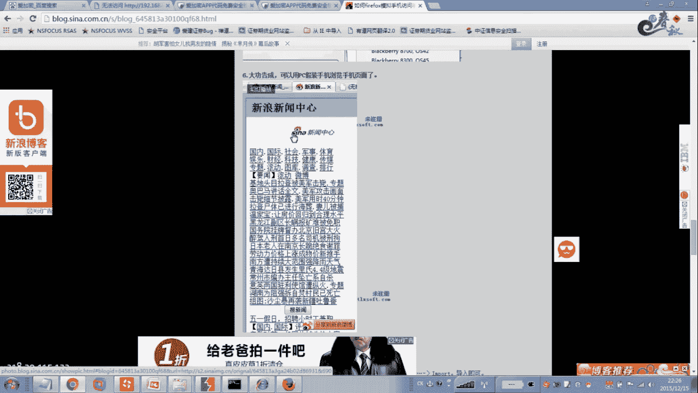

，但是说我说过他这个扫描功业模块比较弱，但是一般我调节逻辑来的话，一些暴力破解啊，但是它这个这个是没有任何问题的。啊，主要是说一下啊。呃，在这一块我就不再做太多的讲解，主要是讲把这个方法说到了就行。啊。

嗯这着我们在后面把这个其他的讲一下。Yeah。关于这个模拟器这个说一下，就是说在这个PC机上面，嗯，这个也是我们做这个APK这个本身在安全的时候会用的。有的时候会用。那一般的情况下。

这一块还是现在都是在这个。手机上面去模拟了真实的一个手机上面装在手机上面去测测试一些漏洞啊，抓包各方面一些分析。呃，不呃一般不会在模拟器上面去做啊，真正的去做。但是有的时候会用到啊模拟器。

所以我在这里也说一下，就是说把这个本来是在手机上用的APK软件放在这个我们的PCG上面来运习。啊，这个也是可以做到的。那么用到的软件是这个这款软件靠谱助手。大家在百度里面输入靠谱助手就可以下载啊。

这里我下载了以后啊，下载以后呢在这个装这个模拟器。啊，还没有启动。哦，我把这个重启一下模拟器啊。我正在正在运行啊，启动之中。嗯，怎么启动了半天没充启。嗯。我们重新打开一下。Yeah。

因为跟这个显卡有关系。这款软件就是说把APK这些软件放在这个软件里面运行，就是跟这个玩手机一样。本来一些软件像这些APK只能在手机上安装，在PCG上面是安装不了的。

现在我们就是说通过靠谱助手把这些APK软件。呃，上传到这个模拟器上面来运行。这在电脑就是就相当于在电脑上运行一样的。Yeah。Oh。Oh。Oh。Yeah。因我这个运醒运行半天没运行起。稍等一下。啊。

已经院行了哈，我们在这里说一下啊呃。😊，呃，这个就是说你在这个地方一共有4个引擎，这四个引擎就是根据你自己情况随便安装一个。它这里对一些显卡有一定的要求，这个显卡特别低。啊。

所以说他有些地方应该有点功能。啊，在这里可以设置哈，那么这个无所谓啊。说一下这个A为什么启动不起来。你没启动起来。呃，在这个首先就是安把这个靠谱助册在网上下载下来之后，安装完，安装完之后。

在这个引擎管理把它启动一安装安装完，重启一下，重启完之后，在我的这个应用这个里面安装本地这个APK。然后这个APK我们在这里嗯我刚开始。打开打开之后就显定你安装在哪个引擎上面。那么这个引擎的话。

我举例子我嗯这个是。所以就这个吧。哦，哎，不好意思。应该放在这个引擎上面来练习。你点哦不在这个隐形吧。那这个年字。天天模拟器天天模拟器1。2点。哦，我就用这个。他推荐了一个在家这个引擎。啊，我们这个。

选择这个确定安装。好，那么这个时候就正在一个安装过程中。安装中，那么在这个安装等一下，它就会安装完了。安装完之后，那么我就双击在这里可以打开运行，运行去了之后就跟这个手机上是一样的啊。

手机上是一样一样的。啊，正在一个安装小小，他告诉你，小方正在安装中啊，请稍请稍等。啊，现在已经安装完了，你看安装完之后啊，那么你在这里可以启动。在安装还在安装。明天约远星期吧。注意哈。

它这个AP它这个安装完之后，不一定就百分之百在这里能启动。它有的做了一个在仿末音器院行啊，有的有可能。嗯。啊，这正在运行，正在安装就是，稍等那还在安装中。你经安装网呢。好，我们不用管它吧。

就是说打开之后跟手机上是一样的，我这里半半天还没反应。我们接着下呃下面的讲解。你看一下这里哈，他别人QQ啊都可以运行。安装完之后可以重启一下引擎啊，就可以直接启动这个APP。

所以这个地方我们这个地方什的星级都无所谓的了。Yeah。Yeah。还有一个方法就是说啊通过寻机的方式。那么这个有一个系统，就针对安卓的安卓单独有一个系统。就这个系统。那系统等一下，我会打包给大家。

不要操作系统。ISO那么这个比如说你把你的软件拖到这个安卓的这个系统里面，用这个系统里面来运行你的这个。

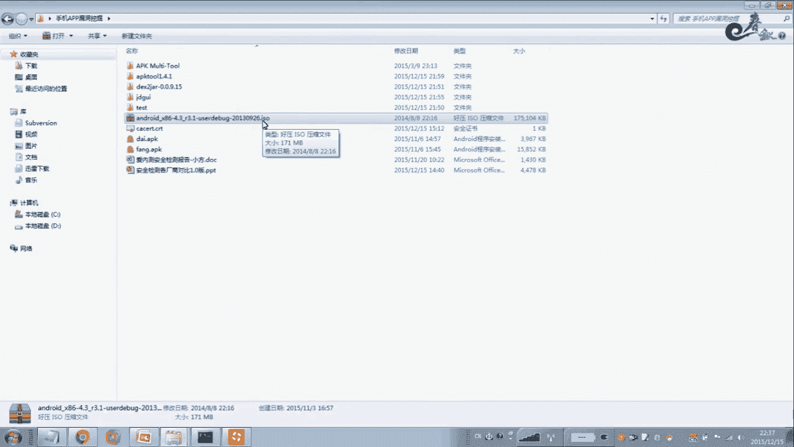

APK文件。这边呢相当于我们你看一下啊。它安装完之后就是这种样子。这个是一个安装过程。嗯，你直接把这个呃已经安装失败了，这个安装有问题，是小风单，它提示小封安装失败。好，那么这个说明了一个问题啊。

这个小方这个嗯这个安装这个东西还是存在问题。比如说这个安装。大家还是用这个吧。用这个安卓的这个叉86的。就装在虚拟机里面啊，这个这个功能是比较强大的啊，相当强大。把这个。拖到把这个APK拖到这个。

这个系统上面来进行一个安装，跟我们本地电脑安装软件一样。相当方便。那么这个需要安装系统哈，这个安装系统跟张妮呢该茨系统一样的方法。那么在这里我就不装了啊，只是给大家说一下啊，把工据我会打包给大家。好。

关于今天这节课我们的内容大概就讲了这么多。也就是给大家过来一遍这个移动APP的这个检测的一些方法啊，包括这个本地运行。嗯，具体的还有很多一些细节方面没讲到啊，就是只是讲了一个框架性的，就是大概一个流程。

知道怎么以后做怎么怎样去做这个APP安全啊，具体的一些就是说详细的一些嗯像微博三周测试一样啊，怎么去写封啊这个。还是要靠大家自己去自学啊，包括今后或者有时间的话，再去出一些说一整套的教材吧。

一讲节课是不可能把APP这些安全性全部讲方面，全部讲完。好，我们就讲到这里吧啊，有什么问题，到时候我们在线上课的时候再讲解。

